\usepackage{wasysym}
\usepackage{eurosym}
```{=html}
<!-- Φόρτωση βιβλιοθήκης GeoGebra -->
<script src="https://www.geogebra.org/apps/deployggb.js"></script>

<!-- Συνάρτηση δημιουργίας applets -->
<script>
function createGeoGebra(containerId, materialId, width = 700, height = 500) {
  var params = {
    "id": "ggb-" + containerId,
    "material_id": materialId,
    "width": width,
    "height": height,
    "showToolBar": true,
    "showMenuBar": false,
    "showAlgebraInput": true
  };
  
  var applet = new GGBApplet(params, '5.2');
  applet.inject(containerId);
}
</script>
```

## Εμβαδόν επίπεδης επιφάνειας.

Δίνονται δύο ορθογώνια τρίγωνα με κάθετες πλευρές 6 cm και ένα τετράγωνο πλευράς 6 cm.
Μπορείτε χρησιμοποιώντας τα τρία αυτά σχήματα να κατασκευάσετε νέα σχήματα ίδιου εμβαδού;

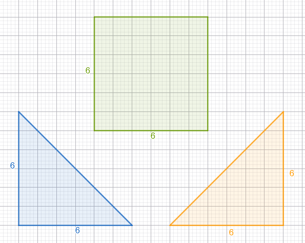

Εάν χρησιμοποιήσουμε σαν μονάδα μέτρησης το τετραγωνάκι 1 cm^2^ θα έχουμε:

1.  Εμβαδόν κάθε τριγώνου Ε~τριγώνου~ =18 cm^2^
2.  Εμβαδόν τετραγώνου Ε~τετραγώνου~ =36 cm^2^

Αρα συνολικό εμβαδόν νέων σχημάτων Ε~νέων σχημάτων~ =18+18+36=72 cm^2^

**Κατασκευή νέων σχημάτων**

1.  Μπορούμε να κατασκευάσουμε ένα ορθογώνιο με βάση 12 και ύψος 6\
    \
    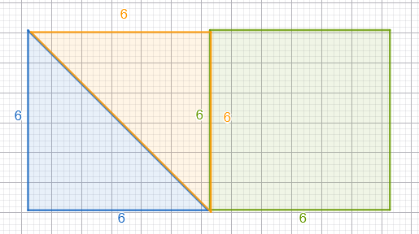
2.  Μπορούμε να κατασκευάσουμε ένα παραλληλόγραμμο με βάση 12 και ύψος 6\
    \
    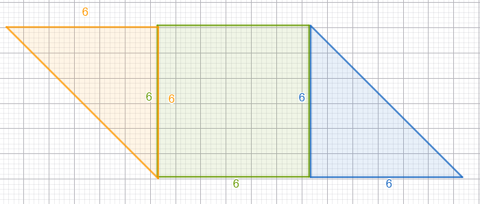
3.  και ένα ορθογώνιο τρίγωνο με κάθετες πλευρές 12 cm\
    \
    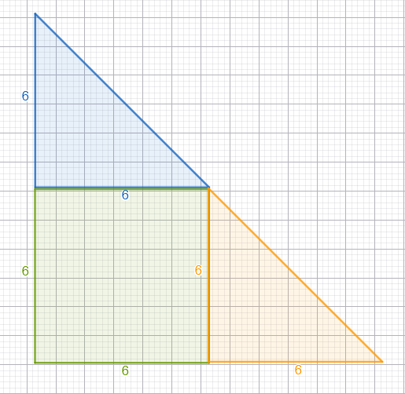
4.  Μπορείτε να κατασκευάσετε και ένα τραπέζιο με το ίδιο εμβαδό;

::: {style="background-color: #f0f8cc; border: 2px solid #2f3e50; color: #25188a; padding: 15px; border-radius: 5px;"}
Το **εμβαδόν** μιας επίπεδης επιφάνειας είναι ένας θετικός αριθμός που εκφράζει την έκταση που καταλαμβάνει η επιφάνεια αυτή στο επίπεδο.
Ο αριθμός αυτός προκύπτει από τη σύγκριση της επιφάνειας με μια καθορισμένη **μονάδα μέτρησης**.

### Θεωρία μέσα από παραδείγματα

1.  **Ίσο εμβαδόν σε διαφορετικά σχήματα:** Φαντάσου ένα τετράγωνο και δύο ίσα ορθογώνια τρίγωνα. Αν τα ενώσεις με διαφορετικούς τρόπους, μπορείς να σχηματίσεις ένα μεγάλο ορθογώνιο, ένα τραπέζιο ή ένα μεγάλο τρίγωνο. Παρόλο που τα σχήματα διαφέρουν, καταλαμβάνουν την ίδια έκταση (έχουν το ίδιο εμβαδόν), επειδή αποτελούνται από τα ίδια ακριβώς στοιχεία. [**Δες τα σχήματα παραπάνω**]{style="color: brown"}
2.  **Μέτρηση με «τετραγωνάκια»:** Αν χωρίσουμε ένα τετράγωνο πλευράς 5 cm σε μικρότερα τετραγωνάκια πλευράς 1 cm, θα δούμε ότι χωράνε ακριβώς $5 \cdot 5 = 25$ τέτοια κομμάτια. Άρα το εμβαδόν του είναι $25\text{ cm}^2$.
3.  **Μονάδες Μέτρησης:** Ως βασική μονάδα χρησιμοποιούμε το **τετραγωνικό μέτρο (**$m^2$), που είναι το εμβαδόν ενός τετραγώνου με πλευρά 1 μέτρο.
:::

### Εξασκήσου

1.  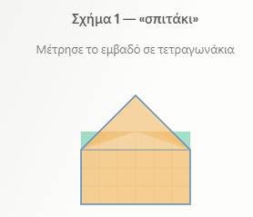

2.  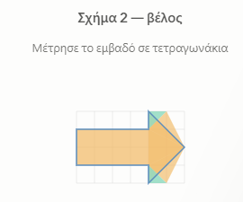

3.  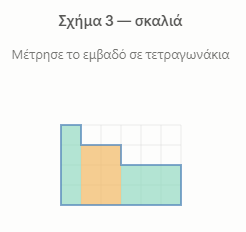

4.  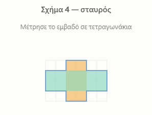

- Μετρήστε και το εμβαδόν με τριγωνάκια=μισό τετραγωνάκι

- και με ορθογώνια =2 τετργωνάκια.
  συγκρίνετε όλα τα αποτελέσματα και από τις τρεις μετρήσεις .
  Πως δικαιολογείτε τα αποτελέσματα;

### Ασκήσεις

1.  Να υπολογίσετε το εμβαδόν των παρακάτω σχημάτων με μονάδα μέτρησης ενα τετραγωνάκι.\
    \
    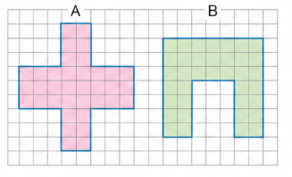
2.   Να υπολογίσετε το εμβαδόν των παρακάτω σχημάτων με μονάδα μέτρησης ενα τετραγωνάκι.\
    \
    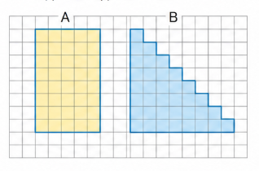
3.  Να υπολογίσετε το εμβαδόν των παρακάτω σχημάτων με μονάδα μέτρησης ενα τετραγωνάκι.\
    \
    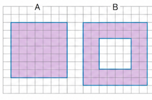
4.   Να υπολογίσετε το εμβαδόν του παρακάτω σχήματος με μονάδα μέτρησης ενα τριγωνάκι.\
    \
    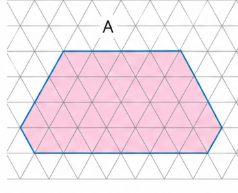
5.   Να υπολογίσετε το εμβαδόν των παρακάτω σχημάτων με μονάδα μέτρησης ενα τετραγωνάκι.\
    \
    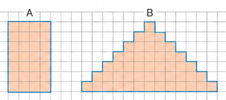
6.   Να υπολογίσετε το εμβαδόν του παρακάτω σχήματος με μονάδα μέτρησης ενα τριγωνάκι.\
    \
    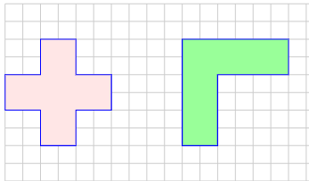


::: callout-important
:::

::: {style="background-color: #f0f8cc; border: 2px solid #2f3e50; color: #25188a; padding: 15px; border-radius: 5px;"}
ΚΑΛΗ ΜΕΛΕΤΗ !
:::


