\usepackage{wasysym}
\usepackage{eurosym}
```{=html}
<!-- Φόρτωση βιβλιοθήκης GeoGebra -->
<script src="https://www.geogebra.org/apps/deployggb.js"></script>

<!-- Συνάρτηση δημιουργίας applets -->
<script>
function createGeoGebra(containerId, materialId, width = 700, height = 500) {
  var params = {
    "id": "ggb-" + containerId,
    "material_id": materialId,
    "width": width,
    "height": height,
    "showToolBar": true,
    "showMenuBar": false,
    "showAlgebraInput": true
  };
  
  var applet = new GGBApplet(params, '5.2');
  applet.inject(containerId);
}
</script>
```

## Εμβαδόν επίπεδης επιφάνειας.

::: {style="background-color: #c682d9; border: 2px solid #2f3e50; color: #171426; padding: 15px; border-radius: 5px;"}
### **Θεωρία και Ορισμοί**

- **Μέτρηση Επιφάνειας**: Για να μετρήσουμε μια οποιαδήποτε επιφάνεια **Α**, τη συγκρίνουμε με μια άλλη ομοειδή επιφάνεια **Μ**, την οποία ονομάζουμε **μονάδα μετρήσεως**.

- **Εμβαδόν**: Ο αριθμός που προκύπτει από τη σύγκριση της επιφάνειας Α με τη μονάδα Μ ονομάζεται **εμβαδόν** της επιφάνειας.
  Ουσιαστικά, το εμβαδόν εκφράζει πόσες φορές η μονάδα μέτρησης χωράει μέσα στην επιφάνεια που μετράμε.

- **Μονάδες Μέτρησης**: Για τη μέτρηση επιφανειών χρησιμοποιούμε ως βασική μονάδα το **τετραγωνικό μέτρο (m²)**, δηλαδή την επιφάνεια ενός τετραγώνου με πλευρά 1 μέτρο.
  Για μικρότερες επιφάνειες χρησιμοποιούμε τις υποδιαιρέσεις του (dm², cm², mm²) και για μεγαλύτερες τα πολλαπλάσιά του (dam², hm², km², στρέμμα).

**Ιδιότητες**

1.  **Ισοδύναμα ή Ισεμβαδικά Σχήματα**: Δύο σχήματα που έχουν το **ίδιο εμβαδόν**, δηλαδή η ίδια μονάδα μέτρησης χωράει σε αυτά τον ίδιο αριθμό φορών, λέγονται ισοδύναμα ή ισεμβαδικά.

2.  **Σχέση Ισότητας και Ισοδυναμίας**: Δύο ίσα σχήματα είναι πάντοτε ισοδύναμα, διότι αν τοποθετηθούν το ένα πάνω στο άλλο συμπίπτουν και έχουν την ίδια έκταση.
    Ωστόσο, δύο ισοδύναμα σχήματα **δεν είναι απαραίτητα ίσα** (μπορεί να έχουν διαφορετικό σχήμα αλλά το ίδιο εμβαδόν).

3.  **Προσθετικότητα**: Το εμβαδόν μιας επιφάνειας είναι ίσο με το άθροισμα των εμβαδών των μερών από τα οποία αποτελείται.
:::

**Παραδείγματα**

1.  **Σύγκριση με τετραγωνάκια**: Ένα ορθογώνιο που χωρίζεται σε 12 ίσα τετράγωνα πλευράς 1 cm, έχει εμβαδόν 12 cm².
2.  **Κάλυψη επιφάνειας**: Αν μια επιφάνεια καλύπτεται από 40 πλάκες που η καθεμία έχει εμβαδόν 0,15 m², τότε το συνολικό εμβαδόν της επιφάνειας είναι 40 $\cdot$ 0,15 = 6 m².
3.  **Ισοδύναμα σχήματα**: Ένα τετράγωνο με πλευρά 6 cm και ένα παραλληλόγραμμο με βάση 9 cm και ύψος 4 cm είναι ισοδύναμα, γιατί και τα δύο έχουν εμβαδόν 36 cm².
4.  **Μέτρηση με κλασματική μονάδα**: Αν χρησιμοποιήσουμε ως μονάδα ένα μικρό τετράγωνο πλευράς 1/5 του μέτρου, τότε αυτό το τετράγωνο έχει εμβαδόν 1/25 m².
5.  **Τρίγωνο και Παραλληλόγραμμο**: Ένα τρίγωνο είναι ισοδύναμο με το μισό ενός παραλληλογράμμου που έχει την ίδια βάση και το ίδιο ύψος.
6.  Δίνονται δύο ορθογώνια τρίγωνα με κάθετες πλευρές 6 cm και ένα τετράγωνο πλευράς 6 cm. Μπορείτε χρησιμοποιώντας τα τρία αυτά σχήματα να κατασκευάσετε νέα σχήματα ίδιου εμβαδού;

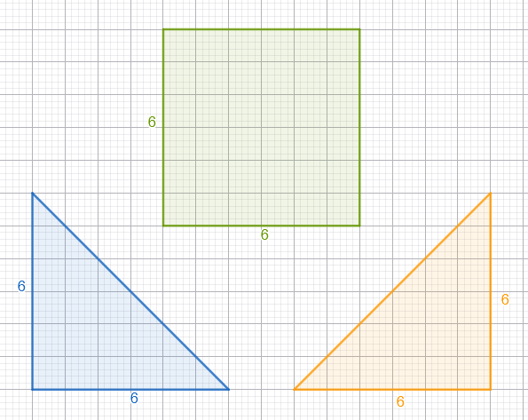{width="400"}

Εάν χρησιμοποιήσουμε σαν μονάδα μέτρησης το τετραγωνάκι 1 cm^2^ θα έχουμε:

1.  Εμβαδόν κάθε τριγώνου Ε~τριγώνου~ =18 cm^2^
2.  Εμβαδόν τετραγώνου Ε~τετραγώνου~ =36 cm^2^

Αρα συνολικό εμβαδόν νέων σχημάτων Ε~νέων σχημάτων~ =18+18+36=72 cm^2^

**Κατασκευή νέων σχημάτων**

1.  Μπορούμε να κατασκευάσουμε ένα ορθογώνιο με βάση 12 και ύψος 6\
    \
    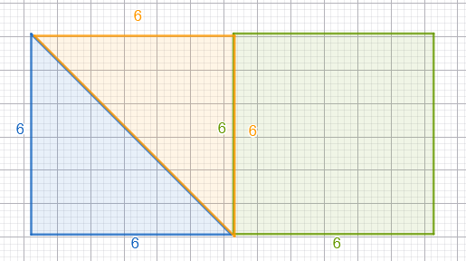{width="400"}
2.  Μπορούμε να κατασκευάσουμε ένα παραλληλόγραμμο με βάση 12 και ύψος 6\
    \
    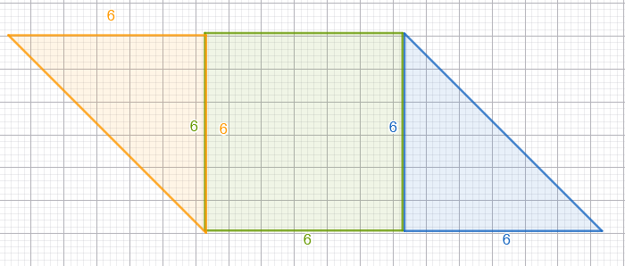{width="500"}
3.  και ένα ορθογώνιο τρίγωνο με κάθετες πλευρές 12 cm\
    \
    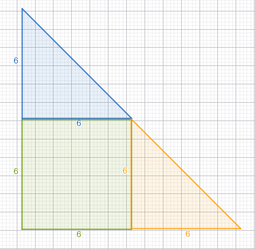{width="350"}
4.  Μπορείτε να κατασκευάσετε και ένα τραπέζιο με το ίδιο εμβαδό;

**Ασκήσεις**

1.  Αν χρησιμοποιήσετε ως μονάδα μέτρησης ένα τετράγωνο πλευράς 1 dm, πόσες τέτοιες μονάδες περιέχονται σε ένα τετραγωνικό μέτρο (m²);.
2.  Δύο σχήματα $E_1$ και $E_2$ αποτελούνται από 10 τετραγωνάκια των 1 cm² το καθένα, αλλά έχουν διαφορετικό σχήμα. Είναι ισοδύναμα; Αιτιολογήστε.
3.  Πόσες πλάκες (μονάδες επιφάνειας) διαστάσεων 50 cm $\times$ 30 cm χρειάζονται για να καλυφθεί ένας δρόμος επιφάνειας 735 m²;.
4.  Σχεδιάστε δύο διαφορετικά σχήματα που να είναι ισοδύναμα με ένα ορθογώνιο που έχει εμβαδόν 12 cm².
5.  Ένα ορθογώνιο έχει μήκος 4 cm και πλάτος 3 cm. Αν το χωρίσουμε σε τετραγωνάκια πλευράς 1 cm, πόσα τετραγωνάκια θα σχηματιστούν;.
6.  Δείξτε ότι ένα τετράγωνο πλευράς 53 m είναι ισοδύναμο με ένα οικόπεδο εμβαδού 2809 m².
7.  Αν ένα πλακάκι έχει εμβαδόν 600 cm², πόσα τέτοια πλακάκια χρειάζονται για να καλυφθεί μια επιφάνεια 1,92 m²;.
8.  Σχεδιάστε ένα σχήμα που να αποτελείται από 25 μικρά τετράγωνα πλευράς 1/5 m. Ποιο είναι το συνολικό του εμβαδόν σε m²;.
9.  Ένα τραπέζι αποτελείται από ένα ορθογώνιο και δύο ημικύκλια. Αν το ορθογώνιο μέρος έχει εμβαδόν $S_1$ και τα δύο ημικύκλια μαζί έχουν εμβαδόν $S_2$, ποιο είναι το συνολικό εμβαδόν του τραπεζιού;.

### Εξασκήσου

1.  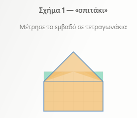

2.  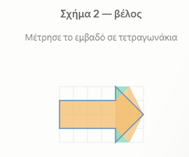

3.  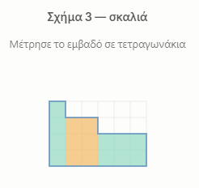

4.  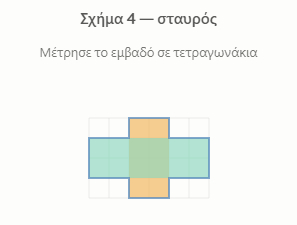

- Μετρήστε και το εμβαδόν με τριγωνάκια=μισό τετραγωνάκι

- και με ορθογώνια =2 τετργωνάκια.
  συγκρίνετε όλα τα αποτελέσματα και από τις τρεις μετρήσεις .
  Πως δικαιολογείτε τα αποτελέσματα;

### Ασκήσεις

1.  Να υπολογίσετε το εμβαδόν των παρακάτω σχημάτων με μονάδα μέτρησης ενα τετραγωνάκι.\
    \
    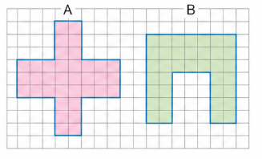
2.  Να υπολογίσετε το εμβαδόν των παρακάτω σχημάτων με μονάδα μέτρησης ενα τετραγωνάκι.\
    \
    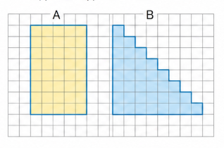
3.  Να υπολογίσετε το εμβαδόν των παρακάτω σχημάτων με μονάδα μέτρησης ενα τετραγωνάκι.\
    \
    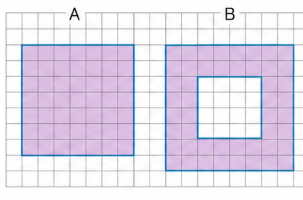
4.  Να υπολογίσετε το εμβαδόν του παρακάτω σχήματος με μονάδα μέτρησης ενα τριγωνάκι.\
    \
    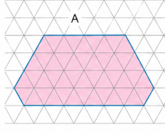
5.  Να υπολογίσετε το εμβαδόν των παρακάτω σχημάτων με μονάδα μέτρησης ενα τετραγωνάκι.\
    \
    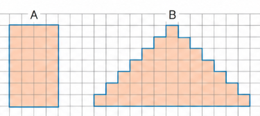
6.  Να υπολογίσετε το εμβαδόν του παρακάτω σχήματος με μονάδα μέτρησης ενα τριγωνάκι.\
    \
    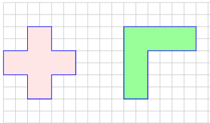

------------------------------------------------------------------------

::: {style="background-color: #f0f8cc; border: 2px solid #2f3e50; color: #25188a; padding: 15px; border-radius: 5px;"}
ΚΑΛΗ ΜΕΛΕΤΗ !
:::
