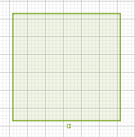
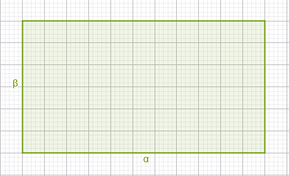
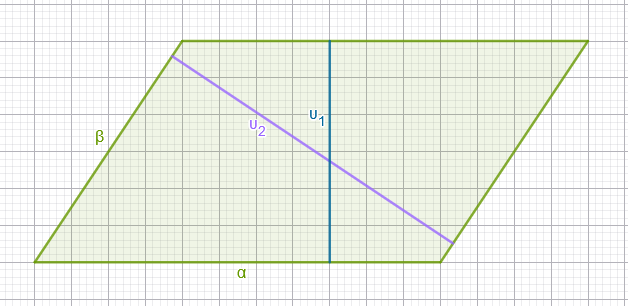
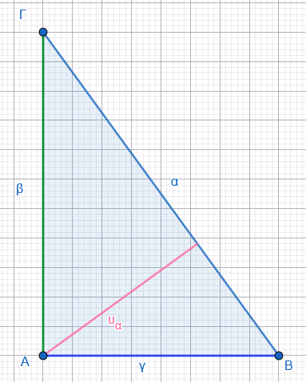
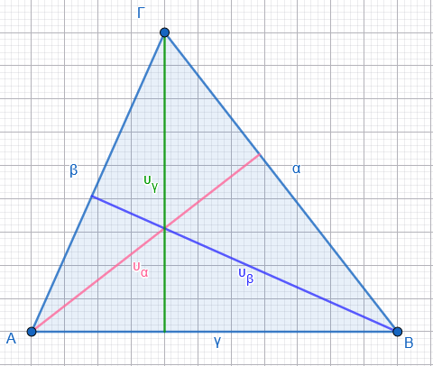
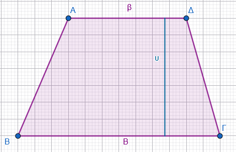
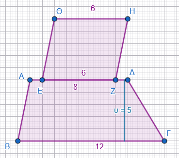

\usepackage{wasysym}
\usepackage{eurosym}
```{=html}
<!-- Φόρτωση βιβλιοθήκης GeoGebra -->
<script src="https://www.geogebra.org/apps/deployggb.js"></script>

<!-- Συνάρτηση δημιουργίας applets -->
<script>
function createGeoGebra(containerId, materialId, width = 700, height = 500) {
  var params = {
    "id": "ggb-" + containerId,
    "material_id": materialId,
    "width": width,
    "height": height,
    "showToolBar": true,
    "showMenuBar": false,
    "showAlgebraInput": true
  };
  
  var applet = new GGBApplet(params, '5.2');
  applet.inject(containerId);
}
</script>
```

## Εμβαδά επίπεδων σχημάτων

:::: {style="background-color: #E7CEF0; border: 2px solid #2f3e50; color: #25188a; padding: 15px; border-radius: 5px;"}
Το **εμβαδόν** μιας επίπεδης επιφάνειας είναι ένας θετικός αριθμός που εκφράζει την έκταση που καταλαμβάνει η επιφάνεια αυτή στο επίπεδο.
Ουσιαστικά, ο αριθμός αυτός δηλώνει το πλήθος των μονάδων μέτρησης (π.χ. τετραγωνικά μέτρα) που απαιτούνται για να καλυφθεί πλήρως η επιφάνεια.

### Βασικοί Τύποι και Ορισμοί

- **Τετράγωνο (πλευράς** $\alpha$): Το εμβαδόν ισούται με το τετράγωνο της πλευράς του ($E = \alpha^2$).\

  \
  

- **Ορθογώνιο (διαστάσεων** $\alpha, \beta$): Ισούται με το γινόμενο των διαστάσεών του, δηλαδή μήκος επί πλάτος ($E = \alpha \cdot \beta$).\

  \
  

- **Παραλληλόγραμμο (βάση** $\beta$, ύψος $\upsilon$): Είναι ίσο με το γινόμενο μιας βάσης του επί το αντίστοιχο ύψος ($E = \beta \cdot \upsilon$).\

  \
  \
  \
  Έτσι μπορούμε να πούμε $Ε~παραλληλογράμμου~ =α\cdotυ_1$ ή $Ε~παραλληλογράμμου~ =β.υ_2$

- **Τυχαίο Τρίγωνο (βάση** $\beta$, ύψος $\upsilon$): Ισούται με το μισό του γινομένου της βάσης του επί το αντίστοιχο ύψος ($E = \frac{1}{2} \beta \cdot \upsilon$).\

  \
  {width="290"}

  Για το ορθογώνιο τρίγωνο έχουμε $Ε_{\text{Ορθογωνίου Τριγώνου}}=\dfrac{1}{2}β\cdotγ$

::: {.callout-note style="color: brown;"}
\
`Οι κάθετες πλευρές στο ορθογώνιο τρίγωνο μπορούν να θεωρηθούν η μια σαν βάση και η άλλη σαν ύψος`
:::

\
ή $Ε_{\text{Ορθογωνίου Τριγώνου}}=\dfrac{1}{2}α\cdotυ$\
\
{width="409"}\
\
Για το τυχαίο τρίγωνο θα έχουμε για κάθε βάση ένα αντίστοιχο ύψος, έτσι μπορούμε να γράψουμε

\
$Ε_{\text{Τριγώνου}}=\dfrac{α\timesυ_α}{2}=\dfrac{β\timesυ_β}{2}=\dfrac{γ\timesυ_γ}{2}$

- **Τραπέζιο (βάσεις** $B, \beta$ και ύψος $\upsilon$): Είναι ίσο με το γινόμενο του ημιαθροίσματος των βάσεών του επί το ύψος του ($E = \frac{(B + \beta) \cdot \upsilon}{2}$).\
  \
  
::::

### Χαρακτηριστικά Παραδείγματα

1.  **Τετράγωνο:** Αν ένα τετράγωνο έχει πλευρά 5 cm, το εμβαδόν του προκύπτει αν το χωρίσουμε σε $5 \cdot 5 = 25$ τετραγωνάκια πλευράς 1 cm, άρα $E = 25 \text{ cm}^2$.
2.  **Ορθογώνιο:** Ένα οικόπεδο με μήκος 18 m και πλάτος 15 m έχει εμβαδόν $E = 18 \cdot 15 = 270 \text{ m}^2$.
3.  **Τρίγωνο:** Για να βρούμε το ύψος ενός τριγώνου με εμβαδόν $12 \text{ cm}^2$ και βάση 4 cm, λύνουμε τον τύπο ως προς $\upsilon$: $\upsilon = \frac{2E}{\beta} = \frac{24}{4} = 6 \text{ cm}$.
4.  **Σύνθετο σχήμα:** Το εμβαδόν ενός σχήματος μπορεί να προκύψει από το άθροισμα επιμέρους σχημάτων, όπως ένα οικόπεδο που αποτελείται από ένα ορθογώνιο και ένα τραπέζιο.

### Ασκήσεις

1.  Υπολόγισε το εμβαδόν ένος τετραγώνου πλευράς 7 cm.

2.  Ένα ορθογώνιο έχει διαστάσεις 8 m και 3 m.\
    Βρες το εμβαδόν του ορθογωνίου.

3.  Τρίγωνο έχει βάση 10 cm και ύψος 6 cm\
    Υπολόγισε το εμβαδόν του τριγώνου.

4.  Παραλληλόγραμμο έχει βάση 12 cm, ύψος 5 cm\
    Να βρεθεί το εμβαδόν του παραλληλογράμμου.

5.  Τραπέζιο έχει βάσεις 6 cm και 10 cm, ύψος 4 cm.\
    Ποιο είναι το εμβαδόν του τραπεζίου;

6.  Σύνθετο σχήμα (τετράγωνο + τρίγωνο)\
    Πάνω σε μία πλευρά ενός τετράγωνου πλευράς 4 cm, είναι χτισμένο ένα ισοσκελές τρίγωνο ύψους 3 cm εξωτερικά του τετργώνου (κορυφή έξω από το τετράγωνο).\
    Υπολόγισε το συνολικό εμβαδόν του σχήματος.

7.  Ορθογώνιο με τριγωνική τομή\
    Σε ένα ορθογώνιο διαστάσεων 10 cm × 6 cm, κόβουμε από την μια γωνία ένα ορθογώνιο τρίγωνο με κάθετες πλευρές μήκους 4 cm και 3 cm (πάνω στις πλευρές του ορθογωνίου).\
    Βρες το εμβαδόν του σχήματος που απομένει.

8.  Τραπέζιο και παραλληλόγραμμο\
    Σε ένα τραπέζιο με βάσεις 8 cm και 12 cm, ύψος 5 cm, στη μικρότερη βάση του, εξωτερικά, προσαρτάται παραλληλόγραμμο ίδιου ύψους 5 cm, με βάση 6 cm, που εφάπτεται σε όλο το μήκος της βάσης.\

\


Υπολόγισε το συνολικό εμβαδόν.

9.  Πρόβλημα – Τρίγωνο εντός τετραγώνου\
    Στο εσωτερικό ενός τετραγώνου πλευράς 8 cm, σχεδιάζεται τρίγωνο που έχει ως βάση ολόκληρη την κάτω πλευρά του τετραγώνου και κορυφή στο μέσο της πάνω πλευράς.\
    Ποιο είναι το εμβαδόν του τριγώνου;\
    Αν η κορυφή του τριγώνου βρίσκεται σε μια κορυφή της άνω πλευράς του τετραγώνου ποιο θα είναι το εμβαδό του τριγώνου;\
    Αν η κορυφή του τριγώνου βρίσκεται σε ένα οποιοδήποτε σημείο της άνω πλευράς του τετραγώνου ποιο θα είναι το εμβαδό του τριγώνου;\
    Συγκρίνετε τα τρία εμβαδά.
10. Πρόβλημα – Παραλληλόγραμμο και τραπέζιο\
    Δίνεται παραλληλόγραμμο βάσης 14 cm και ύψους 6 cm.\
    Από αυτό “κόβεται” ένα τραπέζιο με βάσεις 8 cm και 12 cm (παράλληλες στη βάση του παραλληλογράμμου) και ίδιο ύψος 6 cm, που βρίσκεται εσωτερικά στη μία πλευρά.\
    Βρες το εμβαδόν του αρχικού παραλληλογράμμου και του τραπεζίου που αφαιρείται. Πόσο είναι το εμβαδόν του σχήματος που απομένει;
11. Αν η περίμετρος ενός τετραγώνου είναι 60 cm, υπολόγισε το εμβαδόν του.
12. Ένα οικόπεδο έχει μήκος 18 m και πλάτος 15 m. Ποιο είναι το εμβαδόν του;.
13. Οι διαστάσεις ενός ορθογωνίου είναι 8 m και 12 m. Για να διπλασιάσουμε το εμβαδόν του, αυξάνουμε τη μεγαλύτερη διάσταση κατά 4 m. Πόσο πρέπει να αυξήσουμε τη μικρότερη διάσταση;.
14. Ένα παραλληλόγραμμο έχει εμβαδόν $120 \text{ cm}^2$ και ύψος 15 cm. Βρες το μήκος της βάσης που αντιστοιχεί σε αυτό το ύψος.
15. Βρες το ύψος ενός τριγώνου που έχει εμβαδόν $12 \text{ cm}^2$ και βάση 4 cm.
16. Ένα τραπέζιο έχει βάσεις 12 cm και 20 cm και ύψος 4 cm. Υπολόγισε το εμβαδόν του.
17. Η πρόσοψη μιας πολυκατοικίας που θέλουμε να βάψουμε αποτελείται από ένα ορθογώνιο (6 m x 9 m) και ένα τριγωνικό αέτωμα (βάση 6 m, ύψος 2,5 m). Πόση είναι η συνολική επιφάνεια που πρέπει να βαφτεί; Αν πληρώνουμε 5 € το τετραγωνικό για το χρώμα και 60 € για εργασία πόσο θα στοιχίσει το βάψιμο;
18. Πόσα τετράγωνα πλακάκια πλευράς 25 cm χρειάζονται για να καλυφθεί ένα δάπεδο με διαστάσεις 12 m μήκος και 8 m πλάτος;.
19. Ένας ορθογώνιος κήπος έχει διαστάσεις 36 m και 28 m. Τον διασχίζουν δύο κάθετα δρομάκια πλάτους 1,2 m και 1 m αντίστοιχα. Ποιο είναι το εμβαδόν της επιφάνειας που απομένει για φύτευση;
20. Ένα τετράγωνο και ένα τραπέζιο έχουν ίσα εμβαδά. Αν οι βάσεις του τραπεζίου είναι 12 cm και 20 cm και το ύψος του είναι 4 cm, υπολόγισε την πλευρά του τετραγώνου.
21. Ένα τριγωνικό πάρκο έχει βάση 12 m και ύψος 8 m. Ο Δήμος θέλει να φυτέψει γκαζόν που κοστίζει 5 €/m². Ποιο είναι το συνολικό κόστος;
22. Ένα χωράφι έχει σχήμα παραλληλογράμμου με βάση 15 m και ύψος 9 m. Από κάθε τετραγωνικό μέτρο παίρνουμε 3 kg σιτάρι. Πόσα kg σιτάρι παράγει το χωράφι;
23. Ένας κήπος έχει σχήμα τραπεζίου με παράλληλες πλευρές 8 m και 14 m και ύψος 6 m. Πόσα λίτρα νερό χρειάζεται για πότισμα αν αντιστοιχούν 2 λίτρα/m²;

------------------------------------------------------------------------

::: {style="background-color: #f0f8cc; border: 2px solid #2f3e50; color: #25188a; padding: 15px; border-radius: 5px;"}
ΚΑΛΗ ΜΕΛΕΤΗ !
:::
