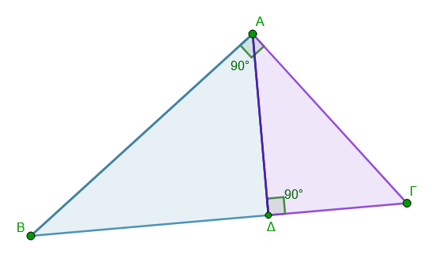
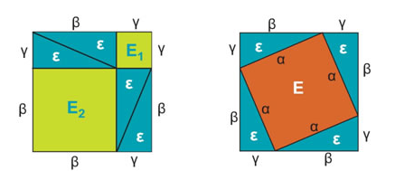
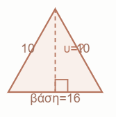
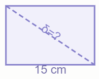
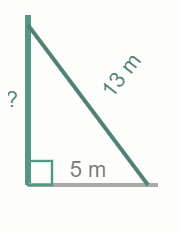
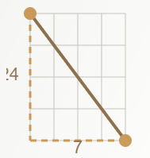
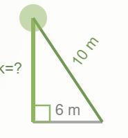

\usepackage{wasysym}
\usepackage{eurosym}
```{=html}
<!-- Φόρτωση βιβλιοθήκης GeoGebra -->
<script src="https://www.geogebra.org/apps/deployggb.js"></script>

<!-- Συνάρτηση δημιουργίας applets -->
<script>
function createGeoGebra(containerId, materialId, width = 700, height = 500) {
  var params = {
    "id": "ggb-" + containerId,
    "material_id": materialId,
    "width": width,
    "height": height,
    "showToolBar": true,
    "showMenuBar": false,
    "showAlgebraInput": true
  };
  
  var applet = new GGBApplet(params, '5.2');
  applet.inject(containerId);
}
</script>
```

## Πυθαγόρειο θεώρημα

::: {style="background-color: #E7CEF0; border: 2px solid #2f3e50; color: #25188a; padding: 15px; border-radius: 5px;"}
Το Πυθαγόρειο θεώρημα είναι ένα από τα πιο σημαντικά και κομψά θεωρήματα της Γεωμετρίας με πάμπολλες εφαρμογές στην καθημερινή ζωή και την επιστήμη.

### Η Θεωρία του Θεωρήματος

Σύμφωνα με το θεώρημα, σε κάθε **ορθογώνιο τρίγωνο**, το άθροισμα των τετραγώνων των δύο κάθετων πλευρών είναι ίσο με το τετράγωνο της υποτείνουσας.
Αν συμβολίσουμε την υποτείνουσα ως $\alpha$ και τις δύο κάθετες πλευρές ως $\beta$ και $\gamma$, τότε ο μαθηματικός τύπος είναι: $$\alpha^2 = \beta^2 + \gamma^2$$.

Γεωμετρικά, αυτό σημαίνει ότι αν κατασκευάσουμε τετράγωνα πάνω σε κάθε πλευρά του τριγώνου, το εμβαδόν του τετραγώνου της υποτείνουσας ισούται με το άθροισμα των εμβαδών των άλλων δύο τετραγώνων.
:::

\
**Κλασική απόδειξη**\
<iframe src="https://www.geogebra.org/calculator/e3cng24u?embed" width="730" height="600" allowfullscreen style="border: 1px solid #e4e4e4;border-radius: 4px;" frameborder="0"></iframe>\

Οι αποδείξεις των Leonardo da Vinci και Albert Einstein είναι ιδιαίτερα δημοφιλείς για την κομψότητα και την απλότητά τους.

**Η Απόδειξη του Leonardo da Vinci**

Ο Da Vinci χρησιμοποίησε μια έξυπνη γεωμετρική συμμετρία, δημιουργώντας δύο πανομοιότυπα εξάγωνα.
Η απόδειξη βασίζεται στο γεγονός ότι αν αφαιρέσουμε τα ίδια τρίγωνα και από τα δύο σχήματα, τα εμβαδά που απομένουν ($a^2+β^2$ στο ένα και $γ^2$ στο άλλο) πρέπει να είναι ίσα.\

<iframe src="https://www.geogebra.org/calculator/pnpjw6cs?embed" width="740" height="800" allowfullscreen style="border: 1px solid #e4e4e4;border-radius: 4px;" frameborder="0">

</iframe>

\

**Η Απόδειξη του Albert Einstein** Ο Einstein, σε ηλικία μόλις 12 ετών, ανακάλυψε μια απόδειξη που βασίζεται στην ομοιότητα τριγώνων και όχι στην αναδιάταξη σχημάτων.
Χώρισε το αρχικό ορθογώνιο τρίγωνο σε δύο μικρότερα (επίσης ορθογώνια και όμοια με το αρχικό) φέρνοντας το ύψος προς την υποτείνουσα.



- Η λογική: Το εμβαδόν κάθε όμοιου τριγώνου είναι ανάλογο του τετραγώνου της υποτείνουσάς του. Εφόσον το μεγάλο τρίγωνο (εμβαδόν $E_γ$) αποτελείται από τα δύο μικρότερα ($E_α$ και $E_β$), ισχύει $E_α + E_β = E_γ$, γεγονός που οδηγεί απευθείας στο $α^2 + β^2 = γ^2$.
- Η απόδειξη: Χρειάζονται οι γνώσεις για τα όμοια σχήματα που όμως δεν διδάσκονται σε αυτή τη τάξη.

**Απόδειξη Garfield του Πυθαγόρειου θεωρήματος (Προέδρου των ΗΠΑ)**

<iframe src="https://www.geogebra.org/calculator/mgnuupum?embed" width="740" height="600" allowfullscreen style="border: 1px solid #e4e4e4;border-radius: 4px;" frameborder="0">

</iframe>

::: {.callout-note style="color: brown;"}
## Ακολουθήστε τις Οδηγίες

- Πατήστε το κουμπί **Περιστροφή**
- Πατήστε το κουμπί **Μεταφορά**

Σχηματίζεται ένα τραπέζιο με βάσεις τιε κάθετες πλευρές του ορθογωνίου τριγώνου ΑΒΓ και ύψος το άθροισμα τους.
Υπολογίζουμε το εμβαδόν από αυτά τα στοιχεία.

Επίσης το τραπέζιο αποτελείται από τα 3 τρίγωνα.
Τα δύο ίδια ορθογώνια ΑΒΓ και το λευκό Ορθογώνιο ισοσκελές με κάθετες πλευρές την υποτείνουσα του ΑΒΓ.
Υπολογίζουμε το εμβαδόν του.

Τα δύο εμβαδά προφανώς είναι ίσα αφού μιλάμε για το ίδιο σχήμα.
Εξισώνουμε και μετά από αναγωγές προκύπτει το $α^2+β^2=γ^2$
:::

**Δείτε και το βίντεο**

{<https://www.youtube.com/watch?v=SxQkY6s5DPI>}

\

**Η Γεωμετρική Απόδειξη**

Μία από τις βασικές αποδείξεις που διδάσκονται στη Β' Γυμνασίου βασίζεται στη σύγκριση εμβαδών μέσα σε δύο ίσα τετράγωνα πλευράς $(\beta + \gamma)$:\



- Το πρώτο τετράγωνο χωρίζεται σε 4 ίσα ορθογώνια τρίγωνα και δύο τετράγωνα με πλευρές $\beta$ και $\gamma$ αντίστοιχα (εμβαδά $\beta^2$ και $\gamma^2$).

- Το δεύτερο τετράγωνο χωρίζεται στα ίδια 4 τρίγωνα και σε ένα τετράγωνο πλευράς $\alpha$ (εμβαδόν $\alpha^2$).

-  Επειδή τα μεγάλα τετράγωνα είναι ίσα, αν αφαιρέσουμε τα 4 τρίγωνα και από τα δύο, τα εμβαδά που απομένουν πρέπει να είναι ίσα.

Έτσι προκύπτει η σχέση $\beta^2 + \gamma^2 = \alpha^2$.

::: {style="background-color: #E7CEF0; border: 2px solid #2f3e50; color: #25188a; padding: 15px; border-radius: 5px;"}
### Το Αντίστροφο του Πυθαγορείου Θεωρήματος

Το αντίστροφο θεώρημα μας επιτρέπει να ελέγξουμε αν ένα τρίγωνο είναι ορθογώνιο: Αν το τετράγωνο της μεγαλύτερης πλευράς ενός τριγώνου είναι ίσο με το άθροισμα των τετραγώνων των άλλων δύο πλευρών, τότε η γωνία που βρίσκεται απέναντι από τη μεγαλύτερη πλευρά είναι ορθή.
:::

\

[Δείτε εδώ μια γενική σύνοψη](Το%20Πυθαγόρειο%20Θεώρημα.pdf){download="Το Πυθαγόρειο Θεώρημα.pdf"}\

### Ιστορικό Σημείωμα

Αν και η ανακάλυψη αποδίδεται στον **Πυθαγόρα τον Σάμιο** (περίπου 585-500 π.Χ.), το θεώρημα χρησιμοποιούνταν από τους Βαβυλώνιους και τους Κινέζους έως και 1.000 χρόνια νωρίτερα.
Οι αρχαίοι Αιγύπτιοι το χρησιμοποιούσαν πρακτικά για την κατασκευή ορθών γωνιών χρησιμοποιώντας ένα σκοινί με 13 κόμπους (σχηματίζοντας πλευρές 3, 4 και 5 μονάδων).

------------------------------------------------------------------------

Το Πυθαγόρειο θεώρημα δεν είναι απλώς μια μαθηματική εξίσωση, αλλά ένα εργαλείο με πολυάριθμες εφαρμογές σε προβλήματα της πραγματικής ζωής, από τις κατασκευές μέχρι την τεχνολογία.

Οι πιο συνηθισμένες εφαρμογές του στην καθημερινότητα περιλαμβάνουν:

- **Υπολογισμός Αποστάσεων και Διαδρομών:** Το θεώρημα χρησιμοποιείται για να βρεθεί η συντομότερη απόσταση μεταξύ δύο σημείων στο επίπεδο. Για παράδειγμα, μπορεί να υπολογιστεί η απόσταση μιας πόλης από μια άλλη ή η απόσταση που πρέπει να διανύσει ένα πλοίο για να φτάσει στο λιμάνι, όταν γνωρίζουμε τις συντεταγμένες της θέσης του.
- **Χωροταξία και Μεταφορά Αντικειμένων:** Μια πολύ πρακτική εφαρμογή αφορά τη δυνατότητα μετακίνησης αντικειμένων μέσα σε έναν χώρο. Συγκεκριμένα, αν θέλουμε να σηκώσουμε όρθιο ένα ψηλό έπιπλο (π.χ. ένα ντουλάπι) σε ένα δωμάτιο, πρέπει να υπολογίσουμε τη διαγώνιό του χρησιμοποιώντας το Πυθαγόρειο θεώρημα. Αν η διαγώνιος είναι μεγαλύτερη από το ύψος του ταβανιού, το έπιπλο δεν μπορεί να σηκωθεί όρθιο.
- **Τεχνολογία και Συσκευές:** Η διαγώνιος των οθονών στην τηλεόραση, τα κινητά τηλέφωνα και τους υπολογιστές υπολογίζεται με βάση αυτό το θεώρημα. Αν γνωρίζουμε το μήκος και το πλάτος μιας οθόνης, μπορούμε να βρούμε πόσες ίντσες είναι η διαγώνιός της, ή αντίστροφα, αν γνωρίζουμε τη διαγώνιο και τον λόγο των πλευρών, μπορούμε να βρούμε τις ακριβείς διαστάσεις της συσκευής.
- **Οικοδομικές και Τεχνικές Εργασίες:** Οι τεχνίτες το χρησιμοποιούν για να «γωνιάσουν» τις κατασκευές τους, δηλαδή να εξασφαλίσουν ότι μια γωνία είναι ακριβώς 90 μοίρες. Για παράδειγμα, αν ένας τεχνίτης μετρήσει 30 cm στο ένα δοκάρι και 40 cm στο άλλο, τότε για να είναι η γωνία ορθή, η απόσταση μεταξύ των άκρων τους πρέπει να είναι ακριβώς 50 cm ($30^2 + 40^2 = 50^2$). Επίσης, χρησιμοποιείται για να ελεγχθεί αν ένα ράφι είναι απόλυτα οριζόντιο σε σχέση με τον τοίχο.
- **Αθλητισμός:** Μπορούμε να υπολογίσουμε τη διαγώνιο ενός ορθογώνιου γηπέδου (π.χ. ποδοσφαίρου ή μπάσκετ) αν γνωρίζουμε τις διαστάσεις του.
- **Γεωμετρικά Στερεά και Σχεδιασμός:** Το θεώρημα εφαρμόζεται και σε τρισδιάστατα σχήματα, όπως για τον υπολογισμό της γενέτειρας (πλάγιας πλευράς) ενός κώνου ή του ύψους μιας πυραμίδας.

------------------------------------------------------------------------

### Ασκήσεις

1.  Σε ορθογώνιο τρίγωνο με κάθετες α = 6 cm και β = 8 cm.
    Βρες την υποτείνουσα γ.

2.  Ένα ορθογώνιο τρίγωνο έχει κάθετη α = 9 cm και υποτείνουσα γ = 15 cm.
    Βρες τη β.

3.  Ένα τρίγωνο με πλευρές 5, 12, 13 είναι ορθογώνιο;

4.  Ισοσκελές τρίγωνο έχει βάση 16 cm και ίσες πλευρές 10 cm.
    Βρες το ύψος του.



5.  Ένα ορθογώνιο παραλληλόγραμμο έχει μήκος 15 cm και πλάτος 20 cm. Βρες τη διαγώνιό του.



6.  Μια σκάλα μήκους 13 m ακουμπά σε τοίχο. Η βάση απέχει 5 m από τον τοίχο. Σε ποιο ύψος φτάνει;



7.  Δύο σημεία σε πλέγμα απέχουν 7 μονάδες οριζόντια και 24 μονάδες κάθετα. Βρες την απόστασή τους.



8.  Ένα ορθογώνιο κουτί έχει πάτο με διαστάσεις 9 cm × 12 cm. Χωράει ένα κοντάρι 17 cm στον πάτο; Βρες τη διαγώνιο του πάτου.
9.  Δέντρο έσπασε και το κορυφαίο τμήμα (**10 m**) ακουμπά στο έδαφος σε απόσταση **6 m** μακριά από τον κορμό. Ποιο είναι το ύψος του κορμού που έμεινε όρθιος;



10. Σε ένα ορθογώνιο τρίγωνο η υποτείνουσα είναι 10 cm και η μία κάθετη πλευρά είναι 6 cm.
    Βρείτε το εμβαδόν του τριγώνου.

11. Δίνεται τραπέζιο με βάσεις 10 cm και 16 cm.
    Αν η μη παράλληλη πλευρά που είναι κάθετη στις βάσεις είναι 8 cm, υπολογίστε την άλλη (πλάγια) πλευρά του τραπεζίου.

12. Ένας ρόμβος έχει διαγωνίους 16 cm και 12 cm.
    Υπολογίστε το μήκος της πλευράς του ρόμβου.

13. Οι ίντσες μιας τηλεόρασης αναφέρονται στη διαγώνιό της.
    Αν μια τηλεόραση έχει πλάτος 32 ίντσες και ύψος 24 ίντσες, πόσες ίντσες είναι η τηλεόραση;

14. Ένα παιδί θέλει να πάει από το σημείο Α στο σημείο Γ.
    Αν περπατήσει 80 μέτρα ανατολικά (σημείο Β) και μετά 60 μέτρα βόρεια (σημείο Γ), πόσα μέτρα θα είχε γλιτώσει αν πήγαινε κατευθείαν διαγώνια από το Α στο Γ;

15. Ένα σκάφος ξεκινά από ένα λιμάνι, κινείται 12 μίλια νότια και μετά 5 μίλια δυτικά.
    Πόση είναι η απόσταση του σκάφους από το λιμάνι σε ευθεία γραμμή;

16. Ένα δέντρο έχει ύψος 12 μέτρα.
    Αν η απόσταση από την κορυφή του δέντρου μέχρι το τέλος της σκιάς του στο έδαφος είναι 15 μέτρα, πόσο μήκος έχει η σκιά του δέντρου;

17. Σε ένα γήπεδο ποδοσφαίρου με διαστάσεις 100μ.
    μήκος και 60μ.
    πλάτος, ένας παίκτης τρέχει από τη μία γωνία στην ακριβώς απέναντι διαγώνια γωνία.
    Πόση απόσταση διάνυσε; (Δώστε την απάντηση με προσέγγιση ενός δεκαδικού).

::: {.callout-tip style="color: blue;"}
## Να τηρείτε τον παρακάτω κανόνα

Σε όλα αυτά τα προβλήματα, δοκιμάστε πρώτα να κάνετε ένα πρόχειρο σχήμα (ένα ορθογώνιο τρίγωνο) και να σημειώσετε ποια πλευρά είναι η υποτείνουσα.
:::

::: {style="background-color: #f0f8cc; border: 2px solid #2f3e50; color: #25188a; padding: 15px; border-radius: 5px;"}
ΚΑΛΗ ΜΕΛΕΤΗ !
:::
