\usepackage{wasysym}
\usepackage{eurosym}
```{=html}
<!-- Φόρτωση βιβλιοθήκης GeoGebra -->
<script src="https://www.geogebra.org/apps/deployggb.js"></script>

<!-- Συνάρτηση δημιουργίας applets -->
<script>
function createGeoGebra(containerId, materialId, width = 700, height = 500) {
  var params = {
    "id": "ggb-" + containerId,
    "material_id": materialId,
    "width": width,
    "height": height,
    "showToolBar": true,
    "showMenuBar": false,
    "showAlgebraInput": true
  };
  
  var applet = new GGBApplet(params, '5.2');
  applet.inject(containerId);
}
</script>
```

## Ιστορικά στοιχεία για την τριγωνομετρία

Η τριγωνομετρία έχει μια πλούσια ιστορία που εκτείνεται σε πάνω από δύο χιλιάδες χρόνια, ξεκινώντας από την ανάγκη των ανθρώπων να κατανοήσουν και να μετρήσουν τον κόσμο γύρω τους.

- **Ετυμολογία και Ορισμός:** Η λέξη «Τριγωνομετρία» προδίδει την προέλευσή της, καθώς ασχολείται με τη μέτρηση των στοιχείων των τριγώνων. Το 1789, ο Γάλλος μαθηματικός D’ Alembert την περιέγραψε εύστοχα ως την «τέχνη να βρίσκεις τα άγνωστα στοιχεία ενός τριγώνου με τα λιγότερα μέσα που διαθέτεις».
- **Πρώιμη Ανάπτυξη και Αστρονομία:** Η επιστήμη αυτή αναπτύχθηκε αρχικά από τους αρχαίους Έλληνες για να εξυπηρετήσει τις ανάγκες της **Αστρονομίας** και της **Γεωγραφίας**. Οι αρχαίοι αστρονόμοι παρατήρησαν ότι οι έννοιες του ημιτόνου, του συνημιτόνου και της εφαπτομένης προέκυπταν φυσικά από τη μελέτη των άστρων. Πίστευαν ότι τα αστέρια κινούνταν πάνω σε μια τεράστια νοητή σφαίρα και, καθώς ήταν αδύνατο να μετρήσουν άμεσα τις αποστάσεις μεταξύ των πλανητών, προσπάθησαν να τις υπολογίσουν μέσω των γωνιών που σχημάτιζαν.
- **Σημαντικές Προσωπικότητες:**
  - **Ίππαρχος (2ος αι. π.Χ.):** Θεωρείται ένας από τους θεμελιωτές της τριγωνομετρίας. Εφεύρε τον **αστρολάβο**, ένα όργανο μέτρησης γωνιών που επέτρεπε τον υπολογισμό του ύψους των αστεριών και τη γωνιακή τους απόσταση.
  - **Αρίσταρχος ο Σάμιος και Πτολεμαίος:** Συνεισέφεραν σημαντικά βρίσκοντας σχέσεις μεταξύ των πλευρών και των γωνιών των τριγώνων για αστρονομικούς σκοπούς. Ο Πτολεμαίος χρησιμοποίησε τριγωνομετρικούς πίνακες στο περίφημο έργο του «Γεωγραφία».
- **Τριγωνομετρικοί Πίνακες και Εργαλεία:** Οι πρώτοι τριγωνομετρικοί πίνακες δημιουργήθηκαν πριν από περίπου δύο χιλιάδες χρόνια για να διευκολύνουν τους αστρονομικούς υπολογισμούς. Ο υπολογισμός αυτών των αριθμών ήταν εξαιρετικά επίπονος και άρχισε να απλοποιείται μόλις μετά τον 17ο αιώνα μ.Χ., ενώ σήμερα είναι πλέον απλός με τη χρήση υπολογιστών τσέπης.
- **Εφαρμογές στη Ναυσιπλοΐα:** Οι αρχαίοι Έλληνες χρησιμοποιούσαν τον αστρολάβο για να χαράζουν την πορεία τους τη νύχτα στη θάλασσα. Αιώνες αργότερα, ο Χριστόφορος Κολόμβος βασιζόταν στο έργο "Ephemerides Astronomicae" του Regiomontanus κατά τη διάρκεια των ταξιδιών του.
- **Εξέλιξη και Σύγχρονη Χρήση:** Παρόλο που ξεκίνησε από τη μελέτη της σφαίρας (ουράνιος θόλος), η τριγωνομετρία βρήκε τεράστια εφαρμογή στο επίπεδο. Σήμερα, οι εφαρμογές της επεκτείνονται στη Φυσική (βολές), την Οπτική (ανάκλαση), τη Στατική (αντοχή υλικών) και πολλές άλλες θετικές και κοινωνικές επιστήμες.

------------------------------------------------------------------------

Οι αρχαίοι, και ιδιαίτερα οι Έλληνες ναυτικοί και αστρονόμοι, χρησιμοποιούσαν τον **αστρολάβο** ως ένα πολυεργαλείο για τον προσανατολισμό και τη ναυσιπλοΐα, βασιζόμενοι στις εξής λειτουργίες:

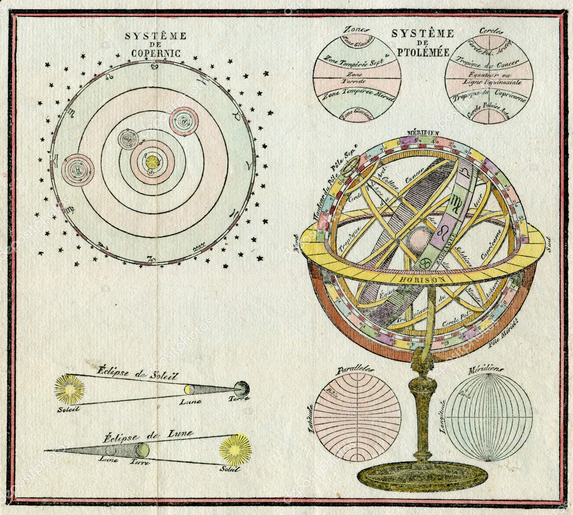{width="319"}

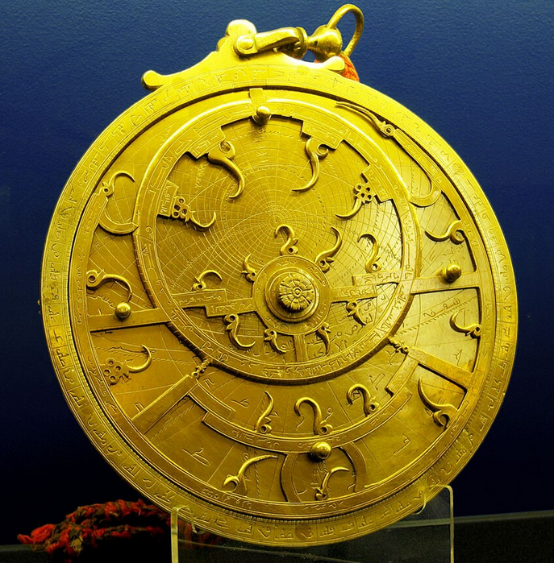{width="272"}

`Ανά τους αιώνες υπήρξαν πολλοί διαφορετικοί τύποι αστρολάβων`

- **Μέτρηση του ύψους των ουράνιων σωμάτων:** Η κύρια χρήση του αστρολάβου ήταν η μέτρηση του ύψους ενός αστεριού πάνω από τον ορίζοντα. Οι ναυτικοί στόχευαν το αστέρι χρησιμοποιώντας έναν περιστρεφόμενο κανόνα (χάρακα) στο κέντρο ενός βαθμονομημένου δίσκου.
- **Προσδιορισμός θέσης και χρόνου:** Μέσω του ύψους των αστεριών, μπορούσαν να προσδιορίσουν τη χρονική στιγμή της παρατήρησης. Γνωρίζοντας τη θέση συγκεκριμένων άστρων, όπως η Σελήνη ή οι τότε γνωστοί πλανήτες (Ερμής, Αφροδίτη, Άρης, Δίας, Κρόνος), μπορούσαν να υπολογίσουν τη θέση τους πάνω στη νοητή ουράνια σφαίρα.
- **Υπολογισμός αποστάσεων με τριγωνομετρία:** Ο αστρολάβος επέτρεπε τη μέτρηση γωνιακών αποστάσεων μεταξύ δύο αστεριών. Με τη χρήση αυτών των γωνιών και των αρχών της τριγωνομετρίας, οι αρχαίοι μπορούσαν να υπολογίσουν αποστάσεις που ήταν αδύνατο να μετρηθούν άμεσα, όπως οι αποστάσεις μεταξύ πλανητών ή η πορεία ενός πλοίου.
- **Χάραξη πορείας τη νύχτα:** Ήταν το βασικό όργανο για τη ναυσιπλοΐα κατά τη διάρκεια της νύχτας, επιτρέποντας στους αρχαίους Έλληνες να χαράζουν πορεία στο πέλαγος όταν δεν υπήρχαν ορατά σημεία ξηράς.

Εφευρέθηκε από τον Ίππαρχο τον 2ο αιώνα π.Χ.
και αποτέλεσε το σημαντικότερο ναυτικό όργανο μέχρι και τον Μεσαίωνα, οπότε και αντικαταστάθηκε από τον εξάντα.

Είναι εντυπωσιακό πώς ένα τόσο παλιό όργανο συνδύαζε την αστρονομία με τα μαθηματικά για πρακτικούς σκοπούς.

------------------------------------------------------------------------

## Εφαπτομένη οξείας γωνίας

<iframe src="https://www.geogebra.org/calculator/egcjpuxr?embed" width="800" height="600" allowfullscreen style="border: 1px solid #e4e4e4;border-radius: 4px;" frameborder="0">

</iframe>

::: {.callout-tip style="color: blue;"}
## Ακολουθήστε τις οδηγίες

1.  Αλλάξτε διαδοχικά 3 φορές θέση στο σημείο Α. Σε κάθε θέση υπολογίστε τον λόγο $\dfrac{AB}{OΑ}$

- $\dfrac{AB}{OΑ} = ..........$

- $\dfrac{AB}{OΑ} = ..........$

- $\dfrac{AB}{OΑ} = ..........$

2.  Τι παρατηρείτε; Αν και τα τμήματα αλλάζουν μέγεθος ο λόγος $\dfrac{AB}{OΑ}$ \_\_\_\_\_\_\_\_\_\_\_\_\_\_\_\_\_\_\_\_\_\_\_.

3.  Αλλάξτε τώρα την γωνία $\hat ω$ μετακινώντας πάνω κάτω το σημείο Ψ.

Ξανακάντε τα βήματα 1, 2.
Τι παρατηρείτε; Όταν η γωνία αλλάζει τότε αλλάζει και ο \_\_\_\_\_\_\_\_\_\_\_\_\_\_\_\_\_.

4.  Επαναλάβατε το βήμα 3 για δυο ακόμη διαφορετικές τιμέ της γωνίας. Τι παρατηρείτε;
:::

### Ορισμός

::: {style="background-color: #E7CEF0; border: 2px solid #2f3e50; color: #25188a; padding: 15px; border-radius: 5px;"}
Η εφαπτομένη μιας οξείας γωνίας $\omega$ σε ένα ορθογώνιο τρίγωνο ορίζεται ως ο σταθερός λόγος της απέναντι κάθετης πλευράς προς την προσκείμενη κάθετη πλευρά της γωνίας αυτής.
Συμβολίζεται με $\text{εφ}\hat ω$ και η μαθηματική της έκφραση είναι: $$\text{εφ}\hat ω = \frac{\text{απέναντι κάθετη πλευρά}}{\text{προσκείμενη κάθετη πλευρά}}$$.

Εδώ είναι μερικά βασικά χαρακτηριστικά που αξίζει να γνωρίζετε:

- **Μεταβολή:** Όταν μια οξεία γωνία μεγαλώνει, η εφαπτομένη της αυξάνεται επίσης.

- **Κλίση Ευθείας:** Στη γεωμετρία, η κλίση μιας ευθείας με εξίσωση $y = \alpha x$ είναι ίση με την εφαπτομένη της γωνίας που σχηματίζει η ευθεία με τον άξονα $x'x$ και όταν πρόκειται για ανηφορικό ή κατηφορικό δρόμο συνήθως μετριέται σε ποσοστό.
  Για δρόμο που σχηματίζει με το οριζόντιο επίπεδο γωνία που έχει εφαπτομένη πχ 0,1456 λέμε ο δρόμος έχει κλίση 14,56%.
  Αυτό σημαίνει ότι για κάθε εκατό μέτρα στο οριζόντιο επίπεδο ο δρόμος ανεβαίνει 14,56 μέτρα.
:::

------------------------------------------------------------------------

### Η εφαπτομένη είναι μια τριγωνομετρική συνάρτηση που συνδέει τη γωνία ενός ορθογωνίου τριγώνου με το λόγο του απέναντι πλευράς προς την παρακείμενη πλευρά.

Στην καθημερινή ζωή, η εφαπτομένη χρησιμοποιείται σε πολλές πρακτικές εφαρμογές που σχετίζονται με γωνίες, μέτρηση και κλίσεις.

Παραδείγματα:

1.  **Αρχιτεκτονική και κατασκευές**\
    Στις κατασκευές, η εφαπτομένη χρησιμοποιείται για τον υπολογισμό κλίσεων σκεπών, κλιμάκων ή ράμπων.
    Αν γνωρίζουμε το ύψος και την οριζόντια απόσταση, μπορούμε εύκολα να βρούμε τη γωνία κλίσης:

2.  **Μηχανική και φύση των δρόμων**\
    Οι μηχανικοί δρόμων χρησιμοποιούν την εφαπτομένη για να καθορίσουν την κλίση των δρόμων σε ανηφορικά ή κατηφορικά τμήματα, ώστε να είναι ασφαλής η διέλευση των οχημάτων.

3.  **Υψομετρικές μετρήσεις**\
    Η εφαπτομένη εφαρμόζεται σε γεωμέτρηση και χαρτογράφηση για τον υπολογισμό υψομετρικών διαφορών σε βουνά ή λόφους χρησιμοποιώντας όργανα μέτρησης γωνίας (π.χ. τοπογραφικά όργανα).

4.  **Ρομποτική και μηχανολογία**\
    Σε εφαρμογές ρομποτικής και μηχανολογίας, η εφαπτομένη χρησιμοποιείται για τον υπολογισμό γωνιών κίνησης αρθρώσεων και για τον σχεδιασμό μηχανών με κλίσεις και κίνηση σε καθορισμένη πορεία.

5.  **Καθημερινές καταστάσεις**\
    Ακόμα και σε απλές καθημερινές δραστηριότητες, όπως υπολογισμός ύψους δέντρου ή σηματοδότη, η εφαπτομένη βοηθάει: με τη μέτρηση απόστασης από το δέντρο και τη γωνία ανύψωσης της όρασης, μπορούμε να υπολογίσουμε το ύψος του δέντρου.

**Συμπέρασμα**

Η εφαπτομένη είναι ένα εργαλείο που επιτρέπει τον υπολογισμό γωνιών και αποστάσεων με βάση συγκεκριμένα μήκη, κάνοντας τη μέτρηση και τον σχεδιασμό πρακτικών εφαρμογών πολύ απλή και ακριβή.
Χρησιμοποιείται ευρέως σε διάφορους τομείς από την καθημερινή ζωή έως την επιστήμη και τη μηχανική.

### Κατασκευή μιας γωνίας όταν γνωρίζουμε την εφαπτομένη της.

::: {style="background-color: #f0f8cc; border: 2px solid #2f3e50; color: #25188a; padding: 15px; border-radius: 5px;"}
Για να κατασκευάσουμε μια γωνία όταν γνωρίζουμε την εφαπτομένη της, βασιζόμαστε στον ορισμό της εφαπτομένης:

$$εφ(\theta) = \frac{\text{απέναντι πλευρά}}{\text{προσκείμενη πλευρά}}$$

Δηλαδή, αν η εφαπτομένη είναι ένας αριθμός (π.χ. ( $εφ\theta = α$ )), μπορούμε να τον εκφράσουμε ως λόγο δύο μηκών και να κατασκευάσουμε ένα ορθογώνιο τρίγωνο.

#### Βήματα κατασκευής

1.  **Θεώρησε ότι** $$εφ(\theta) = \frac{m}{n}$$ (αν δεν δίνεται ως κλάσμα, πάρε π.χ. ($α = \frac{α}{1}$)).

2.  **Σχεδίασε ένα ευθύγραμμο τμήμα** μήκους (n) (προσκείμενη πλευρά).

3.  **Στο ένα άκρο**, ύψωσε κάθετη ευθεία.

4.  **Πάνω στην κάθετο**, πάρε μήκος (m) (απέναντι πλευρά).

5.  **Ένωσε το άκρο του (n)** με το άκρο του (m)**.**

6.  Η γωνία που σχηματίζεται στη βάση είναι η ζητούμενη γωνία ($\theta$).

------------------------------------------------------------------------

**Παράδειγμα**

Αν ( $εφ\theta = \frac{3}{4}$ ):

- σχεδιάζεις βάση 4 μονάδων
- υψώνεις κάθετο 3 μονάδων
- ενώνεις τα άκρα → η γωνία στη βάση είναι η ( $\theta$ )

------------------------------------------------------------------------

**Σημαντική ιδέα**

Ουσιαστικά χρησιμοποιείς ένα ορθογώνιο τρίγωνο όπου:

- η μία κάθετη πλευρά = αριθμητής
- η άλλη = παρονομαστής

και έτσι «μεταφράζεις» την εφαπτομένη σε γεωμετρική κατασκευή.
:::


::: {style="background-color: #f0f8cc; border: 2px solid #2f3e50; color: #25188a; padding: 15px; border-radius: 5px;"}

Να θυμάστε

η ισότητα $εφθ=\dfrac{m}{n}$ είναι ένας τύπος με 3 όρους, άρα μπορεί να επιλυθεί κατά τα γνωστά.

-  $m=n\cdotεφθ$

-  $n=\dfrac{m}{εφθ}$

-  Σε συνδυασμό με το πυθαγόρειο θεώρημα, αν σε ένα ορθογώνιο τρίγωνο γνωρίζουμε δύο στοιχεία του μπορούμε να βρούμε τα υπόλοιπα στοιχεία του τριγώνου.
    - Γνωρίζουμε δύο πλευρές ==> από το πυθαγόρειο θεώρημα βρίσκουμε την τρίτη και μετά τις γωνίες από την εφαπτομένη.
    - Γνωρίζουμε μια κάθετη πλευρά και μια οξεία γωνία  ==> βρίσκουμε την άλλη κάθετη πλευρά από την εφαπτομένη, την άλλη οξεία γωνία σαν συμπληρωματική της γνωστής γωνίας και την υποτείνουσ από το πυθαγόρειο θεώρημα.
    - Γνωρίζουμε τις δύο κάθετες πλευρές ==> βρίσκουμε την υποτείνουσα από το Πυθαγόρειο θεώρημα και τις γωνίες με τριγωνομετρία.

:::


### Ασκήσεις

**Άσκηση 1**

Ένα τρίγωνο έχει οξεία γωνία $\hat B = 30^ο$.
Η απέναντι πλευρά της γωνίας είναι 3,4 cm και η προσκείμενη πλευρά 6,1 cm.
Επαληθεύστε αν η εφαπτομένη της γωνίας είναι σωστή.
$εφ30^ο=0,5$ Εξηγήστε γιατί!
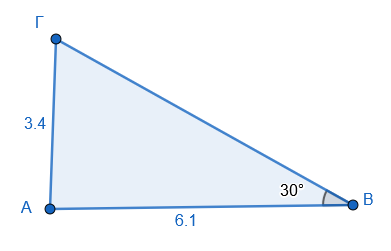

**Άσκηση 2: Υπολογισμός Γωνίας**

Στα παρακάτω ορθογώνια τρίγωνα να υπολογίσετε τις σημειωμένες γωνίες.

```{=html}
<a href="../../../Πίνακας%20Τριγωνομετρικών%20Αριθμών.html" target="_blank">
Ανατρέξτε στους τριγωνομετρικούς πίνακες
</a>
  
```

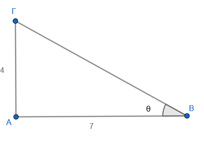{width="282"}.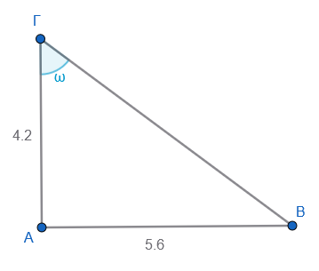{width="269"}

**Άσκηση 3: Πλάτη Κεκλιμένου Επιπέδου**

Μια ράμπα έχει ύψος 2 m και μήκος 5 m.
Βρείτε τη γωνία κλίσης.
Σχεδιάστε το σχήμα.

**Άσκηση 4: Κλίση Οδού**

Μια οδός έχει κλίση 12,84%.
Σε μια οριζόντια απόσταση 120 m, πόσο ανεβαίνει ο δρόμος.
(Ποιο είναι το κατακόρυφο ύψος; Κάντε ένα σχήμα)

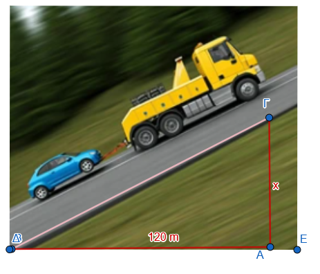{width="411"}

**Άσκηση 5: Υπολογισμός Απόστασης**

Ένα κτίριο φαίνεται από έναν παρατηρητή υπό γωνία 60°.
Αν η παρατηρητής είναι 10 m από τη βάση του κτιρίου, ποιο είναι το ύψος του κτιρίου αν ο παρατηρητής έχει ύψος 1,78 m;

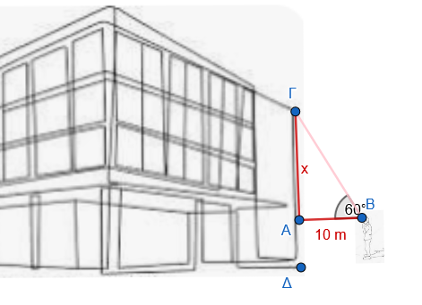

**Άσκηση 6: Υπολογισμός πλευράς** Βρείτε την πλευρά x στο παρακάτω σχήμα.

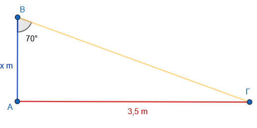

**Άσκηση 7 :** Υπολογίστε το συνολικό ύψος του σπιτιού μέχρι την κορυφή της σκεπής.

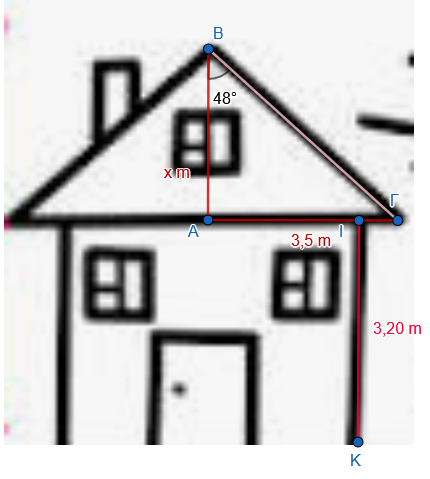

**Άσκηση 8: Πύργος και Σκιά**

Ένας πύργος δημιουργεί σκιά 12 m όταν οι ακτίνες του ήλιου πέφτουν υπο γωνία 45°.
Ποιο είναι το ύψος του πύργου;

**Άσκηση 9**

Να υπολογίσετε το ύψος στο παρακάτω ισοσκελές τρίγωνο.

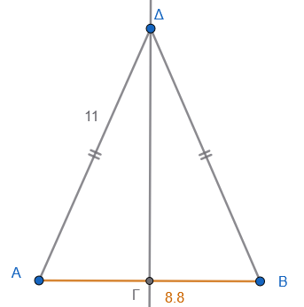

**Άσκηση 10**

Το ύψος του φάρου 38 m, φαίνεται απο τα δύο πλοία Α και Β υπό γωνία $39^ο$ και $27^ο$ αντίστοιχα.
Πόση απόσταση απέχουν τα πλοία μεταξύ τους.

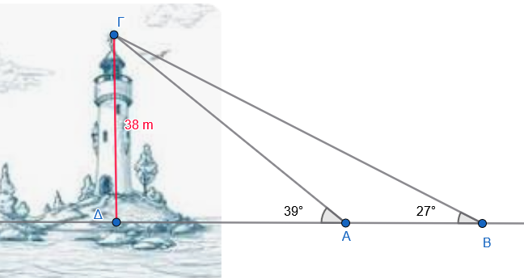{width="539"}

**Άσκηση 11**

Ο Σωκράτης απέχει 1,6 m από τον καθρέπτη ΑΒ.
Σε σχέση με το τον ορίζοντα του ματιού του βλέπει το πάνω μέρος Β του καθρέπτη υπό γωνία $27^ο$ και το κάτω μέρος Α υπο γωνία $38^ο$.
Πόσο είναι το ύψος του καθρέπτη;

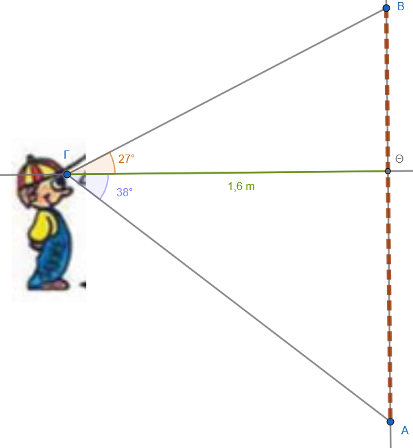{width="408"}


12.  **Βασικός Υπολογισμός:** Σε ορθογώνιο τρίγωνο $ΑΒΓ$ ($\hat{A}=90^{\circ}$), οι κάθετες πλευρές είναι $ΑΒ = 15$ cm και $ΑΓ = 20$ cm. Υπολογίστε την $\text{εφ}\hat{B}$ και την $\text{εφ}\hat{\Gamma}$.

13.  **Χρήση Πυθαγορείου:** Δίνεται ορθογώνιο τρίγωνο $ΑΒΓ$ με υποτείνουσα $ΒΓ = 13$ cm και κάθετη πλευρά $ΑΒ = 5$ cm. Βρείτε την εφαπτομένη της γωνίας $\hat{B}$.

14.  **Γεωμετρική Κατασκευή:** Σχεδιάστε μια οξεία γωνία $\omega$ τέτοια ώστε $\text{εφ}\omega = \frac{1}{5}$.


15.  **Πρόβλημα Τουρίστα:** Ένας τουρίστας ύψους $1,80$ m στέκεται σε απόσταση $45$ m από έναν πύργο και παρατηρεί την κορυφή του υπό γωνία $32^{\circ}$. Ποιο είναι το συνολικό ύψος του πύργου; (δίνεται $\text{εφ}32^{\circ} \approx 0,62$).

16.  **Κλίση Ευθείας:** Βρείτε την κλίση της ευθείας που διέρχεται από την αρχή των αξόνων $Ο(0,0)$ και το σημείο $Α(-1, 3)$. Πώς σχετίζεται αυτή η κλίση με την εφαπτομένη της γωνίας που σχηματίζει η ευθεία με τον άξονα $x'x$;


::: {.callout-tip style="color: blue;"}
## Να τηρείτε τον παρακάτω κανόνα

Σε όλα αυτά τα προβλήματα, δοκιμάστε πρώτα να κάνετε ένα πρόχειρο σχήμα (ένα ορθογώνιο τρίγωνο) και να σημειώσετε ποια πλευρά είναι η υποτείνουσα.
:::

::: {style="background-color: #f0f8cc; border: 2px solid #2f3e50; color: #25188a; padding: 15px; border-radius: 5px;"}
ΚΑΛΗ ΜΕΛΕΤΗ !
:::
