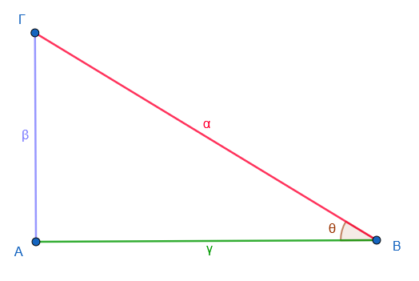
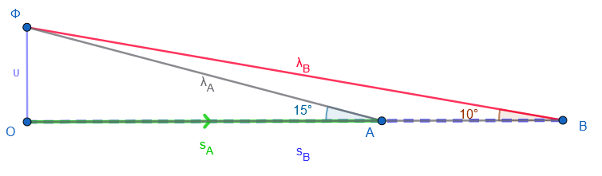

```{=html}
<!-- Φόρτωση βιβλιοθήκης GeoGebra -->
<script src="https://www.geogebra.org/apps/deployggb.js"></script>

<!-- Συνάρτηση δημιουργίας applets -->
<script>
function createGeoGebra(containerId, materialId, width = 700, height = 500) {
  var params = {
    "id": "ggb-" + containerId,
    "material_id": materialId,
    "width": width,
    "height": height,
    "showToolBar": true,
    "showMenuBar": false,
    "showAlgebraInput": true
  };
  
  var applet = new GGBApplet(params, '5.2');
  applet.inject(containerId);
}
</script>
```

## Ημίτονο και συνημίτονο οξείας γωνίας

\
<iframe src="https://www.geogebra.org/calculator/tahrbjcc?embed" width="800" height="600" allowfullscreen style="border: 1px solid #e4e4e4;border-radius: 4px;" frameborder="0"></iframe>

\

::: {.callout-tip style="color: blue;"}
## Ακολουθήστε τις οδηγίες

1.  Αλλάξτε διαδοχικά 3 φορές θέση στο σημείο Α. Σε κάθε θέση υπολογίστε τον λόγο $\dfrac{AB}{OB}$

- $\dfrac{AB}{OΒ} = ..........$

- $\dfrac{AB}{OΒ} = ..........$

- $\dfrac{AB}{OΒ} = ..........$

2.  Τι παρατηρείτε; Αν και τα τμήματα αλλάζουν μέγεθος ο λόγος $\dfrac{AB}{OΒ}$ \_\_\_\_\_\_\_\_\_\_\_\_\_\_\_\_\_\_\_\_\_\_\_.

3.  Αλλάξτε τώρα την γωνία $\hat ω$ μετακινώντας πάνω κάτω το σημείο Κ.

Ξανακάντε τα βήματα 1, 2.
Τι παρατηρείτε; Όταν η γωνία αλλάζει τότε αλλάζει και ο \_\_\_\_\_\_\_\_\_\_\_\_\_\_\_\_\_.

4.  Επαναλάβατε το βήμα 3 για δυο ακόμη διαφορετικές τιμέ της γωνίας. Τι παρατηρείτε;
:::

\
\
<iframe src="https://www.geogebra.org/calculator/wwtetrbf?embed" width="800" height="600" allowfullscreen style="border: 1px solid #e4e4e4;border-radius: 4px;" frameborder="0"></iframe>

::: {.callout-tip style="color: blue;"}
## Ακολουθήστε τις οδηγίες

1.  Αλλάξτε διαδοχικά 3 φορές θέση στο σημείο Α. Σε κάθε θέση υπολογίστε τον λόγο $\dfrac{OA}{OB}$

- $\dfrac{OA}{OΒ} = ..........$

- $\dfrac{OA}{OΒ} = ..........$

- $\dfrac{OA}{OΒ} = ..........$

2.  Τι παρατηρείτε; Αν και τα τμήματα αλλάζουν μέγεθος ο λόγος $\dfrac{OA}{OΒ}$ \_\_\_\_\_\_\_\_\_\_\_\_\_\_\_\_\_\_\_\_\_\_\_.

3.  Αλλάξτε τώρα την γωνία $\hat ω$ μετακινώντας πάνω κάτω το σημείο Κ.

Ξανακάντε τα βήματα 1, 2.
Τι παρατηρείτε; Όταν η γωνία αλλάζει τότε αλλάζει και ο \_\_\_\_\_\_\_\_\_\_\_\_\_\_\_\_\_.

4.  Επαναλάβατε το βήμα 3 για δυο ακόμη διαφορετικές τιμέ της γωνίας. Τι παρατηρείτε;
:::

::: {style="background-color: #E7CEF0; border: 2px solid #2f3e50; color: #25188a; padding: 15px; border-radius: 5px;"}
Για μια **οξεία γωνία** ( $\theta$ ) (δηλαδή ($0^\circ < \theta < 90^\circ$)), τα βασικά τριγωνομετρικά μεγέθη ορίζονται συνήθως σε ένα ορθογώνιο τρίγωνο:

- **Ημίτονο**: λόγος απέναντι κάθετης πλευράς προς υποτείνουσα
- **Συνημίτονο**: λόγος προσκείμενης πλευράς προς υποτείνουσα
- **Εφαπτομένη**: λόγος απέναντι προς προσκείμενη πλευρά

Πιο συγκεκριμένα:

$$ημ\theta = \frac{\text{απέναντι}}{\text{υποτείνουσα}}, \quad
συν\theta = \frac{\text{προσκείμενη}}{\text{υποτείνουσα}}, \quad
εφ\theta = \frac{\text{απέναντι}}{\text{προσκείμενη}}$$

------------------------------------------------------------------------

### 🔗 Σχέση ημιτόνου, συνημιτόνου και εφαπτομένης

Η πιο σημαντική σχέση που τα συνδέει είναι:

$εφ\theta = \dfrac{ημ\theta}{συν\theta}$

Αυτό σημαίνει ότι:

- Η εφαπτομένη μιας γωνίας είναι το πηλίκο του ημιτόνου προς το συνημίτονο.

------------------------------------------------------------------------

### ➕ Βασική ταυτότητα

Επίσης ισχύει η γνωστή ταυτότητα:

$$ημ^2\theta + συν^2\theta = 1$$

Από αυτή μπορούμε να βρίσκουμε το ένα μέγεθος αν ξέρουμε το άλλο.

------------------------------------------------------------------------

### ✔️ Παρατηρήσεις για οξείες γωνίες

- Όλες οι τιμές είναι **θετικές**
- ($0 < ημ\theta < 1$)
- ($0 < συν\theta < 1$)
- ($εφ\theta > 0$)
:::

\
\

### Αποδείξεις

::: {style="background-color: #E7CEF0; border: 2px solid #2f3e50; color: #25188a; padding: 15px; border-radius: 5px;"}
🔷 **Απόδειξη της σχέσης** ( $εφ\theta = \dfrac{ημ\theta}{συν\theta}$ )

Έστω ορθογώνιο τρίγωνο με μια οξεία γωνία ( $\theta$ ):

{width="342"}

- απέναντι πλευρά: (β)
- προσκείμενη πλευρά: (γ)
- υποτείνουσα: (α)

Από τους ορισμούς:

$$ημ\theta = \dfrac{β}{α}, \quad συν\theta = \dfrac{γ}{α}, \quad εφ\theta = \dfrac{β}{γ}$$

Υπολογίζουμε το πηλίκο:

\begin{equation}
\dfrac{ημθ}{συνθ}=\dfrac{\dfrac{β}{α}}{\dfrac{γ}{α}}=\dfrac{β}{\cancel{α}}\cdot\dfrac{\cancel{α}}{γ}=\dfrac{β}{γ}=εφθ
\end{equation}

Άρα:

$εφ\theta = \dfrac{ημ\theta}{συν\theta}$

🔷 **Απόδειξη της ταυτότητας** ($ημ^2\theta + συν^2\theta = 1$ )

Ξεκινάμε από το **Πυθαγόρειο θεώρημα** στο ίδιο τρίγωνο:

$β^2 + γ^2 = α^2$

Διαιρούμε όλα τα μέλη με ($α^2$):

$\dfrac{β^2}{α^2} + \dfrac{γ^2}{α^2} = 1$

Γράφουμε με βάση τους ορισμούς:

$\left(\dfrac{β}{α}\right)^2 + \left(\dfrac{γ}{α}\right)^2 = 1$

Άρα:

$ημ^2\theta + συν^2\theta = 1$
:::

\

### Ασκήσεις

**Μέρος Α' - Βασικές Ασκήσεις Εμπέδωσης**

**Άσκηση 1** Δίνεται ορθογώνιο τρίγωνο ΑΒΓ (Â = 90°) με πλευρές ΑΒ = 3 cm, ΑΓ = 4 cm.
Να υπολογιστούν:

α) η υποτείνουσα ΒΓ

β) οι τριγωνομετρικοί αριθμοί της γωνίας Β

γ) οι τριγωνομετρικοί αριθμοί της γωνίας Γ

**Άσκηση 2** Σε ορθογώνιο τρίγωνο, η γωνία θ έχει ημίτονο $\dfrac{3}{5}$.
Να υπολογιστούν:

α) το συνημίτονο της γωνίας θ

β) η εφαπτομένη της γωνίας θ (Χρήση της ταυτότητας $ημ^2θ + συν^2θ = 1$)

**Άσκηση 3** Αν $ημ θ = \dfrac{12}{13}$, να βρεθούν οι τιμές των $συν θ$ και $εφ θ$ χωρίς να υπολογίσεις τη γωνία θ.

**Άσκηση 4** Σε ορθογώνιο τρίγωνο, η μία κάθετη πλευρά είναι 5 cm και η υποτείνουσα είναι 13 cm.
Να υπολογιστούν οι τριγωνομετρικοί αριθμοί της οξείας γωνίας απέναντι από την άγνωστη κάθετη πλευρά.

**Άσκηση 5** Αν $συν ω = \dfrac{4}{5}$, να υπολογιστούν τα $ημ ω$, $εφ ω$ και να επαληθευτεί η ταυτότητα $ημ^2ω + συν^2ω = 1$.

**Άσκηση 6** Στο τρίγωνο του σχήματος, η γωνία θ έχει $ημ θ = 0,6$ και η απέναντι πλευρά είναι 9 cm.
Να βρεθούν η υποτείνουσα και η προσκείμενη πλευρά.

------------------------------------------------------------------------

**Μέρος Β' - Εφαρμογές Πυθαγορείου & Ταυτότητας**

**Άσκηση 7** Ένα ορθογώνιο τρίγωνο έχει υποτείνουσα 25 cm.
Αν η μία γωνία του έχει $ημ θ = \dfrac{7}{25}$, να βρεθούν οι κάθετες πλευρές (με δύο τρόπους: Πυθαγόρειο και τριγωνομετρία).

**Άσκηση 8** Δίνεται ότι σε ορθογώνιο τρίγωνο ισχύει $ημ θ = \dfrac{2}{3}$.
Να αποδειχθεί ότι $\dfrac{1 - συν θ}{1 + συν θ} = \dfrac{1}{5}$.

**Άσκηση 9** Ένας κατασκευαστής θέλει να φτιάξει μια ράμπα μήκους 8 m που να σχηματίζει γωνία 20° με το έδαφος.
Να υπολογιστούν:

α) το ύψος που θα φτάνει η ράμπα

β) η οριζόντια απόσταση από την αρχή της ράμπας

**Άσκηση 10** Σε ορθογώνιο τρίγωνο, η μία κάθετη πλευρά είναι 4 cm μεγαλύτερη από την άλλη κάθετη και η υποτείνουσα είναι 20 cm.
Να βρεθούν:

α) οι κάθετες πλευρές

β) τα ημίτονα και συνημίτονα των οξειών γωνιών

**Άσκηση 11** Αν $εφ θ = \dfrac{5}{12}$, να υπολογιστούν οι τιμές των $ημ θ$ και $συν θ$ χωρίς υπολογιστή.
(Υπόδειξη: Σχεδίασε ορθογώνιο τρίγωνο με απέναντι = 5, προσκείμενη = 12)

------------------------------------------------------------------------

**Μέρος Γ' - Προβλήματα Αποστάσεων & Υψών**

**Άσκηση 12 (Ύψος κτιρίου)** Ένας παρατηρητής στέκεται σε απόσταση 50 m από ένα κτίριο.
Η γωνία ανύψωσης προς την κορυφή είναι 35°.
Να βρεθεί το ύψος του κτιρίου.

**Άσκηση 13 (Δύο γωνίες ανύψωσης)** Ένα drone πετά σε σταθερό ύψος.
Από ένα σημείο Α στο έδαφος, η γωνία ανύψωσης προς το drone είναι 30°.
Μετακινούμαστε 100 m πιο κοντά (σημείο Β) και η γωνία γίνεται 45°.
Να βρεθεί το ύψος που βρίσκεται το drone.

**Άσκηση 14 (Πλάτος ποταμού)** Για να μετρήσουμε το πλάτος ενός ποταμού, στεκόμαστε σε ένα σημείο Α στην όχθη και βλέπουμε ένα δέντρο στην απέναντι όχθη υπό γωνία 25° σε σχέση με την κάθετο στην όχθη στο σημείο που είναι το δέντρο.
Μετακινούμαστε 30 m παράλληλα στην όχθη (προς την κάθετο) και η γωνία γίνεται 40°.
Να βρεθεί το πλάτος του ποταμού.

**Άσκηση 15 (Σκάλα)** Μια σκάλα μήκους 6 m ακουμπά σε έναν τοίχο και σχηματίζει γωνία 65° με το έδαφος.
Να βρεθούν:

α) το ύψος που φτάνει στον τοίχο

β) η απόσταση της βάσης της σκάλας από τον τοίχο

γ) πόσο πρέπει να απομακρυνθεί η βάση για να σχηματίσει γωνία 55°

**Άσκηση 16 (Ανεμόπτερο)** Ένας ανεμοπόρος πετά σε ύψος 300 m.
Βλέπει ένα σημείο στο έδαφος υπό γωνία κατάδυσης (γωνία που σχηματίζει η "*κατακόρυφος στο σημείο που βρίσκεται το ανεμόπτερο*" με την ευθεία "*σημείο εδάφους -ανεμόπτερο*") 15°.
Ποια είναι η οριζόντια απόστασή του από το σημείο;

------------------------------------------------------------------------

**Μέρος Δ' - Σύνθετα Προβλήματα**

**Άσκηση 17 (Λόφος και δύο παρατηρητές)** Δύο παρατηρητές βρίσκονται σε απόσταση 200 m μεταξύ τους στην ίδια ευθεία από έναν λόφο.
Ο πρώτος βλέπει την κορυφή του λόφου υπό γωνία 28°, ο δεύτερος υπό γωνία 18°.
Να βρεθεί το ύψος του λόφου.
(Υπόδειξη: Έστω x η απόσταση του πρώτου από το λόφο, το ύψος h = x·εφ28° = (200+x)·εφ18°)

**Άσκηση 18 (Τρίγωνο χωρίς ορθή γωνία)** Σε τρίγωνο ΑΒΓ, η ΑΒ = 7 cm, η ΑΓ = 9 cm και η γωνία Α = 40°.
Φέρνουμε το ύψος ΒΔ στην ΑΓ.
Να υπολογιστούν:

α) το μήκος του ΒΔ

β) η γωνία Β του τριγώνου (Χρήση ημιτόνου και Πυθαγορείου στο ορθογώνιο τρίγωνο ΑΒΔ)

**Άσκηση 19 (Πλοία - Πρόβλημα πολλαπλών σταδίων)**

Δύο πλοία Α και Β βρίσκονται στη θάλασσα, σε **ευθεία γραμμή ανατολής-δύσης**.
Το πλοίο Β βρίσκεται **100 m ανατολικά** του πλοίου Α.

Και τα δύο πλοία βλέπουν την **κορυφή ενός φάρου** Φ, που βρίσκεται στην ακτή.
Η βάση του φάρου είναι το σημείο Ο (στην ίδια στάθμη με τα πλοία).

- Από το πλοίο Α, η **γωνία ανύψωσης** προς την κορυφή του φάρου είναι **15°**
- Από το πλοίο Β, η **γωνία ανύψωσης** προς την κορυφή του φάρου είναι **10°**

**Να υπολογιστούν:**

1\.
Το ύψος του φάρου

2\.
Η απόσταση του φάρου από κάθε πλοίο



$ΟΑ = S_A$ (άγνωστη απόσταση βάσης φάρου από πλοίο Α) $ΟΒ = S_B=S_A + 100$ ΟΦ = υ = ύψος φάρου

**Λύση**

**Από το ορθογώνιο τρίγωνο ΟΑΦ:** $$εφ 15° = \frac{υ}{S_A} \quad \Rightarrow \quad υ = S_A \cdot εφ 15°$$

**Από το ορθογώνιο τρίγωνο ΟΒΦ:** $$εφ 10° = \frac{υ}{S_A + 100} \quad \Rightarrow \quad υ = (S_A + 100) \cdot εφ 10°$$

**Εξισώνω:** $$S_A \cdot εφ 15° = (S_A + 100) \cdot εφ 10°$$

[Λύστε και υπολογίστε το]{.underline} $S_A$

[Συνεχίστε με τα υπόλοιπα ζητούμενα]{.underline}

**Τελικές απαντήσεις**

| Μέγεθος                              | Τιμή         |
|--------------------------------------|--------------|
| Ύψος φάρου (υ)                       | **≈ 51,6 m** |
| Απόσταση βάσης φάρου από πλοίο $S_Α$ | ≈ 192,5 m    |
| Απόσταση βάσης φάρου από πλοίο $S_Β$ | ≈ 292,5 m    |
| Απόσταση πλοίου Α από κορυφή (ΑΦ)    | ≈ 199,2 m    |
| Απόσταση πλοίου Β από κορυφή (ΒΦ)    | ≈ 297,0 m    |

```{=html}
<a href="../../../Πίνακας%20Τριγωνομετρικών%20Αριθμών.html" target="_blank">
Ανατρέξτε στους τριγωνομετρικούς πίνακες
</a>
  
```

\

**Άσκηση 20 Ύψος αεροπλάνου**

Αεροπλάνο απογειώνεται με γωνία 20° και διανύει 500 m κατά μήκος της τροχιάς. Σε ποιο ύψος βρίσκεται; 


**Άσκηση 21 Απόσταση πλοίου**

Ένας φάρος έχει ύψος 40 m. Ένα πλοίο βλέπει την κορυφή υπό γωνία 15°. Πόσο απέχει το πλοίο από το φάρο; 

**Άσκηση 22 Δορυφόρος**

Από έναν σταθμό παρατήρησης βλέπουμε έναν δορυφόρο υπό γωνία ανύψωσης θ. Ο δορυφόρος βρίσκεται σε ύψος 400 km. Βρείτε ην οριζόντια απόσταση σταθμού-δορυφόρου.

::: {.callout-tip style="color: blue;"}
## Να τηρείτε τον παρακάτω κανόνα

Σε όλα αυτά τα προβλήματα, δοκιμάστε πρώτα να κάνετε ένα πρόχειρο σχήμα (ένα ορθογώνιο τρίγωνο) και να σημειώσετε ποια πλευρά είναι η υποτείνουσα.
:::

::: {style="background-color: #E7CEF0; border: 2px solid #2f3e50; color: #25188a; padding: 15px; border-radius: 5px;"}
ΚΑΛΗ ΜΕΛΕΤΗ !
:::
