```{=html}
<!-- Φόρτωση βιβλιοθήκης GeoGebra -->
<script src="https://www.geogebra.org/apps/deployggb.js"></script>

<!-- Συνάρτηση δημιουργίας applets -->
<script>
function createGeoGebra(containerId, materialId, width = 700, height = 500) {
  var params = {
    "id": "ggb-" + containerId,
    "material_id": materialId,
    "width": width,
    "height": height,
    "showToolBar": true,
    "showMenuBar": false,
    "showAlgebraInput": true
  };
  
  var applet = new GGBApplet(params, '5.2');
  applet.inject(containerId);
}
</script>
```

## Μεταβολές ημιτόνου, συνημιτόνου και εφαπτομένης

### Η χρήση του υπολογιστή τσέπης για τον υπολογισμό του ημιτόνου, του συνημιτόνου και της εφαπτομένης μιας γωνίας ω

::: {style="background-color: #c682d9; border: 2px solid #2f3e50; color: #171426; padding: 15px; border-radius: 5px;"}
Επειδή ο υπολογισμός του ημιτόνου, του συνημιτόνου και της εφαπτομένης μιας γωνίας δεν είναι απλή διαδικασία, χρησιμοποιούμε συχνά έναν **επιστημονικό υπολογιστή τσέπης**.
Οι υπολογιστές αυτοί περιλαμβάνουν ειδικά πλήκτρα για κάθε τριγωνομετρικό αριθμό: το πρώτο υπολογίζει το ημίτονο, το δεύτερο το συνημίτονο και το τρίτο την εφαπτομένη.

Η διαδικασία υπολογισμού ακολουθεί συνήθως τα εξής βήματα:

1.  **Ρύθμιση μονάδων:** Πατάμε το πλήκτρο που ορίζει τη μονάδα μέτρησης των γωνιών σε **μοίρες**. Αν και το πλήκτρο διαφέρει ανάλογα με το μοντέλο, η ένδειξη που επιβεβαιώνει τη σωστή ρύθμιση είναι συνήθως η ένδειξη **DEG** στην οθόνη.
2.  **Εισαγωγή δεδομένων:** Για να υπολογίσουμε, για παράδειγμα, το ημίτονο των 63°, πατάμε διαδοχικά τα κατάλληλα πλήκτρα (στοιχεία γωνίας και λειτουργία ημιτόνου).
3.  **Αποτέλεσμα:** Στην οθόνη παρουσιάζεται η τιμή του τριγωνομετρικού αριθμού (π.χ. για το ημ63° εμφανίζεται ο αριθμός **0,891**).

Αντίστοιχη διαδικασία ακολουθείται και για το συνημίτονο ή την εφαπτομένη πατώντας τα ανάλογα πλήκτρα.

**Εναλλακτική μέθοδος:** Εκτός από τον υπολογιστή τσέπης, για τις σχολικές ασκήσεις μπορεί να χρησιμοποιηθεί και ο **πίνακας τριγωνομετρικών αριθμών** που βρίσκεται στο τέλος του βιβλίου σας ή στον σύνδεσμο

```{=html}
<a href="../../../Πίνακας%20Τριγωνομετρικών%20Αριθμών.html" target="_blank">
Ανατρέξτε στους τριγωνομετρικούς πίνακες
</a>
  
```

, ο οποίος περιλαμβάνει τις τιμές για γωνίες από 1° έως 89°.
:::

***Δείτε σε εικόνες***

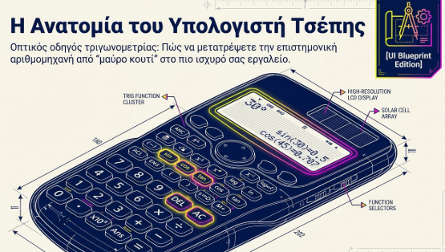{width="500"}

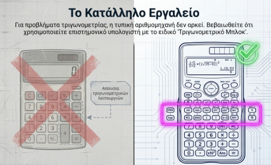{width="500"}

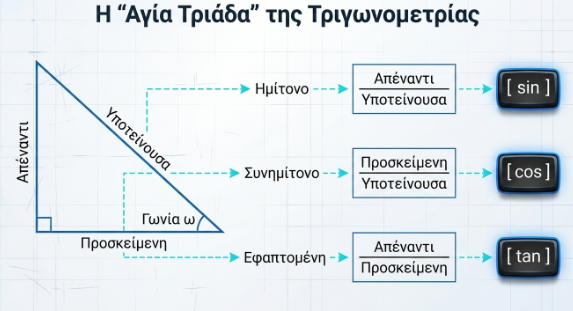{width="500"}

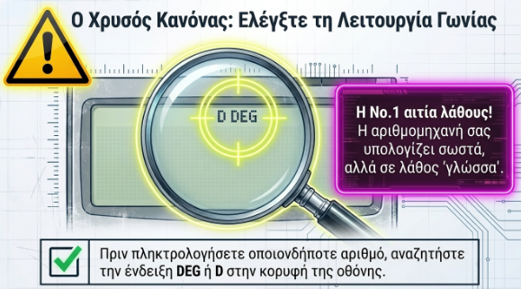{width="500"}

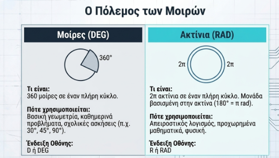{width="500"}

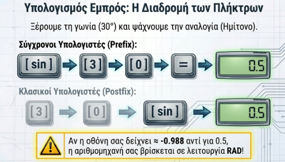{width="500"}

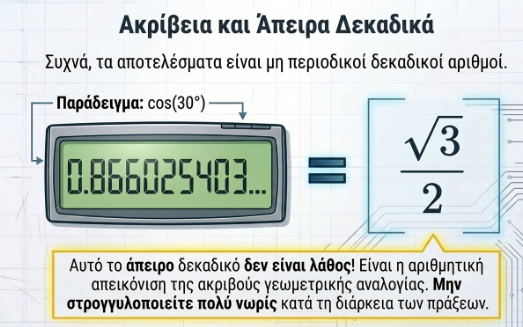{width="500"}

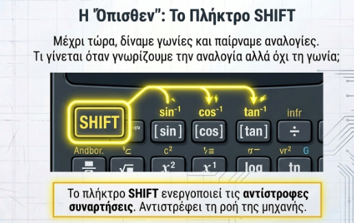{width="500"}

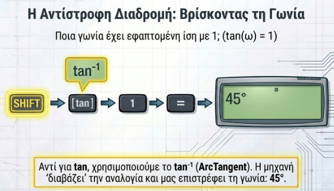{width="500"}

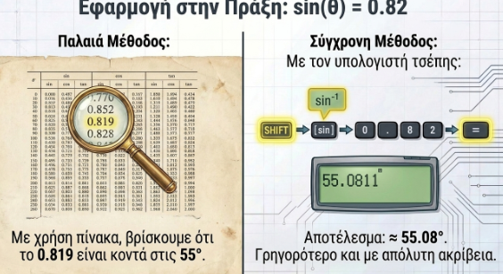{width="500"}

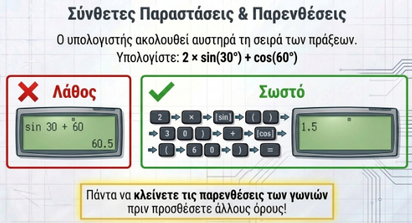{width="500"}

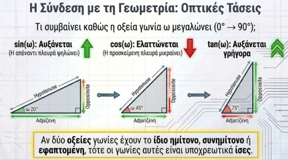{width="500"}

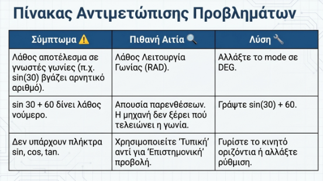{width="500"}

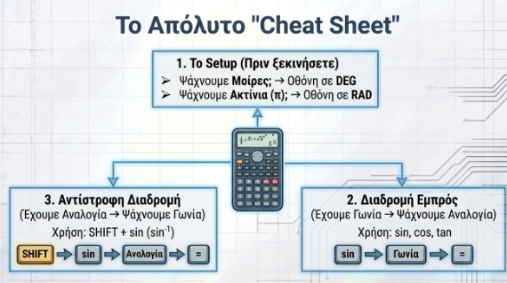{width="500"}

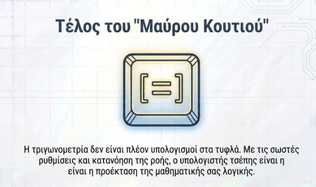{width="500"}

::: callout-note
## Υπάρχει ένα πλήθος από online κομπιουτεράκια για χρήση.

Μερικά λινκ\
[OKCALC](https://okcalc.com/en/scientific/)

[WEB3 CALCULATOR](https://web-calc.com)

[On line Αριθμομηχανή](https://www.online-calculator.com/el/)

[Web 2.0 Calculator](https://web2.0calc.com)

Ακόμη και στην γραμμή αναζήτησης της google μπορείτε όχι μόνο να υπολογίσετε τριγωνομετρικούς αριθμούς αλλά και να κένετε ότι πράξεις θέλετε.

Επίσης μπορείτε να χρησημοποιήσετε την αριθμομηχανή των Windows ή του τηλεφώνου σας.
:::

### Μεταβολές ημιτόνου, συνημιτόνου και εφαπτομένης οξείας γωνίας ω

::: {style="background-color: #c682d9; border: 2px solid #2f3e50; color: #171426; padding: 15px; border-radius: 5px;"}
Όταν μια οξεία γωνία $\omega$ μεταβάλλεται από τις $0^{\circ}$ προς τις $90^{\circ}$, οι τριγωνομετρικοί της αριθμοί παρουσιάζουν την εξής συμπεριφορά:

- **Ημίτονο (**$\mathbf{ημω}$): Όταν η γωνία αυξάνεται, το ημίτονό της αυξάνεται.

  Για παράδειγμα, ισχύει ότι $ημ13^ο < ημ15^ο$.

- **Συνημίτονο (**$\mathbf{συνω}$): Όταν η γωνία αυξάνεται, το συνημίτονό της ελαττώνεται.

  Για παράδειγμα, το $συν27^o$ είναι μεγαλύτερο από το $συν59^ο$.

- **Εφαπτομένη (**$\mathbf{εφω}$): Όταν η γωνία αυξάνεται, η εφαπτομένη της αυξάνεται.

#### Γεωμετρική Ερμηνεία

Η μεταβολή αυτή μπορεί να εξηγηθεί γεωμετρικά μέσω ορθογωνίων τριγώνων:

- **Για το ημίτονο και το συνημίτονο:** Αν θεωρήσουμε ορθογώνια τρίγωνα με **σταθερή υποτείνουσα**, (την ακτίνα ενός κύκλου για παράδειγμα όπως στην παρακάτω εικόνα), παρατηρούμε ότι καθώς η οξεία γωνία μεγαλώνει, η απέναντι κάθετη πλευρά αυξάνεται (άρα αυξάνεται το ημίτονο), ενώ η προσκείμενη κάθετη πλευρά μικραίνει (άρα μειώνεται το συνημίτονο).

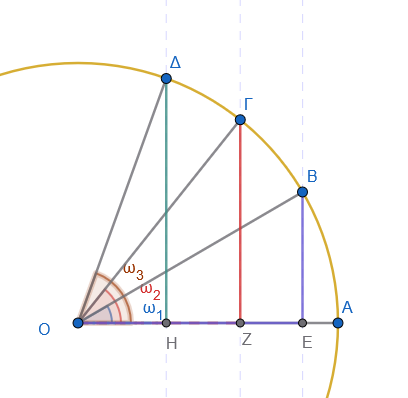

- **Για την εφαπτομένη:** Αν θεωρήσουμε ορθογώνια τρίγωνα με **σταθερή τη μία κάθετη πλευρά** (την προσκείμενη), (για παράδειγμα την ακτίνα ενός κύκλου όπως φαίνεται στην παρακάτω εικόνα), παρατηρούμε ότι καθώς η οξεία γωνία μεγαλώνει, η απέναντι κάθετη πλευρά μεγαλώνει επίσης, επομένως ο λόγος τους (η εφαπτομένη) αυξάνεται.\
  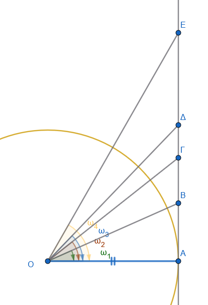

#### Σημαντικά Συμπεράσματα

Λόγω αυτής της μονοτονίας, οι τριγωνομετρικοί αριθμοί αποτελούν κατά κάποιο τρόπο την **«ταυτότητα» της οξείας γωνίας**.
Αυτό σημαίνει ότι:

1.  Αν δύο οξείες γωνίες έχουν **ίσα ημίτονα**, τότε οι γωνίες είναι **ίσες**.
2.  Αν δύο οξείες γωνίες έχουν **ίσα συνημίτονα**, τότε οι γωνίες είναι **ίσες**.
3.  Αν δύο οξείες γωνίες έχουν **ίσες εφαπτόμενες**, τότε οι γωνίες είναι **ίσες**.

Επιπλέον, για κάθε οξεία γωνία $ω$, οι τιμές του ημιτόνου και του συνημιτόνου κυμαίνονται πάντα μεταξύ του 0 και του 1 ($0 < ημω < 1$ και $0 <συνω < 1$), *καθώς σε ένα ορθογώνιο τρίγωνο η υποτείνουσα είναι πάντα μεγαλύτερη από τις κάθετες πλευρές*.

Αντίθετα, η εφαπτομένη μιας οξείας γωνίας μπορεί να πάρει οποιαδήποτε θετική τιμή.
:::

***Δείτε τις παρακάτω εικόνες***

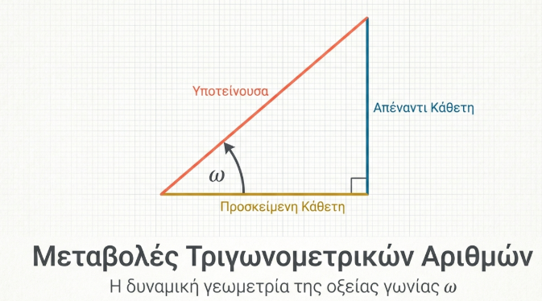{width="500"}

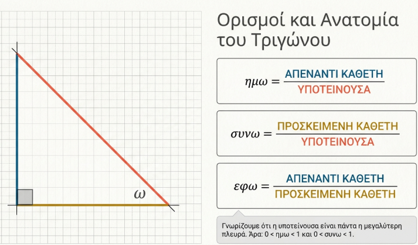{width="500"}

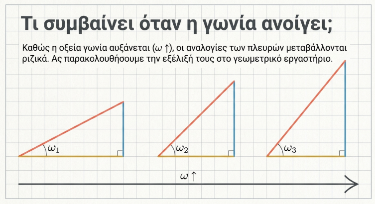{width="500"}

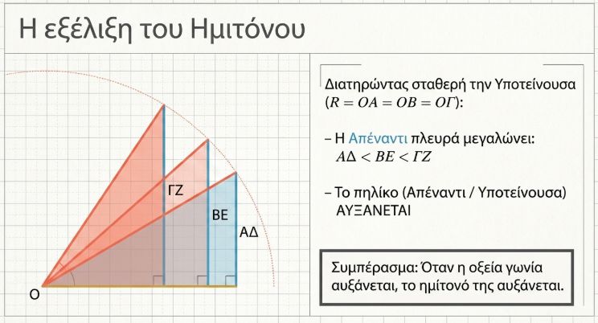{width="500"}

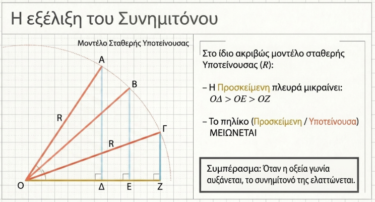{width="500"}

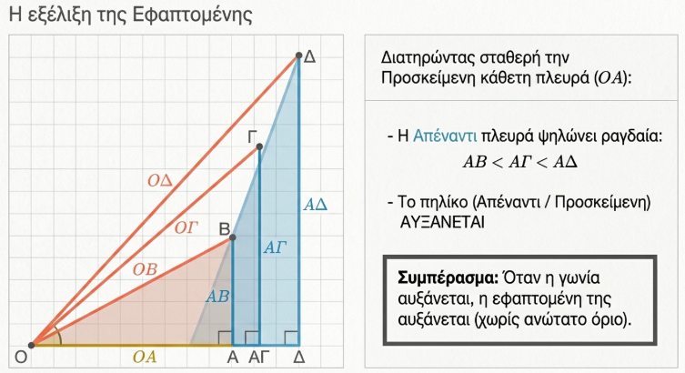{width="500"}

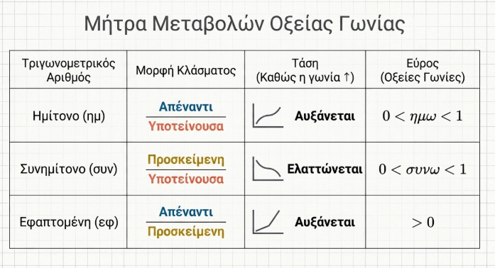{width="500"}

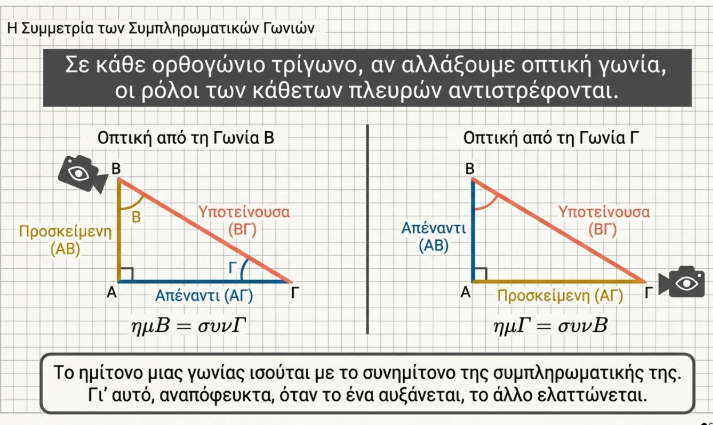{width="500"}

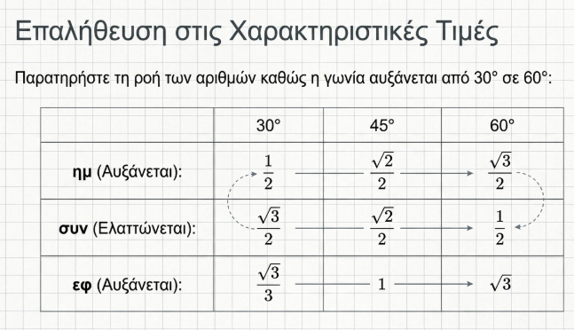{width="500"}

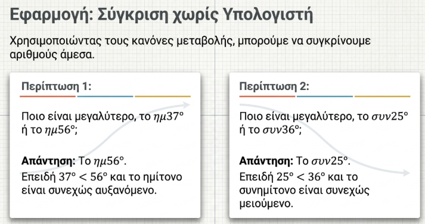{width="500"}

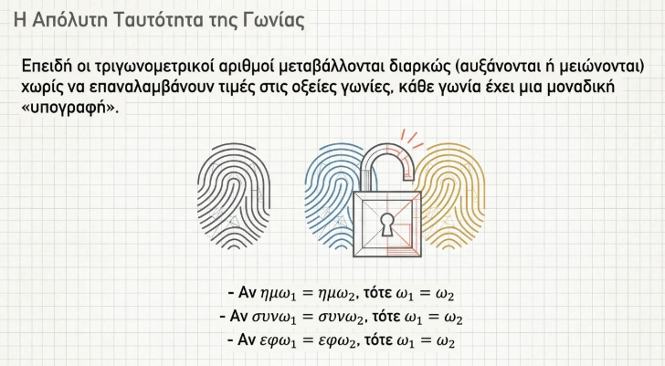{width="500"}

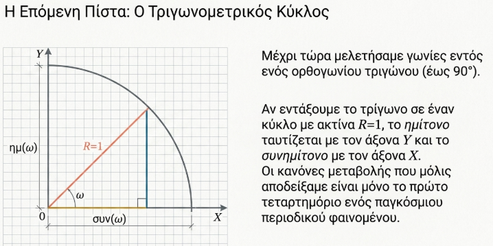{width="500"}

### Ασκήσεις

1.  Υπολογίστε το χ στα παρακάτω σχήματα\
    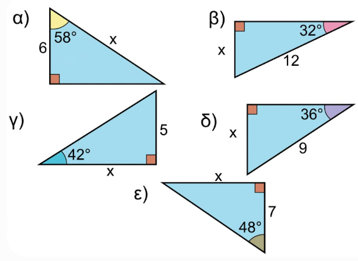{width="500"}

2.  Υπολογίστε τις άλλες δύο πλευρές σε καθένα από τα παρακάτω σχήματα\
    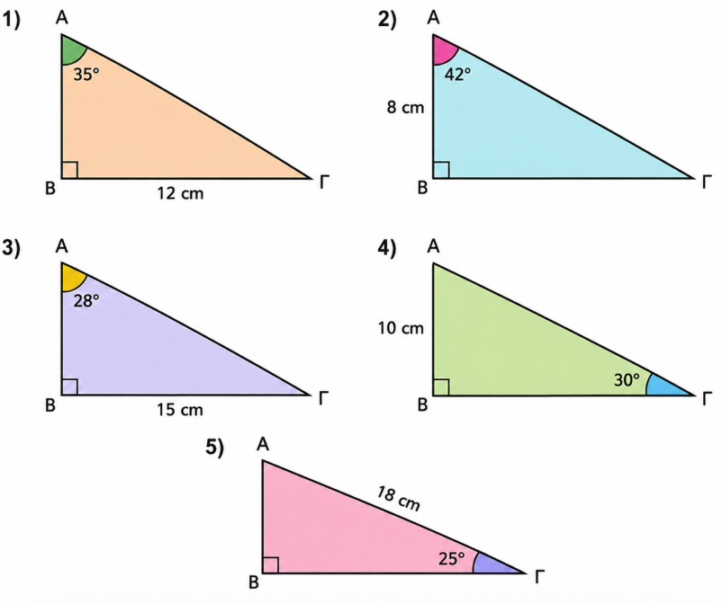{width="500"}

3.  **Το Κατάρτι και τα Σχοινιά** Σε ένα ιστιοπλοϊκό σκάφος, το ύψος του καταρτιού έως το σημείο $A$ είναι $10\text{ m}$.
    Να βρείτε το μήκος που έχουν τα δύο συρματόσχοινα που στηρίζουν τα πανιά, αν αυτά σχηματίζουν γωνίες $40^{\circ}$ και $65^{\circ}$ αντίστοιχα με το επίπεδο της θάλασσας.\
    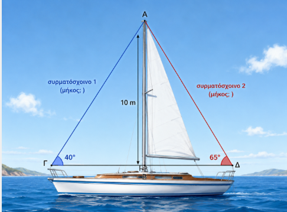{width="400"}

4.  **Η Ράμπα του Γκαράζ** Ένας μηχανικός θέλει να κατασκευάσει μια ράμπα για ένα υπόγειο πάρκινγκ.
    Το βάθος του γκαράζ είναι $B\Gamma = 1,80\text{ m}$ και η κλίση της ράμπας πρέπει να είναι $\theta = 15^{\circ}$.
    Να υπολογίσετε:

    α) Το μήκος $A\Gamma$ της επιφάνειας της ράμπας.

    β) Την οριζόντια απόσταση $AB$ από την αρχή της ράμπας έως το κτίριο.\

    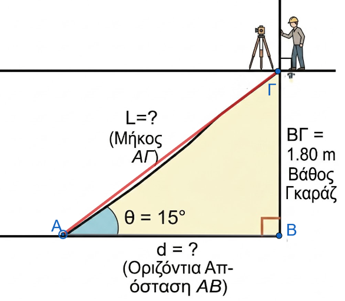{width="400"}

5.  **Διάταξη Τριγωνομετρικών Αριθμών** Να διατάξετε από τον μικρότερο στον μεγαλύτερο τους παρακάτω τριγωνομετρικούς αριθμούς (χωρίς να τους υπολογίσετε):

    α) $\eta\mu 12^{\circ}, \eta\mu 85^{\circ}, \eta\mu 42^{\circ}, \eta\mu 5^{\circ}$

    β) $\sigma\upsilon\nu 10^{\circ}, \sigma\upsilon\nu 70^{\circ}, \sigma\upsilon\nu 45^{\circ}, \sigma\upsilon\nu 88^{\circ}$

    γ) $\varepsilon\varphi 15^{\circ}, \varepsilon\varphi 60^{\circ}, \varepsilon\varphi 35^{\circ}, \varepsilon\varphi 82^{\circ}$

6.  **Η Σκάλα στον Τοίχο** Μια σκάλα μήκους $5\text{ m}$ είναι ακουμπισμένη σε έναν τοίχο ύψους $6\text{ m}$.
    Για να είναι σταθερή, η γωνία που σχηματίζει η σκάλα με το έδαφος είναι $70^{\circ}$.
    Να βρείτε:

    α) Την απόσταση της βάσης της σκάλας από τον τοίχο.

    β) Πόσο απέχει η κορυφή της σκάλας από το πάνω μέρος του τοίχου.\

    \
    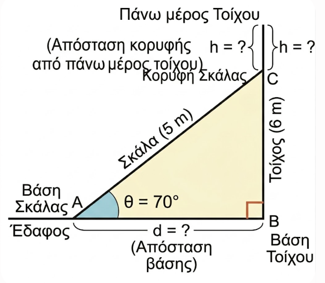{width="400"}

7.  **Απόσταση μέσω Ποταμού** Ένας τοπογράφος θέλει να βρει την απόσταση ενός πύργου $M$ που βρίσκεται στην απέναντι όχθη ενός ποταμού από το σημείο $A$ όπου στέκεται.
    Επιλέγει ένα σημείο $B$ σε απόσταση $AB = 30\text{ m}$ από το $A$ και μετράει τις γωνίες $\widehat{ABM} = 84^{\circ}$ και $\widehat{BAM} = 38^{\circ}$.
    Να υπολογίσετε την απόσταση $AM$ (χρησιμοποιώντας το ύψος $MH$ προς την $AB$).\
    \>\>\> Υπολογίστε πρώτα το ύψος από το τρίγωνο ΑΒΗ.Η γωνία ΒΑΗ είναι συμπληρωματική της ΑΒΜ, άρα η γωνία ΜΑΗ θα είναι ........
    Από το τρίγωνο τώρα ΑΗΜ ..............\
    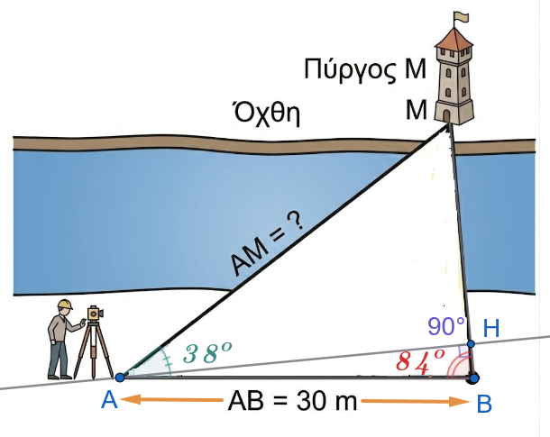{width="400"}

8.  **Απόσταση Γης - Τεχνητού Δορυφόρου** Ένας δορυφόρος $Δ$ βρίσκεται σε τροχιά γύρω από τη Γη.
    Η ακτίνα της Γης είναι $R = \Gamma A = 6.371\text{ km}$.
    Από ένα σημείο $Γ$ της επιφάνειας, ο δορυφόρος φαίνεται υπό γωνία $\widehat{AΓΔ} = 70^{\circ}$ ως προς το κέντρο της Γης $Α$, όπου η $\Gamma A$ είναι κάθετη στην $AΔ$.
    Να υπολογίσετε την απόσταση του δορυφόρου από το κέντρο της Γης ($ΑΔ$).\

    \
    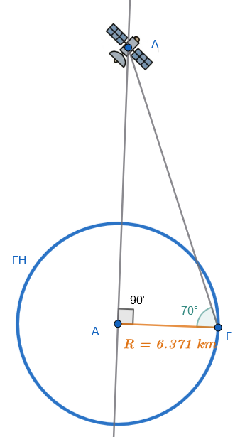

::: {style="background-color: #E7CEF0; border: 2px solid #2f3e50; color: #25188a; padding: 15px; border-radius: 5px;"}
ΚΑΛΗ ΜΕΛΕΤΗ !
:::
