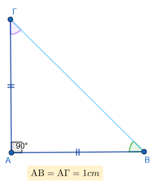
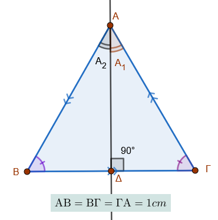
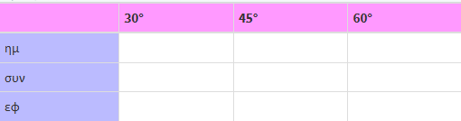
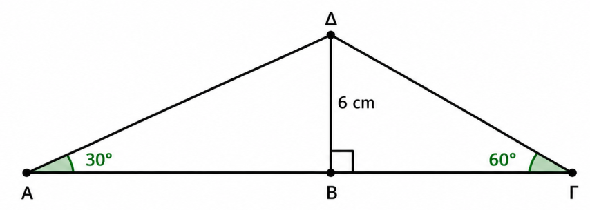
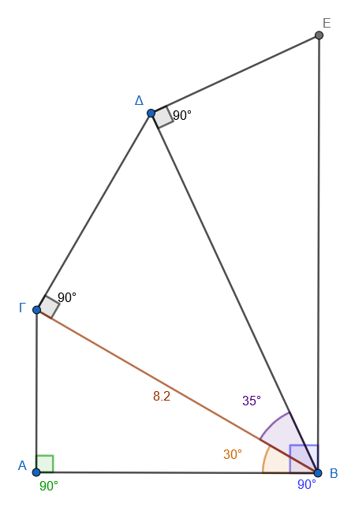
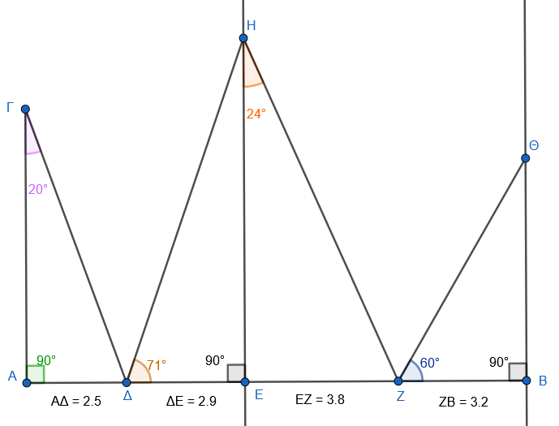
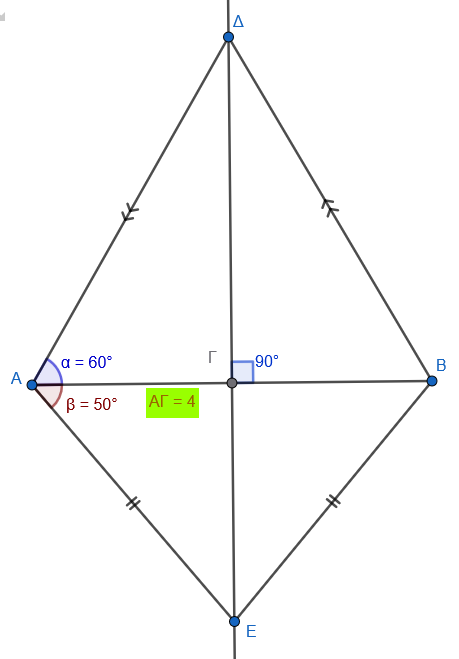

```{=html}
<!-- Φόρτωση βιβλιοθήκης GeoGebra -->
<script src="https://www.geogebra.org/apps/deployggb.js"></script>

<!-- Συνάρτηση δημιουργίας applets -->
<script>
function createGeoGebra(containerId, materialId, width = 700, height = 500) {
  var params = {
    "id": "ggb-" + containerId,
    "material_id": materialId,
    "width": width,
    "height": height,
    "showToolBar": true,
    "showMenuBar": false,
    "showAlgebraInput": true
  };
  
  var applet = new GGBApplet(params, '5.2');
  applet.inject(containerId);
}
</script>
```

## Οι τριγωνομετρικοί αριθμοί των γωνιών 30°, 45° και 60°

Α.  Για το παρακάτω ορθογώνιο τρίγωνο απαντήστε , συμπληρώστε ή υπολογίστε ανάλογα με την περίπτωση:

\

\

1.  Τι τρίγωνο είναι ως προς το είδος των πλευρών;

2.  Πόσες μοίρες είναι η γωνία $\hatΒ$ , Πόσες η γωνία $\hat Γ$;

3.  Υπολογίστε την υποτείνουσα ΒΓ.

4.  Υπολογίστε και τους 3 (ημ, συν, εφ) τριγωνομετρικούς αριθμούς των γωνιών $\hat Β$ και $\hat Γ$.

\

Β.  Για το παρακάτω ισόπλευρο τρίγωνο απαντήστε , συμπληρώστε ή υπολογίστε ανάλογα με την περίπτωση:

\
\

1.  Πόσες μοίρες είναι οι γωνίες $\hatΒ$, $\hatΓ$, και $\hatΑ$;

2.  Το ύψος ΑΔ είναι συνχρόνως ...................
    και ..................

3.  Πόσες μοίρες είναι η γωνία $\hatΑ_1$ και η γωνία $\hatΑ_2$;

4.  Πόσο είναι το τμήμα ΒΔ και πόσο το ΔΓ;

5.  Υπολογίστε το ύψος ΑΔ.

6.  Υπολογίστε τους τριγωνομετρικούς αριθμούς (ημ, συν, εφ) των γωνιών $\hatΒ$ , $\hatΓ$, $\hatΑ_1$ και $\hatΑ_2$.

7.  Συγκεντρώστε τα παραπάνω αποτελέσματα στο παρακάτω πίνακα



\


::: {.callout-tip style="color: blue;"}
Θα πρέπει να μάθετε τον πίνακα
:::

```{=html}

<script src="https://cdn.jsdelivr.net/npm/mathjax@3/es5/tex-chtml.js"></script>

<table style="border-collapse: collapse; text-align: center;">
  <tr>
    <td style="background-color: #ddd; padding: 8px;">&nbsp;</td>
    <td style="background-color: #ffb3b3; padding: 8px;">\(30^\circ\)</td>
    <td style="background-color: #b3ffb3; padding: 8px;">\(45^\circ\)</td>
    <td style="background-color: #b3b3ff; padding: 8px;">\(60^\circ\)</td>
  </tr>
  <tr>
    <td style="background-color: #ffe6b3; padding: 8px;">\(\textbf{ημίτονο}\)</td>
    <td style="background-color: #ffcccc; padding: 8px;">\(\frac{1}{2}\)</td>
    <td style="background-color: #ccffcc; padding: 8px;">\(\frac{\sqrt{2}}{2}\)</td>
    <td style="background-color: #ccccff; padding: 8px;">\(\frac{\sqrt{3}}{2}\)</td>
  </tr>
  <tr>
    <td style="background-color: #ffe6b3; padding: 8px;">\(\textbf{συνημίτονο}\)</td>
    <td style="background-color: #ffcccc; padding: 8px;">\(\frac{\sqrt{3}}{2}\)</td>
    <td style="background-color: #ccffcc; padding: 8px;">\(\frac{\sqrt{2}}{2}\)</td>
    <td style="background-color: #ccccff; padding: 8px;">\(\frac{1}{2}\)</td>
  </tr>
  <tr>
    <td style="background-color: #ffe6b3; padding: 8px;">\(\textbf{εφαπτομένη}\)</td>
    <td style="background-color: #ffcccc; padding: 8px;">\(\frac{\sqrt{3}}{3}\)</td>
    <td style="background-color: #ccffcc; padding: 8px;">\(1\)</td>
    <td style="background-color: #ccccff; padding: 8px;">\(\sqrt{3}\)</td>
  </tr>
</table>
  
```

\

### Ασκήσεις

1.  Να υπολογίσετε το ύψος και το εμβαδόν σε ένα ισόπλευρο τρίγωνο σαν συνάρτηση της πλευράς του x.

2.  Να υπολογίσετε την παράσταση

- $Π_1=ημ^245^ο+2\cdotημ45^ο\cdotσυν45^ο+συν^245^ο$
- $Π_2=ημ^245^ο-2\cdotημ45^ο\cdotσυν45^ο+συν^245^ο$
- $Π_3=ημ30^ο\cdotσυν30^ο-ημ60^ο\cdotσυν60^ο$
- $Π_4=ημ30^ο\cdotσυν45^ο\cdotεφ60^ο$
- $Π_5 = ημ(30°) + συν(60°)$
- $Π_6=εφ(45°) · συν(60°) − ημ(30°)$
- $Π_7=3·ημ²(45°) + 3·συν²(45°) − εφ(45°)$
- $Π_8=2ημ30^ο+συν60^ο-εφ45^ο$
- $Π_9=3ημ^2ω-συνω$, όταν $ω=60^ο$, $ω=45^ο$

3.  Σε ένα ορθογώνιο τρίγωνο η υποτείνουσα είναι 12 cm και μία γωνία $30^ο$.
    Να βρείτε τις άλλες δύο πλευρές.

4.  Ένας πύργος ύψους 20 m φαίνεται από σημείο στο έδαφος με γωνία ανύψωσης $45^ο$.
    Να βρείτε την απόσταση του παρατηρητή από τον πύργο.

5.  Μια σκάλα μήκους 10 m σχηματίζει γωνία $30^ο$ με το έδαφος.
    Να βρείτε:

α) το ύψος που φτάνει

β) την απόσταση της βάσης από τον τοίχο

6.  Μία ράμπα έχει κλίση $30^ο$ και μήκος 8 m.
    Να βρείτε το ύψος που φτάνει από το οριζόντιο επίπεδο.

7.  Δίνεται το παρακάτω σχήμα:

Να υπολογίσετε:

- Το μήκος ΑΒ
- Το μήκος ΒΓ
- Το συνολικό μήκος ΑΓ 
- Την περίμετρο του τριγώνου ΑΔΓ
- Το εμβαδόν του τριγώνου ΑΔΓ

 

8.  Να υπολογίστε την περίμετρο ΑΒΕΔΓ του παρακάτω σχήματος.

{width="310"}

```{=html}
<a href="../../../Πίνακας%20Τριγωνομετρικών%20Αριθμών.html" target="_blank">
Ανατρέξτε στους τριγωνομετρικούς πίνακες
</a>
  
```

9.  Να υπολογίσετε το μήκος της τεθλασμένης ΑΓΔΗΖΘΒ.

{width="453"}


10.  Να υπολογίσετε την περίμετρο του παρακάτω τετραπλεύρου (Αετός)  

{width="345"}


\
\


::: {.callout-tip style="color: blue;"}
## Να τηρείτε τον παρακάτω κανόνα

Σε αυτά τα προβλήματα, δοκιμάστε πρώτα να κάνετε ένα πρόχειρο σχήμα (ένα ορθογώνιο τρίγωνο) και να σημειώσετε ποια πλευρά είναι η υποτείνουσα.
:::

::: {style="background-color: #E7CEF0; border: 2px solid #2f3e50; color: #25188a; padding: 15px; border-radius: 5px;"}
ΚΑΛΗ ΜΕΛΕΤΗ !
:::
