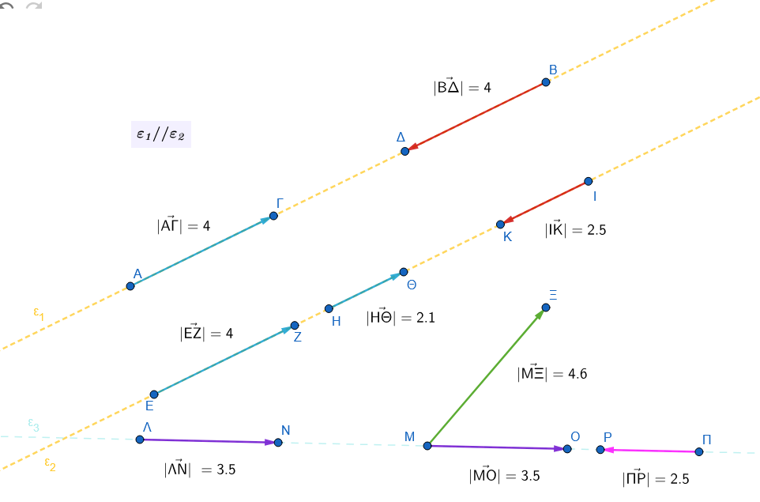
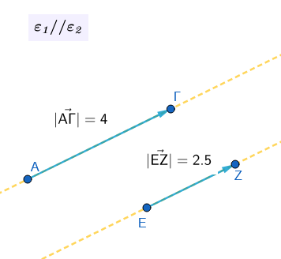
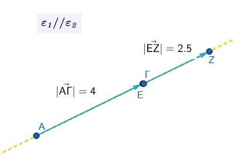
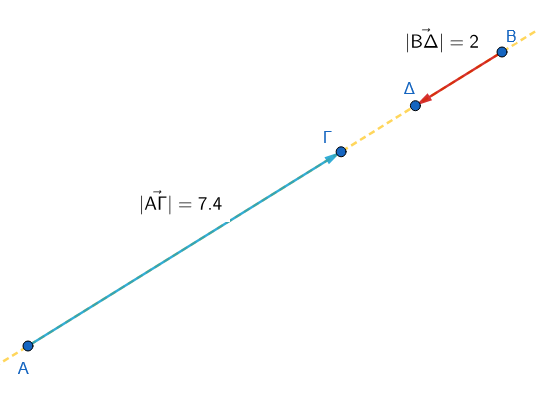
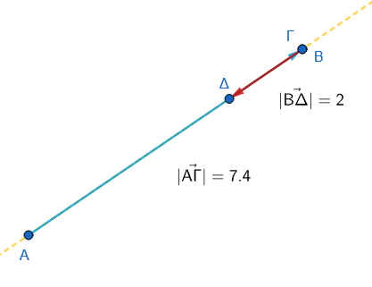
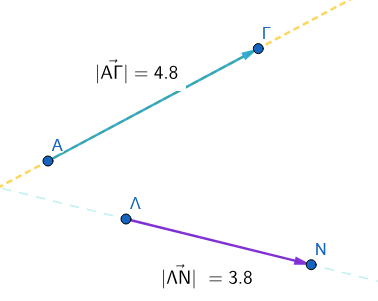
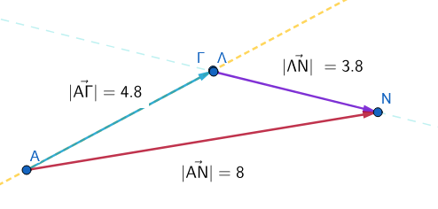
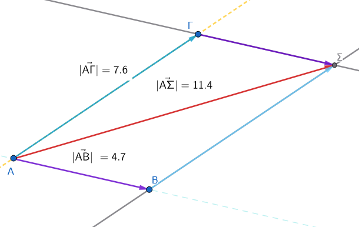

```{=html}
<!-- Φόρτωση βιβλιοθήκης GeoGebra -->
<script src="https://www.geogebra.org/apps/deployggb.js"></script>

<!-- Συνάρτηση δημιουργίας applets -->
<script>
function createGeoGebra(containerId, materialId, width = 700, height = 500) {
  var params = {
    "id": "ggb-" + containerId,
    "material_id": materialId,
    "width": width,
    "height": height,
    "showToolBar": true,
    "showMenuBar": false,
    "showAlgebraInput": true
  };
  
  var applet = new GGBApplet(params, '5.2');
  applet.inject(containerId);
}
</script>
```

## Διανύσματα

### βαθμωτά ή μονόμετρα μεγέθη

::: {style="background-color: #E7CEF0; border: 2px solid #2f3e50; color: #25188a; padding: 15px; border-radius: 5px;"}

**Βαθμωτά ή μονόμετρα μεγέθη** είναι τα μεγέθη εκείνα που προσδιορίζονται πλήρως αν δώσουμε μόνο το **μέτρο** τους (δηλαδή έναν αριθμό και μια μονάδα μέτρησης).

Μερικά βασικά παραδείγματα από την καθημερινή ζωή και τη φυσική περιλαμβάνουν:

\* **Τον χρόνο:** π.χ.
10 sec(δευτερόλεπτα), 8 min(λεπτά), 5 h(ώρες).

\* **Τη θερμοκρασία:** π.χ.24 $C^o$ (βαθμοί Κελσίου) ή 40 $F^o$(Φαρενάιτ).

\* **Τη μάζα:** π.χ.
230 gr(γραμμάρια), 8,6 Kgr(χιλιόγραμμα).

\* **Την απόσταση:** 5 m, που αποτελεί αριθμητικό μέγεθος και διαφέρει από τη μετατόπιση.

Σε αντίθεση με αυτά, υπάρχουν τα **διανυσματικά μεγέθη** (όπως η ταχύτητα και η δύναμη), τα οποία εκτός από μέτρο χρειάζονται και κατεύθυνση για να οριστούν.

:::

------------------------------------------------------------------------

### διανυσματικά μεγέθη

::: {style="background-color: #E7CEF0; border: 2px solid #2f3e50; color: #25188a; padding: 15px; border-radius: 5px;"}

Τα **διανυσματικά μεγέθη** είναι εκείνα για τα οποία, εκτός από το μέτρο τους, είναι απαραίτητο να γνωρίζουμε και την **κατεύθυνσή** τους.

Ένα διανυσματικό μέγεθος παριστάνεται με ένα βέλος, που ονομάζεται **διάνυσμα**, και ορίζεται από τρία βασικά στοιχεία:

1.  **Μέτρο:** Το μήκος του ευθύγραμμου τμήματος (ένας αριθμός μαζί με τη μονάδα μέτρησης).\
    Στο παρακάτω σχήμα ποιά διανύσματα έχουν ίδιο μέτρο;

2.  **Διεύθυνση:** Η ευθεία πάνω στην οποία βρίσκεται το διάνυσμα.\
    Στο παρακάτω σχήμα ποιά διανύσματα έχουν ίδια διεύθυνση;

3.  **Φορά:** Ο προσανατολισμός του πάνω στην ευθεία (προς τα πού δείχνει το βέλος).\
    Στο παρακάτω σχήμα ποιά διανύσματα έχουν ίδια φορά και ποιά αντίθετη;\
    

Η διεύθυνση μαζί με τη φορά καθορίζουν την **κατεύθυνση** του μεγέθους.

Κλασικά παραδείγματα διανυσματικών μεγεθών είναι η **ταχύτητα**, η **δύναμη**, η **μετατόπιση** και η **επιτάχυνση**.

**Συμβολισμός**

Τα διανύσματα συμβολίζονται με ένα βέλος από πάνω τους.
π.χ.
$\vec{AB}$ $\quad$  η $\quad$  $\vecα$.   


Θέλοντας να δηλώσουμε και το μέτρο τους $\vec{|AB|}$ $\quad$  ή $\quad$   $\vec{|α|}$   και

την φορά τους $\vec{(AB)}$, $\quad$  $\vec{(BA)}$ $\quad$  η  $\quad$ $\vec{(α)}$

:::

------------------------------------------------------------------------

### Ίσα Διανύσματα:

::: {style="background-color: #E7CEF0; border: 2px solid #2f3e50; color: #25188a; padding: 15px; border-radius: 5px;"}

Δύο διανύσματα είναι ίσα όταν έχουν την ίδια διεύθυνση, την ίδια φορά και το ίδιο μέτρο.

Παράδειγμα: Αν το $\vec{a}$ έχει μέτρο 5 cm και φορά προς τα δεξιά, κάθε διάνυσμα με μέτρο 5 cm και φορά προς τα δεξιά είναι ίσο με το $\vec{a}$.

- Στο παραπάνω σχήμα βρείτε ίσα διανύσματα

:::

### Αντίθετα Διανύσματα:


::: {style="background-color: #E7CEF0; border: 2px solid #2f3e50; color: #25188a; padding: 15px; border-radius: 5px;"}

Δύο διανύσματα είναι αντίθετα όταν έχουν την ίδια διεύθυνση, το ίδιο μέτρο, αλλά αντίθετη φορά.

Παράδειγμα: Αν $\vec{a}$ δείχνει “Βόρεια” με μέτρο 3, το αντίθετό του $-\vec{a}$ δείχνει “Νότια” με το ίδιο μέτρο 3.

- Στο παραπάνω σχήμα βρείτε αντίθετα διανύσματα

:::

### πρόσθεση διανυσμάτων

::: {style="background-color: #E7CEF0; border: 2px solid #2f3e50; color: #25188a; padding: 15px; border-radius: 5px;"}


Η πρόσθεση διανυσμάτων μπορεί να γίνει με δύο βασικές μεθόδους, ανάλογα με το πώς είναι τοποθετημένα τα διανύσματα στο επίπεδο:

1.  **Έχουν την ίδια κατεύθυνση** (βρίσκονται στην ίδια ευθεία ή σε παράλληλες ευθείες) και **ομόρροπα**



μετακινούμε το ένα παράλληλα ώστε η αρχή του να συμπέσει με το τέλος του άλλου

\


τότε $\vec{AΓ}+\vec{ΕΖ}=\vec{ΑΖ}$\

**αντίρροπα**



μεταφέρουμε



\
Η πρόσθεση αντίρροπων διανυσμάτων είναι μια ειδική περίπτωση πρόσθεσης διανυσμάτων όπου τα διανύσματα βρίσκονται πάνω στην ίδια ευθεία (είναι συγγραμμικά) και έχουν αντίθετη φορά.


**1: Κατανόηση των Αντίρροπων Διανυσμάτων**
Τα αντίρροπα διανύσματα είναι εκείνα που έχουν την ίδια διεύθυνση (είναι παράλληλα) αλλά αντίθετη φορά. Αν έχουμε δύο διανύσματα $\vec{α}$ και $\vec{β}$ που είναι αντίρροπα, το $\vec{β}$ μπορεί να γραφτεί ως $\vec{β} = -k \cdot \vec{α}$, όπου $k$ ένας θετικός αριθμός.

**2: Πρόσθεση**
Για να προσθέσουμε δύο αντίρροπα διανύσματα, εφαρμόζουμε τον κανόνα της "διαδοχής":

1. Σχεδιάζουμε το πρώτο διάνυσμα $\vec{α}$.
2. Τοποθετούμε την αρχή του δεύτερου διανύσματος $\vec{β}$ στο πέρας (στην άκρη) του $\vec{α}$.
3. Επειδή το $\vec{β}$ έχει αντίθετη φορά, το διάνυσμα θα "επιστρέψει" πάνω στην ίδια ευθεία.

**3: Μαθηματικός Υπολογισμός του Μέτρου**

Το μέτρο του διανύσματος-αποτελέσματος (συνισταμένη $\vec{s}$) ισούται με τη **διαφορά των μέτρων** τους, και η φορά του είναι ίδια με τη φορά του διανύσματος που έχει το μεγαλύτερο μέτρο.

*   Αν $|\vec{α}| > |\vec{β}|$, τότε $|\vec{s}| = |\vec{α}| - |\vec{β}|$ και η φορά είναι η ίδια με το $\vec{α}$.
*   Αν $|\vec{β}| > |\vec{α}|$, τότε $|\vec{s}| = |\vec{β}| - |\vec{α}|$ και η φορά είναι η ίδια με το $\vec{β}$.

**Τελικά**
Το άθροισμα δύο αντίρροπων διανυσμάτων είναι ένα νέο διάνυσμα με μέτρο ίσο με την απόλυτη διαφορά των μέτρων τους και φορά προς την κατεύθυνση του μεγαλύτερου σε μέτρο διανύσματος.


---


2.  **Η μέθοδος του πολυγώνου:** Μεταφέρουμε παράλληλα τα διανύσματα έτσι ώστε να γίνουν **διαδοχικά** (δηλαδή η αρχή του δεύτερου να συμπίπτει με το πέρας του πρώτου κ.ο.κ.). Το άθροισμα είναι το διάνυσμα που έχει αρχή την αρχή του πρώτου και πέρας το πέρας του τελευταίου διανύσματος.\
    



παρατηρήστε ότι το άθροισμα $\vec{|AN|}$ στην περίπτωση αυτή δεν έχει μέτρο όσο το άθροισμα των μέτρων των επί μέρους διανυσμάτων $\vec{|AΓ|}$ και $\vec{|ΛΝ|}$.

3.  **Η μέθοδος του παραλληλογράμμου:** Χρησιμοποιείται όταν δύο διανύσματα έχουν **κοινή αρχή**. Σχηματίζουμε ένα παραλληλόγραμμο με πλευρές τα δύο διανύσματα. Το άθροισμά τους είναι η **διαγώνιος** του παραλληλογράμμου που ξεκινά από την κοινή τους αρχή.\
    \
    \
    Εξηγήστε γιατί.

Στη Φυσική, το αποτέλεσμα της πρόσθεσης διανυσμάτων (π.χ. δυνάμεων) ονομάζεται **συνισταμένη**.

:::

------------------------------------------------------------------------

### Διαφορά μεταξύ απόστασης και μετατόπισης

Η κύρια διαφορά τους είναι ότι η **απόσταση** είναι ένα βαθμωτό (αριθμητικό) μέγεθος, ενώ η **μετατόπιση** είναι διανυσματικό μέγεθος.

Πιο αναλυτικά:\
\* **Απόσταση:** Εκφράζει το συνολικό μήκος της διαδρομής που διένυσε ένα σώμα.
Για παράδειγμα, λέμε ότι ένα πλοίο διένυσε 960 ναυτικά μίλια, χωρίς όμως να ξέρουμε προς τα πού κατευθύνθηκε.\
\* **Μετατόπιση:** Μας δείχνει ακριβώς πού ξεκίνησε και πού κατέληξε ένα σώμα, περιλαμβάνοντας τόσο το μήκος όσο και την κατεύθυνση.
Για παράδειγμα, λέμε ότι το πλοίο μετατοπίστηκε 240 μίλια προς τον Νότο.

Είναι σημαντικό να θυμόμαστε ότι το μέτρο της μετατόπισης (η ευθεία απόσταση αρχικής και τελικής θέσης) δεν ταυτίζεται απαραίτητα με τη συνολική απόσταση που διανύθηκε.

------------------------------------------------------------------------

### Διαφορά μεταξύ διεύθυνσης και φοράς

Η διαφορά μεταξύ διεύθυνσης και φοράς είναι ουσιαστική για τον ορισμό ενός διανύσματος:

- **Διεύθυνση:** Είναι η ευθεία πάνω στην οποία βρίσκεται το διάνυσμα ή οποιαδήποτε άλλη ευθεία παράλληλη προς αυτή. Φανταστείτε την ως τον "δρόμο" πάνω στον οποίο κινείται το διάνυσμα.
- **Φορά:** Καθορίζεται από το σημείο αρχής και το σημείο τέλους (πέρας) του διανύσματος. Δείχνει προς ποια από τις δύο δυνατές πλευρές της ευθείας κατευθύνεται το βέλος (π.χ. από το Α προς το Β ή από το Β προς το Α).

Συνδυαστικά, η διεύθυνση μαζί με τη φορά προσδιορίζουν την **κατεύθυνση** ενός διανύσματος.

------------------------------------------------------------------------

### Διαφορά δύο διανυσμάτων

::: {style="background-color: #E7CEF0; border: 2px solid #2f3e50; color: #25188a; padding: 15px; border-radius: 5px;"}

Η διαφορά δύο διανυσμάτων $\vec{α}$ και $\vec{β}$ ορίζεται ως η πρόσθεση του πρώτου διανύσματος με το αντίθετο του δεύτερου. Δηλαδή: $\vec{α} - \vec{β} = \vec{α} + (-\vec{β})$.


**1: Κατασκευή του Αντίθετου Διανύσματος**
Για να αφαιρέσουμε το διάνυσμα $\vec{β}$ από το $\vec{α}$, πρέπει πρώτα να βρούμε το αντίθετο διάνυσμα του $\vec{β}$, το οποίο συμβολίζουμε ως $-\vec{β}$. Το $-\vec{β}$ έχει το ίδιο μέτρο και την ίδια διεύθυνση με το $\vec{β}$, αλλά την ακριβώς αντίθετη φορά.

**2: Εφαρμογή του Κανόνα της Πρόσθεσης**
Μετατρέπουμε την αφαίρεση σε πρόσθεση: $\vec{α} + (-\vec{β})$. Τοποθετούμε την αρχή του $-\vec{β}$ στο πέρας του $\vec{α}$. Το διάνυσμα που ξεκινά από την αρχή του $\vec{α}$ και καταλήγει στο πέρας του $-\vec{β}$ είναι η διαφορά $\vec{d} = \vec{α} - \vec{β}$.

**3: Εναλλακτικός Κανόνας (Κοινή Αρχή)**
Αν τοποθετήσουμε τα διανύσματα $\vec{α}$ και $\vec{β}$ έτσι ώστε να έχουν την ίδια αρχή, τότε η διαφορά $\vec{α} - \vec{β}$ είναι το διάνυσμα που έχει **αρχή** το πέρας του $\vec{β}$ και **πέρας** το πέρας του $\vec{α}$. (Προσοχή: το βέλος δείχνει πάντα προς το διάνυσμα από το οποίο αφαιρούμε).

**Τελικά**
Η διαφορά $\vec{α} - \vec{β}$ είναι ένα νέο διάνυσμα που προκύπτει από την πρόσθεση του $\vec{α}$ με το αντίθετο του $\vec{β}$, ή γεωμετρικά ως το διάνυσμα που συνδέει τα πέρατα των δύο διανυσμάτων όταν αυτά έχουν κοινή αρχή.

:::
---


**Η αναγωγή της αφαίρεσης σε πρόσθεση.**

Στα διανύσματα δεν υπάρχει "αφαίρεση" με την παραδοσιακή έννοια των αριθμών, αλλά η έννοια της **πρόσθεσης μιας αντίθετης κατεύθυνσης**. Αυτό είναι εξαιρετικά χρήσιμο στη Φυσική για τον υπολογισμό μεταβολών μεγεθών, όπως η μεταβολή της ταχύτητας ($\Delta\vec{v} = \vec{v}_{Τελική} - \vec{v}_{Αρχική}$), η οποία ορίζει την επιτάχυνση.
\
\

### Ασκήσεις


1.  **Αναγνώριση Μεγεθών:** Ποια από τα παρακάτω μεγέθη χρειάζονται διάνυσμα για να παρασταθούν πλήρως και γιατί: α) βάρος, β) ύψος, γ) μάζα, δ) ταχύτητα;
2.  **Χαρακτηριστικά Στοιχεία:** Ένα διάνυσμα συμβολίζεται ως $\vec{AB}$. Ποιο σημείο ονομάζεται αρχή, ποιο πέρας και ποια είναι τα τρία βασικά στοιχεία που το προσδιορίζουν;


3.  **Ίσα και Αντίθετα σε Τετράγωνο:** Δίνεται τετράγωνο ΑΒΓΔ. Εξετάστε ποια από τα διανύσματα $\vec{AB}, \vec{BΓ}, \vec{ΓΔ}, \vec{ΔΓ}, \vec{ΔΑ}, \vec{ΑΔ}$ έχουν ίσα μέτρα, ποια είναι ίσα και ποια είναι αντίθετα.
4.  **Ιδιότητες στο Εξάγωνο:** Σε ένα κανονικό εξάγωνο ΑΒΓΔΕΖ με κέντρο Ο, προσδιορίστε τρία διανύσματα που είναι ίσα με το $\vec{AB}$ και τρία διανύσματα που είναι αντίθετα με το $\vec{AZ}$.


5.  **Άθροισμα σε Παραλληλόγραμμο:** Σε παραλληλόγραμμο ΑΒΓΔ, υπολογίστε τα αθροίσματα: α) $\vec{AB} + \vec{AΔ}$ και β) $\vec{AB} + \vec{BΓ}$.
6.  **Διαφορά με Κοινή Αρχή:** Έστω παραλληλόγραμμο ΑΒΓΔ με κέντρο Ο. Συγκρίνετε τις διαφορές διανυσμάτων $\vec{BO} - \vec{BA}$ και $\vec{BΓ} - \vec{BO}$. Τι παρατηρείτε;
7.  **Μηδενικό Διάσυσμα:** Σε ένα τυχαίο τετράπλευρο ΑΒΓΔ, να αποδείξετε ότι το άθροισμα $\vec{AB} + \vec{BΓ} + \vec{ΓΔ} + \vec{ΔΑ}$ ισούται με το μηδενικό διάνυσμα $\vec{0}$.


8.  **Συνισταμένη Ταχυτήτων:** Μια βάρκα διασχίζει κάθετα ένα ποτάμι με ταχύτητα μηχανής 2 m/s, αλλά παρασύρεται από το ρεύμα που έχει ταχύτητα 0,6 m/s. Σχεδιάστε τις δύο ταχύτητες και τη διεύθυνση της τελικής κίνησης.

**Λύση**

Για να λύσουμε την άσκηση με τη βάρκα, ακολουθούμε τη λογική της σύνθεσης των ταχυτήτων: 

Κάντε τα παρακάτω με χαρτί και μολύβι.

1.  **Σχεδίαση των διανυσμάτων:** 
    *   Σχεδιάζουμε ένα διάνυσμα $\vec{v_1}$ (ταχύτητα μηχανής) κάθετο στις όχθες του ποταμού με μέτρο 2 m/s.
    *   Από την ίδια αρχή, σχεδιάζουμε ένα διάνυσμα $\vec{v_2}$ (ταχύτητα ρεύματος) παράλληλο στις όχθες με μέτρο 0,6 m/s.

2.  **Εύρεση της τελικής κατεύθυνσης:**
    *   Επειδή οι δύο ταχύτητες ασκούνται ταυτόχρονα, η βάρκα θα κινηθεί κατά τη διεύθυνση της **συνισταμένης** τους.
    *   Χρησιμοποιούμε τη **μέθοδο του παραλληλογράμμου**: σχηματίζουμε ένα ορθογώνιο με πλευρές τα δύο διανύσματα. Η τελική ταχύτητα $\vec{v_{ολ}}$ είναι η **διαγώνιος** που ξεκινά από την κοινή τους αρχή.

Η βάρκα τελικά θα ακολουθήσει μια πλάγια διαδρομή, παρασυρόμενη από το ρεύμα.

Υπολογίστε το ακριβές **μέτρο** της τελικής ταχύτητας χρησιμοποιώντας το Πυθαγόρειο θεώρημα


9.  **Ανάλυση Δύναμης:** Μια δύναμη $\vec{F}$ με μέτρο 5 Ν αναλύεται σε δύο κάθετες συνιστώσες $\vec{F_1}$ και $\vec{F_2}$. Αν η μία συνιστώσα έχει μέτρο 4 Ν, υπολογίστε το μέτρο της άλλης.

10. **Υπολογισμός με Τριγωνομετρία:** Μια δύναμη $\vec{F}$ έχει μέτρο 6000 Ν και σχηματίζει γωνία $30^\circ$ με ένα οριζόντιο δοκάρι. Υπολογίστε τα μέτρα της οριζόντιας και της κάθετης συνιστώσας της, χρησιμοποιώντας το ημίτονο και το συνημίτονο της γωνίας.

**Λύση**


Θα χρησιμοποιήσουμε το **ημίτονο** και το **συνημίτονο** για να αναλύσουμε τη δύναμη στις δύο κάθετες συνιστώσες της, την οριζόντια και την κατακόρυφη.

**Κάντε ένα σχέδιο στο χαρτί σας**

Σύμφωνα με τη θεωρία, αν $\theta$ είναι η γωνία που σχηματίζει η δύναμη με τον οριζόντιο άξονα, τότε:

*   **Οριζόντια συνιστώσα ($F_{οριζ}$):** Υπολογίζεται από τον τύπο $F_{οριζ} = |\vec{F}| \cdot συν\theta$.
    Για τη συγκεκριμένη άσκηση: $F_{οριζ} = 6000 \cdot συν30^\circ = 6000 \cdot \frac{\sqrt{3}}{2} = 3000\sqrt{3} \approx 5196$ N.
*   **Κάθετη συνιστώσα ($F_{καθ}$):** Υπολογίζεται από τον τύπο $F_{καθ} = |\vec{F}| \cdot ημ\theta$.
    Για τη συγκεκριμένη άσκηση: $F_{καθ} = 6000 \cdot ημ30^\circ = 6000 \cdot \frac{1}{2} = 3000$ N.

Με αυτόν τον τρόπο βρίσκουμε πώς η πλάγια δύναμη των 6000 N "μοιράζεται" στους δύο άξονες. 


---


11.   Δίνεται ένα διάνυσμα $\vec{a}$ με μέτρο $|\vec{a}|=8$ cm και κατεύθυνση προς τα δεξιά. Σχεδιάστε και περιγράψτε το αντίθετο διάνυσμά του $-\vec{a}$. Ποιο είναι το μέτρο του;


12.  Αν δύο διανύσματα $\vec{x}$ και $\vec{y}$ είναι ίσα, τι μπορείτε να πείτε για το μέτρο, τη διεύθυνση και τη φορά τους; Αν $|\vec{x}|=10$, πόσο είναι το $|\vec{y}|$;


13.  Ένα σώμα μετατοπίζεται από το σημείο Α στο σημείο Β και στη συνέχεια επιστρέφει στο σημείο Α. Ποιο είναι το συνολικό διάνυσμα μετατόπισης και ποιο το μέτρο του;


14.  **(Συγγραμμικά - Ομόρροπα):** Δύο δυνάμεις $\vec{F_1}$ και $\vec{F_2}$ έχουν την ίδια διεύθυνση και φορά, με μέτρα 12 N και 5 N αντίστοιχα. Υπολογίστε το μέτρο της συνισταμένης δύναμης $\vec{F_{ολ}} = \vec{F_1} + \vec{F_2}$.


15.  **(Συγγραμμικά - Αντίρροπα):** Ένας άνθρωπος σπρώχνει ένα κιβώτιο προς τα δεξιά με δύναμη $F_1 = 20$ N, ενώ ένας δεύτερος το σπρώχνει προς τα αριστερά με δύναμη $F_2 = 15$ N. Βρείτε το μέτρο και τη φορά της συνολικής δύναμης.


16.  **(Κανόνας Τριγώνου):** Σχεδιάστε δύο τυχαία διανύσματα $\vec{a}$ και $\vec{b}$ που δεν είναι παράλληλα. Σχεδιάστε το άθροισμά τους $\vec{s} = \vec{a} + \vec{b}$ χρησιμοποιώντας τον κανόνα του τριγώνου.


17.  **(Διαφορά):** Δίνονται δύο διανύσματα $\vec{a}$ (προς τα πάνω) και $\vec{b}$ (προς τα δεξιά). Σχεδιάστε το διάνυσμα της διαφοράς $\vec{d} = \vec{a} - \vec{b}$.


18.  **(Κάθετα Διανύσματα):** Ένα πλοίο κινείται 3 km Βόρεια ($\vec{d_1}$) και μετά 4 km Ανατολικά ($\vec{d_2}$). 
    *   α) Σχεδιάστε τα διανύσματα.
    *   β) Υπολογίστε το μέτρο της συνολικής μετατόπισης (Hint: Πυθαγόρειο Θεώρημα).


19.  **(Πολλαπλασιασμός με αριθμό):** Αν το διάνυσμα $\vec{v}$ έχει μέτρο 4 m/s και φορά προς το Βορρά, περιγράψτε το διάνυσμα $\vec{u} = 3\vec{v}$ και το διάνυσμα $\vec{w} = -2\vec{v}$.


20. **(Μηδενικό Διάνυσμα):** Αν για τρία διανύσματα ισχύει η σχέση $\vec{a} + \vec{b} + \vec{c} = \vec{0}$, τι σχήμα θα σχηματίσουν αν τα τοποθετήσουμε το ένα μετά το άλλο (διαδοχικά);

---

**Σύντομες Απαντήσεις για έλεγχο:**


11. $|\vec{-a}|=8$, φορά προς τα αριστερά.
12. Ίσα μέτρα, ίδια διεύθυνση/φορά. $|\vec{y}|=10$.
13. Μηδενικό διάνυσμα $\vec{0}$, μέτρο 0.
14. $F_{ολ} = 17$ N.
15. $F_{ολ} = 5$ N, προς τα δεξιά.
18. β) 5 km.
19. $\vec{u}$: μέτρο 12, Βόρεια. $\vec{w}$: μέτρο 8, Νότια.
20. Ένα κλειστό τρίγωνο.

---


21. Ένα σημείο $K$ βρίσκεται πάνω σε ένα χαρτί. Το μετατοπίζουμε κατά το διάνυσμα $\vec{u}$ και πάει στη θέση 
$Λ$. Μετά, το σημείο $Λ$ το μετατοπίζουμε ξανά κατά το ίδιο διάνυσμα $\vec{u}$ και πάει στη θέση $M$.
Πόσες φορές το διάνυσμα 
$\vec{u}$ είναι το συνολικό διάνυσμα 
$\vec{KM}$;

22. **Το μυρμήγκι περπατάει**
Ένα μυρμήγκι περπατάει πάνω στις πλευρές ενός εξαγώνου $ABΓΔEΖ$. Ξεκινάει από το $A$, πάει στο 
$B$, μετά στο $Γ$, μετά στο $Δ$ και σταματάει εκεί.
Γράψε το άθροισμα των διανυσμάτων της διαδρομής του και βρες ποιο είναι το τελικό διάνυσμα της μετατόπισής του.


::: {.callout-tip style="color: blue;"}
## Να τηρείτε τον παρακάτω κανόνα

Σε αυτά τα προβλήματα, δοκιμάστε πρώτα να κάνετε ένα πρόχειρο σχήμα (τα διανύσματα) και ακολουθήστε τους κανόνες.
:::

::: {style="background-color: #E7CEF0; border: 2px solid #2f3e50; color: #25188a; padding: 15px; border-radius: 5px;"}
ΚΑΛΗ ΜΕΛΕΤΗ !
:::
