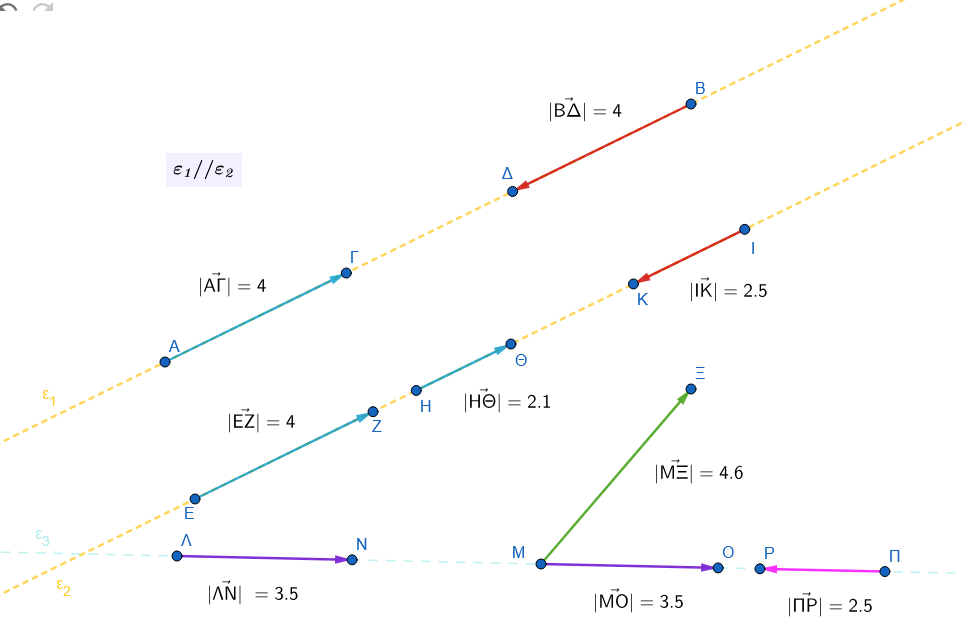

```{=html}
<!-- Φόρτωση βιβλιοθήκης GeoGebra -->
<script src="https://www.geogebra.org/apps/deployggb.js"></script>

<!-- Συνάρτηση δημιουργίας applets -->
<script>
function createGeoGebra(containerId, materialId, width = 700, height = 500) {
  var params = {
    "id": "ggb-" + containerId,
    "material_id": materialId,
    "width": width,
    "height": height,
    "showToolBar": true,
    "showMenuBar": false,
    "showAlgebraInput": true
  };
  
  var applet = new GGBApplet(params, '5.2');
  applet.inject(containerId);
}
</script>
```

## Διανύσματα

### βαθμωτά ή μονόμετρα μεγέθη

::: {style="background-color: #c682d9; border: 2px solid #2f3e50; color: #171426; padding: 15px; border-radius: 5px;"}
**Βαθμωτά ή μονόμετρα μεγέθη** είναι τα μεγέθη εκείνα που προσδιορίζονται πλήρως αν δώσουμε μόνο το **μέτρο** τους (δηλαδή έναν αριθμό και μια μονάδα μέτρησης).

Μερικά βασικά παραδείγματα από την καθημερινή ζωή και τη φυσική περιλαμβάνουν:

\* **Τον χρόνο:** π.χ.
10 sec(δευτερόλεπτα), 8 min(λεπτά), 5 h(ώρες).

\* **Τη θερμοκρασία:** π.χ.24 $C^o$ (βαθμοί Κελσίου) ή 40 $F^o$(Φαρενάιτ).

\* **Τη μάζα:** π.χ.
230 gr(γραμμάρια), 8,6 Kgr(χιλιόγραμμα).

\* **Την απόσταση:** 5 m, που αποτελεί αριθμητικό μέγεθος και διαφέρει από τη μετατόπιση.

Σε αντίθεση με αυτά, υπάρχουν τα **διανυσματικά μεγέθη** (όπως η ταχύτητα και η δύναμη), τα οποία εκτός από μέτρο χρειάζονται και κατεύθυνση για να οριστούν.
:::

------------------------------------------------------------------------

### διανυσματικά μεγέθη

::: {style="background-color: #c682d9; border: 2px solid #2f3e50; color: #171426; padding: 15px; border-radius: 5px;"}
Τα **διανυσματικά μεγέθη** είναι εκείνα για τα οποία, εκτός από το μέτρο τους, είναι απαραίτητο να γνωρίζουμε και την **κατεύθυνσή** τους.

Ένα διανυσματικό μέγεθος παριστάνεται με ένα βέλος, που ονομάζεται **διάνυσμα**, και ορίζεται από τρία βασικά στοιχεία:

1.  **Μέτρο:** Το μήκος του ευθύγραμμου τμήματος (ένας αριθμός μαζί με τη μονάδα μέτρησης).\
    Στο παρακάτω σχήμα ποιά διανύσματα έχουν ίδιο μέτρο;

2.  **Διεύθυνση:** Η ευθεία πάνω στην οποία βρίσκεται το διάνυσμα.\
    Στο παρακάτω σχήμα ποιά διανύσματα έχουν ίδια διεύθυνση;

3.  **Φορά:** Ο προσανατολισμός του πάνω στην ευθεία (προς τα πού δείχνει το βέλος).\
    Στο παρακάτω σχήμα ποιά διανύσματα έχουν ίδια φορά και ποιά αντίθετη;\
    

Η διεύθυνση μαζί με τη φορά καθορίζουν την **κατεύθυνση** του μεγέθους.

Κλασικά παραδείγματα διανυσματικών μεγεθών είναι η **ταχύτητα**, η **δύναμη**, η **μετατόπιση** και η **επιτάχυνση**.

**Συμβολισμός**

Τα διανύσματα συμβολίζονται με ένα βέλος από πάνω τους.
π.χ.
$\vec{AB}$ $\quad$ η $\quad$ $\vecα$.

Θέλοντας να δηλώσουμε και το μέτρο τους $\vec{|AB|}$ $\quad$ ή $\quad$ $\vec{|α|}$ και

την φορά τους $\vec{(AB)}$, $\quad$ $\vec{(BA)}$ $\quad$ η $\quad$ $\vec{(α)}$
:::

------------------------------------------------------------------------

### Ίσα Διανύσματα:

::: {style="background-color: #c682d9; border: 2px solid #2f3e50; color: #171426; padding: 15px; border-radius: 5px;"}
Δύο διανύσματα είναι ίσα όταν έχουν την ίδια διεύθυνση, την ίδια φορά και το ίδιο μέτρο.

Παράδειγμα: Αν το $\vec{a}$ έχει μέτρο 5 cm και φορά προς τα δεξιά, κάθε διάνυσμα με μέτρο 5 cm και φορά προς τα δεξιά είναι ίσο με το $\vec{a}$.

- Στο παραπάνω σχήμα βρείτε ίσα διανύσματα
:::

### Αντίθετα Διανύσματα:

::: {style="background-color: #c682d9; border: 2px solid #2f3e50; color: #171426; padding: 15px; border-radius: 5px;"}
Δύο διανύσματα είναι αντίθετα όταν έχουν την ίδια διεύθυνση, το ίδιο μέτρο, αλλά αντίθετη φορά.

Παράδειγμα: Αν $\vec{a}$ δείχνει “Βόρεια” με μέτρο 3, το αντίθετό του $-\vec{a}$ δείχνει “Νότια” με το ίδιο μέτρο 3.

- Στο παραπάνω σχήμα βρείτε αντίθετα διανύσματα
:::


### Ασκήσεις

1.  **Αναγνώριση Μεγεθών:** Ποια από τα παρακάτω μεγέθη χρειάζονται διάνυσμα για να παρασταθούν πλήρως και γιατί: α) βάρος, β) ύψος, γ) μάζα, δ) ταχύτητα;

2.  **Χαρακτηριστικά Στοιχεία:** Ένα διάνυσμα συμβολίζεται ως $\vec{AB}$.
    Ποιο σημείο ονομάζεται αρχή, ποιο πέρας και ποια είναι τα τρία βασικά στοιχεία που το προσδιορίζουν;

3.  **Ίσα και Αντίθετα σε Τετράγωνο:** Δίνεται τετράγωνο ΑΒΓΔ.
    Εξετάστε ποια από τα διανύσματα $\vec{AB}, \vec{BΓ}, \vec{ΓΔ}, \vec{ΔΓ}, \vec{ΔΑ}, \vec{ΑΔ}$ έχουν ίσα μέτρα, ποια είναι ίσα και ποια είναι αντίθετα.

4.  **Ιδιότητες στο Εξάγωνο:** Σε ένα κανονικό εξάγωνο ΑΒΓΔΕΖ με κέντρο Ο, προσδιορίστε τρία διανύσματα που είναι ίσα με το $\vec{AB}$ και τρία διανύσματα που είναι αντίθετα με το $\vec{AZ}$.


::: {.callout-tip style="color: blue;"}
## Να τηρείτε τον παρακάτω κανόνα

Σε αυτά τα προβλήματα, δοκιμάστε πρώτα να κάνετε ένα πρόχειρο σχήμα (τα διανύσματα) και ακολουθήστε τους κανόνες.
:::

::: {style="background-color: #E7CEF0; border: 2px solid #2f3e50; color: #25188a; padding: 15px; border-radius: 5px;"}
ΚΑΛΗ ΜΕΛΕΤΗ !
:::
