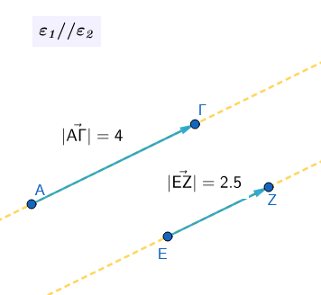
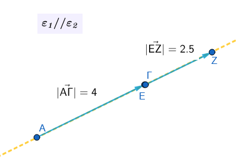
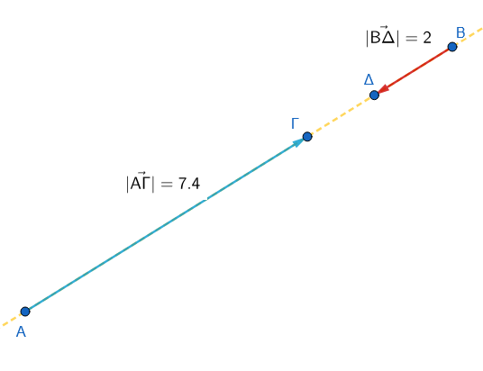
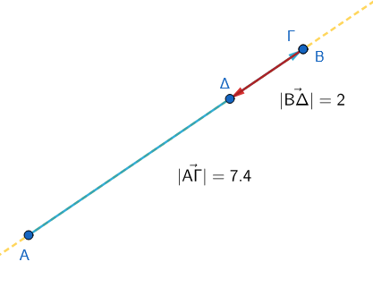
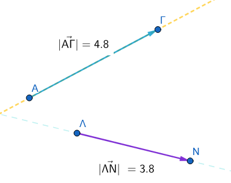
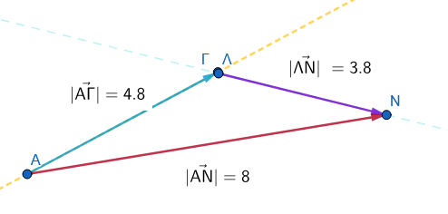
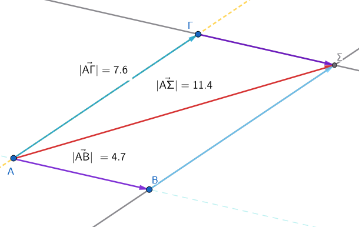
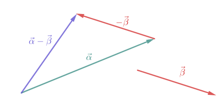
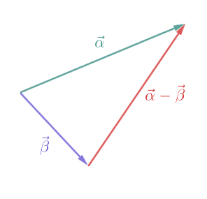
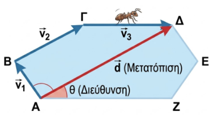

```{=html}
<!-- Φόρτωση βιβλιοθήκης GeoGebra -->
<script src="https://www.geogebra.org/apps/deployggb.js"></script>

<!-- Συνάρτηση δημιουργίας applets -->
<script>
function createGeoGebra(containerId, materialId, width = 700, height = 500) {
  var params = {
    "id": "ggb-" + containerId,
    "material_id": materialId,
    "width": width,
    "height": height,
    "showToolBar": true,
    "showMenuBar": false,
    "showAlgebraInput": true
  };
  
  var applet = new GGBApplet(params, '5.2');
  applet.inject(containerId);
}
</script>
```

## Άθροισμα και διαφορά διανυσμάτων

### πρόσθεση διανυσμάτων

::: {style="background-color: #c682d9; border: 2px solid #2f3e50; color: #171426; padding: 15px; border-radius: 5px;"}
Η πρόσθεση διανυσμάτων μπορεί να γίνει με δύο βασικές μεθόδους, ανάλογα με το πώς είναι τοποθετημένα τα διανύσματα στο επίπεδο:

1.  **Έχουν την ίδια κατεύθυνση** (βρίσκονται στην ίδια ευθεία ή σε παράλληλες ευθείες) και **ομόρροπα**



μετακινούμε το ένα παράλληλα ώστε η αρχή του να συμπέσει με το τέλος του άλλου

\


τότε $\vec{AΓ}+\vec{ΕΖ}=\vec{ΑΖ}$

2.  **αντίρροπα**



μεταφέρουμε



\
Η πρόσθεση αντίρροπων διανυσμάτων είναι μια ειδική περίπτωση πρόσθεσης διανυσμάτων όπου τα διανύσματα βρίσκονται πάνω στην ίδια ευθεία (είναι συγγραμμικά) και έχουν αντίθετη φορά.

**1: Κατανόηση των Αντίρροπων Διανυσμάτων** Τα αντίρροπα διανύσματα είναι εκείνα που έχουν την ίδια διεύθυνση (είναι παράλληλα) αλλά αντίθετη φορά.

Αν έχουμε δύο διανύσματα $\vec{α}$ και $\vec{β}$ που είναι αντίρροπα, το $\vec{β}$ μπορεί να γραφτεί ως $\vec{β} = -k \cdot \vec{α}$, όπου $k$ ένας θετικός αριθμός.

**2: Πρόσθεση** Για να προσθέσουμε δύο αντίρροπα διανύσματα, εφαρμόζουμε τον κανόνα της "διαδοχής":

1.  Σχεδιάζουμε το πρώτο διάνυσμα $\vec{α}$.
2.  Τοποθετούμε την αρχή του δεύτερου διανύσματος $\vec{β}$ στο πέρας (στην άκρη) του $\vec{α}$.
3.  Επειδή το $\vec{β}$ έχει αντίθετη φορά, το διάνυσμα θα "επιστρέψει" πάνω στην ίδια ευθεία.

**3: Μαθηματικός Υπολογισμός του Μέτρου**

Το μέτρο του διανύσματος-αποτελέσματος (συνισταμένη $\vec{s}$) ισούται με τη **διαφορά των μέτρων** τους, και η φορά του είναι ίδια με τη φορά του διανύσματος που έχει το μεγαλύτερο μέτρο.

- Αν $|\vec{α}| > |\vec{β}|$, τότε $|\vec{s}| = |\vec{α}| - |\vec{β}|$ και η φορά είναι η ίδια με το $\vec{α}$.
- Αν $|\vec{β}| > |\vec{α}|$, τότε $|\vec{s}| = |\vec{β}| - |\vec{α}|$ και η φορά είναι η ίδια με το $\vec{β}$.

**Τελικά** Το άθροισμα δύο αντίρροπων διανυσμάτων είναι ένα νέο διάνυσμα με μέτρο ίσο με την απόλυτη διαφορά των μέτρων τους και φορά προς την κατεύθυνση του μεγαλύτερου σε μέτρο διανύσματος.

------------------------------------------------------------------------

2.  **Η μέθοδος του πολυγώνου:** Μεταφέρουμε παράλληλα τα διανύσματα έτσι ώστε να γίνουν **διαδοχικά** (δηλαδή η αρχή του δεύτερου να συμπίπτει με το πέρας του πρώτου κ.ο.κ.).

Το άθροισμα είναι το διάνυσμα που έχει αρχή την αρχή του πρώτου και πέρας το πέρας του τελευταίου διανύσματος.\




$\vec{ΑΝ}=\vec{ΑΓ}+\vec{ΛΝ}$

παρατηρήστε ότι το άθροισμα $\vec{|AN|}$ στην περίπτωση αυτή **δεν** έχει μέτρο όσο το άθροισμα των μέτρων των επί μέρους διανυσμάτων $\vec{|AΓ|}$ και $\vec{|ΛΝ|}$.

3.  **Η μέθοδος του παραλληλογράμμου:** Χρησιμοποιείται όταν δύο διανύσματα έχουν **κοινή αρχή**. Σχηματίζουμε ένα παραλληλόγραμμο με πλευρές τα δύο διανύσματα. Το άθροισμά τους είναι η **διαγώνιος** του παραλληλογράμμου που ξεκινά από την κοινή τους αρχή.\
    \
    \

$\vec{ΑΣ}=\vec{ΑΒ}+\vec{ΑΓ}$

```         
Εξηγήστε γιατί.
```

Στη Φυσική, το αποτέλεσμα της πρόσθεσης διανυσμάτων (π.χ. δυνάμεων) ονομάζεται **συνισταμένη**.
:::

------------------------------------------------------------------------

### Διαφορά μεταξύ απόστασης και μετατόπισης

Η κύρια διαφορά τους είναι ότι η **απόσταση** είναι ένα βαθμωτό (αριθμητικό) μέγεθος, ενώ η **μετατόπιση** είναι διανυσματικό μέγεθος.

Πιο αναλυτικά:\

\* **Απόσταση:** Εκφράζει το συνολικό μήκος της διαδρομής που διένυσε ένα σώμα.
Για παράδειγμα, λέμε ότι ένα πλοίο διένυσε 960 ναυτικά μίλια, χωρίς όμως να ξέρουμε προς τα πού κατευθύνθηκε.\

\* **Μετατόπιση:** Μας δείχνει ακριβώς πού ξεκίνησε και πού κατέληξε ένα σώμα, περιλαμβάνοντας τόσο το μήκος όσο και την κατεύθυνση.
Για παράδειγμα, λέμε ότι το πλοίο μετατοπίστηκε 240 μίλια προς τον Νότο.

**Είναι σημαντικό να θυμόμαστε ότι το μέτρο της μετατόπισης (η ευθεία απόσταση αρχικής και τελικής θέσης) δεν ταυτίζεται απαραίτητα με τη συνολική απόσταση που διανύθηκε.**

------------------------------------------------------------------------

### Διαφορά μεταξύ διεύθυνσης και φοράς

Η διαφορά μεταξύ διεύθυνσης και φοράς είναι ουσιαστική για τον ορισμό ενός διανύσματος:

- **Διεύθυνση:** Είναι η ευθεία πάνω στην οποία βρίσκεται το διάνυσμα ή οποιαδήποτε άλλη ευθεία παράλληλη προς αυτή.
  Φανταστείτε την ως τον "δρόμο" πάνω στον οποίο κινείται το διάνυσμα.

- **Φορά:** Καθορίζεται από το σημείο αρχής και το σημείο τέλους (πέρας) του διανύσματος.
  Δείχνει προς ποια από τις δύο δυνατές πλευρές της ευθείας κατευθύνεται το βέλος (π.χ. από το Α προς το Β ή από το Β προς το Α).

Συνδυαστικά, η διεύθυνση μαζί με τη φορά προσδιορίζουν την **κατεύθυνση** ενός διανύσματος.

------------------------------------------------------------------------

### Διαφορά δύο διανυσμάτων

::: {style="background-color: #c682d9; border: 2px solid #2f3e50; color: #171426; padding: 15px; border-radius: 5px;"}
Η διαφορά δύο διανυσμάτων $\vec{α}$ και $\vec{β}$ ορίζεται ως η πρόσθεση του πρώτου διανύσματος με το αντίθετο του δεύτερου.

Δηλαδή: $\vec{α} - \vec{β} = \vec{α} + (-\vec{β})$.

**1: Κατασκευή του Αντίθετου Διανύσματος** Για να αφαιρέσουμε το διάνυσμα $\vec{β}$ από το $\vec{α}$, πρέπει πρώτα να βρούμε το αντίθετο διάνυσμα του $\vec{β}$, το οποίο συμβολίζουμε ως $-\vec{β}$.



Το $-\vec{β}$ έχει το ίδιο μέτρο και την ίδια διεύθυνση με το $\vec{β}$, αλλά την ακριβώς αντίθετη φορά.

**2: Εφαρμογή του Κανόνα της Πρόσθεσης** Μετατρέπουμε την αφαίρεση σε πρόσθεση: $\vec{α} + (-\vec{β})$.

Τοποθετούμε την αρχή του $-\vec{β}$ στο πέρας του $\vec{α}$.

Το διάνυσμα που ξεκινά από την αρχή του $\vec{α}$ και καταλήγει στο πέρας του $-\vec{β}$ είναι η διαφορά $\vec{d} = \vec{α} - \vec{β}$.

**3: Εναλλακτικός Κανόνας (Κοινή Αρχή)** Αν τοποθετήσουμε τα διανύσματα $\vec{α}$ και $\vec{β}$ έτσι ώστε να έχουν την ίδια αρχή, τότε η διαφορά $\vec{α} - \vec{β}$ είναι το διάνυσμα που έχει **αρχή** το πέρας του $\vec{β}$ και **πέρας** το πέρας του $\vec{α}$.
(Προσοχή: το βέλος δείχνει πάντα προς το διάνυσμα από το οποίο αφαιρούμε).\

\


**Τελικά** Η διαφορά $\vec{α} - \vec{β}$ είναι ένα νέο διάνυσμα που προκύπτει από την πρόσθεση του $\vec{α}$ με το αντίθετο του $\vec{β}$, ή γεωμετρικά ως το διάνυσμα που συνδέει τα πέρατα των δύο διανυσμάτων όταν αυτά έχουν κοινή αρχή.
:::

------------------------------------------------------------------------

**Η αναγωγή της αφαίρεσης σε πρόσθεση.**

Στα διανύσματα δεν υπάρχει "αφαίρεση" με την παραδοσιακή έννοια των αριθμών, αλλά η έννοια της **πρόσθεσης μιας αντίθετης κατεύθυνσης**.
Αυτό είναι εξαιρετικά χρήσιμο στη Φυσική για τον υπολογισμό μεταβολών μεγεθών, όπως η μεταβολή της ταχύτητας ($Δ\vec{v} = \vec{v}_{Τελική} - \vec{v}_{Αρχική}$), η οποία ορίζει την επιτάχυνση.\

\

### Ασκήσεις

1.  **Άθροισμα σε Παραλληλόγραμμο:** Σε παραλληλόγραμμο ΑΒΓΔ, υπολογίστε τα αθροίσματα:

  -  α) $\vec{AB} + \vec{AΔ}$ και

  -  β) $\vec{AB} + \vec{BΓ}$.

2.  **Διαφορά με Κοινή Αρχή:** Έστω παραλληλόγραμμο ΑΒΓΔ με κέντρο Ο.
    Συγκρίνετε τις διαφορές διανυσμάτων $\vec{BO} - \vec{BA}$ και $\vec{BΓ} - \vec{BO}$.
    Τι παρατηρείτε;

3.  **Μηδενικό Διάσυσμα:** Σε ένα τυχαίο τετράπλευρο ΑΒΓΔ, να αποδείξετε ότι το άθροισμα $\vec{AB} + \vec{BΓ} + \vec{ΓΔ} + \vec{ΔΑ}$ ισούται με το μηδενικό διάνυσμα $\vec{0}$.

4.  Ένα σώμα μετατοπίζεται από το σημείο Α στο σημείο Β και στη συνέχεια επιστρέφει στο σημείο Α.
    Ποιο είναι το συνολικό διάνυσμα μετατόπισης και ποιο το μέτρο του;

5.  **(Συγγραμμικά - Ομόρροπα):** Δύο δυνάμεις $\vec{F_1}$ και $\vec{F_2}$ έχουν την ίδια διεύθυνση και φορά, με μέτρα 12 N και 5 N αντίστοιχα.
    Υπολογίστε το μέτρο της συνισταμένης δύναμης $\vec{F_{ολ}} = \vec{F_1} + \vec{F_2}$.

6.  **(Συγγραμμικά - Αντίρροπα):** Ένας άνθρωπος σπρώχνει ένα κιβώτιο προς τα δεξιά με δύναμη $F_1 = 20$ N, ενώ ένας δεύτερος το σπρώχνει προς τα αριστερά με δύναμη $F_2 = 15$ N.
    Βρείτε το μέτρο και τη φορά της συνολικής δύναμης.

7.  **(Κανόνας Τριγώνου):** Σχεδιάστε δύο τυχαία διανύσματα $\vec{a}$ και $\vec{b}$ που δεν είναι παράλληλα.
    Σχεδιάστε το άθροισμά τους $\vec{s} = \vec{a} + \vec{b}$ χρησιμοποιώντας τον κανόνα του τριγώνου.

8.  **(Διαφορά):** Δίνονται δύο διανύσματα $\vec{a}$ (προς τα πάνω) και $\vec{b}$ (προς τα δεξιά).
    Σχεδιάστε το διάνυσμα της διαφοράς $\vec{d} = \vec{a} - \vec{b}$.

9.  **(Κάθετα Διανύσματα):** Ένα πλοίο κινείται 3 km Βόρεια ($\vec{d_1}$) και μετά 4 km Ανατολικά ($\vec{d_2}$).

    - α) Σχεδιάστε τα διανύσματα.

    - β) Υπολογίστε το μέτρο της συνολικής μετατόπισης (: Πυθαγόρειο Θεώρημα).

10. **(Πολλαπλασιασμός με αριθμό):** Αν το διάνυσμα $\vec{v}$ έχει μέτρο 4 m/s και φορά προς το Βορρά, περιγράψτε το διάνυσμα $\vec{u} = 3\vec{v}$ και το διάνυσμα $\vec{w} = -2\vec{v}$.

11. **(Μηδενικό Διάνυσμα):** Αν για τρία διανύσματα ισχύει η σχέση $\vec{a} + \vec{b} + \vec{c} = \vec{0}$, τι σχήμα θα σχηματίσουν αν τα τοποθετήσουμε το ένα μετά το άλλο (διαδοχικά);

12. Ένα σημείο $K$ βρίσκεται πάνω σε ένα χαρτί.
    Το μετατοπίζουμε κατά το διάνυσμα $\vec{u}$ και πάει στη θέση $Λ$.
    Μετά, το σημείο $Λ$ το μετατοπίζουμε ξανά κατά το ίδιο διάνυσμα $\vec{u}$ και πάει στη θέση $M$.
    Πόσες φορές το διάνυσμα $\vec{u}$ είναι το συνολικό διάνυσμα $\vec{KM}$;

13. **Το μυρμήγκι περπατάει** Ένα μυρμήγκι περπατάει πάνω στις πλευρές ενός εξαγώνου $ABΓΔEΖ$.
    Ξεκινάει από το $A$, πάει στο $B$, μετά στο $Γ$, μετά στο $Δ$ και σταματάει εκεί.
    Γράψε το άθροισμα των διανυσμάτων της διαδρομής του και βρες ποιο είναι το τελικό διάνυσμα της μετατόπισής του.\

    \
    {width="400"}

14. **Συμπλήρωση Κενών** Δίνονται τέσσερα σημεία Π, Ρ, Σ και Τ.
    Να συμπληρώσετε τις ισότητες:

  - α) $\vec{Π P} + \vec{P...} = \vec{Π Σ}$

  - β) $\vec{PΣ} = \vec{P...} + \vec{... Σ}$

  - γ) $\vec{... Σ} - \vec{... Π} = \vec{Π Σ}$

  - δ) $\vec{Π Σ} = \vec{Π T} + \vec{T...} + \vec{... Σ}$

**Βήμα-βήμα Λύση:**

  - 1.  Χρήση κανόνα : $\vec{Π P} + \vec{PΣ} = \vec{Π Σ}$.

  - 2.  Ανάλυση με ενδιάμεσο σημείο Τ: $\vec{PΣ} = \vec{PT} + \vec{TΣ}$.
    ή $vec{ΡΣ}=Vec{ΡΠ}+vec{ΠΣ}$

  - 3.  Διαφορά διανυσμάτων με κοινή αρχή το Ρ: $\vec{PΣ} - \vec{PΠ} = \vec{Π Σ}$.

  - 4.  Διαδοχικά διανύσματα: $\vec{Π Σ} = \vec{Π T} + \vec{TP} + \vec{PΣ}$.


15.  **(Γεωμετρική Ερμηνεία)** Η ισότητα $\vec{XZ} = \vec{XY} + \vec{X \Omega}$ είναι σωστή αν το σχήμα $XY Z \Omega$ είναι:

  - Α: Τυχαίο τετράπλευρο.

  - Β: Παραλληλόγραμμο με διαγώνιο την XZ.

  - Γ: Τρίγωνο με διάμεσο την XZ.

**Βήμα-βήμα Λύση:**

  - 1.  Ο κανόνας του παραλληλογράμμου ορίζει ότι το άθροισμα δύο διανυσμάτων με κοινή αρχή είναι η διαγώνιος του παραλληλογράμμου που σχηματίζουν.

  - 2.  Άρα, το $XY Z \Omega$ πρέπει να είναι παραλληλόγραμμο.
    (Σωστό το Β)


16.  **(Παραλληλόγραμμο & Σημείο Ο)** Σε παραλληλόγραμμο ΕΖΗΘ και τυχαίο σημείο Ο, επιλέξτε το σωστό:

  - α) $\vec{EZ} + \vec{EΘ} =$ ; (Επιλογές: $\vec{EH}, \vec{ZΘ}, \vec{0}$)

  - β) $\vec{OE} + \vec{ZH} =$ ; (Επιλογές: $\vec{OH}, \vec{OΘ}, \vec{EΘ}$)

**Βήμα-βήμα Λύση:**

  - 1.  Στο παραλληλόγραμμο $\vec{EZ} + \vec{EΘ} = \vec{EH}$ (κανόνας παραλληλογράμμου).

  - 2.  Επειδή $\vec{ZH} = \vec{EΘ}$, έχουμε $\vec{OE} + \vec{EΘ} = \vec{OΘ}$.


17.  Στο παραλληλόγραμμο $ABΓΔ$, να εκφράσετε το διάνυσμα $\vec{AΓ}$ ως άθροισμα των διανυσμάτων $\vec{AB}$ και $\vec{AΔ}$.


18.  Σε ένα τρίγωνο $ABΓ$, θεωρούμε τα μέσα $M$ και $N$ των πλευρών $AB$ και $AΓ$ αντίστοιχα.
    Να αποδειχθεί ότι $\vec{MN} = \dfrac{1}{2}\vec{BΓ}$.

**Λύση** 

  - 1.  Εκφράζουμε το διάνυσμα $\vec{MN}$ ως διαφορά: $\vec{MN} = \vec{AN} - \vec{AM}$.
  - 2.  Επειδή το $N$ είναι μέσο της $AΓ$, έχουμε $\vec{AN} = \dfrac{1}{2}\vec{AΓ}$.
  - 3.  Επειδή το $M$ είναι μέσο της $AB$, έχουμε $\vec{AM} = \dfrac{1}{2}\vec{AB}$.
  - 4.  Άρα, $\vec{MN} = \dfrac{1}{2}\vec{AΓ} - \dfrac{1}{2}\vec{AB} = \dfrac{1}{2}(\vec{AΓ} - \vec{AB})$.
  - 5.  Από τον κανόνα του τριγώνου, $\vec{AΓ} - \vec{AB} = \vec{BΓ}$.
  - 6.  Επομένως, $\vec{MN} = \dfrac{1}{2}\vec{BΓ}$.


19. Στο παραλληλόγραμμο $ABΓΔ$, να υπολογίσετε το άθροισμα $\vec{AB} + \vec{AΔ} + \vec{Γ A}$.

**Λύση**

  - 1.  Ομαδοποιούμε τα διανύσματα: $(\vec{AB} + \vec{AΔ}) + \vec{Γ A}$.

  - 2.  Από τον κανόνα του παραλληλογράμμου, $\vec{AB} + \vec{AΔ} = ....................$.

  - 3.  .......................................................


20.  Στο τετράπλευρο $ABΓΔ$, να αποδειχθεί ότι $\vec{AB} + \vec{BΓ} + \vec{ΓΔ} + \vec{Δ A} = \vec{0}$.


21.  Σε ένα κανονικό εξάγωνο $ABΓΔ EZ$ με κέντρο $O$, να εκφράσετε το διάνυσμα $\vec{AB} + \vec{AΓ} + \vec{AΔ} + \vec{AE} + \vec{AZ}$ συναρτήσει του $\vec{AO}$.

------------------------------------------------------------------------

::: {.callout-tip style="color: blue;"}
## Να τηρείτε τον παρακάτω κανόνα

Σε αυτά τα προβλήματα, δοκιμάστε πρώτα να κάνετε ένα πρόχειρο σχήμα (τα διανύσματα) και ακολουθήστε τους κανόνες.
:::

::: {style="background-color: #E7CEF0; border: 2px solid #2f3e50; color: #25188a; padding: 15px; border-radius: 5px;"}
ΚΑΛΗ ΜΕΛΕΤΗ !
:::
