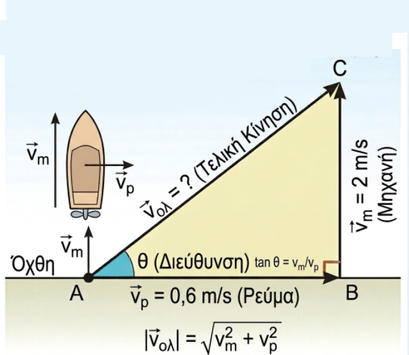
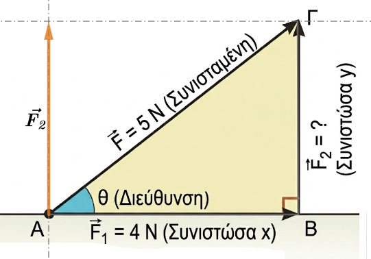
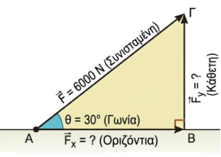

```{=html}
<!-- Φόρτωση βιβλιοθήκης GeoGebra -->
<script src="https://www.geogebra.org/apps/deployggb.js"></script>

<!-- Συνάρτηση δημιουργίας applets -->
<script>
function createGeoGebra(containerId, materialId, width = 700, height = 500) {
  var params = {
    "id": "ggb-" + containerId,
    "material_id": materialId,
    "width": width,
    "height": height,
    "showToolBar": true,
    "showMenuBar": false,
    "showAlgebraInput": true
  };
  
  var applet = new GGBApplet(params, '5.2');
  applet.inject(containerId);
}
</script>
```

## Ανάλυση διανύσματος σε δύο κάθετες συνιστώσες

### Ανάλυση διανύσματος σε δύο κάθετες συνιστώσες

::: {style="background-color: #c682d9; border: 2px solid #2f3e50; color: #171426; padding: 15px; border-radius: 5px;"}
Η **ανάλυση ενός διανύσματος** (ή μιας δύναμης) σε δύο κάθετες συνιστώσες είναι η διαδικασία κατά την οποία αντικαθιστούμε ένα διάνυσμα με δύο άλλα, κάθετα μεταξύ τους, τα οποία επιφέρουν το ίδιο αποτέλεσμα.
Η διαδικασία αυτή είναι εξαιρετικά χρήσιμη στη Φυσική και τη Μηχανική, καθώς απλοποιεί την επίλυση προβλημάτων επιτρέποντας τη μελέτη των δυνάμεων σε συγκεκριμένες διευθύνσεις.

#### Γραφική Μέθοδος Ανάλυσης

Για να αναλύσουμε γραφικά ένα διάνυσμα $\vec{F}$ σε δύο κάθετες συνιστώσες, ακολουθούμε τα εξής βήματα: 

1.  **Σχεδιασμός Αξόνων:** Στην αρχή του διανύσματος σχεδιάζουμε δύο κάθετες ευθείες (άξονες $x'x$ και $y'y$).

2.  **Προβολές:** Από το πέρας (το τέλος) του διανύσματος φέρνουμε ευθείες παράλληλες προς τους άξονες.

3.  **Σχηματισμός Συνιστωσών:** Τα σημεία τομής αυτών των παραλλήλων με τους άξονες ορίζουν το τέλος των δύο συνιστωσών, $\vec{F_x}$ και $\vec{F_y}$.
Το σχήμα που προκύπτει είναι ένα **ορθογώνιο παραλληλόγραμμο**, όπου το αρχικό διάνυσμα αποτελεί τη διαγώνιό του.
:::

### Μέτρα Συνιστωσών -Μαθηματικός Υπολογισμός (Τριγωνομετρία)

::: {style="background-color: #c682d9; border: 2px solid #2f3e50; color: #171426; padding: 15px; border-radius: 5px;"}
Αν γνωρίζουμε το μέτρο της δύναμης $F$ και τη γωνία $\theta$ που σχηματίζει με τον οριζόντιο άξονα, μπορούμε να υπολογίσουμε τα μέτρα των συνιστωσών χρησιμοποιώντας την τριγωνομετρία σε ένα ορθογώνιο τρίγωνο: \

* **Οριζόντια συνιστώσα:** $F_x = F \cdot \sigma \upsilon \nu \theta$.

* **Κατακόρυφη συνιστώσα:** $F_y = F \cdot \eta \mu \theta$.

Ένας πρακτικός κανόνας για να θυμάστε ποιον τριγωνομετρικό αριθμό θα χρησιμοποιήσετε είναι ότι **η συνιστώσα που «ακουμπάει» στη γωνία $\theta$ υπολογίζεται με το συνημίτονο**, ενώ η **συνιστώσα που βρίσκεται απέναντι από τη γωνία υπολογίζεται με το ημίτονο**.

### Επιλογή Αξόνων και Εφαρμογές

Οι διευθύνσεις των αξόνων δεν είναι απαραίτητα μόνο η κατακόρυφη και η οριζόντια, αλλά επιλέγονται με βάση την ευκολία του προβλήματος: \

* **Κεκλιμένο επίπεδο:** Όταν ένα σώμα (π.χ. ένας σκιέρ ή ένα φορτηγό) βρίσκεται σε κατηφόρα, είναι πιο αποτελεσματικό να αναλύουμε το βάρος του σε έναν άξονα **παράλληλο** προς το έδαφος (που προκαλεί την κίνηση) και έναν άξονα **κάθετο** σε αυτό.

* **Στατική κτιρίων:** Οι μηχανικοί αναλύουν τις πλάγιες δυνάμεις ενός σεισμού σε οριζόντιες και κάθετες συνιστώσες για να υπολογίσουν την αντοχή σε δοκάρια και κολόνες αντίστοιχα.
:::

### Συνήθη Σφάλματα

::: {style="background-color: #c682d9; border: 2px solid #2f3e50; color: #171426; padding: 15px; border-radius: 5px;"}
Σύμφωνα με μελέτες, οι μαθητές συχνά δυσκολεύονται στην ανάλυση διανυσμάτων, κάνοντας λάθη όπως: 

* **Σύγχυση ημιτόνου και συνημιτόνου**, ειδικά όταν η γωνία δίνεται σε σχέση με τον κατακόρυφο άξονα και όχι τον οριζόντιο.

* **Λάθη στα πρόσημα**, κυρίως όταν το διάνυσμα δίνεται από την «αιχμή» (tip) και όχι από την «ουρά» (tail).

* **Λανθασμένος σχηματισμός τριγώνου**, όπου το αρχικό διάνυσμα δεν τοποθετείται ως υποτείνουσα, οδηγώντας στη χρήση εφαπτομένης αντί για ημίτονο/συνημίτονο.

Η διαδικασία της **σημείωσης της γωνίας πάνω στο σχήμα** από τον ίδιο τον μαθητή έχει αποδειχθεί ότι βελτιώνει σημαντικά την ακρίβεια των υπολογισμών.
:::

### Ασκήσεις

1.  **Συνισταμένη Ταχυτήτων:** Μια βάρκα διασχίζει κάθετα ένα ποτάμι με ταχύτητα μηχανής 2 m/s, αλλά παρασύρεται από το ρεύμα που έχει ταχύτητα 0,6 m/s.
    Σχεδιάστε τις δύο ταχύτητες και τη διεύθυνση της τελικής κίνησης.\

    \
    {width="400"}

**Λύση**

    Για να λύσουμε την άσκηση με τη βάρκα, ακολουθούμε τη λογική της σύνθεσης των ταχυτήτων:

Κάντε τα παρακάτω με χαρτί και μολύβι.

  1.  **Σχεδίαση των διανυσμάτων:**
    - Σχεδιάζουμε ένα διάνυσμα $\vec{v_m}$ (ταχύτητα μηχανής) κάθετο στις όχθες του ποταμού με μέτρο 2 m/s.
    - Από την ίδια αρχή, σχεδιάζουμε ένα διάνυσμα $\vec{v_p}$ (ταχύτητα ρεύματος) παράλληλο στις όχθες με μέτρο 0,6 m/s.
  2.  **Εύρεση της τελικής κατεύθυνσης:**
    - Επειδή οι δύο ταχύτητες ασκούνται ταυτόχρονα, η βάρκα θα κινηθεί κατά τη διεύθυνση της **συνισταμένης** τους.
    - Χρησιμοποιούμε τη **μέθοδο του παραλληλογράμμου**: σχηματίζουμε ένα ορθογώνιο με πλευρές τα δύο διανύσματα. Η τελική ταχύτητα $\vec{v_{ολ}}$ είναι η **διαγώνιος** που ξεκινά από την κοινή τους αρχή.

    Η βάρκα τελικά θα ακολουθήσει μια πλάγια διαδρομή, παρασυρόμενη από το ρεύμα.

  Υπολογίστε το ακριβές **μέτρο** της τελικής ταχύτητας χρησιμοποιώντας το Πυθαγόρειο θεώρημα

2.  **Ανάλυση Δύναμης:** Μια δύναμη $\vec{F}$ με μέτρο 5 Ν αναλύεται σε δύο κάθετες συνιστώσες $\vec{F_1}$ και $\vec{F_2}$.
    Αν η μία συνιστώσα έχει μέτρο 4 Ν, υπολογίστε το μέτρο της άλλης.\

    \
    {width="400"}

3. **Υπολογισμός με Τριγωνομετρία:** Μια δύναμη $\vec{F}$ έχει μέτρο 6000 Ν και σχηματίζει γωνία $30^\circ$ με ένα οριζόντιο δοκάρι.
    Υπολογίστε τα μέτρα της οριζόντιας και της κάθετης συνιστώσας της, χρησιμοποιώντας το ημίτονο και το συνημίτονο της γωνίας.\

    \
    

**Λύση**

   Θα χρησιμοποιήσουμε το **ημίτονο** και το **συνημίτονο** για να αναλύσουμε τη δύναμη στις δύο κάθετες συνιστώσες της, την οριζόντια και την κατακόρυφη.

**Κάντε ένα σχέδιο στο χαρτί σας**

  Σύμφωνα με τη θεωρία, αν $\theta$ είναι η γωνία που σχηματίζει η δύναμη με τον οριζόντιο άξονα, τότε:

  - **Οριζόντια συνιστώσα (**$F_{οριζ}$): Υπολογίζεται από τον τύπο $F_{οριζ} = |\vec{F}| \cdot συν\theta$. Για τη συγκεκριμένη άσκηση: $F_{οριζ} = 6000 \cdot συν30^\circ = 6000 \cdot \frac{\sqrt{3}}{2} = 3000\sqrt{3} \approx 5196$ N.
  - **Κάθετη συνιστώσα (**$F_{καθ}$): Υπολογίζεται από τον τύπο $F_{καθ} = |\vec{F}| \cdot ημ\theta$. Για τη συγκεκριμένη άσκηση: $F_{καθ} = 6000 \cdot ημ30^\circ = 6000 \cdot \frac{1}{2} = 3000$ N.

    Με αυτόν τον τρόπο βρίσκουμε πώς η πλάγια δύναμη των 6000 N "μοιράζεται" στους δύο άξονες.

4. Δίνεται ένα διάνυσμα $\vec{a}$ με μέτρο $|\vec{a}|=8$ cm και κατεύθυνση προς τα δεξιά.
    Σχεδιάστε και περιγράψτε το αντίθετο διάνυσμά του $-\vec{a}$.
    Ποιο είναι το μέτρο του;

5. Αν δύο διανύσματα $\vec{x}$ και $\vec{y}$ είναι ίσα, τι μπορείτε να πείτε για το μέτρο, τη διεύθυνση και τη φορά τους; Αν $|\vec{x}|=10$, πόσο είναι το $|\vec{y}|$;

6. Ένα σώμα μετατοπίζεται από το σημείο Α στο σημείο Β και στη συνέχεια επιστρέφει στο σημείο Α.
    Ποιο είναι το συνολικό διάνυσμα μετατόπισης και ποιο το μέτρο του;

7. **(Συγγραμμικά - Ομόρροπα):** Δύο δυνάμεις $\vec{F_1}$ και $\vec{F_2}$ έχουν την ίδια διεύθυνση και φορά, με μέτρα 12 N και 5 N αντίστοιχα.
    Υπολογίστε το μέτρο της συνισταμένης δύναμης $\vec{F_{ολ}} = \vec{F_1} + \vec{F_2}$.

8. **(Συγγραμμικά - Αντίρροπα):** Ένας άνθρωπος σπρώχνει ένα κιβώτιο προς τα δεξιά με δύναμη $F_1 = 20$ N, ενώ ένας δεύτερος το σπρώχνει προς τα αριστερά με δύναμη $F_2 = 15$ N.
    Βρείτε το μέτρο και τη φορά της συνολικής δύναμης.

9. **(Κανόνας Τριγώνου):** Σχεδιάστε δύο τυχαία διανύσματα $\vec{a}$ και $\vec{b}$ που δεν είναι παράλληλα.
    Σχεδιάστε το άθροισμά τους $\vec{s} = \vec{a} + \vec{b}$ χρησιμοποιώντας τον κανόνα του τριγώνου.

10. **(Διαφορά):** Δίνονται δύο διανύσματα $\vec{a}$ (προς τα πάνω) και $\vec{b}$ (προς τα δεξιά).
    Σχεδιάστε το διάνυσμα της διαφοράς $\vec{d} = \vec{a} - \vec{b}$.

11. **(Κάθετα Διανύσματα):** Ένα πλοίο κινείται 3 km Βόρεια ($\vec{d_1}$) και μετά 4 km Ανατολικά ($\vec{d_2}$).
    
    * α) Σχεδιάστε τα διανύσματα.
    
    * β) Υπολογίστε το μέτρο της συνολικής μετατόπισης (Hint: Πυθαγόρειο Θεώρημα).

12. **(Πολλαπλασιασμός με αριθμό):** Αν το διάνυσμα $\vec{v}$ έχει μέτρο 4 m/s και φορά προς το Βορρά, περιγράψτε το διάνυσμα $\vec{u} = 3\vec{v}$ και το διάνυσμα $\vec{w} = -2\vec{v}$.

13. **(Μηδενικό Διάνυσμα):** Αν για τρία διανύσματα ισχύει η σχέση $\vec{a} + \vec{b} + \vec{c} = \vec{0}$, τι σχήμα θα σχηματίσουν αν τα τοποθετήσουμε το ένα μετά το άλλο (διαδοχικά);

14. Ένα σημείο $K$ βρίσκεται πάνω σε ένα χαρτί.
    Το μετατοπίζουμε κατά το διάνυσμα $\vec{u}$ και πάει στη θέση $Λ$.
    Μετά, το σημείο $Λ$ το μετατοπίζουμε ξανά κατά το ίδιο διάνυσμα $\vec{u}$ και πάει στη θέση $M$.
    Πόσες φορές το διάνυσμα $\vec{u}$ είναι το συνολικό διάνυσμα $\vec{KM}$;


::: {.callout-tip style="color: blue;"}
## Να τηρείτε τον παρακάτω κανόνα

Σε αυτά τα προβλήματα, δοκιμάστε πρώτα να κάνετε ένα πρόχειρο σχήμα (τα διανύσματα) και ακολουθήστε τους κανόνες.
:::

::: {style="background-color: #E7CEF0; border: 2px solid #2f3e50; color: #25188a; padding: 15px; border-radius: 5px;"}
ΚΑΛΗ ΜΕΛΕΤΗ !
:::
