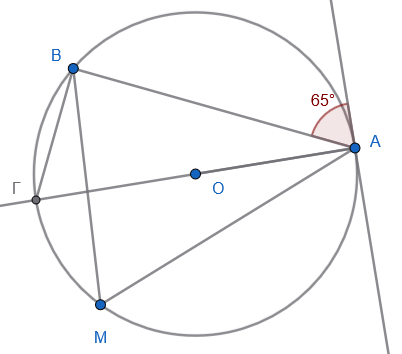
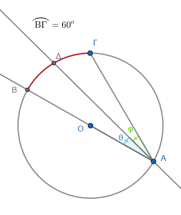
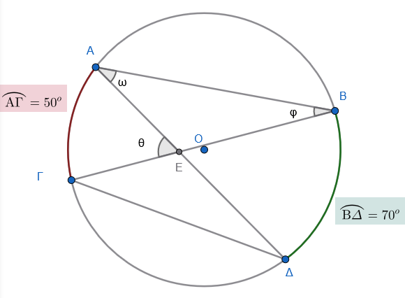
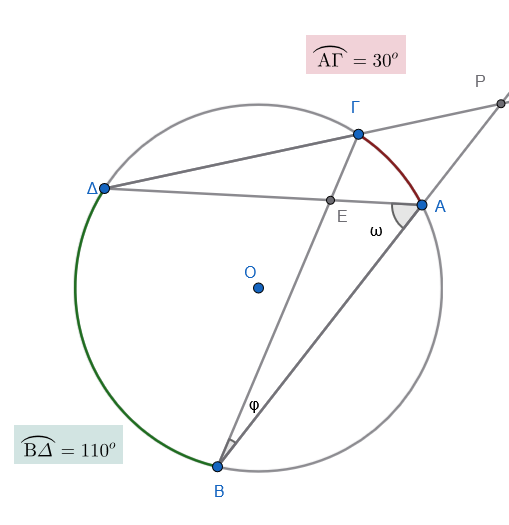
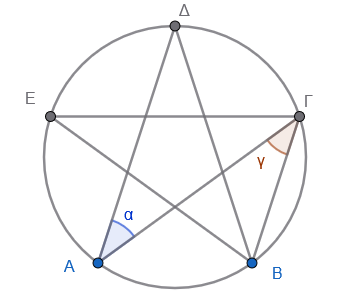

```{=html}
<!-- Φόρτωση βιβλιοθήκης GeoGebra -->
<script src="https://www.geogebra.org/apps/deployggb.js"></script>

<!-- Συνάρτηση δημιουργίας applets -->
<script>
function createGeoGebra(containerId, materialId, width = 700, height = 500) {
  var params = {
    "id": "ggb-" + containerId,
    "material_id": materialId,
    "width": width,
    "height": height,
    "showToolBar": true,
    "showMenuBar": false,
    "showAlgebraInput": true
  };
  
  var applet = new GGBApplet(params, '5.2');
  applet.inject(containerId);
}
</script>
```

## Εγγεγραμμένη γωνία

:::::: {style="background-color: #E7CEF0; border: 2px solid #2f3e50; color: #25188a; padding: 15px; border-radius: 5px;"}
Μια **εγγεγραμμένη γωνία** είναι η γωνία της οποίας η κορυφή βρίσκεται πάνω σε έναν κύκλο και οι πλευρές της τέμνουν τον κύκλο αυτό.
Το τμήμα του κύκλου που βρίσκεται ανάμεσα στις πλευρές της ονομάζεται αντίστοιχο τόξο της.

Μια **επίκεντρη γωνία** είναι η γωνία που έχει την κορυφή της στο κέντρο ενός κύκλου και οι πλευρές της είναι ακτίνες του κύκλου αυτού.

- **Πλήρης κύκλος:** Ένας ολόκληρος κύκλος αντιστοιχεί σε μια επίκεντρη γωνία $360^\circ$.

<iframe src="https://www.geogebra.org/calculator/h3rr57tg?embed" width="730" height="600" allowfullscreen style="border: 1px solid #e4e4e4;border-radius: 4px;" frameborder="0">

</iframe>

::: {.callout-tip style="color: brown;"}
## ενέργεια

Μετακινώντας το σημείο Ρ (ακτίνα του κύκλου), αλλάζετε μέγεθος στον κύκλο.
Τι παρατηρείτε ; Τι συμβαίνει με το μέγεθος της γωνίας και του αντίστοιχου τόξου;.

Μετακινήστε το σημείο Β ή το σημείο Γ για να αλλάξετε την γωνία.
Τι παρατηρείτε; Τι συμβαίνει με τα μεγέθη της γωνίας και του τόξου;
:::

### Συμπεράσματα - Ιδιότητες

- **Σχέση με την επίκεντρη:** Κάθε εγγεγραμμένη γωνία ισούται με το μισό της επίκεντρης γωνίας που έχει το ίδιο αντίστοιχο τόξο.

- **Μέτρο τόξου:** Το μέτρο της εγγεγραμμένης γωνίας είναι ίσο με το μισό του μέτρου του αντίστοιχου τόξου της.

::: {.callout-tip style="color: brown;"}
## ενέργεια

Μετακινήστε το σημείο Α για να αλλάξετε την κορυφή της γωνία; πάνω στον κύκλο.

Κάθε νέα θέση αντιστοιχεί σε μιά νέα εγγεγραμμένη γωνία.

Τι παρατηρείτε; Τι συμβαίνει με τα μεγέθη των γωνιών και του τόξου;
:::

- **Γωνίες στο ίδιο τόξο:** Όλες οι εγγεγραμμένες γωνίες που βαίνουν στο ίδιο τόξο (ή σε ίσα τόξα) είναι ίσες μεταξύ τους.

::: {.callout-tip style="color: brown;"}
## ενέργεια

Κάντε την επίκεντρη γωνία $180^ο$ μετακινώντας το σημείο Β ή Γ.
Επιλέξτε το σημείο και πατήστε <kbd>Shift</kbd> + <kbd>Βελάκια</kbd>.

Τι παρατηρείτε; Τι συμβαίνει με τα μεγέθη των γωνιών και του τόξου;
:::

- **Γωνία σε ημικύκλιο:** Κάθε εγγεγραμμένη γωνία που βαίνει σε ημικύκλιο είναι πάντα ορθή (90°).
::::::

### Ασκήσεις

**Βασικές Ασκήσεις (Κατανόηση)**

1.  **Υπολογισμός Τόξου:** Σε έναν κύκλο $(O, \rho)$, μια επίκεντρη γωνία $\widehat{AOB}$ είναι $70^\circ$. Πόσες μοίρες είναι το αντίστοιχο (μικρό) τόξο $\overparen{AB}$;
2.  **Σχέση Γωνιών**: Μια εγγεγραμμένη γωνία $\widehat{A\Gamma B}$ βαίνει στο τόξο $\overparen{AB}$, το οποίο είναι $120^\circ$. Να βρείτε το μέτρο της γωνίας $\widehat{A\Gamma B}$.
3.  **Από Εγγεγραμμένη σε Επίκεντρη**: Αν μια εγγεγραμμένη γωνία $\widehat{M}$ είναι $45^\circ$, πόσο είναι το μέτρο της αντίστοιχης επίκεντρης γωνίας που βαίνει στο ίδιο τόξο;
4.  **Ημικύκλιο**: Δίνεται ένας κύκλος με διάμετρο $AB$. Αν πάρουμε ένα τυχαίο σημείο $\Gamma$ πάνω στον κύκλο, πόσες μοίρες είναι η εγγεγραμμένη γωνία $\widehat{A\Gamma B}$;
5.  **Σχέση Εγγεγραμμένης και Επίκεντρης:** Αν μια επίκεντρη γωνία σε έναν κύκλο είναι $80^\circ$, πόσες μοίρες είναι η εγγεγραμμένη γωνία που βαίνει στο ίδιο τόξο;

**Σκεπτικό:** Κάθε εγγεγραμμένη γωνία ισούται με το μισό της επίκεντρης που έχει το ίδιο αντίστοιχο τόξο.

6.  **Υπολογισμός Γωνιών Τριγώνου:** Σε έναν κύκλο θεωρούμε τρία σημεία $Α, Β, Γ$ έτσι ώστε το τόξο $AB = 120^\circ$ και το τόξο $BΓ = 100^\circ$. Υπολογίστε τις γωνίες του τριγώνου $ABΓ$.

**Σκεπτικό:** Η εγγεγραμμένη γωνία έχει μέτρο ίσο με το μισό του μέτρου του αντίστοιχου τόξου της (π.χ. $\hat{A} = \dfrac{\overparen{BΓ}}{2}$).

**Ασκήσεις Εφαρμογής (Συνδυαστικές)**

1.  **Τρίγωνο και Κύκλος**: Σε έναν κύκλο, μια χορδή $AB$ είναι ίση με την ακτίνα του κύκλου $\rho$.

- α) Υπολογίστε την επίκεντρη γωνία $\widehat{AOB}$.
- β) Υπολογίστε μια εγγεγραμμένη γωνία $\widehat{A\Gamma B}$ που βαίνει στο τόξο $\overparen{AB}$.

2.  **Άθροισμα Τόξων:** Ένας κύκλος χωρίζεται από τρία σημεία $A, B, \Gamma$ σε τρία τόξα $\overparen{AB}, \overparen{B\Gamma}, \overparen{\Gamma A}$ που έχουν αναλογία $2:3:4$.
    Να βρείτε τις μοίρες κάθε τόξου και τις γωνίες του τριγώνου $AB\Gamma$.

3.  **Ορθογώνιο Τρίγωνο**: Σε κύκλο $(O, \rho)$, το τόξο $\overparen{AB}$ είναι $80^\circ$.
    Αν η χορδή $A\Gamma$ είναι διάμετρος, βρείτε όλες τις γωνίες του τριγώνου $AB\Gamma$.

4.  **Παράλληλες Χορδές**: Σε έναν κύκλο φέρνουμε δύο παράλληλες χορδές $AB$ και $\Gamma \Delta$.
    Αν το τόξο $\overparen{A\Gamma}$ είναι $50^\circ$, αποδείξτε ότι το τόξο $\overparen{B\Delta}$ είναι επίσης $50^\circ$ και υπολογίστε την εγγεγραμμένη γωνία που βαίνει στο τόξο $\overparen{B\Delta}$.\
    **tip**: Σχεδιάστε την τέμνουσα ΒΓ.
    (Εντός εναλλάξ γωνίες ..................)

5.  **Εύρεση Τόξου από Γωνία:** Αν μια εγγεγραμμένη γωνία $\phi$ είναι $25^\circ$, πόσο είναι το μέτρο του αντίστοιχου τόξου στο οποίο βαίνει;

**Σκεπτικό:** Το τόξο είναι διπλάσιο της αντίστοιχης εγγεγραμμένης γωνίας.

6.  **Άλγεβρα και Τόξα:** Σε κύκλο με διάμετρο $BΔ$, τα διαδοχικά τόξα $BΓ$ και $ΓΔ$ εκφράζονται ως $5x + 10^\circ$ και $x + 50^\circ$ αντίστοιχα. Βρείτε την τιμή του $x$.

**Σκεπτικό:** Εφόσον η $BΔ$ είναι διάμετρος, το άθροισμα των τόξων $BΓ + ΓΔ$ ισούται με ένα ημικύκλιο ($180^\circ$).

7.  **Γωνίες στο ίδιο Τόξο:** Αν δύο εγγεγραμμένες γωνίες $\hat{\alpha}$ και $\hat{\beta}$ βαίνουν στο ίδιο τόξο $BΓ$, ποια είναι η σχέση μεταξύ τους;

**Σκεπτικό:** Οι εγγεγραμμένες γωνίες ενός κύκλου που βαίνουν στο ίδιο τόξο είναι μεταξύ τους ίσες.

**Προχωρημένες Ασκήσεις (Σύνθετες)**

1.  **Τετράπλευρο σε Κύκλο**: Σε έναν κύκλο είναι εγγεγραμμένο τετράπλευρο $AB\Gamma \Delta$.
    Αν η γωνία $\widehat{A}$ είναι $85^\circ$, πόσες μοίρες είναι η απέναντι γωνία $\widehat{\Gamma}$;\
    \
    (**Υπόδειξη**: Σκεφτείτε τα τόξα στα οποία βαίνουν, τι άθροισμα έχουν;).

2.  **Σύνθετο Σχήμα:** Δίνεται κύκλος $(O, \rho)$ και μια επίκεντρη γωνία $\widehat{AOB} = 100^\circ$.
    Προεκτείνουμε την ακτίνα $AO$ προς το μέρος του $O$ μέχρι να τμήσει τον κύκλο στο σημείο $\Gamma$.
    Υπολογίστε τη γωνία $\widehat{B\Gamma A}$ και το τόξο $\overparen{B\Gamma}$.

3.  **Δείκτες Ρολογιού:** Πόσες μοίρες τόξο διαγράφει η άκρη του ωροδείκτη ενός ρολογιού σε $3$ ώρες;

**Σκεπτικό:** Οι $12$ ώρες αντιστοιχούν σε πλήρη κύκλο $360^\circ$, οπότε οι $3$ ώρες αντιστοιχούν στο $1/4$ του κύκλου ($90^\circ$).

4.  **Τρίγωνο με Αναλογία Τόξων:** Σε ημικύκλιο διαμέτρου $AB = 6\text{ cm}$, δίνεται σημείο $Γ$ τέτοιο ώστε το τόξο $AΓ$ να είναι διπλάσιο από το τόξο $BΓ$. Υπολογίστε τις γωνίες του τριγώνου $ABΓ$. **Σκεπτικό:** Το άθροισμα των τόξων $AΓ + BΓ$ είναι $180^\circ$. Με την αναλογία $2:1$, βρίσκουμε τα τόξα και στη συνέχεια τις εγγεγραμμένες γωνίες.

**Πιο σύνθετες ασκήσεις**

1.  **Παράλληλες Χορδές** Σε έναν κύκλο, οι χορδές $AB$ και $\Gamma \Delta$ είναι παράλληλες.
    Αν το τόξο $A\Gamma$ είναι $40^{\circ}$ και το τόξο $AB$ είναι $100^{\circ}$, υπολόγισε:

    1.  Το μέτρο του τόξου $B\Delta$.

    2.  Το μέτρο του τόξου $\Gamma \Delta$ (αν γνωρίζεις ότι τα τόξα $AB$ και $\Gamma \Delta$ δεν τέμνονται).

2.  **Το Εγγεγραμμένο Τετράπλευρο** Ένα τετράπλευρο $ABΓΔ$ είναι εγγεγραμμένο σε κύκλο.
    Αν η γωνία $\hat{A}$ είναι $2x + 10^{\circ}$ και η απέναντι γωνία $\hat{Γ}$ είναι $x + 20^{\circ}$:

    - Βρες την τιμή του $x$
    - Υπολόγισε τις γωνίες $\hat{A}$ και $\hat{Γ}$.

(Σκέψου: άν η γωνια Α ήταν $50^ο$, πόσο θα είναι το αντίστοιχο της τόξο ΒΓ; Πόσο θα είναι το μεγάλο συμπληρωματικό τόξο ΒΓ; άρα πόση θα είναι η γωνία $\hatΓ$; Προσθεσέτε τες. Πόσο κάνει; $180^{\circ}$).

Συνέχισε με την άσκηση.

3.  **Γωνία Χορδής και Εφαπτομένης** Σε ένα σημείο $A$ ενός κύκλου φέρνουμε την εφαπτομένη $(\epsilon)$. Από το $A$ φέρνουμε μια χορδή $AB$ που σχηματίζει με την εφαπτομένη γωνία $65^{\circ}$.
    - Πόσες μοίρες είναι το τόξο $AB$;
    - Αν $M$ είναι ένα σημείο στο μεγάλο τόξο $AB$, πόσες μοίρες είναι η εγγεγραμμένη γωνία $A\hat{M}B$;\
      \
      

(Σκέψου: Η εφαπτομένη είναι κάθετη στην ακτίνα. Άρα πόσο θα είναι η γωνία $\widehat{ΟΑΒ}$. Προέκτεινε την ακτίνα ΟΑ μέχρι να τμήσει τον κύκλο στο σημείο Γ. Τι γωνία είναι η $\widehat{ΑΒΓ}$; Επομένως πόση είναι η γωνία $\hatΓ$).
Συνέκρινέ την με τν γωνία $A\hat{M}B$

4.  **Διάμετρος και Διχοτόμος** Έστω κύκλος με διάμετρο $AB$.
    Παίρνουμε ένα σημείο $\Gamma$ στον κύκλο τέτοιο ώστε το τόξο $B\Gamma$ να είναι $60^{\circ}$.
    Φέρνουμε τη διχοτόμο της εγγεγραμμένης γωνίας $B\hat{A}\Gamma$, η οποία τέμνει τον κύκλο στο σημείο $\Delta$.

    - Υπολόγισε τη γωνία $B\hat{A}\Gamma$.

    - Υπολόγισε το τόξο $\Gamma \Delta$.\
      

5.  **Τεμνόμενες Χορδές** (Εσωτερική Γωνία) Δύο χορδές $AB$ και $\Gamma \Delta$ τέμνονται σε ένα σημείο $E$ **μέσα** στον κύκλο.
    Αν το τόξο $A\Gamma = 50^{\circ}$ και το τόξο $B\Delta = 70^{\circ}$, υπολόγισε τη γωνία $A\hat{E}\Gamma$.\
    *Σκέψου ότι: η γωνία* $\hat{ΑΒΓ}$ βαίνει στο τόξο $\overparen{ΑΓ}$, άρα ....................
    Η γωνία $\widehat{ΒΑΔ}$ βαίνει στο τόξο $\overparen{ΒΔ}$, άρα ............................
    Στο τρίγωνο $\overset{\triangle}{ΑΕΒ}$ μπορείς τώρα να υπολογίσεις την γωνία $A\hat{E}\Gamma$ (εξωτερική γωνία)\
    \
    

6.  **Εξωτερική Γωνία** Από ένα σημείο $P$ **έξω** από τον κύκλο φέρνουμε δύο τέμνουσες που ορίζουν στον κύκλο δύο τόξα: το μεγάλο τόξο $110^{\circ}$ και το μικρό τόξο $30^{\circ}$.
    Πόσες μοίρες είναι η γωνία $\hat{P}$ που σχηματίζεται;\
    \
    \
    *Σκέψου: Η* $B\hat{A}Δ$ βαίνει στο τόξο $\overparen{ΒΔ}$

    Η γωνία $Α\hat{Δ}Γ$ βαίνει στο τόξο $\overparen{ΑΓ}$

    Στο τρίγωνο $\overset{\triangle}{ΑΔΡ}$ η γωνία $Δ\hat{Α}Ρ$ ....................
    . Η γωνία $A\hat{Δ}Γ$ ισούτε ...................

    Συνεχίστε .......................

7.  **Ισοσκελές Τρίγωνο και Κέντρο** Σε κύκλο κέντρου $O$, το τρίγωνο $OAB$ είναι ισόπλευρο.

    - Πόσες μοίρες είναι η επίκεντρη γωνία $A\hat{O}B$;

    - Αν $M$ είναι ένα σημείο στην περιφέρεια του κύκλου (εκτός του τόξου $AB$), πόσες μοίρες είναι η γωνία $A\hat{M}B$;

8.  **Συνδυασμός Γεωμετρίας** Σε έναν κύκλο με διάμετρο $AB$, παίρνουμε σημείο $\Gamma$ ώστε η γωνία $A\hat{B}\Gamma = 40^{\circ}$.

    - Υπολόγισε τη γωνία $B\hat{A}\Gamma$.

    - Φέρνουμε την εφαπτομένη στο σημείο $B$.
      Αν η προέκταση της χορδής $A\Gamma$ τέμνει την εφαπτομένη στο σημείο $\Delta$, υπολόγισε τη γωνία $B\hat{\Delta}\Gamma$.

\*Σκέψου: Η εφαπτομένη είναι κάθετη στην ακτίνα ΟΒ, άρα η γωνία $Γ\hat{Β}Δ$ είναι ίση ..............
\
Η γωνία $Α\hat{Γ}Β$ βαίνει .....................
άρα...............

9.  **Το "Αστέρι" στον Κύκλο** Έχουμε έναν κύκλο και χωρίζουμε την περιφέρειά του σε 5 ίσα τόξα με τα σημεία $A, B, \Gamma, \Delta, E$.
    - Πόσες μοίρες είναι το κάθε τόξο;
    - Πόσες μοίρες είναι η εγγεγραμμένη γωνία $A\hat{\Gamma}B$;
    - Αν ενώσουμε τα σημεία $A \rightarrow \Gamma \rightarrow E \rightarrow B \rightarrow \Delta \rightarrow A$, πόσες μοίρες είναι η γωνία στην "κορυφή" $A$ του αστεριού που σχηματίστηκε;\
      \
      

------------------------------------------------------------------------

::: {.callout-tip style="color: brown;"}
## Να τηρείτε τον παρακάτω κανόνα

Σε αυτά τα προβλήματα, δοκιμάστε πρώτα να κάνετε ένα πρόχειρο σχήμα και ακολουθείστε τους κανόνες.
:::

$\overparen{AB}$

$\overrightarrow{AB}$

::: {style="background-color: #E7CEF0; border: 2px solid #2f3e50; color: #25188a; padding: 15px; border-radius: 5px;"}
ΚΑΛΗ ΜΕΛΕΤΗ !
:::


