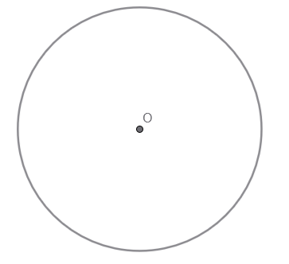
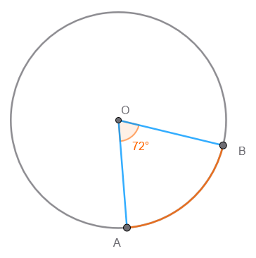
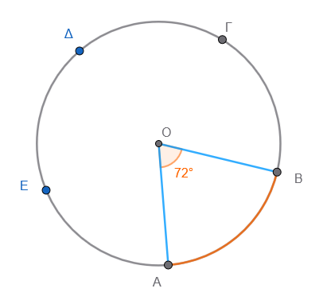
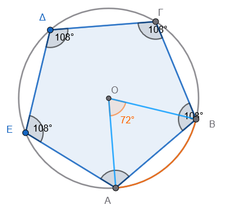

```{=html}
<!-- Φόρτωση βιβλιοθήκης GeoGebra -->
<script src="https://www.geogebra.org/apps/deployggb.js"></script>

<!-- Συνάρτηση δημιουργίας applets -->
<script>
function createGeoGebra(containerId, materialId, width = 700, height = 500) {
  var params = {
    "id": "ggb-" + containerId,
    "material_id": materialId,
    "width": width,
    "height": height,
    "showToolBar": true,
    "showMenuBar": false,
    "showAlgebraInput": true
  };
  
  var applet = new GGBApplet(params, '5.2');
  applet.inject(containerId);
}
</script>
```

## Κανονικά πολύγωνα

:::: {style="background-color: #E7CEF0; border: 2px solid #2f3e50; color: #25188a; padding: 15px; border-radius: 5px;"}
Τα κανονικά πολύγωνα είναι σχήματα που διακρίνονται για τη συμμετρία τους, καθώς ορίζονται ως τα πολύγωνα που έχουν όλες τις πλευρές τους ίσες και όλες τις γωνίες τους ίσες.
Γνωστά παραδείγματα τέτοιων σχημάτων είναι το ισόπλευρο τρίγωνο, το τετράγωνο, το κανονικό πεντάγωνο το κανονικό εξάγωνο ......

Για τη μελέτη και τον υπολογισμό των στοιχείων τους, χρησιμοποιούμε δύο βασικούς τύπους που αφορούν τις γωνίες τους:

- **Κεντρική Γωνία (**$\omega$): Είναι η επίκεντρη γωνία του περιγεγραμμένου κύκλου του πολυγώνου που αντιστοιχεί σε μία πλευρά του. Υπολογίζεται διαιρώντας έναν πλήρη κύκλο ($360^\circ$) με το πλήθος των πλευρών $ν$ του πολυγώνου: $\omega = \frac{360^\circ}{ν}$.

<iframe src="https://www.geogebra.org/calculator/rxbhqcyj?embed" width="730" height="600" allowfullscreen style="border: 1px solid #e4e4e4;border-radius: 4px;" frameborder="0">

</iframe>

\

::: {.callout-tip style="color: brown;"}
## Ενέργεια

Μετακινήστε το σημαίο Α ή Β για να αλλάξετε το μέγεθος του πολυγώνου.

Τι παρατηρείτε; ..........................................
:::

- **Γωνία Πολυγώνου (**$\phi$): Είναι η εσωτερική γωνία που σχηματίζεται από δύο διαδοχικές πλευρές. Η γωνία αυτή είναι παραπληρωματική της κεντρικής γωνίας, δηλαδή ισχύει ο τύπος: $\phi = 180^\circ - \omega$.
::::

Πέρα από τη μαθηματική τους σημασία, τα κανονικά πολύγωνα έχουν έντονη παρουσία στον φυσικό κόσμο και την ανθρώπινη δημιουργία:

\* **Στη Φύση:** Μελετώνται σε επιστήμες όπως η κρυσταλλογραφία, η μεταλλουργία και η βιολογία, καθώς η δομή πολλών υλικών βασίζεται σε επαναλαμβανόμενα κανονικά σχήματα.

\* **Στην Τέχνη:** Έχουν χρησιμοποιηθεί ευρύτατα από αρχαίους πολιτισμούς (Σουμέριοι, Αιγύπτιοι, Έλληνες) για τη διακόσμηση ναών και κτιρίων.
Εντυπωσιακά δείγματα αποτελούν τα ψηφιδωτά στο παλάτι της Alhambra[^1] στην Ισπανία και οι γεωμετρικές δημιουργίες του καλλιτέχνη M.C.
Escher
[^2]

[^1]: Τα **ψηφιδωτά και τα διακοσμητικά πλακάκια (γνωστά ως azulejos) στο παλάτι της Αλάμπρα στη Γρανάδα της Ισπανίας αποτελούν ένα από τα πιο εμβληματικά** στοιχεία της ισλαμικής αρχιτεκτονικής και τέχνης, αντικατοπτρίζοντας τον πλούτο της δυναστείας των Νασρίντ.
    \[[1](http://earthlocations.blogspot.com/2014/12/alhambra-granada-spain-n3710345-w335210.html), [2](https://alhambratickets.tours/el/%CE%B9%CF%83%CF%84%CE%BF%CF%81%CE%AF%CE%B1-%CF%84%CE%B7%CF%82-%CE%B1%CE%BB%CE%AC%CE%BC%CF%80%CF%81%CE%B1/)\]

    Ακολουθούν τα βασικά χαρακτηριστικά τους:

    - **Azulejos (Κεραμικά Πλακάκια):** Η Αλάμπρα είναι διάσημη για τα πολύχρωμα, γεωμετρικά πλακάκια της, τα οποία καλύπτουν το κάτω μέρος των τοίχων (wainscoting) στα παλάτια.
      Αυτά τα πλακάκια είναι γνωστά για τα πολύπλοκα γεωμετρικά τους σχέδια.

    - **Γεωμετρικά Μοτίβα & Αραβουργήματα:** Τα σχέδια συχνά περιλαμβάνουν περίπλοκα γεωμετρικά μοτίβα που επαναλαμβάνονται, δημιουργώντας μια αίσθηση άπειρου.
      Επιπλέον, χρησιμοποιούνται αραβουργήματα (arabesques), δηλαδή γραμμικά διακοσμητικά μοτίβα που βασίζονται σε φυτικά στοιχεία, τα οποία στολίζουν τοίχους, καμάρες και κίονες.

    - **Τεχνικές και Υλικά:** Τα ψηφιδωτά κατασκευάζονταν με μεγάλη ακρίβεια, συχνά χρησιμοποιώντας την τεχνική *alicatado*, όπου κομμένα κομμάτια υαλοποιημένων πλακιδίων (azulejos) συναρμολογούνται για να σχηματίσουν γεωμετρικά σχέδια.

    - **Πολιτιστική Σημασία:** Τα διακοσμητικά στοιχεία της Αλάμπρα, συμπεριλαμβανομένων των ψηφιδωτών, των γύψινων ανάγλυφων και των ξυλόγλυπτων οροφών, συνθέτουν μια ατμόσφαιρα παραμυθιού, η οποία αναδεικνύει την αισθητική του 13ου-14ου αιώνα.

    - **Αποκατάσταση:** Πολλά από τα διακοσμητικά στοιχεία που είναι ορατά σήμερα είναι πρόσφατες αποκαταστάσεις των παλαιότερων, διατηρώντας ωστόσο το αυθεντικό στυλ και την ομορφιά.
      \[[1](https://www.shutterstock.com/el/search/azulejos-alhambra), [2](https://www.getyourguide.com/el-gr/spain-l169003/azulejos-tours-workshops-tc2374/), [3](https://www.facebook.com/athenologio/posts/%CF%80%CE%B1%CE%B3%CE%BA%CF%8C%CF%83%CE%BC%CE%B9%CE%BF-%CE%BC%CE%BD%CE%B7%CE%BC%CE%B5%CE%AF%CE%BF-%CF%84%CE%B7%CF%82-%CE%B5%CE%B2%CE%B4%CE%BF%CE%BC%CE%AC%CE%B4%CE%B1%CF%82%CF%84%CE%BF-%CF%80%CE%B1%CE%BB%CE%AC%CF%84%CE%B9-%CF%84%CE%B7%CF%82-%CE%B1%CE%BB%CE%AC%CE%BC%CF%80%CF%81%CE%B1%CF%82-%CF%83%CF%84%CE%B7%CE%BD-%CE%B3%CF%81%CE%B1%CE%BD%CE%AC%CE%B4%CE%B1-%CE%B3%CE%B9%CE%B1%CF%84%CE%AF-%CF%84%CE%B1-%CE%B1%CF%81%CE%B1%CE%B2/228453418701305/), [4](https://depositphotos.com/gr/editorial/arabesque-pattern-at-the-alhambra-18692731.html), [5](https://www.tripadvisor.com.gr/Attraction_Review-g187441-d13531083-Reviews-Nasrid_Palaces-Granada_Province_of_Granada_Andalucia.html), [6](https://el.wikipedia.org/wiki/%CE%91%CE%BB%CE%AC%CE%BC%CF%80%CF%81%CE%B1)\]

    Σήμερα, οι επισκέπτες μπορούν να θαυμάσουν αυτά τα έργα τέχνης, ενώ υπάρχουν ακόμα και σεμινάρια στην περιοχή της Γρανάδας που διδάσκουν την τέχνη της δημιουργίας αυτών των παραδοσιακών πλακιδίων.
    \[[1](https://www.getyourguide.com/el-gr/spain-l169003/azulejos-tours-workshops-tc2374/)\]

[^2]: Ο M.C.
    Escher (1898–1972) ήταν Ολλανδός καλλιτέχνης, παγκοσμίως γνωστός για τα έργα του που συνδυάζουν τη μαθηματική ακρίβεια με την καλλιτεχνική φαντασία.
    Οι γεωμετρικές του δημιουργίες συχνά απεικονίζουν αδύνατες κατασκευές, οπτικές ψευδαισθήσεις και ψηφιδωτά που επαναλαμβάνονται.
    \[[1](https://wahooart.com/el/art/maurits-cornelis-escher-%CE%B5%CE%B9%CE%BA%CF%8C%CE%BD%CE%B1-%CE%BC%CE%B5%CF%84%CE%B5%CF%89%CF%81%CE%BF%CE%BB%CF%8C%CE%B3%CE%BF%CF%85-%CF%80%CF%84%CE%B5%CF%81%CF%8D%CE%B3%CF%89%CE%BD-70-9GZNDY-el/), [2](http://gym-ralleion.att.sch.gr/wordpress/wp-content/uploads/2022/05/%CE%97-%CF%84%CE%AD%CF%87%CE%BD%CE%B7-%CF%84%CE%BF%CF%85-Escher-.pdf), [3](https://kgaveras.blogspot.com/p/escher.html)\]

    **Κύρια Χαρακτηριστικά των Δημιουργιών του**

    - **Αδύνατες Κατασκευές**: Ο Escher δημιουργούσε εικόνες που φαίνονται λογικές με την πρώτη ματιά, αλλά είναι γεωμετρικά αδύνατες, όπως σκάλες που ανεβαίνουν και κατεβαίνουν ταυτόχρονα.

    - **Ψευδαίσθηση και Προοπτική:** Χρησιμοποιούσε την προοπτική για να παίξει με την αντίληψη του θεατή, δημιουργώντας χώρους που αψηφούν τους νόμους της φυσικής.

    - **Επανάληψη και Ψηφιδωτά** (Tessellations): Εμπνευσμένος από την ισλαμική τέχνη, κάλυπτε επιφάνειες με επαναλαμβανόμενα γεωμετρικά σχήματα (ζώα, πουλιά, άνθρωποι) που ταιριάζουν απόλυτα μεταξύ τους χωρίς κενά.

    - **Μεταμορφώσεις:** Στα έργα του, γεωμετρικά σχήματα μεταμορφώνονται σταδιακά σε άλλες μορφές, συνδέοντας διαφορετικούς κόσμους.

    - **Εξερεύνηση του Απείρου:** Απεικόνιζε έννοιες του απείρου μέσα σε πεπερασμένους χώρους, χρησιμοποιώντας μαθηματικές ακολουθίες.
      \[[1](https://el.wikipedia.org/wiki/%CE%9C%CE%B1%CE%BF%CF%85%CF%81%CE%AF%CF%84%CF%82_%CE%9A%CE%BF%CF%81%CE%BD%CE%AD%CE%BB%CE%B9%CF%82_%CE%88%CF%83%CE%B5%CF%81), [2](https://worldcitytrail.com/el/2025/02/26/%CE%BC%CE%BF%CF%85%CF%83%CE%B5%CE%AF%CE%BF-escher-%CF%83%CF%84%CE%B7-%CF%87%CE%AC%CE%B3%CE%B7/), [3](https://www.tovima.gr/print/vimagazino/o-gnostos-agnostos-maourits-eser/), [4](https://kgaveras.blogspot.com/p/escher.html)\]

    **Γνωστά Έργα**

    - **Relativity (Σχετικότητα):** Μια διάσημη λιθογραφία με σκάλες που κατευθύνονται σε διαφορετικές κατευθύνσεις, όπου η βαρύτητα φαίνεται να μην υφίσταται.

    - **Waterfall** (Καταρράκτης): Ένα έργο που δείχνει νερό να ρέει προς τα πάνω σε έναν κύκλο, δημιουργώντας μια αέναη κίνηση.

    - **Metamorphosis**: Σειρά έργων όπου ένα μοτίβο αλλάζει μορφή, για παράδειγμα, από ψηφιδωτό σε τοπίο.
      \[[1](https://kgaveras.blogspot.com/p/escher.html), [2](https://el.wikipedia.org/wiki/%CE%9C%CE%B1%CE%BF%CF%85%CF%81%CE%AF%CF%84%CF%82_%CE%9A%CE%BF%CF%81%CE%BD%CE%AD%CE%BB%CE%B9%CF%82_%CE%88%CF%83%CE%B5%CF%81), [3](https://www.tovima.gr/print/vimagazino/o-gnostos-agnostos-maourits-eser/)\]

    Το έργο του Escher έχει επηρεάσει τόσο τον χώρο της τέχνης όσο και των μαθηματικών, καθιστώντας τον έναν από τους πιο αναγνωρίσιμους καλλιτέχνες του 20ού αιώνα.
    \[[1](https://www.tovima.gr/print/vimagazino/o-gnostos-agnostos-maourits-eser/)\]

\

### Κατασκευή κανονικού πολυγώνου

::: {style="background-color: #E7CEF0; border: 2px solid #2f3e50; color: #25188a; padding: 15px; border-radius: 5px;"}
Η **κατασκευή** ενός κανονικού $v$-γώνου γίνεται συνήθως με την εγγραφή του σε έναν κύκλο (περιγεγραμμένος κύκλος) ακολουθώντας τρία βασικά βήματα:

1.  **Υπολογισμός Κεντρικής Γωνίας:** Υπολογίζουμε τη γωνία $\omega$ διαιρώντας τον πλήρη κύκλο με το πλήθος των πλευρών: $\omega = \frac{360^\circ}{ν}$.

2.  **Χωρισμός Κύκλου:** Σχεδιάζουμε έναν κύκλο και χρησιμοποιούμε τη γωνία $\omega$ για να σχηματίσουμε $ν$ διαδοχικές επίκεντρες γωνίες, οι οποίες χωρίζουν τον κύκλο σε $ν$ ίσα τόξα.

3.  **Σύνδεση Κορυφών:** Ενώνουμε με διαδοχικά ευθύγραμμα τμήματα τα άκρα αυτών των τόξων.
:::

\

### Η **κατασκευή ενός κανονικού πενταγώνου** :

1.  **Σχεδιασμός κύκλου:** Σχεδιάζουμε έναν κύκλο με κέντρο $O$ και ακτίνα $\rho$.\
    
2.  **Υπολογισμός κεντρικής γωνίας:** Διαιρούμε τον πλήρη κύκλο ($360^\circ$) με το πλήθος των πλευρών ($ν=5$), άρα $\omega = 72^\circ$.\
    \
    \
3.  **Χωρισμός κύκλου:** Με τη βοήθεια μοιρογνωμονίου, σχηματίζουμε μια επίκεντρη γωνία $72^\circ$, η οποία ορίζει ένα τόξο $AB$.
4.  **Μεταφορά τόξων:** Με τον διαβήτη, σημειώνουμε διαδοχικά πάνω στον κύκλο πέντε ίσα τόξα, χρησιμοποιώντας το άνοιγμα που αντιστοιχεί στο τόξο $AB$.\
    \
    
5.  **Σύνδεση κορυφών:** Ενώνουμε τα άκρα των τόξων με διαδοχικά ευθύγραμμα τμήματα (χορδές) για να σχηματιστεί το πεντάγωνο.\
    \
    

\
**Ειδικές Περιπτώσεις και Τεχνικές:**

\* **Κανονικό Εξάγωνο:** Μπορεί να κατασκευαστεί εύκολα με διαβήτη, καθώς η πλευρά του ισούται με την ακτίνα του περιγεγραμμένου κύκλου ($ρ$).
Χαράζουμε διαδοχικά τόξα ακτίνας $ρ$ πάνω στην περιφέρεια και ενώνουμε τα σημεία.

\* **Διπλασιασμός Πλευρών:** Αν έχουμε ένα κανονικό $ν$-γωνο, μπορούμε να κατασκευάσουμε ένα $2ν$-γωνο φέρνοντας τις διχοτόμους των κεντρικών γωνιών.
Τα σημεία όπου οι διχοτόμοι τέμνουν τον κύκλο αποτελούν τις νέες κορυφές.

------------------------------------------------------------------------


### Ασκήσεις.


1.  **Εύρεση γωνίας κανονικού πολυγώνου**  
Να βρεις πόσες μοίρες έχει η κεντρική γωνία ενός κανονικού:  
  - α) εξαγώνου  
  - β) οκταγώνου  
  - γ) δεκαγώνου

2. **Εσωτερική γωνία**  
Να υπολογίσεις την εσωτερική γωνία ενός κανονικού πενταγώνου, ενός δεκαγώνου και ενός 18 -γώνου.

3.  **Πλήθος πλευρών από κεντρική γωνία**  
Η κεντρική γωνία ενός κανονικού πολυγώνου είναι 24°. Πόσες πλευρές έχει το πολύγωνο;

4.  **Πλήθος πλευρών από εξωτερική γωνία**  
Η εξωτερική γωνία ενός κανονικού πολυγώνου είναι 30°. Πόσες πλευρές έχει;

5.  **Σύγκριση γωνιών**  
Ποιο κανονικό πολύγωνο έχει μεγαλύτερη εσωτερική γωνία: το εξάγωνο ή το οκτάγωνο; Να εξηγήσεις.

6.  **Άθροισμα εσωτερικών γωνιών**  
Πόσες μοίρες είναι το άθροισμα των εσωτερικών γωνιών ενός κανονικού δεκαγώνου;

7.  **Σχεδίαση τριγώνου σε κανονικό πολύγωνο**  
Σε ένα κανονικό 12-γωνο (δωδεκάγωνο), πόσες μοίρες έχει η γωνία που σχηματίζεται αν ενώσουμε δύο διαδοχικές κορυφές με το κέντρο;

8.  **Κατασκευή πολυγώνου**  
Ο Γιάννης σχεδίασε ένα κανονικό πολύγωνο του οποίου η κάθε εσωτερική γωνία είναι 140°. Πόσες πλευρές έχει το πολύγωνο;

9.  **Πραγματική εφαρμογή (πλακάκι)**  
Ένα πλακάκι έχει σχήμα κανονικού εξαγώνου. Αν τοποθετηθούν πολλά τέτοια πλακάκια το ένα δίπλα στο άλλο χωρίς κενά, να βρεις πόσα εξάγωνα συναντώνται σε μία κορυφή.

10. **Μικτή – γωνίες και περίμετρος**  
Ένα κανονικό πολύγωνο έχει 9 πλευρές. 

  - α) Πόσες μοίρες είναι η κεντρική του γωνία;  
  - β) Πόσες μοίρες είναι η εσωτερική του γωνία;  
  - γ) Αν η κάθε πλευρά του είναι 5 cm, ποια είναι η περίμετρός του;


11. **Από την Κεντρική Γωνία στο Σχήμα**
Η κεντρική γωνία ενός κανονικού πολυγώνου είναι $\omega = 40^{\circ}$.
  - 1. Πόσες πλευρές έχει το πολύγωνο;
  - 2. Πώς ονομάζεται αυτό το πολύγωνο;

12. **Εσωτερική και Κεντρική Γωνία**
Σε ένα κανονικό πολύγωνο, η εσωτερική γωνία $\varphi$ είναι $150^{\circ}$. 

  - 1. Υπολόγισε την κεντρική γωνία $\omega$ (Θυμήσου: $\varphi + \omega = 180^{\circ}$).
  - 2. Βρες τον αριθμό των πλευρών του πολυγώνου.

13. **Το Κανονικό Οκτάγωνο**
Ένας τεχνίτης θέλει να φτιάξει ένα τραπέζι σε σχήμα κανονικού οκταγώνου. 

  - 1. Πόσες μοίρες πρέπει να είναι η κάθε γωνία του τραπεζιού (εσωτερική γωνία $\varphi$);
  - 2. Πόση είναι η κεντρική γωνία που σχηματίζουν οι "φέτες" του τραπεζιού;

14. **Σχέση Γωνιών**
Υπάρχει κανονικό πολύγωνο του οποίου η κεντρική γωνία $\omega$ είναι ίση με την εσωτερική του γωνία $\varphi$; Αν ναι, ποιο είναι αυτό;

15. **Άθροισμα Γωνιών**

  - 1. Πόσο είναι το άθροισμα των εσωτερικών γωνιών ενός κανονικού δεκαγώνου ($ν=10$);
  - 2. Πόσο είναι το άθροισμα των κεντρικών γωνιών οποιουδήποτε κανονικού πολυγώνου ;

16. **Το Ισόπλευρο Τρίγωνο ως Κανονικό Πολύγωνο**
Το ισόπλευρο τρίγωνο είναι κανονικό πολύγωνο με $ν=3$.

  - 1. Επιβεβαίωσε με τους τύπους ότι η κεντρική του γωνία είναι $120^{\circ}$ και η εσωτερική του $60^{\circ}$.
  - 2. Αν η απόσταση από το κέντρο του μέχρι μια κορυφή (ακτίνα $ρ$) είναι $10$ cm, μπορεί η πλευρά του να είναι $10$ cm; (Σκέψου το σχήμα).

17. **Τετράγωνο και Κύκλος**
Ένα τετράγωνο είναι εγγεγραμμένο σε κύκλο ακτίνας $ρ = 5$ cm.

  - 1. Πόσο είναι το μήκος της διαγωνίου του τετραγώνου; (Υπόδειξη: Η διαγώνιος περνάει από το κέντρο).
  - 2. Πόση είναι η κεντρική γωνία που αντιστοιχεί σε κάθε πλευρά του;

18. **Σύνθετο Πρόβλημα**
Ένα κανονικό πολύγωνο έχει άθροισμα εσωτερικών γωνιών $1,080^{\circ}$.
  - 1. Χρησιμοποίησε τον τύπο $S = (ν-2) \cdot 180^{\circ}$ για να βρεις τον αριθμό των πλευρών $ν$.
  - 2. Υπολόγισε την κεντρική γωνία αυτού του πολυγώνου.


19.  Αν η εσωτερική γωνία ενός κανονικού πολυγώνου είναι $144^\circ$, να βρείτε πόσες πλευρές έχει το πολύγωνο.

20. Η περίμετρος ενός κανονικού πενταγώνου είναι $45$ cm. Πόσο είναι το μήκος της κάθε πλευράς του;

21. Η πλευρά ενός κανονικού πολυγώνου είναι $a=6$ cm και η περίμετρός του είναι $Π=54$ cm. Πόσες πλευρές έχει το πολύγωνο και ποια είναι η κεντρική του γωνία;

22. Ένα ισόπλευρο τρίγωνο και ένα κανονικό τετράγωνο έχουν την ίδια περίμετρο. Αν η πλευρά του τριγώνου είναι $12$ cm, πόσο είναι το μήκος της πλευράς του τετραγώνου;


23. Στο εσωτερικό ενός κανονικού εξαγώνου $ABΓΔEΖ$ φέρνουμε τις ακτίνες από το κέντρο $O$ προς τις κορυφές. Τι είδους τρίγωνα σχηματίζονται (π.χ. το τρίγωνο $OAB$); Δικαιολογήστε την απάντησή σας υπολογίζοντας τις γωνίες του τριγώνου.

24. Σε ένα κανονικό δωδεκάγωνο (12 πλευρές), υπολογίστε το άθροισμα των εξωτερικών γωνιών του. Χρειάζεται να κάνετε πράξεις ή υπάρχει κανόνας;

25. Ένας μαθητής θέλει να φτιάξει ένα κανονικό πολύγωνο που η κάθε εσωτερική του γωνία να είναι $100^\circ$. Είναι δυνατόν να κατασκευαστεί τέτοιο κανονικό πολύγωνο; (Βοήθεια: Ο αριθμός των πλευρών $ν$ πρέπει να είναι φυσικός αριθμός).

---

### 💡 Υπενθύμιση Τύπων:
*   **Κεντρική γωνία:** $\omega = \frac{360^{\circ}}{ν}$
*   **Εσωτερική γωνία:** $\varphi = 180^{\circ} - \omega$
*   **Άθροισμα εσωτερικών γωνιών:** $S = (ν-2) \cdot 180^{\circ}$
*   **Περίμετρος:** $Π = ν \cdot a$ (όπου $a$ η πλευρά)


::: {.callout-tip style="color: brown;"}
## Να τηρείτε τον παρακάτω κανόνα

Σε αυτά τα προβλήματα, δοκιμάστε πρώτα να κάνετε ένα πρόχειρο σχήμα και ακολουθείστε τους κανόνες.
:::

$\overparen{AB}$

$\overrightarrow{AB}$

::: {style="background-color: #E7CEF0; border: 2px solid #2f3e50; color: #25188a; padding: 15px; border-radius: 5px;"}
ΚΑΛΗ ΜΕΛΕΤΗ !
:::
