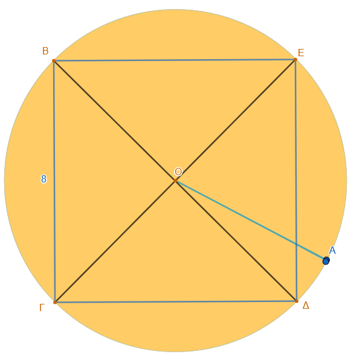
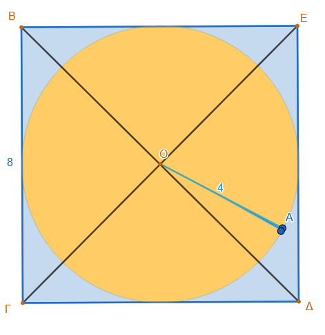
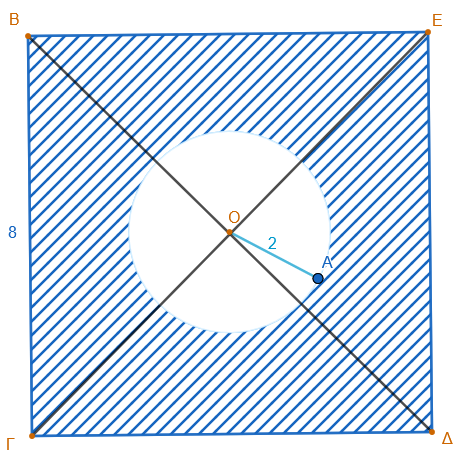

```{=html}
<!-- Φόρτωση βιβλιοθήκης GeoGebra -->
<script src="https://www.geogebra.org/apps/deployggb.js"></script>

<!-- Συνάρτηση δημιουργίας applets -->
<script>
function createGeoGebra(containerId, materialId, width = 700, height = 500) {
  var params = {
    "id": "ggb-" + containerId,
    "material_id": materialId,
    "width": width,
    "height": height,
    "showToolBar": true,
    "showMenuBar": false,
    "showAlgebraInput": true
  };
  
  var applet = new GGBApplet(params, '5.2');
  applet.inject(containerId);
}
</script>
```

## Μήκος κύκλου

::: {style="background-color: #E7CEF0; border: 2px solid #2f3e50; color: #25188a; padding: 15px; border-radius: 5px;"}
Το μήκος ενός κύκλου ($L$) συνδέεται σταθερά με τη διάμετρό του ($\delta$) και την ακτίνα του ($\rho$) μέσω του αριθμού $\pi$.
:::

\
<iframe src="https://www.geogebra.org/calculator/yfpx9hvu?embed" width="730" height="700" allowfullscreen style="border: 1px solid #e4e4e4;border-radius: 4px;" frameborder="0"></iframe>\

::: {.callout-tip style="color: brown;"}
## Ενέργεια

Αλλάξτε την τιμή της ακτίνας ρ με την βοήθεια του δρομέα.

Όταν η ακτίνα μεγαλώνει και το μήκος του κύκλου ................

Τι συμβαίνει με τον λόγο $\dfrac{\text{Μήκος κύκλου}}{2ρ}$ ............................
:::

### **Βασική Θεωρία**

::: {style="background-color: #E7CEF0; border: 2px solid #2f3e50; color: #25188a; padding: 15px; border-radius: 5px;"}
Ο λόγος του μήκους του κύκλου προς τη διάμετρό του παραμένει πάντα σταθερός και ισούται με τον αριθμό $\pi \approx 3,14$.
Για τον υπολογισμό του μήκους του κύκλου $L$ χρησιμοποιούμε τους εξής τύπους:

- $L = \pi \cdot \delta$ (χρησιμοποιώντας τη διάμετρο)

- $L = 2 \cdot \pi \cdot \rho$ (χρησιμοποιώντας την ακτίνα)
:::

### **Παραδείγματα**

- **Υπολογισμός ακτίνας από το μήκος:** Αν γνωρίζουμε ότι ένας κύκλος έχει μήκος $L = 9,42$ cm, μπορούμε να βρούμε την ακτίνα του διαιρώντας το μήκος με το $2\pi$. Έτσι, $\rho = \dfrac{9,42 }{2 \cdot 3,14} = 1,5$ cm.
- **Σχέση μεταβολής μήκους και ακτίνας:** Αν το μήκος ενός κύκλου αυξηθεί κατά ένα συγκεκριμένο ποσό, η ακτίνα του αυξάνεται ανάλογα. Για παράδειγμα, αν ένας κύκλος είναι κατά 10 cm μακρύτερος από έναν άλλο, η ακτίνα του είναι μεγαλύτερη κατά $\dfrac{10}{2\pi} \approx 1,59$ cm.
- **Σύνδεση με τη Γεωμετρία:** Σε περιπτώσεις όπου ο κύκλος περιλαμβάνει γεωμετρικά σχήματα, όπως ένα ισόπλευρο τρίγωνο που σχηματίζεται από μια επίκεντρη γωνία 60°, η πλευρά του τριγώνου ισούται με την ακτίνα ($\rho$). Αν η πλευρά αυτή είναι 2 cm, τότε μπορούμε να βρούμε το συνολικό μήκος του κύκλου $L = 2 \cdot 3,14 \cdot 2 = 12,56$ cm.\

::: {.callout-tip style="color: brown;"}
## Γενικά να θυμάστε:

Οι τύποι $L = \pi \cdot \delta$ και $L = 2 \cdot \pi \cdot \rho$, έχουν δύο μεταβαλλόμενα μεγέθη, το $L$ και το $δ$ ή $ρ$.
Άρα αν γνωρίζουμε το ένα μπορούμε να επιλύσουμε ώς προς το άλλο και να το υπολογίσουμε.
:::

\
\

### Ιστορικά στοιχεία

Η ιστορία του υπολογισμού του μήκους του κύκλου συνδέεται άρρηκτα με την αναζήτηση της τιμής του αριθμού $\pi$, δηλαδή του σταθερού πηλίκου του μήκους της περιφέρειας προς τη διάμετρό του.
**Αρχαίοι Πολιτισμοί**

- Βαβυλώνιοι (περ. 2000 π.Χ.): Χρησιμοποιούσαν την προσέγγιση $\pi \approx 3$ ή $\pi \approx 3\frac{1}{8} = 3,125$.
- Αιγύπτιοι (Πάπυρος του Rhind, 1500 π.Χ.): Υπολόγιζαν το εμβαδόν και το μήκος με μια προσέγγιση που αντιστοιχεί σε $\pi \approx 3,1604$.
- Παλαιά Διαθήκη: Στο βιβλίο Βασιλειών Α' περιγράφεται μια δεξαμενή («Χυτή Θάλασσα») όπου οι διαστάσεις υποδηλώνουν την τιμή $\pi = 3$.

**Αρχαία Ελλάδα** Οι Έλληνες μαθηματικοί πέρασαν από τις εμπειρικές εκτιμήσεις στην επιστημονική απόδειξη, συνδέοντας το μήκος του κύκλου με το πρόβλημα του τετραγωνισμού του κύκλου.

**Αρχιμήδης:** Θεωρείται ο πρώτος που έδωσε μια αυστηρή μέθοδο υπολογισμού.
Χρησιμοποίησε κανονικά πολύγωνα (εγγεγραμμένα και περιγεγραμμένα) και, ξεκινώντας από το εξάγωνο, έφτασε σε πολύγωνο 96 πλευρών.
Απέδειξε ότι η τιμή του $\pi$ βρίσκεται μεταξύ $3\frac{10}{71}$ και $3\frac{1}{7}$, δηλαδή $3,1408 < \pi < 3,1428$.
**Ευκλείδης:** Στα «Στοιχεία» του όρισε τον κύκλο και την περιφέρεια, θέτοντας τις γεωμετρικές βάσεις για τη μελέτη τους.

**Η Εξέλιξη του Συμβολισμού** Από την αρχαιότητα έως σήμερα, η ακρίβεια στον υπολογισμό του $\pi$ αυξανόταν συνεχώς:

- Ο αριθμός $\pi$ ονομάστηκε έτσι από το αρχικό γράμμα της λέξης «περιφέρεια».
- Η χρήση του ελληνικού γράμματος $\pi$ καθιερώθηκε διεθνώς πολύ αργότερα, τον 18ο αιώνα, από τον Leonhard Euler.

Σήμερα, για πρακτικούς υπολογισμούς χρησιμοποιούμε συνήθως την τιμή 3,14, αν και γνωρίζουμε ότι ο $\pi$ είναι ένας άρρητος αριθμός με άπειρα δεκαδικά ψηφία.

**Στη σύγχρονη εποχή**, ο υπολογισμός του π έχει μεταφερθεί από το χαρτί στους υπερυπολογιστές, με τους επιστήμονες να χρησιμοποιούν τον αριθμό αυτό κυρίως ως «τεστ αντοχής» για την ισχύ και την αξιοπιστία των συστημάτων τους.
Ορισμένοι από τους σημαντικότερους σύγχρονους επιστήμονες και ερευνητές που έχουν σπάσει ρεκόρ υπολογισμού είναι:

- David και Gregory Chudnovsky (Αδελφοί Τσουντόφσκι): Μαθηματικοί που το 1988 ανέπτυξαν τον αλγόριθμο Chudnovsky. Πρόκειται για την πιο γρήγορη μέθοδο υπολογισμού του π, η οποία χρησιμοποιείται σχεδόν σε όλα τα σύγχρονα παγκόσμια ρεκόρ.
- Emma Haruka Iwao: Ερευνήτρια της Google, η οποία το 2019 χρησιμοποίησε το υπολογιστικό νέφος (cloud) της εταιρείας για να υπολογίσει 31,4 τρισεκατομμύρια ψηφία, ενώ το 2022 ανέβασε το ρεκόρ στα 100 τρισεκατομμύρια.
- Alexander Yee και Shigeru Kondo: Ο Yee δημιούργησε το λογισμικό y-cruncher, το οποίο αποτελεί το πρότυπο για τον υπολογισμό του π σήμερα. Μαζί με τον Ιάπωνα μηχανικό Shigeru Kondo, ήταν οι πρώτοι που υπολόγισαν τρισεκατομμύρια ψηφία χρησιμοποιώντας έναν προσωπικό υπολογιστή που κατασκεύασαν μόνοι τους.
- Fabrice Bellard: Γάλλος προγραμματιστής που το 2009 κατέρριψε το ρεκόρ χρησιμοποιώντας έναν απλό οικιακό υπολογιστή, αποδεικνύοντας ότι η έξυπνη χρήση αλγορίθμων μπορεί να υποκαταστήσει τους τεράστιους υπερυπολογιστές.
- Heiko Rölke: Καθηγητής στο Πανεπιστήμιο Εφαρμοσμένων Επιστημών Graubünden της Ελβετίας, του οποίου η ομάδα το 2021 υπολόγισε 62,8 τρισεκατομμύρια ψηφία σε χρόνο ρεκόρ 108 ημερών.
- John von Neumann: Ένας από τους σπουδαιότερους μαθηματικούς του 20ού αιώνα, ο οποίος το 1949 ήταν μέλος της ομάδας που χρησιμοποίησε για πρώτη φορά ψηφιακό υπολογιστή (τον ENIAC) για να υπολογίσει το π με ακρίβεια 2.037 ψηφίων.

Το πιο πρόσφατο καταγεγραμμένο ρεκόρ (Απρίλιος 2025) ανήκει στην ομάδα των Linus Media Group και KIOXIA, οι οποίοι έφτασαν τα 300 τρισεκατομμύρια ψηφία.

\

### Ασκήσεις

**Ασκήσεις Μήκους Κύκλου**

1.  **Βασικός Υπολογισμός** Να υπολογίσετε το μήκος κύκλου που έχει ακτίνα $\rho = 5$ cm.

2.  **Χρήση Διαμέτρου** Ένας κύκλος έχει διάμετρο $\delta = 20$ cm.
    Πόσο είναι το μήκος του;

3.  **Αντίστροφο Πρόβλημα** Το μήκος ενός κύκλου είναι $L = 31,4$ cm.
    Να βρείτε την ακτίνα του κύκλου.
    (Δίνεται $\pi \approx 3,14$).

4.  **Σύγκριση Κύκλων** Αν διπλασιάσουμε την ακτίνα ενός κύκλου, τι θα συμβεί στο μήκος του; Να το αποδείξετε με ένα παράδειγμα.

5.  **Ο Τροχός του Ποδηλάτου** Ένας τροχός ποδηλάτου έχει ακτίνα $30$ cm.
    Πόση απόσταση (σε μέτρα) θα διανύσει το ποδήλατο αν ο τροχός κάνει $100$ πλήρεις περιστροφές;

6.  **Εγγεγραμμένο Τετράγωνο** Ένα τετράγωνο έχει πλευρά $10$ cm.
    Ποιο είναι το μήκος του κύκλου που είναι εγγεγραμμένος στο τετράγωνο (δηλαδή ο κύκλος που εφάπτεται στις πλευρές του);

7.  **Ο Ισημερινός της Γης** Αν θεωρήσουμε ότι η Γη είναι μια τέλεια σφαίρα με ακτίνα περίπου $6.400$ km, πόσο είναι το μήκος του Ισημερινού;

8.  **Δακτύλιος** Έχουμε δύο ομόκεντρους κύκλους.
    Ο εσωτερικός έχει ακτίνα $4$ cm και ο εξωτερικός έχει ακτίνα $7$ cm.
    Πόσο μεγαλύτερο είναι το μήκος του εξωτερικού κύκλου από τον εσωτερικό;

9.  Αν το μήκος ενός κύκλου είναι $L = 62,8$ cm, να υπολογίσετε την ακτίνα του.

10. **Διαδρομή αθλητή:** Ένας αθλητής τρέχει σε έναν κυκλικό στίβο που έχει διάμετρο $60$ μέτρα.
    Αν κάνει $5$ γύρους, πόσα μέτρα έτρεξε συνολικά;

11. Η περίμετρος ενός κυκλικού κήπου είναι 62,8 m.
    Να βρεις την ακτίνα του.

12. Σε ορθογώνιο παραλληλόγραμμο διαστάσεων ( 16 ) cm και ( 10 ) cm, σχεδιάζονται κύκλοι με διάμετρο ίση με τις πλευρές του ορθογωνίου.
    Να βρείτε το συνολικό μήκος των δύο κύκλων και πόσο μεγαλύτερος είναι ο μεγάλος κύκλος.

13. Ένας κύκλος είναι περιγεγραμμένος σε ένα τετράγωνο πλευράς 8 cm.
    Να βρείτε το μήκος του κύκλου.\

    \
    {width="392"}

14. Σε ένα τετράγωνο πλευράς 8 cm σχεδιάζουμε τον εγγεγραμμένο κύκλο (εφάπτεται σε όλες τις πλευρές).
    Υπολογίστε τη διαφορά μεταξύ της περιμέτρου του τετραγώνου και του μήκους του κύκλου.\

    \
    {width="361"}

15. Να υπολογίσετε την συνολική περίμετρο της γραμμοσκιασμέμης περιοχής (Προσοχή! Δεν είναι μόνο ή εξωτερική περίμετρος του τετραγώνου)\
    \
    {width="385"}

16. Τρεις τροχαλίες συνδέονται μεταξύ τους με ιμάντες, ο Α με τον Β και ο Β με τον Γ, έτσι ώστε αν περιστρέφεται ο Α τότε αναγκάζει τον Β να περιστραφεί και αυτός τον Γ.
    Αν η ακτίνα του Α είναι $ρ_Α=12 cm$ του Β είναι $ρ_Β=8 cm$ και του Γ είναι $ρ_Γ=4cm$, να βρείτε πόσες στροφές θα κάνουν οι Β και Γ αν ο Α κάνει 2 στροφές.\
    *Σκέψου: Είναι σαν να ζητάμε πόσες φορές χωράει το μήκος του ενός κύκλου μέσα στο μήκος του άλλου. Υπολόγισε πρώτα τα μήκη των κύκλων*
