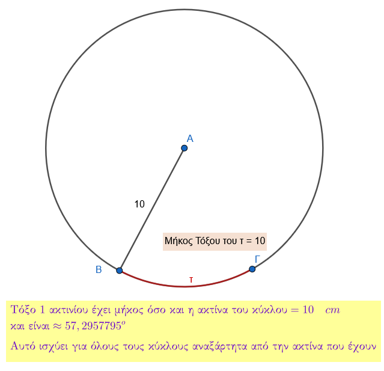
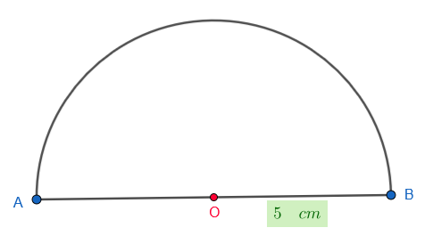
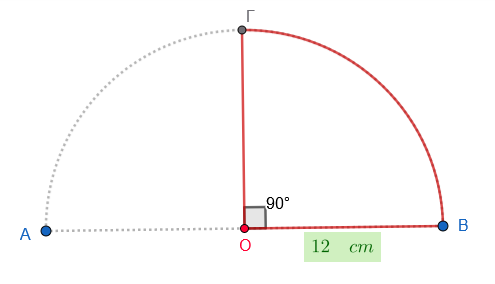
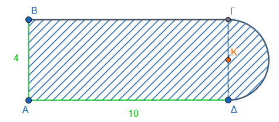
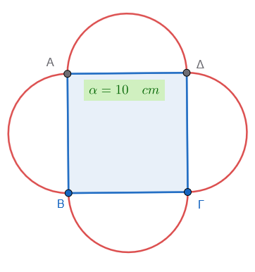
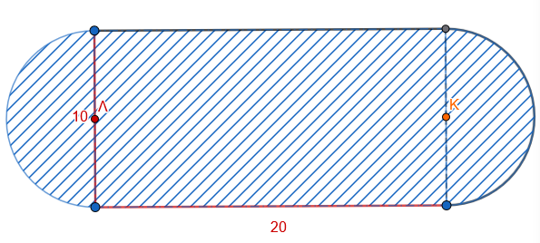
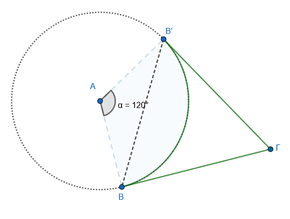
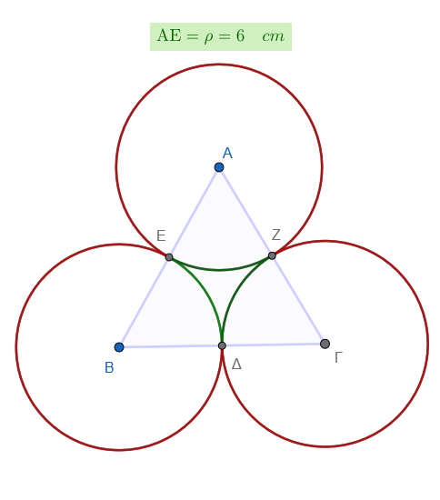
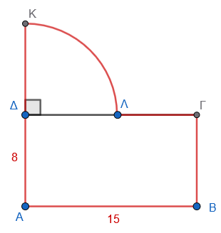
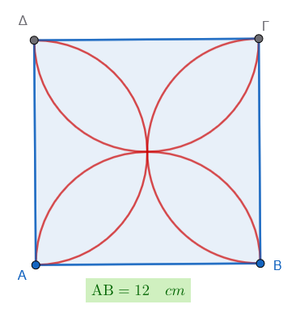

```{=html}
<!-- Φόρτωση βιβλιοθήκης GeoGebra -->
<script src="https://www.geogebra.org/apps/deployggb.js"></script>

<!-- Συνάρτηση δημιουργίας applets -->
<script>
function createGeoGebra(containerId, materialId, width = 700, height = 500) {
  var params = {
    "id": "ggb-" + containerId,
    "material_id": materialId,
    "width": width,
    "height": height,
    "showToolBar": true,
    "showMenuBar": false,
    "showAlgebraInput": true
  };
  
  var applet = new GGBApplet(params, '5.2');
  applet.inject(containerId);
}
</script>
```

## Μήκος τόξου

::: {style="background-color: #E7CEF0; border: 2px solid #2f3e50; color: #25188a; padding: 15px; border-radius: 5px;"}
- **Μήκος τόξου:** Για να υπολογίσουμε το μήκος ενός τόξου $l$ σε μοίρες ($\mu^\circ$), χρησιμοποιούμε τον τύπο $l = 2\pi\rho \cdot \frac{\mu}{360}$.

- **Ακτίνιο (rad):** Είναι μονάδα μέτρησης τόξων.
  1 Ακτίνιο είναι το τόξο που έχει μήκος ίσο με την ακτίνα $\rho$ του κύκλου.\
  Αν ένας κύκλος έχει ακτίνα 4 cm ==> και 1 ακτίνιο αυτού του κύκλου θα έχει μήκος 4 cm.
  Αν ένας κύκλος έχει ακτίνα 14,8 cm ==> και 1 ακτίνιο αυτού του κύκλου θα έχει μήκος 14,8 cm.
  ...................
  ....................
  {width="523"}

- **Σχέση μήκους τόξου και ακτινίων:** Το μήκος ενός τόξου $l$ που αντιστοιχεί σε γωνία $\alpha$ ακτινίων δίνεται από τη σχέση $l = \alpha \cdot \rho$.

- **Σχέση μοιρών και ακτινίων:** Η μετατροπή μεταξύ μοιρών ($\mu$) και ακτινίων ($\alpha$) γίνεται μέσω της αναλογίας $\frac{\mu}{180} = \frac{\alpha}{\pi}$.
:::

\

### Αποδείξεις των τύπων

::: {style="background-color: #E7CEF0; border: 2px solid #2f3e50; color: #25188a; padding: 15px; border-radius: 5px;"}
- **Μήκος τόξου (σε μοίρες):** Προκύπτει με την απλή μέθοδο των τριών.

- Γνωρίζουμε ότι ένας πλήρης κύκλος $360^\circ$ έχει μήκος ίσο με την περιφέρεια $L = 2\pi\rho$.
  Επομένως, αν ένα τόξο $\mu$ μοιρών έχει μήκος $l$ τότε θα ισχύει\

```{=html}
<script src="https://cdn.jsdelivr.net/npm/mathjax@3/es5/tex-chtml.js"></script>

<style type="text/css">
.tg  {border-collapse:collapse;border-color:#bbb;border-spacing:0;}
.tg td{background-color:#E0FFEB;border-color:#bbb;border-style:solid;border-width:1px;color:#594F4F;
  font-family:Arial, sans-serif;font-size:14px;overflow:hidden;padding:10px 5px;word-break:normal;}
.tg th{background-color:#9DE0AD;border-color:#bbb;border-style:solid;border-width:1px;color:#493F3F;
  font-family:Arial, sans-serif;font-size:14px;font-weight:normal;overflow:hidden;padding:10px 5px;word-break:normal;}
.tg .tg-0lmh{border-color:#009901;text-align:center;vertical-align:top}
</style>
<table class="tg"><thead>
  <tr>
    <th class="tg-0lmh">Τόξο</th>
    <th class="tg-0lmh">Μήκος</th>
  </tr></thead>
<tbody>
  <tr>
    <td class="tg-0lmh">\(360^\circ\)</td>
    <td class="tg-0lmh">2πρ</td>
  </tr>
  <tr>
    <td class="tg-0lmh">\(μ^\circ\)</td>
    <td class="tg-0lmh">l</td>
  </tr>
</tbody>
</table>
```

$$\frac{360^o}{μ^o}=\frac{2πρ}{l}$$ Λύνοντας θα έχουμε : $l = 2\pi\rho \cdot \frac{\mu}{360}$.

- **Μήκος τόξου (σε ακτίνια):** Το ακτίνιο (rad) ορίζεται ως η μονάδα μέτρησης όπου το τόξο έχει μήκος ίσο με την ακτίνα $\rho$ του κύκλου. Iσχύει ότι:

\

```{=html}
<script src="https://cdn.jsdelivr.net/npm/mathjax@3/es5/tex-chtml.js"></script>

<style type="text/css">
.tg  {border-collapse:collapse;border-color:#bbb;border-spacing:0;}
.tg td{background-color:#E0FFEB;border-color:#bbb;border-style:solid;border-width:1px;color:#594F4F;
  font-family:Arial, sans-serif;font-size:14px;overflow:hidden;padding:10px 5px;word-break:normal;}
.tg th{background-color:#9DE0AD;border-color:#bbb;border-style:solid;border-width:1px;color:#493F3F;
  font-family:Arial, sans-serif;font-size:14px;font-weight:normal;overflow:hidden;padding:10px 5px;word-break:normal;}
.tg .tg-0lmh{border-color:#009901;text-align:center;vertical-align:top}
</style>
<table class="tg"><thead>
  <tr>
    <th class="tg-0lmh">Τόξο</th>
    <th class="tg-0lmh">Μήκος</th>
  </tr></thead>
<tbody>
  <tr>
    <td class="tg-0lmh">\(360^\circ\)</td>
    <td class="tg-0lmh">\(2π \textbf{ ακτίνια (ακτίνες) (rad)}\)</td>
  </tr>
  <tr>
    <td class="tg-0lmh">\(\textbf{α ακτίνια}\)</td>
    <td class="tg-0lmh">\(l=α\cdot\textbf{ακτίνες}=α\cdotρ\)</td>
  </tr>
</tbody>
</table>
```

\

Συνεπώς, αν μια γωνία είναι $\alpha$ ακτίνια, το μήκος του αντίστοιχου τόξου $l$ θα είναι το γινόμενο της γωνίας επί την ακτίνα: $l = \alpha \cdot \rho$.

- **Σχέση μοιρών και ακτινίων:** Η σχέση αυτή προκύπτει αν εξισώσουμε τους δύο παραπάνω τύπους για το ίδιο μήκος τόξου $l$: $$2\pi\rho \cdot \frac{\mu}{360} = \alpha\cdot\rho$$.

  Απλοποιώντας την ακτίνα $\rho$ και από τα δύο μέλη και διαιρώντας το 2 με το 360, καταλήγουμε στην αναλογία: $$\frac{\mu}{180} = \frac{\alpha}{\pi}$$.
:::

\

### Παραδείγματα

**1. Μήκος τόξου (σε μοίρες)**

\* **Παράδειγμα 1:** Υπολογισμός του μήκους ενός τεταρτοκυκλίου (τόξο $90^\circ$) σε κύκλο με ακτίνα $\rho = 8$ cm.

Εφαρμόζοντας τον τύπο $l = 2\pi\rho \cdot \frac{\mu}{360}$, προκύπτει $l = 2 \cdot 3,14 \cdot 8 \cdot \frac{90}{360} \approx 12,56$ cm.

\* **Παράδειγμα 2:** Εύρεση της ακτίνας όταν γνωρίζουμε το μήκος.

Αν ένα τόξο $30^\circ$ έχει μήκος $l = 1,3$ cm, τότε από τη σχέση $l = \frac{\pi\rho\mu}{180}$ βρίσκουμε $1,3 = 3,14 \cdot \rho \cdot \frac{30}{180}$, άρα $\rho \approx 2,48$ cm.

**2. Ακτίνιο (rad)**

\* **Παράδειγμα 1:** Διάταξη τόξων από το μικρότερο στο μεγαλύτερο.
Για να συγκρίνουμε τόξα όπως τα $\frac{\pi}{4}$ rad, $\frac{3\pi}{2}$ rad και $25^\circ$, τα μετατρέπουμε όλα στην ίδια μονάδα (π.χ. $\frac{\pi}{4} \text{ rad} = 45^\circ$).

\* **Παράδειγμα 2:** Αντιστοίχιση πλήρους κύκλου.
Ένας πλήρης κύκλος $360^\circ$ αντιστοιχεί σε $2\pi$ ακτίνια, ενώ ένας ημικύκλιος $180^\circ$ αντιστοιχεί σε $\pi$ ακτίνια.

**3. Σχέση μήκους τόξου και ακτινίων (**$l = \alpha \cdot \rho$)

\* **Παράδειγμα 1:** Σύγκριση τόξων σε διαφορετικούς κύκλους.

Σε έναν κύκλο ακτίνας $\rho$, ένα ημικύκλιο ($\alpha = \pi$ rad) έχει μήκος $l = \pi\rho$.
Σε έναν κύκλο διπλάσιας ακτίνας $2\rho$, ένα τεταρτοκύκλιο ($\alpha = \frac{\pi}{2}$ rad) έχει επίσης μήκος $l = \frac{\pi}{2} \cdot 2\rho = \pi\rho$.

\* **Παράδειγμα 2:** Υπολογισμός ακτίνας από τόξο σε rad.
Αν ένας κυκλικός τομέας γωνίας $120^\circ$ (που ισούται με $\frac{2\pi}{3}$ rad) έχει μήκος τόξου $6\pi$ cm, η ακτίνα του κύκλου είναι $\rho = \frac{l}{\alpha} = \frac{6\pi}{\frac{2\pi}{3}} = 9$ cm.

**4. Σχέση μοιρών και ακτινίων (**$\frac{\mu}{180} = \frac{\alpha}{\pi}$)

\* **Παράδειγμα 1:** Μετατροπή από μοίρες σε ακτίνια.
Για να βρούμε πόσα rad είναι οι $225^\circ$, λύνουμε την αναλογία: $\frac{225}{180} = \frac{\alpha}{\pi}$, που δίνει $\alpha = \frac{5\pi}{4}$ rad.

\* **Παράδειγμα 2:** Μετατροπή από ακτίνια σε μοίρες.
Για να μετατρέψουμε τα $\frac{\pi}{3}$ rad σε μοίρες, έχουμε: $\frac{\mu}{180} = \frac{\frac{\pi}{3}}{\pi} \Rightarrow \mu = \frac{180}{3} = 60^\circ$.

### Ασκήσεις

1.  **Μετατροπή μοιρών σε ακτίνια** Μετέτρεψε τις παρακάτω γωνίες από μοίρες σε ακτίνια:\
    α) 90°  β) 180°  γ) 270°  δ) 360°  ε) 60°

2.  **Μετατροπή ακτινίων σε μοίρες** Μετέτρεψε σε μοίρες:\
    α) $\frac{\pi}{2}$  β) $\pi$  γ) $2\pi$  δ) $\frac{3\pi}{2}$  ε) $\frac{\pi}{3}$

3.  **Μήκος τόξου – βασικός τύπος** Δίνεται κύκλος ακτίνας (ρ = 10) cm.\
    Υπολόγισε το μήκος τόξου γωνίας $θ = 60^\circ$ (μετατρέποντάς την πρώτα σε ακτίνια).

4.  **Μήκος τόξου από ακτίνια**

Σε κύκλο ακτίνας (ρ = 8) m, ένα τόξο αντιστοιχεί σε επίκεντρη γωνία $θ = \frac{\pi}{4}$ rad.\
Βρες το μήκος του τόξου.

5.  **Ημικύκλιο**

Ένα ημικύκλιο έχει ακτίνα (ρ = 5) cm.\
Πόση είναι η περίμετρος του σχήματος;\
{width="336"}

6.  **Τεταρτοκύκλιο**

Υπολόγισε την περίμετρο ενός τεταρτοκύκλιου (γωνία 90°) ακτίνας (ρ = 12) m.\
{width="336"}

7.  **Τομέας κύκλου – μήκος τόξου**

Μια επίκεντρη γωνία σε κύκλο ακτίνας 9 cm είναι $120^\circ$\
Βρες το μήκος του αντίστοιχου τόξου της.

8.  **Εύρεση ακτίνας από μήκος τόξου**

Ένα τόξο μήκους $15\pi$ cm αντιστοιχεί σε επίκεντρη γωνία $\frac{5\pi}{6}$ rad.\
Βρες την ακτίνα του κύκλου.
*Θυμήσου :*$l=αρ$

9.  **Εύρεση γωνίας σε μοίρες**

Το μήκος ενός τόξου είναι 8 cm σε κύκλο ακτίνας 12 cm.\
Βρες την κεντρική γωνία σε μοίρες ( $\pi \approx 3,14$).

*(Υπόδειξη: πρώτα βρες την γωνία σε rad* $l=αρ$, μετά μετέτρεψε)

10. **Σύνθετο σχήμα – περίμετρος**

Ένα σχήμα αποτελείται από ένα ορθογώνιο πλάτους 4 cm και μήκους 10 cm, και πάνω στη μικρή πλευρά του είναι προσαρμοσμένο ένα ημικύκλιο (με διάμετρο ίση με το πλάτος).\
Βρες την περίμετρο του σχήματος.\


*(Σχέδιο: ορθογώνιο με ημικύκλιο πάνω στη μία μικρή πλευρά)*

------------------------------------------------------------------------

------------------------------------------------------------------------

11. **Τεταρτοκύκλιο + τετράγωνο**

Σχεδιάζουμε ένα τετράγωνο πλευράς 10 cm.
Πάνω σε κάθε πλευρά του εξωτερικά κατασκευάζουμε ένα ημικύκλιο με ακτίνα ίση με την πλευρά.\

\
Να βρεθεί το **συνολικό μήκος της κόκκινης γραμμής** που σχηματίζεται από τα **τέσσερα τόξα** (περίμετρος του "λουλουδιού").

------------------------------------------------------------------------

12. **Δύο ημικύκλια – περίμετρος "σταδίου"**

Ένα στάδιο αποτελείται από ένα ορθογώνιο μήκους 20 m και πλάτους 10 m, με δύο ημικύκλια στις μικρές πλευρές (διάμετρος = πλάτος).\
{width="460"}

Βρες την περίμετρο του σταδίου.

------------------------------------------------------------------------

13. Ένας τομέας κύκλου ακτίνας (ρ = 12) cm έχει γωνία (120\^\circ).\
    Πάνω στη χορδή του τόξου κατασκευάζουμε, **προς τα έξω** από τον τομέα, ένα ισόπλευρο τρίγωνο (με βάση τη χορδή).\
    {width="441"}\
    Να βρεθεί η **περίμετρος του σύνθετου σχήματος** που αποτελείται από: - το τόξο του τομέα - τις δύο ίσες πλευρές του ισόπλευρου τριγώνου (χωρίς τη βάση) ([Πράσινο χρώμα]{style="color: green;"})

**Λύση**

**1. Μήκος τόξου**\
begin{equation}

Γωνία $\theta = 120^\circ = \frac{2\pi}{3}$ rad \
$l_{\text{τόξου}} = ρ \cdot \theta = 12 \cdot \frac{2\pi}{3} = 8\pi \text{ cm}$
end{equation}

**2. Μήκος χορδής (βάση τριγώνου)** Σχεδιάζουμε το ύψος ΑΔ ==\> ΒΒ'=2ΒΔ και χρησιμοποιούμε τριγωνομρτρία $\text{χορδή} = 2ΒΔ=2ρ ημ(\frac{\theta}{2}) = 2 \cdot 12 \cdot ημ(60^\circ) = 24 \cdot \frac{\sqrt{3}}{2} = 12\sqrt{3} \text{ cm}$

**3. Πλευρές ισόπλευρου τριγώνου**\
Οι δύο πλευρές που δεν είναι βάση είναι ίσες με τη βάση (ισόπλευρο):\
$ΒΓ=Β'Γ=ΒΒ' = 12\sqrt{3} \text{ cm}$\
Άρα οι δύο αυτές πλευρές μαζί: $ΒΓ+Β'Γ = 24\sqrt{3} \text{ cm}$

**4. Περίμετρος ζητούμενου σχήματος**\
$\Pi = L_{\text{τόξου}} + ΒΓ+Β'Γ = 8\pi + 24\sqrt{3} \text{ cm}$\
Αριθμητικά: $8\pi \approx 25,13, \quad 24\sqrt{3} \approx 41,57$\
$\Pi \approx 66,70 \text{ cm}$

14. **Τρεις κύκλοι εφαπτόμενοι – τμήμα περιμέτρου**

Τρεις ίσοι κύκλοι ακτίνας (ρ = 6) cm εφάπτονται εξωτερικά μεταξύ τους, σχηματίζοντας ένα ισόπλευρο τρίγωνο με τα κέντρα τους.
Μεταξύ των κύκλων σχηματίζονται "*καμπύλες [κόκκινα]{style="color: red;"} και [πράσινα]{style="color: green;"} χρώματα* " (σχήμα Reuleaux).\
Βρες το μήκος των [κόκκινων]{style="color: red;"} και [πράσινων]{style="color: green;"} τόξων.\
{width="409"}

15. Τεταρτοκύκλιο και ορθογώνιο

Ορθογώνιο μήκους 15 cm και πλάτους 8 cm.
Στη μία μεγάλη πλευρά (μήκος) εξωτερικά και με κέντρο την κορυφή του ορθογωνίου, προσαρμόζεται τεταρτοκύκλιο ακτίνας 8 cm (ακτίνα = πλάτος).\
Βρες την περίμετρο του νέου σχήματος.\

\

16. **Μήκος τόξου από χορδή**

Σε κύκλο ακτίνας 10 cm, μια χορδή έχει μήκος 10 cm.\
Πόσο είναι το μήκος του μικρότερου τόξου που αντιστοιχεί στη χορδή;\
(Υπόδειξη: βρες γωνία από ισόπλευρο τρίγωνο)

17. **Τέσσερα ημικύκλια – περίμετρος σχήματος**

Σχεδιάζουμε τετράγωνο πλευράς 12 cm.
Σε κάθε πλευρά του, εσωτερικά του τετραγώνου, κατασκευάζουμε ημικύκλιο με διάμετρο την πλευρά.\

\
Βρες την περίμετρο του εσωτερικού σχήματος [κόκκινο χρώμα]{style="color: red;"} που σχηματίζεται (τα 4 ημικύκλια τέμνονται).

18. **Μετάβαση από μοίρες σε ακτίνια σε σύνθετο σχήμα**

Ένα σκαθάρι περπατάει σε κυκλική τροχιά ακτίνας 5 m κινείται από σημείο Α σε σημείο Β διαγράφοντας τόξο ($72^\circ$), μετά σε ευθεία ΒΓ μήκους 6 m, και τέλος διαγράφι ένα τόξο ΓΔ ( $\frac{5\pi}{6}$ ) rad.
Τα τόξα είναι ίδιας ακτίνας.\
Βρες το συνολικό μήκος διαδρομής.

**Λύση**

Τόξο $72° = 72\cdot\dfrac{\pi}{180} = \dfrac{2\pi}{5} rad → μήκος =5\cdot \dfrac{2\pi}{5} = 2\pi \approx 6,28 m$.\
Τόξο $\dfrac{5\pi}{6} rad → μήκος =5\cdot \dfrac{5\pi}{6} = \dfrac{25\pi}{6} \approx 13,09 m$.\
Ευθύγραμμο τμήμα 6 m.\
Σύνολο: $2\pi + 6 + \dfrac{25\pi}{6} = (\dfrac{12\pi}{6} + \dfrac{25\pi}{6}) + 6 = \dfrac{37\pi}{6} + 6 \approx 19,37 + 6 = 25,37$ m.

------------------------------------------------------------------------

::: {.callout-tip style="color: brown;"}
## Ενέργεια
:::

::: {style="background-color: #E7CEF0; border: 2px solid #2f3e50; color: #25188a; padding: 15px; border-radius: 5px;"}
:::

::: {.callout-tip style="color: brown;"}
:::

\
\
