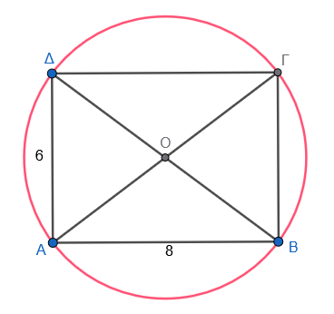

```{=html}
<!-- Φόρτωση βιβλιοθήκης GeoGebra -->
<script src="https://www.geogebra.org/apps/deployggb.js"></script>

<!-- Συνάρτηση δημιουργίας applets -->
<script>
function createGeoGebra(containerId, materialId, width = 700, height = 500) {
  var params = {
    "id": "ggb-" + containerId,
    "material_id": materialId,
    "width": width,
    "height": height,
    "showToolBar": true,
    "showMenuBar": false,
    "showAlgebraInput": true
  };
  
  var applet = new GGBApplet(params, '5.2');
  applet.inject(containerId);
}
</script>
```

## Εμβαδόν κυκλικού δίσκου

::: {style="background-color: #E7CEF0; border: 2px solid #2f3e50; color: #25188a; padding: 15px; border-radius: 5px;"}
Το εμβαδόν ενός κυκλικού δίσκου εκφράζει την έκταση που καταλαμβάνει η επιφάνειά του στο επίπεδο.
Ο υπολογισμός του βασίζεται στον τύπο $E = \pi\rho^2$, όπου $\rho$ είναι η ακτίνα του κύκλου και $\pi$ ο γνωστός άρρητος αριθμός που προσεγγιστικά ισούται με 3,14.
:::

### Πώς εξηγείται ο τύπος του εμβαδού;

Η προέλευση του τύπου εξηγείται γεωμετρικά αν χωρίσουμε τον κυκλικό δίσκο σε πάρα πολλά μικρά και ίσα μέρη (τομείς).
Αν κόψουμε αυτά τα κομμάτια και τα επανατοποθετήσουμε κατάλληλα, σχηματίζουν μια επιφάνεια που προσεγγίζει ένα ορθογώνιο παραλληλόγραμμο.

\* Η **βάση** αυτού του ορθογωνίου ισούται με το μισό του μήκους του κύκλου, δηλαδή $\pi\rho$.

\* Το **ύψος** του ορθογωνίου ισούται με την ακτίνα $\rho$ του κύκλου.

\* Επομένως, το εμβαδόν προκύπτει από το γινόμενο βάσης επί ύψος: $\pi\rho \cdot \rho = \pi\rho^2$.\

<iframe src="https://www.geogebra.org/calculator/ucvvmypn?embed" width="740" height="650" allowfullscreen style="border: 1px solid #e4e4e4;border-radius: 4px;" frameborder="0">

</iframe>

\

::: {.callout-tip style="color: brown;"}
## Ενέργεια

- Σύρετε τον δρομέα στην αρχή αν δεν είναι ήδη.

- "Κλίκ" στο κουμπί <a class="btn btn-primary btn-sm">Κίνηση</a>

- Δές τι συμβαίνει καθώς προοδευτικά αυξάνονται οι φέτες.
:::

\

### Παραδείγματα από τη Γεωμετρία

- **Κυκλικός δακτύλιος:** Είναι η περιοχή που βρίσκεται ανάμεσα σε δύο ομόκεντρους κύκλους με διαφορετικές ακτίνες ($R$ και $\rho$). Το εμβαδόν του υπολογίζεται αφαιρώντας το εμβαδόν του μικρού δίσκου από τον μεγάλο ($E = \pi R^2 - \pi\rho^2$).
- **Μεταβολή ακτίνας:** Αν τριπλασιάσουμε την ακτίνα ενός κύκλου, το εμβαδόν του δεν τριπλασιάζεται αλλά εννιαπλασιάζεται ($3^2$), λόγω του τετραγώνου στον τύπο.

### Παραδείγματα από τη Φύση και την Καθημερινή Ζωή

- **Αστρονομία:** Ο λόγος του μήκους της περιφέρειας προς τη διάμετρο ($\pi$) παραμένει σταθερός (περίπου 3,14) για όλους τους πλανήτες, όπως η Γη, ο Άρης και η Σελήνη.
- **Οικονομία & Κατανάλωση:** Στις πιτσαρίες, η σύγκριση της τιμής ανάλογα με τη διάμετρο της πίτσας (μικρή, μεσαία, μεγάλη) βασίζεται στον υπολογισμό του εμβαδού για να δούμε ποια προσφορά συμφέρει πραγματικά.
- **Φυσικό περιβάλλον:** Η διατομή του κορμού ενός δέντρου μπορεί να θεωρηθεί κυκλικός δίσκος για τον υπολογισμό της αξίας της ξυλείας του.
- **Εφαρμογές:** Η επιφάνεια που καθαρίζει ο υαλοκαθαριστήρας ενός αυτοκινήτου καθώς κινείται διαγράφει έναν κυκλικό τομέα.

### εφαρμογές

1.  **Απλός υπολογισμός:** Να βρεθεί το εμβαδόν κυκλικού δίσκου με ακτίνα $\rho = 5$ cm. \
    **Λύση:** Χρησιμοποιούμε τον τύπο $E = \pi\rho^2$ με $\pi \approx 3,14$. $E = 3,14 \cdot 5^2 = 3,14 \cdot 25 = 78,5$ cm².
2.  **Από το μήκος στο εμβαδόν:** Αν το μήκος ενός κύκλου είναι $L = 6,28$ cm, να βρείτε το εμβαδόν του. \
    **Λύση:** Από τον τύπο $L = 2\pi\rho$ βρίσκουμε την ακτίνα: $6,28 = 2 \cdot 3,14 \cdot \rho$, άρα $6,28 = 6,28 \cdot \rho$, οπότε $\rho = 1$ cm. Τότε, $E = \pi\rho^2 = 3,14 \cdot 1^2 = 3,14$ cm².
3.  **Μεταβολή ακτίνας:** Αν τριπλασιάσουμε την ακτίνα ενός κύκλου, πόσο θα αυξηθεί το εμβαδόν του;\
    **Λύση:** Αν η αρχική ακτίνα είναι $\rho$, το αρχικό εμβαδόν είναι $E = \pi\rho^2$. Η νέα ακτίνα είναι $3\rho$. Το νέο εμβαδόν θα είναι $E' = \pi(3\rho)^2 = \pi \cdot 9\rho^2 = 9E$. Επομένως, το εμβαδόν εννιαπλασιάζεται.
4.  **Κυκλικός δακτύλιος:** Να βρείτε το εμβαδόν κυκλικού δακτυλίου αν η μεγάλη ακτίνα είναι $R = 3$ cm και η μικρή $\rho = 2$ cm. \
    **Λύση:** Το εμβαδόν του δακτυλίου ισούται με τη διαφορά των εμβαδών των δύο δίσκων: $E = \pi R^2 - \pi\rho^2$. $E = 3,14 \cdot 3^2 - 3,14 \cdot 2^2 = 3,14(9 - 4) = 3,14 \cdot 5 = 15,7$ cm².
5.  **Σύνθετο πρόβλημα (Πίτσα):** Μια μικρή πίτσα έχει διάμετρο 20 cm και κοστίζει 7 €, ενώ μια μεγάλη έχει διάμετρο 30 cm και κοστίζει 12 €. Ποια συμφέρει περισσότερο; \
    **Λύση:** Υπολογίζουμε το εμβαδόν κάθε πίτσας ($\rho = \dfrac{\delta}{2}$).
    - Μικρή: $\rho = 10$ cm, $E \approx 314$ cm². Τιμή ανά cm²: $\dfrac{7}{314} \approx 0,0223$ €.
    - Μεγάλη: $\rho = 15$ cm, $E \approx 706,85$ cm². Τιμή ανά cm²: $\dfrac{12}{706,85} \approx 0,017$ €.
    - Συμφέρει η μεγάλη πίτσα γιατί έχει μικρότερη τιμή ανά μονάδα επιφάνειας.
6.  Ενας κυκλικός δίσκος έχει ακτίνα $ρ = 5$ cm. Να βρεθούν:
    - α) Η περίμετρος του κύκλου που τον ορίζει.
    - β) Το εμβαδόν του δίσκου.\
      (Δίνεται $\pi \approx 3,14$).\
      **Λύση**
      - α) Περίμετρος: $L = 2\pi r = 2 \cdot 3,14 \cdot 5 = 31,4$ cm.
      - β) Εμβαδόν: $E = \pi r^2 = 3,14 \cdot 5^2 = 3,14 \cdot 25 = 78,5$ cm².


7.  Ένας δίσκος ακτίνας 20 cm κόβεται σε 8 ίσες φέτες (ξεκινώντας πάντα από το κέντρο του).
    - α) Να βρείτε το μήκος του τόξου ενός τομέα.
    - β) Να βρείτε το εμβαδόν ενός τομέα.\
    **Λύση**
    - α) Γωνία φέτας: $\dfrac{360^\circ}{8} = 45^\circ$.
    - Μήκος τόξου: $\frac{45}{360} \cdot 2\pi ρ = \frac{1}{8} \cdot 2 \cdot 3,14 \cdot 20 = \frac{1}{8} \cdot 125,6 = 15,7$ cm.
    - β) Εμβαδόν τομέα: $\dfrac{45}{360} \cdot \pi ρ^2 = \dfrac{1}{8} \cdot 3,14 \cdot 400 = \dfrac{1}{8} \cdot 1256 = 157$ cm².

8.  Δύο κυκλικοί δίσκοι έχουν ακτίνες $ρ_1 = 10$ cm και $ρ_2 = 6$ cm. Βρείτε:
    - α) Πόσες φορές μεγαλύτερη είναι η περίμετρος του μεγάλου δίσκου από τη μικρή;\
    - β) Πόσες φορές μεγαλύτερο είναι το εμβαδόν του μεγάλου δίσκου;\
    **Λύση** 
    - α) $\dfrac{2\pi ρ_1}{2\pi ρ_2} = \dfrac{ρ_1}{ρ_2} = \dfrac{10}{6} = \dfrac{5}{3} \approx 1,67$ φορές.
    - β) $\dfrac{\pi ρ_1^2}{\pi ρ_2^2} = \left(\dfrac{ρ_1}{ρ_2}\right)^2 = \left(\dfrac{10}{6}\right)^2 = \dfrac{100}{36} = \dfrac{25}{9} \approx 2,78$ φορές.

9.  Ένας κύκλος ακτίνας 14 cm αντιστοιχεί σε 100% μιας πίτσας.
    Κόβουμε μια φέτα γωνίας 120°.
    - Να βρείτε το βάρος του τομέα, αν όλη η πίτσα ζυγίζει 900 g, και στη συνέχεια
    - Να υπολογίσετε το βάρος ανά cm².\
    **Λύση**
    - Εμβαδόν όλης της πίτσας: $E = \pi r^2 = 3,14 \cdot 196 = 615,44$ cm².
    - Κλάσμα φέτας: $\dfrac{120}{360} = \dfrac{1}{3}$.
    - Εμβαδόν φέτας: $\dfrac{615,44}{3} \approx 205,147$ cm².
    - Βάρος τομέα: $\dfrac{900}{3} = 300$ g.
    - Βάρος ανά cm²: $\dfrac{900}{615,44} \approx 1,462$ g/cm² (ή $\dfrac{300}{205,147} \approx 1,462$ ).

------------------------------------------------------------------------

### Άλυτες Ασκήσεις

1.  Υπολογίστε το εμβαδόν κυκλικού δίσκου με ακτίνα $\rho = 4$ cm.

2.  Βρείτε το εμβαδόν κύκλου με διάμετρο $\delta = 10$ cm.

3.  Ένας κύκλος έχει εμβαδόν $E = 28,26$ cm².
    Πόση είναι η ακτίνα του;

4.  Μια ροτόντα (στρογγυλό τραπέζι) έχει περίμετρο 5,026 m.
    Ποιο είναι το εμβαδόν του δίσκου που περικλείει;

5.  Αν διπλασιάσουμε την ακτίνα ενός κύκλου, πόσες φορές αυξάνεται το εμβαδόν του;

6.  Να βρείτε το εμβαδόν κυκλικού δακτυλίου που ορίζεται από δύο ομόκεντρους κύκλους με ακτίνες 10 cm και 7 cm.

7.  Ένας κυκλικός δίσκος έχει εμβαδόν $144\pi$ cm².
    Πόσο είναι το μήκος του κύκλου του;

8.  Ένα τετράγωνο έχει πλευρά 6 cm.

    - Βρείτε το εμβαδόν του κυκλικού δίσκου που είναι εγγεγραμμένος στο τετράγωνο.
    - Βρείτε το εμβαδόν του κυκλικού δίσκου που είναι περιγγεγραμμένος στο τετράγωνο.

9.  Βρείτε το εμβαδόν κυκλικού δίσκου που είναι περιγεγραμμένος σε ορθογώνιο διαστάσεων 6 cm και 8 cm.\

    \
    {width="283"}\

10. Ποια είναι η ακτίνα ενός κύκλου που έχει εμβαδόν αριθμητικά ίσο με το μήκος του;

11. Ένας κυκλικός δίσκος έχει ακτίνα 7 cm.
    Υπολόγισε την περίμετρο και το εμβαδόν του.
    (π = 3,14)

12. Το εμβαδόν ενός κυκλικού δίσκου είναι 314 cm².
    Να βρεθεί η ακτίνα και η περίμετρός του.
    (π = 3,14)

13. Ένας κύκλος έχει μήκος περιφέρειας 43,96 cm.
    Βρες την ακτίνα του και το εμβαδόν του δίσκου.
    (π = 3,14)

14. Δύο κύκλοι έχουν ακτίνες 8 cm και 4 cm.
    Πόσες φορές μεγαλύτερη είναι η περίμετρος του πρώτου; Πόσες φορές μεγαλύτερο το εμβαδόν του;

15. Κόβουμε έναν κυκλικό δίσκο ακτίνας 12 cm σε 6 ίσες φέτες.
    Να βρεθεί η κεντρική γωνία, το μήκος τόξου και το εμβαδόν κάθε φέτας.
    (π = 3,14)

16. Ένας κυκλικός δίσκος ακτίνας 15 cm αντιστοιχεί σε ολόκληρη τούρτα.
    Κόβουμε ένα κομμάτι γωνίας 90°.
    Πόσο εμβαδόν έχει το κομμάτι; Αν η τούρτα ζυγίζει 1200 g, πόσο ζυγίζει το κομμάτι;

17. Η ακτίνα ενός δίσκου αυξάνεται κατά 20%.
    Να βρεθεί η ποσοστιαία αύξηση του εμβαδού του.
    (Αναλογία: νέα ακτίνα = 1,2ρ, οπότε νέο εμβαδόν = 1,44 φορές)

18. Δύο δίσκοι έχουν εμβαδά 100π cm² και 64π cm².
    Βρες τις ακτίνες τους και την αναλογία περιμέτρων.

19. Δίνεται ένας δίσκος εμβαδού 200,96 cm² (πάρτε π=3,14).
    Βρες την ακτίνα.
    Στη συνέχεια, φτιάξε μια φέτα 120° και βρες το μήκος τόξου του.

20. Σε έναν κυκλικό δίσκο ακτίνας 18 cm, σχεδιάζουμε δύο ομόκεντρους κύκλους ακτίνων 6 cm και 12 cm, χωρίζοντας τον δίσκο σε 3 ζώνες (δίσκο – δακτυλίους).
    Βρες το εμβαδόν κάθε ζώνης.

::: {.callout-tip style="color: brown;"}
## Ενέργεια
:::

::: {style="background-color: #E7CEF0; border: 2px solid #2f3e50; color: #25188a; padding: 15px; border-radius: 5px;"}
:::

::: {.callout-tip style="color: brown;"}
:::

\
\
