```{=html}
<!-- Φόρτωση βιβλιοθήκης GeoGebra -->
<script src="https://www.geogebra.org/apps/deployggb.js"></script>

<!-- Συνάρτηση δημιουργίας applets -->
<script>
function createGeoGebra(containerId, materialId, width = 700, height = 500) {
  var params = {
    "id": "ggb-" + containerId,
    "material_id": materialId,
    "width": width,
    "height": height,
    "showToolBar": true,
    "showMenuBar": false,
    "showAlgebraInput": true
  };
  
  var applet = new GGBApplet(params, '5.2');
  applet.inject(containerId);
}
</script>
```

## Εμβαδόν κυκλικού τομέα

::: {style="background-color: #E7CEF0; border: 2px solid #2f3e50; color: #25188a; padding: 15px; border-radius: 5px;"}
**Κυκλικός τομέας** (τομέας κύκλου) είναι το τμήμα του κύκλου που περικλείεται μεταξύ δύο ακτίνων και του αντίστοιχου τόξου τους.

- **Κεντρική γωνία (θ)**: η γωνία μεταξύ των δύο ακτίνων.
- **Ακτίνα (ρ)** : η απόσταση από το κέντρο στον κύκλο.
- **Τόξο** : το τμήμα της περιφέρειας που αντιστοιχεί στη γωνία θ.

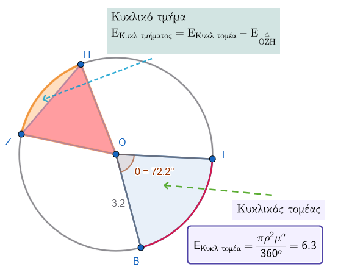

**Τύποι για το εμβαδόν κυκλικού τομέα**

- Όταν η γωνία $\hatθ$ ή το αντίστοιχο τόξο δίνεται σε μοίρες $μ^ο$

$E = \dfrac{μ^ο}{360^\circ} \cdot \pi ρ^2$ .

- Όταν η γωνία δίνεται σε ακτίνια ( α rad)

$E = \dfrac{1}{2} ρ^2 \cdot α$ .

**Προέλευση του τύπου**:

```{=html}

<style type="text/css">
.tg  {border-collapse:collapse;border-color:#bbb;border-spacing:0;}
.tg td{background-color:#E0FFEB;border-color:#bbb;border-style:solid;border-width:1px;color:#594F4F;
  font-family:Arial, sans-serif;font-size:14px;overflow:hidden;padding:10px 5px;word-break:normal;}
.tg th{background-color:#9DE0AD;border-color:#bbb;border-style:solid;border-width:1px;color:#493F3F;
  font-family:Arial, sans-serif;font-size:14px;font-weight:normal;overflow:hidden;padding:10px 5px;word-break:normal;}
.tg .tg-k0ty{border-color:#009901;font-weight:bold;text-align:center;vertical-align:top}
.tg .tg-c5dt{background-color:#ffccc9;border-color:#009901;font-weight:bold;text-align:center;vertical-align:top}
.tg .tg-09wa{background-color:#f56b00;border-color:#009901;font-weight:bold;text-align:center;vertical-align:top}
.tg .tg-jzk6{background-color:#9698ed;font-weight:bold;text-align:center;vertical-align:top}
</style>
<table class="tg"><thead>
  <tr>
    <th class="tg-k0ty">Τόξο</th>
    <th class="tg-k0ty">Εμβαδόν</th>
  </tr></thead>
<tbody>
  <tr>
    <td class="tg-c5dt">\(360^ο\)</td>
    <td class="tg-c5dt">\(πρ^2\)</td>
  </tr>
  <tr>
    <td class="tg-09wa">\(μ^ο\)</td>
    <td class="tg-09wa">Ε</td>
  </tr>
  <tr>
    <td class="tg-jzk6">α ακτίνια</td>
    <td class="tg-jzk6">Ε</td>
  </tr>
</tbody>
</table>
```

Ολόκληρος κύκλος έχει εμβαδόν $Ε=\pi ρ^2$ το οποίο αντιστοιχεί σε γωνία $360^\circ$ ή $2\pi$ rad.
Μια γωνία $μ^o$ ή α ακτινίων θα είναι το κλάσμα $\dfrac{μ^o}{360^ο}$ του εμβαδού Ε ή $\dfrac{α}{2\pi}$ του εμβαδού Ε αντίστοιχα.
Άρα και το εμβαδόν αναλογικά θα είναι $E = \dfrac{μ^ο}{360^\circ} \cdot \pi ρ^2$ όταν η γωνία είναι σε μοίρες και $E = \dfrac{1}{2} ρ^2 \cdot α$ όταν η γωνία είναι σε ακτίνια.

- Συναρτήσει του μήκους l του τόξου

Γνωρίζουμε ότι το μήκος του τόξου είναι $l = ρα$ (α σε rad), τότε:

$E = \dfrac{1}{2} ρ \cdot l$
:::

------------------------------------------------------------------------

### Εφαρμογές

Ο κυκλικός τομέας εμφανίζεται σε:

- **Γεωμετρία** – υπολογισμοί επιφανειών σε κύκλους.
- **Φυσική** – ροπή αδράνειας, κίνηση σε τροχιά.
- **Μηχανική** – γρανάζια, τομές σωλήνων.
- **Στατιστική** – κυκλικά διαγράμματα (pie charts).
- **Αρχιτεκτονική** – καμάρες, θόλοι, τομές σε σχέδια.

------------------------------------------------------------------------

### Ασκήσεις κατανόησης

1.  Να βρεθεί το εμβαδόν του κυκλικού τομέα κύκλου ακτίνας ( ρ = 6 ) cm και κεντρικής γωνίας $120^\circ$.\

**Λύση**\
$E = \dfrac{120^o}{360^o} \cdot \pi \cdot 6^2 = \dfrac{1}{3} \cdot 36\pi = 12\pi \text{ cm}^2 ≈  37,70 \text{ cm}^2$.

2.  Το εμβαδόν ενός κυκλικού τομέα είναι $8\pi \text{ m}^2$ και η ακτίνα $ρ = 4$ m.\
    Να βρεθεί η κεντρική γωνία σε rad.

**Λύση**\
$8\pi = \dfrac{1}{2} \cdot 4^2 \cdot \theta \Rightarrow 8\pi = 8\theta \Rightarrow \theta = \pi \text{ rad} (180^\circ)$

3.  Κυκλικός τομέας έχει μήκος τόξου $l = 5$ cm και ακτίνα $ρ = 2$ cm.\
    Βρείτε το εμβαδόν.

**Λύση**\
$E = \dfrac{1}{2} \cdot 2 \cdot 5 = 5\text{ cm}^2$

4.  (κατανόησης – σωστό/λάθος)

- Αν διπλασιαστεί η γωνία ενός τομέα, το εμβαδόν διπλασιάζεται. → **Σωστό** (για σταθερή ακτίνα).
- Για μια γωνία 1 rad, το εμβαδόν είναι $ρ^2 / 2$. → **Σωστό**.
- Για γωνία 90°, το εμβαδόν είναι το 1/3 του κύκλου. → **Λάθος** (είναι 1/4).

5.  (σύνθετη)

Ενας κυκλικός τομέας έχει γωνία 2 rad και εμβαδόν $16\text{ cm}^2$.\
Να βρεθούν: (α) η ακτίνα, (β) το μήκος τόξου.

**Λύση**\
(α) $16 = \dfrac{1}{2} ρ^2 \cdot 2 \Rightarrow 16 = ρ^2 \Rightarrow ρ = 4$ cm.\
(β) $l = ρα = 4 \cdot 2 = 8$ cm.

### Ασκήσεις

1.  Δίνεται ένα τετράγωνο ABΓΔ με πλευρά 8 cm.
    Να βρείτε το εμβαδόν της μεικτόγραμμης περιοχής που βρίσκεται έξω από το τετράγωνο αλλά μέσα στον γραμμασκιασμένο τομέα.\

    \
    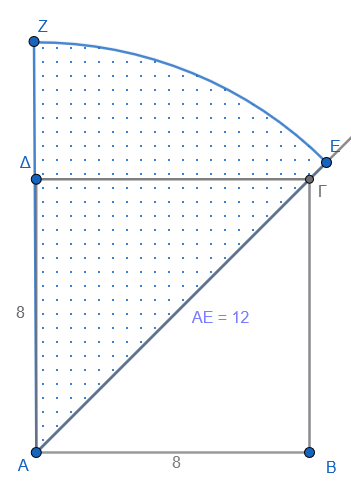{width="269"}

2.  Να βρείτε το εμβαδόν της κοινής τομής των τριών τομέων (καμπυλόγραμμο [**μπλέ**]{style="color: blue;"} τρίγωνο Reuleaux) στο παρακάτω σχήμα.

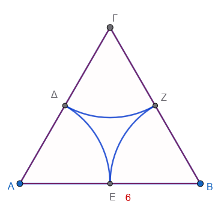{width="304"}

3.  Να υπολογίσετε το εμβαδόν του [**κόκκινου**]{style="color: red;"} μεικτόγρσμμου σχήματος.

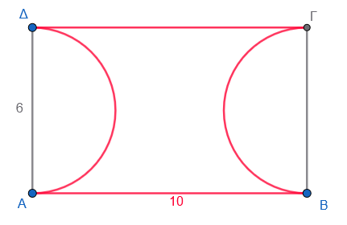{width="342"}

4.  Δίνονται δύο ομόκεντροι κύκλοι ακτίνων $ρ_1 = 5$ cm και $ρ_2 = 3$ cm. Ένας κυκλικός τομέας του μεγάλου κύκλου με γωνία $120^\circ$ επικαλύπτει έναν αντίστοιχο τομέα του μικρού κύκλου. Να βρείτε το εμβαδόν του **δακτυλιοειδούς τομέα** [**καφέ χρώμα**]{style="color: brown;"} (τμήμα του μεγάλου τομέα που βρίσκεται έξω από τον μικρό κύκλο).

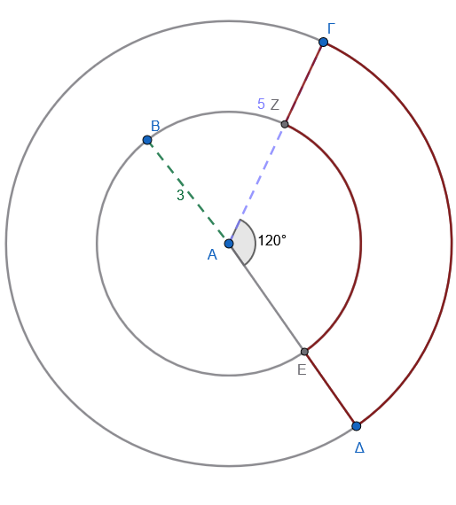{width="286"}

5.  Σε κύκλο ακτίνας ρ = 10 cm, παίρνουμε χορδή μήκους $10\sqrt{2}$ cm.

- Τι τρίγωνο είναι το $\overset\triangle{ΑΟΒ}$;

- Να βρείτε το εμβαδόν του μικρότερου **κυκλικού τμήματος** (το τμήμα μεταξύ χορδής και τόξου, γραμμοσκιασμένο).

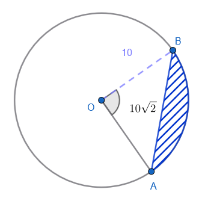\

::: {style="background-color: #E7CEF0; border: 2px solid #2f3e50; color: #25188a; padding: 15px; border-radius: 5px;"}
**Τι είναι μηνίσκος** Μηνίσκος είναι η τομή δύο κύκλων, παράδειγμα

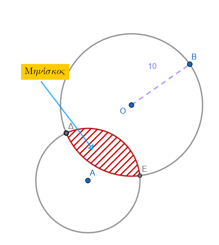{width="263"}

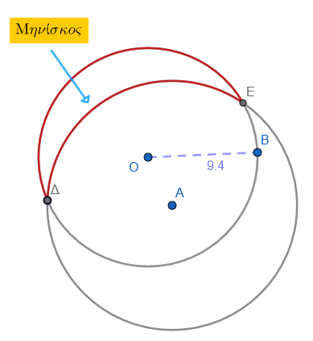{width="272"}
:::

**παράδειγμα υπολογισμού εμβαδού** για καθένα από τα τρία βασικά είδη μηνίσκων.

**Κυρτός μηνίσκος (lune) – Μηνίσκος Ιπποκράτη**

**Δίνονται:** Ορθογώνιο τρίγωνο ( ABΓ ) με ( \angle A = 90\^\circ ), ( AB = 3 ), ( AΓ = 4 ), άρα ( BΓ = 5 ) (τρίγωνο 3-4-5).

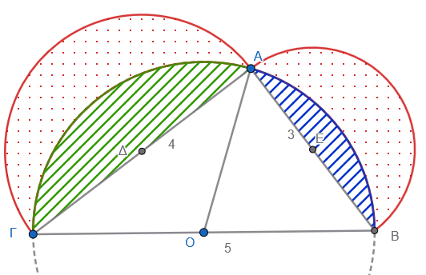{width="357"}

**Ζητείται:** Εμβαδόν των δύο μηνίσκων με τις τελείες ισούτε με το εμβαδόν του τριγώνου.

**Λύση:**

- **Εμβαδόν τριγώνου:** Για το τρίγωνο με κάθετες πλευρές $ΑΒ=3$ και $ΑΓ=4$, το εμβαδόν είναι:

$$E_{\text{τριγώνου}} = \dfrac{1}{2} \cdot 3 \cdot 4 = 6$$

**Επαλήθευση (μαθηματικά):**

- Ημικύκλιο με διάμετρο $ΑΒ=3$: $E_{ΑΒ} = \dfrac{1}{2} \pi (\dfrac{3}{2})^2 = \dfrac{9\pi}{8}$

- Ημικύκλιο με διάμετρο $ΑΓ=4$: $E_{ΑΓ} = \dfrac{1}{2} \pi (\dfrac{4}{2})^2 = 2\pi$

- Ημικύκλιο με διάμετρο $ΒΓ=5$: $E_{ΒΓ} = \dfrac{1}{2} \pi (\dfrac{5}{2})^2 = \dfrac{25\pi}{8}$

- Το εμβαδόν των μηνίσκων προκύπτει από: $(E_{ΑΒ} + E_{ΑΓ}) - (E_{ΒΓ} - E_{\text{τριγώνου}})$.

- $(\dfrac{9\pi}{8} + \dfrac{16\pi}{8}) - \dfrac{25\pi}{8} + 6 = \dfrac{25\pi}{8} - \dfrac{25\pi}{8} + 6 = 6$.

**Κοίλος μηνίσκος (meniscus)**

**Σχήμα:** Δύο ομόκεντροι κύκλοι ακτίνων ( R = 5 ) (εξωτερικός) και ( r = 3 ) (εσωτερικός).
Παίρνουμε το τμήμα του δακτυλίου που αντιστοιχεί σε κεντρική γωνία $120^\circ$.

**Ζητείται:** Εμβαδόν του κοίλου μηνίσκου (δακτυλιοειδούς τομέα).

**Λύση:**

- Εμβαδόν μεγάλου τομέα:\
  $E_R = \dfrac{120}{360} \cdot \pi \cdot 5^2 = \dfrac{1}{3} \cdot 25\pi = \dfrac{25\pi}{3}$

- Εμβαδόν μικρού τομέα:\
  $E_r = \dfrac{120}{360} \cdot \pi \cdot 3^2 = \dfrac{1}{3} \cdot 9\pi = 3\pi$

- Εμβαδόν κοίλου μηνίσκου:\
  $E = E_R - E_r = \dfrac{25\pi}{3} - 3\pi = \dfrac{25\pi}{3} - \dfrac{9\pi}{3} = \dfrac{16\pi}{3}$

Αριθμητικά: ( \approx 16,76 ) τ.μ.

**Αμφίκυρτος μηνίσκος (lens / φακός) – τομή δύο ίσων κύκλων** (μπορεί να έχουμε και διαφορετικούς κύκλους)

Δίνονται δύο ίσοι κύκλοι με:

- ακτίνα ( ρ = 5 )
- απόσταση κέντρων ( α = 6 )

Ζητείται το εμβαδόν της κοινής περιοχής τους (κυκλικός φακός).

Ενώνουμε τα κέντρα των κύκλων ($K_1, K_2$) και ένα σημείο τομής (A).

Τότε:

- ($K_1A = 5$)
- ($K_2A = 5$)
- ($K_1K_2 = 6$)

Το τρίγωνο είναι ισοσκελές.

Η κάθετη από το μέσο της βάσης χωρίζει τη βάση σε: $\dfrac{6}{2}=3$

Στο ορθογώνιο τρίγωνο: $συν\theta=\dfrac{3}{5}$

Άρα: Από τους τριγωνομετρικούς πίνακες βρίσκουμε ότι $θ\approx 53{,}13^\circ$

Η αντίστοιχη κεντρική γωνία είναι: $2\theta \approx 106{,}26^\circ$

Το εμβαδόν ενός τομέα είναι: $E_{\text{τομέα}}=\dfrac{106{,}26^\circ}{360^\circ}\cdot \pi \cdot 5^2$ $E_{\text{τομέα}}\approx 23{,}18$

Κάθε μισό του φακού είναι: τομέας − τρίγωνο.

Εμβαδόν τριγώνου

Ημιδιάμετρος βάσης: 3

Ύψος: $υ=\sqrt{5^2-3^2}=\sqrt{25-9}=4$

Άρα: $E_{\triangle}=\frac12\cdot 6\cdot 4=12$

Εμβαδόν φακού $E=2(23{,}18-12)$

$E\approx 22{,}36$

Τελικό αποτέλεσμα

Το εμβαδόν της τομής των δύο κύκλων είναι περίπου:

$\boxed{22{,}36 \text{ τετρ. μονάδες}}$

6.  Σε ημικύκλιο διαμέτρου ( AB = 12 ) cm, κατασκευάζουμε δύο μικρότερα ημικύκλια διαμέτρων ( AΓ ) και ( ΓB ), όπου ( Γ ) είναι μέσο της ( AB ).
    Η περιοχή μεταξύ του μεγάλου ημικυκλίου και των δύο μικρών ημικυκλίων ονομάζεται **μηνίσκος του Ιπποκράτη** (πάνω από την ( AB )).
    Να βρείτε το εμβαδόν του μηνίσκου.

7.  Σε κύκλο ακτίνας ( ρ ), εγγράφουμε κανονικό εξάγωνο.
    Να υπολογίσετε το εμβαδόν καθενός από τα **έξι κυκλικά τμήματα** που βρίσκονται μεταξύ των πλευρών του εξαγώνου και του κύκλου (εξωτερικά του εξαγώνου).

8.  Να υπολογίσετε το εμβαδόν της περιοχής (καρδιά) στο παρακάτω σχήμα που περικλείεται από την [**μπλε**]{style="color: blue;"} γραμμή .
    Το τρίγωνο είναι ισόπλευρο με πλευρά 6 cm\
    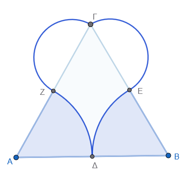{width="336"}

9.  Να υπολογίσετε τον μηνίσκο που δημιουργείται στο παρακάτω σχήμα\
    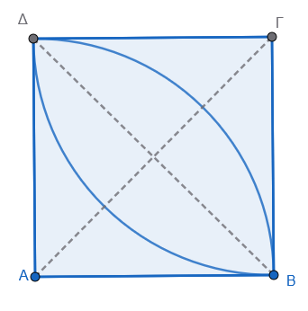{width="291"}

10. Να βρείτε το εμβαδόν του χωρίου που περικλείεται από την [**πράσινη**]{style="color: green;"} γραμμή.
    Η πλευρά του τετραγώνου είναι 8 cm.

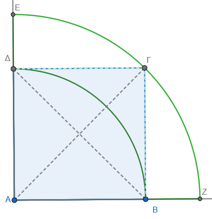{width="306"}

11. Έχουμε δυο ίσους κύκλους ακτίνας ( ρ=5 ) των οποίων τα κέντρα απέχουν ( ρ ).
Να βρείτε το εμβαδόν της **κοινής τομής** (αμφίκυρτου φακού) που σχηματίζεται.
Υπόδειξη: Η τομή αποτελείται από δύο κυκλικά τμήματα.

::: {.callout-tip style="color: brown;"}
## Ενέργεια
:::

::: {style="background-color: #E7CEF0; border: 2px solid #2f3e50; color: #25188a; padding: 15px; border-radius: 5px;"}
:::

::: {.callout-tip style="color: brown;"}
:::

\
\
