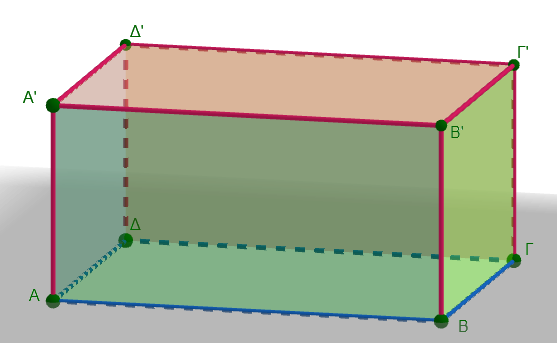
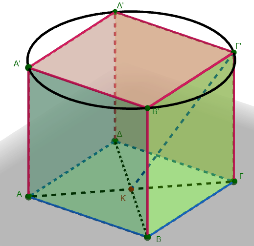
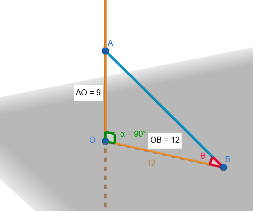
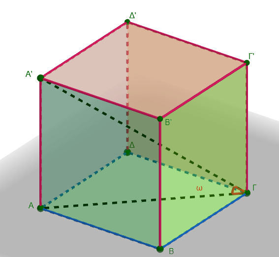
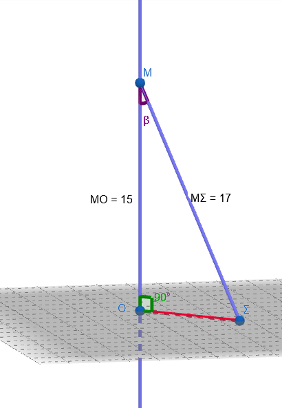
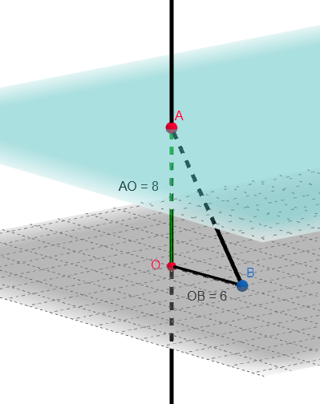
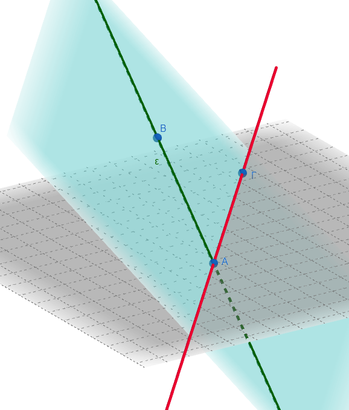
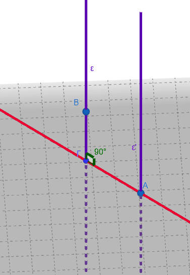
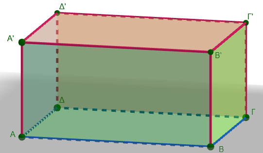
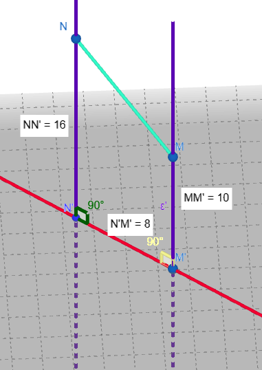

```{=html}
<!-- Φόρτωση βιβλιοθήκης GeoGebra -->
<script src="https://www.geogebra.org/apps/deployggb.js"></script>

<!-- Συνάρτηση δημιουργίας applets -->
<script>
function createGeoGebra(containerId, materialId, width = 700, height = 500) {
  var params = {
    "id": "ggb-" + containerId,
    "material_id": materialId,
    "width": width,
    "height": height,
    "showToolBar": true,
    "showMenuBar": false,
    "showAlgebraInput": true
  };
  
  var applet = new GGBApplet(params, '5.2');
  applet.inject(containerId);
}
</script>
```

## Ευθείες και επίπεδα στο χώρο

::: {style="background-color: #E7CEF0; border: 2px solid #2f3e50; color: #25188a; padding: 15px; border-radius: 5px;"}
Στο χώρο, δύο επίπεδα μπορούν να έχουν τις εξής σχετικές θέσεις:

- **Τεμνόμενα:** Όταν έχουν κοινά σημεία αλλά δεν συμπίπτουν, οπότε η τομή τους είναι πάντα μια **ευθεία**.
- **Παράλληλα:** Όταν δεν έχουν κανένα κοινό σημείο. Η **απόσταση** δύο παραλλήλων επιπέδων ορίζεται ως το μήκος του ευθυγράμμου τμήματος που είναι κάθετο και στα δύο επίπεδα.
- **Ταυτιζόμενα:** Όταν συμπίπτουν πλήρως και όλα τα σημεία τους είναι κοινά.
:::

\

### Τεμνόμενα επίπεδα

<iframe src="https://www.geogebra.org/calculator/p7pfb229?embed" width="740" height="600" allowfullscreen style="border: 1px solid #e4e4e4;border-radius: 4px;" frameborder="0">

</iframe>

::: {.callout-tip style="color: brown;"}
## Ενέργεια

$p∩q=ε$

Με δεξί κλικ πατημένο κινήστε το ποντίκι σας για να δείτε τα τεμνόμενα επίπεδα υπό διαφορετικές γωνίες.

Η ευθεία ε είναι η **τομή** των επιπέδων.

Μετακινήστε το σημείο Α, Β ή Γ για να αλλάξετε την θέση του p.

Μετακινήστε το σημείο Δ, Ε ή Ζ για να αλλάξετε την θέση του q.
:::

\

### Παράλληλα επίπεδα

<iframe src="https://www.geogebra.org/calculator/k69mrqce?embed" width="740" height="600" allowfullscreen style="border: 1px solid #e4e4e4;border-radius: 4px;" frameborder="0">

</iframe>

::: {.callout-tip style="color: brown;"}
## Ενέργεια

p//q

Με δεξί κλικ πατημένο κινήστε το ποντίκι σας για να δείτε τα παράλληλα επίπεδα υπό διαφορετικές γωνίες.

Η ΒΓ είναι η **απόσταση μεταξύ** των παραλλήλων.

Μετακινήστε το σημείο Α για να αλλάξετε την θέση του παράλληλου επίπεδου q.
:::

### Ταυτιζόμενα επίπεδα

Όταν τα επίπεδα έχουν τρία κοινά σημεία τότε ταυτίζονται.

### Σχετικές θέσεις δύο ευθειών στο χώρο

Στο χώρο, δύο ευθείες μπορούν να βρεθούν σε μία από τις παρακάτω τέσσερις σχετικές θέσεις:

1.  **Ταυτιζόμενες:** Οι δύο ευθείες συμπίπτουν πλήρως και έχουν όλα τα σημεία τους κοινά.

2.  **Τεμνόμενες:** Έχουν ακριβώς ένα κοινό σημείο και υπάρχει πάντα ένα επίπεδο στο οποίο ανήκουν υποχρεωτικά.

<iframe src="https://www.geogebra.org/calculator/pmthvgnd?embed" width="740" height="600" allowfullscreen style="border: 1px solid #e4e4e4;border-radius: 4px;" frameborder="0">

</iframe>

::: {.callout-tip style="color: brown;"}
## Ενέργεια

Μετακινήστε το σημείο Α ή Β ή Γ για να αλλάξετε την θέση των τεμνόμενων ευθειών.
:::

3.  **Παράλληλες:** Βρίσκονται στο ίδιο επίπεδο αλλά δεν έχουν κανένα κοινό σημείο, όσο κι αν προεκταθούν.

<iframe src="https://www.geogebra.org/calculator/es26g5gs?embed" width="740" height="600" allowfullscreen style="border: 1px solid #e4e4e4;border-radius: 4px;" frameborder="0">

</iframe>

::: {.callout-tip style="color: brown;"}
## Ενέργεια

Μετακινήστε το σημείο Α ή Β ή Γ για να αλλάξετε την θέση των παράλληλων ευθειών.
:::

4.  **Ασύμβατες:** Αυτή η περίπτωση συμβαίνει **μόνο στις τρεις διαστάσεις**. Οι ασύμβατες ευθείες δεν έχουν κανένα κοινό σημείο, αλλά επιπλέον **δεν ανήκουν στο ίδιο επίπεδο**.

<iframe src="https://www.geogebra.org/calculator/smusw2rr?embed" width="740" height="600" allowfullscreen style="border: 1px solid #e4e4e4;border-radius: 4px;" frameborder="0">

</iframe>

::: {.callout-tip style="color: brown;"}
## Ενέργεια

Περιστρέψτε το σύστημα συντεταγμένων (**κλικ και σύρτε**) για να δείτε διάφορες προοπτικές για τις ασύμβατες ευθείες.
:::

**Η απόσταση μεταξύ δύο ασύμβατων** ευθειών ορίζεται ως το μήκος της **κοινής καθέτου** τους.
Πρόκειται ουσιαστικά για το μήκος του ευθύγραμμου τμήματος που είναι κάθετο και στις δύο ευθείες ταυτόχρονα.

Αυτή η απόσταση αντιπροσωπεύει το ελάχιστο μήκος που συνδέει τα σημεία των δύο ευθειών.

### Σχετικές θέσεις ευθείας και επιπέδου

Στο χώρο, μια ευθεία και ένα επίπεδο μπορούν να έχουν τις εξής σχετικές θέσεις:

- **Η ευθεία ανήκει στο επίπεδο:** Αυτό συμβαίνει όταν δύο σημεία της ευθείας είναι και σημεία του επιπέδου. Σε αυτή την περίπτωση, όλα τα σημεία της ευθείας περιέχονται στο επίπεδο.

<iframe src="https://www.geogebra.org/calculator/zd7tccps?embed" width="740" height="600" allowfullscreen style="border: 1px solid #e4e4e4;border-radius: 4px;" frameborder="0">

</iframe>

- **Η ευθεία είναι παράλληλη στο επίπεδο:** Όταν η ευθεία δεν έχει κανένα κοινό σημείο με το επίπεδο. Αυτό συμβαίνει αν η ευθεία είναι παράλληλη προς μια άλλη ευθεία που βρίσκεται ήδη μέσα στο επίπεδο.

<iframe src="https://www.geogebra.org/calculator/wzz2kdbb?embed" width="740" height="600" allowfullscreen style="border: 1px solid #e4e4e4;border-radius: 4px;" frameborder="0">

</iframe>

::: {.callout-tip style="color: brown;"}
## Ενέργεια

Πειστρέψτε το σύστημα συντεταγμένων.

Αλλάξτε την θέση των σημείων Α,Β,Γ ή Δ για να δειτε σε διφορετικές θέσεις την παράλληλη προς το επίπεδο.
:::

- **Η ευθεία τέμνει το επίπεδο:** Όταν έχουν ακριβώς ένα κοινό σημείο. Μια ιδιαίτερη περίπτωση είναι η ευθεία να είναι **κάθετη** στο επίπεδο, οπότε το τέμνει υποχρεωτικά.

<iframe src="https://www.geogebra.org/calculator/ypxbeqs9?embed" width="740" height="600" allowfullscreen style="border: 1px solid #e4e4e4;border-radius: 4px;" frameborder="0">

</iframe>

::: {.callout-tip style="color: brown;"}
## Ενέργεια

Ζ=(ΕΔ)∩(p)

Πειστρέψτε το σύστημα συντεταγμένων.

Αλλάξτε την θέση των σημείων Α,Β,Γ ή Δ,Ε για να δειτε σε διφορετικές θέσεις την τεμνόμενη με το επίπεδο.
:::

**Περίπτωση κάθετης**

<iframe src="https://www.geogebra.org/calculator/swrpbrsv?embed" width="740" height="600" allowfullscreen style="border: 1px solid #e4e4e4;border-radius: 4px;" frameborder="0">

</iframe>

::: {.callout-tip style="color: brown;"}
## Ενέργεια

Η ΑΒ είναι κάθετη στο επίπεδο p στο σημείο Γ.

Η Απόσταση ΑΓ είναι και η **απόσταση** του σημείου Α από το επίπεδο (q).

Αλλάξτε την θέση των σημείων για να δείτε τις μεταβολές.

Η ΑΒ είναι κάθετη σε δυο τουλάχιστον ευθείες που περνάνε από το ίχνος της πάνω στο (p).
:::

::: {.callout-tip style="color: brown;"}
## Ακόμη

Δύο ευθείες ονομάζονται **ασυμβάτως κάθετες** όταν είναι **ασύμβατες** (δηλαδή δεν έχουν κοινό σημείο και δεν ανήκουν στο ίδιο επίπεδο) αλλά οι διευθύνσεις τους σχηματίζουν **ορθή γωνία**.

Πρακτικά αυτό σημαίνει ότι:

1.  Δεν τέμνονται και δεν είναι παράλληλες.
2.  Αν μεταφέρουμε τη μία παράλληλα προς τον εαυτό της μέχρι να τμήσει την άλλη, η γωνία που σχηματίζεται είναι 90°.
3.  Στην περίπτωση αυτή, η **κοινή κάθετος** των δύο ευθειών είναι το μοναδικό ευθύγραμμο τμήμα που τις συνδέει και είναι ταυτόχρονα κάθετο και στις δύο.
:::

### Ασκήσεις

1.  **Ερωτήσεις Κατανόησης (Σωστό/Λάθος)**

```{=html}

<style type="text/css">
.tg  {border-collapse:collapse;border-color:#aabcfe;border-spacing:0;}
.tg td{background-color:#e8edff;border-color:#aabcfe;border-style:solid;border-width:1px;color:#669;
  font-family:Arial, sans-serif;font-size:14px;overflow:hidden;padding:10px 5px;word-break:normal;}
.tg th{background-color:#b9c9fe;border-color:#aabcfe;border-style:solid;border-width:1px;color:#039;
  font-family:Arial, sans-serif;font-size:14px;font-weight:normal;overflow:hidden;padding:10px 5px;word-break:normal;}
.tg .tg-1wig{font-weight:bold;text-align:left;vertical-align:top}
.tg .tg-hmp3{background-color:#D2E4FC;text-align:left;vertical-align:top}
.tg .tg-7dnc{background-color:#D2E4FC;font-weight:bold;text-align:left;vertical-align:top}
.tg .tg-0lax{text-align:left;vertical-align:top}
</style>
<table class="tg"><thead>
  <tr>
    <th class="tg-1wig">Ερωτήσεις</th>
    <th class="tg-1wig">Σωστό/Λάθος</th>
  </tr></thead>
<tbody>
  <tr>
    <td class="tg-hmp3">Μια ευθεία είναι παράλληλη σε ένα επίπεδο όταν είναι παράλληλη σε μια τουλάχιστον ευθεία του επιπέδου</td>
    <td class="tg-7dnc"></td>
  </tr>
  <tr>
    <td class="tg-0lax">Μια ευθεία ανήκει σε ένα επίπεδο αν ένα μόνο σημείο της είναι και σημείο του επιπέδου</td>
    <td class="tg-1wig"></td>
  </tr>
  <tr>
    <td class="tg-hmp3">Δύο ευθείες κάθετες στο ίδιο επίπεδο είναι μεταξύ τους παράλληλες</td>
    <td class="tg-7dnc"></td>
  </tr>
  <tr>
    <td class="tg-0lax">Από τρία σημεία που δεν βρίσκονται στην ίδια ευθεία διέρχονται άπειρα επίπεδα</td>
    <td class="tg-0lax"></td>
  </tr>
  <tr>
    <td class="tg-hmp3">Αν δύο επίπεδα p και q έχουν δύο κοινά σημεία, τότε αναγκαστικά θα τέμνονται κατά μία ευθεία ή θα ταυτίζονταi</td>
    <td class="tg-hmp3"></td>
  </tr>
  <tr>
    <td class="tg-0lax">Αν τα επίπεδα α και β είναι παράλληλα, τότε κάθε ευθεία του επιπέδου α δεν τέμνει το επίπεδο β.</td>
    <td class="tg-0lax"></td>
  </tr>
  <tr>
    <td class="tg-hmp3">Δύο επίπεδα α, β τέμνονται κατά τη ευθεία ε. Ένα τρίτο επίπεδο γ είναι παράλληλο στο α. τότε και το γ θα είναι παράλληλο με το β</td>
    <td class="tg-hmp3"></td>
  </tr>
  <tr>
    <td class="tg-0lax">Δύο επίπεδα α, β τέμνονται κατά τη ευθεία ε. Ένα τρίτο επίπεδο γ είναι παράλληλο στο α. τότε το γ θα τέμνει το β κατά μια ευθεία ζ</td>
    <td class="tg-0lax"></td>
  </tr>
</tbody></table>
```

2.  Δύο ευθείες ε₁ και ε₂ του ίδιου επιπέδου δεν τέμνονται.
    Τι συμπεραίνεις; Εξήγησε με σχήμα.

3.  Τρεις ευθείες ε₁, ε₂, ε₃ του επιπέδου είναι ανά δύο παράλληλες.
    Αποδείξτε ότι και οι τρεις είναι παράλληλες μεταξύ τους.

4.  Ευθεία ε και επίπεδο α έχουν ένα μόνο κοινό σημείο Μ.
    Ποιά είναι η σχέση της ε ως προς το α; Τι θα έπρεπε να ισχύει ώστε η ε να ανήκει στο α;

5.  Είναι σωστό να πούμε ότι αν μια ευθεία ε είναι παράλληλη στο επίπεδο α, τότε η ε είναι παράλληλη σε κάθε ευθεία του α; Αιτιολόγησε.
    Ποιές άλλες ενναλακτικές υπάρχουν για μια ευθεία ζ του α ως προς την ε;
    
    *Προσοχή!: Φαντάσου ή σχεδίασε την ζ σε διάφορες θέσεις πάνω στο επίπεδο α*

6.  Δοθέντος ότι η ευθεία ε τέμνει το επίπεδο α στο σημείο Α, αποδείξτε ότι κάθε επίπεδο που περιέχει την ε τέμνει και το α.

7.  Στο ορθογώνιο παραλληλεπίπεδο ΑΒΓΔΑ'Β'Γ'Δ', εξέτασε

- τη θέση της ευθείας ΑΒ ως προς το επίπεδο ΑΓΓ΄Α΄ και το επίπεδο Β´ôΓ.

- Βρείτε ένα ζεύγος παράλληλων επιπέδων και ένα ζεύγος τεμνόμενων επιπέδων.

- Ποια είναι η τομή των επιπέδων της βάσης και ενός πλαϊνού τοίχου;

- Ποιες ακμές του παραλληλεπιπέδου είναι παράλληλες στο επίπεδο της βάσης;

- Στο επίπεδο της πάνω έδρας, βρείτε δύο ευθείες (ακμές) που τέμνονται και δύο που είναι παράλληλες.

- βρείτε δύο ευθείες (ακμές) που να είναι **ασύμβατες**.
  Έχουν αυτές οι ευθείες κοινό σημείο; Ανήκουν στο ίδιο επίπεδο;

- Αν στο ορθογώνιο παραλληλεπίπεδο, οι ακμές που ξεκινούν από την κορυφή $Α$ έχουν μήκη $ΑΒ = 8$ cm, $ΑΑ' = 6$ cm και $ΑΔ = 4$ cm

  - Ποια είναι η απόσταση μεταξύ του επιπέδου της βάσης ($ΑΒΓΔ$) και του επιπέδου της οροφής;

  - Ποια είναι η απόσταση μεταξύ των δύο πλαϊνών εδρών που έχουν ως κοινή ακμή την $ΑΔ$;

  - Να βρείτε ευθείες που είναι κάθετες στην $AΑ'$.

  - Να βρείτε ευθείες που είναι παράλληλες στην $AB$.

  - Να βρείτε ευθείες που είναι ασύμβατες με την $\Delta\Gamma$.

  - Να βρείτε τις ευθείες που είναι παράλληλες προς το επίπεδο $(ABΓΔ)$.

  - Να βρείτε τις ευθείες που είναι κάθετες προς το επίπεδο $(Α'Β'Γ'Δ')$.

  - Ποια είναι η σχετική θέση της ευθείας $AΔ'$ ως προς την ευθεία $Α'Β'$;

  \
  {width="320"}

8.  Δίνεται ευθεία $\varepsilon$ κάθετη στο επίπεδο $\alpha$ στο σημείο $O$.
    Αν $A$ είναι ένα σημείο της ευθείας $\varepsilon$ και $B$ ένα σημείο του επιπέδου $\alpha$ διαφορετικό από το $O$, να αποδείξετε ότι το τρίγωνο $AOB$ είναι ορθογώνιο στο $O$.

9.  Αν ένας κύβος έχει ακμή 12 cm, εξηγήστε

- γιατί η κατακόρυφη ακμή Γ'Γ είναι κάθετη στην έδρα της βάσης ΑΒΓΔ.
- Στον παραπάνω κύβο, ποια είναι η απόσταση της κορυφής Δ' από το επίπεδο της βάσης ΑΒΓΔ;
- Ποιο ευθύγραμμο τμήμα ορίζει την απόσταση μεταξύ του επιπέδου του δαπέδου και του επιπέδου της οροφής στον κύβο;
- Αν θεωρήσουμε το κέντρο $K$ της κάτω έδρας, ποια είναι η απόσταση του σημείου $KΓ'$;
- Υπολογίστε τη γωνία Γ'ΚΓ.
- Υπολογίστε το εμβαδόν και το μήκος του περιγγεγραμμένου κύκλου στην πάνω βάση.\
  \
  {width="369"}

10. Μια ευθεία $(\epsilon)$ είναι κάθετη σε ένα επίπεδο $(P)$ στο σημείο $O$. Πάνω στην ευθεία παίρνουμε ένα σημείο $Α$ τέτοιο ώστε $ΟΑ = 9$ cm. Πάνω στο επίπεδο $(P)$ παίρνουμε ένα σημείο $Β$ που απέχει από το $Ο$ απόσταση $ΟΒ = 12$ cm.

- Να εξηγήσετε γιατί το τρίγωνο $ΑΟΒ$ είναι ορθογώνιο.
- Να υπολογίσετε το μήκος του ευθύγραμμου τμήματος $ΑΒ$.
- Να υπολογίσετε την γωνία $\hatθ$\
  \
  {width="354"}

11. Στον παρακάτω κύβο ΑΒΓΔ-Α'Β'Γ΄Δ΄ ακμής 10 cm.

- Υπολογίστε το μήκος της διαγωνίου $ΑΓ$.

- Υπολογίστε την Α'Γ

- Υπολογίστε την γωνία ω=Α'ΓΑ

(Χρησιμοποιήστε το ορθογώνιο τρίγωνο $Α'ΑΓ$).\

\
{width="351"}

12. Δίνεται επίπεδο $\rho$ και ένα σημείο $M$ εκτός αυτού.
    Αν η απόσταση του $M$ από το $\rho$ είναι $15\text{ cm}$ και φέρουμε από το $M$ πλάγιο τμήμα $M\Sigma$ προς το επίπεδο $\rho$ με μήκος $17\text{ cm}$, να βρείτε το μήκος της προβολής του $M\Sigma$ πάνω στο επίπεδο $\rho$.\
    {width="235"}

13. Δύο παράλληλα επίπεδα $\alpha$ και $\beta$ απέχουν μεταξύ τους $8\text{ cm}$.
    Ένα ευθύγραμμο τμήμα $AB$ έχει τα άκρα του $A$ και $B$ στα επίπεδα $\alpha$ και $\beta$ αντίστοιχα.
    Αν η προβολή του τμήματος $AB$ πάνω στα επίπεδα είναι $6\text{ cm}$, να βρείτε το μήκος του τμήματος $AB$.\
    {width="294"}

14. Δοθέντος ότι η ευθεία ε τέμνει το επίπεδο α στο σημείο Α, αποδείξτε ότι κάθε επίπεδο που περιέχει την ε τέμνει και το α.\

    {width="399"}\

*Σκεφτείτε ότι υπάρχουν απειρες ευθείες (όπως η κόκκινη) πάνω στο επίπεδο α που περνούν από το Α*.

15. Αν ε ⊥ α και η ε΄ είναι παράλληλη στην ε, αποδείξτε ότι ε΄ ⊥ α.\
    \
    *Σκέψου ότι: αν δύο παράλληλες ευθείες τέμνουν μία τρίτη, οι σχηματιζόμενες γωνίες είναι ίσες ή παραπληρωματικές. Εντός εναλλάξ κτλπ....*

{width="277"}\

16. Δύο παράλληλα επίπεδα α, β απέχουν μεταξύ τους 6 εκ.
    Σημείο Μ βρίσκεται μεταξύ τους σε απόσταση 2 εκ.
    από το α.
    Ποια είναι η απόστασή του από το β;

17. Δύο επίπεδα $\alpha$ και $\beta$ είναι παράλληλα.
    Μια ευθεία $\delta$ τέμνει το επίπεδο $\alpha$ στο σημείο $P$.
    Να εξετάσετε αν η ευθεία $\delta$ τέμνει υποχρεωτικά και το επίπεδο $\beta$.
    Αιτιολογήστε την απάντησή σας.

18. Δίνεται σημείο $P$ σε απόσταση $12\text{ cm}$ από ένα επίπεδο $\pi$.
    Από το $P$ φέρουμε δύο πλάγια τμήματα $PA$ και $PB$ προς το επίπεδο $\pi$, τα οποία έχουν μήκη $13\text{ cm}$ και $15\text{ cm}$ αντίστοιχα.
    Να βρείτε τα μήκη των προβολών των τμημάτων $PA$ και $PB$ πάνω στο επίπεδο $\pi$.

19. Στο παρακάτω σχήμα ορθογωνίου παραλληλεπιπέδου, θεωρούμε το επίπεδο που ορίζουν τα σημεία $A, \Gamma$ και $Γ'$.

- Να σχεδιάσετε το επίπεδο αυτό.

- Να βρείτε μια ευθεία του παραλληλεπιπέδου που είναι παράλληλη προς το επίπεδο $(ΑΓΓ')$.

- Αν οι διαστάσεις του ορθογώνιου παραλληλεπίπεδου είναι:

  - μήκος (12) cm,
  - πλάτος (5) cm,
  - ύψος (4) cm.

- Να υπολογίσετε:

  - τη διαγώνιο της βάσης ΑΓ

  - τη χωροδιαγώνιο του στερεού ΑΓ'

  - Την γωνία $\widehat{Γ'ΑΓ}$

{width="409"}

20. Δύο σημεία $M$ και $N$ βρίσκονται σε απόσταση $10\text{ cm}$ και $16\text{ cm}$ αντίστοιχα από ένα επίπεδο $\pi$.
    Αν η απόσταση των προβολών τους $M'$ και $N'$ πάνω στο επίπεδο είναι $8\text{ cm}$, να υπολογίσετε το μήκος του ευθύγραμμου τμήματος $MN$.\
    {width="290"}

21. Η κεραία (ΑΚ) έχει ύψος (15) m και είναι τοποθετημένη κάθετα σε επίπεδο εδάφους (ρ).

Από την κορυφή (Α) ξεκινούν τρία συρματόσχοινα προς σημεία του εδάφους Β, Γ και Δ.

Δίνονται: $ΚΒ=8\text{ m}, \quad ΚΓ=12\text{ m}, \quad ΚΔ=9\text{ m}$

Να υπολογίσετε το συνολικό μήκος των τριών συρματοσχοίνων.

------------------------------------------------------------------------

::: {.callout-tip style="color: brown;"}
## Ενέργεια
:::

::: {style="background-color: #E7CEF0; border: 2px solid #2f3e50; color: #25188a; padding: 15px; border-radius: 5px;"}
:::

::: {.callout-tip style="color: brown;"}
ΚΑΛΗ ΜΕΛΕΤΗ!
:::

\
\
