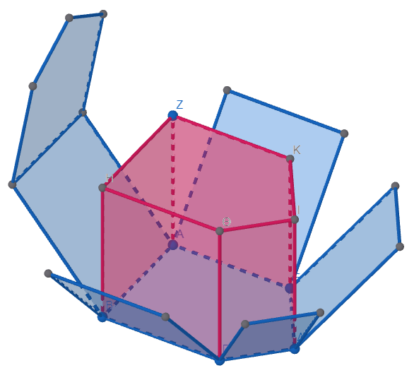
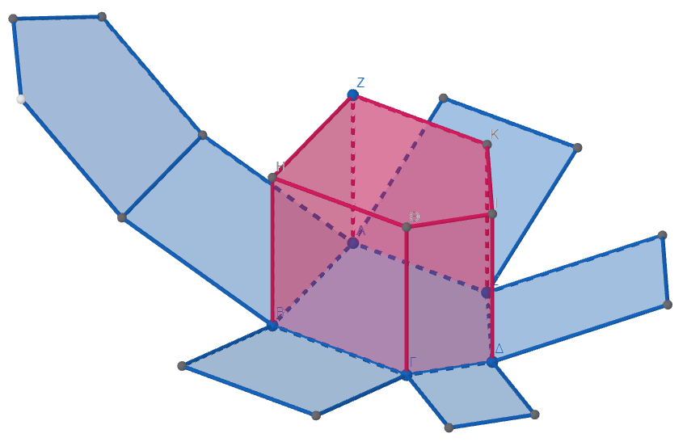
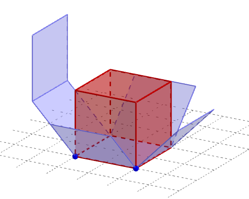
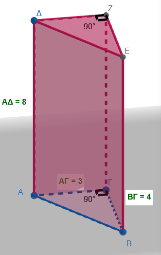
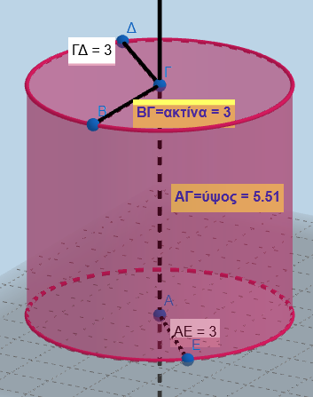
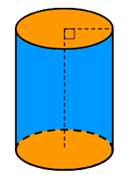
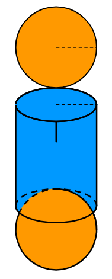
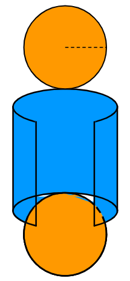
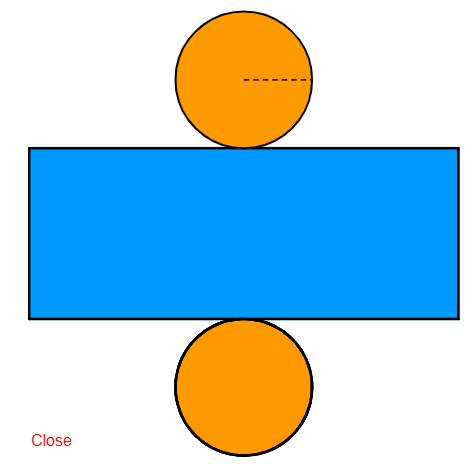

```{=html}
<!-- Φόρτωση βιβλιοθήκης GeoGebra -->
<script src="https://www.geogebra.org/apps/deployggb.js"></script>

<!-- Συνάρτηση δημιουργίας applets -->
<script>
function createGeoGebra(containerId, materialId, width = 700, height = 500) {
  var params = {
    "id": "ggb-" + containerId,
    "material_id": materialId,
    "width": width,
    "height": height,
    "showToolBar": true,
    "showMenuBar": false,
    "showAlgebraInput": true
  };
  
  var applet = new GGBApplet(params, '5.2');
  applet.inject(containerId);
}
</script>
```

## Ορθό Πρίσμα

{width="341"}

{width="488"}

::: {style="background-color: #E7CEF0; border: 2px solid #2f3e50; color: #25188a; padding: 15px; border-radius: 5px;"}
**Τι είναι:** Είναι ένα στερεό σώμα με δύο βάσεις που είναι ίσα πολύγωνα και παράλληλα μεταξύ τους.
Οι παράπλευρες (πλαϊνές) έδρες του είναι πάντα ορθογώνια παραλληλόγραμμα.

**Βασικοί Τύποι:**

\* **Παράπλευρο Εμβαδόν (**$E_π$): Το γινόμενο της περιμέτρου της βάσης επί το ύψος.

\* *Τύπος:* $E_π = \text{Περίμετρος βάσης} \cdot \upsilon$.

\* **Ολικό Εμβαδόν (**$E_{ολ}$): Το άθροισμα του παράπλευρου εμβαδού και των εμβαδών των δύο βάσεων.

\* *Τύπος:* $E_{ολ} = E_π + 2E_β$.

\* **Όγκος (**$V$): Το γινόμενο του εμβαδού της βάσης επί το ύψος.

\* *Τύπος:* $V = E_β \cdot \upsilon$.
:::

**Ειδικά για τον κύβο ακμής α:**

{width="294"}

**Επιφάνεια**: Ο κύβος αποτελείται από 6 τετράγωνα πλευράς α, άρα το $Ε_{κύβου}=6α^2$

**Όγκος**: Το εμβαδόν της βάσης είναι $α^2$ και το ύψος α , άρα $V=α^3$

**Παράδειγμα για πρίσμα:** Έστω ένα τριγωνικό πρίσμα με ύψος $\upsilon = 8\text{ cm}$ και βάση ορθογώνιο τρίγωνο με κάθετες πλευρές $3\text{ cm}$ και $4\text{ cm}$.\

\
{width="197"}

1\.
**Βάση:** Η υποτείνουσα της βάσης είναι $5\text{ cm}$.
Η περίμετρος είναι $3+4+5 = 12\text{ cm}$ και το εμβαδό βάσης $E_β = \frac{3 \cdot 4}{2} = 6\text{ cm}^2$.

2\.
**Εμβαδόν:** $E_π = 12 \cdot 8 = 96\text{ cm}^2$.
Το $E_{ολ} = 96 + 2 \cdot 6 = 108\text{ cm}^2$.

3\.
**Όγκος:** $V = 6 \cdot 8 = 48\text{ cm}^3$.

------------------------------------------------------------------------

## Κύλινδρος

|  |  |
|-----------------------------------------|-------------------------------|
| {width="158"} | {width="156"} |
| {width="147"} | {width="147"} |
| {width="162"} | {width="361"} |

::: {style="background-color: #E7CEF0; border: 2px solid #2f3e50; color: #25188a; padding: 15px; border-radius: 5px;"}
**Τι είναι:** Αποτελείται από δύο ίσους και παράλληλους κυκλικούς δίσκους (βάσεις) και μια παράπλευρη επιφάνεια που, αν την «ξετυλίξουμε», έχει σχήμα ορθογωνίου.

**Βασικοί Τύποι:**

\* **Παράπλευρο Εμβαδόν (**$E_π$): Η περίμετρος της βάσης ($2\pi\rho$) επί το ύψος ($\upsilon$).

\* *Τύπος:* $E_π = 2\pi\rho \cdot \upsilon$.

\* **Ολικό Εμβαδόν (**$E_{ολ}$): Το παράπλευρο εμβαδόν συν τα εμβαδά των δύο κυκλικών βάσεων.

\* *Τύπος:* $E_{ολ} = 2\pi\rho\upsilon + 2\pi\rho^2$.

\* **Όγκος (**$V$): Το εμβαδό της κυκλικής βάσης ($\pi\rho^2$) επί το ύψος ($\upsilon$).

\* *Τύπος:* $V = \pi\rho^2 \cdot \upsilon$.
:::

**Παράδειγμα:** Ένας κύλινδρος έχει ακτίνα βάσης $\rho = 4\text{ cm}$ και ύψος $\upsilon = 12\text{ cm}$.

1\.
**Εμβαδόν:** $E_π = 2\pi \cdot 4 \cdot 12 = 96\pi \text{ cm}^2$.
Το εμβαδό των δύο βάσεων είναι $2 \cdot (\pi \cdot 4^2) = 32\pi \text{ cm}^2$.
Άρα $E_{ολ} = 96\pi + 32\pi = 128\pi \text{ cm}^2$.

2\.
**Όγκος:** $V = \pi \cdot 4^2 \cdot 12 = \pi \cdot 16 \cdot 12 = 192\pi \text{ cm}^3$.

\

### Πως προκύπτουν οι τύποι (μια απλή διαισθητική ερμηνεία)

Ο τύπος του όγκου ($V = E_β \cdot \upsilon$) προκύπτει από το γινόμενο του εμβαδού της βάσης επί το ύψος του στερεού.
Γεωμετρικά, μπορείς να το φανταστείς ως την «εξώθηση» (extrusion) της βάσης προς τα πάνω κατά το μήκος του ύψους.

Ουσιαστικά, πολλαπλασιάζοντας την επιφάνεια της βάσης με το ύψος, υπολογίζεις συνολικά τον τρισδιάστατο χώρο που καταλαμβάνει το σώμα.
Είναι σαν να «**στοιβάζεις**» την ίδια επιφάνεια βάσης τόσες φορές όσες ορίζει το ύψος του σχήματος.
Για παράδειγμα:

- Στο **πρίσμα**, αν η βάση είναι ένα πολύγωνο με εμβαδό $E_β$, ο όγκος γεμίζει όλο τον χώρο ανάμεσα στις δύο βάσεις.
- Στον **κύλινδρο**, η βάση είναι κυκλικός δίσκος ($\pi\rho^2$), οπότε ο όγκος είναι $\pi\rho^2 \cdot \upsilon$.

### Ασκήσεις

1.  Να συμπληρώσετε τον παρακάτω πίνακα

```{=html}

<style type="text/css">
.tg  {border-collapse:collapse;border-color:#aabcfe;border-spacing:0;}
.tg td{background-color:#e8edff;border-color:#aabcfe;border-style:solid;border-width:1px;color:#669;
  font-family:Arial, sans-serif;font-size:14px;overflow:hidden;padding:10px 5px;word-break:normal;}
.tg th{background-color:#b9c9fe;border-color:#aabcfe;border-style:solid;border-width:1px;color:#039;
  font-family:Arial, sans-serif;font-size:14px;font-weight:normal;overflow:hidden;padding:10px 5px;word-break:normal;}
.tg .tg-x6vl{border-color:inherit;color:#663234;font-weight:bold;text-align:left;vertical-align:top}
.tg .tg-c3ow{border-color:inherit;text-align:center;vertical-align:top}
.tg .tg-g5dp{background-color:#fe996b;border-color:inherit;color:#3531ff;font-weight:bold;text-align:center;vertical-align:top}
.tg .tg-ssv0{border-color:inherit;color:#009901;font-weight:bold;text-align:center;vertical-align:top}
.tg .tg-ssmn{background-color:#D2E4FC;border-color:inherit;color:#663234;font-weight:bold;text-align:left;vertical-align:top}
.tg .tg-svo0{background-color:#D2E4FC;border-color:inherit;text-align:center;vertical-align:top}
</style>
<table class="tg"><thead>
  <tr>
    <th class="tg-g5dp">Σχήμα</th>
    <th class="tg-ssv0">Εμβαδόν βάσεων</th>
    <th class="tg-ssv0">Εμβαδόν παράπλευρης<br>Επιφάνειας</th>
    <th class="tg-ssv0">Εμβαδόν ολικής<br>επιφάνειας</th>
    <th class="tg-ssv0">Όγκος</th>
  </tr></thead>
<tbody>
  <tr>
    <td class="tg-ssmn">Πρίσμα με βάση τετράγωνο πλευράς 4 cm και ύψος 5 cm</td>
    <td class="tg-svo0"></td>
    <td class="tg-svo0"></td>
    <td class="tg-svo0"></td>
    <td class="tg-svo0"></td>
  </tr>
  <tr>
    <td class="tg-x6vl">Πρίσμα με βάση ισόπλευρο τρίγωνο πλευράς 6 cm και ύψος 8 cm</td>
    <td class="tg-c3ow"></td>
    <td class="tg-c3ow"></td>
    <td class="tg-c3ow"></td>
    <td class="tg-c3ow"></td>
  </tr>
  <tr>
    <td class="tg-ssmn">Πρίσμα με βάση κανονικό εξάγωνο πλευράς 5 cm και ύψος 10 cm</td>
    <td class="tg-svo0"></td>
    <td class="tg-svo0"></td>
    <td class="tg-svo0"></td>
    <td class="tg-svo0"></td>
  </tr>
  <tr>
    <td class="tg-x6vl">Κύλινδρος με ακτίνα βάσης 4 m και ύψος 10 m</td>
    <td class="tg-c3ow"></td>
    <td class="tg-c3ow"></td>
    <td class="tg-c3ow"></td>
    <td class="tg-c3ow"></td>
  </tr>
  <tr>
    <td class="tg-ssmn">Κύλινδρος με διάμετρο βάσης 6 cm και ύψος 8 cm</td>
    <td class="tg-svo0"></td>
    <td class="tg-svo0"></td>
    <td class="tg-svo0"></td>
    <td class="tg-svo0"></td>
  </tr>
  <tr>
    <td class="tg-x6vl">Κύλινδρος με περίμετρο βάσης 31,415 dm και ύψος 84 cm&nbsp;&nbsp;&nbsp;</td>
    <td class="tg-c3ow"></td>
    <td class="tg-c3ow"></td>
    <td class="tg-c3ow"></td>
    <td class="tg-c3ow"></td>
  </tr>
  <tr>
    <td class="tg-ssmn">Κύβος με ακμή 3,8 dm</td>
    <td class="tg-svo0"></td>
    <td class="tg-svo0"></td>
    <td class="tg-svo0"></td>
    <td class="tg-svo0"></td>
  </tr>
</tbody></table>
```

2.  **Τριγωνικό Πρίσμα:** Βρες το εμβαδόν παράπλευρης επιφάνειας πρίσματος με ύψος $10\text{ cm}$ και βάση ορθογώνιο τρίγωνο με κάθετες πλευρές $5\text{ cm}$ και $5\text{ cm}$ .

3.  **Ορθογώνιο Παραλληλεπίπεδο:** Υπολόγισε τον όγκο ενός δωματίου με διαστάσεις: πλάτος $4\text{ m}$, μήκος $5\text{ m}$ και ύψος $3\text{ m}$ .

4.  **Κύβος:** Αν η ακμή ενός κύβου είναι $7\text{ cm}$, να εκφράσεις το εμβαδό της έδρας του και τον όγκο του σε μορφή δύναμης .

5.  **Παράπλευρο Εμβαδόν:** Ένα πρίσμα έχει βάση τετράπλευρο με πλευρές $3, 4, 6$ και $5\text{ cm}$.
    Αν το ύψος του είναι $7\text{ cm}$, βρες το $E_π$ .

6.  **Ολικό Εμβαδόν:** Πρίσμα με ολικό του εμβαδόν $109,856\text{ cm}^2$ έχει βάσεις ισόπλευρα τρίγωνα πλευράς $4\text{ cm}$.
    Υπολόγισε το ύψος του .

7.  **Όγκος Πρίσματος:** Ορθό τριγωνικό πρίσμα έχει βάση ορθογώνιο τρίγωνο με κάθετες πλευρές $6\text{ cm}$ και $8\text{ cm}$.
    Αν ο όγκος του είναι $168\text{ cm}^3$, βρες το ύψος του .

8.  **Ακμή Κύβου από Εμβαδόν:** Το εμβαδόν της παράπλευρης επιφάνειας ενός κύβου είναι $144\text{ cm}^2$.
    Βρες τον όγκο του.

9.  **Υπολογισμός Ύψους:** Ένα ορθογώνιο παραλληλεπίπεδο έχει μήκος $4\text{ m}$, πλάτος $3\text{ m}$ και όγκο $120\text{ m}^3$.
    Πόσο είναι το ύψος του;

10. **Τετραγωνικό Πρίσμα:** Κανονικό τετραγωνικό πρίσμα έχει πλευρά βάσης $6\text{ cm}$ και ύψος $10\text{ cm}$.
    Βρες το $E_{ολ}$ και τον όγκο.

11. **Σύνθετη Βάση:** Ένα πρίσμα ύψους $5\text{ cm}$ έχει βάση πεντάγωνο που αποτελείται από ένα ορθογώνιο και ένα τραπέζιο.
    Αν το εμβαδόν της βάσης είναι $176\text{ cm}^2$ και η περίμετρος $56\text{ cm}$, βρες το ολικό εμβαδόν.

12. **Εμβαδόν Επιφάνειας:** Κύλινδρος έχει ακτίνα βάσης $\rho = 3\text{ cm}$ και ύψος $\upsilon = 5\text{ cm}$.
    Βρες το $E_π$ και το $E_{ολ}$ .

13. **Υπολογισμός με Διάμετρο:** Ένας κύλινδρος έχει διάμετρο βάσης $10\text{ cm}$ και ύψος $8\text{ cm}$.
    Βρες το εμβαδόν της παράπλευρης επιφάνειάς του .

14. **Δεξαμενή Καυσίμων:** Κλειστή κυλινδρική δεξαμενή έχει ύψος $20\text{ m}$ και ακτίνα $30\text{ m}$.
    Πόσα τετραγωνικά μέτρα λαμαρίνας χρειάστηκαν για την κατασκευή της;

15. **Όγκος Κυλίνδρου:** Ένας κύλινδρος έχει ακτίνα $4\text{ cm}$ και ύψος $12\text{ cm}$.
    Υπολόγισε τον όγκο του .

16. **Αντίστροφο Πρόβλημα:** Κύλινδρος έχει όγκο $90\pi\text{ cm}^3$ και ύψος $10\text{ cm}$.
    Βρες την ακτίνα της βάσης του.

17. **Κυρτή Επιφάνεια:** Το εμβαδόν της κυρτής επιφάνειας κυλίνδρου είναι $251,2\text{ cm}^2$ και η ακτίνα του $5\text{ cm}$.
    Βρες το ύψος του.

18. **Μονάδες Μέτρησης:** Κύλινδρος έχει εμβαδόν βάσης $100\text{ mm}^2$ και ύψος $0,2\text{ m}$.
    Υπολόγισε τον όγκο του σε $\text{mm}^3$.

19. **Περίμετρος Βάσης:** Κύλινδρος έχει περίμετρο βάσης $12\pi\text{ cm}$ και ύψος $10\text{ cm}$.
    Βρες το ολικό του εμβαδόν .

20. **Όγκος από Ύψος:** Αν ένας κύλινδρος έχει όγκο $175\pi\text{ m}^3$ και ύψος $7\text{ m}$, βρες την ακτίνα της βάσης του .

21. **Κύλινδρος μέσα σε Πρίσμα:** Ένας κύλινδρος είναι τοποθετημένος μέσα σε ένα τετραγωνικό πρίσμα με πλευρά βάσης $10\text{ cm}$ και ύψος $20\text{ cm}$, έτσι ώστε να εφάπτεται στις πλευρές (έδρες) του πρίσματος.
    Βρες τον όγκο που μένει κενός ανάμεσα στο πρίσμα και τον κύλινδρο .

22. **Μετασχηματισμός Στερεού:** Ένα στερεό αποτελείται από έναν κύλινδρο (ακτίνας 5 cm και ύψους 7 cm) που έχει στο εσωτερικό του ένα κενό σε σχήμα τετραγωνικού πρίσματος το οποίο εφάπτεται στο εσωτερικό του κυλίνδρου.
    Να υπολογίσετε τον όγκο του στερεού και την συνολική του επιφάνεια.
    *Προσοχή! Οι βάσεις του αποτεούνται από κυκλικούς δίσκους από τους οποίους έχουμε αφαιρέσει ένα τετράγωνο*

23. **Κύλινδρος πάνω σε Ορθογώνιο Πρίσμα** Ένα στερεό αποτελείται από:

- ορθογώνιο παραλληλεπίπεδο διαστάσεων $12 \text{ cm} \times 8 \text{ cm} \times 6 \text{ cm}$,

- και κύλινδρο τοποθετημένο πάνω του με:

  - ακτίνα (3) cm,
  - ύψος (8) cm.

Να υπολογίσετε:

         
- τον συνολικό όγκο του στερεού
- το συνολικό εξωτερικό εμβαδόν του στερεού


(να μην υπολογιστεί η κοινή επιφάνεια επαφής)

24. **Κυλινδρική Σήραγγα μέσα σε Πρίσμα** Ένα ορθογώνιο πρίσμα έχει:

- μήκος (20) cm,
- πλάτος (10) cm,
- ύψος (10) cm.

Μέσα του ανοίγεται κυλινδρική σήραγγα ακτίνας (3) cm που διαπερνά όλο το μήκος του πρίσματος.

Να υπολογίσετε:

         
- τον όγκο του αρχικού πρίσματος
- τον όγκο του κυλίνδρου που αφαιρέθηκε
- τον όγκο που απομένει


25. **Πύργος με Πρίσμα και Κύλινδρο** Ένα κτίριο αποτελείται από:

- τετραγωνικό πρίσμα βάσης πλευράς (10) m και ύψους (15) m,

- και κυλινδρικό πύργο στην οροφή με:

  - ακτίνα (4) m,
  - ύψος (6) m.

Να βρείτε:

         
- τον συνολικό όγκο του κτιρίου
- το συνολικό εξωτερικό εμβαδόν
- πόσα χρήματα θα δώσουμε για να το βάψουμε αν κάθε $m^2$ κοστίζει 0,8 € 


26. **Δοχείο Σύνθετου Σχήματος**  Ένα δοχείο αποτελείται από:

- κύλινδρο ακτίνας (5) cm και ύψους (12) cm,
- πάνω στον οποίο υπάρχει εξαγωνικό πρίσμα ύψους (8) cm.

Το εμβαδόν της εξαγωνικής βάσης είναι: $54\text{ cm}^2$

Να υπολογίσετε:

  - τον όγκο κάθε μέρους
  - τον συνολικό όγκο του δοχείου 
  - το συνολικό εμβαδόν των εξωτερικών επιφανειών

27. **Συνδυασμός με Κοινή Βάση**  Ένα στερεό αποτελείται από:

- κύλινδρο ύψους (10) cm και ακτίνας (4) cm,
- και ορθό πρίσμα ίδιου ύψους που έχει τετραγωνική βάση πλευράς (8) cm.

Τα δύο στερεά ενώνονται από τη βάση τους.

Να υπολογίσετε:

  - τον συνολικό όγκο 
  - το συνολικό εξωτερικό εμβαδόν 
  - ποιο μέρος καταλαμβάνει μεγαλύτερο όγκο και κατά πόσο

::: {.callout-tip style="color: brown;"}
## Ενέργεια
:::

::: {style="background-color: #E7CEF0; border: 2px solid #2f3e50; color: #25188a; padding: 15px; border-radius: 5px;"}
:::

::: {.callout-tip style="color: brown;"}
ΚΑΛΗ ΜΕΛΕΤΗ!
:::

\
\
