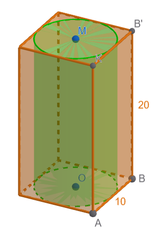

```{=html}
<!-- Φόρτωση βιβλιοθήκης GeoGebra -->
<script src="https://www.geogebra.org/apps/deployggb.js"></script>

<!-- Συνάρτηση δημιουργίας applets -->
<script>
function createGeoGebra(containerId, materialId, width = 700, height = 500) {
  var params = {
    "id": "ggb-" + containerId,
    "material_id": materialId,
    "width": width,
    "height": height,
    "showToolBar": true,
    "showMenuBar": false,
    "showAlgebraInput": true
  };
  
  var applet = new GGBApplet(params, '5.2');
  applet.inject(containerId);
}
</script>
```

## Όγκος πρίσματος και κυλίνδρου

### Η έννοια του όγκου

::: {style="background-color: #c682d9; border: 2px solid #2f3e50; color: #171426; padding: 15px; border-radius: 5px;"}
Ο όγκος ορίζεται ως η ποσότητα του χώρου που καταλαμβάνει ένα σώμα .
Στη φυσική, αποτελεί ένα παράγωγο μέγεθος που περιγράφει την τρισδιάστατη υπόσταση ενός αντικειμένου
:::

### Moνάδες μέτρησης όγκου

::: {style="background-color: #c682d9; border: 2px solid #2f3e50; color: #171426; padding: 15px; border-radius: 5px;"}
Στο Διεθνές Σύστημα Μονάδων (S.I.), η βασική μονάδα μέτρησης είναι το **κυβικό μέτρο (m³)**.

- **Μονάδες Όγκου και Χωρητικότητας:** Ο όγκος ενός κύβου ορίζεται ως το γινόμενο των τριών ακμών του (μήκος x μήκος x μήκος).
  Η βασική μονάδα μέτρησης στο Διεθνές Σύστημα (SI) είναι το **κυβικό μέτρο (**$m^3$).

  - *Σχέση μονάδων:* Κάθε μονάδα όγκου είναι **1.000 φορές μεγαλύτερη** από την αμέσως κατώτερη (π.χ. 1 m³ = 1.000 dm³).
  - **Σχέση με τη Χωρητικότητα:** Ο όγκος συνδέεται άμεσα με το λίτρο. Ισχύει ότι:
  - $1\text{ }dm^3 = 1\text{ λίτρο (L)}$.
  - $1\text{ }cm^3 = 1\text{ μιλιλίτρ (mL)}$.

- **Μετατροπές:** Κάθε μονάδα είναι 1.000 φορές μεγαλύτερη από την αμέσως μικρότερή της (σχέση $10^3$).\

- **Η «Σκάλα» των Μετατροπών:** Επειδή ο όγκος προκύπτει από τρεις διαστάσεις, η σχέση μεταξύ των μονάδων βασίζεται στον αριθμό **1.000** ($10 \times 10 \times 10$ ή $10^3$).

  - Για κάθε «σκαλοπάτι» που **κατεβαίνουμε** (από μεγαλύτερη σε μικρότερη μονάδα), **πολλαπλασιάζουμε επί 1.000**.
  - Για κάθε «σκαλοπάτι» που **ανεβαίνουμε** (από μικρότερη σε μεγαλύτερη μονάδα), **διαιρούμε με το 1.000**.

- **Παράδειγμα:**

- Μετατροπή $4,97\text{ }mm^3$ σε $dm^3$: $4,97 : 1.000.000 = 4,97 \times 10^{-6}\text{ }dm^3$.

```{dot}
//| fig-width: 7
//| fig-height: 3
//| out-width: 100%

digraph G {
  rankdir=LR;
  //layout=neato;
  size="7,3!";
  ratio=fill;
  pad=0.1;

  // Ρυθμίσεις Κόμβων: Χρώμα γεμίσματος και περίγραμμα
  node [shape=circle, 
        style=filled, 
        fillcolor="#E1F5FE", // Απαλό μπλε
        color="#01579B",     // Σκούρο μπλε περίγραμμα
        penwidth=2,          // Πάχος περιγράμματος
        fontname="Helvetica-Bold", 
        width=0.3];

  // Ρυθμίσεις Γραμμών: Πάχος και χρώμα
  edge [fontname="Helvetica-Bold", 
        fontsize=11,
        color="#424242",     // Σκούρο γκρι για τις γραμμές
        penwidth=1.5,        // Πάχος γραμμής
        len=1.5];

  // Σύνδεση Κόμβων
  // Ορίζουμε τον "δύσκολο" κόμβο με ένα απλό όνομα (π.χ. m2)
  
  
  m3 [label=<m<sup>3</sup>>];
  dm3 [label=<dm<sup>3</sup>=L>];
  cm3 [label=<cm<sup>3</sup>=mL>];
  mm3 [label=<mm<sup>3</sup>>];
  
  
  
  m3 -> dm3 [label="x 1000"];
  dm3 -> cm3 [label="x 1000"];
  cm3 -> mm3 [label="x 1000"];
  
 
  mm3 -> cm3 [label=": 1000"];
  cm3 -> dm3 [label=": 1000"];
  dm3 -> m3 [label=": 1000"];
  
  
  // Παράδειγμα έμφασης σε έναν συγκεκριμένο κόμβο (π.χ. ο Α)
  m3 [fillcolor="#FFE082", color="#FFA000"]; 
}

```
:::

------------------------------------------------------------------------

### Ορθό Πρίσμα

::: {style="background-color: #c682d9; border: 2px solid #2f3e50; color: #171426; padding: 15px; border-radius: 5px;"}
\* **Όγκος (**$V$): Το γινόμενο του εμβαδού της βάσης επί το ύψος.

\* *Τύπος:* $V = E_β \cdot \upsilon$.
:::

**Ειδικά για τον κύβο ακμής α:**

**Όγκος**: Το εμβαδόν της βάσης είναι $α^2$ και το ύψος α , άρα $V=α^3$

**Παράδειγμα για πρίσμα:** Έστω ένα τριγωνικό πρίσμα με ύψος $\upsilon = 8\text{ cm}$ και βάση ορθογώνιο τρίγωνο με κάθετες πλευρές $3\text{ cm}$ και $4\text{ cm}$.\

\
{width="197"}

**Όγκος:** $V = 6 \cdot 8 = 48\text{ cm}^3$.

------------------------------------------------------------------------

### Κύλινδρος

::: {style="background-color: #c682d9; border: 2px solid #2f3e50; color: #171426; padding: 15px; border-radius: 5px;"}
\* **Όγκος (**$V$): Το εμβαδό της κυκλικής βάσης ($\pi\rho^2$) επί το ύψος ($\upsilon$).

\* *Τύπος:* $V = \pi\rho^2 \cdot \upsilon$.
:::

**Παράδειγμα:** Ένας κύλινδρος έχει ακτίνα βάσης $\rho = 4\text{ cm}$ και ύψος $\upsilon = 12\text{ cm}$.

**Όγκος:** $V = \pi \cdot 4^2 \cdot 12 = \pi \cdot 16 \cdot 12 = 192\pi \text{ cm}^3$.

\

### Πως προκύπτουν οι τύποι (μια απλή διαισθητική ερμηνεία)

Ο τύπος του όγκου ($V = E_β \cdot \upsilon$) προκύπτει από το γινόμενο του εμβαδού της βάσης επί το ύψος του στερεού.
Γεωμετρικά, μπορείς να το φανταστείς ως την «εξώθηση» (extrusion) της βάσης προς τα πάνω κατά το μήκος του ύψους.

Ουσιαστικά, πολλαπλασιάζοντας την επιφάνεια της βάσης με το ύψος, υπολογίζεις συνολικά τον τρισδιάστατο χώρο που καταλαμβάνει το σώμα.
Είναι σαν να «**στοιβάζεις**» την ίδια επιφάνεια βάσης τόσες φορές όσες ορίζει το ύψος του σχήματος.
Για παράδειγμα:

- Στο **πρίσμα**, αν η βάση είναι ένα πολύγωνο με εμβαδό $E_β$, ο όγκος γεμίζει όλο τον χώρο ανάμεσα στις δύο βάσεις.
- Στον **κύλινδρο**, η βάση είναι κυκλικός δίσκος ($\pi\rho^2$), οπότε ο όγκος είναι $\pi\rho^2 \cdot \upsilon$.

### Ασκήσεις

1.  Να συμπληρώσετε τον παρακάτω πίνακα

```{=html}

<style type="text/css">
.tg  {border-collapse:collapse;border-color:#aabcfe;border-spacing:0;}
.tg td{background-color:#e8edff;border-color:#aabcfe;border-style:solid;border-width:1px;color:#669;
  font-family:Arial, sans-serif;font-size:14px;overflow:hidden;padding:10px 5px;word-break:normal;}
.tg th{background-color:#b9c9fe;border-color:#aabcfe;border-style:solid;border-width:1px;color:#039;
  font-family:Arial, sans-serif;font-size:14px;font-weight:normal;overflow:hidden;padding:10px 5px;word-break:normal;}
.tg .tg-x6vl{border-color:inherit;color:#663234;font-weight:bold;text-align:left;vertical-align:top}
.tg .tg-c3ow{border-color:inherit;text-align:center;vertical-align:top}
.tg .tg-g5dp{background-color:#fe996b;border-color:inherit;color:#3531ff;font-weight:bold;text-align:center;vertical-align:top}
.tg .tg-ssv0{border-color:inherit;color:#009901;font-weight:bold;text-align:center;vertical-align:top}
.tg .tg-ssmn{background-color:#D2E4FC;border-color:inherit;color:#663234;font-weight:bold;text-align:left;vertical-align:top}
.tg .tg-svo0{background-color:#D2E4FC;border-color:inherit;text-align:center;vertical-align:top}
</style>
<table class="tg"><thead>
  <tr>
    <th class="tg-g5dp">Σχήμα</th>
    <th class="tg-ssv0">Εμβαδόν βάσεων</th>
    <th class="tg-ssv0">Εμβαδόν παράπλευρης<br>Επιφάνειας</th>
    <th class="tg-ssv0">Εμβαδόν ολικής<br>επιφάνειας</th>
    <th class="tg-ssv0">Όγκος</th>
  </tr></thead>
<tbody>
  <tr>
    <td class="tg-ssmn">Πρίσμα με βάση τετράγωνο πλευράς 4 cm και ύψος 5 cm</td>
    <td class="tg-svo0"></td>
    <td class="tg-svo0"></td>
    <td class="tg-svo0"></td>
    <td class="tg-svo0"></td>
  </tr>
  <tr>
    <td class="tg-x6vl">Πρίσμα με βάση ισόπλευρο τρίγωνο πλευράς 6 cm και ύψος 8 cm</td>
    <td class="tg-c3ow"></td>
    <td class="tg-c3ow"></td>
    <td class="tg-c3ow"></td>
    <td class="tg-c3ow"></td>
  </tr>
  <tr>
    <td class="tg-ssmn">Πρίσμα με βάση κανονικό εξάγωνο πλευράς 5 cm και ύψος 10 cm</td>
    <td class="tg-svo0"></td>
    <td class="tg-svo0"></td>
    <td class="tg-svo0"></td>
    <td class="tg-svo0"></td>
  </tr>
  <tr>
    <td class="tg-x6vl">Κύλινδρος με ακτίνα βάσης 4 m και ύψος 10 m</td>
    <td class="tg-c3ow"></td>
    <td class="tg-c3ow"></td>
    <td class="tg-c3ow"></td>
    <td class="tg-c3ow"></td>
  </tr>
  <tr>
    <td class="tg-ssmn">Κύλινδρος με διάμετρο βάσης 6 cm και ύψος 8 cm</td>
    <td class="tg-svo0"></td>
    <td class="tg-svo0"></td>
    <td class="tg-svo0"></td>
    <td class="tg-svo0"></td>
  </tr>
  <tr>
    <td class="tg-x6vl">Κύλινδρος με περίμετρο βάσης 31,415 dm και ύψος 84 cm&nbsp;&nbsp;&nbsp;</td>
    <td class="tg-c3ow"></td>
    <td class="tg-c3ow"></td>
    <td class="tg-c3ow"></td>
    <td class="tg-c3ow"></td>
  </tr>
  <tr>
    <td class="tg-ssmn">Κύβος με ακμή 3,8 dm</td>
    <td class="tg-svo0"></td>
    <td class="tg-svo0"></td>
    <td class="tg-svo0"></td>
    <td class="tg-svo0"></td>
  </tr>
</tbody></table>
```

2.  **Ορθογώνιο Παραλληλεπίπεδο:** Υπολόγισε τον όγκο ενός δωματίου με διαστάσεις: πλάτος $4\text{ m}$, μήκος $5\text{ m}$ και ύψος $3\text{ m}$ .

3.  **Κύβος:** Αν η ακμή ενός κύβου είναι $7\text{ cm}$, να εκφράσεις το εμβαδό της έδρας του και τον όγκο του σε μορφή δύναμης .

4.  **Όγκος Πρίσματος:** Ορθό τριγωνικό πρίσμα έχει βάση ορθογώνιο τρίγωνο με κάθετες πλευρές $6\text{ cm}$ και $8\text{ cm}$.
    Αν ο όγκος του είναι $168\text{ cm}^3$, βρες το ύψος του .

5.  **Ακμή Κύβου από Εμβαδόν:** Το εμβαδόν της παράπλευρης επιφάνειας ενός κύβου είναι $144\text{ cm}^2$.
    Βρες τον όγκο του.

6.  **Υπολογισμός Ύψους:** Ένα ορθογώνιο παραλληλεπίπεδο έχει μήκος $4\text{ m}$, πλάτος $3\text{ m}$ και όγκο $120\text{ m}^3$.
    Πόσο είναι το ύψος του;

7.  **Τετραγωνικό Πρίσμα:** Κανονικό τετραγωνικό πρίσμα έχει πλευρά βάσης $6\text{ cm}$ και ύψος $10\text{ cm}$.
    Βρες το $E_{ολ}$ και τον όγκο.

8.  **Όγκος Κυλίνδρου:** Ένας κύλινδρος έχει ακτίνα $4\text{ cm}$ και ύψος $12\text{ cm}$.
    Υπολόγισε τον όγκο του .

9.  **Αντίστροφο Πρόβλημα:** Κύλινδρος έχει όγκο $90\pi\text{ cm}^3$ και ύψος $10\text{ cm}$.
    Βρες την ακτίνα της βάσης του.

10. **Μονάδες Μέτρησης:** Κύλινδρος έχει εμβαδόν βάσης $100\text{ mm}^2$ και ύψος $0,2\text{ m}$.
    Υπολόγισε τον όγκο του σε $\text{mm}^3$.

11. **Όγκος από Ύψος:** Αν ένας κύλινδρος έχει όγκο $175\pi\text{ m}^3$ και ύψος $7\text{ m}$, βρες την ακτίνα της βάσης του .

12. **Κύλινδρος μέσα σε Πρίσμα:** Ένας κύλινδρος είναι τοποθετημένος μέσα σε ένα τετραγωνικό πρίσμα με πλευρά βάσης $10\text{ cm}$ και ύψος $20\text{ cm}$, έτσι ώστε να εφάπτεται στις πλευρές (έδρες) του πρίσματος.
    Βρες τον όγκο που μένει κενός ανάμεσα στο πρίσμα και τον κύλινδρο .\
    {width="250"}

13. **Μετασχηματισμός Στερεού:** Ένα στερεό αποτελείται από έναν κύλινδρο (ακτίνας 5 cm και ύψους 7 cm) που **έχει στο εσωτερικό του ένα κενό** σε σχήμα τετραγωνικού πρίσματος το οποίο εφάπτεται στο εσωτερικό του κυλίνδρου.
    Να υπολογίσετε τον όγκο του στερεού και την συνολική του επιφάνεια.\

::: {.callout-caution style="color: brown;"}
*Προσοχή! Οι βάσεις του αποτελούνται από κυκλικούς δίσκους από τους οποίους έχουμε αφαιρέσει ένα τετράγωνο*
:::

\
{width="219"}

14. **Κύλινδρος πάνω σε Ορθογώνιο Πρίσμα** Ένα στερεό αποτελείται από:

- ορθογώνιο παραλληλεπίπεδο διαστάσεων $12 \text{ cm} \times 8 \text{ cm} \times 6 \text{ cm}$,

- και κύλινδρο τοποθετημένο πάνω του με:

  - ακτίνα (3) cm,
  - ύψος (8) cm.

Να υπολογίσετε:

- τον συνολικό όγκο του στερεού
- το συνολικό εξωτερικό εμβαδόν του στερεού

::: {.callout-caution style="color: brown;"}
Στην κοινή επιφάνεια επαφής
:::

\
\
{width="270"}

15. **Κυλινδρική Σήραγγα μέσα σε Πρίσμα** Ένα ορθογώνιο πρίσμα έχει:

- μήκος (20) cm,
- πλάτος (10) cm,
- ύψος (10) cm.

Μέσα του ανοίγεται κυλινδρική σήραγγα ακτίνας (3) cm που διαπερνά όλο το μήκος του πρίσματος.

Να υπολογίσετε:

- τον όγκο του αρχικού πρίσματος
- τον όγκο του κυλίνδρου που αφαιρέθηκε
- τον όγκο που απομένει\
  

16. **Πύργος με Πρίσμα και Κύλινδρο** Ένα κτίριο αποτελείται από:

- τετραγωνικό πρίσμα βάσης πλευράς (10) m και ύψους (15) m,

- και κυλινδρικό πύργο στην οροφή με:

  - ακτίνα (4) m,
  - ύψος (6) m.

Να βρείτε:

- τον συνολικό όγκο του κτιρίου

- το συνολικό εξωτερικό εμβαδόν

- πόσα χρήματα θα δώσουμε για να το βάψουμε αν κάθε $m^2$ κοστίζει 0,8 €\
  \
  {width="248"}\

::: {.callout-caution style="color: brown;"}
Στην κοινή επιφάνεια επαφής.
:::

17.  **Δοχείο Σύνθετου Σχήματος** Ένα δοχείο αποτελείται από:

- κύλινδρο ακτίνας (5) cm και ύψους (12) cm,

- πάνω στον οποίο υπάρχει εξαγωνικό πρίσμα ύψους (8) cm.

Το εμβαδόν της εξαγωνικής βάσης είναι: $54\text{ cm}^2$

Να υπολογίσετε:

- τον όγκο κάθε μέρους

- τον συνολικό όγκο του δοχείου

- το συνολικό εμβαδόν των εξωτερικών επιφανειών\
  \

::: {.callout-caution style="color: brown;"}
Προσοχή στην κοινή επιφάνεια.

Ποιο μέρος συμμετέχει στον υπολογισμό της συνολικής επιφάνειας;
:::


18. **Συνδυασμός με Κοινή Βάση** Ένα στερεό αποτελείται από:

- κύλινδρο ύψους (10) cm και ακτίνας (4) cm,
- και ορθό πρίσμα ίδιου ύψους που έχει τετραγωνική βάση με διαγώνιο (8) cm.

Τα δύο στερεά ενώνονται από τη βάση τους.\

\

::: {.callout-note style="color: brown;"}
Το σχήμα είναι παρόμοιο με αυτό της προηγούμενης άσκησης

Η διαγώνιος του τετραγώνου της βάσης είναι 8 cm
:::

- τον συνολικό όγκο
- το συνολικό εξωτερικό εμβαδόν
- ποιο μέρος καταλαμβάνει μεγαλύτερο όγκο και κατά πόσο

::: {.callout-tip style="color: brown;"}
ΚΑΛΗ ΜΕΛΕΤΗ!
:::

\
\
