```{=html}
<!-- Φόρτωση βιβλιοθήκης GeoGebra -->
<script src="https://www.geogebra.org/apps/deployggb.js"></script>

<!-- Συνάρτηση δημιουργίας applets -->
<script>
function createGeoGebra(containerId, materialId, width = 700, height = 500) {
  var params = {
    "id": "ggb-" + containerId,
    "material_id": materialId,
    "width": width,
    "height": height,
    "showToolBar": true,
    "showMenuBar": false,
    "showAlgebraInput": true
  };
  
  var applet = new GGBApplet(params, '5.2');
  applet.inject(containerId);
}
</script>
```

## Πυραμίδα

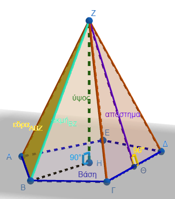{width="238"}

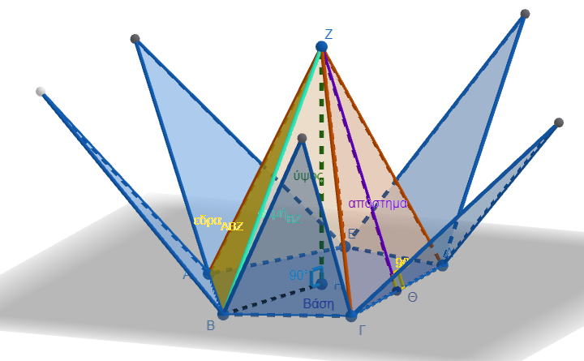{width="453"}

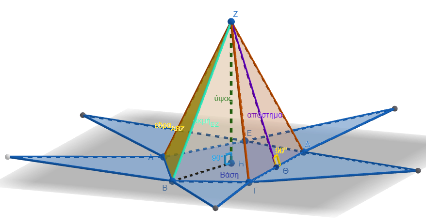{width="512"}

::: {style="background-color: #E7CEF0; border: 2px solid #2f3e50; color: #25188a; padding: 15px; border-radius: 5px;"}
Η πυραμίδα είναι ένα από τα πιο εμβληματικά γεωμετρικά στερεά, με εφαρμογές που ξεκινούν από την αρχαία αρχιτεκτονική και φτάνουν μέχρι τη σύγχρονη στερεομετρία.

### Ορισμός και Δομικά Στοιχεία

Πυραμίδα ονομάζεται το γεωμετρικό στερεό που έχει μία έδρα ως πολύγωνο (βάση) και όλες τις άλλες έδρες του ως τρίγωνα με κοινή κορυφή.
Τα βασικά στοιχεία που προσδιορίζουν μια πυραμίδα είναι:

\* **Βάση:** Το πολύγωνο που ορίζει το κάτω μέρος του στερεού.

\* **Κορυφή:** Το κοινό σημείο όπου συναντώνται όλες οι παράπλευρες τριγωνικές έδρες.

\* **Παράπλευρες Έδρες:** Τα τρίγωνα που περιβάλλουν το στερεό και έχουν κοινή κορυφή.

\* **Παράπλευρες Ακμές:** Τα ευθύγραμμα τμήματα που συνδέουν την κορυφή της πυραμίδας με τις κορυφές της βάσης.

\* **Ύψος :** $\upsilon$.
Η κάθετη απόσταση από την κορυφή προς το επίπεδο της βάσης.

\* **Απόστημα :** $\alpha$.
Το ύψος των παράπλευρων εδρών, το οποίο συναντάμε κυρίως στις κανονικές πυραμίδες.

### Κανονική Πυραμίδα και Τετράεδρο

Μια πυραμίδα χαρακτηρίζεται ως **κανονική** όταν η βάση της είναι κανονικό πολύγωνο (π.χ. τετράγωνο ή ισόπλευρο τρίγωνο) και η προβολή της κορυφής της πέφτει ακριβώς στο κέντρο της βάσης.
Στην περίπτωση αυτή, οι παράπλευρες έδρες είναι ίσα μεταξύ τους ισοσκελή τρίγωνα.

Το **τετράεδρο** είναι μια ειδική μορφή πυραμίδας που έχει ως βάση ένα τρίγωνο.
*Όταν όλες οι ακμές του είναι ίσες, ονομάζεται **κανονικό τετράεδρο** και αποτελείται από τέσσερα ίσα ισόπλευρα τρίγωνα, όπου οποιαδήποτε έδρα μπορεί να θεωρηθεί βάση*.

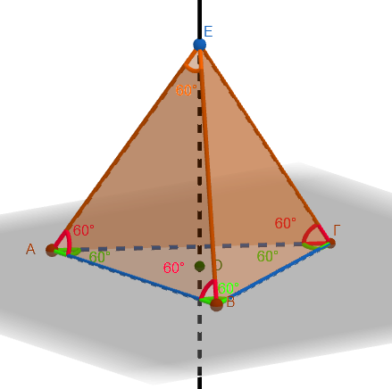{width="249"}

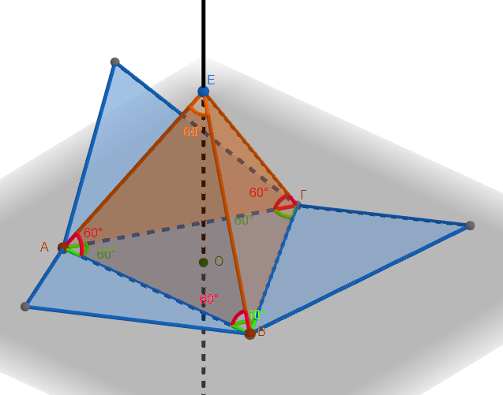{width="370"}

### Υπολογισμός Εμβαδού και Όγκου

Για τον υπολογισμό των μεγεθών μιας πυραμίδας χρησιμοποιούμε τους παρακάτω τύπους:

1.  **Εμβαδόν Παράπλευρης Επιφάνειας :** $E_π$. Για τις κανονικές πυραμίδες, ισούται με το μισό του γινομένου της περιμέτρου της βάσης επί το απόστημα $E_π = \dfrac{1}{2} \cdot Π_β \cdot \alpha$.
2.  **Εμβαδόν Ολικής Επιφάνειας :** $E_{ολ}$. Είναι το άθροισμα του εμβαδού της βάσης και της παράπλευρης επιφάνειας $E_{ολ} = E_β + E_π$).
3.  **Όγκος :** $V$. Ο όγκος κάθε πυραμίδας είναι ίσος με το ένα τρίτο του γινομένου του εμβαδού της βάσης επί το ύψος της $V = \dfrac{1}{3} \cdot E_β \cdot \upsilon$. Είναι σημαντικό να σημειωθεί ότι ο όγκος της πυραμίδας αντιστοιχεί στο $\dfrac{1}{3}$ του όγκου ενός πρίσματος με την ίδια βάση και το ίδιο ύψος.
:::

### Πως προκύπτει ο τύπος του όγκου

Ο τύπος του όγκου της πυραμίδας είναι $V = \frac{1}{3} \cdot E_{\beta} \cdot \upsilon$, όπου $E_{\beta}$ είναι το εμβαδόν της βάσης και $\upsilon$ το ύψος της.

Η εξήγηση του παράγοντα $\frac{1}{3}$ βασίζεται στη σύγκριση της πυραμίδας με ένα πρίσμα που έχει την ίδια βάση και το ίδιο ύψος:

- **Η Σχέση 1/3:** Αποδεικνύεται ότι ο όγκος της πυραμίδας αντιστοιχεί ακριβώς στο ένα τρίτο του όγκου του αντίστοιχου πρίσματος.
- **Πειραματική Επαλήθευση:** Αν γεμίσουμε μια πυραμίδα τρεις φορές με ένα υλικό (όπως αλεύρι ή νερό) και αδειάσουμε το περιεχόμενο σε ένα πρίσμα με την ίδια βάση και ύψος, το πρίσμα θα γεμίσει πλήρως.
- **Γεωμετρική Κατάτμηση:** Ένας κύβος ή ένα ορθογώνιο παραλληλεπίπεδο μπορεί να χωριστεί σε τρεις πυραμίδες που έχουν τον ίδιο όγκο.

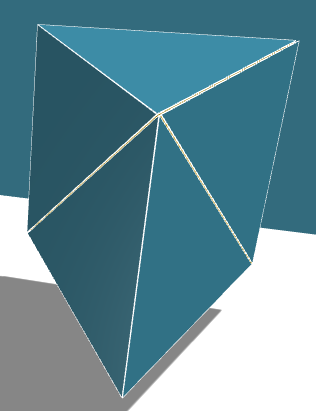{width="190"}

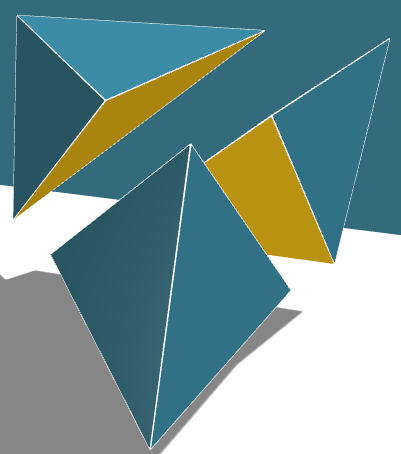{width="237"}

Μια σημαντική λεπτομέρεια που πρέπει να προσέχετε είναι ότι για τον υπολογισμό του όγκου χρησιμοποιούμε πάντα το **κάθετο ύψος** ($\upsilon$) της πυραμίδας και όχι το απόστημα ($\alpha$), το οποίο χρησιμοποιείται μόνο για το εμβαδόν της επιφάνειας.

### Παραδείγματα Υπολογισμών

- **Πυραμίδα του Χέοπα:** Με τετράγωνη βάση πλευράς 233m και ύψος 146m, ο όγκος $V=\dfrac{1}{3}\cdot E_β \cdot υ=\dfrac{1}{3} \cdot 233^2 \cdot 146$ υπολογίζεται περίπου στα $2.642.064,6 \text{ m}^3$.
- **Κανονική Τετραγωνική Πυραμίδα:** Αν μια πυραμίδα έχει βάση τετράγωνο με πλευρά 8 cm και ύψος 12 cm, ο όγκος της είναι $V = \dfrac{1}{3} \cdot 8^2 \cdot 12 = 256 \text{ cm}^3$.
- **Χρήση Πυθαγορείου:** Σε μια κανονική τετραγωνική πυραμίδα με απόστημα 10 cm και πλευρά βάσης 16 cm, μπορούμε να βρούμε το ύψος της χρησιμοποιώντας το Πυθαγόρειο θεώρημα $\upsilon^2 = 10^2 - 8^2 = 36$, άρα το ύψος είναι 6 cm.

------------------------------------------------------------------------

## Κώνος

|                                      |                                      |
|------------------------------------|------------------------------------|
| 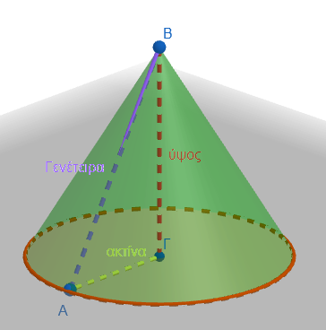  |                                      |
| 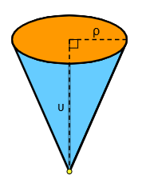  | 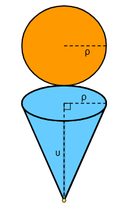 |
| 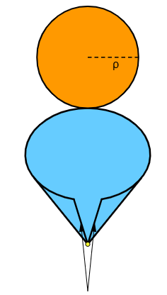 | 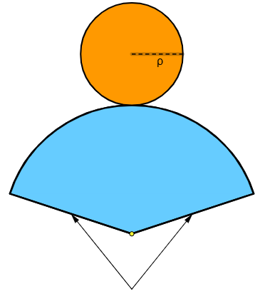 |

: Ο κώνος και το ανάπτυγμά του

::: {style="background-color: #E7CEF0; border: 2px solid #2f3e50; color: #25188a; padding: 15px; border-radius: 5px;"}
Ο κώνος ορίζεται γεωμετρικά ως το στερεό που παράγεται από την περιστροφή ενός ορθογωνίου τριγώνου γύρω από μία από τις κάθετες πλευρές του.

### Τα Στοιχεία του Κώνου

Για να περιγράψουμε έναν κώνο, χρησιμοποιούμε τα εξής βασικά στοιχεία:

\* **Βάση:** Είναι ένας κυκλικός δίσκος.

\* **Κορυφή:** Το σημείο που βρίσκεται εκτός του επιπέδου της βάσης και όπου καταλήγουν όλες οι ακτίνες από την περιφέρεια.

\* **Ύψος (**$\upsilon$): Το κάθετο ευθύγραμμο τμήμα που συνδέει την κορυφή με το κέντρο της βάσης.

\* **Ακτίνα (**$\rho$): Η ακτίνα του κύκλου της βάσης.

\* **Γενέτειρα (**$\lambda$): Το ευθύγραμμο τμήμα που συνδέει την κορυφή με οποιοδήποτε σημείο της περιφέρειας της βάσης.

Επειδή το ύψος, η ακτίνα και η γενέτειρα σχηματίζουν ορθογώνιο τρίγωνο, ισχύει πάντα η πυθαγόρεια σχέση $\lambda^2 = \upsilon^2 + \rho^2$.

### Υπολογισμός Εμβαδού

Το εμβαδό της επιφάνειας ενός κώνου χωρίζεται σε δύο μέρη:

1\.
**Εμβαδόν Παράπλευρης Επιφάνειας (**$E_\pi$): Δίνεται από τον τύπο $E_\pi = \pi \rho \lambda$.
Αν αναπτύξουμε την επιφάνεια αυτή στο επίπεδο, σχηματίζει έναν κυκλικό τομέα με ακτίνα $\lambda$.

2\.
**Εμβαδόν Ολικής Επιφάνειας (**$E_{o\lambda}$): Είναι το άθροισμα της παράπλευρης επιφάνειας και της βάσης ($E_\beta = \pi \rho^2$), δηλαδή $E_{o\lambda} = \pi \rho \lambda + \pi \rho^2$.

### Όγκος Κώνου

Ο όγκος ($V$) του κώνου υπολογίζεται ως το **ένα τρίτο** του όγκου ενός κυλίνδρου που έχει την ίδια βάση και το ίδιο ύψος.
Ο τύπος είναι: $$V = \frac{1}{3} \pi \rho^2 \upsilon$$

Αυτή η σχέση $1/3$ μπορεί να επαληθευτεί πειραματικά αν γεμίσουμε τρεις φορές έναν κώνο με κάποιο υλικό (π.χ. αλεύρι) και αδειάσουμε το περιεχόμενο στον αντίστοιχο κύλινδρο.
:::

## Λυμένες ασκήσεις

1.  **Μολύβι (Κύλινδρος και Κώνος)** Ένα ξύλινο μολύβι αποτελείται από έναν κύλινδρο ακτίνας βάσης $ρ = 4\text{ mm}$ και ύψους $υ_1 = 150\text{ mm}$, και έναν κώνο (τη μύτη) με την ίδια ακτίνα βάσης και ύψος $υ_2 = 12\text{ mm}$.

- Ζητούμενο: Υπολογίστε τον συνολικό όγκο $V_{ολ}$ του μολυβιού.\
  \* **Λύση**: $$V_{κυλ} = \pi \cdot ρ^2 \cdot υ_1 = \pi \cdot 4^2 \cdot 150 = 2400\pi\text{ mm}^3$$ $$V_{κων} = \frac{1}{3} \cdot \pi \cdot ρ^2 \cdot υ_2 = \frac{1}{3} \cdot \pi \cdot 4^2 \cdot 12 = 64\pi\text{ mm}^3$$ $$V_{ολ} = 2400\pi + 64\pi = 2464\pi\text{ mm}^3$$

2.  **Σιλό Σιτηρών (Κύλινδρος και Κώνος)** Ένα σιλό αποθήκευσης αποτελείται από έναν κύλινδρο ύψους $υ_1 = 10\text{ m}$ και ακτίνας $ρ = 3\text{ m}$. Στο κάτω μέρος του προσαρμόζεται ένας ανάστροφος κώνος ύψους $υ_2 = 4\text{ m}$ με την ίδια ακτίνα για την εκκένωση.

- Ζητούμενο: Υπολογίστε τη συνολική χωρητικότητα (όγκο) του σιλό.\
  \* **Λύση:** $$V_{\kappa \upsilon \lambda} = \pi \cdot 3^2 \cdot 10 = 90\pi\text{ m}^3$$ $$V_{\kappa \omega \nu} = \frac{1}{3} \cdot \pi \cdot 3^2 \cdot 4 = 12\pi\text{ m}^3$$ $$V_{ολ} = 90\pi + 12\pi = 102\pi\text{ m}^3$$

3.  **Σπίτι με Σκεπή (Ορθογώνιο Παραλληλεπίπεδο και Πυραμίδα)** Ένα κτίριο έχει σχήμα ορθογωνίου παραλληλεπιπέδου με διαστάσεις βάσης $a = 8\text{ m}$, $β = 6\text{ m}$ και ύψος $υ_1 = 4\text{ m}$. Η σκεπή είναι μια κανονική τετραπλευρική πυραμίδα με την ίδια βάση και ύψος $υ_2 = 3\text{ m}$. \|

- Ζητούμενο: Υπολογίστε τον συνολικό όγκο του κτιρίου.\
  \* **Λύση:** $$V_{πρισμ} = a \cdot β \cdot υ_1 = 8 \cdot 6 \cdot 4 = 192\text{ m}^3$$ $$V_{πυραμίδα} = \frac{1}{3} \cdot (a \cdot β) \cdot υ_2 = \frac{1}{3} \cdot 48 \cdot 3 = 48\text{ m}^3$$ $$V_{\tau o\lambda} = 192 + 48 = 240\text{ m}^3$$

4.  **Κύβος με Κυλινδρική Τρύπα (Πρίσμα και Κύλινδρος)** Από έναν ξύλινο κύβο ακμής $a = 10\text{ cm}$ αφαιρείται ένας κύλινδρος από τη μία βάση στην άλλη, με ακτίνα $ρ = 3\text{ cm}$ και ύψος ίσο με την ακμή του κύβου.

- Ζητούμενο: Υπολογίστε τον όγκο του ξύλου που απέμεινε.\
  \* **Λύση:** $$V_{\kappa v \beta o \upsilon} = a^3 = 10^3 = 1000\text{ cm}^3$$ $$V_{\kappa v \lambda \iota \nu \delta \rho o \upsilon} = \pi \cdot ρ^2 \cdot a = \pi \cdot 3^2 \cdot 10 = 90\pi\text{ cm}^3$$ $$V_{\alpha \pi o \mu \epsilon \nu} = 1000 - 90\pi\text{ cm}^3$$

5.  **Βιομηχανικό Αντίβαρο (Ορθογώνιο Πρίσμα και Κόλουρη Πυραμίδα)** Ένα αντίβαρο αποτελείται από ένα ορθογώνιο παραλληλεπίπεδο βάσης $6\text{ cm} \times 6\text{ cm}$ και ύψους $10\text{ cm}$. Στην επάνω βάση εδράζεται μια κανονική τετραπλευρική πυραμίδα ύψους $4\text{ cm}$ με την ίδια βάση.

- Ζητούμενο: Υπολογίστε το συνολικό εμβαδό της εξωτερικής επιφάνειας (χωρίς την κοινή βάση επαφής).\
  \* **Λύση**: Υπολογίστε το εμβαδό της κάτω βάσης του πρίσματος, την παράπλευρη επιφάνεια του πρίσματος, και την παράπλευρη επιφάνεια της πυραμίδας χρησιμοποιώντας το απόστημα $h_a = \sqrt{3^2 + 4^2} = 5\text{ cm}$. $$E_{ολ} = E_{βάσης} + E_{παρ (πρίσμα)} + E_{παρ (πυραμίδα)}$$ $$E_{\tau o\lambda} = (6 \cdot 6) + (4 \cdot 6 \cdot 10) + \left(\frac{4 \cdot 6 \cdot 5}{2}\right) = 36 + 240 + 60 = 336\text{ cm}^2$$

6.  **Κύλινδρος εγγεγραμμένος σε Κύβο (Πρίσμα και Κύλινδρος)** Ένας κύλινδρος είναι εγγεγραμμένος ακριβώς μέσα σε έναν κύβο ακμής $a = 6\text{ cm}$, έτσι ώστε οι βάσεις του να εφάπτονται στις έδρες του κύβου.

- Ζητούμενο: Υπολογίστε τον όγκο του κενού χώρου ανάμεσα στον κύβο και τον κύλινδρο.\
  \* **Λύση:** Η διάμετρος του κυλίνδρου είναι $δ = 6\text{ cm}$ (άρα ακτίνα $ρ = 3\text{ cm}$) και το ύψος $υ = 6\text{ cm}$. $$V_{\kappa \upsilon \beta o \upsilon} = 6^3 = 216\text{ cm}^3$$ $$V_{\kappa \upsilon \lambda} = \pi \cdot 3^2 \cdot 6 = 54\pi\text{ cm}^3$$ $$V_{\kappa \epsilon \nu o \upsilon} = 216 - 54\pi\text{ cm}^3$$

7.  **Πυραμίδα μέσα σε Κύλινδρο (Κύλινδρος και Πυραμίδα)** Μια κανονική τετραπλευρική πυραμίδα έχει ύψος $υ = 12\text{ cm}$. Η βάση της είναι εγγεγραμμένη σε κύκλο ακτίνας $ρ = 5\text{ cm}$, ο οποίος αποτελεί τη βάση ενός κυλίνδρου με το ίδιο ύψος $υ$.

- Ζητούμενο: Βρείτε τον λόγο των όγκων $\frac{V_{\pi v \rho a \mu \iota \delta a \varsigma}}{V_{\kappa v \lambda \iota \nu \delta \rho o v}}$.\
  \* **Λύση:** Η βάση της πυραμίδας είναι τετράγωνο με διαγώνιο $Δ = 2ρ = 10\text{ cm}$. Το εμβαδό της βάσης είναι $E_\beta = \frac{Δ^2}{2} = 50\text{ cm}^2$. $$V_{\pi \upsilon \rho} = \frac{1}{3} \cdot 50 \cdot 12 = 200\text{ cm}^3$$ $$V_{\kappa \upsilon \lambda} = \pi \cdot 5^2 \cdot 12 = 300\pi\text{ cm}^3$$ $$\text{Λόγος} = \frac{200}{300\pi} = \frac{2}{3\pi}$$

8.  **Κλεψύδρα (Δύο Κώνοι και Κύλινδρος)** Μια διακοσμητική κλεψύδρα περιλαμβάνει έναν εξωτερικό γυάλινο κύλινδρο ακτίνας $ρ = 4\text{ cm}$ και ύψους $υ = 20\text{ cm}$.
    Μέσα στον κύλινδρο υπάρχουν δύο πανομοιότυποι κώνοι τοποθετημένοι κορυφή με κορυφή, των οποίων οι βάσεις συμπίπτουν με τις βάσεις του κυλίνδρου.

    Ζητούμενο: Υπολογίστε τον ελεύθερο όγκο αέρα μέσα στον κύλινδρο (έξω από τους κώνους).\
    \* **Λύση:** Κάθε κώνος έχει ύψος $υ_{Κώνου} = \frac{υ}{2} = 10\text{ cm}$.
    $$V_{\kappa \upsilon \lambda} = \pi \cdot 4^2 \cdot 20 = 320\pi\text{ cm}^3$$ $$V_{2\kappa \omega \nu} = 2 \cdot \left(\frac{1}{3} \cdot \pi \cdot 4^2 \cdot 10\right) = \frac{320\pi}{3}\text{ cm}^3$$ $$V_{a \epsilon \rho a} = 320\pi - \frac{320\pi}{3} = \frac{640\pi}{3}\text{ cm}^3$$

9.  **Το Κύπελλο Παγωτού (Κώνος και Κύλινδρος)** Ένα δοχείο παγωτού αποτελείται από ένα κυλινδρικό τμήμα ακτίνας $ρ = 5\text{ cm}$ και ύψους $υ_1 = 6\text{ cm}$.
    Κάτω από τον κύλινδρο υπάρχει ένα κωνικό σχήμα (χωνάκι) με την ίδια ακτίνα και ύψος $υ_2 = 9\text{ cm}$.

- Ζητούμενο: Πόσα λίτρα παγωτού χωράει το δοχείο αν γεμίσει μέχρι πάνω; ($1\text{ L} = 1000\text{ cm}^3$, χρησιμοποιήστε $\pi \approx 3,14$).\
  \* **Λύση:** $$V_{\kappa \upsilon \lambda} = 3,14 \cdot 5^2 \cdot 6 = 471\text{ cm}^3$$ $$V_{\kappa \omega \nu} = \frac{1}{3} \cdot 3,14 \cdot 5^2 \cdot 9 = 235,5\text{ cm}^3$$ $$V_{\tau o\lambda} = 471 + 235,5 = 706,5\text{ cm}^3 = 0,7065\text{ L}$$

10. **Πρίσμα με Εσωτερικό Κώνο (Πρίσμα και Κώνος)** Ένα ορθό πρίσμα έχει βάση ισόπλευρο τρίγωνο πλευράς $a = 6\text{ cm}$ και ύψος $υ = 10\text{ cm}$. Μέσα στο πρίσμα είναι τοποθετημένος ένας κώνος, η βάση του οποίου είναι ο εγγεγραμμένος κύκλος του τριγώνου και η κορυφή του βρίσκεται στην επάνω βάση του πρίσματος.

- Ζητούμενο: Υπολογίστε τον όγκο του κώνου.\
  \* **Λύση**: Η ακτίνα $ρ$ του εγγεγραμμένου κύκλου ισοπλεύρου τριγώνου δίνεται από τον τύπο $ρ = \dfrac{a\sqrt{3}}{6}$.
  $$r = \frac{6\sqrt{3}}{6} = \sqrt{3}\text{ cm}$$ $$V_{\kappa \omega \nu} = \frac{1}{3} \cdot \pi \cdot (\sqrt{3})^2 \cdot 10 = \frac{1}{3} \cdot \pi \cdot 3 \cdot 10 = 10\pi\text{ cm}^3$$

  [*Υπολογίστε και τον κενό χώρο ανάμεσα στο πρίσμα και τον κώνο.*]{style="color: #6a4a96;"}

## Ασκήσεις

### Ασκήσεις για την Πυραμίδα

1.  **Υπολογισμός Όγκου:** Κανονική τετραγωνική πυραμίδα έχει πλευρά βάσης 12 cm και ύψος 10 cm. Υπολογίστε τον όγκο της.
2.  **Εύρεση Πλευράς:** Μια τετραγωνική πυραμίδα έχει όγκο 700 $cm^3$ και ύψος 17 cm. Να βρείτε το μήκος της πλευράς της βάσης.
3.  **Παράπλευρη Επιφάνεια:** Κανονική τετραγωνική πυραμίδα έχει απόστημα 10 cm και πλευρά βάσης 16 cm. Υπολογίστε το εμβαδόν της παράπλευρης επιφάνειάς της.
4.  **Συνδυαστική:** Στην πυραμίδα της προηγούμενης άσκησης (απόστημα 10 cm, πλευρά 16 cm), υπολογίστε πρώτα το ύψος της και μετά τον όγκο της.
5.  **Κανονικό Τετράεδρο:** Ένα τετράεδρο έχει όλες τις ακμές του ίσες με 6 cm. Υπολογίστε το εμβαδόν της ολικής του επιφάνειας.
6.  **Πυραμίδα Χέοπα:** Η πυραμίδα έχει τετράγωνη βάση πλευράς 233 m και ύψος 146 m. Να βρεθεί ο όγκος της.
7.  **Απόστημα & Περίμετρος:** Κανονική πυραμίδα έχει βάση κανονικό δωδεκάγωνο πλευράς 5 cm και απόστημα 9 cm. Βρείτε την παράπλευρη επιφάνεια.
8.  **Εξαγωνική Πυραμίδα:** Κανονική εξαγωνική πυραμίδα έχει πλευρά βάσης 9 cm και απόστημα 12 cm. Υπολογίστε το εμβαδόν της παράπλευρης επιφάνειας.
9.  **Ολικό Εμβαδόν:** Κανονική πυραμίδα έχει βάση τετράγωνο πλευράς 9 cm και ύψος παράπλευρης έδρας 8 cm. Υπολογίστε το ολικό της εμβαδόν.
10. **Λόγος Πλευρών:** Αν ο όγκος μιας κανονικής τετραγωνικής πυραμίδας είναι εννεαπλάσιος από τον όγκο μιας άλλης με το ίδιο ύψος, βρείτε τον λόγο των πλευρών των βάσεών τους.

### Ασκήσεις για τον Κώνο

1.  **Εύρεση Ακτίνας:** Κώνος έχει εμβαδόν παράπλευρης επιφάνειας 251,2 $cm^2$ και γενέτειρα 10 cm. Υπολογίστε την ακτίνα της βάσης.
2.  **Όγκος από Γενέτειρα:** Να βρείτε τον όγκο κώνου που έχει γενέτειρα 13 cm και ύψος 12 cm.
3.  **Διάμετρος & Ύψος:** Η διάμετρος βάσης ενός κώνου είναι 12 cm και το ύψος του 8 cm. Υπολογίστε την παράπλευρη επιφάνεια και τον όγκο.
4.  **Τριγωνομετρία:** Σε κώνο με ακτίνα 4 cm, η γενέτειρα σχηματίζει γωνία 30° με το ύψος. Υπολογίστε το ολικό εμβαδόν και τον όγκο.
5.  **Αντίστροφος Υπολογισμός:** Ο όγκος ενός κώνου είναι 12π $m^3$ και η ακτίνα του 3 m. Βρείτε το ύψος του.
6.  **Κατασκευή Σκηνής:** Θέλουμε κωνική σκηνή με ύψος 3 m και όγκο τουλάχιστον 20 $m^3$. Πόση πρέπει να είναι η διάμετρος της βάσης;
7.  **Ανάπτυγμα:** Το ανάπτυγμα της παράπλευρης επιφάνειας κώνου είναι κυκλικός τομέας ακτίνας 12 cm και γωνίας 60°. Βρείτε την ακτίνα της βάσης του κώνου.
8.  **Στέγη Τσίρκου:** Μια κωνική στέγη έχει διάμετρο 40 m και ύψος 15 m. Πόσα $m^2$ υφάσματος χρειάζονται για να καλυφθεί;
9.  **Πυθαγόρειο στον Κώνο:** Αν ένας κώνος έχει ύψος 8 cm και γενέτειρα 10 cm, υπολογίστε την ακτίνα και στη συνέχεια τον όγκο.
10. **Σύγκριση Κυλίνδρου-Κώνου:** Ένας κώνος και ένας κύλινδρος έχουν την ίδια βάση και το ίδιο ύψος. Αν ο όγκος του κυλίνδρου είναι 90 $cm^3$, πόσος είναι ο όγκος του κώνου;

### Ασκήσεις Συνδυασμού Σχημάτων

1.  **Κύβος & Πυραμίδα (Αφαίρεση):** Από κύβο ακμής 10 cm αφαιρούμε πυραμίδα με βάση την έδρα του κύβου και ύψος το μισό της ακμής.
    Βρείτε τον όγκο που απομένει.\
    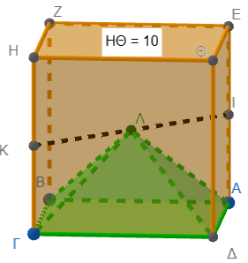{width="176"}

2.  **Κύλινδρος & Πρίσμα:** Τετραγωνικό πρίσμα είναι εγγεγραμμένο σε κύλινδρο ύψους 10 cm και ακτίνας 3 cm.
    Υπολογίστε και τους δύο όγκους.
    Πόσο όγκο καταλαμβάνει ο κενός χώρος αναμεσά τους;\
    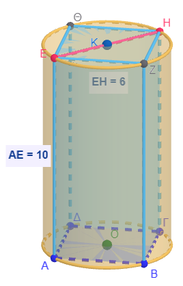{width="176"}

3.  **Κύλινδρος & Κώνος (Πρόσθεση):** Στερεό αποτελείται από κύλινδρο ακτίνας 4 cm και ύψους 4 cm, και έναν κώνο στην κορυφή του με ύψος 6 cm.
    Βρείτε τον συνολικό όγκο και την συνολική επιφάνεια του\
    \

    ::: {.callout-important style="color: brown;"}
    Η κοινή βάση δεν ......................
    ....................
    .............................
    :::

    .\
    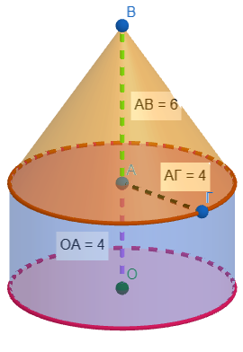{width="178"}

4.  **Κύβος & Πυραμίδα (Σύνθεση):** Πάνω σε κύβο ακμής 10 cm τοποθετείται πυραμίδα με την ίδια βάση και ύψος 6 cm.
    Υπολογίστε τον συνολικό όγκο του στερεού και την συνολική επιφάνειά του\
    \

    ::: {.callout-important style="color: brown;"}
    Η κονή βάση δεν ....................
    ........................
    :::

    \
    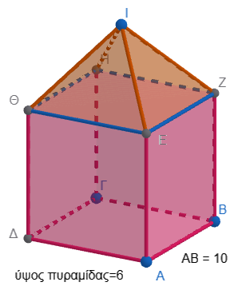{width="217"}

5.  **Διπλός Κώνος:** Δύο κώνοι έχουν κοινή βάση ακτίνας 4 cm και τα ύψη τους είναι 6 cm και 12 cm αντίστοιχα (τοποθετημένοι εκατέρωθεν της βάσης).
    Βρείτε τον συνολικό όγκο και την συνολική επιφάνεια τους.\

    \

    ::: {.callout-important style="color: brown;"}
    Η κοινή βάση δεν ............
    ........................
    ................
    :::

    \
    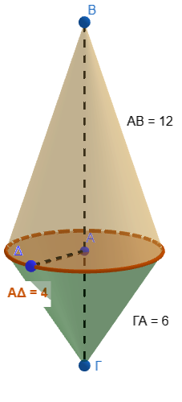{width="152"}

6.  **Πείραμα Γεμίσματος:** Αν γεμίσουμε μια πυραμίδα τρεις φορές με νερό και την αδειάσουμε σε ένα πρίσμα με την ίδια βάση και ύψος, το πρίσμα γεμίζει τελείως.
    Εξηγήστε τον λόγο των όγκων τους.

7.  **Κωνική Κλεψύδρα:** Μια κλεψύδρα αποτελείται από δύο κώνους με ακτίνα 5 cm και ύψος 9,17 cm.
    Αν η άμμος ρέει με 4 $cm^3/min$, σε πόσο χρόνο θα αδειάσει;\
    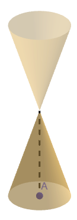{width="84"}

8.  **Περιστροφή Τριγώνου (Α):** Ορθογώνιο τρίγωνο περιστρέφεται γύρω από την πλευρά ΑΒ και μετά γύρω από την ΑΓ.
    Βρείτε τον λόγο των όγκων των δύο κώνων που προκύπτουν.\
    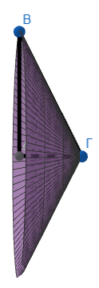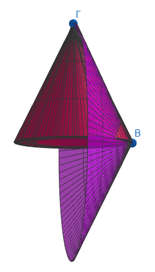{width="209"}

9.  **Περιστροφή Τριγώνου (Β):** Ισοσκελές τρίγωνο (βάση AB= 24 cm, πλευρά AΓ=ΒΓ=13 cm) περιστρέφεται γύρω από τη βάση του.
    Υπολογίστε την ολική επιφάνεια του παραγόμενου στερεού (διπλός κώνος).\
    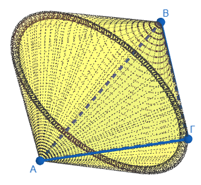

10. **Σύγκριση Επιφανειών:** Δίνεται πρίσμα με τετραγωνική βάση πλευράς 10 cm και ύψους 8 cm, και κύλινδρος με διάμετρο 10 cm και ύψος 8 cm.
    Ποιο στερεό έχει μεγαλύτερη ολική επιφάνεια;

11. Μια πυραμίδα με τετραγωνική βάση πλευράς $a=6$ cm και ύψος $υ=10$ cm είναι εγγεγραμμένη μέσα σε ένα ορθογώνιο παραλληλεπίπεδο (πρίσμα) με την ίδια βάση και το ίδιο ύψος.
    Ποια είναι η διαφορά των όγκων τους;\
    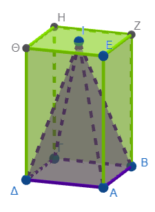

12. Ένας κύλινδρος έχει ακτίνα $ρ=4$ cm και ύψος $υ=10$ cm.
    Αν αφαιρέσουμε από το εσωτερικό του έναν κώνο που έχει την ίδια βάση και το ίδιο ύψος, ποιος είναι ο όγκος του στερεού που απομένει;\
    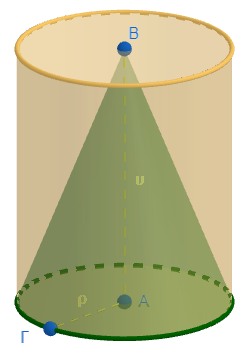{width="171"}

13. Ένα στερεό σχήμα αποτελείται από έναν κύλινδρο ακτίνας $ρ=5$ cm και ύψους $υ=8$ cm και δύο κώνους τοποθετημένους στις δύο βάσεις του κυλίνδρου, καθένας με ύψος $υ_{κώνου}=3$ cm.
    Ποιος είναι ο συνολικός όγκος του στερεού και ποια η συνολική του επιφάνεια;\

    ::: {.callout-important style="color: brown;"}
    Οι κοινές βάσεις δεν ..........................
    ....................
    συνολική επιφάνεια
    :::

    \
    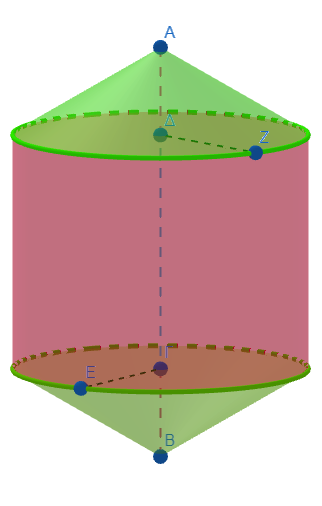{width="202"}

14. Μια πυραμίδα με βάση ένα κανονικό εξάγωνο πλευράς $a=2$ cm και ύψος $υ_{πυραμίδας}=9$ cm τοποθετείται πάνω σε ένα εξαγωνικό πρίσμα με την ίδια βάση και ύψος $υ_{πρίσματος}=5$ cm.
    Να βρείτε τον συνολικό όγκο του στερεού και την συνολική επιφάνεια του.\

::: {.callout-important style="color: brown;"}
Προσοχή!
Πως θα υπολογίσετε το απόστημα της πυραμίδας;\
Υπολογίστε πρώτα την ακμή της πυραμίδας.
:::

\
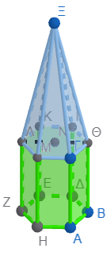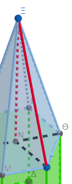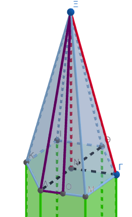 \`
\`\`

15. Σε ένα ορθογώνιο παραλληλεπίπεδο διαστάσεων $4 \times 4 \times 10$ cm, ανοίγεται μια κυλινδρική τρύπα ακτίνας $r=1$ cm που διαπερνά όλο το ύψος του.
    Ποιος είναι ο όγκος του στερεού που απομένει;

16. Ένα στερεό αποτελείται από έναν κύλινδρο ακτίνας $ρ=2$ cm και ύψους $υ=5$ cm, στον οποίο έχει προσαρμοστεί μια πυραμίδα με τετραγωνική βάση πλευράς $a=\text{πρέπει να το βρείτε}$ cm (εγγεγραμμένη στον κύκλο της βάσης του κυλίνδρου) και ύψος $υ_{πυραμίδας}=6$ cm.
    Βρείτε τον συνολικό όγκο του σχήματος και την συνολική επιφάνεια του.\

::: {.callout-important style="color: brown;"}
η πάνω βάση του κυλίνδρου δεν συμμετέχει όλη στην συνολική επιφάνεια!

Πως θα βρείτε το απόστημα της πυραμίδας;

Γνωρίζετε την διγώνιο της βάσης=2ρ

Πυθαγόρειο θεώρημα για να βρείτε την πλευρά της βάσης ......
και πάλι πυθαγόρειο θεώρημα για το απόστημα\
:::

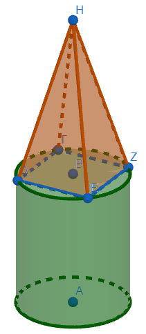{width="169"}

::: {.callout-tip style="color: brown;"}
## Ενέργεια
:::

::: {style="background-color: #E7CEF0; border: 2px solid #2f3e50; color: #25188a; padding: 15px; border-radius: 5px;"}
:::

::: {.callout-tip style="color: brown;"}
ΚΑΛΗ ΜΕΛΕΤΗ!
:::

\
\
