```{=html}
<!-- Φόρτωση βιβλιοθήκης GeoGebra -->
<script src="https://www.geogebra.org/apps/deployggb.js"></script>

<!-- Συνάρτηση δημιουργίας applets -->
<script>
function createGeoGebra(containerId, materialId, width = 700, height = 500) {
  var params = {
    "id": "ggb-" + containerId,
    "material_id": materialId,
    "width": width,
    "height": height,
    "showToolBar": true,
    "showMenuBar": false,
    "showAlgebraInput": true
  };
  
  var applet = new GGBApplet(params, '5.2');
  applet.inject(containerId);
}
</script>
```

## Ο κώνος και τα στοιχεία του

::: {style="background-color: #c682d9; border: 2px solid #2f3e50; color: #171426; padding: 15px; border-radius: 5px;"}
Ο **κώνος** είναι ένα στερεό σχήμα που προκύπτει από την πλήρη περιστροφή ενός **ορθογωνίου τριγώνου** γύρω από μία από τις κάθετες πλευρές του.
Ανάλογα με τη θέση της κορυφής ως προς το κέντρο της βάσης, διακρίνεται σε **ορθό** (όταν το ύψος πέφτει στο κέντρο της βάσης) ή **πλάγιο**.

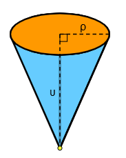
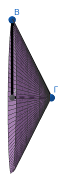
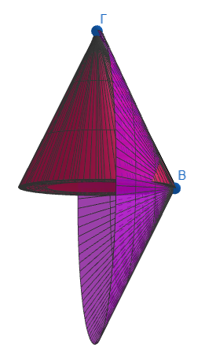

### Τα βασικά στοιχεία του κώνου

Τα μέρη που συνθέτουν έναν κώνο είναι τα εξής: \* **Βάση**: Ο κυκλικός δίσκος που ορίζει το κάτω μέρος του κώνου.

* **Κορυφή**: Το σταθερό σημείο στο οποίο καταλήγουν όλες οι πλευρές του κώνου.

* **Ακτίνα (**$\rho$ ή $r$): Η ακτίνα του κυκλικού δίσκου της βάσης.

* **Ύψος (**$\upsilon$ ή $h$): Το ευθύγραμμο τμήμα που συνδέει την κορυφή με το κέντρο της βάσης και είναι κάθετο σε αυτήν.

* **Γενέτειρα ή Πλευρά (**$\lambda$ ή $l$): Η υποτείνουσα του ορθογωνίου τριγώνου που περιστρέφεται, δηλαδή κάθε ευθύγραμμο τμήμα που συνδέει την κορυφή με ένα σημείο της περιφέρειας της βάσης.

* **Παράπλευρη (ή Κυρτή) Επιφάνεια**: Η επιφάνεια που παράγεται από την περιστροφή της γενέτειρας.

* **Άξονας**: Το ευθύγραμμο τμήμα που ορίζεται από την κορυφή και το κέντρο της βάσης.
:::

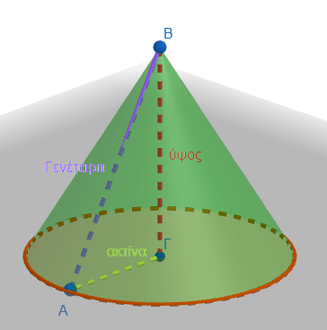

### Μετρικές σχέσεις και Τύποι

Στον ορθό κώνο, η γενέτειρα $\lambda$, το ύψος $\upsilon$ και η ακτίνα $\rho$ σχηματίζουν ορθογώνιο τρίγωνο, επομένως ισχύει το **Πυθαγόρειο Θεώρημα**: $$\mathbf{\lambda^2 = \upsilon^2 + \rho^2}$$

Οι βασικοί υπολογισμοί για τον κώνο γίνονται με τους εξής τύπους: 

1.  **Εμβαδόν Παράπλευρης Επιφάνειας**: $E_{\pi} = \pi \cdot \rho \cdot \lambda$.

2.  **Εμβαδόν Ολικής Επιφάνειας**: $E_{ολ} = \pi \cdot \rho \cdot \lambda + \pi \cdot \rho^2$ (δηλαδή το άθροισμα της παράπλευρης επιφάνειας και της βάσης).

3.  **Όγκος**: $V = \dfrac{1}{3} \pi \cdot \rho^2 \cdot \upsilon$.
Ο όγκος του κώνου ισούται με το **ένα τρίτο** του όγκου ενός κυλίνδρου που έχει την ίδια βάση και το ίδιο ύψος.

### Ανάπτυγμα κώνου

 Αν «ξετυλίξουμε» την παράπλευρη επιφάνεια ενός κώνου σε ένα επίπεδο, το σχήμα που προκύπτει είναι ένας **κυκλικός τομέας**. Η ακτίνα αυτού του τομέα είναι ίση με τη γενέτειρα $\lambda$ του κώνου και το μήκος του τόξου του είναι ίσο με την περιφέρεια της βάσης του κώνου ($2\pi\rho$). Η γωνία $\phi$ του τομέα δίνεται από τη σχέση: $\phi = \dfrac{\rho}{\lambda} \cdot 360^\circ$.

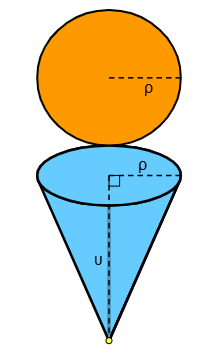
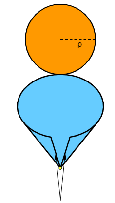
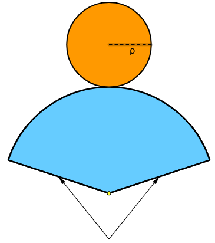


### Παραδείγματα

1. **Υπολογισμός Ολικής Επιφάνειας Κώνου**
Σε έναν κώνο, το εμβαδόν της παράπλευρης επιφάνειας είναι $226,08 \text{ cm}^2$ και η γενέτειρα $\lambda$ είναι $9 \text{ cm}$.
*   **Βήμα 1 (Εύρεση ακτίνας):** Από τον τύπο της παράπλευρης επιφάνειας $E_{\pi} = \pi \cdot \rho \cdot \lambda$, έχουμε $226,08 = 3,14 \cdot \rho \cdot 9$, άρα $\rho = 8 \text{ cm}$.
*   **Βήμα 2 (Εμβαδόν βάσης):** $E_{\beta} = \pi \cdot \rho^2 = 3,14 \cdot 8^2 = 200,96 \text{ cm}^2$.
*   **Βήμα 3 (Ολική επιφάνεια):** $E_{\text{ολ}} = E_{\pi} + E_{\beta} = 226,08 + 200,96 = 427,04 \text{ cm}^2$.

2. **Σιλό (Κύλινδρος και Κώνος):** Ένα σιλό αποθήκευσης αποτελείται από ένα κυλινδρικό τμήμα ακτίνας 4 m και ένα κωνικό τμήμα στη βάση του με γενέτειρα 5 m. Αν το συνολικό ύψος του σιλό είναι 10 m και είναι ανοικτό από πάνω, υπολογίστε το συνολικό εμβαδόν της εξωτερικής του επιφάνειας και τον συνολικό του όγκο.

*   **Δεδομένα:** Ακτίνα $\rho = 4 \text{ m}$, συνολικό ύψος $10 \text{ m}$ και γενέτειρα κώνου $\lambda = 5 \text{ m}$.

*   **Υπολογισμός ύψους:** Το ύψος του κώνου είναι $\upsilon_{\kappa} = \sqrt{\lambda^2 - \rho^2} = \sqrt{5^2 - 4^2} = 3 \text{ m}$. Το ύψος του κυλίνδρου είναι $10 - 3 = 7 \text{ m}$.

*   **Εμβαδόν επιφάνειας:** Είναι το άθροισμα των παράπλευρων επιφανειών:
    1.  **Παράπλευρη Κυλίνδρου:** $2\pi\rho\upsilon = 2 \cdot 3,14 \cdot 4 \cdot 7 = 175,84 \text{ m}^2$.
    2.  **Παράπλευρη Κώνου:** $\pi\rho\lambda = 3,14 \cdot 4 \cdot 5 = 62,8 \text{ m}^2$.

*   **Σύνολο:** $175,84 + 62,8 = 238,64 \text{ m}^2$.

3. **Σημαδούρα (Κύλινδρος και Κώνος):** Μια κούφια σημαδούρα αποτελείται από έναν κύλινδρο ύψους 1,20 m και ακτίνας 0,80 m, πάνω στον οποίο εδράζεται ένας κώνος ύψους 1 m και ακτίνας βάσης 0,30 m. Υπολογίστε τη συνολική εξωτερική επιφάνεια της σημαδούρας και τον όγκο του αέρα που περιέχει.

*   **Υπολογισμός Επιφάνειας:** Η συνολική επιφάνεια υπολογίζεται ως: (Κάτω βάση κυλίνδρου) + (παράπλευρη κυλίνδρου) + (πάνω βάση κυλίνδρου) – (βάση κώνου) + (παράπλευρη κώνου).

*   **Δεδομένα:** Κύλινδρος ($\upsilon = 1,20 \text{ m}, \rho = 0,80 \text{ m}$), Κώνος ($\upsilon = 1 \text{ m}, \rho = 0,30 \text{ m}$).

*   **Αποτέλεσμα:** Μετά την εύρεση της γενέτειρας του κώνου ($\lambda \approx 1,04 \text{ m}$), η συνολική επιφάνεια προκύπτει περίπου $10,75 \text{ m}^2$.

4. **Σύνθετο Σχήμα: Διπλός Κώνος (Περιστροφή Τετραγώνου)**
Ένα τετράγωνο πλευράς $5 \text{ cm}$ περιστρέφεται γύρω από τη διαγώνιό του.

*   **Περιγραφή:** Το στερεό που προκύπτει αποτελείται από δύο ίσους κώνους με κοινή βάση.

*   **Στοιχεία:** Η ακτίνα $\rho$ και το ύψος $\upsilon$ κάθε κώνου ισούνται με το μισό της διαγωνίου του τετραγώνου ($\approx 3,535 \text{ cm}$), ενώ η γενέτειρα $\lambda$ είναι η πλευρά του τετραγώνου ($5 \text{ cm}$).

*   **Επιφάνεια:** Η συνολική επιφάνεια είναι το διπλάσιο της παράπλευρης επιφάνειας ενός κώνου: $E = 2 \cdot (\pi\rho\lambda) = 2 \cdot 3,14 \cdot 3,535 \cdot 5 = 110,999 \text{ cm}^2$.


### Ασκήσεις


1.  **Στέγη Τσίρκου (Κώνος)**: Η στέγη της κεντρικής σκηνής ενός τσίρκου έχει σχήμα κώνου με διάμετρο βάσης 40 m και ύψος 15 m. Υπολογίστε πόσα τετραγωνικά μέτρα υφάσματος χρειάστηκαν για την κατασκευή της (παράπλευρη επιφάνεια).
2.  **Υπολογισμός Επιφάνειας Κώνου**: Ένας κώνος έχει ακτίνα βάσης 3 και ύψος 4. Να υπολογίσετε την κυρτή και την ολική του επιφάνεια (αφού πρώτα βρείτε τη γενέτειρα $\lambda$).
7.  **Σύνθετο Σχήμα από Περιστροφή Τριγώνου (Δύο Κώνοι)**: Ένα ισοσκελές τρίγωνο ΑΒΓ με πλευρές $AB = AC = 13$ cm και βάση $B\Gamma = 24$ cm περιστρέφεται γύρω από τη βάση του $B\Gamma$. Να υπολογίσετε την ολική επιφάνεια του στερεού που σχηματίζεται (αποτελείται από τις παράπλευρες επιφάνειες δύο κώνων).
8.  **Σχέση Κώνου και Κύκλου**: Το εμβαδόν της ολικής επιφάνειας ενός κώνου είναι ίσο με το εμβαδόν κύκλου ακτίνας $\alpha$. Να βρείτε τον τύπο για την κυρτή επιφάνεια του κώνου αν η ακτίνα της βάσης του είναι $\rho$.

### Ασκήσεις με Συμπλέγματα Σχημάτων

1.  **Σύνθετο Στερεό δύο Κώνων:** Δύο στερεοί κώνοι έχουν κοινή βάση με ακτίνα 4 cm και τα ύψη τους είναι 6 cm και 12 cm αντίστοιχα (τοποθετημένοι βάση με βάση). Βρείτε τον συνολικό όγκο του στερεού που σχηματίζεται.

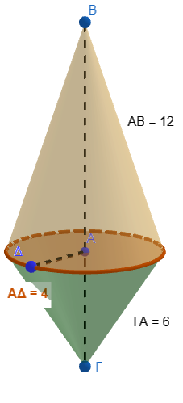

2.  **Περιστροφή Ισοσκελούς Τριγώνου:** Ένα ισοσκελές τρίγωνο ΑΒΓ με πλευρές AB = AC = 13 cm και βάση BΓ = 24 cm περιστρέφεται γύρω από τη βάση του ΒΓ. Υπολογίστε την ολική επιφάνεια και τον όγκο του στερεού (αποτελείται από δύο ίσους κώνους).
3.  **Κώνος και Εγγεγραμμένη Πυραμίδα:** Σε έναν κώνο ακτίνας $\rho=5 \ \ cm$ και ύψους $\upsilon=10 \ \ cm$ εγγράφεται μια κανονική τετραγωνική πυραμίδα (η βάση της πυραμίδας είναι εγγεγραμμένη στον κύκλο της βάσης του κώνου και έχει ίδιο ύψος με τον κώνο). Να βρείτε τον όγκο που περιέχεται ανάμεσα στα δυο στερεά.
4.  **Κώνος και Περιγεγραμμένη Πυραμίδα:** Μια κανονική πυραμίδα είναι περιγεγραμμένη σε έναν κώνο με γενέτειρα $λ=8 \ \ cm$ υψους $υ=10 \ \ cm$, έτσι ώστε οι έδρες της να εφάπτονται στην κυρτή επιφάνεια του κώνου. Υπολογίστε τον όγκο που περιέχεται μεταξύ των δύο στερεών.
5.  **Κώνος και Κύλινδρος:** Ένας κώνος και ένας κύλινδρος έχουν ίσες βάσεις και ίσα ύψη. Αν αφαιρέσουμε τον κώνο από τον κύλινδρο, να υπολογίστε την επιφάνεια του στερού που απομένει. Το ύψος τους είναι ίσο με δύο φορές την ακτίνα της βάσης τους $υ=2ρ=10 \ \ cm$.

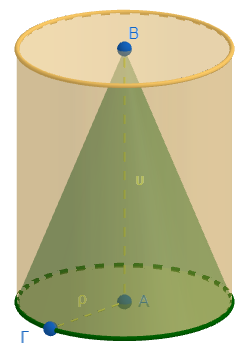

6.  **Κώνος και Κύλινδρος:**  Υπολογίστε τον όγκο και την ολική επιφάνεια του παρακάτω στερεού

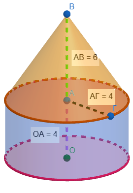

7.  **Δύο κώνοι με ίδια βάση** Ορογώνιο ισοσκελές τρίγωνο περιστρέφεται γύρω από την υποτείνουσα $ΑΒ=10 \ \ cm$. Να υπολογίσευε την ολική επιφάνεια του στερεού που παράγεται και τον όγκο του. 

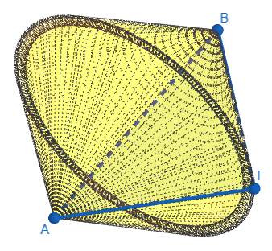

8.  **Κώνοι και κύλινδρος** Στο παρακάτω σχήμα είναι $ΑΔ=ΒΓ=\dfrac{1}{2}ΔΖ=\dfrac{1}{2}ΕΓ=\dfrac{1}{3}ΓΔ=3 \ \ cm$. Να υπολογίσετε την ολική επιφάνεια και τον όγκο του στερεού.

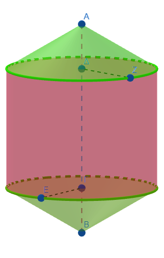

9.  **Κλεψύδρα** Η παρακάτω κλεψύδρα αδειάζει ένα παχύρευστο υγρό για να μετρήσει τον χρόνο. Αν αδειάζει 5 ml/min, πόσο χρόνο θα χρειαστεί για να αδειάσει τελείως;
Δίνονται ρ=5 cm και συνολικό ύψος 20 cm.
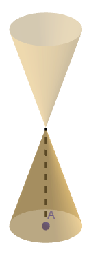


### Βασικοί Τύποι για τις Λύσεις
*   **Εμβαδόν Παράπλευρης Επιφάνειας Κώνου:** $E_{\pi} = \pi \cdot \rho \cdot \lambda$.
*   **Όγκος Κώνου:** $V = \frac{1}{3} \pi \cdot \rho^2 \cdot \upsilon$.
*   **Σχέση Γενέτειρας ($\lambda$), Ύψους ($\upsilon$) και Ακτίνας ($\rho$):** $\lambda^2 = \upsilon^2 + \rho^2$.
*   **Όγκος Κυλίνδρου:** $V = \pi \cdot \rho^2 \cdot \upsilon$.


::: {.callout-tip style="color: brown;"}
ΚΑΛΗ ΜΕΛΕΤΗ!
:::

\
\
