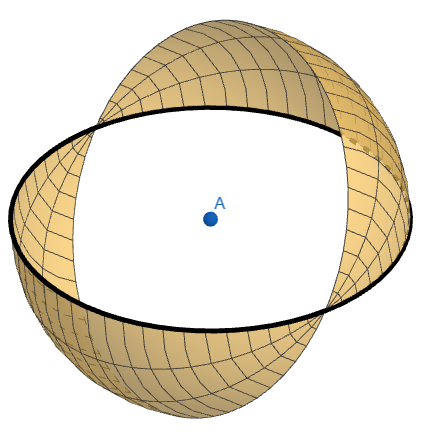
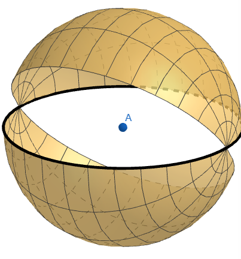
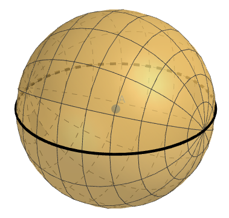
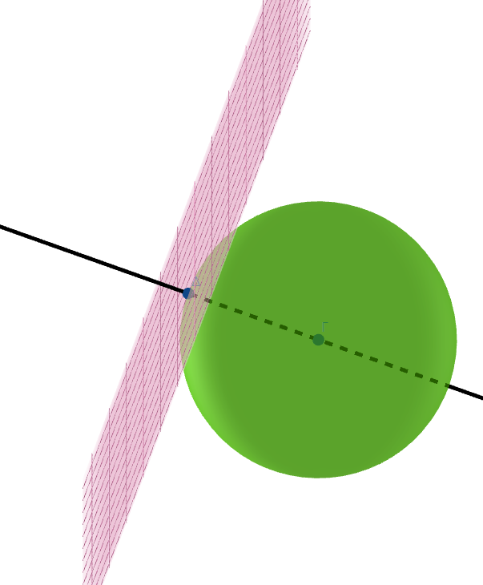
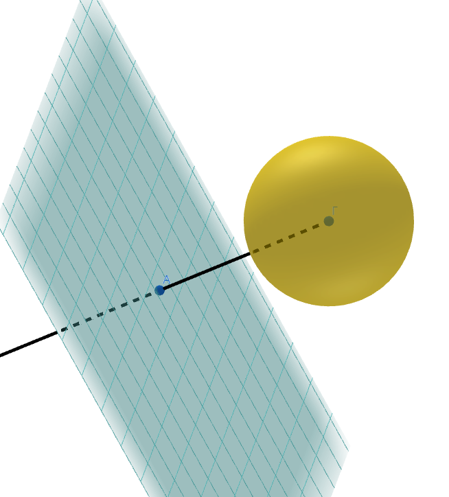
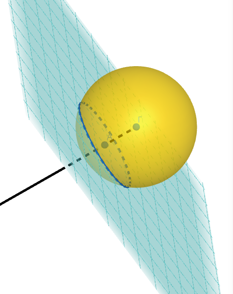
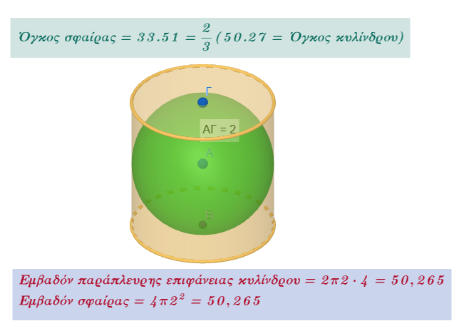
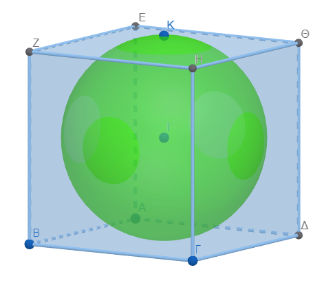
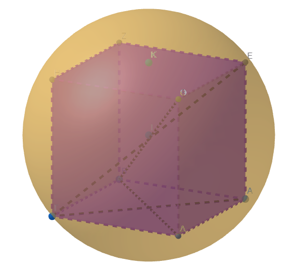
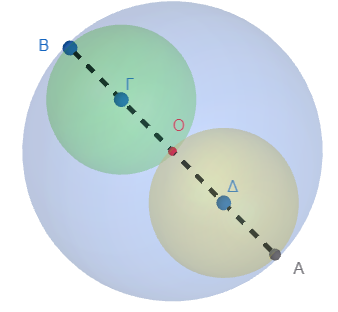

```{=html}
<!-- Φόρτωση βιβλιοθήκης GeoGebra -->
<script src="https://www.geogebra.org/apps/deployggb.js"></script>

<!-- Συνάρτηση δημιουργίας applets -->
<script>
function createGeoGebra(containerId, materialId, width = 700, height = 500) {
  var params = {
    "id": "ggb-" + containerId,
    "material_id": materialId,
    "width": width,
    "height": height,
    "showToolBar": true,
    "showMenuBar": false,
    "showAlgebraInput": true
  };
  
  var applet = new GGBApplet(params, '5.2');
  applet.inject(containerId);
}
</script>
```

## H σφαίρα και τα στοιχεία της

|  |  |
|:--------------------------------:|:------------------------------------:|
| {#overview width="200" height="200"} | {width="200" height="200"} |
| Η περιστροφή ενός κύκλου ....... | ..... γύρω από μια διάμετρό του ..... |
| {width="200"} | {width="200"} |
| ...... παράγει μια σφαίρα | Σφαίρα και επίπεδο εφάπτονται |
| {width="200"} | {width="200"} |
| Σφαίρα και επίπεδο δεν έχουν κανένα κοινό σημείο | Το επίπεδο τέμνει τη σφαίρα κατά έναν κύκλο |

::: {style="background-color: #E7CEF0; border: 2px solid #2f3e50; color: #25188a; padding: 15px; border-radius: 5px;"}
Η **σφαίρα** ορίζεται ως ο **γεωμετρικός τόπος** όλων των σημείων του τρισδιάστατου χώρου που απέχουν μια σταθερή απόσταση από ένα δεδομένο σημείο, το οποίο ονομάζεται **κέντρο**.
Αποτελεί το πλέον τέλειο και συμμετρικό σχήμα στον Ευκλείδειο χώρο και αντιπροσωπεύει μια δισδιάστατη κλειστή επιφάνεια με σταθερή καμπυλότητα.
Ένα ιδιαίτερο χαρακτηριστικό της, το οποίο απέδειξε ο Αρχιμήδης, είναι ότι **δεν διαθέτει επίπεδο ανάπτυγμα**, δηλαδή δεν μπορεί να "ξεδιπλωθεί" σε μια επίπεδη επιφάνεια χωρίς παραμόρφωση, σε αντίθεση με τον κύλινδρο ή τον κώνο.

Επίσης σαν **σφαίρα** μπορεί να θεωρηθεί η επιφάνεια που διαγράγεται αν περιστρέψουμε ένον κύκλο γύρω από μια διαμετρό του $180^ο$

Τα βασικά **στοιχεία** που ορίζουν τη σφαίρα είναι τα εξής:

- **Κέντρο (**$K$ ή $O$): Το σταθερό σημείο από το οποίο ισαπέχουν όλα τα σημεία της σφαιρικής επιφάνειας. Το κέντρο αποτελεί το σημείο συμμετρίας του στερεού.
- **Ακτίνα (**$ρ$ ή $r$): Το ευθύγραμμο τμήμα που συνδέει το κέντρο με οποιοδήποτε σημείο της επιφάνειας της σφαίρας. Όλες οι ακτίνες μιας σφαίρας είναι εξ ορισμού ίσες.
- **Διάμετρος (**$\delta$ ή $d$): Το ευθύγραμμο τμήμα που διέρχεται από το κέντρο και συνδέει δύο σημεία της επιφάνειας. Είναι **διπλάσια της ακτίνας** ($\delta = 2\rho$) και αποτελεί τη μέγιστη δυνατή απόσταση μεταξύ δύο σημείων της σφαίρας.
- **Μέγιστος Κύκλος:** Η τομή της σφαίρας με ένα επίπεδο που **διέρχεται από το κέντρο της**. Η ακτίνα του μέγιστου κύκλου συμπίπτει με την ακτίνα της σφαίρας.
- **Μικρός Κύκλος:** Κάθε κύκλος που προκύπτει από την τομή της σφαίρας με ένα επίπεδο που **δεν διέρχεται από το κέντρο**.
- **Ημισφαίριο:** Καθεμία από τις δύο ίσες σφαιρικές περιοχές στις οποίες χωρίζει τη σφαίρα ένας μέγιστος κύκλος.

Σχετικά με τα **μετρικά χαρακτηριστικά** της σφαίρας:

1.  Το **Εμβαδόν της επιφάνειας (**$E$) δίνεται από τον τύπο $E = 4\pi\rho^2$ και είναι τετραπλάσιο από το εμβαδόν ενός μεγίστου κύκλου της.
2.  Ο **Όγκος (**$V$), που αντιπροσωπεύει τη χωρητικότητα του στερεού, υπολογίζεται ως $V = \dfrac{4}{3}\pi\rho^3$.

Στην αυστηρή μαθηματική ορολογία, ο όρος **μπάλα** (ή συμπαγής σφαίρα) αναφέρεται στο σύνολο των εσωτερικών σημείων, ενώ ο όρος **σφαιρικός φλοιός** αναφέρεται αποκλειστικά στην επιφάνεια.
:::

### Οι τύποι υπολογισμού του εμβαδού και του όγκου

Η δικαιολόγηση των τύπων για το εμβαδό και τον όγκο της σφαίρας έχει βαθιές ιστορικές ρίζες στις μελέτες του **Αρχιμήδη**, αλλά εξηγείται και μέσω σύγχρονων μαθηματικών μεθόδων (απειροστικός λογισμός).

**1. Εμβαδόν Επιφάνειας** ($E = 4\pi\rho^2$) Ο τύπος που υπολογίζει το εμβαδό της επιφάνειας μιας σφαίρας δικαιολογείται με τους εξής τρόπους:

- **Ιστορική Απόδειξη (Αρχιμήδης):** Ο Αρχιμήδης απέδειξε πριν από περίπου 2.200 χρόνια ότι το εμβαδόν μιας σφαιρικής επιφάνειας είναι **ίσο με την παράπλευρη επιφάνεια του περιγεγραμμένου κυλίνδρου** (ενός κυλίνδρου με διάμετρο βάσης και ύψος ίσα με τη διάμετρο της σφαίρας).
- **Σχέση με τον Μέγιστο Κύκλο:** Το εμβαδόν της επιφάνειας είναι ακριβώς **τετραπλάσιο από το εμβαδόν ενός μεγίστου κύκλου** της σφαίρας ($E_{κυκλ} = \pi\rho^2$).
- **Διαφορική Σχέση:** Από τη σκοπιά του λογισμού, η επιφάνεια της σφαίρας αποτελεί την **παράγωγο του όγκου** της ως προς την ακτίνα. Αυτό σημαίνει ότι αν αυξήσουμε την ακτίνα κατά μια απειροελάχιστη ποσότητα, ο όγκος θα αυξηθεί κατά μια ποσότητα ίση με την επιφάνειά της.\
  \
  

**2. Όγκος Σφαίρας** ($V = \frac{4}{3}\pi\rho^3$) Ο υπολογισμός του χώρου που καταλαμβάνει η σφαίρα βασίζεται στις παρακάτω γεωμετρικές αρχές:

- **Η Σχέση Σφαίρας-Κυλίνδρου:** Ο Αρχιμήδης απέδειξε ότι ο όγκος μιας σφαίρας είναι τα **2/3 του όγκου του περιγεγραμμένου κυλίνδρου**. Η ανακάλυψη αυτή θεωρήθηκε τόσο σπουδαία από τον ίδιο, που ζήτησε να χαραχθεί το σχήμα της σφαίρας εγγεγραμμένης σε κύλινδρο στον τάφο του.
- **Μέθοδος των Ολοκληρωμάτων:** Ο όγκος μπορεί να δικαιολογηθεί ως το **άθροισμα (ολοκλήρωμα) άπειρων στοιχειωδών σφαιρικών φλοιών** (κελυφών). Αν θεωρήσουμε κάθε φλοιό με επιφάνεια $4\pi r^2$ και απειροελάχιστο πάχος $dr$, η ολοκλήρωση από $r=0$ έως $R$ δίνει ακριβώς το αποτέλεσμα $\frac{4}{3}\pi R^3$.
- **Σύγκριση με άλλα Στερεά:** Στο πλαίσιο των γεωμετρικών στερεών, ο όγκος της σφαίρας συνδέεται άμεσα με την ακτίνα της, καθώς αν διπλασιάσουμε την ακτίνα, ο όγκος **οκταπλασιάζεται** (επειδή εξαρτάται από τον κύβο της ακτίνας).

Συνοπτικά, οι τύποι αυτοί δεν είναι αυθαίρετοι αλλά προκύπτουν από τη σύγκριση της σφαίρας με τον κύλινδρο και την εφαρμογή της αρχής ότι ο όγκος ενός στερεού αυξάνεται ανάλογα με την επιφάνεια που τον περιβάλλει.

------------------------------------------------------------------------

### Ασκήσεις

### Απλές Ασκήσεις Σφαίρας

1.  **Βασικός Υπολογισμός:** Η διάμετρος μιας σφαίρας είναι $\delta = 4$ cm. Να υπολογίσετε το εμβαδόν της επιφάνειάς της και τον όγκο της.
    - *Απάντηση:* Η ακτίνα είναι $\rho = 2$ cm. $E = 16\pi$ $cm^2$ και $V = \frac{32\pi}{3}$ $cm^3$.
2.  **Εύρεση Ακτίνας από Όγκο:** Αν ο όγκος μιας σφαίρας είναι $V = 36\pi$ $m^3$, να βρείτε την ακτίνα της και το εμβαδόν της επιφάνειάς της.
    - *Απάντηση:* Από τον τύπο του όγκου προκύπτει $\rho = 3$ m. Το εμβαδόν είναι $E = 36\pi$ $m^2$.
3.  **Σύγκριση με Κυκλικό Δίσκο:** Ποιος είναι ο λόγος του εμβαδού της επιφάνειας μιας σφαίρας ακτίνας $\rho$ προς το εμβαδόν ενός κυκλικού δίσκου με την ίδια ακτίνα;.
    - *Απάντηση:* Ο λόγος είναι 4, καθώς $E_{σφ} = 4\pi\rho^2$ και $E_{κυκλ} = \pi\rho^2$.
4.  **Μεταβολή Ακτίνας:** Αν διπλασιάσουμε την ακτίνα μιας σφαίρας, πώς μεταβάλλεται ο όγκος της;.
    - *Απάντηση:* Ο όγκος οκταπλασιάζεται ($2^3 = 8$), σύμφωνα με τον τύπο $V = \frac{4}{3}\pi\rho^3$.
5.  **Άσκηση Ημισφαιρίου:** Να βρείτε το εμβαδόν της επιφάνειας και τον όγκο ενός ημισφαιρίου ακτίνας $ρ = 4$ m.
    - *Απάντηση:* Το εμβαδόν της καμπύλης επιφάνειας είναι το μισό της σφαίρας, δηλαδή $E = 32\pi$ $m^2$, και ο όγκος $V = \frac{128\pi}{3}$ $m^3$.
6.  **Πρακτική Εφαρμογή:** Μια σφαιρική δεξαμενή ακτίνας $\rho = 10$ m πρέπει να βαφτεί. Αν ένα κιλό χρώματος καλύπτει $8$ $m^2$, πόσα κιλά χρώμα θα χρειαστούν;.
    - *Απάντηση:* Το εμβαδόν είναι $E \approx 1256$ $m^2$. Θα χρειαστούν $157$ κιλά χρώμα ($1256 : 8$).

### Ασκήσεις Συνδυασμένων Σχημάτων

7.  **Σφαίρα σε Κύβο:** Σε ένα κιβώτιο σχήματος κύβου χωράει ακριβώς μια σφαίρα ακτίνας $40$ cm.
    Να βρείτε τον όγκο του μέρους του κιβωτίου που μένει άδειο.\

    \
    {width="254"}

    - *Λύση:* Η ακμή του κύβου είναι $80$ cm. $V_{κύβου} = 512.000$ $cm^3$ και $V_{σφαίρας} \approx 267.947$ $cm^3$. Ο άδειος χώρος είναι $244.053$ $cm^3$.

8.  **Σφαίρα σε Κύλινδρο:** Μια σφαίρα ακτίνας $\rho$ εγγράφεται ακριβώς σε κύλινδρο (δηλαδή ο κύλινδρος έχει ύψος $2\rho$ και ακτίνα βάσης $\rho$).
    Ποια είναι η σχέση της επιφάνειας της σφαίρας με την παράπλευρη επιφάνεια του κυλίνδρου;.

    - *Απάντηση:* Είναι ίσες. Ο Αρχιμήδης απέδειξε ότι η επιφάνεια της σφαίρας ισούται με την παράπλευρη επιφάνεια του περιγεγραμμένου κυλίνδρου.

9.  **Περιγεγραμμένη Σφαίρα σε Κύβο:** Μια σφαίρα περιβάλλει έναν κύβο έτσι ώστε οι κορυφές του κύβου να ακουμπούν στην επιφάνεια της σφαίρας.
    Ποιος είναι ο λόγος της ακτίνας της σφαίρας $\rho$ προς την ακμή $L$ του κύβου;\
    Αν η ακτίνα της σφαίρας είναι ρ=10 cm, να υπολογίσετε την επιφάνεια και τον όγκο των δύο στερεών .\
    Πόσος είναι ο κενός χώρος ανάμεσα στα δύο στερεά;\
    \
    {width="298"}

    - *Απάντηση:* Ο λόγος είναι $\frac{\rho}{L} = \frac{\sqrt{3}}{2}$, επειδή η διάμετρος της σφαίρας ισούται με τη διαγώνιο του κύβου.
    - Επιφάνεια και όγκος ...............................
    - Κενός χώρος ..........................

10. **Σφαίρες μέσα σε Σφαίρα:** Μια μεγάλη σφαίρα ακτίνας $4$ cm περιέχει στο εσωτερικό της δύο μικρότερες σφαίρες διαμέτρου $4$ cm η καθεμία.
    Να βρείτε τον όγκο του στερεού που απομένει στη μεγάλη σφαίρα αν αφαιρέσουμε τις δύο μικρές.\

    \
    

- *Λύση:* Ο ζητούμενος όγκος προκύπτει από την αφαίρεση του διπλάσιου όγκου των μικρών σφαιρών από τον όγκο της μεγάλης. $V_{μεγ} \approx 267,9$ $cm^3$ και $V_{μικ} \approx 33,5$ $cm^3$. Το αποτέλεσμα είναι $200,9$ $cm^3$.

------------------------------------------------------------------------

### Ασκήσεων συνέχεια

1.  Μια σφαίρα είναι εγγεγραμμένη σε έναν κύβο ακμής $a = 6\text{ cm}$. Να υπολογίσετε τον όγκο της σφαίρας και το εμβαδόν της επιφάνειάς της.

- Επειδή η σφαίρα είναι εγγεγραμμένη στον κύβο, η διάμετρός της $d$ ισούται με την ακμή του κύβου: $d = a = 6\text{ cm}$.

- Η ακτίνα της σφαίρας είναι ...............

- Ο τύπος του όγκου είναι .........................

- Ο τύπος του εμβαδού είναι ..........................

2.  Ένας κύλινδρος έχει ύψος $υ = 10\text{ cm}$ και ακτίνα βάσης $ρ = 5\text{ cm}$. Μια σφαίρα με την ίδια ακτίνα $R=ρ$ τοποθετείται μέσα στον κύλινδρο. Ποιος είναι ο λόγος του όγκου του κυλίνδρου προς τον όγκο της σφαίρας;

- Όγκος κυλίνδρου: $V_{κυλ} = \pi ρ^2 υ =$ ...................................

- Όγκος σφαίρας: $V_{σφ} = \dfrac{4}{3}\pi ρ^3 =$ ........................................

- Λόγος: $\dfrac{V_{κυλ}}{V_{σφ}} =$ .............................................

3.  Σφαίρα ακτίνας $ρ=10\text{ cm}$ τέμνεται από επίπεδο που απέχει $d=6\text{ cm}$ από το κέντρο της. Να βρεθεί η ακτίνα $r$ του κύκλου τομής.

- Στο ορθογώνιο τρίγωνο που σχηματίζεται από την ακτίνα της σφαίρας, την απόσταση του επιπέδου και την ακτίνα του κύκλου, ισχύει το Πυθαγόρειο θεώρημα: $ρ^2 = d^2 + r^2$.

- Αντικατάσταση: ................................

- $r^2 = 64 \Rightarrow r = 8\text{ cm}$.

4.  Κώνος έχει ακτίνα βάσης $ρ=3\text{ cm}$ και ύψος $υ=4\text{ cm}$. Μια σφαίρα έχει τον ίδιο όγκο με τον κώνο. Ποια είναι η ακτίνα $R$ της σφαίρας;

- Όγκος κώνου: ..............................

- Εξίσωση όγκων: $\frac{4}{3}\pi R^3 = 12\pi \Rightarrow$..............................

- $R^3 =  12 \cdot \frac{3}{4} = 9$, άρα $R = \sqrt[3]{9} \text{ cm}$.

5.  Ένα στερεό αποτελείται από έναν κύλινδρο ύψους $υ=10\text{ cm}$ και δύο ημισφαίρες στις βάσεις του, με ακτίνα $ρ=3\text{ cm}$. Να βρεθεί ο συνολικός όγκος του στερεού.

- Όγκος κυλίνδρου: $V_1 = \pi ρ^2 υ =$ ................................

- Όγκος δύο ημισφαιρών (μία ολόκληρη σφαίρα): $V_2 = \dfrac{4}{3}\pi ρ^3 =$ .......................

- Συνολικός όγκος: ................................

6.  Ποιο είναι το εμβαδόν της επιφάνειας μιας σφαίρας που είναι περιγεγραμμένη σε κύβο ακμής $a = 2\text{ cm}$;

- Η διάμετρος της σφαίρας ισούται με τη διαγώνιο του κύβου: ......................

- Ακτίνα .......................

- Εμβαδόν ............................

7.  Δύο σφαίρες έχουν ακτίνες $R_1 = 3\text{ cm}$ και $R_2 = 1\text{ cm}$.
    Ποιος είναι ο λόγος των επιφανειών τους;

8.  Μια σφαίρα ακτίνας $R=5\text{ cm}$ έχει ίδιο όγκο με κώνο με ακτίνα βάσης $ρ=5\text{ cm}$.
    Ποιο είναι το ύψος του κώνου;

- Όγκος σφαίρας: .........................

- Όγκος κώνου: ....................................

- Εξίσωση $\dfrac{500\pi}{3} = \dfrac{25\pi υ}{3} \Rightarrow ............... υ = 20\text{ cm}$.

9.  Μια σφαίρα έχει ακτίνα $R = 3 \text{ cm}$.
    Να υπολογίσετε την επιφάνεια $(E)$ και τον όγκο της $(V)$.
    (Δίνεται $\pi \approx 3,14$).

10. Αν το εμβαδόν της επιφάνειας μιας σφαίρας είναι $400\pi \text{ cm}^2$, να βρεθεί η ακτίνα της $R$ και στη συνέχεια ο όγκος της.

11. Ο όγκος μιας σφαίρας είναι $36\pi \text{ cm}^3$.
    Πόσο είναι το εμβαδόν της επιφάνειάς της;

12. **(Σφαίρα μέσα σε Κύβο):** Μια σφαίρα είναι εγγεγραμμένη σε κύβο ακμής $a = 10 \text{ cm}$ (εφάπτεται σε όλες τις έδρες).
    α) Πόση είναι η ακτίνα της σφαίρας; β) Ποιος είναι ο όγκος που μένει κενός μέσα στον κύβο;

13. **(Κύβος μέσα σε Σφαίρα):** Ένας κύβος με ακμή $a$ είναι εγγεγραμμένος σε σφαίρα.
    Αν η ακτίνα της σφαίρας είναι $R = \sqrt{3} \text{ cm}$, να βρεθεί η ακμή του κύβου.
    *(Υπόδειξη: Η διαγώνιος του κύβου ισούται με τη διάμετρο της σφαίρας).*

14. Έχουμε ένα μεταλλικό ορθογώνιο παραλληλεπίπεδο με διαστάσεις $2 \text{ cm} \times 4 \text{ cm} \times 8 \text{ cm}$.
    Το λιώνουμε και κατασκευάζουμε μια σφαίρα.
    Ποια θα είναι η ακτίνα της σφαίρας;

15. Σε μια κυλινδρική δεξαμενή με νερό ρίχνουμε μια σφαιρική μπάλα ακτίνας $3 \text{ cm}$.
    Αν η ακτίνα της βάσης του κυλίνδρου είναι $6 \text{ cm}$, πόσο θα ανέβει η στάθμη του νερού;

16. Ένα στερεό αποτελείται από ένα ημισφαίριο και έναν κώνο που έχουν την ίδια βάση ακτίνας $R = 5 \text{ cm}$.
    Αν το συνολικό ύψος του στερεού είναι $15 \text{ cm}$, να βρεθεί ο συνολικός όγκος του.

17. Συγκρίνετε τα εμβαδά επιφανείας μιας σφαίρας ακτίνας $R$ και ενός κυλίνδρου που έχει ακτίνα βάσης $R$ και ύψος $υ = 2R$.
    Τι παρατηρείτε;

::: {.callout-tip style="color: brown;"}
## Ενέργεια
:::

::: {style="background-color: #E7CEF0; border: 2px solid #2f3e50; color: #25188a; padding: 15px; border-radius: 5px;"}
:::

::: {.callout-tip style="color: brown;"}
ΚΑΛΗ ΜΕΛΕΤΗ!
:::

\
\
