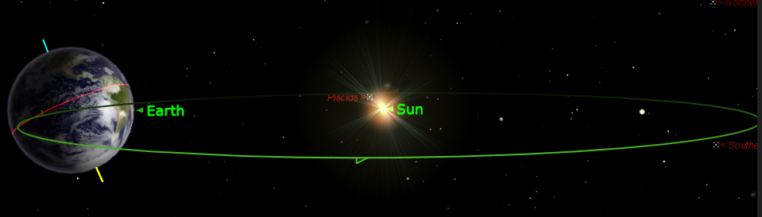
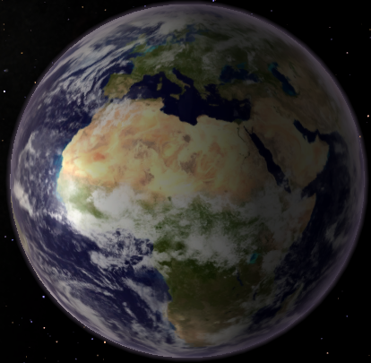
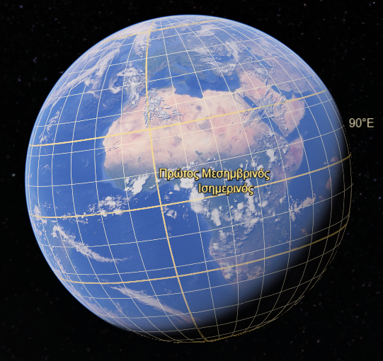
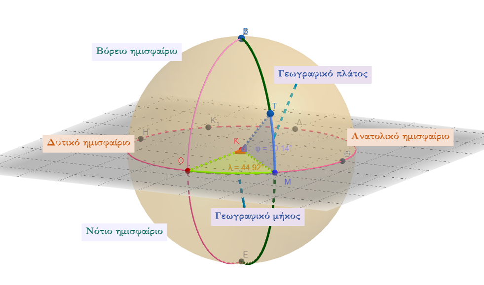

```{=html}
<!-- Φόρτωση βιβλιοθήκης GeoGebra -->
<script src="https://www.geogebra.org/apps/deployggb.js"></script>

<!-- Συνάρτηση δημιουργίας applets -->
<script>
function createGeoGebra(containerId, materialId, width = 700, height = 500) {
  var params = {
    "id": "ggb-" + containerId,
    "material_id": materialId,
    "width": width,
    "height": height,
    "showToolBar": true,
    "showMenuBar": false,
    "showAlgebraInput": true
  };
  
  var applet = new GGBApplet(params, '5.2');
  applet.inject(containerId);
}
</script>
```

## 18. Γεωγραφικές συντεταγμένες

Η Γή περιφέρεται γύρω από τον Ήλιο και περιστρέφεται γύρω από τον άξονά της.



{width="297"}

{width="377"}

::: {style="background-color: #E7CEF0; border: 2px solid #2f3e50; color: #25188a; padding: 15px; border-radius: 5px;"}
Οι **γεωγραφικές συντεταγμένες** (Geographic Coordinate System - GCS) αποτελούν ένα σφαιρικό ή γεωδαιτικό σύστημα μέτρησης που χρησιμοποιείται για τον ακριβή προσδιορισμό θέσεων απευθείας πάνω στην τρισδιάστατη επιφάνεια της Γης.
Πρόκειται για το παλαιότερο και πιο διαδεδομένο σύστημα χωρικής αναφοράς, το οποίο λειτουργεί ως η κοινή γλώσσα για τη γεωχωρική πληροφορία παγκοσμίως.

Το σύστημα βασίζεται σε δύο κύρια μεγέθη που εκφράζονται ως γωνιακές αποστάσεις:

- **Γεωγραφικό πλάτος (latitude** $\phi$): Ορίζεται ως η γωνία που σχηματίζει η κατακόρυφος ενός τόπου με το επίπεδο του ισημερινού. Η μέτρηση ξεκινά από τον **ισημερινό (0°)** και εκτείνεται έως τις **90° Βόρεια** (Β ή N) ή **90° Νότια** (Ν ή S) στους πόλους.
- **Γεωγραφικό μήκος (longitude** $\lambda$): Αντιπροσωπεύει τη γωνία ανατολικά ή δυτικά από έναν πρώτο μεσημβρινό. Η αφετηρία μέτρησης (0°) είναι ο μεσημβρινός του **Γκρίνουιτς** στο Ηνωμένο Βασίλειο, και οι τιμές κυμαίνονται από **0° έως 180° Ανατολικά** (Α ή E) ή **Δυτικά** (Δ ή W).
:::

\
\

### Δομή και Αναπαράσταση

Το δίκτυο που σχηματίζεται από την τομή των παραλλήλων κύκλων και των μεσημβρινών ονομάζεται **γεωγραφικός κάνναβος (graticule)**.
Η αρχή του συστήματος (0,0) βρίσκεται στο σημείο τομής του ισημερινού και του πρώτου μεσημβρινού, μια περιοχή στον Κόλπο της Γουινέας που συχνά αναφέρεται χαριτολογώντας ως "Null Island".

Οι συντεταγμένες εκφράζονται συνήθως σε δύο κύριες μορφές:

1\.
**Μοίρες, Λεπτά, Δευτερόλεπτα (DMS):** Η παραδοσιακή μορφή που χρησιμοποιείται στη ναυσιπλοΐα και την αεροπορία.

2\.
**Δεκαδικές Μοίρες (DD):** Η προτιμώμενη μορφή για τα Συστήματα Γεωγραφικών Πληροφοριών (GIS) και τις ψηφιακές εφαρμογές, καθώς επιτρέπει την ευκολότερη μαθηματική επεξεργασία.

### Η Σημασία των Γεωδαιτικών Συστημάτων (Datums)

Για να συνδεθούν οι θεωρητικοί ορισμοί των συντεταγμένων με την πραγματική, ακανόνιστη επιφάνεια της Γης, απαιτείται ένα **γεωδαιτικό σύστημα αναφοράς (datum)**.
Το datum είναι ένα μαθηματικό μοντέλο (ελλειψοειδές) στη φυσική Γη.

\* Το **WGS 84** (World Geodetic System 1984) είναι το παγκόσμιο πρότυπο που χρησιμοποιείται από το σύστημα **GPS**.

\* Στην Ελλάδα, οι τοπογραφικές εργασίες και το Κτηματολόγιο βασίζονται στο τοπικό σύστημα **ΕΓΣΑ '87**.
Είναι κρίσιμο να γνωρίζουμε το datum μιας μέτρησης, καθώς η χρήση διαφορετικού συστήματος μπορεί να προκαλέσει αποκλίσεις εκατοντάδων μέτρων για την ίδια φυσική τοποθεσία.

Στη σύγχρονη εποχή, οι γεωγραφικές συντεταγμένες είναι απαραίτητες για:

\* Την **ασφάλεια των πτήσεων** και τον διαχωρισμό των αεροσκαφών.

\* Τη **ναυτιλία** και τη διαχείριση της παγκόσμιας εφοδιαστικής αλυσίδας.

\* Την **καθημερινή πλοήγηση** μέσω smartphones και εφαρμογών όπως το Google Maps.

### Ο Ερατοσθένης ο Κυρηναίος

πραγματοποίησε την πρώτη γνωστή επιστημονική μέτρηση της περιφέρειας της Γης γύρω στο 240 π.Χ., χρησιμοποιώντας τις αρχές της γεωμετρίας και την παρατήρηση των ηλιακών ακτίνων.

Η μέθοδός του βασίστηκε στα εξής βήματα:

- **Παρατήρηση στη Συήνη (σημερινό Ασουάν):** Ο [Ερατοσθένης](https://en.wikipedia.org/wiki/Eratosthenes) γνώριζε ότι το μεσημέρι του θερινού ηλιοστασίου, ο Ήλιος βρισκόταν ακριβώς πάνω από την πόλη, καθώς οι κατακόρυφες ράβδοι (γνώμονες) δεν άφηναν σκιά και το φως έφτανε απευθείας στον πυθμένα ενός βαθιού πηγαδιού.
- **Παρατήρηση στην Αλεξάνδρεια:** Την ίδια ακριβώς ώρα στην Αλεξάνδρεια, παρατήρησε ότι ένας γνώμονας **άφηνε σκιά**. Μέτρησε το μήκος της σκιάς και, χρησιμοποιώντας τη γεωμετρία, υπολόγισε ότι η γωνία των ηλιακών ακτίνων ήταν περίπου **7,2 μοίρες** (ή 1/50 του πλήρους κύκλου των 360°).
- **Η Γεωμετρική Λογική:** Υπέθεσε ότι η Γη είναι τέλεια σφαίρα και ότι οι ακτίνες του Ήλιου είναι παράλληλες. Επομένως, η γωνία της σκιάς στην Αλεξάνδρεια αντιστοιχούσε στη γωνία που σχηματίζουν οι δύο πόλεις στο κέντρο της Γης.
- **Η Απόσταση και ο Υπολογισμός:** Η απόσταση μεταξύ Αλεξάνδρειας και Συήνης είχε εκτιμηθεί από επαγγελματίες «βηματιστές» σε **5.000 στάδια**. Πολλαπλασιάζοντας την απόσταση αυτή επί 50 (αφού οι 7,2° είναι το 1/50 του κύκλου), κατέληξε στο συμπέρασμα ότι η περιφέρεια της Γης είναι **250.000 στάδια**.

**Ακρίβεια και Παραδοχές:** Αν και ο Ερατοσθένης χρησιμοποίησε ορισμένες απλοποιημένες (και εν μέρει ανακριβείς) υποθέσεις —όπως ότι η Συήνη βρισκόταν ακριβώς πάνω στον Τροπικό του Καρκίνου και ότι οι δύο πόλεις βρίσκονταν στον ίδιο μεσημβρινό— τα σφάλματα αυτά **αλληλοεξουδετερώθηκαν** σε μεγάλο βαθμό.

Το αποτέλεσμά του (περίπου 40.338 χλμ. με βάση ορισμένες εκτιμήσεις του «σταδίου») είναι **εκπληκτικά κοντά** στη σύγχρονη μέτρηση της πολικής περιφέρειας, η οποία είναι περίπου 40.008 χιλιόμετρα.
Για την επιτυχία του αυτή, ο Ερατοσθένης θεωρείται ο «Πατέρας της Γεωγραφίας».

### Εκτός από τον Ερατοσθένη, αρκετοί άλλοι επιστήμονες, μαθηματικοί και φιλόσοφοι

επιχείρησαν να υπολογίσουν την περιφέρεια ή τις διαστάσεις της Γης κατά τη διάρκεια της ιστορίας, χρησιμοποιώντας διαφορετικές μεθόδους.

**Αρχαιότητα**

\* **Αριστοτέλης (384-322 π.Χ.):** Πιστώνεται ως ο πρώτος που προσπάθησε να υπολογίσει το μέγεθος της Γης, εκτιμώντας την περιφέρειά της σε **400.000 στάδια** (περίπου 45.500 μίλια).

\* **Ποσειδώνιος (περ. 135-51 π.Χ.):** Υπολόγισε την περιφέρεια χρησιμοποιώντας ως σημείο αναφοράς τον αστέρα **Κάνωπο**.
Παρατήρησε ότι ο αστέρας ήταν ορατός στον ορίζοντα της Ρόδου, ενώ στην Αλεξάνδρεια ανέβαινε έως και 7,5 μοίρες πάνω από αυτόν.
Κατέληξε σε μια εκτίμηση **240.000 σταδίων**, αν και ο Στράβων ανέφερε μια χαμηλότερη τιμή **180.000 σταδίων**, η οποία χρησιμοποιήθηκε αργότερα από τον Χριστόφορο Κολόμβο.

\* **Αριαμπάτα (περ. 525 μ.Χ.):** Ο Ινδός μαθηματικός υπολόγισε τη διάμετρο της Γης σε 1.050 yojanas, μια τιμή που αποκλίνει από 5% έως 20% από την πραγματική, ανάλογα με την ερμηνεία της μονάδας μέτρησης.

**Ισλαμική Χρυσή Εποχή**

\* **Αλ-Χουαρίζμι και η ομάδα του Αλ-Μαμούν (περ. 830 μ.Χ.):** Κατόπιν εντολής του Χαλίφη, μέτρησαν την απόσταση μεταξύ Ταντμούρ (Παλμύρα) και Ράκκα στη Συρία για να υπολογίσουν την περιφέρεια.
Η μέτρησή τους θεωρείται αρκετά ακριβής για τα δεδομένα της εποχής, με απόκλιση 5-15% από τη σύγχρονη τιμή.

\* **Αλ-Μπιρούνι (1037 μ.Χ.):** Ανέπτυξε μια επαναστατική μέθοδο χρησιμοποιώντας **τριγωνομετρικούς υπολογισμούς** βασισμένους στη γωνία βύθισης του ορίζοντα από την κορυφή ενός βουνού γνωστού ύψους.
Η μέθοδός του επέτρεπε τον υπολογισμό της ακτίνας της Γης από ένα μόνο άτομο σε μία τοποθεσία.

**Επιστημονική Επανάσταση και Διαφωτισμός**

\* **Βίλεμπροντ Σνέλλιους (1617):** Ο Ολλανδός επιστήμονας εκτίμησε την περιφέρεια σε **24.630 ρωμαϊκά μίλια**.

\* **Πιέρ Λουί Μοπερτουί και Άντερς Κέλσιος (1736):** Ηγήθηκαν μιας γαλλικής αποστολής στη **Λαπωνία** για να μετρήσουν το μήκος μιας μοίρας γεωγραφικού πλάτους κοντά στον Αρκτικό Κύκλο.

\* **Σαρλ Μαρί ντε Λα Κονταμίν, Πιέρ Μπουγκέ και Λουί Γκοντέν (1735-1744):** Ηγήθηκαν της αποστολής στον **Ισημερινό** (σημερινό Εκουαδόρ).
Η σύγκριση των αποτελεσμάτων από τη Λαπωνία και τον Ισημερινό απέδειξε ότι η Γη είναι **πεπιεσμένο σφαιροειδές** (διογκωμένη στον ισημερινό), επιβεβαιώνοντας τις θεωρίες του Νεύτωνα.

\* **Ζαν Μπατίστ Ζοζέφ Ντελάμπρ και Πιέρ Μεσαίν (1792-1799):** Πραγματοποίησαν μετρήσεις μεταξύ Δουνκέρκης και Βαρκελώνης για να ορίσουν το **μέτρο** ως το ένα δέκατο-εκατομμυριοστό της απόστασης από τον ισημερινό έως τον Βόρειο Πόλο.

Στη σύγχρονη εποχή, ο προσδιορισμός των διαστάσεων της Γης γίνεται με ακρίβεια εκατοστού μέσω δορυφορικών συστημάτων και παγκόσμιων γεωδαιτικών συστημάτων όπως το **WGS 84**.

Η **χαρτογραφική προβολή** είναι η μαθηματική διαδικασία μετατροπής των γεωγραφικών συντεταγμένων (γεωγραφικό πλάτος και μήκος) από την τρισδιάστατη, καμπύλη επιφάνεια της Γης σε μια **επίπεδη επιφάνεια** χάρτη ή οθόνης.
Η ανάγκη αυτή προκύπτει από το γεγονός ότι οι γεωγραφικές συντεταγμένες είναι γωνιακά μεγέθη και δεν αποτελούν ομοιόμορφες μονάδες μέτρησης απόστασης, καθώς οι μοίρες του γεωγραφικού μήκους "συρρικνώνονται" όσο πλησιάζουμε προς τους πόλους.

### Το Πρόβλημα της Παραμόρφωσης

Είναι μαθηματικά αδύνατο να αναπαρασταθεί μια σφαιρική επιφάνεια σε επίπεδο χωρίς **κάποιου είδους παραμόρφωση**.
Κάθε προβολή συνεπάγεται την επιλογή διατήρησης μιας ιδιότητας εις βάρος άλλων, επηρεάζοντας:

\* Το **σχήμα** των περιοχών.

\* Το **εμβαδόν** τους.

\* Τις **αποστάσεις** μεταξύ σημείων.

\* Τις **κατευθύνσεις** (γωνίες).

### Βασικοί Τύποι Προβολών

Ανάλογα με την επιφάνεια στην οποία γίνεται η προβολή και την ιδιότητα που διατηρείται, οι προβολές διακρίνονται σε τρεις κύριες κατηγορίες:

1.  **Κυλινδρικές Προβολές (π.χ. Μερκατορική - Mercator):** Διατηρούν τις γωνίες και τις κατευθύνσεις, καθιστώντας τις απαραίτητες για τη **ναυσιπλοΐα**. Ωστόσο, παραμορφώνουν υπερβολικά το μέγεθος των περιοχών κοντά στους πόλους, κάνοντας, για παράδειγμα, τη Γροιλανδία να φαίνεται ίση με την Αφρική.
2.  **Κωνικές Προβολές (π.χ. Lambert Conformal Conic):** Είναι ιδανικές για την απεικόνιση περιοχών με μεγάλη έκταση από **Ανατολή προς Δύση** σε μέσα γεωγραφικά πλάτη.
3.  **Αζιμουθιακές ή Επίπεδες Προβολές:** Χρησιμοποιούνται κυρίως για την απεικόνιση των **πολικών περιοχών**, καθώς διατηρούν την κατεύθυνση από ένα κεντρικό σημείο επαφής.

### Σύγχρονα Συστήματα και Εφαρμογές

- **Universal Transverse Mercator (UTM):** Πρόκειται για ένα από τα πιο διαδεδομένα συστήματα παγκοσμίως, το οποίο χωρίζει τη Γη σε 60 ζώνες. Επιτρέπει τον υπολογισμό αποστάσεων σε **μέτρα**, γεγονός που το καθιστά εξαιρετικά πρακτικό για τοπογραφικές εργασίες.
- **ΕΓΣΑ '87 (Ελληνικό Γεωδαιτικό Σύστημα Αναφοράς):** Στην Ελλάδα, οι τοπογραφικές μελέτες και το Κτηματολόγιο βασίζονται σε αυτό το τοπικό σύστημα. Χρησιμοποιεί την **Εγκάρσια Μερκατορική Προβολή** με κεντρικό μεσημβρινό τις 24° Ανατολικά.
- **Συστήματα GIS:** Στα σύγχρονα Συστήματα Γεωγραφικών Πληροφοριών, η χρήση **ψηφιακών μεταδεδομένων** (όπως τα αρχεία .prj) είναι κρίσιμη για την αυτόματη μετατροπή και σωστή επικάλυψη δεδομένων που προέρχονται από διαφορετικά προβολικά συστήματα.

Η επιλογή της κατάλληλης προβολής εξαρτάται πάντα από τον **σκοπό του χάρτη**, καθώς ο χαρτογράφος πρέπει να αποφασίσει ποιο είδος σφάλματος είναι διατεθειμένος να αποδεχθεί για την περιοχή ενδιαφέροντός του.
Ιστορικά, ο **Ερατοσθένης** θεωρείται ο πρώτος που δημιούργησε μια παγκόσμια προβολή ενσωματώνοντας παραλλήλους και μεσημβρινούς.

::: {.callout-tip style="color: brown;"}
## Ενέργεια
:::

::: {style="background-color: #E7CEF0; border: 2px solid #2f3e50; color: #25188a; padding: 15px; border-radius: 5px;"}
:::

::: {.callout-tip style="color: brown;"}
ΚΑΛΗ ΜΕΛΕΤΗ!
:::

\
\
