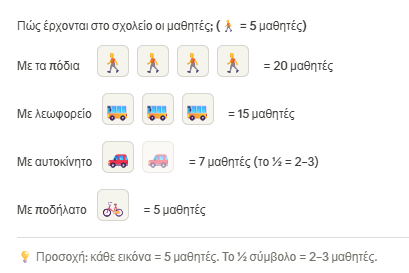
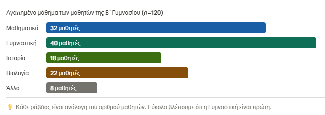
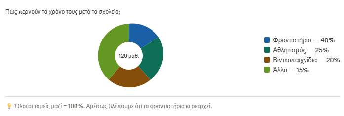
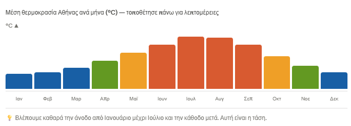

\usepackage{wasysym}
\usepackage{eurosym}
```{=html}
<!-- Φόρτωση βιβλιοθήκης GeoGebra -->
<script src="https://www.geogebra.org/apps/deployggb.js"></script>

<!-- Συνάρτηση δημιουργίας applets -->
<script>
function createGeoGebra(containerId, materialId, width = 700, height = 500) {
  var params = {
    "id": "ggb-" + containerId,
    "material_id": materialId,
    "width": width,
    "height": height,
    "showToolBar": true,
    "showMenuBar": false,
    "showAlgebraInput": true
  };
  
  var applet = new GGBApplet(params, '5.2');
  applet.inject(containerId);
}
</script>
```

## Γραφικές παραστάσεις στην Στατιστική

::: {style="background-color: #f0f8cc; border: 2px solid #2f3e50; color: #25188a; padding: 15px; border-radius: 5px;"}
### Εικονόγραμμα

**Τι είναι;**

Διάγραμμα που χρησιμοποιεί εικόνες ή σύμβολα για να παρουσιάσει δεδομένα.
Κάθε εικόνα αντιστοιχεί σε έναν αριθμό μονάδων που ορίζεται στο υπόμνημα.

Πώς χρησιμοποιούνται:

Διαλέγεις ένα εικονίδιο (π.χ. ένα ανθρωπάκι) και ορίζεις τι “αξίζει” (π.χ. 1 ανθρωπάκι = 5 μαθητές).
Μετά βάζεις τόσα εικονίδια όσα χρειάζονται.

Χρησιμοποιείται κυρίως για απλά, ευχάριστα δεδομένα — ιδανικό για μικρότερες ηλικίες και παρουσιάσεις.
:::

::: callout-note
Να σημειώσουμε ότι πάντα σε όλα τα διαγράμματα παρουσίασης δεδομένων θα πρέπει να υπάρχει **τίτλος** που θα εξηγεί τι ακριβώς παρουσιάζει το διάγραμμα.

Επίσης σε κάθε διάγραμμα θα πρέπει να υπάρχουν όλα τα απαραίτητα στοιχεία που αναφέρουν τις μεταβλητές και τα ποσά ή ποσοστά για κάθε μεταβλητή.
:::

**Παράδειγμα**



::: {style="background-color: #f0f8cc; border: 2px solid #2f3e50; color: #25188a; padding: 15px; border-radius: 5px;"}
### **Ραβδόγραμμα**

**Τι είναι;**

Διάγραμμα με **οριζόντιες ή κατακόρυφες ράβδους** (μπάρες) που δείχνουν ποσότητες.
Το μήκος κάθε ράβδου αντιστοιχεί στην τιμή που παρουσιάζει.

Ιδανικό για **σύγκριση κατηγοριών** μεταξύ τους.
:::

**Παράδειγμα**



::: {style="background-color: #f0f8cc; border: 2px solid #2f3e50; color: #25188a; padding: 15px; border-radius: 5px;"}
### **Κυκλικό διάγραμμα**

**Τι είναι;**

Ένας **κύκλος χωρισμένος σε τομείς** (σαν πίτα), όπου κάθε τομέας δείχνει το ποσοστό που καταλαμβάνει κάθε κατηγορία από το σύνολο.

Ιδανικό για να δείξουμε **πώς μοιράζεται ένα σύνολο (100%)** σε κατηγορίες.
:::

**Παράδειγμα**



**Πως χωρίζω τον κύκλο**

- μετατρέπω την κατηγορία σε ποσοστό $\dfrac{\text{Ποσό κατηγορίας}}{\text{Συνολο όλων των κατηγοριών (Όλο το δείγμα)}}$

- Κάνω αναγωγή στο μέρος του κυκλικού δίσκου.
  Αφού όλος ο δίσκος είναι $360^0$, και το συνολικό ποσοστό των κατηγοριών θα είναι φυσικά 100%, θα πρέπει το α% της κατηγορίας να αντιστοιχεί σε $α\% \cdot{360^0}$

Ετσι για το παραπάνω παράδειγμα θα έχουμε

για το 40% ==\> $40\% \cdot {360^0}=144^0$

για το 25% ==\> $25\% \cdot {360^0}=90^0$

για το 20% ==\> $20\% \cdot {360^0}=72^0$

για το 15% ==\> $15\% \cdot {360^0}=54^0$

Σύνολα: *Ποσοστά* 100% *Μοίρες* $360^0$

::: {style="background-color: #f0f8cc; border: 2px solid #2f3e50; color: #25188a; padding: 15px; border-radius: 5px;"}
### **Χρονόγραμμα**

**Τι είναι;**

Διάγραμμα που δείχνει πώς **μεταβάλλεται μια ποσότητα με το χρόνο**.
Στον οριζόντιο άξονα (x) έχουμε τον χρόνο και στον κατακόρυφο (y) την ποσότητα.

Ιδανικό για να δούμε **τάσεις, αυξήσεις, μειώσεις** μέσα σε χρονική περίοδο.
:::

**Παράδειγμα**



### Εξάσκηση

------------------------------------------------------------------------

**1) Εικονογράμματα – για να “μετράω με εικόνες”**

### Παράδειγμα

“Στην τάξη ρωτήσαμε ποιο κατοικίδιο οι μαθητές έχουν και πήραμε τις παρακάτω απαντήσεις.”

**Δεδομένα**

- Γάτα: 8 μαθητές\
- Σκύλος: 6 μαθητές\
- Ψάρι: 4 μαθητές

**Κανόνας εικονογράμματος** `Παρουσιάστε τα δεδομένα με ένα εικονόγραμμα όπου 1 εικονίδιο = 2 μαθητές`

Άρα

- Γάτα: 8 → 4 εικονίδια\
- Σκύλος: 6 → ▭ εικονίδια\
- Ψάρι: 4 → ▭ εικονίδια

#### Ερωτήσεις κατανόησης

“Ποιο είναι το πιο συχνό;”\
“Πόσο περισσότερες είναι οι γάτες από τα ψάρια;”\
“Αν είχαμε 10 μαθητές με γάτα, τι πρόβλημα θα είχαμε με τα εικονίδια;”

------------------------------------------------------------------------

**2) Ραβδόγραμμα – για γρήγορη σύγκριση**

### Παράδειγμα

“ Ρωτήσαμε τους μαθητές με τι μέσο έρχονται στο σχολείο και μας είπαν:”

**Δεδομένα**

- Με τα πόδια: 10\
- Λεωφορείο: 7\
- Αυτοκίνητο: 5

Παρουσιάστε τα δεδομένα με ένα **Ραβδόγραμμα** .

#### Ερωτήσεις κατανόησης

"Πόσοι περισσότεροι πάνε με πόδια απ' ότι με λεοφωρείο;

“Πόση είναι η διαφορά μεγαλύτερου–μικρότερου;”

“Πόσοι είναι συνολικά οι μαθητές;”

------------------------------------------------------------------------

**3) Κυκλικό διάγραμμα (πίτας) – για “κομμάτια του 100%”**

### Παράδειγμα

“Ρωτήσαμε τους μαθητές πώς μοιράζεται ο ελεύθερος χρόνος τους μέσα σε 1 ημέρα και μας είπαν:”

**Δεδομένα (σε ώρες, σύνολο 24)**

- Ύπνος: 8 ώρες\
- Σχολείο/διάβασμα: 10 ώρες\
- Χόμπι/οθόνες/βόλτα: 6 ώρες

Παρουσιάστε τα δεδομένα με ένα **Κυκλικό διάγραμμα** .

#### Ερωτήσεις κατανόησης

“Ποιο κομμάτι είναι μεγαλύτερο;”\
“Αν ο ύπνος γίνει 9 ώρες, ποιο κομμάτι θα μεγαλώσει και ποιο θα μικρύνει;”

------------------------------------------------------------------------

**4) Χρονογράμματα – για αλλαγή στον χρόνο (τάση)**

### Παράδειγμα

“Μετρήσαμε την Θερμοκρασία στην πόλη μας σε 5 μέρες και βρήκαμε ότι:”

**Δεδομένα**

- Δευτέρα: 18°C\
- Τρίτη: 20°C\
- Τετάρτη: 19°C\
- Πέμπτη: 22°C\
- Παρασκευή: 21°C

Παρουσιάστε τα δεδομένα με ένα **Χρονόγραμμα** .

### Ερωτήσεις κατανόησης

“Ποια μέρα είχαμε τη μεγαλύτερη θερμοκρασία;”\
“Μεταξύ ποιων ημερών η αύξηση ήταν μεγαλύτερη;”\
“Αν συνεχίσει έτσι, τι περίπου περιμένεις το Σάββατο;”

### Παράδειγμα με όλα

#### «Η Β2 κατέγραψε πόσα λεπτά διάβασε κάθε μέρα για 5 μέρες.

Επίσης, σε μια έρευνα στην τάξη, οι μαθητές είπαν ποιο μάθημα διαβάζουν περισσότερο και *πώς μοιράζουν* συνολικά τον χρόνο διαβάσματος.»

Κάντε τα αντίστοιχα διαγράμματα και απαντήστε στις ερωτήσεις

**1) Εικονογράμμα:** **Πόσοι μαθητές διαβάζουν πάνω από 1 ώρα την ημέρα**

**Δεδομένα (έρευνα τάξης)** Από 20 μαθητές:

- Πάνω από 60′: 10 μαθητές
- 30′–60′: 6 μαθητές
- Κάτω από 30′: 4 μαθητές

**Εικονογράμμα (κανόνας)** Θέτεις `1 βιβλιαράκι = 2 μαθητές`.

Άρα:

- Πάνω από 60′ → 10 μαθητές → 5 βιβλιαράκια
- 30′–60′ → 6 μαθητές → 3 βιβλιαράκια
- Κάτω από 30′ → 4 μαθητές → 2 βιβλιαράκια

**ερωτήσεις**

1.  Ποια κατηγορία έχει τους περισσότερους μαθητές;
2.  Πόσοι περισσότεροι διαβάζουν πάνω από 60′ σε σχέση με κάτω από 30′;
3.  Αν το σύνολο ήταν 24 μαθητές και οι αναλογίες ίδιες, πόσοι θα ήταν “πάνω από 60′”;

**2) Ραβδόγραμμα:** Ποιο μάθημα διαβάζουν περισσότερο.

**Δεδομένα**

- Μαθηματικά: 8\
- Γλώσσα: 6\
- Ιστορία: 4\
- Φυσική: 2

**ερωτήσεις**

1.  Ποιο μάθημα έχει τη μεγαλύτερη ράβδο;\
2.  Πόσοι περισσότεροι διάλεξαν Μαθηματικά από Φυσική;\
3.  Αν προστεθούν 3 μαθητές στη Γλώσσα, ποιο μάθημα θα βγει πρώτο;

------------------------------------------------------------------------

**3) Κυκλικό διάγραμμα:** Πώς μοιράζεται το 100% του συνολικού διαβάσματος

**Δεδομένα** (Αν υποθέσουμε ότι σύνολο χρόνου διαβάσματος μιας μέρας = 2 ώρες = 120′)

- Μαθηματικά: 60′\
- Γλώσσα: 30′\
- Ιστορία: 20′\
- Φυσική: 10′

Σε ποσοστά:

- Μαθηματικά: 60/120 = 50%\
- Γλώσσα: 25%\
- Ιστορία: 16,7% (περίπου 17%)\
- Φυσική: 8,3% (περίπου 8%)

**ερωτήσεις**

1.  Ποιο μάθημα πήρε το μεγαλύτερο ποσοστό;\
2.  Μαθηματικά + Γλώσσα μαζί τι ποσοστό είναι; (75%)\
3.  Αν η Φυσική διπλασιαστεί (από 10′ σε 20′) χωρίς να αλλάξει το σύνολο 120′, τι πρέπει να μειωθεί; (κάποιο άλλο κομμάτι)

------------------------------------------------------------------------

**4) Χρονογράφημα:** Πώς αλλάζει ο χρόνος διαβάσματος μέσα στην εβδομάδα

**Δεδομένα** (λεπτά διαβάσματος ανά μέρα) - Δευτέρα: 40′\

- Τρίτη: 50′\
- Τετάρτη: 35′\
- Πέμπτη: 60′\
- Παρασκευή: 45′

**ερωτήσεις**

1.  Ποια μέρα ήταν η μεγαλύτερη τιμή;\
2.  Από ποια μέρα σε ποια είχαμε τη μεγαλύτερη αύξηση; (Τετάρτη → Πέμπτη, +25′)\
3.  Ποια μέρα είχαμε “πτώση” σε σχέση με την προηγούμενη; (Τρίτη→Τετάρτη, Πέμπτη→Παρασκευή)

------------------------------------------------------------------------

### Ερώτηση επιλογής

Αν

- Θέλω να δείξω **ποιο μέρος του συνόλου** πήρε κάθε μάθημα.
  Ποιο διάγραμμα ταιριάζει;\
  Απάντηση: **\_\_\_\_\_\_\_\_\_\_\_\_\_**.

- Θέλω να δείξω **πώς αλλάζει** κάτι μέσα στο χρόνο;\
  Απάντηση: **\_\_\_\_\_\_\_\_\_\_\_\_\_\_\_**.

- Θέλω να **συγκρίνω κατηγορίες** (μαθήματα) γρήγορα.\
  Απάντηση: **\_\_\_\_\_\_\_\_\_\_\_\_\_\_\_\_\_\_**.

- Θέλω κάτι **πιο παιχνιδιάρικο/οπτικό** για μικρούς αριθμούς.\
  Απάντηση: **\_\_\_\_\_\_\_\_\_\_\_\_\_\_\_\_\_\_\_\_**.

[Κατεβάστε ένα Test](Φύλλο%20Εργασίας_%20Διαγράμματα%20(Αθλητισμός).pdf){download="Φύλλο Εργασίας_ Διαγράμματα (Αθλητισμός).pdf"}

------------------------------------------------------------------------

::: callout-tip
:::

------------------------------------------------------------------------

::: callout-important
:::

::: {style="background-color: #f0f8cc; border: 2px solid #2f3e50; color: #25188a; padding: 15px; border-radius: 5px;"}
ΚΑΛΗ ΜΕΛΕΤΗ !
:::
