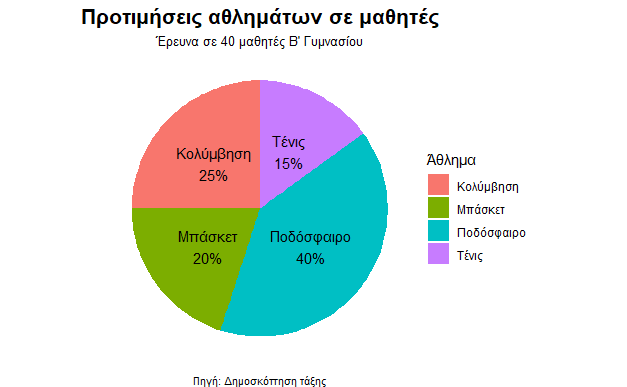
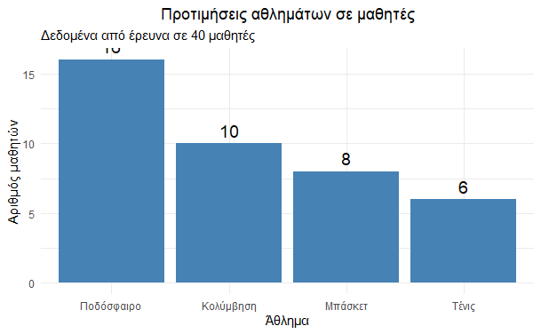

\usepackage{wasysym}
\usepackage{eurosym}
```{=html}
<!-- Φόρτωση βιβλιοθήκης GeoGebra -->
<script src="https://www.geogebra.org/apps/deployggb.js"></script>

<!-- Συνάρτηση δημιουργίας applets -->
<script>
function createGeoGebra(containerId, materialId, width = 700, height = 500) {
  var params = {
    "id": "ggb-" + containerId,
    "material_id": materialId,
    "width": width,
    "height": height,
    "showToolBar": true,
    "showMenuBar": false,
    "showAlgebraInput": true
  };
  
  var applet = new GGBApplet(params, '5.2');
  applet.inject(containerId);
}
</script>
```

## Κατανομή συχνοτήτων

::: {style="background-color: #baace6; border: 2px solid #2f3e50; color: #27f5a; padding: 15px; border-radius: 5px;"}
Στο κεφάλαιο της Περιγραφικής Στατιστικής, η οργάνωση των δεδομένων είναι το πρώτο βήμα για την εξαγωγή συμπερασμάτων

### 1. Θεωρία: Βασικές Έννοιες

- **Συχνότητα (**$f$) η Απόλυτη συχνότητα: Είναι ο αριθμός που εκφράζει πόσες φορές εμφανίζεται μια συγκεκριμένη τιμή της μεταβλητής στο δείγμα που εξετάζουμε.
  Παράδειγμα: Αν εξετάζουμε την βαθμολογία των μαθητών και 8 μαθητές από τους 40 πήραν Α, τότε f = 8.

- **Σχετική Συχνότητα** $f\%$: Είναι το πηλίκο της συχνότητας μιας τιμής προς το συνολικό πλήθος των παρατηρήσεων ($N$).
  Συνήθως εκφράζεται ως ποσοστό επί τοις εκατό (%) με τον τύπο: $$\text{Σχετική Συχνότητα} = \frac{\text{Συχνότητα τιμής}}{\text{Σύνολο παρατηρήσεων}} \times 100$$.
  Αν για παράδειγμα οι μαθητές είναι 40 και 8 από αυτούς πήραν Α , τότε $f\%=\dfrac{f}{N}=\dfrac{8}{40}=0,20=\dfrac{20}{100}=20\%$

- **Πίνακας Κατανομής Συχνοτήτων:** Είναι ένας πίνακας που περιλαμβάνει τις τιμές της μεταβλητής, τη διαλογή (καταμέτρηση), τις συχνότητες και τις σχετικές συχνότητες.
:::

Παράδειγμα

*Ρωτήσαμε 40 μαθητές της Β΄ Γυμνασίου ποιο είναι το αγαπημένο τους άθλημα. Οι απαντήσεις ήταν*:

- Ποδόσφαιρο: 16 μαθητές

- Κολύμβηση: 10 μαθητές

- Μπάσκετ: 8 μαθητές

- Τένις: 6 μαθητές

Πίνακας κατανομής συχνοτήτων

| Μεταβλητή  | Διαλογή | Συχνότητα |   Σχετική συχνότητα   |
|:----------:|:-------:|:---------:|:---------------------:|
| Ποδόσφαιρο |         |    16     | $\dfrac{16}{40}=40\%$ |
| Κολύμβηση  |         |    10     | $\dfrac{10}{40}=25\%$ |
|  Μπάσκετ   |         |     8     | $\dfrac{8}{40}=20\%$  |
|   Τένις    |         |     6     | $\dfrac{6}{40}=15\%$  |
|   Σύνολα   |         |    40     |        $100\%$        |

**Βασικές Ιδιότητες:**

1\.
Το **άθροισμα όλων των συχνοτήτων** ισούται πάντα με το συνολικό πλήθος των παρατηρήσεων ($N$).

2\.
Το **άθροισμα όλων των σχετικών συχνοτήτων** ισούται πάντα με 100 (όταν εκφράζονται ως ποσοστά).

**Παρουσίαση των αποτελεσμάτων με διαγράμματα**

{width="516"}

{width="518"}

------------------------------------------------------------------------

### Ασκήσεις

1.  Ρωτήσαμε 50 μαθητές για το αγαπημένο τους χρώμα. Τα αποτελέσματα που πήραμε ήταν:

- Μπλε: 20
- Κόκκινο: 15
- Πράσινο: 10
- Κίτρινο: 5

|  Χρώμα  | Διαλογή | Συχνότητα | Σχετική συχνότητα |
|:-------:|:-------:|:---------:|:-----------------:|
|  Μπλέ   |         |    20     |                   |
| Κόκκινο |         |    15     |                   |
| Πράσινο |         |    10     |                   |
| Κίτρινο |         |     5     |                   |
| Σύνολα  |         |           |      $100\%$      |

Υπολόγισε τις σχετικές συχνότητες (f%) για κάθε χρώμα:

2.  Σε έρευνα με 80 μαθητές για τον τρόπο μελέτης, βρέθηκαν οι εξής σχετικές συχνότητες:

- Μόνοι τους: 50%

- Με φίλους: 25%

- Με δάσκαλο: 15%

- Άλλο: 10%

Βρείτε τις συχνότητες

3.  **(Αντίστροφη πορεία):** Σε μια αποθήκη υπάρχουν 400 κινητά τηλέφωνα τεσσάρων τύπων ($Α, Β, Γ, Δ$) σε ποσοστά $10\%, 30\%, 40\%, 20\%$ αντίστοιχα.
    Βρείτε τη συχνότητα (πλήθος) για κάθε τύπο τηλεφώνου.

4.  Σε δείγμα 60 ατόμων, η κατηγορία Α έχει απόλυτη συχνότητα f = 15.
    Ποια είναι η σχετική συχνότητα f%;

5.  Σε έρευνα, η κατηγορία «Ναι» εμφανίζεται 24 φορές και η σχετική της συχνότητα είναι 40%.
    Πόσοι συμμετείχαν συνολικά;

6.  Σε πίνακα κατανομής συχνοτήτων 4 κατηγοριών, τρεις έχουν f% = 30%, 25%, 20%.
    Ποια είναι η σχετική συχνότητα της 4ης κατηγορίας;

7.  Οι βαθμοί 10 μαθητών σε ένα τεστ (κλίμακα 0-10) ήταν: 7, 8, 7, 9, 8, 7, 10, 8, 8, 9.
    Να κάνετε διαλογή και αφού φτιάξετε τον πίνακα κατανομής συχνοτήτων και σχετικών συχνοτήτων στη συνέχεια να παρουσιάσετε τα αποτελέσματα με ραβδογράμματα.

8.  Σε μια έρευνα 30 αυτοκινήτων για το χρώμα τους, βρήκαμε ότι είχαν:

- Κόκκινο: 12

- Μπλε: 10

- Άσπρο: 5

- Μαύρο: 3

Φτιάξε πίνακα συχνοτήτων και σχετικών συχνοτήτων.

9.  Σε ένα σχολείο ρώτησαν 50 μαθητές πόσες ώρες βλέπουν τηλεόραση την ημέρα και πήραμε τις παρακάτω απαντήσεις:

Ώρες –\> μαθητές

0 --\> 5

1 --\> 15

2 --\> 20

3 --\> 10

α) Υπολόγισε τη σχετική συχνότητα (κλάσμα και ποσοστό) για κάθε κατηγορία.

β) Πόσοι μαθητές βλέπουν τουλάχιστον 2 ώρες;

γ) Τι ποσοστό βλέπει λιγότερο από 1 ώρα;

10. (Εύκολη) – Χρώματα ματιών

Σε μια τάξη 25 μαθητών καταγράφηκε το χρώμα των ματιών:

- Καφέ: 12 μαθητές
- Μπλε: 8 μαθητές
- Πράσινο: 5 μαθητές

Να φτιάξετε πίνακα με:

1. Απόλυτη συχνότητα (ν)
2. Σχετική συχνότητα (f ως κλάσμα)
3. Σχετική συχνότητα επί τοις εκατό (f%)

11. (Μέτρια) – Αγαπημένο μάθημα

Σε ερώτηση "Ποιο είναι το αγαπημένο σου μάθημα;" 40 μαθητές απάντησαν:

- Μαθηματικά: 14
- Γλώσσα: 12
- Ιστορία: 8
- Φυσική: 6

α) Φτιάξτε πίνακα συχνοτήτων (ν, f, f%).

β) Ποιο μάθημα έχει τη μεγαλύτερη σχετική συχνότητα;

γ) Τι ποσοστό των μαθητών προτιμά τα Μαθηματικά ή τη Φυσική;

12. (Δύσκολη) – Φρούτα που προτιμούν

Σε ένα κυλικείο ρώτησαν 50 μαθητές ποιο φρούτο προτιμούν. Τα αποτελέσματα που πήραμε ήταν τα παρακάτω:

- Μήλο: 18
- Μπανάνα: 15
- Πορτοκάλι: 12
- Αχλάδι: 5

α) Υπολογίστε τη σχετική συχνότητα (f) για κάθε φρούτο (ως δεκαδικό).

β) Υπολογίστε τα ποσοστά (f%).

γ) Πόσοι μαθητές προτιμούν μήλο ή μπανάνα;

δ) Τι ποσοστό προτιμά αχλάδι;

13. (Πίνακας με ελλείψεις) – Αθλήματα

Συμπληρώστε τον παρακάτω πίνακα συχνοτήτων:

| Άθλημα      | Απόλυτη συχνότητα (ν) | Σχετική συχνότητα (f) | Ποσοστό (%) |
|-------------|----------------------|------------------------|--------------|
| Ποδόσφαιρο  | 20                   | ?                      | 40%          |
| Μπάσκετ     | ?                    | 0,25                   | ?            |
| Κολύμβηση   | 10                   | ?                      | 20%          |
| Τένις       | ?                    | 0,15                   | ?            |
| **Σύνολο**  | ?                    | 1                      | 100%         |


14. (Ερμηνεία) – Βιβλία που διαβάστηκαν

Ο παρακάτω πίνακας δείχνει πόσα βιβλία διάβασαν τον περασμένο μήνα 30 μαθητές:

| Αριθμός βιβλίων | 0 | 1 | 2 | 3 | 4 |
|----------------|---|---|---|---|---|
| Μαθητές         | 6 | 9 | 8 | 5 | 2 |

α) Φτιάξτε πίνακα με απόλυτες και σχετικές συχνότητες (κλάσμα και %).

β) Τι ποσοστό μαθητών διάβασε τουλάχιστον 2 βιβλία;

γ) Πόσοι μαθητές διάβασαν λιγότερο από 2 βιβλία;

δ) Αν επιλέξουμε τυχαία έναν μαθητή, ποια η πιθανότητα να διάβασε ακριβώς 3 βιβλία; (Η πιθανότητα είναι η σχετική συχνότητα.)


::: callout-tip
:::

::: callout-important
:::

::: {style="background-color: #f0f8cc; border: 2px solid #2f3e50; color: #25188a; padding: 15px; border-radius: 5px;"}
ΚΑΛΗ ΜΕΛΕΤΗ !
:::
