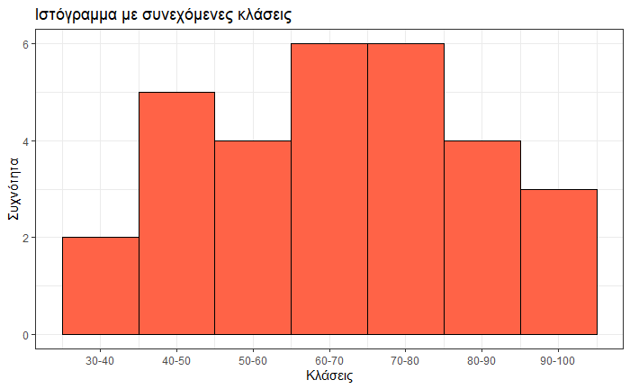
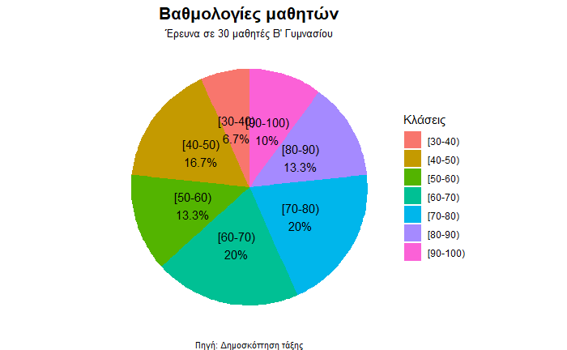

\usepackage{wasysym}
\usepackage{eurosym}
```{=html}
<!-- Φόρτωση βιβλιοθήκης GeoGebra -->
<script src="https://www.geogebra.org/apps/deployggb.js"></script>

<!-- Συνάρτηση δημιουργίας applets -->
<script>
function createGeoGebra(containerId, materialId, width = 700, height = 500) {
  var params = {
    "id": "ggb-" + containerId,
    "material_id": materialId,
    "width": width,
    "height": height,
    "showToolBar": true,
    "showMenuBar": false,
    "showAlgebraInput": true
  };
  
  var applet = new GGBApplet(params, '5.2');
  applet.inject(containerId);
}
</script>
```

## Γραφική παρουσίαση ομαδοποιημένων παρατηρήσεων

::: {style="background-color: #baace6; border: 2px solid #2f3e50; color: #27f5a; padding: 15px; border-radius: 5px;"}
### Τι είναι η ομαδοποίηση παρατηρήσεων;

Όταν έχουμε πολλά δεδομένα, τα χωρίζουμε σε ομάδες (κλάσεις) για να τα οργανώσουμε και να βγάλουμε συμπεράσματα πιο εύκολα.

### Βασικές έννοιες

- **Κλάση (ομάδα)** Ένα διάστημα τιμών, π.χ.
  \[10, 20) σημαίνει από το 10 (το 10 συμπεριλαμβάνεται) έως το 20 (το 20 δεν συμπεριλαμβάνεται).

- **Εύρος κλάσης (w)** Το μήκος του διαστήματος.
  Αν η κλάση είναι \[10, 20), τότε w = 20 − 10 = 10.
  Συνήθως όλες οι κλάσεις έχουν το ίδιο εύρος.

- **Μέση τιμή κλάσης (**$x_i$) Το μέσο σημείο της κλάσης.
  $x_i=\dfrac{\text{κατώτερο+ανώτερο}}{2}$

- **Απόλυτη συχνότητα (fᵢ)** Πόσες παρατηρήσεις πέφτουν μέσα σε κάθε κλάση.

- **Σχετική συχνότητα (fᵢ%)** Το ποσοστό κάθε κλάσης: $fᵢ\% =\dfrac{f_i}{n}\times{100}$ όπου n = σύνολο παρατηρήσεων.
:::

### **Βήματα για να φτιάξω πίνακα συχνοτήτων**

1.  Βρίσκω την ελάχιστη και μέγιστη τιμή των δεδομένων.

2.  Αποφασίζω τον αριθμό κλάσεων (συνήθως 5–8) και υπολογίζω το εύρος w.

3.  Ορίζω τα όρια κάθε κλάσης ξεκινώντας από την ελάχιστη τιμή.

4.  Μετρώ πόσες παρατηρήσεις ανήκουν σε κάθε κλάση (απόλυτη συχνότητα).

5.  Υπολογίζω τη σχετική συχνότητα (%) και συμπληρώνω τον πίνακα.

### **Παράδειγμα**

Σε έναν διαγωνισμό μαθηματικών, 30 μαθητές πήραν τις παρακάτω βαθμολογίες (από 0 έως 100):

45, 62, 78, 55, 88, 91, 34, 70, 63, 47, 82, 59, 76, 41, 95, 67, 53, 80, 72, 38, 65, 49, 86, 74, 57, 92, 61, 43, 77, 69

Βήμα 1: Ελάχιστη = 34, Μέγιστη = 95

Βήμα 2: Διαλέγουμε 7 κλάσεις με εύρος w = 10

Βήμα 3–5: Πίνακας συχνοτήτων

|   Κλάση   | Μέση τιμή | Συχνότητα |   Σχετική συχνότητα    |
|:---------:|:---------:|:---------:|:----------------------:|
| \[30-40)  |    35     |     2     | $\dfrac{2}{30}=6,7\%$  |
| \[40-50)  |    45     |     5     | $\dfrac{5}{30}=16,7\%$ |
| \[50-60)  |    55     |     4     | $\dfrac{4}{30}=13,3\%$ |
| \[60-70)  |    65     |     6     |  $\dfrac{6}{30}=20\%$  |
| \[70-80)  |    75     |     6     |  $\dfrac{6}{30}=20\%$  |
| \[80-90)  |    85     |     4     | $\dfrac{4}{30}=13,3\%$ |
| \[90-100) |    95     |     3     |  $\dfrac{3}{30}=10\%$  |
|  Σύνολα   |           |    30     |        $100\%$         |

### **Γραφική παρουσίαση**

Το **ιστόγραμμα** είναι η γραφική παρουσίαση ομαδοποιημένων δεδομένων.
Κάθε κλάση γίνεται ένα ορθογώνιο — το πλάτος του είναι το εύρος και το ύψος είναι η απόλυτη συχνότητα.
Στο ιστόγραμμα τα ορθογώνια εφάπτονται (δεν έχουν κενά μεταξύ τους).

Για το παράδειγμα μας το ιστόγραμμα θα είναι το παρακάτω

 

και το διάγραμμα πίτας για τις % σχετικές συχνότητες



------------------------------------------------------------------------

### ✏️ ΑΣΚΗΣΕΙΣ

**Άσκηση 1**

10 μαθητές πήραν τους παρακάτω βαθμούς στα Μαθηματικά: 10, 12, 14, 15, 16, 17, 18, 19, 13, 14

👉 Να τους ομαδοποιήσεις σε κλάσεις πλάτους 3 

👉 Να φτιάξεις πίνακα συχνοτήτων 

👉 Να φτιάξεις το ιστόγραμμα

------------------------------------------------------------------------

**Άσκηση 2**

Δίνονται τα ύψη 20 μαθητών (cm): 150, 152,152,162,172,182,178,165,171,158,163,174,177,156, 155, 158, 160, 162, 165, 168.

👉 Να δημιουργήσεις 4 κλάσεις 

👉 Να βρεις τη συχνότητα κάθε κλάσης 

👉 Να βρεις την σχετική% συχνότητα κάθε κλάσης 

👉 Να φτιάξεις το ιστόγραμμα των συχνοτήτων 

👉 Να φτιάξεις διάγραμμα πίτας για τις σχετικές% συχνότηες.
---

**Άσκηση 3**

Δίνονται οι ηλικίες: 12, 14,14,15,15,17,16,17,16,18,13,13, 14, 14, 15, 16, 16, 17, 18, 18

👉 Να κάνεις 5 κλάσεις

👉 Να φτιάξεις πίνακα συχνοτήτων 

👉 Να βρεις τη σχετική συχνότητα κάθε τιμής

👉 Να φτιάξεις το ιστόγραμμα των συχνοτήτων

------------------------------------------------------------------------

**Άσκηση 4**

Δίνονται οι θερμοκρασίες: 20, 22, 23, 24, 25, 26, 27, 28, 29, 30

👉 Να τις ομαδοποιήσεις σε κλάσεις πλάτους 5 

👉 Να κατασκευάσεις ιστόγραμμα (στο τετράδιο)

------------------------------------------------------------------------

**Άσκηση 5**

Δίνονται τα βάρη (kg): 50, 52, 55, 57, 60, 62, 65, 67, 70, 72

👉 Να φτιάξεις πίνακα συχνοτήτων 

👉 Να κατασκευάσεις ιστόγραμμα

------------------------------------------------------------------------

**Άσκηση 6**

Δίνονται οι ώρες μελέτης: 1, 2, 2, 3, 3, 4, 4, 5, 5, 6

👉 Να βρεις:

- τη συχνότητα κάθε τιμής
- τη σχετική συχνότητα

------------------------------------------------------------------------

**Άσκηση 7**

Δίνονται οι αποστάσεις (km): 2, 3, 5, 7, 8, 10, 12, 15, 18, 20

👉 Να τις ομαδοποιήσεις σε 5 κλάσεις 

👉 Να φτιάξεις πίνακα συχνοτήτων

👉 Να φτιάξεις το ιστόγραμμα

------------------------------------------------------------------------

**Άσκηση 8**

Δίνονται οι βαθμοί 30 μαθητών στη Φυσική: 

12, 13, 13, 15,  8, 20,  8, 19, 20, 16,  9, 18,  8, 10, 13,  9, 10, 14, 15, 14,  8, 13, 16, 11, 18, 13, 16, 15, 20, 13.

👉 Να κατασκευάσεις:

- 6 κλάσεις 

- Τον πίνακα συχνοτήτων και σχετικών% συχνοτήτων

- Το ιστόγραμμα συχνοτήτων

- κυκλικό διάγραμμα των σχετικών% συχνοτήτων

------------------------------------------------------------------------

**Άσκηση 9**

Δίνονται τα ύψη 30 μαθητών του τμήματος $Β_1$:

160 154 145 145 171 147 156 168 156 151 150 140 142 155 171 147 172 175 155 155 145 158 148 147 145 169 141 157 142 142

👉 Να βρεις:

- τη μικρότερη τιμή
- τη μεγαλύτερη τιμή
- Να τις χωρίσεις σε κλάσεις
- Να κάνεις τον πίνακα συχνοτήτων 
- Να κάνεις το ιστόγραμμα 

------------------------------------------------------------------------

**Άσκηση 10 (συνδυαστική)**

Δίνονται οι βαθμοί: 12, 13, 15, 15, 16, 17, 18, 18, 19, 20, 14, 16

👉 Να κάνεις:

1.  Ομαδοποίηση σε κλάσεις πλάτους 4
2.  Πίνακα συχνοτήτων
3.  Ιστόγραμμα
4.  Σχόλια για τα δεδομένα

------------------------------------------------------------------------


::: callout-tip
:::

::: callout-important
:::

::: {style="background-color: #f0f8cc; border: 2px solid #2f3e50; color: #25188a; padding: 15px; border-radius: 5px;"}
ΚΑΛΗ ΜΕΛΕΤΗ !
:::
