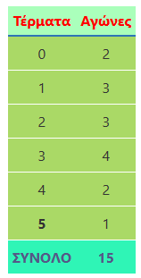
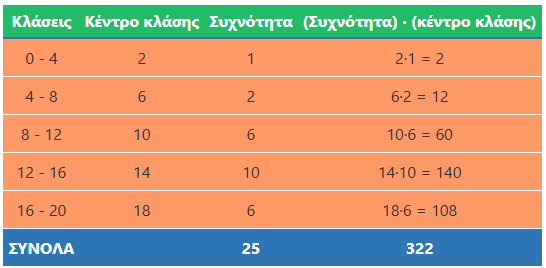
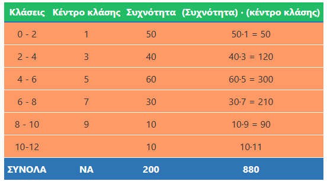
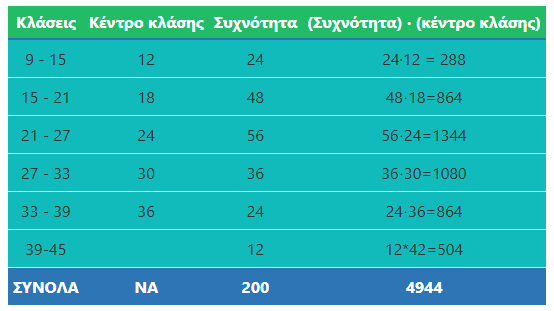
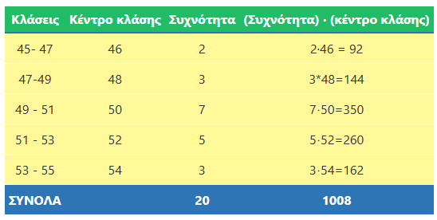

\usepackage{wasysym}
\usepackage{eurosym}
```{=html}
<!-- Φόρτωση βιβλιοθήκης GeoGebra -->
<script src="https://www.geogebra.org/apps/deployggb.js"></script>

<!-- Συνάρτηση δημιουργίας applets -->
<script>
function createGeoGebra(containerId, materialId, width = 700, height = 500) {
  var params = {
    "id": "ggb-" + containerId,
    "material_id": materialId,
    "width": width,
    "height": height,
    "showToolBar": true,
    "showMenuBar": false,
    "showAlgebraInput": true
  };
  
  var applet = new GGBApplet(params, '5.2');
  applet.inject(containerId);
}
</script>
```

## Μέση τιμή - Διάμεσος

::: {style="background-color: #baace6; border: 2px solid #2f3e50; color: #27f5a; padding: 15px; border-radius: 5px;"}
### **Θεωρία: Μέση Τιμή και Διάμεσος**

**1. Μέση Τιμή (ή Μέσος Όρος)** Η μέση τιμή ενός συνόλου παρατηρήσεων είναι το πηλίκο του αθροίσματος των τιμών των παρατηρήσεων διά του πλήθους τους.

\* **Τύπος:** $\text{Μέση τιμή} = \dfrac{\text{Άθροισμα παρατηρήσεων}}{\text{Πλήθος παρατηρήσεων}}$.

**2. Διάμεσος** Διάμεσος ενός συνόλου παρατηρήσεων που είναι τοποθετημένες σε **αύξουσα σειρά** είναι η τιμή που βρίσκεται ακριβώς στη μέση.

\* Αν το πλήθος των παρατηρήσεων είναι **περιττός αριθμός**, η διάμεσος είναι η μεσαία παρατήρηση.

\* Αν το πλήθος είναι **άρτιος αριθμός**, η διάμεσος είναι ο μέσος όρος των δύο μεσαίων παρατηρήσεων.
:::

------------------------------------------------------------------------

### **Παραδείγματα**

**Άσκηση 1: Υπολογισμός Μέσης Τιμής** Η Έλενα πήρε τους εξής βαθμούς στην Ιστορία: 16, 14, 18, 18 και 14.
Ποιος είναι ο γενικός της βαθμός;

\* **Λύση:**

Προσθέτουμε τους βαθμούς: 16 + 14 + 18 + 18 + 14 = 80.

Διαιρούμε με το πλήθος $Ν=5$:      $\quad \dfrac{80}{5} = 16\quad$.
Άρα η μέση τιμή είναι 16.

**Άσκηση 2: Διάμεσος με περιττό πλήθος** Να βρεθεί η διάμεσος των τιμών: 3, 5, 2, 7, 3, 2, 4, 6, 6, 4, 3.

\* **Λύση:**

Τις βάζουμε σε σειρά: 2, 2, 3, 3, 3, **4**, 4, 5, 6, 6, 7.

Το πλήθος είναι 11 (περιττός).
Η μεσαία τιμή (6η στη σειρά) είναι το 4.
Άρα Διάμεσος = 4.

**Άσκηση 3: Διάμεσος με άρτιο πλήθος** Να βρεθεί η διάμεσος των τιμών: 12, 15, 14, 17, 13, 18, 15, 16, 13, 17, 12, 11.

\* **Λύση:**

Σε αύξουσα σειρά: 11, 12, 12, 13, 13, **14, 15**, 15, 16, 17, 17, 18.

Το πλήθος είναι 12 (άρτιος).
Οι δύο μεσαίες είναι το 14 και το 15.

$\text{Διάμεσος} = \dfrac{14 + 15}{2} = 14,5$.

**Άσκηση 4: Μέσος όρος δύο ομάδων (Σύνθετη Μέση Τιμή)** Σε μια ομάδα μπάσκετ 14 αθλητές έχουν μέσο ύψος 188 cm και 16 αθλήτριες έχουν 178 cm.
Ποιο είναι το μέσο ύψος όλης της ομάδας;

- **Λύση:**

Συνολικό ύψος αθλητών: $14 \cdot 188 = 2632$ cm.

Συνολικό ύψος μαθητριών: $16 \cdot 178 = 2848$ cm.

Άθροισμα: 2632 + 2848 = 5480 cm.

Πλήθος αθλητών: 14 + 16 = 30.

Μέση τιμή: $\dfrac{5480}{30} = 182,67 \quad cm$.

**Άσκηση 5: Διάμεσος σε πίνακα συχνοτήτων (μη ομαδοποιημένο)** Μια ομάδα πέτυχε τέρματα σε 15 αγώνες οπως δείχνει ο παρακάτω πίνακας:



\* **Λύση:** Το πλήθος είναι 15 (περιττός), άρα η διάμεσος είναι η 8η παρατήρηση.

Συσσωρευμένες συχνότητες:

2 (για το 0),

2+3=5 (για το 1),

5+3=8 (για το 2).

Η 8η παρατήρηση είναι το 2.
Άρα Διάμεσος = 2.

------------------------------------------------------------------------

### **Άλυτες Ασκήσεις για Εξάσκηση**

1.  **Θερμοκρασίες:** Οι μεσημεριανές θερμοκρασίες ενός δεκαημέρου ήταν:

    15, 17, 15, 16, 18, 15, 14, 15, 16, 19.

    Βρείτε τη μέση τιμή και τη διάμεσο.

2.  **Σύγκριση Μαθητών:**

Ο μαθητής Α έχει βαθμούς 18, 17, 16, 19, 20 και

ο μαθητής Β έχει 19, 19, 18, 18, 19.

Ποιος έχει καλύτερο μέσο όρο;

3.  **Απουσίες:** Σε ένα δείγμα 17 μαθητών καταγράφηκαν οι απουσίες τους.
    Αν η μέση τιμή είναι 15 και προστεθεί ένας μαθητής με 55 απουσίες, πώς θα αλλάξει ο μέσος όρος;

4.  **Εύρεση Άγνωστης Τιμής:** Η μέση τιμή 5 αριθμών είναι 18.
    Αν οι τέσσερις είναι 10, 15, 20, 25, ποιος είναι ο πέμπτος;.

5.  **Μπάσκετ:** Τα ύψη 8 αθλητών είναι: 172, 175, 183, 177, 190, 193, 189, 195 cm.
    Βρείτε τη διάμεσο.

6.  **Μισθοί:** Οι μηνιαίες αποδοχές 4 εργαζομένων είναι 700€, 800€, 900€ και 2100€.
    Γιατί η διάμεσος (850€) αντιπροσωπεύει καλύτερα τους περισσότερους από τη μέση τιμή (1125€);

::: callout-tip
Η επιλογή ανάμεσα στη μέση τιμή και τη διάμεσο εξαρτάται κυρίως από το αν υπάρχουν ακραίες τιμές στο δείγμα σου:

- **Μέση Τιμή:** Είναι κατάλληλη όταν οι παρατηρήσεις είναι σχετικά κοντά η μία στην άλλη. Το μειονέκτημά της είναι ότι **επηρεάζεται σημαντικά από ακραίες τιμές** (πολύ μεγάλες ή πολύ μικρές), οι οποίες μπορούν να την «τραβήξουν» προς το μέρος τους, με αποτέλεσμα να μην δίνει σωστή εικόνα για το σύνολο.
- **Διάμεσος:** Ενδείκνυται όταν υπάρχουν πολύ μεγάλες ή πολύ μικρές τιμές που αποκλίνουν από τις υπόλοιπες. Η διάμεσος **δεν επηρεάζεται από τις ακραίες τιμές** και συχνά «προσεγγίζει» καλύτερα την πραγματικότητα για τους περισσότερους,.

**Παράδειγμα:** Αν σε μια επιχείρηση 7 εργαζόμενοι παίρνουν κάτω από 1000€ και 2 διευθυντές παίρνουν πάνω από 2000€, η μέση τιμή θα αυξηθεί λόγω των δύο μεγάλων μισθών.
Σε αυτή την περίπτωση, η διάμεσος (η τιμή που βρίσκεται ακριβώς στη μέση) αντιπροσωπεύει καλύτερα τις αποδοχές της πλειοψηφίας των εργαζομένων.
:::

7.  **Παιδιά Οικογενειών:** Σε 15 οικογένειες ο αριθμός των παιδιών είναι: 0, 1, 1, 2, 2, 2, 2, 3, 3, 3, 4, 4, 5, 1, 2.
    Βρείτε τη διάμεσο.

8.  **Διαγώνισμα:** Σε ένα τεστ με άριστα το 20, 11 μαθητές πήραν: 5, 8, 10, 12, 13, 14, 15, 16, 18, 19, 20.
    Βρείτε τη μεσαία παρατήρηση.

9.  **Μεταβολή Τιμών:** Αν σε όλες τις παρατηρήσεις ενός συνόλου προσθέσουμε τον αριθμό 5, πώς θα επηρεαστεί η μέση τιμή και η διάμεσος;.

------------------------------------------------------------------------

## Μέση τιμή - Διάμεσος ομαδοποιημένων παρατηρήσεων

::: {style="background-color: #f0f8cc; border: 2px solid #2f3e50; color: #25188a; padding: 15px; border-radius: 5px;"}
### **Θεωρία: Ομαδοποιημένες Παρατηρήσεις**

- **Κέντρο Κλάσης:** Είναι ο μέσος όρος των δύο άκρων μιας κλάσης. Για την κλάση 40–46, το κέντρο είναι $\dfrac{40+46}{2} = 43$.
- **Εκτίμηση Μέσης Τιμής:** Όταν οι τιμές είναι σε κλάσεις, δεν ξέρουμε την ακριβή τιμή κάθε παρατήρησης. Θεωρούμε ότι όλες οι παρατηρήσεις μιας κλάσης αντιπροσωπεύονται από το κέντρο της.
  1.  Βρίσκουμε τα κέντρα των κλάσεων.
  2.  Πολλαπλασιάζουμε κάθε κέντρο με τη συχνότητα της κλάσης.
  3.  Προσθέτουμε τα γινόμενα και διαιρούμε με το συνολικό πλήθος.
- **Διάμεσος:** Στις ομαδοποιημένες παρατηρήσεις, η διάμεσος είναι η τιμή που χωρίζει το δείγμα σε δύο ίσα μέρη. Συνήθως αναζητούμε την κλάση στην οποία ανήκει η μεσαία παρατήρηση.
:::

------------------------------------------------------------------------

### **5 Λυμένες Ασκήσεις**

**Άσκηση 1: Μέση τιμή βαθμολογίας**

Δίνονται οι βαθμοί 25 μαθητών σε κλάσεις, βρείτε την μέση τιμή:

\* **Λύση:**



1\.
Κέντρα κλάσεων: 2, 6, 10, 14, 18.

2\.
Γινόμενα: $(1 \cdot 2) + (2 \cdot 6) + (6 \cdot 10) + (10 \cdot 14) + (6 \cdot 18) = 2 + 12 + 60 + 140 + 108 = 322$.

3\.
Μέση τιμή: $\dfrac{322}{25} = 12,88$.

**Άσκηση 2: Μέση ηλικία παιδιών** Σε μια πόλη 200 παιδιά παρουσίασαν αλλεργία όπως φαίνεται στον παρακάτω πίνακα:



\* **Λύση:**

1\.
Κέντρα: 1, 3, 5, 7, 9, 11.

2\.
Άθροισμα γινομένων:

$(50 \cdot 1) + (40 \cdot 3) + (60 \cdot 5) + (30 \cdot 7) + (10 \cdot 9) + (10 \cdot 11) =$

$=50 + 120 + 300 + 210 + 90 + 110 = 880$.

3.  Μέση ηλικία: $\dfrac{880}{200} = 4,4$ έτη.

**Άσκηση 4: Μέση τιμή ηλικίας φιλάθλων** Σε δείγμα 200 φιλάθλων τένις ο πίνακας κατανομής συχνοτήτων είναι ο παρακάτω.



\* **Λύση:**

1\.
Κέντρα: 12, 18, 24, 30, 36, 42.

2\.
Άθροισμα:

$(24 \cdot 12) + (48 \cdot 18) + (56 \cdot 24) + (36 \cdot 30) + (24 \cdot 36) + (12 \cdot 42) =$

$=288 + 864 + 1344 + 1080 + 864 + 504 = 4944$.

3.  Μέση τιμή: $\dfrac{4944}{200} = 24,72$ έτη.

**Άσκηση 5: Μέση τιμή τιμών πώλησης** Σε 20 σημεία πώλησης είχαμε τις τιμές πώλησης ως εξής: 45–47 (2 σημεία), 47–49 (3), 49–51 (7), 51–53 (5), 53–55 (3).

Να βρείτε την μέση τιμή και την διάμεσο



\* **Λύση: Μέση τιμή**

1\.
Κέντρα: 46, 48, 50, 52, 54.

2\.
Άθροισμα: $(2 \cdot 46) + (3 \cdot 48) + (7 \cdot 50) + (5 \cdot 52) + (3 \cdot 54) =$

$=92 + 144 + 350 + 260 + 162 = 1008$.

3\.
Μέση τιμή: $\dfrac{1008}{20} = 50,4$.

- **Διάμεσος**

1.  **Εύρεση της θέσης:** Επειδή το συνολικό πλήθος των παρατηρήσεων είναι $N = 20$ (άρτιος αριθμός), η διάμεσος είναι ο μέσος όρος της **10ης** και της **11ης** παρατήρησης.
2.  **Εύρεση της κλάσης:** Υπολογίζουμε τις συσσωρευμένες συχνότητες για να δούμε πού πέφτουν αυτές οι παρατηρήσεις:
    - 1η κλάση (45–47): **2** σημεία.
    - 2η κλάση (47–49): 2 + 3 = **5** σημεία.
    - 3η κλάση (49–51): 5 + 7 = **12** σημεία. Αφού η 3η κλάση φτάνει μέχρι τη 12η παρατήρηση, τόσο η 10η όσο και η 11η τιμή βρίσκονται στην κλάση **49–51**.
3.  **Υπολογισμός τιμής:** Στα ομαδοποιημένα δεδομένα, θεωρούμε ότι οι παρατηρήσεις μιας κλάσης αντιπροσωπεύονται από το **κέντρο** της.
    - Κέντρο κλάσης 49–51: $(49 + 51) / 2 =$ **50**.

Άρα, η εκτίμηση της διαμέσου είναι **50**.

------------------------------------------------------------------------

### **Άλυτες Ασκήσεις**

1.  **Ταχύτητες:** Η τροχαία έλεγξε 50 αυτοκίνητα και βρήκε τα εξής:

60–80 km/h (έτρεχαν 5 αυτοκίνητα),

80–100 (έτρεχαν 8 αυτοκίνητα), 

100–120 (έτρεχαν 15 αυτοκίνητα),

120–140 (έτρεχαν 12 αυτοκίνητα), 

140–160 (έτρεχαν 7 αυτοκίνητα), 

160–180 (έτρεχαν 3 αυτοκίνητα).

    Βρείτε τη μέση ταχύτητα.

2.  **Ηλικίες Υπαλλήλων:** Σε σύνολο 120 ατόμων βρήκαμε ότι : 

20–30 ετών (ήταν 12 άτομα),

30–40 (ήταν 36 άτομα),

40–50 (ήταν x άτομα),

50–60 (ήταν 48 άτομα).

    Βρείτε τη συχνότητα x και τη μέση ηλικία.

3.  **Απουσίες:** Σε δείγμα 60 μαθητών μετρήσαμε τις απουσίες που έκαναν το β τρίμηνο και πήραμε τα εξής αποτελέσματα: 

0 ημέρες (35 μαθητές),

1 ημέρα (12 μαθητές),

2 ημέρες (8 μαθητές), 

3 ημέρες (2 μαθητές),

4 ημέρες (3 μαθητές).

    Βρείτε τη μέση τιμή και τη διάμεσο.

4.  **Βαθμολογία Τεστ:** Οι βαθμοί 20 μαθητών ομαδοποιήθηκαν ως εξής:

0–4 μονάδες ==> (1 μαθητής),

4–8 μονάδες ==>  (4 μαθητές), 

8–12 μονάδες ==>  (5 μαθητές),

12–16 μονάδες ==>  (6 μαθητές),

16–20 μονάδες ==>  (4 μαθητές).

    Υπολογίστε την εκτίμηση της μέσης τιμής.

5.  **Ημέρες Ξεκούρασης:** Ομαδοποιήστε τις παρατηρήσεις 

2, 3, 1, 2, 6, 1, 1, 2, 0, 5, 4, 7, 2, 4, 7 

σε κλάσεις πλάτους 2 (0–2, 2–4 κ.λπ.) και βρείτε τη μέση τιμή.

6. Ο αριθμός των τροχαίων παραβάσεων στην Εθνική Οδό, που έγινε κατά τη διάρκεια ενός μήνα ανά ημέρα, ήταν:

261, 211, 223, 282, 272, 211, 233, 267, 247, 243, 207, 221, 294, 201, 249, 214, 242, 211, 262, 285, 298, 272, 214, 232, 215, 272, 245, 241, 263, 242.

α) Να ομαδοποιήσετε τα δεδομένα σε πέντε κλάσεις ίσου πλάτους. **200–220**, **220–240**, **240–260**, **260–280** και **280–300**

β) Να κατασκευάσετε τον πίνακα συχνοτήτων.

γ) Να βρείτε την μέση τιμή και την διάμεσο


7.  **Ασθένειες:** Μετρήσαμε τις ημέρες που ασθένησαν 80 εργαζόμενοι σε διάστημα ενός έτους και βρήκαμε ότι:

0–10 ημέρες ασθένησε το (35%),

10–20 ημέρες ασθένησε το (40%),

20–30 ημέρες ασθένησε το  (15%),

30–40 ημέρες ασθένησε το (10%).

    Βρείτε τη μέση τιμή των ημερών ασθένειας.

8.  **Ύψος Μαθητών:** 20 μαθητές έχουν ύψη σε κλάσεις:

1,5–1,6 m (5 μαθητές),

1,6–1,7 (6 μαθητές),

1,7–1,8 (8 μαθητές),

1,8–1,9 (1 μαθητές).

    Βρείτε τη μέση τιμή.

9.  **Θερμοκρασίες Νοεμβρίου:** Κατασκευάστε πίνακα συχνοτήτων για τις τιμές 10, 14, 12, 16...
    (30 παρατηρήσεις δικές σας) και βρείτε τη μέση θερμοκρασία και τη διάμεσο.

10. **Βάρος Μαθητών:** 80 μαθητές ομαδοποιήθηκαν σε κλάσεις πλάτους 6 kg ανάλογα με το βάρος τους

(40–46, 46–52 κ.λπ.) με συχνότητες 8, 13, 26, 20, 7, 4, 2. (πόσες κλάσεις θα δημιουργήσετε;)

    Βρείτε την εκτίμηση της μέσης τιμής.

11. **Ομαδοποίηση:** Ομαδοποιήστε τις παρατηρήσεις 2, 3, 1, 2, 6, 1, 1, 2, 0, 5 σε δύο κλάσεις (0-3 και 3-6) και βρείτε την εκτίμηση της μέσης τιμής.


::: callout-tip
:::

::: callout-important
:::

::: {style="background-color: #f0f8cc; border: 2px solid #2f3e50; color: #25188a; padding: 15px; border-radius: 5px;"}
ΚΑΛΗ ΜΕΛΕΤΗ !
:::
