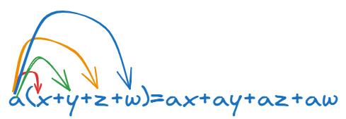
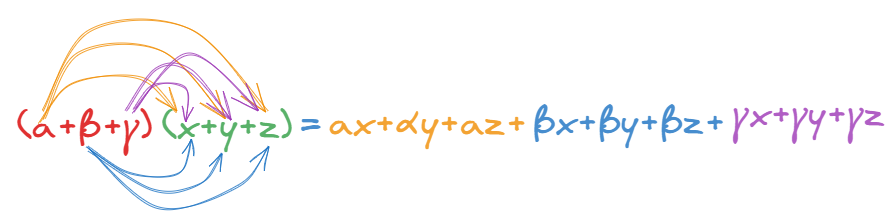

```{=html}
<!-- Φόρτωση βιβλιοθήκης GeoGebra -->
<script src="https://www.geogebra.org/apps/deployggb.js"></script>

<!-- Συνάρτηση δημιουργίας applets -->
<script>
function createGeoGebra(containerId, materialId, width = 700, height = 500) {
  var params = {
    "id": "ggb-" + containerId,
    "material_id": materialId,
    "width": width,
    "height": height,
    "showToolBar": true,
    "showMenuBar": false,
    "showAlgebraInput": true
  };
  
  var applet = new GGBApplet(params, '5.2');
  applet.inject(containerId);
}
</script>
```

## Πολλαπλασιασμός πολυωνύμων

### Πολλαπλασιασμός μονωνύμου με πολυώνυμο

::: {style="background-color: #d3deb8; border: 2px solid #2f3e50; color: #25188a; padding: 15px; border-radius: 5px;"}
Για να πολλαπλασιάσουμε ένα μονώνυμο με ένα πολυώνυμο, εφαρμόζουμε την **επιμεριστική ιδιότητα** και τον πολλαπλασιασμό μονωνύμου με μονώνυμο.
Σύμφωνα με την ιδιότητα αυτή, το μονώνυμο πολλαπλασιάζεται με **κάθε όρο** του πολυωνύμου που βρίσκεται μέσα στην παρένθεση.
Η απλούστερη μορφή είναι: $$α(x+y+z+ω)=αx+αy+αz+αω$$


:::

Η διαδικασία ακολουθεί συγκεκριμένα βήματα για κάθε επιμέρους πολλαπλασιασμό:

\* **Πολλαπλασιάζουμε τους συντελεστές** (τους αριθμούς) μεταξύ τους.

\* **Πολλαπλασιάζουμε το κύριο μέρος** (τις μεταβλητές), εφαρμόζοντας τις ιδιότητες των δυνάμεων.
Συγκεκριμένα, όταν έχουμε την ίδια βάση, διατηρούμε τη βάση και **προσθέτουμε τους εκθέτες**.

\* **Προσέχουμε τα πρόσημα**, καθώς ο πολλαπλασιασμός περιλαμβάνει και το πρόσημο του μονωνύμου.
Για παράδειγμα, αν ένα αρνητικό μονώνυμο πολλαπλασιαστεί με έναν αρνητικό όρο, το αποτέλεσμα θα είναι θετικό.

**Παραδείγματα:**

1.  Στον πολλαπλασιασμό $x(2x + 4)$, το $x$ πολλαπλασιάζεται με το $2x$ και με το $4$, δίνοντας αποτέλεσμα $x\cdot2x+x\cdot4=2x^2 + 4x$.
2.  Στην παράσταση $3x^2(xy - 2)$, το $3x^2$ πολλαπλασιάζεται με το $xy$ (προσθέτοντας τους εκθέτες του $x$) και με το $-2$, προκύπτοντας το πολυώνυμο $3x^2\cdot xy-3x^2\cdot2=3x^3y - 6x^2$.
3.  Αν έξω από την παρένθεση υπάρχει αρνητικό μονώνυμο, όπως στο $-3(2 - 5x)$, το αποτέλεσμα είναι $-6 + 15x$.

Η ικανότητα εκτέλεσης αυτών των πολλαπλασιασμών είναι θεμελιώδης για την κατανόηση ανώτερων αλγεβρικών δομών, όπως η **παραγοντοποίηση** και οι **αξιοσημείωτες ταυτότητες**.

### Πολλαπλασιασμός πολυωνύμου με πολυώνυμο

::: {style="background-color: #d3deb8; border: 2px solid #2f3e50; color: #25188a; padding: 15px; border-radius: 5px;"}
Για να πολλαπλασιάσουμε ένα πολυώνυμο με ένα άλλο πολυώνυμο, εφαρμόζουμε επανειλημμένα την **επιμεριστική ιδιότητα**.
Η πιο απλή μορφή: $$(α+β+γ)(x+y+z)=αx+αy+αz+βx+βy+βz+γx+γy+γz$$



Η διαδικασία περιλαμβάνει τα εξής βήματα:

1.  **Πολλαπλασιάζουμε κάθε όρο** του πρώτου πολυωνύμου με **κάθε όρο** του δεύτερου πολυωνύμου.
2.  Σε κάθε επιμέρους πολλαπλασιασμό μονωνύμων, πολλαπλασιάζουμε τους συντελεστές μεταξύ τους και προσθέτουμε τους εκθέτες των μεταβλητών με την ίδια βάση.
3.  Αφού ολοκληρωθούν όλοι οι πολλαπλασιασμοί, κάνουμε **αναγωγή ομοίων όρων**, δηλαδή προσθέτουμε ή αφαιρούμε τα μονώνυμα που έχουν το ίδιο κύριο μέρος, ώστε να γραφτεί το τελικό πολυώνυμο στην πιο απλή του μορφή.

**Βασικές Ιδιότητες:**

- **Βαθμός Γινομένου:** Ο βαθμός του πολυωνύμου που προκύπτει από τον πολλαπλασιασμό είναι ίσος με το **άθροισμα των βαθμών** των δύο πολυωνύμων που πολλαπλασιάστηκαν. Για παράδειγμα, αν ένα πολυώνυμο 3ου βαθμού πολλαπλασιαστεί με ένα πολυώνυμο 4ου βαθμού, το γινόμενο θα είναι 7ου βαθμού.
- **Πρόσημα:** Πρέπει να δίνεται ιδιαίτερη προσοχή στα πρόσημα των όρων (π.χ. ο πολλαπλασιασμός δύο αρνητικών όρων δίνει θετικό αποτέλεσμα).
:::

**Παραδείγματα:**\
\* $(x + 1)(x - 1) = x^2 - x + x - 1 = \mathbf{x^2 - 1}$.\
\* $(2\alpha - 3\beta)(-4\alpha + 2\beta) = -8\alpha^2 + 4\alpha\beta + 12\alpha\beta - 6\beta^2 = \mathbf{-8\alpha^2 + 16\alpha\beta - 6\beta^2}$.\
\* $(x^2 - 2x + 4)(x + 2) = x^3 + 2x^2 - 2x^2 - 4x + 4x + 8 = \mathbf{x^3 + 8}$.

Αυτή η μέθοδος είναι απαραίτητη για την ανάπτυξη **αξιοσημείωτων ταυτοτήτων**, όπως το τετράγωνο αθροίσματος $(a+b)^2$, οι οποίες στην πραγματικότητα αποτελούν συντομεύσεις αυτού του γενικού κανόνα πολλαπλασιασμού.

Όταν έχουμε να πολλαπλασιάσουμε **τρία ή περισσότερα πολυώνυμα**, η βασική αρχή παραμένει η ίδια: εφαρμόζουμε την επιμεριστική ιδιότητα πολλαπλασιάζοντας τα πολυώνυμα **ανά δύο**.

Πολλαπλασιάζουμε πρώτα τα δύο πρώτα πολυώνυμα, βρίσκουμε το αποτέλεσμα και στη συνέχεια πολλαπλασιάζουμε αυτό το νέο πολυώνυμο με το επόμενο, και ούτω καθεξής.

**Παράδειγμα με 3 πολυώνυμα**

Ας δούμε τον πολλαπλασιασμό: $(3x - 2)(x^2 - x)(4x - 3)$:

1.  **Πρώτο βήμα:** Πολλαπλασιάζουμε τα δύο πρώτα πολυώνυμα: $(3x - 2)(x^2 - x) = 3x^3 - 3x^2 - 2x^2 + 2x = \mathbf{3x^3 - 5x^2 + 2x}$
2.  **Δεύτερο βήμα:** Πολλαπλασιάζουμε το αποτέλεσμα με το τρίτο πολυώνυμο: $(3x^3 - 5x^2 + 2x)(4x - 3) = 12x^4 - 9x^3 - 20x^3 + 15x^2 + 8x^2 - 6x$
3.  **Τελικό αποτέλεσμα** (μετά την αναγωγή ομοίων όρων): $12x^4 - 29x^3 + 23x^2 - 6x$

**Παράδειγμα με 4 πολυώνυμα**

Ένα χαρακτηριστικό παράδειγμα :

$(\alpha - \beta)(\alpha + \beta)(\alpha^2 + \beta^2)(\alpha^4 + \beta^4)$:

1.  **Πολλαπλασιάζουμε τα δύο πρώτα:** $(\alpha - \beta)(\alpha + \beta) = \mathbf{\alpha^2 - \beta^2}$
2.  **Πολλαπλασιάζουμε το αποτέλεσμα με το τρίτο:** $(\alpha^2 - \beta^2)(\alpha^2 + \beta^2) = \mathbf{\alpha^4 - \beta^4}$
3.  **Πολλαπλασιάζουμε με το τέταρτο:** $(\alpha^4 - \beta^4)(\alpha^4 + \beta^4) = \mathbf{\alpha^8 - \beta^8}$

::: {.callout-tip style="color: #78573b;"}
**Χρήσιμες παρατηρήσεις:**

- Σε σύνθετες παραστάσεις που περιλαμβάνουν πολλές πράξεις, ακολουθούμε πάντα την **προτεραιότητα των πράξεων**: πρώτα οι δυνάμεις, μετά οι πολλαπλασιασμοί μέσα στις παρενθέσεις και στο τέλος οι προσθέσεις και αφαιρέσεις.

- Αν στην παράσταση υπάρχουν και μονώνυμα έξω από τις παρενθέσεις, όπως στο παράδειγμα $-2x(x^2 - x + 1)(x - 2)$, μπορούμε είτε να πολλαπλασιάσουμε πρώτα τις παρενθέσεις μεταξύ τους και μετά το μονώνυμο, είτε το μονώνυμο με την πρώτη παρένθεση και το αποτέλεσμα με τη δεύτερη.
:::

### Πολλαπλασιασμός πολυωνύμων κάθετα

::: {style="background-color: #d3deb8; border: 2px solid #2f3e50; color: #25188a; padding: 15px; border-radius: 5px;"}
Ο κάθετος πολλαπλασιασμός πολυωνύμων ακολουθεί την ίδια λογική με τον πολλαπλασιασμό των πολυψηφίων αριθμών, εφαρμόζοντας με συστηματικό τρόπο την **επιμεριστική ιδιότητα**.
Αν και τα βιβλία επικεντρώνονται στην οριζόντια ανάπτυξη των γινομένων, η κάθετη μέθοδος είναι μια πρακτική οργάνωση της ίδιας διαδικασίας.

Τα βήματα για την εφαρμογή του κάθετου πολλαπλασιασμού είναι τα εξής:

1.  **Διάταξη των πολυωνύμων:** Γράφουμε τα δύο πολυώνυμα το ένα κάτω από το άλλο, αφού πρώτα τα διατάξουμε κατά τις **φθίνουσες δυνάμεις** της μεταβλητής τους (από τον μεγαλύτερο εκθέτη προς τον μικρότερο).
2.  **Πολλαπλασιασμός όρων:** Πολλαπλασιάζουμε κάθε όρο του κάτω πολυωνύμου με κάθε όρο του πάνω πολυωνύμου. Σε κάθε επιμέρους πολλαπλασιασμό μονωνύμων, πολλαπλασιάζουμε τους συντελεστές και **προσθέτουμε τους εκθέτες** των ίδιων μεταβλητών.
3.  **Κάθετη στοίχιση ομοίων όρων:** Κάθε μερικό γινόμενο που προκύπτει από έναν όρο του κάτω πολυωνύμου γράφεται σε νέα γραμμή. Είναι σημαντικό να τοποθετούμε τους **όμοιους όρους** (μονώνυμα με το ίδιο κύριο μέρος) στην ίδια κάθετη στήλη.
4.  **Τελική άθροιση:** Προσθέτουμε τις στήλες των ομοίων όρων για να βρούμε το τελικό αποτέλεσμα, εκτελώντας ουσιαστικά την **αναγωγή ομοίων όρων**.
:::

**Παράδειγμα**

για τον πολλαπλασιασμό $(2x^3-5x+1)(3x-2)$ , λείπει ο όρος $2^{ου}$ βαθμού από το πρώτο πολυώνυμο.

\

```{=html}


<style type="text/css">
.tg  {border-collapse:collapse;border-spacing:0;}
.tg td{border-color:black;border-style:solid;border-width:1px;font-family:Arial, sans-serif;font-size:14px;
  overflow:hidden;padding:10px 5px;word-break:normal;}
.tg th{border-color:black;border-style:solid;border-width:2px;font-family:Arial, sans-serif;font-size:14px;
  font-weight:normal;overflow:hidden;padding:10px 5px;word-break:normal;}
.tg .tg-gk6h{background-color:#96fffb;border-color:#3531ff;color:#3531ff;font-weight:bold;text-align:center;vertical-align:top}
.tg .tg-l3wj{background-color:#efefef;color:#be1d1c;font-style:italic;font-weight:bold;text-align:left;vertical-align:top}
.tg .tg-0lax{text-align:left;vertical-align:top}
.tg .tg-ng5z{background-color:#ecf4ff;border-color:#ebeba2;color:#663234;font-family:Georgia, serif !important;font-size:18px;
  font-weight:bold;text-align:center;vertical-align:top}
.tg .tg-gh0f{background-color:#efc898;border-color:#efefef;color:#963400;
  font-family:"Trebuchet MS", Helvetica, sans-serif !important;font-size:18px;font-weight:bold;text-align:center;
  vertical-align:top}
.tg .tg-9n7h{background-color:#cbcefb;border-color:#6200c9;border-width:2px;color:#036400;
  font-family:"Comic Sans MS", cursive, sans-serif !important;font-size:18px;font-weight:bold;text-align:center;
  vertical-align:top}
</style>
<table class="tg"><thead>
  <tr>
    <th class="tg-0lax"></th>
    <th class="tg-gk6h">\(4^η\text{ δύναμη}\)</th>
    <th class="tg-gk6h">\(3^η\text{ δύναμη}\)</th>
    <th class="tg-gk6h">\(2^η\text{ δύναμη}\)</th>
    <th class="tg-gk6h">\(1^η\text{ δύναμη}\)</th>
    <th class="tg-gk6h">\(0^η\text{ δύναμη}\)</th>
  </tr></thead>
<tbody>
  <tr>
    <td class="tg-l3wj">\(1^ο\) Πολυώνυμο</td>
    <td class="tg-ng5z"></td>
    <td class="tg-ng5z">\(2x^3\)</td>
    <td class="tg-ng5z">\(+0x^2\)</td>
    <td class="tg-ng5z">\(-5x\)</td>
    <td class="tg-ng5z">\(+1\)</td>
  </tr>
  <tr>
    <td class="tg-l3wj">\(2^ο\) Πολυώνυμο</td>
    <td class="tg-ng5z"></td>
    <td class="tg-ng5z"></td>
    <td class="tg-ng5z"></td>
    <td class="tg-ng5z">\(3x\)</td>
    <td class="tg-ng5z">\(-2\)</td>
  </tr>
  <tr>
    <td class="tg-l3wj">Πολλαπλασιασμός με το \(-2\)</td>
    <td class="tg-gh0f"></td>
    <td class="tg-gh0f">\(-4x^3\)</td>
    <td class="tg-gh0f">\(+0x^2\)</td>
    <td class="tg-gh0f">\(+10x\)</td>
    <td class="tg-gh0f">\(-2\)</td>
  </tr>
  <tr>
    <td class="tg-l3wj">Πολλαπλασιασμός με το \(3x\)</td>
    <td class="tg-gh0f">\(6x^4\)</td>
    <td class="tg-gh0f">\(+0x^3\)</td>
    <td class="tg-gh0f">\(-15x^2\)</td>
    <td class="tg-gh0f">\(+3x\)</td>
    <td class="tg-gh0f"></td>
  </tr>
  <tr>
    <td class="tg-l3wj">Τελικό γινόμενο</td>
    <td class="tg-9n7h">\(6x^4\)</td>
    <td class="tg-9n7h">\(-4x^3\)</td>
    <td class="tg-9n7h">\(-15x^2\)</td>
    <td class="tg-9n7h">\(+13x\)</td>
    <td class="tg-9n7h">\(-2\)</td>
  </tr>
</tbody></table>


```

::: {.callout-tip style="color: #78573b;"}
**Ελλιπή Πολυώνυμα:** Αν κάποιο πολυώνυμο είναι ελλιπές (λείπει δηλαδή κάποια δύναμη), μπορούμε να θεωρήσουμε ότι ο συντελεστής αυτής της δύναμης είναι **μηδέν**, γράφοντας την κανονικά ώστε να διατηρηθεί η σωστή στοίχιση στις στήλες.

Παρόλο που ο πολλαπλασιασμός παρουσιάζεται συνήθως οριζόντια στις ασκήσεις, τα βιβλία δείχνουν αναλυτικά τη χρήση **κάθετου αλγορίθμου** για την πράξη της **διαίρεσης πολυωνύμων** όπως θα δούμε στην επόμενη ενότητα, η οποία ακολουθεί μια δομή παρόμοια με την Ευκλείδεια διαίρεση των αριθμών.
:::

\

### Ασκήσεις

1.  Να κάνετε τους πολλαπλασιασμούς
    1.  $7x(5x-12)$
    2.  $-6αβ^3(10α^2β+7αβ^4)$
    3.  $-x^2y2(x^4-4x^2y^2+4y^4)$
    4.  $(8μ^4-μ^2-3)5μ^4$
    5.  $8x^5(6x^3+5x-17)$
    6.  $-4α^3β^3(3α^2-2αβ-4β^2)$
    7.  $(6α^5-4α^7-5α^6)9α^7$
    8.  $(7x^my^{4n}-8x^5y^p)(-3x^6y^n)$
    9.  $(-μ^2ν+8ν^2-3μ^4)(-12μ^5ν^2)$
    10. $2α^4β^4(α^3-6α^2β+12αβ^2-8β^3)$
    11. $(9ν^2-6-2ν^3-5ν+ν^4)(-3ν^6)$
    12. $11xy(5x^3-2x^2y+4xy^2-3y^3)$
2.  Να κάνετε τους πολλαπλασιασμούς
    1.  $(5x − 7)(3x + 2)$
    2.  $(8m + n)(8m + n)$
    3.  $5α − 3)(6α − 2)$
    4.  $2α − 3)(6α^2 − 7)$
    5.  $(−10xy + 8)(−5xy − 4)$
    6.  $(m^2 − m − 3)(m + 3)$
    7.  $(α^2 − α − 12)(2α − 7)$
    8.  $[4(α−β) − 3][4(α−β) + 3]$
    9.  $(x^2 − 2xy + 3y^2)(x − 3y)$
    10. $(4m^2 + 9n^2 − 6mn)(2m + 3n)$
    11. $(\dfrac{1}{2}a − \dfrac{1}{4}β)(\dfrac{1}{3}a − \dfrac{1}{4}β)$
    12. $(x − 4y)(x^2 + 4xy + 16y^2)$
    13. $(a + β + γ) \cdot (a - β - γ)$
    14. $(5 m^2 + 3 m - 4) \cdot (6 m^3 + 5 m^2)$
    15. $(8 - 4 n + 2 n^2 - n^3) \cdot (2 + n)$
    16. $(2 a^2 - 3 a + 5) \cdot (a^2 + a - 2)$
    17. $(6(m + n)^2 - 5(m + n) + 1) \cdot (7(m + n) - 2)$
    18. $(2 x^3 - 3 x^2 - 5 x - 1) \cdot (3 x - 5)$
    19. $(6 x + 2 x^2 + 8) \cdot (- 4 + x^2 - 3 x)$
    20. $(2 n^2 + m^2 + 3 mn) \cdot (2 n^2 - 3 mn + m^2)$
    21. $(\dfrac{9}{4} x^2 - \dfrac{3}{5} x + \dfrac{4}{25}) \cdot (\dfrac{3}{2} x + \dfrac{2}{5})$
    22. $(4 a^2 + 6 a - 10) \cdot (2 a^2 - 3 a + 5)$
    23. $(9 x + 2 x^2 - 5) \cdot (4 + 3 x^2 - 7 x)$
    24. $(10 n^2 + 3 n - 4) \cdot (9 n^2 - 5 n - 6)$
    25. $(x^{2p+6} y - x^7 y^q) \cdot (x^{2p-1} + y^{q-1})$
    
    $x^{2p+6}x^{2p-1}=x^{2p+6+2p-1}=x^{4p-5}$ ..........όμοια και τα υπόλοιπα.
    
    26. $( m + 2n)(m^2 - 2mn + 4n^2)(m^3 - 8n^3)$
    27. $(4m - 7)(5m - 8)(6m - 5)$
    28. $( x + 2)(x - 3)(x - 5)(x + 6)$
    29. $( a + 2β)(3a - 4β)(3a^2 - 2aβ - 8β^2)$
    30. $( 2x + y)(2x - y)(4x^2 + y^2)(16x^4 + y^4)$
    31. $( 2m + 3n)(2m - 3n)(3m + 2n)(3m - 2n)$
    32. $( n^2 + n + 2)(n^2 - n + 2)(n^4 + 3n^2 - 4)$
    33. $( a - 2)(a + 3)(3a - 1)(3a^3 - 2a^2 - 19a - 6)$
    
3.  Να κάνετε τις πράξεις
    
    
    34. $( x^2 - 3ax - βx + 3aβ)(x + 2a)$
    35. $( x^2 - 4mx + nx - 4mn)(x + 3n)$
    36. $( x^2 + 3ax - 2βx + 6aβ)(x - 4c)$
    37. $( (a - β)·x - 3aβ)(2x - (a - β))$
    38. $( x^{2n} - 5ax^n + 4βx^n - 2aβ)(x^n + c)$
    39. $[(2a - 1)x^2 + (a + 2)x - (a + 3)][(a - 2)x - a]$
    40. $(3a + 5)·(2a - 8) + (4a - 7)·(a + 6)$
    41. $(3x + 2)·(4x + 3) - (3x - 2)·(4x - 3)$
    42.  Εξετάστε αν το $(a^2 - 2x)·(β + 3y)$  είναι ίσο με το   $(a^2 + 2x)·(β - 3y)$
    43. $[3x - (5y + 2z)]·[3x - (5y - 2z)]$
    44. $[m + 2n - (2m - n)]·[2m + n - (m - 2n)]$
    45. $(a + 2)·(a + 3)·(a - 4) + (a - 2)·(a - 3)·(a + 4)$
    46. $\left(\dfrac{5}{2}x - \dfrac{4}{3}y + \dfrac{1}{4}z\right)(12xyz)$
    47. $[2x^2 + (3x - 1)·(4x + 5)]·[5x^2 - (4x + 3)·(x - 2)]$
    48. $(a - 2)·(a + 3) - (a - 3)·(a + 4) - (a - 4)·(a + 5)$
    49. $(x + 2)·(2x - 1)·(3x - 4) - (x - 2)·(2x + 1)·(3x + 4)$
    50. $[x - (y - z)]·[y - (x - z)]·[z - (x - y)]$
    


  
  
  
  
  

$$\bbox[yellow, 5px]{\color{blue}\Large\text{---}}$$

::: {.callout-tip style="color: brown;"}
## Ενέργεια
:::

::: {style="background-color: ##d3deb8; border: 2px solid #2f3e50; color: #25188a; padding: 15px; border-radius: 5px;"}
:::

::: {.callout-tip style="color: brown;"}
ΚΑΛΗ ΜΕΛΕΤΗ!
:::

\
\
