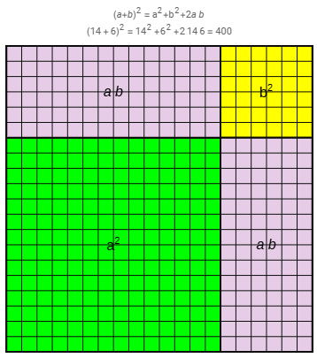
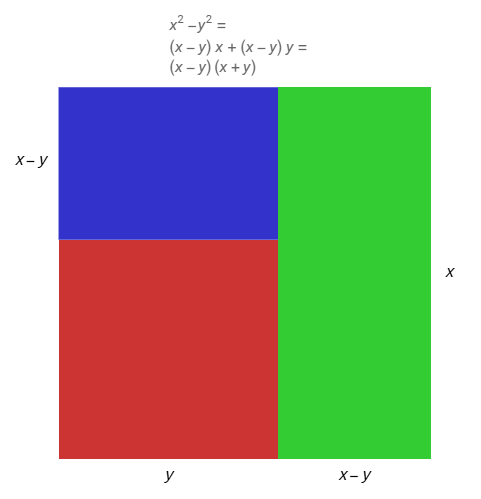
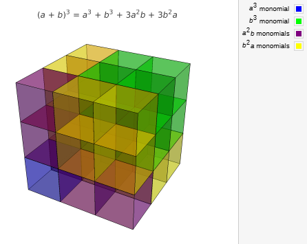
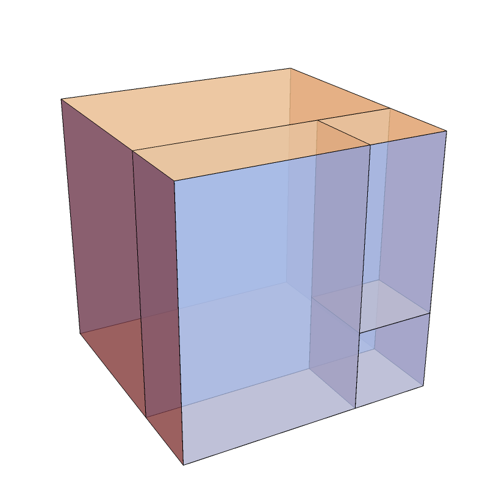

```{=html}
<!-- Φόρτωση βιβλιοθήκης GeoGebra -->
<script src="https://www.geogebra.org/apps/deployggb.js"></script>

<!-- Συνάρτηση δημιουργίας applets -->
<script>
function createGeoGebra(containerId, materialId, width = 700, height = 500) {
  var params = {
    "id": "ggb-" + containerId,
    "material_id": materialId,
    "width": width,
    "height": height,
    "showToolBar": true,
    "showMenuBar": false,
    "showAlgebraInput": true
  };
  
  var applet = new GGBApplet(params, '5.2');
  applet.inject(containerId);
}
</script>
```

## Αξιοσημείωτες ταυτότητες

::: {style="background-color: #d3deb8; border: 2px solid #2f3e50; color: #25188a; padding: 15px; border-radius: 5px;"}
Οι **αξιοσημείωτες ταυτότητες** είναι ισότητες που περιέχουν μεταβλητές και ισχύουν για όλες τις τιμές των μεταβλητών τους.
Οι βασικότερες από αυτές είναι οι εξής:

- **Τετράγωνο αθροίσματος:** $(\alpha + \beta)^2 = \alpha^2 + 2\alpha\beta + \beta^2$.
- **Τετράγωνο διαφοράς:** $(\alpha - \beta)^2 = \alpha^2 - 2\alpha\beta + \beta^2$.
- **Διαφορά τετραγώνων (Γινόμενο αθροίσματος επί διαφορά):** $(\alpha + \beta)(\alpha - \beta) = \alpha^2 - \beta^2$.
- **Κύβος αθροίσματος:** $(\alpha + \beta)^3 = \alpha^3 + 3\alpha^2\beta + 3\alpha\beta^2 + \beta^3$.
- **Κύβος διαφοράς:** $(\alpha - \beta)^3 = \alpha^3 - 3\alpha^2\beta + 3\alpha\beta^2 - \beta^3$.
- **Διαφορά κύβων:** $\alpha^3 - \beta^3 = (\alpha - \beta)(\alpha^2 + \alpha\beta + \beta^2)$.
- **Άθροισμα κύβων:** $\alpha^3 + \beta^3 = (\alpha + \beta)(\alpha^2 - \alpha\beta + \beta^2)$.
- **Τετράγωνο τριωνύμου:** $(\alpha + \beta + \gamma)^2 = \alpha^2 + \beta^2 + \gamma^2 + 2\alpha\beta + 2\beta\gamma + 2\gamma\alpha$.
- **Γινόμενο Διωνύμων με κοινό όρο** $(x+α)(x+β)=x^2+(α+β)x+αβ$

Η ικανότητα χρήσης των ταυτοτήτων στην παραγοντοποίηση είναι καθοριστική για την **απλοποίηση ρητών παραστάσεων**, την εύρεση του ΕΚΠ και του ΜΚΔ πολυωνύμων, καθώς και για την **επίλυση εξισώσεων** δευτέρου και ανώτερου βαθμού που θα συναντήσουμε στις επόμενες ενότητες.
:::

::: {.callout-note style="color: #78573b;"}
Στα μαθηματικά, και ειδικότερα στην άλγεβρα, το **ανάπτυγμα** μιας παράστασης είναι η **τελική πολυωνυμική μορφή** που προκύπτει όταν εκτελούμε τις σημειούμενες πράξεις (συνήθως πολλαπλασιασμούς και δυνάμεις).

Η έννοια του αναπτύγματος συνδέεται στενά με τις **αξιοσημείωτες ταυτότητες**:

- **Διαδικασία:** Το ανάπτυγμα προκύπτει από την εφαρμογή των ιδιοτήτων των πράξεων, όπως η **επιμεριστική ιδιότητα**, για να μετατραπεί ένα γινόμενο ή μια δύναμη σε άθροισμα όρων. Για παράδειγμα, το ανάπτυγμα της παράστασης $(x + 3)^2$ είναι το $x^2 + 6x + 9$.
- **Ανάπτυξη Ταυτοτήτων:** Η ανάπτυξη ταυτοτήτων, όπως το τετράγωνο διωνύμου $(\alpha + \beta)^2 = \alpha^2 + 2\alpha\beta + \beta^2$, απαιτεί την εκτέλεση **πολλαπλασιασμών μονωνύμων** και τη σωστή διαχείριση εκθετών και προσήμων.
- **Βασικά Παραδείγματα Αναπτυγμάτων:**
  - Το ανάπτυγμα του $(2\alpha + 1)^2$ είναι $4\alpha^2 + 4\alpha + 1$.
  - Το ανάπτυγμα του $(x + 1)^3$ είναι $x^3 + 3x^2 \cdot 1 + 3x \cdot 1^2 + 1^3$.
  - Το ανάπτυγμα του γινομένου αθροίσματος επί διαφορά $(x + y)(x - y)$ είναι η διαφορά τετραγώνων $x^2 - y^2$.
  - Το ανάπτυγμα της διαφοράς κύβων προκύπτει από το γινόμενο $(\alpha - \beta)(\alpha^2 + \alpha\beta + \beta^2) = \alpha^3 - \beta^3$.

Σε πιο προχωρημένο επίπεδο, υπάρχουν πολλά διαφορετικό αναπτύγματα όπως για παράδειγμα το **ανάπτυγμα σειράς Taylor**, όπου μια συνάρτηση εκφράζεται ως ένα άπειρο άθροισμα πολυωνυμικών όρων.
:::

------------------------------------------------------------------------

### Μερικά παραδείγματα

Η διαδικασία του αναπτύγματος βασίζεται στην εφαρμογή των αξιοσημείωτων ταυτοτήτων για τη μετατροπή γινομένων ή δυνάμεων σε αθροίσματα.
Ακολουθούν παραδείγματα αναπτυγμάτων για κάθε βασική ταυτότητα:

#### **1. Τετράγωνο Αθροίσματος:** $(\alpha + \beta)^2 = \alpha^2 + 2\alpha\beta + \beta^2$

- $(x + 5)^2 = x^2 + 2 \cdot x \cdot 5 + 5^2 = \mathbf{x^2 + 10x + 25}$
- $(2\omega + 1)^2 = (2\omega)^2 + 2 \cdot 2\omega \cdot 1 + 1^2 = \mathbf{4\omega^2 + 4\omega + 1}$
- $(x + 3)^2 = (x + 3)(x + 3) = x^2 + 3x + 3x + 9 = \mathbf{x^2 + 6x + 9}$
- $(3y + 2\beta)^2 = (3y)^2 + 2 \cdot 3y \cdot 2\beta + (2\beta)^2 = \mathbf{9y^2 + 12\beta y + 4\beta^2}$

#### **2. Τετράγωνο Διαφοράς:** $(\alpha - \beta)^2 = \alpha^2 - 2\alpha\beta + \beta^2$

- $(x - 3)^2 = x^2 - 2 \cdot 3 \cdot x + 3^2 = \mathbf{x^2 - 6x + 9}$
- $(y - 4)^2 = \mathbf{y^2 - 8y + 16}$
- $(4x - \alpha)^2 = \mathbf{16x^2 - 8x\alpha + \alpha^2}$
- $(x^2 - 2\omega)^2 = \mathbf{x^4 - 4x^2\omega + 4\omega^2}$

#### **3. Γινόμενο Αθροίσματος επί Διαφορά:** $(\alpha + \beta)(\alpha - \beta) = \alpha^2 - \beta^2$

- $(x - 3)(x + 3) = x^2 - 3^2 = \mathbf{x^2 - 9}$
- $(3y - 2)(3y + 2) = (3y)^2 - 2^2 = \mathbf{9y^2 - 4}$
- $(2x + \sqrt3y)(2x - \sqrt3y) = (2x)^2 - (\sqrt3y)^2 = \mathbf{4x^2 - 3y^2}$
- $(x - \omega)(x + \omega) = x^2 - \omega^2 = \mathbf{x^2 - \omega^2}$

#### **4. Κύβος Αθροίσματος:** $(\alpha + \beta)^3 = \alpha^3 + 3\alpha^2\beta + 3\alpha\beta^2 + \beta^3$

- $(x + 2)^3 = x^3 + 3 \cdot x^2 \cdot 2 + 3 \cdot x \cdot 2^2 + 2^3 = \mathbf{x^3 + 6x^2 + 12x + 8}$
- $(2a + \sqrt2)^3 = (2a)^3 + 3 \cdot (2a)^2 \cdot \sqrt2 + 3 \cdot 2a \cdot \sqrt2^2 + \sqrt2^3 = \mathbf{8α^3 + 12\sqrt2α^2 + 12α + 2\sqrt2}$
- $(λ + 3)^3 = λ^3 + 3 \cdot λ^2 \cdot 3 + 3 \cdot λ \cdot 3^2 + 3^3 = \mathbf{λ^3 + 9λ^2 + 27λ + 27}$

#### **5. Κύβος Διαφοράς:** $(\alpha - \beta)^3 = \alpha^3 - 3\alpha^2\beta + 3\alpha\beta^2 - \beta^3$

- $(κ - 2)^3 = κ^3 - 3 \cdot κ^2 \cdot 2 + 3 \cdot κ \cdot 2^2 - 2^3 = \mathbf{κ^3 - 6κ^2 + 12κ - 8}$
- $(3δ - 1)^3 = (3δ)^3 - 3 \cdot (3δ)^2 \cdot 1 + 3 \cdot 3δ \cdot 1^2 - 1^3 = \mathbf{27δ^3 - 27δ^2 + 9δ - 1}$
- $(2μ - 3ν)^3 = \mathbf{8μ^3 - 36μ^2ν + 54μν^2 - 27ν^3}$

#### **6. Άθροισμα και Διαφορά Κύβων (Ανάπτυγμα Γινομένων)**

Αν και χρησιμοποιούνται κυρίως για παραγοντοποίηση, το ανάπτυγμα των αντίστοιχων γινομένων δίνει:

\* $(x + 2)(x^2 - 2x + 4) = x^3 + 2^3 = \mathbf{x^3 + 8}$

\* $(x - 3)(x^2 + 3x + 9) = x^3 - 3^3 = \mathbf{x^3 - 27}$

\* $(2θ + 1)(4θ^2 - 2θ + 1) = (2θ)^3 + 1^3 = \mathbf{8θ^3 + 1}$

\* $(1 - \alpha)(1 + \alpha + \alpha^2) = 1^3 - \alpha^3 = \mathbf{1 - \alpha^3}$

#### **7. Τετράγωνο Τριωνύμου:** $(\alpha + \beta + \gamma)^2 = \alpha^2 + \beta^2 + \gamma^2 + 2\alpha\beta + 2\beta\gamma + 2\gamma\alpha$

- $(2x^2 + 2x + 1)^2 = (2x^2)^2 + (2x)^2 + 1^2 + 2(2x^2)(2x) + 2(2x)(1) + 2(2x^2)(1) = \mathbf{4x^4 + 8x^3 + 8x^2 + 4x + 1}$

------------------------------------------------------------------------

### Σημαντικές ταυτότηες μεγάλων μαθηματικών

Εκτός από τις βασικές αξιοσημείωτες ταυτότητες που χρησιμοποιούνται ευρέως,υπάρχουν και άλλες **επώνυμες ταυτότητες** και θεωρήματα που έχουν τη μορφή ταυτότητας:

- **Ταυτότητα του Euler:** Είναι μια σημαντική ταυτότητα που συνδέει το άθροισμα τριών κύβων με το γινόμενό τους και έχει τη μορφή: $$\alpha^3 + \beta^3 + \gamma^3 - 3\alpha\beta\gamma = (\alpha + \beta + \gamma)(\alpha^2 + \beta^2 + \gamma^2 - \alpha\beta - \alpha\gamma - \beta\gamma)$$. Μια ειδική περίπτωση αυτής της ταυτότητας αναφέρει ότι αν το άθροισμα των τριών μεταβλητών είναι μηδέν ($\alpha + \beta + \gamma = 0$), τότε $\alpha^3 + \beta^3 + \gamma^3 = 3\alpha\beta\gamma$.
- **Ταυτότητα Lagrange:** Αν και δεν ορίζεται ρητά στο κεφάλαιο της θεωρίας, εμφανίζεται σε ασκήσεις και έχει τη μορφή: $$(\alpha^2 + \beta^2)(x^2 + y^2) - (\alpha x + \beta y)^2 = (\alpha y - \beta x)^2$$.
- **Ταυτότητα της Ευκλείδειας Διαίρεσης:** Χρησιμοποιείται στη διαίρεση πολυωνύμων και εκφράζει τη σχέση μεταξύ Διαιρετέου ($\Delta(x)$), διαιρέτη ($\delta(x)$), πηλίκου ($\pi(x)$) και υπολοίπου ($\upsilon(x)$): $\Delta(x) = \delta(x) \cdot \pi(x) + \upsilon(x)$.
- **Βασική Τριγωνομετρική Ταυτότητα:** Στην τριγωνομετρία, η πλέον θεμελιώδης ταυτότητα που ισχύει για οποιαδήποτε γωνία $\omega$ είναι: $\eta\mu^2 \omega + \sigma\upsilon\nu^2 \omega = 1$.
- **Νόμος των Συνημίτονων:** Αναφέρεται ως η γενίκευση του Πυθαγορείου Θεωρήματος για κάθε τρίγωνο: $\alpha^2 = \beta^2 + \gamma^2 - 2\beta\gamma \cdot \sigma\upsilon\nu A$.

------------------------------------------------------------------------

### Γεωμετρική Ερμηνεία και Οπτικοποίηση

Η γεωμετρική προσέγγιση επιτρέπει τη βαθύτερη κατανόηση της προέλευσης των τύπων μέσω εμβαδών και όγκων.

\* **Τετράγωνο Αθροίσματος:** Αναπαρίσταται ως το εμβαδόν ενός μεγάλου τετραγώνου πλευράς $(a+b)$, το οποίο αποτελείται από δύο τετράγωνα ($a^2$ και $b^2$) και δύο ορθογώνια ($ab$).\

\
{width="267"}

\* **Διαφορά Τετραγώνων:** Προκύπτει από την αφαίρεση ενός μικρού τετραγώνου $y^2$ από ένα μεγαλύτερο $x^2$ και την αναδιάταξη του εναπομείναντος σχήματος [πράσινο]{style="color: green;"} και [μπλέ]{style="color: blue;"} σε ορθογώνιο πλευρών $(x-y)$ και $(x+y)$.
Μικρή πλευρά των ορθογωνίων $(x-y)$ κοινή και τότε η άλλη θα είναι $(x+y)$\

\
{width="283"}

\* **Κύβος Αθροίσματος:** Ερμηνεύεται τρισδιάστατα ως ο όγκος ενός κύβου ακμής $(a+b)$, ο οποίος αποσυντίθεται σε οκτώ στερεά: δύο κύβους ($a^3, b^3$) και έξι ορθογώνια παραλληλεπίπεδα ($3a^2b, 3ab^2$).\

\


\* **Διαφορά κύβων** Από έναν κύβο με ακμή α αφαιρούμε από το εσωτερικό του έναν μικρότερο κύβο ακμής β

{width="287"}

------------------------------------------------------------------------

### Για την απόδειξη μιας αλγεβρικής ταυτότητας της μορφής $A = B$

, δηλαδή μιας ισότητας που αληθεύει για όλες τις δυνατές τιμές των μεταβλητών της, ακολουθούνται συνήθως τρεις βασικές μεθοδολογικές πορείες:

1.  **Αφετηρία από το ένα μέλος:** Ξεκινάμε από το μέλος που παρουσιάζει τις πιο σύνθετες πράξεις (συνήθως το αριστερό) και, μέσω αλγεβρικών απλοποιήσεων, επιμεριστικών ιδιοτήτων και εφαρμογής άλλων γνωστών ταυτοτήτων, καταλήγουμε στο άλλο μέλος. Για παράδειγμα, στην ταυτότητα $(a + β)^2 = a^2 + 2aβ + β^2$, μπορούμε να ξεκινήσουμε από το γινόμενο $(a+β)(a+β)$, να εφαρμόσουμε την επιμεριστική ιδιότητα και να καταλήξουμε στο τελικό ανάπτυγμα.
2.  **Ανεξάρτητη επεξεργασία των δύο μελών:** Εκτελούμε πράξεις στο πρώτο μέλος μέχρι να φτάσουμε σε μια απλοποιημένη μορφή $\Gamma$ ($A = \Gamma$). Στη συνέχεια, εκτελούμε πράξεις στο δεύτερο μέλος μέχρι να καταλήξουμε στην ίδια ακριβώς παράσταση $\Gamma$ ($B = \Gamma$). Εφόσον και τα δύο μέλη είναι ίσα με την ίδια παράσταση, αποδεικνύεται η ισότητα $A = B$.
3.  **Μετασχηματισμός σε ισοδύναμη σχέση:** Μετασχηματίζουμε την αρχική σχέση $A = B$ σε μια άλλη ισοδύναμη μορφή, όπως για παράδειγμα την $A - B = 0$. Εκτελούμε όλες τις σημειωμένες πράξεις και, αν καταλήξουμε σε μια προφανή αλήθεια (όπως $0=0$ ή μια γνωστή ταυτότητα), τότε τεκμηριώνεται η εγκυρότητα της αρχικής σχέσης.

Ένα χαρακτηριστικό παράδειγμα απόδειξης μιας ταυτότητας που δεν περιλαμβάνεται στις «αξιοσημείωτες» (όπως το τετράγωνο αθροίσματος ή η διαφορά τετραγώνων) είναι η **ταυτότητα του Lagrange** για δύο μεταβλητές.

#### Παράδειγμα: Ταυτότητα του Lagrange

Η ταυτότητα προς απόδειξη είναι η εξής: $(\alpha^{2}+\beta^{2})(x^{2}+\psi^{2}) - (\alpha x + \beta\psi)^{2} = (\alpha\psi - \beta x)^{2}$

**Μεθοδολογία Απόδειξης**

Για την απόδειξη αυτή, θα χρησιμοποιήσουμε τη μέθοδο **«Αφετηρία από το ένα μέλος»**, ξεκινώντας από το αριστερό (πιο σύνθετο) μέλος για να καταλήξουμε στο δεξιό.

1.  **Ανάπτυγμα του πρώτου γινομένου:** Εκτελούμε τις πράξεις στην παράσταση $(\alpha^{2}+\beta^{2})(x^{2}+\psi^{2})$ χρησιμοποιώντας την επιμεριστική ιδιότητα: $$\alpha^{2}x^{2} + \alpha^{2}\psi^{2} + \beta^{2}x^{2} + \beta^{2}\psi^{2}$$

2.  **Ανάπτυγμα του τετραγώνου:** Αναπτύσσουμε τη δεύτερη παρένθεση $(\alpha x + \beta\psi)^{2}$ χρησιμοποιώντας την αξιοσημείωτη ταυτότητα του τετραγώνου αθροίσματος: $$(\alpha x)^{2} + (\beta\psi)^{2} + 2(\alpha x)(\beta\psi) = \alpha^{2}x^{2} + \beta^{2}\psi^{2} + 2\alpha\beta x\psi$$

3.  **Αφαίρεση και απλοποίηση:** Αφαιρούμε τα δύο αποτελέσματα: $$(\alpha^{2}x^{2} + \alpha^{2}\psi^{2} + \beta^{2}x^{2} + \beta^{2}\psi^{2}) - (\alpha^{2}x^{2} + \beta^{2}\psi^{2} + 2\alpha\beta x\psi)$$

    Με την αφαίρεση των παρενθέσεων, οι όροι $\alpha^{2}x^{2}$ και $\beta^{2}\psi^{2}$ αλληλοαναιρούνται, άρα μένει: $$\alpha^{2}\psi^{2} + \beta^{2}x^{2} - 2\alpha\beta x\psi$$

4.  **Παραγοντοποίηση:** Η παράσταση που απέμεινε είναι ένα τριώνυμο που αναγνωρίζεται ως το **τετράγωνο διαφοράς** της παράστασης $(\alpha\psi - \beta x)$, άρα: $$\alpha^{2}\psi^{2} + \beta^{2}x^{2} - 2(\alpha\psi)(\beta x) = \mathbf{(\alpha\psi - \beta x)^{2}}$$

*Εφόσον το τελικό αποτέλεσμα ταυτίζεται με το δεξιό μέλος της αρχικής σχέσης, η ταυτότητα έχει αποδειχθεί.*

### Ασκήσεις

1.  Τετράγωνο Αθροίσματος: $(a + β)^2 = a^2 + 2aβ + β^2$\
    Να βρείτε τα αναπτύγματα των παραστάσεων:
    1.  $(x + 2)^2$
    2.  $(3xy + 1)^2$
    3.  $(x + \frac{1}{2})^2$
    4.  $(5\alpha^2x + 3\beta^2xy)^2$
    5.  $(\alpha^x + \beta^y)^2$
2.  Τετράγωνο Διαφοράς: $(a - β)^2 = a^2 - 2aβ + β^2$\
    Να βρείτε τα αναπτύγματα των παραστάσεων:
    1.  $(2x - 3)^2$
    2.  $(3x^3 - xy^2)^2$
    3.  $(\alpha^2 - \frac{1}{2})^2$
    4.  $(x^2 - 3y)^2$
    5.  $\left(\dfrac{2\alpha}{3} - \dfrac{\beta^2}{2}\right)^2$
3.  Γινόμενο Αθροίσματος επί Διαφορά: $(a + β)(a - β) = a^2 - β^2$\
    Να υπολογίσετε τα γινόμενα:
    1.  $(3x + 2)(3x - 2)$
    2.  $(\alpha\beta + 3)(\alpha\beta - 3)$
    3.  $(\alpha^2\beta - \gamma)(\alpha^2\beta + \gamma)$
    4.  $(3\alpha - 2\beta^3)(2\beta^3 + 3\alpha)$
    5.  $(x + y - 1)(x + y + 1)$ (με χρήση ομαδοποίησης: $[(x + y) - 1][(x + y) + 1]$)
4.  Κύβος Αθροίσματος: $(a + β)^3 = a^3 + 3a^2β + 3aβ^2 + β^3$\
    Να βρείτε τα αναπτύγματα των παραστάσεων:
    1.  $(\alpha + 2)^3$
    2.  $(2\alpha^2 + 3)^3$
    3.  $(x + 1)^3$
    4.  $(2x + 3y)^3$
    5.  $(\alpha^x + 1)^3$
5.  Κύβος Διαφοράς: $(a - β)^3 = a^3 - 3a^2β + 3aβ^2 - β^3$\
    Να βρείτε τα αναπτύγματα των παραστάσεων:
    1.  $(2x - 1)^3$
    2.  $(x^2 - \frac{y}{3})^3$
    3.  $(2x^2y - x^3y^2)^3$
    4.  $(-\alpha + 3)^3$
    5.  $(\alpha^3\beta^2 - 3\alpha\gamma^2)^3$
6.  Τετράγωνο Τριωνύμου: $(a + β + γ)^2 = a^2 + β^2 + γ^2 + 2aβ + 2βγ + 2γa$\
    Να βρείτε τα αναπτύγματα των παραστάσεων:
    1.  $(2x + 3y + z)^2$
    2.  $(x^2 - 3y + 2\alpha z)^2$
    3.  $(2\alpha + 3\beta - 1)^2$
    4.  $(x^2 - x + 1)^2$
    5.  $(\alpha - x + \beta - y)^2$ (με χρήση ομαδοποίησης: $[(\alpha + \beta) - (x + y)]^2$)
7.  Γινόμενο Διωνύμων με Κοινό Όρο: $(x + a)(x + β) = x^2 + (a + β)x + aβ$\
    Να υπολογίσετε τα γινόμενα:
    1.  $(x + 1)(x + 3)$
    2.  $(x - 3)(x + 1)$
    3.  $(x + 3\alpha)(x + 4\alpha)$
    4.  $(x - y)(x + 2y)$
    5.  $(x + 2)(x + 5)$
8.  Γινόμενο Διωνύμου επί Τριώνυμο (Άθροισμα/Διαφορά Κύβων): $(a \pm β)(a^2 \mp aβ + β^2)$\
    Να υπολογίσετε τα γινόμενα:
    1.  $(x + 3)(x^2 - 3x + 9)$
    2.  $(2x - 1)(4x^2 + 2x + 1)$
    3.  $(x - 1)(x^2 + x + 1)$
    4.  $(2x + 3y)(4x^2 - 6xy + 9y^2)$
    5.  $(1 - xy)(1 + xy + x^2y^2)$
9.  Να αποδειχθεί η ταυτότητα: $(a+β+γ)^2 - a^2 - β^2 - γ^2 = 2(aβ + βγ + γa)$
10. Να αποδειχθεί η ταυτότητα: $(x+y)(x-y+1) - (x-y)(x+y+1) = 2y - 2xy$
11. Να αποδειχθεί η ταυτότητα: $a(β-γ)^2 + β(γ-a)^2 + γ(a-β)^2 + 8aβγ = (a+β)(β+γ)(γ+a)$

*Κάνουμε πράξεις και στα δύο μέλη*

12. Να αποδειχθεί η ταυτότητα: $(x+y+z)^3 - x^3 - y^3 - z^3 = 3(x+y)(y+z)(z+x)$
13. Να αποδειχθεί η ταυτότητα: $a^2β + aβ^2 + a^2γ + aγ^2 + β^2γ + βγ^2 + 2aβγ = (a+β)(β+γ)(γ+a)$

*Αναπτύσσουμε το δεξί μέλος*: ........................

14. Να αποδειχθεί η ταυτότητα: $(x + y)^3 - x^3 - y^3 = 3xy(x + y)$\
**Λύση** Η ισότητα ισχύει για κάθε $x, y \in \mathbb{R}$.\
**Βήματα**
    - Αναπτύσσουμε τον κύβο του αθροίσματος: $(x + y)^3 = x^3 + 3x^2y + 3xy^2 + y^3$.
    - Αντικαθιστούμε στην παράσταση: $(x^3 + 3x^2y + 3xy^2 + y^3) - x^3 - y^3$.
    - Διαγράφουμε τους όρους $x^3$ και $-x^3$, καθώς και τους $y^3$ και $-y^3$.
    - Μας απομένει: $3x^2y + 3xy^2$.
    - Βγάζουμε κοινό παράγοντα το $3xy$: $3xy(x + y)$.

15. Να αποδειχθεί η ταυτότητα: $(a + β)^2 + (a - β)^2 = 2a^2 + 2β^2$

16. Να αποδειχθεί η ταυτότητα: $x^4 + x^2 + 1 = (x^2 + x + 1)(x^2 - x + 1)$

*Κάνουμε πράξεις στο* $2^ο$ *μέλος*........................

17. Να αποδείξετε ότι για κάθε (x,y\in \mathbb{R}) ισχύει: $$(x-y)^2+4xy=(x+y)^2$$

18. Να αποδείξετε ότι για κάθε (α,β\in \mathbb{R}) ισχύει:

$$(a+β)(a-β)+2β^2=a^2+β^2$$

19. Να αποδείξετε ότι για κάθε (x,y,z\in \mathbb{R}) ισχύει:

$$x(y-z)+y(z-x)+z(x-y)=0$$

20. Να αποδείξετε ότι για κάθε (α,β\in \mathbb{R}) ισχύει:

$$(a^2+β^2)(a-β)^2=a^4-2a^3β+2a^2β^2-2aβ^3+β^4$$

21. Να αποδείξετε ότι για κάθε (x,y\in \mathbb{R}) ισχύει:

$$(x+y)^2-(x-y)^2=4xy$$

\

$$\bbox[yellow, 5px]{\color{blue}\Large\text{---}}$$

::: {.callout-tip style="color: brown;"}
## Ενέργεια
:::

::: {style="background-color: ##d3deb8; border: 2px solid #2f3e50; color: #25188a; padding: 15px; border-radius: 5px;"}
:::

::: {.callout-tip style="color: brown;"}
ΚΑΛΗ ΜΕΛΕΤΗ!
:::

\
\
