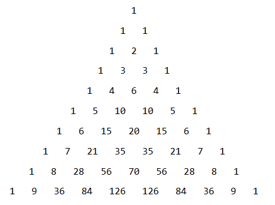

```{=html}
<!-- Φόρτωση βιβλιοθήκης GeoGebra -->
<script src="https://www.geogebra.org/apps/deployggb.js"></script>

<!-- Συνάρτηση δημιουργίας applets -->
<script>
function createGeoGebra(containerId, materialId, width = 700, height = 500) {
  var params = {
    "id": "ggb-" + containerId,
    "material_id": materialId,
    "width": width,
    "height": height,
    "showToolBar": true,
    "showMenuBar": false,
    "showAlgebraInput": true
  };
  
  var applet = new GGBApplet(params, '5.2');
  applet.inject(containerId);
}
</script>
```

## Παραγοντοποίηση αλγεβρικών παραστάσεων

::: {style="background-color: #d3deb8; border: 2px solid #2f3e50; color: #25188a; padding: 15px; border-radius: 5px;"}
Η παραγοντοποίηση (ή ανάλυση σε γινόμενο παραγόντων) μιας αλγεβρικής παράστασης είναι η διαδικασία μετασχηματισμού ενός αθροίσματος (πολυωνύμου) σε **γινόμενο δύο ή περισσότερων παραγόντων**.
Η διαδικασία αυτή είναι εξαιρετικά χρήσιμη για την απλοποίηση σύνθετων παραστάσεων, την εκτέλεση πράξεων με ρητά κλάσματα και την επίλυση εξισώσεων ανώτερου βαθμού.
:::

Ακολουθούν οι κυριότερες μέθοδοι παραγοντοποίησης:

::: {style="background-color: #d3deb8; border: 2px solid #2f3e50; color: #25188a; padding: 15px; border-radius: 5px;"}
### 1. Κοινός Παράγοντας

Όταν όλοι οι όροι μιας παράστασης περιέχουν έναν κοινό αριθμητικό ή εγγράμματο παράγοντα, αυτός τίθεται **εκτός παρένθεσης** με βάση την επιμεριστική ιδιότητα: $\mu\alpha + \mu\beta + \mu\gamma = \mu(\alpha + \beta + \gamma)$.

\* **Παράδειγμα:** $6\alpha^3\beta^2 - 3\alpha^2\beta^3 = 3\alpha^2\beta^2(2\alpha - \beta)$.

\* **Παράδειγμα:** $3\alpha(x - y) - 2\omega(x - y) - (x - y) = (x - y)(3\alpha - 2\omega - 1)$.
:::

\

::: {style="background-color: #d3deb8; border: 2px solid #2f3e50; color: #25188a; padding: 15px; border-radius: 5px;"}
### 2.Ομαδοποίηση (Χρήση Ομάδων)

Οι όροι χωρίζονται σε ομάδες με ίσο πλήθος όρων.
Από κάθε ομάδα εξάγεται κοινός παράγοντας, έτσι ώστε να προκύψει μια νέα κοινή παρένθεση για όλες τις ομάδες.

\* **Παράδειγμα:** $\alpha x + \beta x + \alpha y + \beta y = x(\alpha + \beta) + y(\alpha + \beta) = (\alpha + \beta)(x + y)$.

\* **Παράδειγμα:** $x^3 - xy + x^2y^2 - y^3 = x(x^2 - y) + y^2(x^2 - y) = (x^2 - y)(x + y^2)$.
:::

\

::: {style="background-color: #d3deb8; border: 2px solid #2f3e50; color: #25188a; padding: 15px; border-radius: 5px;"}
### 3. Χρήση Αξιοσημείωτων Ταυτοτήτων

Πολλές παραστάσεις παραγοντοποιούνται άμεσα αν αναγνωριστούν ως αναπτύγματα γνωστών ταυτοτήτων:

- **Διαφορά Τετραγώνων:** $\alpha^2 - \beta^2 = (\alpha + \beta)(\alpha - \beta)$.
  - *Παράδειγμα:* $4x^2 - 9y^2 = (2x)^2 - (3y)^2 = (2x + 3y)(2x - 3y)$.
- **Τέλειο Τετράγωνο Διωνύμου:** $\alpha^2 \pm 2\alpha\beta + \beta^2 = (\alpha \pm \beta)^2$.
  - *Παράδειγμα:* $25x^2 - 20xy + 4y^2 = (5x - 2y)^2$.
- **Άθροισμα και Διαφορά Κύβων:**
  - $\alpha^3 + \beta^3 = (\alpha + \beta)(\alpha^2 - \alpha\beta + \beta^2)$.
  - $\alpha^3 - \beta^3 = (\alpha - \beta)(\alpha^2 + \alpha\beta + \beta^2)$.
  - *Παράδειγμα:* $8\omega^3 + 125 = (2\omega)^3 + 5^3 = (2\omega + 5)(4\omega^2 - 10\omega + 25)$.
- **Ταυτότητα Euler:** $a^3 + b^3 + c^3 - 3abc = (a + b + c)(a^2 + b^2 + c^2 - ab - bc - ca)$.
:::

\

::: {style="background-color: #d3deb8; border: 2px solid #2f3e50; color: #25188a; padding: 15px; border-radius: 5px;"}
### 4. Παραγοντοποίηση Τριωνύμου ($\alpha x^2 + \beta x + \gamma$)

Για την Παραγοντοποίηση ενός τριωνύμου, η βασικές μέθοδοι είναι:

1.  Η **συμπλήρωση τετραγώνου** ώστε η παράσταση να πάρει τη μορφή διαφοράς τετραγώνων. Η δυνατότητα παραγοντοποίησης στο σύνολο των πραγματικών αριθμών εξαρτάται από τη ποσότητα ($\Delta = \beta^2 - 4\alpha\gamma$) η οποία λέγεται **διακρίνουσα** : (*Θα την συναντήσουμε σε επόμενα μαθήματα*)

\* Αν $\Delta > 0$, το τριώνυμο αναλύεται σε γινόμενο δύο πρωτοβάθμιων παραγόντων.

\* Αν $\Delta = 0$, το τριώνυμο είναι τέλειο τετράγωνο.

\* Αν $\Delta < 0$, το τριώνυμο **δεν αναλύεται** σε γινόμενο στο σύνολο των πραγματικών αριθμών.
:::

\* **Παράδειγματα:**

Α.
**Συμπλήρωση τετραγώνου για το τριώνυμο** $x^2 - 7x + 12$

Σε τριώνυμα αυτής της μορφής (όπου ο συντελεστής του $x^2$ είναι η μονάδα), ακολουθούμε τα εξής βήματα:

- **Βήμα 1:** Γράφουμε τον συντελεστή του πρωτοβάθμιου όρου (το $-7$) ως γινόμενο του 2 επί έναν άλλο παράγοντα. Δηλαδή, το 7 γίνεται $2 \cdot \dfrac{7}{2}$ ([*Αν είναι άρτιος τότε γράφεται εύκολα σαν γινόμενο με το 2*]{.underline}).
  - Η παράσταση γίνεται: $x^2 - 2 \cdot \dfrac{7}{2}x + 12$
- **Βήμα 2:** Προσθέτουμε και αφαιρούμε το **τετράγωνο αυτού του παράγοντα** (δηλαδή το $(\frac{7}{2})^2 = \frac{49}{4}$).
  - Η παράσταση γίνεται: $x^2 - 2 \cdot \dfrac{7}{2}x + \left(\dfrac{7}{2}\right)^2 - \dfrac{49}{4} + 12$
- **Βήμα 3:** Οι τρεις πρώτοι όροι σχηματίζουν πλέον ένα **τέλειο τετράγωνο** βάσει της ταυτότητας $(\alpha-\beta)^2 = \alpha^2 - 2\alpha\beta + \beta^2$.
  - Έχουμε: $\left(x - \dfrac{7}{2}\right)^2 - \dfrac{49}{4} + 12$
- **Βήμα 4:** Εκτελούμε τις πράξεις στους σταθερούς όρους: $-\dfrac{49}{4} + 12 = -\dfrac{49}{4} + \dfrac{48}{4} = -\dfrac{1}{4}$.
  - Η παράσταση γίνεται: $\left(x - \dfrac{7}{2}\right)^2 - \left(\dfrac{1}{2}\right)^2$
- **Βήμα 5:** Εφαρμόζουμε την ταυτότητα της **διαφοράς τετραγώνων** $\alpha^2 - \beta^2 = (\alpha-\beta)(\alpha+\beta)$.
  - $\left(x - \dfrac{7}{2} - \dfrac{1}{2}\right)\left(x - \dfrac{7}{2} + \dfrac{1}{2}\right)$
  - $\left(x - \dfrac{8}{2}\right)\left(x - \dfrac{6}{2}\right)$
  - **Τελική Παραγοντοποίηση:** $\mathbf{(x - 4)(x - 3)}$

Β.
**Συμπλήρωση τετραγώνου για το τριώνυμο** $2x^2 + 5x - 3$

Όταν ο συντελεστής του δευτεροβάθμιου όρου είναι διαφορετικός από τη μονάδα, αυτός **βγαίνει ως κοινός παράγοντας** από την αρχή.

- **Βήμα 1:** Βγάζουμε το 2 έξω από την παρένθεση.
  - $2 \cdot \left(x^2 + \dfrac{5}{2}x - \dfrac{3}{2}\right)$
- **Βήμα 2:** Εργαζόμαστε μέσα στην παρένθεση. Γράφουμε τον συντελεστή $\dfrac{5}{2}$ ως γινόμενο του 2. Δηλαδή, $\dfrac{5}{2} = 2 \cdot \dfrac{5}{4}$.
  - $2 \cdot \left(x^2 + 2 \cdot \dfrac{5}{4}x - \dfrac{3}{2}\right)$
- **Βήμα 3:** Προσθέτουμε και αφαιρούμε το τετράγωνο του $\dfrac{5}{4}$, δηλαδή το $\left(\dfrac{5}{4}\right)^2 = \dfrac{25}{16}$.
  - $2 \cdot \left[x^2 + 2 \cdot \dfrac{5}{4}x + \left(\dfrac{5}{4}\right)^2 - \dfrac{25}{16} - \dfrac{3}{2}\right]$
- **Βήμα 4:** Σχηματίζουμε το τέλειο τετράγωνο $(\alpha+\beta)^2 = \alpha^2 + 2\alpha\beta + \beta^2$.
  - $2 \cdot \left[\left(x + \dfrac{5}{4}\right)^2 - \dfrac{25}{16} - \dfrac{24}{16}\right]$ (κάνοντας ομώνυμα τα κλάσματα)
- **Βήμα 5:** Συνδυάζουμε τους σταθερούς όρους: $-\dfrac{25}{16} - \dfrac{24}{16} = -\dfrac{49}{16} = -\left(\dfrac{7}{4}\right)^2$.
  - Η παράσταση είναι: $2 \cdot \left[\left(x + \dfrac{5}{4}\right)^2 - \left(\dfrac{7}{4}\right)^2\right]$
- **Βήμα 6:** Εφαρμόζουμε τη διαφορά τετραγώνων.
  - $2 \cdot \left(x + \dfrac{5}{4} - \dfrac{7}{4}\right)\left(x + \dfrac{5}{4} + \dfrac{7}{4}\right)$
  - $2 \cdot \left(x - \dfrac{2}{4}\right)\left(x + \dfrac{12}{4}\right)$
  - $2 \cdot \left(x - \dfrac{1}{2}\right)\left(x + 3\right)$
- **Τελική Παραγοντοποίηση:** $\mathbf{(2x - 1)(x + 3)}$

::: {style="background-color: #d3deb8; border: 2px solid #2f3e50; color: #25188a; padding: 15px; border-radius: 5px;"}
2.  Αν το τριώνυμο είναι της μορφής $x^2+(α+β)x+αβ$ γράφεται $(x+α)(x+β)$

Η παραγοντοποίηση τριωνύμου της μορφής $x^2 + (α+\beta)x + α\beta$ βασίζεται στην αξιοσημείωτη ταυτότητα **«Γινόμενο Διωνύμων με Κοινό Όρο»**.
Σύμφωνα με αυτήν, η παράσταση μπορεί να γραφτεί απευθείας ως γινόμενο δύο πρωτοβάθμιων παραγόντων: $(x + α)(x + \beta)$.

Η μεθοδολογία απαιτεί την εύρεση δύο αριθμών $α$ και $\beta$ τέτοιων ώστε:\

- Το **άθροισμά** τους ($α+\beta$) να ισούται με τον συντελεστή του πρωτοβάθμιου όρου ($x$).\
- Το **γινόμενό** τους ($α\cdot\beta$) να ισούται με τον σταθερό όρο της παράστασης.
:::

**Παραδείγματα**:

Α.
**Παραγοντοποίηση του** $x^2 - 7x + 12$

Σε αυτό το τριώνυμο, ο συντελεστής του $x^2$ είναι η μονάδα, οπότε αναζητούμε δύο αριθμούς $α$ και $\beta$ με τις εξής ιδιότητες:\
\* **Άθροισμα:** $α + \beta = -7$\
\* **Γινόμενο:** $α \cdot \beta = 12$

**Διαδικασία εύρεσης:** Εξετάζουμε τους συνδυασμούς παραγόντων του 12 (σταθερός όρος) που δίνουν άθροισμα $-7$.
Εφόσον το γινόμενο είναι θετικό (+12) και το άθροισμα αρνητικό (-7), και οι δύο αριθμοί πρέπει να είναι αρνητικοί:\
\* $-1$ και $-12$ (Άθροισμα: $-13$)\
\* $-2$ και $-6$ (Άθροισμα: $-8$)\
\* $-3$ και $-4$ (Άθροισμα: $-7$)

Οι αριθμοί που ικανοποιούν τις συνθήκες είναι το $-3$ και το $-4$.

**Τελική μορφή:** $x^2 - 7x + 12 = \mathbf{(x - 3)(x - 4)}$.

Β.
**Παραγοντοποίηση του** $2x^2 + 5x - 3$

Όταν ο συντελεστής του δευτεροβάθμιου όρου είναι διάφορος της μονάδας ($α \neq 1$), η παράσταση πρέπει πρώτα να μετατραπεί ώστε να εμφανιστεί η ζητούμενη μορφή.
Αυτό επιτυγχάνεται βγάζοντας τον συντελεστή $2$ ως **κοινό παράγοντα**:

$2x^2 + 5x - 3 = 2 \cdot \left(x^2 + \dfrac{5}{2}x - \dfrac{3}{2}\right)$

Τώρα εργαζόμαστε με το τριώνυμο μέσα στην παρένθεση ($x^2 + \dfrac{5}{2}x - \dfrac{3}{2}$) και αναζητούμε δύο αριθμούς $α$ και $\beta$ τέτοιους ώστε:\
\* **Άθροισμα:** $α + \beta = \dfrac{5}{2}$\
\* **Γινόμενο:** $α \cdot \beta = -\dfrac{3}{2}$

**Διαδικασία εύρεσης:** Αναζητούμε αριθμούς που το γινόμενό τους να είναι $-\dfrac{3}{2}$ και το άθροισμά τους $\dfrac{5}{2}$.
Παρατηρούμε ότι:\
\* Αν πάρουμε τους αριθμούς $3$ και $-\dfrac{1}{2}$:\
\* Γινόμενο: $3 \cdot (-\dfrac{1}{2}) = -\dfrac{3}{2}$\
\* Άθροισμα: $3 - \dfrac{1}{2} = \dfrac{6-1}{2} = \dfrac{5}{2}$

Οι αριθμοί αυτοί ικανοποιούν τις συνθήκες.
Έτσι η παράσταση μέσα στην παρένθεση παραγοντοποιείται ως $(x + 3)\left(x - \dfrac{1}{2}\right)$.

**Τελική επεξεργασία:** $2 \cdot (x + 3)\left(x - \dfrac{1}{2}\right) = (x + 3) \cdot \left[2 \cdot \left(x - \dfrac{1}{2}\right)\right] = \mathbf{(x + 3)(2x - 1)}$.

\

::: {style="background-color: #d3deb8; border: 2px solid #2f3e50; color: #25188a; padding: 15px; border-radius: 5px;"}
### 5. Μέθοδος των Ριζών (Διαιρετότητα με $x - \alpha$)

Ένα πολυώνυμο $P(x)$ έχει ως παράγοντα το διώνυμο $x - \alpha$ αν και μόνο αν η αριθμητική τιμή του για $x = \alpha$ είναι μηδέν ($P(\alpha) = 0$).

\* **Στρατηγική:** Για πολυώνυμα με ακέραιους συντελεστές, αναζητούμε πιθανές ρίζες ανάμεσα στους **διαιρέτες του σταθερού όρου**.

\* **Παράδειγμα:** Στο $x^3 + 4x^2 + 7x + 6$, ο αριθμός $-2$ (διαιρέτης του 6) μηδενίζει την παράσταση, άρα το $x + 2$ είναι παράγοντας.
:::

\

::: {style="background-color: #d3deb8; border: 2px solid #2f3e50; color: #25188a; padding: 15px; border-radius: 5px;"}
### 6. Συνδυασμός Περιπτώσεων

Συχνά απαιτείται η εφαρμογή περισσότερων της μίας μεθόδων διαδοχικά.

\* **Παράδειγμα:** $x^3 - 9x + 2x^2y - 18y = x(x^2 - 9) + 2y(x^2 - 9) = (x^2 - 9)(x + 2y) = (x + 3)(x - 3)(x + 2y)$.
:::

------------------------------------------------------------------------

### Το Τρίγωνο του Pascal

Το **Τρίγωνο του Pascal** είναι μια γεωμετρική διάταξη αριθμών που στην άλγεβρα χρησιμοποιείται κυρίως για την εύρεση των **συντελεστών** στα αναπτύγματα των δυνάμεων ενός διωνύμου, όπως το $(a + b)^n$.



Η σύνδεσή του με τις αξιοσημείωτες ταυτότητες η εξής:

- **Τετράγωνο Αθροίσματος:** Στην ταυτότητα $(a + b)^2 = 1a^2 + 2ab + 1b^2$, οι συντελεστές των όρων είναι οι αριθμοί **1, 2, 1**, οι οποίοι αποτελούν την τρίτη γραμμή του τριγώνου του Pascal και υπολογίζονται σαν άθροισμα των δύο αριθμών που βρίσκονται ακριβώς από πάνω του 2=1+1.(Ο πρώτος και ο τελευταίος είναι πάντα 1).
- **Κύβος Αθροίσματος:** Στην ταυτότητα $(a + b)^3 = 1a^3 + 3a^2b + 3ab^2 + 1b^3$, οι συντελεστές **1, 3, 3, 1** αντιστοιχούν στην τέταρτη γραμμή του τριγώνου. Το 3 υπολογίζεται σαν 1+2 και 2+1.
- **Γενίκευση:** Το τρίγωνο επιτρέπει τον προσδιορισμό των συντελεστών για οποιαδήποτε δύναμη $n$, διευκολύνοντας την ανάπτυξη σύνθετων αλγεβρικών παραστάσεων χωρίς την ανάγκη διαδοχικών πολλαπλασιασμών.

το Τρίγωνο του Pascal αποτελεί το θεωρητικό υπόβαθρο για τη δομή των αναπτυγμάτων.

------------------------------------------------------------------------

### Ασκήσεις

1.  **Κοινός Παράγοντας**

    1.  $2\alpha\beta - 2\alpha\gamma$
    2.  $6x^2 + 3x$
    3.  $12x^2y + 6xy^2 - 3xy$
    4.  $\alpha(x+y) - \beta(x+y)$
    5.  $x(2\alpha-\beta) + y(\beta-2\alpha)$

2.  **Ομαδοποίηση**

    1.  $\alpha x + \alpha y + 3x + 3y$
    2.  $x^2 + xy - x - y$
    3.  $x^3 + x^2 + x + 1$
    4.  $3\alpha^3 - 6\alpha^2 + 5\alpha - 10$
    5.  $8xy^3 - 24y^2 - 7\alpha xy + 21\alpha$

3.  **Διαφορά Τετραγώνων**

    1.  $x^2 - 9$
    2.  $25x^2 - 4$
    3.  $81\alpha^2 - 49\beta^2$
    4.  $(x-y)^2 - 1$
    5.  $(\alpha+\beta)^2 - (\alpha-\beta)^2$

4.  **Τέλειο Τετράγωνο Διωνύμου**

    1.  $x^2 + 10x + 25$
    2.  $9x^2 + 4 - 12x$
    3.  $25x^2y^2 - 20xy + 4$
    4.  $4x^4 + 1 + 4x^2$
    5.  $(\alpha+1)^2 - 6(\alpha+1) + 9$

5.  **Άθροισμα ή Διαφορά Κύβων**

    1.  $\alpha^3 - 8$
    2.  $8x^3 + 27$
    3.  $1 - 64x^3$
    4.  $x^3y^3 - 1$
    5.  $\alpha^4\beta - \alpha\beta^4$

6.  **Τριώνυμο της μορφής** $\alpha x^2 + \beta x + \gamma$

    1.  $x^2 - 4x + 3$
    2.  $x^2 - 3x - 10$
    3.  $x^2 + 5x + 4$
    4.  $2x^2 - 5x - 3$
    5.  $6x^2 + 7x - 3$

7.  **Διάφοροι Συνδυασμοί Περιπτώσεων**

    1.  $3x^3 - 3x$ (Κοινός παράγοντας και Διαφορά τετραγώνων)
    2.  $3\alpha^3\beta - 27\alpha\beta^3$ (Κοινός παράγοντας και Διαφορά τετραγώνων)
    3.  $x^4 - y^4$ (Διαδοχική εφαρμογή Διαφοράς τετραγώνων)
    4.  $\alpha x^2 - \alpha y^2 + \beta x^2 - \beta y^2$ (Ομαδοποίηση και Διαφορά τετραγώνων)
    5.  $\alpha^2 - 2\alpha\beta + \beta^2 - \gamma^2$ (Τέλειο τετράγωνο και Διαφορά τετραγώνων)
    6.  $x^3 + 2x^2 + x$ (Κοινός παράγοντας και Τέλειο τετράγωνο)
    7.  $x^3 - 9x + 2x^2y - 18y$ (Ομαδοποίηση και Διαφορά τετραγώνων)
    8.  $\alpha^3x^3 - \beta^3x^3 + \alpha^3 - \beta^3$ (Ομαδοποίηση και Διαφορά κύβων)
    9.  $(\alpha^2+1)^2 - 4\alpha^2$ (Διαφορά τετραγώνων και Τέλειο τετράγωνο)
    10. $\alpha^2 - 2\alpha\beta + \beta^2 - \alpha + \beta$ (Τέλειο τετράγωνο και Κοινός παράγοντας/Ομαδοποίηση)\

8.  Να παραγοντοποιηθεί η παράσταση $y^2 - x^2 - 10y + 25$

    1.  **Ομαδοποίηση και Αναγνώριση Τελείου Τετραγώνου**\
        Αναδιατάσσουμε τους όρους της παράστασης ώστε να ομαδοποιήσουμε εκείνους που περιέχουν τη μεταβλητή $y$ και τον σταθερό όρο:\
        $$ (y^2 - 10y + 25) - x^2 $$\
        Παρατηρούμε ότι η παρένθεση $(y^2 - 10y + 25)$ είναι το ανάπτυγμα ενός **τελείου τετραγώνου διαφοράς**. Σύμφωνα με την ταυτότητα $\alpha^2 - 2\alpha\beta + \beta^2 = (\alpha - \beta)^2$, έχουμε:\
        - $y^2$ είναι το τετράγωνο του $y$.\
        - $25$ είναι το τετράγωνο του $5$ ($5^2$).\
        - $-10y$ είναι το διπλάσιο γινόμενο $-2 \cdot y \cdot 5$.\
          \
          Άρα: $$ y^2 - 10y + 25 = (y - 5)^2 $$
    2.  **Εφαρμογή Διαφοράς Τετραγώνων** Τώρα η αρχική παράσταση έχει πάρει τη μορφή:\
        $$ (y - 5)^2 - x^2 $$\
        Αυτή η μορφή αντιστοιχεί στην ταυτότητα της **διαφοράς τετραγώνων** $\alpha^2 - \beta^2 = (\alpha - \beta)(\alpha + \beta)$, όπου στη δική μας περίπτωση $\alpha = (y - 5)$ και $\beta = x$.\
        \
        Εφαρμόζοντας την ταυτότητα, έχουμε:\
        $$ [(y - 5) - x] \cdot [(y - 5) + x] $$\
        **Τελικό Αποτέλεσμα** Η τελική παραγοντοποιημένη μορφή της παράστασης είναι:\
        $$(y - x - 5)(y + x - 5)$$

$$\bbox[yellow, 5px]{\color{blue}\Large\text{---}}$$
9.  Να γίνει γινόμενο η παράσταση **$6x^3-54x^2+108x$**  
   **Τεχνικές:** κοινός παράγοντας → τριώνυμο --> γινόμενο.  
   **Υπόδειξη:** Βγάλε κοινό παράγοντα το $6x$ και παράγοντοποίησε το δευτεροβάθμιο.

10. Να γίνει γινόμενο η παράσταση **$x^4-8x^3+16x^2-64$**  
   **Τεχνικές:** ομαδοποίηση → διαφορά τετραγώνων → επανάληψη.  
   **Υπόδειξη:** Ομαδοποίησε σε $(x^4-8x^3+16x^2)-(64)$, αναγνώρισε τετράγωνο (το $x^4-8x^3+16x^2$ γράφεται σαν τέλειο τετράγωνο $(x^2-??)^2$) και συνέχισε με διαφορά τετραγώνων.

11. Να γίνει γινόμενο η παράσταση **$4x^3+12x^2-9x-27$**  
   **Τεχνικές:** ομαδοποίηση → κοινός παράγοντας → τετραγωνικό τριώνυμο.  
   **Υπόδειξη:** Ομαδοποίησε σε δύο ζεύγη, βγάλε κοινούς παράγοντες και παράγοντοποίησε το υπόλοιπο.

12. Να γίνει γινόμενο η παράσταση **$x^6-64$**  
   **Τεχνικές:** διαφορά τετραγώνων/κύβων επαναλαμβανόμενα → υποκατάσταση $y=x^3$ αν θέλεις.  
   **Υπόδειξη:** Θέσε $y=x^3$ → $y^2-8^2$ → χρησιμοποίησε τύπους $a^2-β^2$ . Γίνεται και με αντικατάσταση $y=x^3$

13. Να γίνει γινόμενο η παράσταση **$x^3+3x^2-9x-27$**  
   **Τεχνικές:** ομαδοποίηση → κοινός παράγοντας --> διαφορά τετραγώνων.  
   **Υπόδειξη:** Ομαδοποίησε σε $(x^3+3x^2)- (9x+27)$ και βγάλε κοινούς παράγοντες.

14. Να γίνει γινόμενο η παράσταση **$x^4+4x^3-5x^2-20x$**  
   **Τεχνικές:**  ομαδοποίηση → κοινός παράγοντας →διαφορά τετραγώνων.  
   **Υπόδειξη:** Βγάλε $x^3$ και $-5x$, γράψε το 5 σαν $(\sqrt{5})^2$.

15. Να γίνει γινόμενο η παράσταση **$9x^4-24x^3+16x^2-27$**  
   **Βήματα**
    1. **Αναγνώριση τετραγώνου τριωνύμου**  
   Παρατηρούμε ότι τα πρώτα τρία μέλη σχηματίζουν τετράγωνο:
   $$
   (3x^2-4x)^2=9x^4-24x^3+16x^2.
   $$
   Άρα η παράσταση γράφεται ως
   $$
   (3x^2-4x)^2-27.
   $$

    2. **Διαφορά τετραγώνων**  
   Γράφουμε $27=(3\sqrt{3})^2$ και εφαρμόζουμε $A^2-B^2=(A-B)(A+B)$ με $A=3x^2-4x$ και $B=3\sqrt{3}$:
   $$
   (3x^2-4x)^2-(3\sqrt{3})^2
   =(3x^2-4x-3\sqrt{3})(3x^2-4x+3\sqrt{3}).
   $$

**Τελική παραγοντοποίηση**
$$
\boxed{\,9x^4-24x^3+16x^2-27=(3x^2-4x-3\sqrt{3})(3x^2-4x+3\sqrt{3})\,}
$$


16. Να γίνει γινόμενο η παράσταση **$x^4+6x^3-7x^2-x-7$**  
    **Τεχνικές:** ομαδοποίηση --> κονός παράγοντας--> αναγνώριση τετργώνου .  
    **Υπόδειξη:** Δοκίμασε πρώτα ομαδοποίηση $x^4+6x^3-7x^2$ και $-x-7$. Ύστερα από το $x^4+6x^3-7x^2$ κοινός παράγων και το τριώνυμο γινόμενο. Το $-x-7$ γράφεται $-(x+7)$

17. Να γίνει γινόμενο η παρακάτω παράσταση.  
   $$
   6x^2y-18xy^2+12xyz
   $$  
   **Τεχνικές:** **κοινός παράγοντας** .  
   **Υπόδειξη:** Βγάλε τον μέγιστο κοινό παράγοντα.

18.  Να γίνει γινόμενο η παρακάτω παράσταση.
   $$
   x^2y+2xy^2- xz -2yz
   $$  
   **Τεχνικές:** **ομαδοποίηση** → **κοινός παράγοντας** .  
   **Υπόδειξη:** Ομαδοποίησε σε δύο ζεύγη και βγάλε κοινούς παράγοντες.

19.  Να γίνει γινόμενο η παρακάτω παράσταση.
   $$
   9x^2-12xyz+4y^2z^2-100
   $$  
   **Τεχνικές:** **αναγνώριση τετραγώνου τριωνύμου** (οι τρεις πρώτοι όροι) → **διαφορά τετραγώνων** .  
   **Υπόδειξη:** $9x^2-12xyz+4y^2z^2=(3x-???)^2$ και μετά εφαρμόζεις διαφορά τετραγώνων με το 100.

20.  Να γίνει γινόμενο η παρακάτω παράσταση
   $$
   x^3+y^3+3x^2y+3xy^2-8z^3
   $$  
   **Τεχνικές:** **άθροισμα κύβων** και **ομαδοποίηση** → αναγνώριση $(x+y)^3$ → **διαφορά κύβων** με $8z^3$.  
   **Υπόδειξη:** Γράψε τα πρώτα τέσσερα μέλη ως $(x+y)^3$ και μετά παράγοντοποίησε την διαφορά κύβων.

21.  Να γίνει γινόμενο η παρακάτω παράσταση.
   $$
   x^4-2x^2y^2+y^4-16w^4
   $$  
   **Τεχνικές:** Αναγνώριση τέλειου τετράργωνου $(x^2-??)^2$ → **διαφορά τετραγώνων** → επαναλαμβανόμενη εφαρμογή διαφοράς τετραγώνων/ομαδοποίησης.  
   **Υπόδειξη:** Παρατήρησε ότι τα πρώτα τρία μέλη είναι τέλειο τετράγωνο, μετά έχεις διαφορά τετραγώνων.


::: {.callout-tip style="color: brown;"}
## Ενέργεια
:::

::: {style="background-color: ##d3deb8; border: 2px solid #2f3e50; color: #25188a; padding: 15px; border-radius: 5px;"}
:::

::: {.callout-tip style="color: brown;"}
ΚΑΛΗ ΜΕΛΕΤΗ!
:::

\
\
