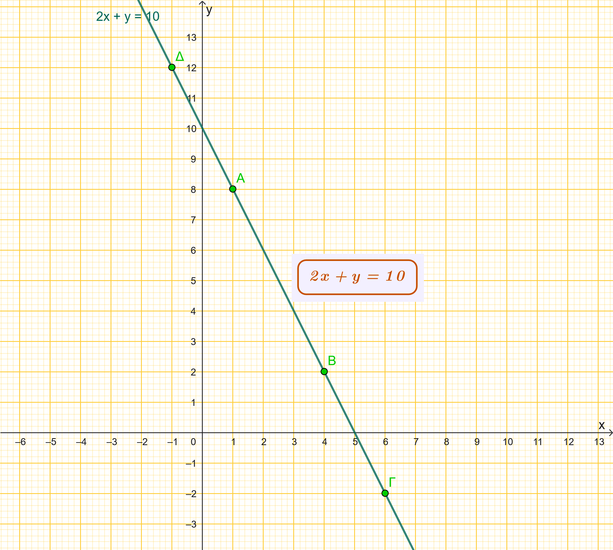
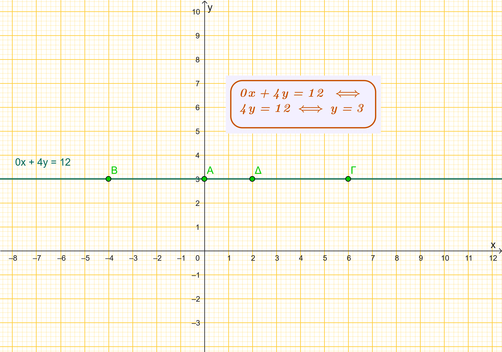
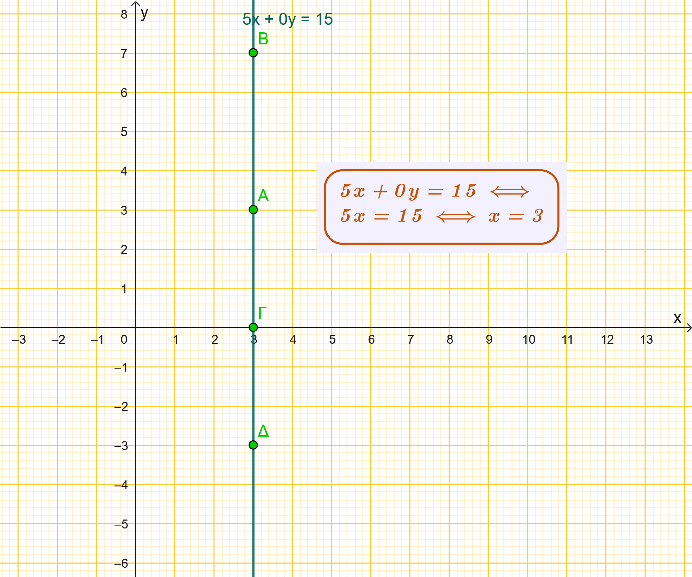
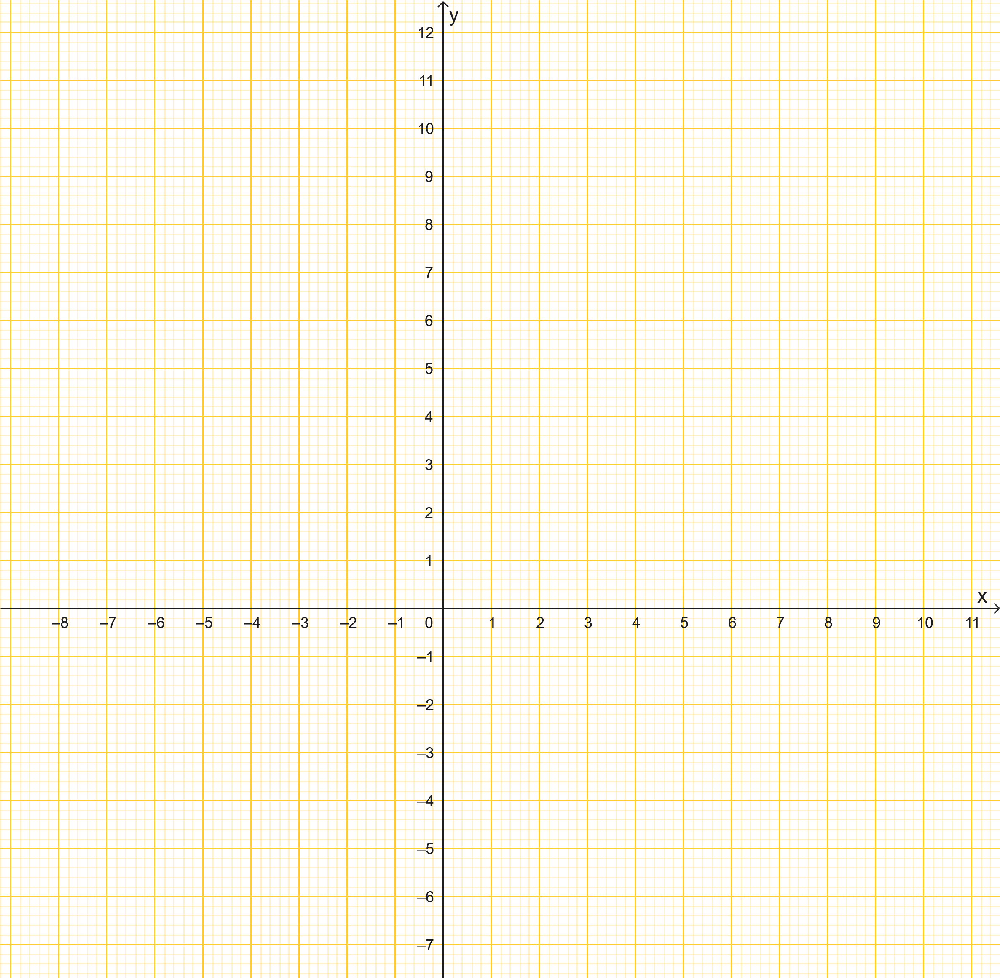
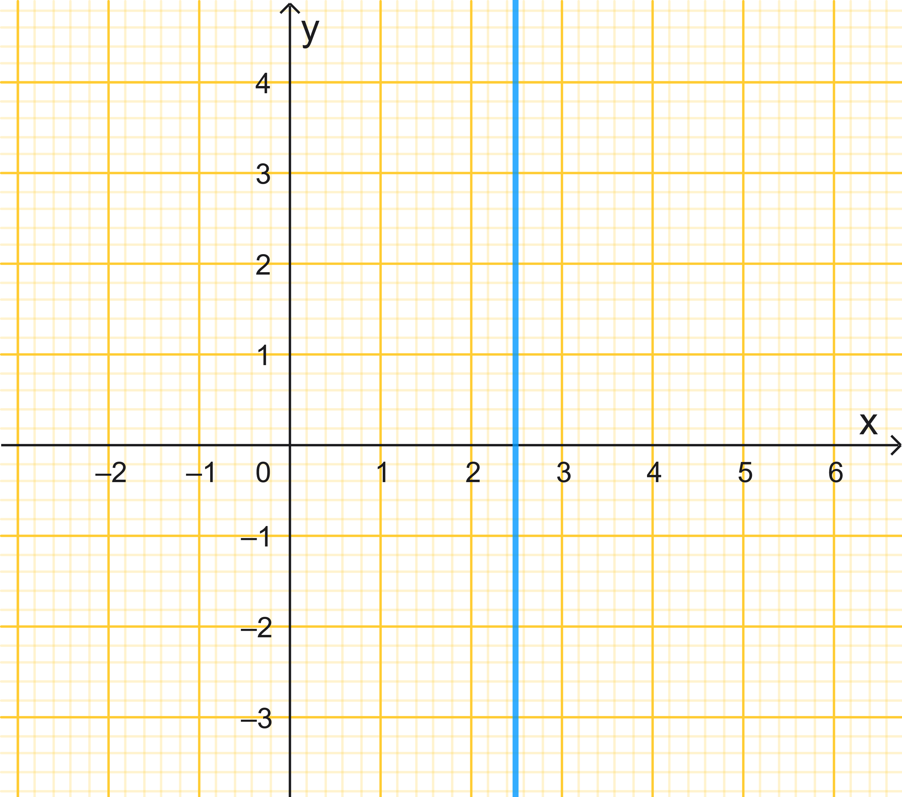
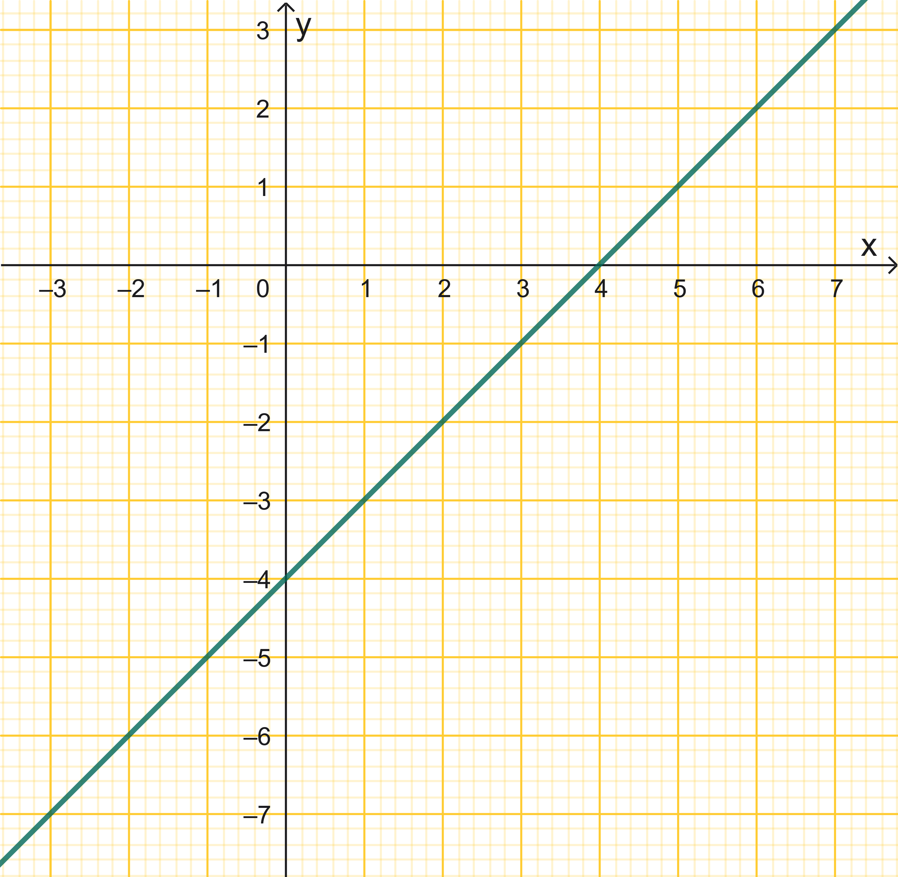
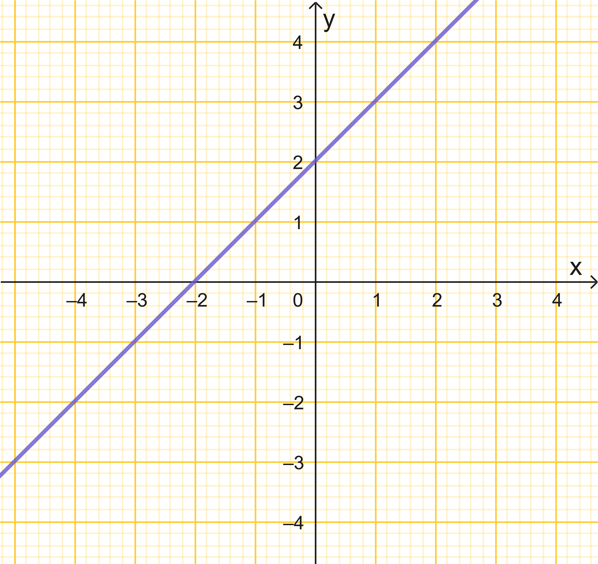
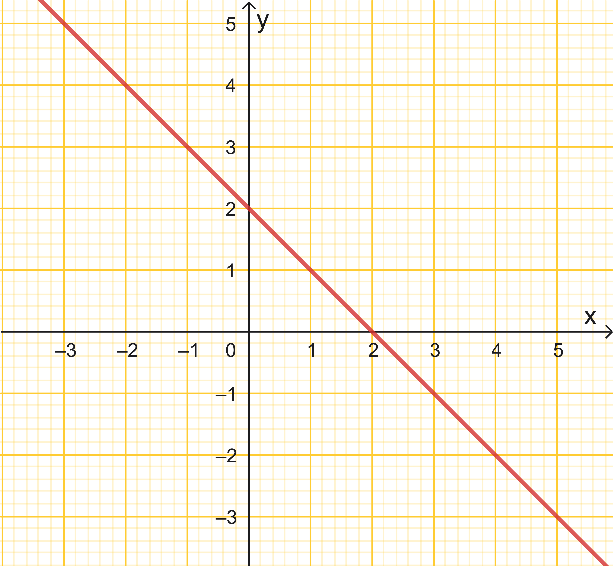
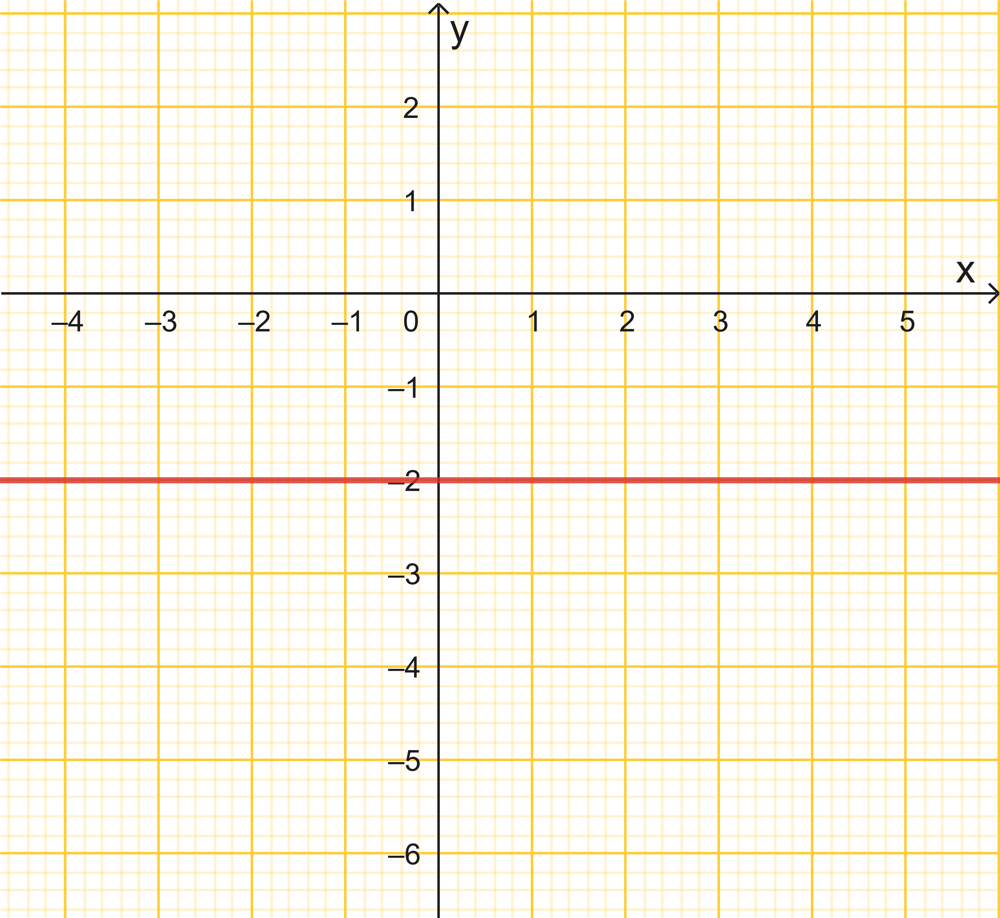

```{=html}
<!-- Φόρτωση βιβλιοθήκης GeoGebra -->
<script src="https://www.geogebra.org/apps/deployggb.js"></script>

<!-- Συνάρτηση δημιουργίας applets -->
<script>
function createGeoGebra(containerId, materialId, width = 700, height = 500) {
  var params = {
    "id": "ggb-" + containerId,
    "material_id": materialId,
    "width": width,
    "height": height,
    "showToolBar": true,
    "showMenuBar": false,
    "showAlgebraInput": true
  };
  
  var applet = new GGBApplet(params, '5.2');
  applet.inject(containerId);
}
</script>
```

## Η έννοια της γραμμικής εξίσωσης

### Θεωρία

::: {style="background-color: #d3deb8; border: 2px solid #2f3e50; color: #25188a; padding: 15px; border-radius: 5px;"}
Η έννοια της **γραμμικής εξίσωσης** (ή εξίσωσης πρώτου βαθμού) αναφέρεται σε κάθε ισότητα η οποία περιέχει μία ή περισσότερες μεταβλητές (αγνώστους) των οποίων ο εκθέτης είναι η μονάδα.
Μια εξίσωση αληθεύει για ορισμένες τιμές των γραμμάτων της, οι οποίες ονομάζονται **λύσεις ή ρίζες** της εξίσωσης.

#### **1. Γραμμική Εξίσωση με έναν άγνωστο** [***Εχει διδαχτεί***]{style="color: #7ea8ed;"}

Μια εξίσωση πρώτου βαθμού με έναν άγνωστο $x$ έχει τη γενική μορφή $\alpha x + \beta = 0$.
Για την επίλυσή της διακρίνονται οι εξής περιπτώσεις:

- **Μοναδική λύση:** Αν $\alpha \neq 0$, τότε η εξίσωση έχει μοναδική λύση την $x = -\dfrac{\beta}{\alpha}$.
- **Αδύνατη εξίσωση:** Αν $\alpha = 0$ και $\beta \neq 0$, η εξίσωση παίρνει τη μορφή $0 \cdot x = -\beta$ και δεν έχει καμία λύση.
- **Αόριστη εξίσωση (Ταυτότητα):** Αν $\alpha = 0$ και $\beta = 0$, η εξίσωση παίρνει τη μορφή $0 \cdot x = 0$ και αληθεύει για κάθε πραγματικό αριθμό.

**Παραδείγματα:**

\* Η εξίσωση $3x - 7 = x + 5$ καταλήγει στην $2x = 12$, άρα έχει μοναδική ρίζα την $x = 6$.

\* Η εξίσωση $x + 4 = x + 5$ καταλήγει στην $0x = 1$ και είναι αδύνατη.

\* Η εξίσωση $2(x + 3) = 2x + 6$ καταλήγει στην $0x = 0$ και είναι ταυτότητα.

#### **2.** [**Γραμμική Εξίσωση με δύο αγνώστους**]{style="color: #679eeb;"}

Κάθε εξίσωση της μορφής $\alpha x + \beta y + \gamma = 0$ (όπου $\alpha \neq 0$ ή $\beta \neq 0$) ονομάζεται γραμμική εξίσωση με δύο αγνώστους.

- **Λύσεις:** Οι λύσεις της είναι άπειρα **διατεταγμένα ζεύγη** αριθμών $(x, y)$ που την επαληθεύουν.
- **Γραφική Παράσταση:** Στο επίπεδο των συντεταγμένων, το σύνολο των λύσεων μιας τέτοιας εξίσωσης παριστάνεται πάντοτε από μια **ευθεία γραμμή**.

**Παράδειγμα:** Στην εξίσωση $2x + y = 10$, αν θέσουμε $x = 0$ βρίσκουμε $y = 10$, ενώ αν θέσουμε $x = 1$ βρίσκουμε $y = 8$.
Τα ζεύγη $(0, 10)$ και $(1, 8)$ είναι δύο από τις άπειρες λύσεις της.

Η ευθεία που μας δείχνει τα άπειρα σημεία (λύσεις) της εξίσωσης είναι η παρακάτω

{width="531"}

\
Οι συντεταγμένες των σημείων Α,Β,Γ,Δ και όλων των σημείων της ευθείας επαληθεύουν την εξίσωση και αντιστρόφως κάθε ζεύγος (x,y) που επαληθεύει την εξίσωση αναγκαστικά θα ανήκει στην ευθεία.
:::

\

### Ειδικές περιπτώσεις

::: {style="background-color: #d3deb8; border: 2px solid #2f3e50; color: #25188a; padding: 15px; border-radius: 5px;"}
Στην εξίσωση της μορφής $\alpha x + \beta y = \gamma$, η οποία παριστάνει μια **ευθεία γραμμή** στο επίπεδο, οι τιμές των συντελεστών $\alpha, \beta$ και του σταθερού όρου $\gamma$ καθορίζουν τη θέση και τη μορφή της.
Οι ειδικές περιπτώσεις είναι οι εξής:

#### 1. Περίπτωση $\alpha = 0$ (με $\beta \neq 0$)

Όταν ο συντελεστής του $x$ είναι μηδέν, η εξίσωση παίρνει τη μορφή $\beta y = \gamma$ ή $y = \dfrac{\gamma}{\beta}$.

- **Γεωμετρική ερμηνεία:** Παριστάνει μια ευθεία **παράλληλη προς τον άξονα των τετμημένων (**$Ox$).\
  {width="546"}

- **Σημείο τομής:** Η ευθεία τέμνει τον άξονα των τεταγμένων ($Oy$) στο σημείο $(0, \dfrac{\gamma}{\beta})$.

- **Ειδικά αν** $\gamma = 0$: Η εξίσωση γίνεται $y = 0$ και συμπίπτει με τον **άξονα** $Ox$.

#### 2. Περίπτωση $\beta = 0$ (με $\alpha \neq 0$)

Όταν ο συντελεστής του $y$ είναι μηδέν, η εξίσωση παίρνει τη μορφή $\alpha x = \gamma$ ή $x = \frac{\gamma}{\alpha}$.

\* **Γεωμετρική ερμηνεία:** Παριστάνει μια ευθεία **παράλληλη προς τον άξονα των τεταγμένων (**$Oy$).\
{width="553"}

\* **Σημείο τομής:** Η ευθεία τέμνει τον άξονα των τετμημένων ($Ox$) στο σημείο $(\frac{\gamma}{\alpha}, 0)$.

\* **Ειδικά αν** $\gamma = 0$: Η εξίσωση γίνεται $x = 0$ και συμπίπτει με τον **άξονα** $Oy$.

#### 3. Περίπτωση $\alpha = \beta = 0$

Όταν και οι δύο συντελεστές των αγνώστων είναι μηδέν, η εξίσωση παίρνει τη μορφή $0 \cdot x + 0 \cdot y = \gamma$.

\* **Αν** $\gamma \neq 0$: Η εξίσωση καταλήγει στην αδύνατη ισότητα $0 = \gamma$.
Στην περίπτωση αυτή, η εξίσωση ονομάζεται **αδύνατη** και δεν υπάρχει κανένα σημείο στο επίπεδο που να αποτελεί λύση της.

\* **Αν** $\gamma = 0$: Η εξίσωση παίρνει τη μορφή $0 \cdot x + 0 \cdot y = 0$, η οποία επαληθεύεται για οποιοδήποτε ζεύγος πραγματικών αριθμών $(x, y)$.

#### 4. Περίπτωση $\alpha = \beta = \gamma = 0$

Όταν όλοι οι όροι της εξίσωσης είναι μηδέν, έχουμε τη μορφή $0 = 0$.

\* **Χαρακτηρισμός:** Η εξίσωση είναι **αόριστη** ή **ταυτότητα**.

\* **Λύσεις:** Το σύνολο των σημείων-λύσεων είναι **ολόκληρο το επίπεδο**, καθώς κάθε ζεύγος συντεταγμένων $(x, y)$ την επαληθεύει.
:::

### Ασκήσεις

1.  Δίνεται η εξίσωση $3x-8y=24$.

- Να σχεδιάσετε την ευθεία σε ορθογώνιο σύστημα συντεταγμένων

- Αν ένα σημείο Α έχει τετμημένη -2, ποια πρέπει να είναι η τεταγμένη του για να αποτελεί λύση της εξίσωσης;

- Αν ένα σημείο Β έχει τεταγμένη 2, ποια πρέπει να είναι η τετμημένη του για να αποτελεί λύση της εξίσωσης;

*Σχέδιο*

{width="561"}

2.  Να εξετάσετε αν αληθεύουν τα παρακάτω

```{=html}
<style type="text/css">
.tg  {border-collapse:collapse;border-spacing:0;}
.tg td{border-color:black;border-style:solid;border-width:1px;font-family:Arial, sans-serif;font-size:14px;
  overflow:hidden;padding:10px 5px;word-break:normal;}
.tg th{border-color:black;border-style:solid;border-width:1px;font-family:Arial, sans-serif;font-size:14px;
  font-weight:normal;overflow:hidden;padding:10px 5px;word-break:normal;}
.tg .tg-gk6h{background-color:#96fffb;border-color:#3531ff;color:#3531ff;font-weight:bold;text-align:center;vertical-align:top}
.tg .tg-868q{background-color:#999903;border-color:inherit;color:#3531FF;font-style:italic;font-weight:bold;text-align:left;
  vertical-align:top}
.tg .tg-tcxz{background-color:#9698ed;border-color:#efefef;color:#963400;
  font-family:"Trebuchet MS", Helvetica, sans-serif !important;font-size:18px;font-weight:bold;text-align:center;
  vertical-align:top}
.tg .tg-ev2w{background-color:#9698ed;border-color:#ebeba2;color:#663234;font-family:Georgia, serif !important;font-size:18px;
  font-weight:bold;text-align:center;vertical-align:top}
.tg .tg-0pky{border-color:inherit;text-align:left;vertical-align:top}
.tg .tg-ujxi{background-color:#999903;border-color:inherit;color:#3531ff;font-style:italic;font-weight:bold;text-align:left;
  vertical-align:top}
.tg .tg-nggv{background-color:#9698ed;border-color:#6200c9;color:#036400;
  font-family:"Comic Sans MS", cursive, sans-serif !important;font-size:18px;font-weight:bold;text-align:center;
  vertical-align:top}
</style>
<table class="tg"><thead>
  <tr>
    <th class="tg-0pky"></th>
    <th class="tg-gk6h">ΝΑΙ/ΟΧΙ</th>
  </tr></thead>
<tbody>
  <tr>
    <td class="tg-ujxi">Το σημείο (-2,2) ανήκει στην ευθεία  2x-5y=-14</td>
    <td class="tg-ev2w"></td>
  </tr>
  <tr>
    <td class="tg-ujxi">Η ευθεία \(5x-y=7\) περνάει από την αρχή των αξόνων</td>
    <td class="tg-ev2w"></td>
  </tr>
  <tr>
    <td class="tg-ujxi">Η ευθεία \(3x-2y=6\) τέμνει τον άξονα y'y στο σημείο (0,3)</td>
    <td class="tg-tcxz"></td>
  </tr>
  <tr>
    <td class="tg-868q">Η ευθεία \(3x+2y=6\) τέμνει τον άξονα x'x στο σημείο (-2,0)</td>
    <td class="tg-tcxz"> </td>
  </tr>
  <tr>
    <td class="tg-ujxi">Το σημείο (-3,3) δεν ανήκει στη ευθεία \(x-y=0\)</td>
    <td class="tg-nggv"> </td>
  </tr>
</tbody>
</table> 
```

3.  Να συμπληρώσετε τον πίνακα αντιστοιχίζοντας σε κάθε ευθεία ε των παρακάτω σχημάτων μία από τις εξισώσεις:

|          |                                                   |
|:--------:|:-------------------------------------------------:|
| $x=2,5$  | {width="200"} |
| $x+y=2$  | {width="200"} |
|  $y=-2$  | {width="200"} |
| $x-y=4$  | {width="200"} |
| $-x+y=2$ | {width="200"}  |


4.  Να σχεδιάσετε στο ίδιο σύστημα αξόνων τις ευθείες:

  - $ε_1 : 3x - 2y = 6$

  - $ε_2 : -6x + 4y = 10$

  - $ε_3: 12x - 8y = 2$
  Τι παρατηρείτε; 

5.  **Σημεία τομής- Εμβαδόν**  Να βρείτε τα σημεία τομής Α και Β της ευθείας $2x+6y=12$ με τους άξονες x'x ,  y'y και το εμβαδόν του τριγώνου $\triangle \ ΟΑΒ$

6.  **Έλεγχος λύσης:** Να εξετάσετε αν τα διατεταγμένα ζεύγη $(1, 4)$ και $(-2, 7)$ αποτελούν λύσεις της εξίσωσης $x + y = 5$.

7.  **Εύρεση ζευγών:** Για την εξίσωση $5x + 2y - 12 = 0$, να βρείτε τρεις διαφορετικές λύσεις με τη μορφή διατεταγμένων ζευγών.

8.  **Συμπλήρωση πίνακα:** Δίνεται η εξίσωση $2x + 3y - 6 = 0$. Να συμπληρώσετε τον πίνακα.

```{=html}
<style type="text/css">
.tg  {border-collapse:collapse;border-spacing:0;}
.tg td{border-color:black;border-style:solid;border-width:1px;font-family:Arial, sans-serif;font-size:14px;
  overflow:hidden;padding:10px 5px;word-break:normal;}
.tg th{border-color:black;border-style:solid;border-width:1px;font-family:Arial, sans-serif;font-size:14px;
  font-weight:normal;overflow:hidden;padding:10px 5px;word-break:normal;}
.tg .tg-pk9u{background-color:#cbcefb;border-color:#ce6301;color:#f56b00;
  font-family:"Comic Sans MS", cursive, sans-serif !important;font-size:16px;text-align:center;vertical-align:top}
.tg .tg-g54c{background-color:#ffcb2f;border-color:#ce6301;color:#3531ff;
  font-family:"Comic Sans MS", cursive, sans-serif !important;font-size:16px;font-weight:bold;text-align:center;
  vertical-align:top}
.tg .tg-kwqc{background-color:#9aff99;border-color:#ce6301;color:#643403;
  font-family:"Comic Sans MS", cursive, sans-serif !important;font-size:16px;text-align:center;vertical-align:top}
.tg .tg-mnfh{background-color:#9aff99;border-color:#ce6301;color:#643403;
  font-family:"Comic Sans MS", cursive, sans-serif !important;font-size:16px;font-weight:bold;text-align:center;
  vertical-align:top}
.tg .tg-4rk5{background-color:#ffcb2f;border-color:#ce6301;color:#3531ff;
  font-family:"Comic Sans MS", cursive, sans-serif !important;font-size:16px;font-style:italic;font-weight:bold;
  text-align:center;vertical-align:top}
.tg .tg-gcoz{background-color:#ffcb2f;border-color:#ce6301;color:#3531ff;
  font-family:"Comic Sans MS", cursive, sans-serif !important;font-size:16px;text-align:center;vertical-align:top}
</style>
<table class="tg"><thead>
  <tr>
    <th class="tg-pk9u" colspan="2">\(2x + 3y - 6 = 0\)</th>
  </tr></thead>
<tbody>
  <tr>
    <td class="tg-g54c">x</td>
    <td class="tg-mnfh">y</td>
  </tr>
  <tr>
    <td class="tg-4rk5">x=-2</td>
    <td class="tg-mnfh"></td>
  </tr>
  <tr>
    <td class="tg-g54c">x=3</td>
    <td class="tg-kwqc"></td>
  </tr>
  <tr>
    <td class="tg-gcoz"></td>
    <td class="tg-mnfh">y=8</td>
  </tr>
  <tr>
    <td class="tg-4rk5"></td>
    <td class="tg-mnfh">y=-1</td>
  </tr>
  <tr>
    <td class="tg-4rk5">x=-1</td>
    <td class="tg-mnfh"></td>
  </tr>
  <tr>
    <td class="tg-4rk5"></td>
    <td class="tg-mnfh"> y=-2</td>
  </tr>
  <tr>
    <td class="tg-4rk5">x=2</td>
    <td class="tg-mnfh"> </td>
  </tr>
</tbody>
</table>
```


9.  **Ανοικτή επαλήθευση:** Να εξετάσετε αν το ζεύγος $(6, 0)$ είναι λύση της εξίσωσης $5x + 2y - 12 = 0$.

10.  **Επιλογή αγνώστου:** Να λύσετε την εξίσωση $2x + y = 10$ ως προς $y$ και να βρείτε τη λύση που αντιστοιχεί σε $x = 2$.


11.  **Εύρεση σταθεράς:** Να προσδιορίσετε τον αριθμό $\alpha$, ώστε η εξίσωση $5x + 2y = \alpha$ να έχει ως λύση το διατεταγμένο ζεύγος $(4, 7)$.

12.  **Παράμετρος σε ευθεία:** Στην εξίσωση $y = \alpha x + 2$, να βρείτε το $\alpha$ αν γνωρίζετε ότι η γραφική της παράσταση διέρχεται από το σημείο $A(-7, -12)$.

13.  **Σταθερός όρος:** Να βρείτε το $\beta$ στη συνάρτηση $y = -3x + \beta$, αν το σημείο $B(-2, 4)$ ανήκει στη γραφική της παράσταση.


14.  **Τομή με άξονες:** Να κατασκευάσετε την ευθεία που παριστάνει η εξίσωση $2x + 3y = 9$ βρίσκοντας τα σημεία τομής της με τους άξονες $Ox$ και $Oy$.

15. **Ευθεία από την αρχή:** Να σχεδιάσετε τη γραφική παράσταση της εξίσωσης $3x - 2y = 0$, αφού βρείτε ένα σημείο της εκτός από την αρχή των αξόνων.

16. **Γενική κατασκευή:** Να σχεδιάσετε στο ίδιο σύστημα αξόνων τις ευθείες $y = x$ και $y = -x$.

17. **Πολυωνυμική μορφή:** Να φέρετε την εξίσωση $2(x - 1) - 3(y + 2) = 0$ στη μορφή $\alpha x + \beta y + \gamma = 0$ και να την παραστήσετε γραφικά.


18. **Κατακόρυφη ευθεία:** Να σχεδιάσετε τη γραφική παράσταση της εξίσωσης $x - 2 = 0$ και να περιγράψετε τη θέση της ως προς τους άξονες.

19. **Οριζόντια ευθεία:** Να σχεδιάσετε την ευθεία $y + 2 = 0$. Ποια είναι η τεταγμένη όλων των σημείων της;.

20. **Άξονες συντεταγμένων:** Ποια εξίσωση παριστάνει τον άξονα των τεταγμένων ($y'y$) και ποια τον άξονα των τετμημένων ($x'x$);.


21. **Σημείο και αρχή:** Ποια είναι η εξίσωση της ευθείας που περνά από την αρχή των αξόνων $O(0,0)$ και από το σημείο $M(4, 6)$;.

*Θυμηθείτε: Πρέπει* $y=ax$

22. **Κλίση και σημείο:** Να βρείτε την εξίσωση της ευθείας που έχει κλίση $\lambda = \dfrac{2}{3}$ και περνάει από το σημείο $(0,2)$.

*Θυμηθείτε: Πρέπει* $y=\dfrac{2}{3}x+β$

23. **Πρόβλημα γεωμετρίας:** Ένα ορθογώνιο έχει περίμετρο $75$ cm. Να γράψετε τη γραμμική εξίσωση που συνδέει τα μήκη των πλευρών του $x$ και $y$.

24. **Σχετική θέση:** Να εξετάσετε γραφικά αν οι ευθείες $2x + 3y = 9$ και $6x + 9y = 4$ έχουν κοινά σημεία.


------------------------------------------------------------------------

$$\bbox[yellow, 5px]{\color{blue}\Large\text{---}}$$

::: {.callout-tip style="color: brown;"}
## Ενέργεια
:::

::: {style="background-color: #d3deb8; border: 2px solid #2f3e50; color: #25188a; padding: 15px; border-radius: 5px;"}
:::

::: {.callout-tip style="color: brown;"}
ΚΑΛΗ ΜΕΛΕΤΗ!
:::

\
\
