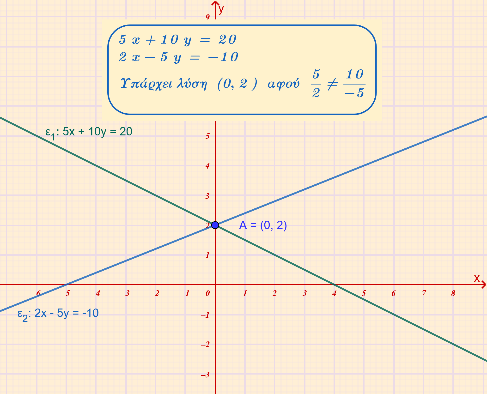
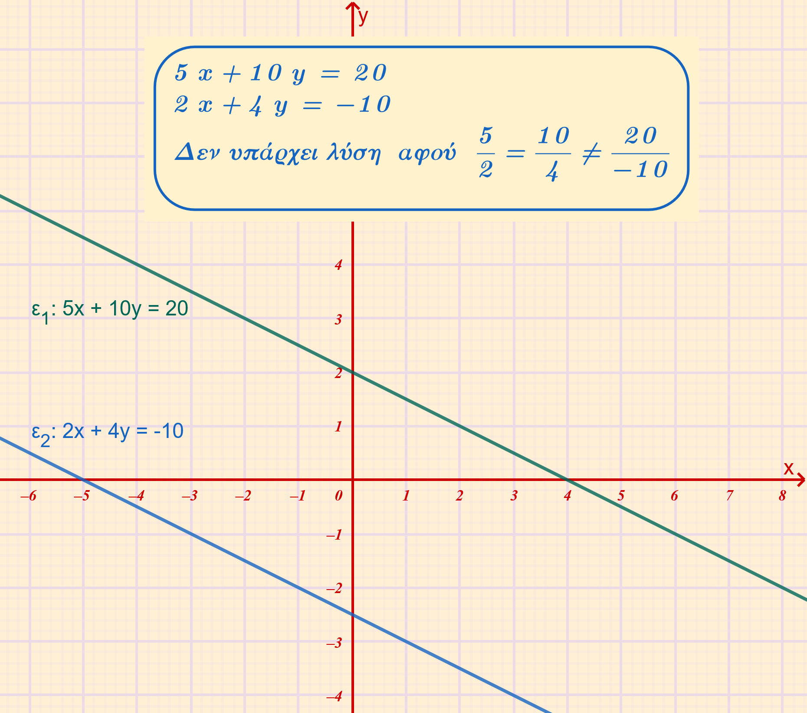
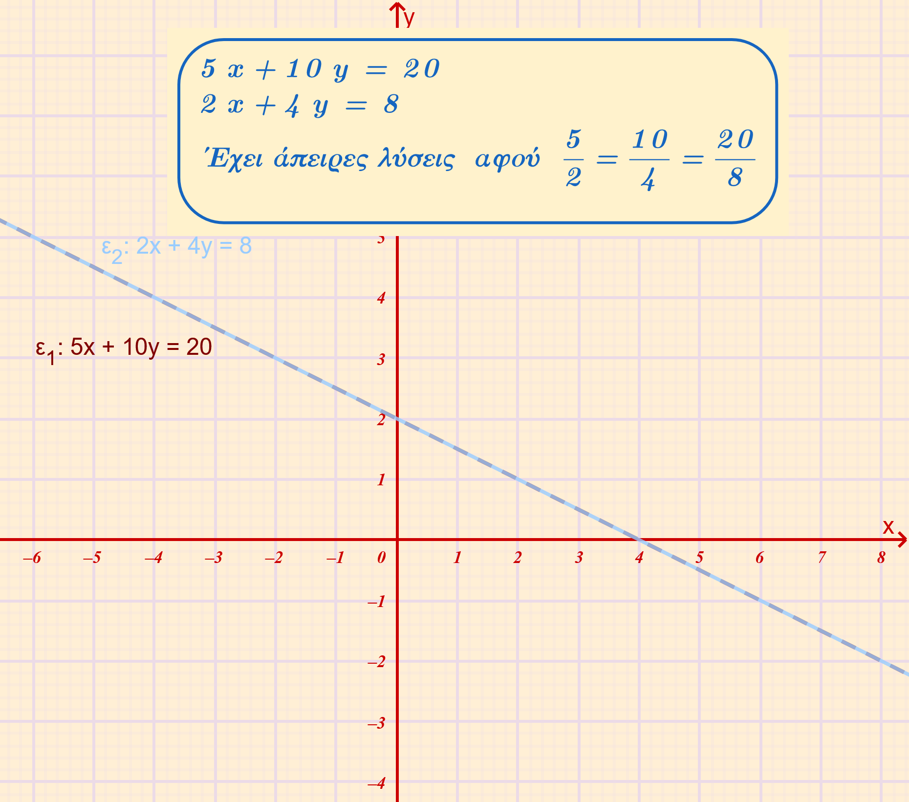
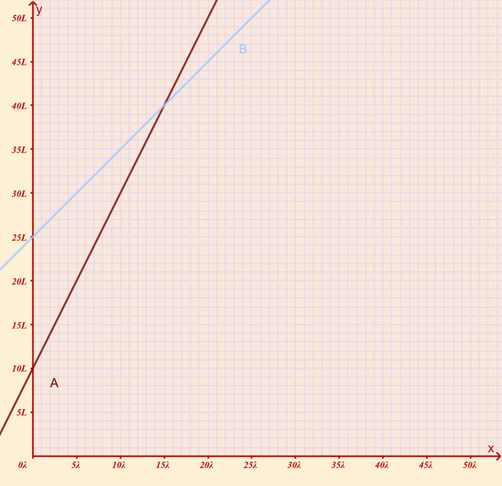
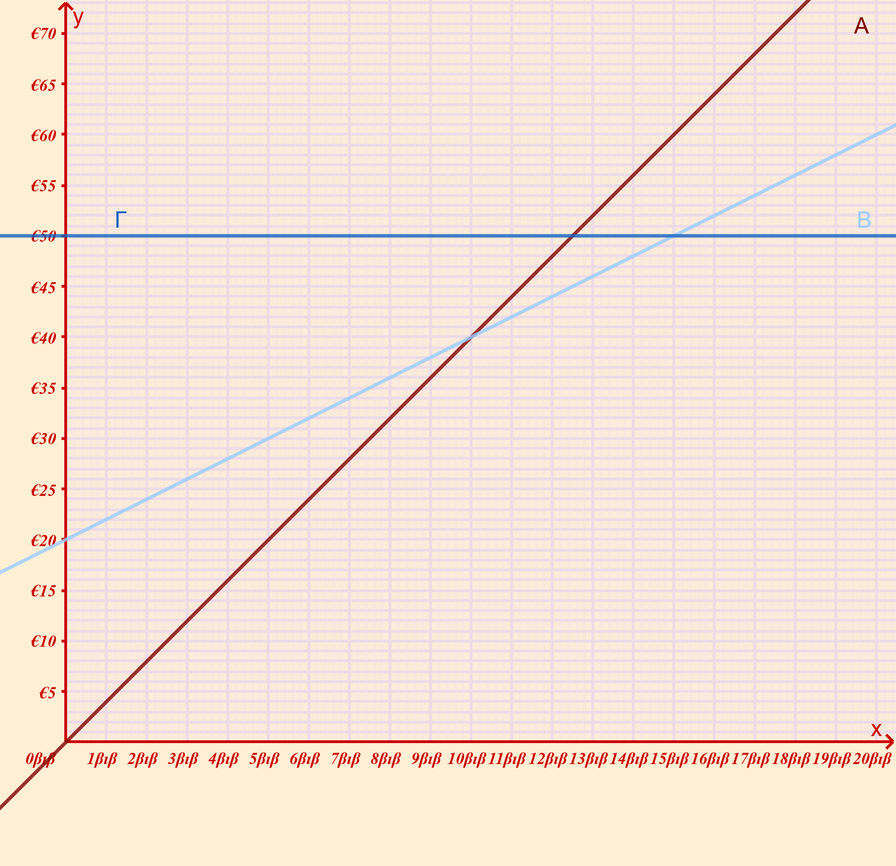

```{=html}
<!-- Φόρτωση βιβλιοθήκης GeoGebra -->
<script src="https://www.geogebra.org/apps/deployggb.js"></script>

<!-- Συνάρτηση δημιουργίας applets -->
<script>
function createGeoGebra(containerId, materialId, width = 700, height = 500) {
  var params = {
    "id": "ggb-" + containerId,
    "material_id": materialId,
    "width": width,
    "height": height,
    "showToolBar": true,
    "showMenuBar": false,
    "showAlgebraInput": true
  };
  
  var applet = new GGBApplet(params, '5.2');
  applet.inject(containerId);
}
</script>
```

## Η έννοια του γραμμικού συστήματος και η γραφική επίλυσή του

### Θεωρία

::: {style="background-color: #d3deb8; border: 2px solid #2f3e50; color: #25188a; padding: 15px; border-radius: 5px;"}
Ένα γραμμικό σύστημα (ή σύστημα δύο εξισώσεων πρώτου βαθμού με δύο αγνώστους) αποτελείται από δύο εξισώσεις της μορφής $ax + \beta y = \gamma$ και $a'x + \beta'y = \gamma'$.

**Λύση του συστήματος** ονομάζεται κάθε διατεταγμένο ζεύγος αριθμών $(x, y)$ που επαληθεύει ταυτόχρονα και τις δύο εξισώσεις του.

#### Η Έννοια της Γραφικής Επίλυσης

Κάθε γραμμική εξίσωση με δύο αγνώστους παριστάνεται γεωμετρικά από μία **ευθεία γραμμή** στο επίπεδο των συντεταγμένων.
Η γραφική επίλυση ενός συστήματος βασίζεται στην κατασκευή αυτών των δύο ευθειών ($\epsilon_1$ και $\epsilon_2$) στο ίδιο σύστημα αξόνων.

Το **κοινό σημείο** των δύο ευθειών, εάν υπάρχει, έχει συντεταγμένες που αποτελούν την κοινή λύση των δύο εξισώσεων, δηλαδή τη λύση του συστήματος.

#### Πιθανές Περιπτώσεις και Θεωρία

Ανάλογα με τη σχετική θέση των δύο ευθειών στο επίπεδο, ένα γραμμικό σύστημα μπορεί να έχει μία λύση, καμία λύση ή άπειρες λύσεις:

1.  **Μοναδική Λύση**: Οι δύο ευθείες **τέμνονται** σε ένα μόνο σημείο.
    Αυτό συμβαίνει όταν οι συντελεστές των αγνώστων δεν είναι ανάλογοι μεταξύ τους $\left(\dfrac{a}{a'} \neq \dfrac{\beta}{\beta'}\right)$, δηλαδή οι ευθείες έχουν διαφορετικό γωνιακό συντελεστή.\

    \
    {width="472"}

2.  **Καμία Λύση (Αδύνατο Σύστημα)**: Οι δύο ευθείες είναι **παράλληλες** και δεν έχουν κανένα κοινό σημείο.
    Αυτό συμβαίνει όταν οι λόγοι των συντελεστών των αγνώστων είναι ίσοι, αλλά διαφορετικοί από τον λόγο των σταθερών όρων $\left(\dfrac{a}{a'} = \dfrac{\beta}{\beta'} \neq \dfrac{\gamma}{\gamma'}\right)$.\

    {width="471"}\

3.  **Άπειρες Λύσεις (Αόριστο Σύστημα)**: Οι δύο ευθείες **συμπίπτουν**.
    Αυτό συμβαίνει όταν όλοι οι λόγοι των συντελεστών και των σταθερών όρων είναι ίσοι μεταξύ τους $\left(\dfrac{a}{a'} = \dfrac{\beta}{\beta'} = \dfrac{\gamma}{\gamma'}\right)$.\

    {width="477"}\
:::

### Παραδείγματα

- **Παράδειγμα Μοναδικής Λύσης**: Στο σύστημα εξισώσεων $2x + 3y - 12 = 0$ και $3x - 2y - 5 = 0$, οι αντίστοιχες ευθείες τέμνονται στο σημείο $M(3, 2)$. Το ζεύγος $(3, 2)$ είναι η μοναδική λύση του συστήματος. Ένα άλλο παράδειγμα είναι το σύστημα $2x + y = 10$ και $5x - 2y = -2$, όπου οι ευθείες τέμνονται στο σημείο με συντεταγμένες $x=2$ και $y=6$.
- **Παράδειγμα Αδύνατου Συστήματος**: Θεωρούμε το σύστημα $x - 2y = 1$ και $3x - 6y = 8$. Εδώ παρατηρούμε ότι $\dfrac{1}{3} = \dfrac{-2}{-6} \neq \dfrac{1}{8}$, επομένως οι ευθείες είναι παράλληλες και το σύστημα δεν έχει λύση.
- **Παράδειγμα Αόριστου Συστήματος**: Στο σύστημα $x - 2y = 5$ και $3x - 6y = 15$, ισχύει $\dfrac{1}{3} = \dfrac{-2}{-6} = \dfrac{5}{15}$. Οι δύο ευθείες συμπίπτουν και το σύστημα έχει άπειρες λύσεις.

Η γραφική επίλυση προσφέρει μια εποπτική εικόνα του συστήματος, αλλά η ακρίβειά της εξαρτάται από την ποιότητα της κατασκευής των γραμμών και τη δυνατότητα ακριβούς μέτρησης των συντεταγμένων του σημείου τομής.

------------------------------------------------------------------------

### Ασκήσεις

1.  Αν οι εξισώσεις ενός γραμμικού συστήματος παριστάνονται με τις ευθείες $\color{#17612b}{\mathbf{ε_1}}$ και $\color{#17612b}{\mathbf{ε_2}}$, να αντιστοιχίσετε τις προτάσεις αναμέσα στις δύο στήλες ώστε να είναι σωστές.

```{=html}

<style type="text/css">
.tg  {border-collapse:collapse;border-spacing:0;}
.tg td{border-color:black;border-style:solid;border-width:1px;font-family:Arial, sans-serif;font-size:14px;
  overflow:hidden;padding:10px 5px;word-break:normal;}
.tg th{border-color:black;border-style:solid;border-width:1px;font-family:Arial, sans-serif;font-size:14px;
  font-weight:normal;overflow:hidden;padding:10px 5px;word-break:normal;}
.tg .tg-pk9u{background-color:#cbcefb;border-color:#ce6301;color:#f56b00;
  font-family:"Comic Sans MS", cursive, sans-serif !important;font-size:16px;text-align:center;vertical-align:top}
.tg .tg-whv6{background-color:#9aff99;border-color:#ce6301;color:#643403;
  font-family:"Comic Sans MS", cursive, sans-serif !important;font-size:16px;font-style:italic;font-weight:bold;
  text-align:center;vertical-align:top}
.tg .tg-g54c{background-color:#ffcb2f;border-color:#ce6301;color:#3531ff;
  font-family:"Comic Sans MS", cursive, sans-serif !important;font-size:16px;font-weight:bold;text-align:center;
  vertical-align:top}
.tg .tg-4rk5{background-color:#ffcb2f;border-color:#ce6301;color:#3531ff;
  font-family:"Comic Sans MS", cursive, sans-serif !important;font-size:16px;font-style:italic;font-weight:bold;
  text-align:center;vertical-align:top}
</style>
<table class="tg"><thead>
  <tr>
    <th class="tg-pk9u" colspan="2">Αντιστοίχιση</th>
  </tr></thead>
<tbody>
  <tr>
    <td class="tg-g54c">Το σύστημα έχει μία λύση</td>
    <td class="tg-whv6">οι ευθείες είναι παράλληλες</td>
  </tr>
  <tr>
    <td class="tg-4rk5">Το σύστημα είναι αόριστο</td>
    <td class="tg-whv6">οι ευθείες τέμνονται σε ένα σημείο</td>
  </tr>
  <tr>
    <td class="tg-g54c">Το σύστημα είναι αδύνατο</td>
    <td class="tg-whv6">οι ευθείες συμπίπτουν - ταυτίζονται</td>
  </tr>
</tbody>
</table>
```

2.  Να λύσετε γραφικά τα συστήματα

::: columns
::: {.column width="50%"}
         
1.  $\begin{cases} 2x + y = 10 \\ 5x - 2y = -2 \end{cases}$ .

2.  $\begin{cases} 2x + 3y - 12 = 0 \\ 3x - 2y - 5 = 0 \end{cases}$

3.  $\begin{cases} x - 2y = 1 \\ 3x - 6y = 8 \end{cases}$.

4.  $\begin{cases} \mathbf{2x - \psi + 4 = 0} \\ \mathbf{x - \dfrac{\psi}{2} + 2 = 0} \end{cases}$

5.  $\begin{cases} \mathbf{2x - 5\psi = 10} \\ \mathbf{-x + \dfrac{5}{2}\psi = -5} \end{cases}$

6.  $\begin{cases} x - \psi = 4 \\ 3x - 3\psi + 6 = 0 \end{cases}$.

7.  $\begin{cases} x - 3\psi = 6 \\ x + \psi = 10 \end{cases}$ .

8.  $\begin{cases} 2x + \psi = 5 \\ x - \psi = 1 \end{cases}$ .

9.  $\begin{cases} \mathbf{\frac{x}{3} + \frac{y}{4} = \dfrac{1}{6}} \\ \mathbf{\dfrac{x}{6} + \dfrac{y}{8} = \frac{3}{5}} \end{cases}$

10. $\begin{cases} x - 2y = 5 \\ 3x - 6y = 15 \end{cases}$.

:::

::: {.column width="50%"}
         
11. $\begin{cases} x + \psi = 3 \\ 2x + 2\psi - 6 = 0 \end{cases}$.

12. $\begin{cases} \mathbf{\frac{x}{3} - \dfrac{\psi}{2} = 1} \\ \mathbf{2x - 5\psi = -2} \end{cases}$

13. $\begin{cases} \mathbf{\frac{x}{5} - \dfrac{\psi}{3} = \frac{3}{5}} \\ \mathbf{\frac{x}{5} + \frac{\psi}{3} = \frac{21}{5}} \end{cases}$

14. $\begin{cases} 2x - 3\psi + 6 = 0 \\ -4x + 6\psi - 12 = 0 \end{cases}$.

15. $\begin{cases} x + 2y + 4 = 0 \\ 3x - y - 9 = 0 \end{cases}$

16. $\begin{cases} 3x + \psi - 6 = 0 \\ 6x + 2\psi + 9 = 0 \end{cases}$.

17. $\begin{cases} x + y - 2 = 0 \\ 2x + 2y + 7 = 0 \end{cases}$.

18. $\begin{cases} x - 2y = 3 \\ -2x + 4y - 6 = 0 \end{cases}$.

19. $\begin{cases} 4x - 6y - 12 = 0 \\ 2x - 3y - 6 = 0 \end{cases}$.

20. $\begin{cases} 4x + 3y + 6 = 0 \\ 4x + 3y + 4 = 0 \end{cases}$.

:::
:::

3.  **Πρόβλημα με δοχεία νερού**

Στο διάγραμμα φαίνεται η ποσότητα νερού (y) (σε λίτρα) που υπάρχει σε δύο δοχεία Α και Β σε σχέση με τον χρόνο (x) (σε λεπτά).

- Το δοχείο Α γεμίζει με 2 L ανά λεπτό.
- Το δοχείο Β γεμίζει με 1 L ανά λεπτό.

Να βρεθούν:

α) Η αρχική ποσότητα νερού σε κάθε δοχείο.

β) Ο ρυθμός με τον οποίο γεμίζει κάθε δοχείο.

γ) Μετά από πόσα λεπτά τα δύο δοχεία θα έχουν την ίδια ποσότητα νερού;

δ) Πόσα λίτρα νερού θα περιέχει τότε το καθένα;

{width="536"}

4.  **Πρόβλημα με συνδρομές βιβλιοθήκης**

Μια δημοτική βιβλιοθήκη προσφέρει τρεις τρόπους δανεισμού βιβλίων:

- **Πρόγραμμα Α:** 4 € για κάθε βιβλίο που δανείζεται κάποιος.
- **Πρόγραμμα Β:** Ετήσια συνδρομή 20 € και 2 € για κάθε βιβλίο.
- **Πρόγραμμα Γ:** Ετήσια συνδρομή 50 € και δωρεάν δανεισμός βιβλίων.

Να βρεθούν:

α) Σε ποια ευθεία αντιστοιχεί κάθε πρόγραμμα.

β) Για πόσα βιβλία το κόστος των προγραμμάτων Α και Β είναι το ίδιο;

γ) Αν κάποιος δανειστεί 12 βιβλία, ποιο πρόγραμμα είναι οικονομικότερο;

δ) Αν κάποιος δανειστεί 8 βιβλία, ποιο πρόγραμμα συμφέρει περισσότερο;

ε) Ποιο πρόγραμμα θα διάλεγες αν γνώριζες εκ των προτέρων ότι θα δανειστείς περισσότερα από 20 βιβλία μέσα στη χρονιά;

στ) Αν δανειστείς 15 βιβλία ποιο πρόγραμμα θα διάλεγες;

{width="653"}

------------------------------------------------------------------------

$$\bbox[yellow, 5px]{\color{blue}\Large\text{---}}$$

::: {.callout-tip style="color: brown;"}
## Ενέργεια
:::

::: {style="background-color: #d3deb8; border: 2px solid #2f3e50; color: #25188a; padding: 15px; border-radius: 5px;"}
:::

::: {.callout-tip style="color: brown;"}
ΚΑΛΗ ΜΕΛΕΤΗ!
:::

\
\
