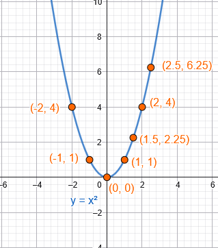
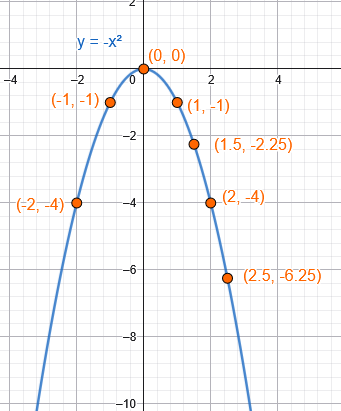
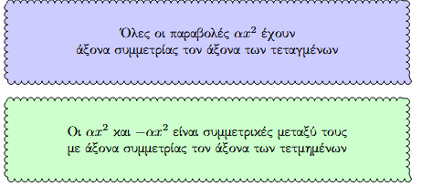
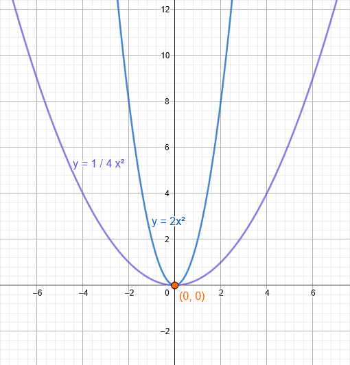
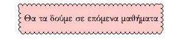

```{=html}
<!-- Φόρτωση βιβλιοθήκης GeoGebra -->
<script src="https://www.geogebra.org/apps/deployggb.js"></script>

<!-- Συνάρτηση δημιουργίας applets -->
<script>
function createGeoGebra(containerId, materialId, width = 700, height = 500) {
  var params = {
    "id": "ggb-" + containerId,
    "material_id": materialId,
    "width": width,
    "height": height,
    "showToolBar": true,
    "showMenuBar": false,
    "showAlgebraInput": true
  };
  
  var applet = new GGBApplet(params, '5.2');
  applet.inject(containerId);
}
</script>
```

## Η συνάρτηση $αx^2$ με $α\ne 0$.

### Θεωρία

::: {style="background-color: #d3deb8; border: 2px solid #2f3e50; color: #25188a; padding: 15px; border-radius: 5px;"}
Η συνάρτηση της μορφής $y=αx^2$ με $α \neq 0$ ονομάζεται **τετραγωνική συνάρτηση**.
Πρόκειται για μια αριθμητική συνάρτηση μιας πραγματικής μεταβλητής $x$, η οποία απεικονίζει το σύνολο των πραγματικών αριθμών $\mathbb{R}$ (πεδίο ορισμού) σε ένα υποσύνολο των πραγματικών αριθμών (πεδίο τιμών).

**H συνάρτησης** $\mathbf{y=αx^2}$

- **Γραφική Παράσταση (Παραβολή):** Η γραφική παράσταση αυτής της συνάρτησης είναι μια συνεχή καμπύλη γραμμή που ονομάζεται **παραβολή**.
- **Κορυφή:** Η παραβολή διέρχεται από την αρχή των αξόνων $O(0,0)$, καθώς για $x=0$ προκύπτει $y=0$. Το σημείο αυτό αποτελεί την **κορυφή** της παραβολής.
- **Άξονας Συμμετρίας:** Η καμπύλη είναι συμμετρική ως προς τον άξονα των τεταγμένων ($y'y$). Αυτό σημαίνει ότι για αντίθετες τιμές του $x$ (π.χ. $x$ και $-x$), η συνάρτηση λαμβάνει την ίδια τιμή $y$.
- **Ο ρόλος του συντελεστή** $α$:
  - **Όταν** $α > 0$: Η παραβολή βρίσκεται ολόκληρη πάνω από τον άξονα των $x$ (στο 1ο και 2ο τεταρτημόριο). Σε αυτή την περίπτωση, η κορυφή $O(0,0)$ είναι το σημείο όπου η συνάρτηση παρουσιάζει **ελάχιστο**. Όσο αυξάνεται η απόλυτη τιμή του $x$, αυξάνεται και το $y$.
  - **Όταν** $α < 0$: Η παραβολή βρίσκεται κάτω από τον άξονα των $x$ (στο 3ο και 4ο τεταρτημόριο). Η κορυφή $O(0,0)$ είναι το σημείο όπου η συνάρτηση παρουσιάζει **μέγιστο**. Όσο αυξάνεται η απόλυτη τιμή του $x$, η τιμή του $y$ μειώνεται (γίνεται πιο αρνητική).
  - **Απόλυτη τιμή** $|α|$: Η τιμή του $|α|$ καθορίζει το «άνοιγμα» της παραβολής. Μεγαλύτερο $|α|$ αντιστοιχεί σε πιο «κλειστή» παραβολή (πιο κοντά στον άξονα $y'y$), ενώ μικρότερο $|α|$ σε πιο «ανοικτή».
- **Συμμετρία:** Οι παραβολές $y=αx^2$ και $y=-αx^2$ είναι συμμετρικές μεταξύ τους ως προς τον άξονα των $x$ ($x'x$).\

\

<iframe src="https://www.geogebra.org/calculator/udabp4ht?embed" width="730" height="700" allowfullscreen style="border: 1px solid #e4e4e4;border-radius: 4px;" frameborder="0">

</iframe>
:::

::: {.callout-tip style="color:green;"}
Μετακινήστε τον δρομέα α για να δείτε τι συμβαίνει όταν αλλάζει το α της συνάρτησης
:::

### Παραδείγματα

**1. Η συνάρτηση** $y = x^2$ (όπου $α = 1 > 0$):

::::: columns
::: {.column width="50%"}
Ο πίνακας τιμών για τη σχεδίαση της παραβολής περιλαμβάνει ζεύγη όπως:

- Για $x = 0, y = 0 \rightarrow (0,0)$\

- Για $x = \pm1, y = 1 \rightarrow (1,1), (-1,1)$\

- Για $x = \pm2, y = 4 \rightarrow (2,4), (-2,4)$\

- Για $x = \pm3, y = 9 \rightarrow (3,9), (-3,9)$
:::

::: {.column width="50%"}


Η καμπύλη είναι στραμμένη προς τα πάνω και έχει ελάχιστο στο $(0,0)$.
:::
:::::

**2. Η συνάρτηση** $y = -x^2$ (όπου $α = -1 < 0$):

::::: columns
::: {.column width="50%"}
Η γραφική της παράσταση είναι η παραβολή της $y=x^2$ αντικατοπτρισμένη ως προς τον άξονα $x'x$.
:::

::: {.column width="50%"}


Είναι στραμμένη προς τα κάτω και έχει μέγιστο στο $(0,0)$.
:::
:::::



**3. Σύγκριση** $y = 2x^2$ και $y = \dfrac{1}{4}x^2$:\
\
{width="410"}\

- Η $y = 2x^2$ είναι πιο «στενή» και πλησιάζει γρηγορότερα τον άξονα $y'y$.\
- Η $y = \dfrac{1}{4}x^2$ είναι πιο «ανοιχτή» παραβολή.

### Γενικότερες Μορφές

Η μελέτη της $y=αx^2$ αποτελεί τη βάση για πιο σύνθετες μορφές:\

- $y=αx^2 + γ$: Προκύπτει από κατακόρυφη μετατόπιση της $y=αx^2$ κατά $γ$ μονάδες.\
- $y=α(x+p)^2$: Προκύπτει από οριζόντια μετατόπιση της $y=αx^2$ κατά $-p$ μονάδες.\
- $y=αx^2 + βx + γ$: Η γενική μορφή της δευτεροβάθμιας συνάρτησης, η οποία επίσης παριστάνει παραβολή και μπορεί να σχεδιαστεί μέσω μετατοπίσεων αν μετατραπεί στη μορφή $y=α(x-p)^2 + q$.\
  \
  

------------------------------------------------------------------------

### Ασκήσεις

1.  Δίνεται η συνάρτηση $y=3x^2$.

Να υπολογίσετε:

* (y(2))
* (y(-1))
* (y(0))

2.  Δίνεται η συνάρτηση $y=-2,5x^2$.

Να συμπληρώσετε τον πίνακα τιμών για:

| x    | -3 | -2 | -1 | 0 | 1 | 2 | 3 |
| ---- | -- | -- | -- | - | - | - | - |
| y    |    |    |    |   |   |   |   |


3.  Για τη συνάρτηση $y=5x^2$, να βρείτε τα σημεία της γραφικής παράστασης που αντιστοιχούν στις τιμές:

* (x=-2)
* (x=1)
* (x=3)

4.  Να βρείτε για ποια τιμή του (x) ισχύει: $4x^2=36$

5.  Να εξετάσετε αν το σημείο (A(2,12)) ανήκει στη γραφική παράσταση της συνάρτησης:

$y=3x^2$

6.  Δίνεται η συνάρτηση: $y=\dfrac12 x^2$

Να υπολογίσετε τις τιμές της για:

x=-4, -2, 0, 2, 4 

και να σχεδιάσετε τη γραφική παράσταση.

7.  Να βρείτε την τιμή του $\alpha$ ώστε το σημείο (A(2,20)) να ανήκει στη γραφική παράσταση της συνάρτησης: $y=\alpha x^2$

8.  Δίνεται η συνάρτηση:  $y=-3x^2$

Να βρείτε τα (x) για τα οποία:  y=-27

9.  Συγκρίνετε τις γραφικές παραστάσεις των συναρτήσεων:

$y=x^2$ και  $y=4x^2$

Ποια είναι πιο «στενή»;

10. Να βρείτε το πρόσημο της συνάρτησης: $y=7x^2$ για κάθε $x\in\mathbb{R}$.

11. Το εμβαδόν ενός τετραγώνου δίνεται από τη σχέση: $E(x)=x^2$, όπου (x) το μήκος της πλευράς.

Να υπολογίσετε το εμβαδόν όταν:

* (x=5,cm)
* (x=12,cm)

12. Ένα μέγεθος ορίζεται από τη συνάρτηση: $y=8x^2$

Να βρείτε την τιμή του (y) όταν το (x) διπλασιάζεται από 2 σε 4. Πόσες φορές αυξάνεται το (y);

13. Η απόσταση ενός σώματος από την αρχική θέση του δίνεται από την σχέση:  $s(t)=2t^2$ (σε μέτρα).

Να βρείτε την απόσταση μετά από:

* 1 s
* 3 s
* 5 s

14. Για τη συνάρτηση:  $y=\alpha x^2$ η γραφική παράσταση περνά από το σημείο (B(-3,18)).

Να υπολογίσετε το α.

15. Να βρείτε όλες τις τιμές του $\alpha$ ώστε το σημείο (A(1,$\alpha$) να ανήκει στη γραφική παράσταση της συνάρτησης:  $y=4x^2$

16. Να βρείτε την τιμή του $\alpha$ ώστε η συνάρτηση  $y=\alpha x^2$ να περνά από το σημείο (M(4,48)). Στη συνέχεια να υπολογίσετε την τιμή της για (x=-2).


$$\bbox[yellow, 5px]{\color{blue}\Large\text{---}}$$

::: {.callout-tip style="color: brown;"}
## Ενέργεια
:::

::: {style="background-color: #d3deb8; border: 2px solid #2f3e50; color: #25188a; padding: 15px; border-radius: 5px;"}
:::

::: {.callout-tip style="color: brown;"}
ΚΑΛΗ ΜΕΛΕΤΗ!
:::

\
\
