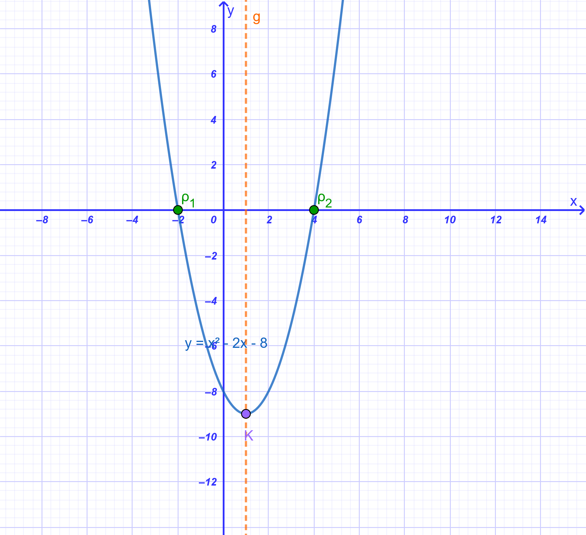
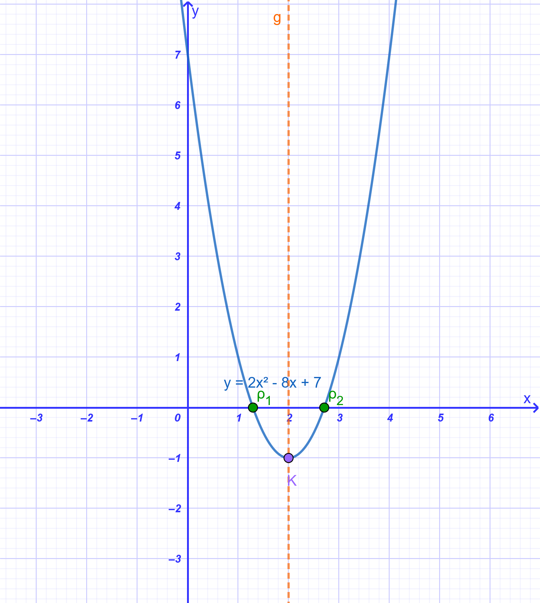
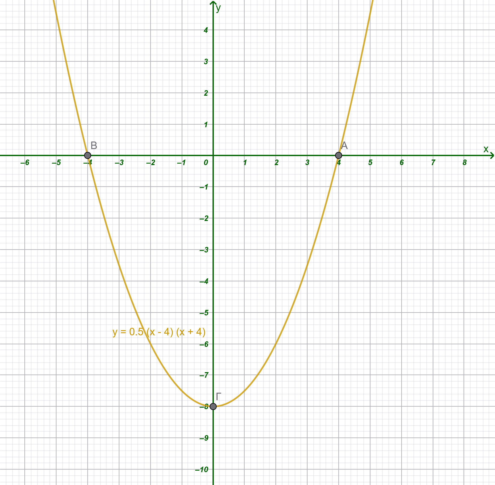
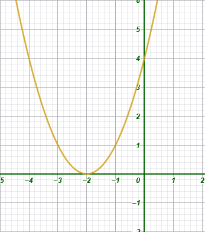
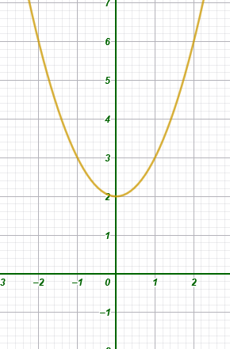
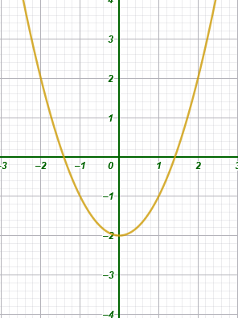
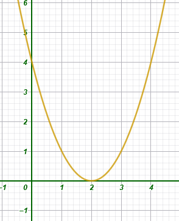
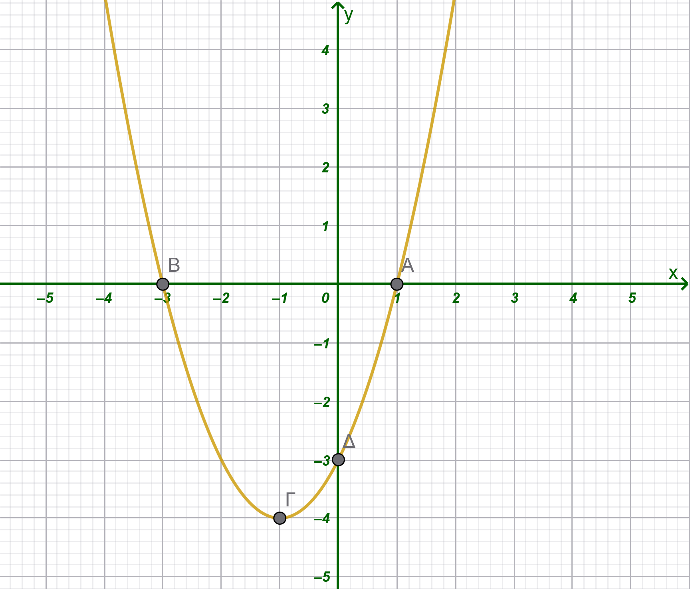

```{=html}
<!-- Φόρτωση βιβλιοθήκης GeoGebra -->
<script src="https://www.geogebra.org/apps/deployggb.js"></script>

<!-- Συνάρτηση δημιουργίας applets -->
<script>
function createGeoGebra(containerId, materialId, width = 700, height = 500) {
  var params = {
    "id": "ggb-" + containerId,
    "material_id": materialId,
    "width": width,
    "height": height,
    "showToolBar": true,
    "showMenuBar": false,
    "showAlgebraInput": true
  };
  
  var applet = new GGBApplet(params, '5.2');
  applet.inject(containerId);
}
</script>
```

## H συνάρτηση $y = αx^2 + βx + γ$ με α ≠ 0.

### Θεωρία

::: {style="background-color: #d3deb8; border: 2px solid #2f3e50; color: #25188a; padding: 15px; border-radius: 5px;"}
Η συνάρτηση της μορφής $y = \alpha x^2 + \beta x + \gamma$ με $\alpha, \beta, \gamma$ σταθερούς πραγματικούς αριθμούς και $\alpha \neq 0$ ονομάζεται **τετραγωνική συνάρτηση** ή συνάρτηση δεύτερου βαθμού.

- **Γραφική Παράσταση:** Η γραφική παράσταση αυτής της συνάρτησης είναι μια συνεχή καμπύλη γραμμή που ονομάζεται **παραβολή**.

- **Η σημασία του συντελεστή** $\alpha$:

  - Αν $\alpha > 0$, η παραβολή έχει τα «κοίλα» στραμμένα προς τα πάνω (θετική κατεύθυνση του άξονα $Oy$).

  - Αν $\alpha < 0$, η παραβολή έχει τα «κοίλα» στραμμένα προς τα κάτω (αρνητική κατεύθυνση του άξονα $Oy$).

- **Κορυφή και Άξονας Συμμετρίας:**

  - Η παραβολή είναι συμμετρική ως προς μια κατακόρυφη ευθεία που ονομάζεται **άξονας συμμετρίας**.
    Η εξίσωση του άξονα συμμετρίας είναι $x = -\dfrac{\beta}{2\alpha}$.

  - Το σημείο τομής της παραβολής με τον άξονα συμμετρίας της ονομάζεται **κορυφή** της παραβολής.
    Οι συντεταγμένες της κορυφής είναι $\left(-\dfrac{\beta}{2\alpha}, -\dfrac{\Delta}{4\alpha}\right)$, όπου $\Delta = \beta^2 - 4\alpha\gamma$ η διακρίνουσα του τριωνύμου.

- **Ακρότατα (Μέγιστο - Ελάχιστο):**

  - Αν $\alpha > 0$, η συνάρτηση παρουσιάζει **ελάχιστο** στην κορυφή της.

  - Αν $\alpha < 0$, η συνάρτηση παρουσιάζει **μέγιστο** στην κορυφή της.

- **Κανονική Μορφή (Vertex Form):** Ο τύπος της συνάρτησης μπορεί να μετασχηματιστεί στη μορφή $y = \alpha(x - p)^2 + q$.
  Αυτή η μορφή δείχνει ότι η παραβολή προκύπτει από τη μετατόπιση της βασικής παραβολής $y = \alpha x^2$ κατά $p$ μονάδες οριζόντια και $q$ μονάδες κατακόρυφα.
  Η μορφή $\alpha \left[\left(x + \dfrac{\beta}{2\alpha}\right)^2 - \dfrac{\Delta}{4\alpha^2}\right]$ ονομάζεται **κανονική μορφή** του τριωνύμου.

- **Τομές με τους Άξονες:**

  - Τέμνει τον άξονα $Oy$ στο σημείο $(0, \gamma)$.
  - Τα σημεία τομής με τον άξονα $Ox$ (αν υπάρχουν) προκύπτουν από τις λύσεις της εξίσωσης $\alpha x^2 + \beta x + \gamma = 0$.
:::

\

<iframe src="https://www.geogebra.org/calculator/ubmfzrpt?embed" width="730" height="700" allowfullscreen style="border: 1px solid #e4e4e4;border-radius: 4px;" frameborder="0">

</iframe>

\

::: {.callout-tip style="color: blue;"}
1.  Μετακινήστε τον δρομέα α για να δείτε τι συμβαίνει όταν αλλάζει το α της συνάρτησης.
2.  Μετακινήστε τον δρομέα γ ώστε να είναι μηδέν. Αλλάξτε την τιμή των α και β και παρατηρήστε τι συμβαίνει στην γραφική παράσταση.
3.  Κάντε το β μηδέν και μετακινήστε τα α και β. τι παρατηρείτε;
:::

\

### **Παραδείγματα**

1.  **Συνάρτηση** $y = x^2 - 2x - 8$:

    - Για την κατασκευή της χρησιμοποιείται πίνακας τιμών, π.χ.

```{=html}


<style type="text/css">
.tg  {border-collapse:collapse;border-spacing:0;}
.tg td{border-style:solid;border-width:0px;font-family:Arial, sans-serif;font-size:14px;overflow:hidden;
  padding:10px 5px;word-break:normal;}
.tg th{border-style:solid;border-width:0px;font-family:Arial, sans-serif;font-size:14px;font-weight:normal;
  overflow:hidden;padding:10px 5px;word-break:normal;}
.tg .tg-zhpd{background-color:#bc8e8e;border-color:#56cf58;color:#3166ff;
  font-family:"Trebuchet MS", Helvetica, sans-serif !important;font-size:16px;font-weight:bold;text-align:center;
  vertical-align:top}
.tg .tg-m9xy{background-color:#999903;border-color:#56cf58;color:#fe0000;
  font-family:"Trebuchet MS", Helvetica, sans-serif !important;font-size:16px;font-weight:bold;text-align:center;
  vertical-align:top}
.tg .tg-znta{background-color:#bc8e8e;border-color:#56cf58;color:#3166ff;
  font-family:"Trebuchet MS", Helvetica, sans-serif !important;font-size:16px;font-style:italic;font-weight:bold;
  text-align:center;vertical-align:top}
.tg .tg-ogf1{background-color:#999903;border-color:#41a242;color:#fe0000;
  font-family:"Trebuchet MS", Helvetica, sans-serif !important;font-size:16px;font-style:italic;font-weight:bold;
  text-align:center;vertical-align:top}
.tg .tg-mxlt{background-color:#ffce93;border-color:#2f859b;color:#009901;
  font-family:"Trebuchet MS", Helvetica, sans-serif !important;font-size:16px;font-weight:bold;text-align:center;
  vertical-align:top}
.tg .tg-po9c{background-color:#ffce93;border-color:#2f859b;color:#009901;
  font-family:"Trebuchet MS", Helvetica, sans-serif !important;font-size:16px;font-style:italic;font-weight:bold;
  text-align:center;vertical-align:top}
</style>
<table class="tg"><tbody>
  <tr>
    <td class="tg-m9xy">x</td>
    <td class="tg-zhpd">-3</td>
    <td class="tg-znta">-2</td>
    <td class="tg-znta">-1</td>
    <td class="tg-znta">0</td>
    <td class="tg-znta">1</td>
    <td class="tg-znta">2</td>
    <td class="tg-znta">3</td>
    <td class="tg-znta">4</td>
    <td class="tg-zhpd">5</td>
  </tr>
  <tr>
    <td class="tg-ogf1">y</td>
    <td class="tg-mxlt">7</td>
    <td class="tg-po9c">0</td>
    <td class="tg-po9c">-5</td>
    <td class="tg-po9c">-8</td>
    <td class="tg-po9c">-9</td>
    <td class="tg-po9c">-8</td>
    <td class="tg-po9c">-5</td>
    <td class="tg-po9c">0</td>
    <td class="tg-po9c">7</td>
  </tr>
</tbody>
</table>
```

- Η γραφική της παράσταση τέμνει τον άξονα των τετμημένων στα σημεία $A(-2, 0)$ και $B(4, 0)$, επομένως οι ρίζες της αντίστοιχης εξίσωσης είναι $x_1 = -2$ και $x_2 = 4$.\

- Εχει άξονα συμμετρίας την ευθεία $x=\dfrac{-β}{2α}=1$, ελάχιστο $\dfrac{-Δ}{4α}=9$ στο x=1 και κορυφή $Κ\left(\dfrac{-β}{2α},\dfrac{-Δ}{4α}\right)=K(1,9)$\
  {width="457"}

2.  **Συνάρτηση** $y = 2x^2 - 8x + 7$:

- Η συνάρτηση φέρεται στη μορφή $y = 2(x - 2)^2 -1$.
- Έχει άξονα συμμετρίας την ευθεία $x = 2$.
- Παρουσιάζει ελάχιστο για $x = 2$, το οποίο είναι $y = -1$.
- Τέμνει τον άξονα $Oy$ στο $7$ και τον $Ox$ στα σημεία $\dfrac{4 \pm \sqrt{2}}{2}$.

{width="460"}

3.  **Συνάρτηση** $y = -2x^2 + 12x - 14$:

    - Μετασχηματίζεται στη μορφή $y = -2(x - 3)^2 + 4$.
    - Η παραβολή έχει κορυφή το σημείο $(3, 4)$ και προκύπτει από τη μετατόπιση της $y = -2x^2$ κατά $3$ μονάδες δεξιά και $4$ μονάδες πάνω.

**Σημείωση:** Αν η διακρίνουσα $\Delta$ είναι αρνητική, η παραβολή δεν τέμνει τον άξονα $Ox$.

### Ασκήσεις

1.  **Κατακόρυφη Μετατόπιση:** Να περιγράψετε πώς προκύπτει η γραφική παράσταση της $y = x^2 - 4$ από την $y = x^2$ και να βρείτε την κορυφή της .

2.  Να εξηγήσετε γιατί η γραφική παράσταση της $y = 2(x+4)^2$ και να την συγκρίνετε με την γραφική παράσταση της $y = 2x^2$.
    Τι παρατητείτε;

3.  **Σύνθετη Μετατόπιση:** Να βρεθεί η γραφική παράσταση της συνάρτησης $y = 2(x+4)^2 - 3$ μέσω διαδοχικών μετατοπίσεων της βασικής παραβολής $y = 2x^2$ .

4.  **Μετασχηματισμός σε Κανονική Μορφή:** Να φέρετε τη συνάρτηση $y = -2x^2 + 12x - 14$ στη μορφή $y = \alpha(x-p)^2 + q$ με την μέθοδο συμπλήρωσης τετραγώνου .

5.  **Γραφική Επίλυση (Τομή με** $x'x$): Να επιλυθεί γραφικά η εξίσωση $x^2 - 2x - 3 = 0$ βρίσκοντας τα σημεία τομής της παραβολής $y = x^2 - 2x - 3$ με τον άξονα των $x$ .

6.  **Σημεία Τομής με Άξονες:** Να βρεθούν οι συντεταγμένες των σημείων στα οποία η παραβολή $y = x^2 + 5x - 6$ τέμνει τους άξονες $x'x$ και $y'y$ .

7.  Να εξετάσετε αν η εξίσωση $x^2 - 2x + 3 = 0$ έχει πραγματικές ρίζες παρατηρώντας τη θέση της παραβολής στο σύστημα συντεταγμένων.

8.  Το σχήμα δείχνει την γραφική παράσταση της $y=0,5x^2-8$.
    Να συμπληρώσετε τις παρακάτω προτάσεις.\

    \
    {width="507"}\
    α.
    Η γραφική παράσταση είναι ………………… με κορυφή το σημείο ………… και άξονα συμμετρίας την ευθεία ………………\
    β.
    Η συνάρτηση αυτή παίρνει …………… τιμή y =…………… , όταν x = ………………\
    γ.
    Η γραφική παράσταση τέμνει τον άξονα x΄x στα σημεία ……………… , ………………… και τον άξονα y΄y στο σημείο……………….

9.  Να χαρακτηρίσετε τις παρακάτω προτάσεις με (Σ), αν είναι σωστές ή με (Λ), αν είναι λανθασμένες:

```{=html}

<style type="text/css">
.tg  {border-collapse:collapse;border-spacing:0;}
.tg td{border-color:black;border-style:solid;border-width:1px;font-family:Arial, sans-serif;font-size:14px;
  overflow:hidden;padding:10px 5px;word-break:normal;}
.tg th{border-color:black;border-style:solid;border-width:1px;font-family:Arial, sans-serif;font-size:14px;
  font-weight:normal;overflow:hidden;padding:10px 5px;word-break:normal;}
.tg .tg-hzd1{background-color:#dae8fc;color:#3166ff;text-align:left;vertical-align:top}
.tg .tg-0qe0{background-color:#ecf4ff;text-align:left;vertical-align:top}
</style>
<table class="tg"><thead>
  <tr>
    <th class="tg-hzd1">Η συνάρτηση \(y = -3x^2 - 2x + 1\) παίρνει ελάχιστη τιμή.</th>
    <th class="tg-0qe0">........</th>
  </tr></thead>
<tbody>
  <tr>
    <td class="tg-hzd1">Ο άξονας y΄y είναι άξονας συμμετρίας της παραβολής \(y = -2x^2 + 3\).</td>
    <td class="tg-0qe0"></td>
  </tr>
  <tr>
    <td class="tg-hzd1">Η παραβολή \(y = x^2 - 5x + 4 \) τέμνει τον άξονα y΄y στο σημείο Α(0, 4).</td>
    <td class="tg-0qe0">            </td>
  </tr>
  <tr>
    <td class="tg-hzd1">H κορυφή της παραβολής \(y = x^2 - 3\)  είναι σημείο του άξονα y΄y.</td>
    <td class="tg-0qe0"></td>
  </tr>
  <tr>
    <td class="tg-hzd1">Η κορυφή της παραβολής \(y = (x - 3)^2\)  είναι σημείο του άξονα x΄x.</td>
    <td class="tg-0qe0"></td>
  </tr>
  <tr>
    <td class="tg-hzd1">Η συνάρτηση \(y=2x^2+2x-5\)  παίρνει μέγιστη τιμή.</td>
    <td class="tg-0qe0"></td>
  </tr>
</tbody>
</table>
```

10. Να συμπληρώσετε τον παρακάτω πίνακα αντιστοιχίζοντας σε κάθε παραβολή την εξίσωσή της.

|                 |                                                      |
|:---------------:|:----------------------------------------------------:|
|  1\. $y=x^2-2$  | A. {width="210"} |
| 2\. $y=(x-2)^2$ | B. {width="193"}  |
| 3\. $y=(x+2)^2$ | Γ. {width="185"} |
|  4\. $y=x^2+2$  | Δ. {width="221"} |

11. Ορισμένες τιμές της συνάρτησης $y = αx^2 + βx + γ$ με α > 0 φαίνονται στον πίνακα.\
    
```{=html}
 <style type="text/css">
.tg  {border-collapse:collapse;border-spacing:0;}
.tg td{border-color:black;border-style:solid;border-width:1px;font-family:Arial, sans-serif;font-size:14px;
  overflow:hidden;padding:10px 5px;word-break:normal;}
.tg th{border-color:black;border-style:solid;border-width:1px;font-family:Arial, sans-serif;font-size:14px;
  font-weight:normal;overflow:hidden;padding:10px 5px;word-break:normal;}
.tg .tg-wk0h{background-color:#ffcc67;font-style:italic;font-weight:bold;text-align:left;vertical-align:top}
.tg .tg-22wa{background-color:#dae8fc;color:#00009b;font-style:italic;font-weight:bold;text-align:center;vertical-align:top}
</style>
<table class="tg"><thead>
  <tr>
    <th class="tg-wk0h">x</th>
    <th class="tg-22wa">-4</th>
    <th class="tg-22wa">-3</th>
    <th class="tg-22wa">-2</th>
    <th class="tg-22wa">-1</th>
    <th class="tg-22wa">0</th>
    <th class="tg-22wa">1</th>
    <th class="tg-22wa">2</th>
  </tr></thead>
<tbody>
  <tr>
    <td class="tg-wk0h">y</td>
    <td class="tg-22wa">5</td>
    <td class="tg-22wa">0</td>
    <td class="tg-22wa">-3</td>
    <td class="tg-22wa">-4</td>
    <td class="tg-22wa">-3</td>
    <td class="tg-22wa">0</td>
    <td class="tg-22wa">5</td>
  </tr>
</tbody>
</table>   
    
```
    \
    
{width="315"}

Να συμπληρώσετε τα κενά σε καθεμιά από τις παρακάτω προτάσεις:

α) Η γραφική παράσταση της συνάρτησης είναι παραβολή με άξονα συμμετρίας την ευθεία …………………… και κορυφή το σημείο …………

β) Η συνάρτηση αυτή παίρνει ελάχιστη τιμή y = ……, όταν x = …………

γ) Η γραφική παράσταση της συνάρτησης τέμνει τον άξονα x΄x στα σημεία ……………… , ……………… και τον άξονα y΄y στο σημείο …………………

12. Να σχεδιάσετε τις παραβολές:

  α) $y = x^2 - 4x + 3$
  
  β) $y = -x^2 - 2x + 8$

13. Να βρείτε τη μέγιστη ή την ελάχιστη τιμή κάθε συνάρτησης:

  α) $y = 2x^2 - 8x + 5$
  
  β) $y = -3x^2 + 6x + 2$
  
  γ) $y = 4(x + 2)^2 - 5$
  
  δ) $y = -1(x - 3)^2 + 10$

14. Να σχεδιάσετε τη γραφική παράσταση της συνάρτησης $y = x^2 - 4x$ για $-1 \le x \le 5$ και με τη βοήθεια αυτής να βρείτε τις τιμές του $x$, για τις οποίες ισχύει $x^2 - 4x = 0$.

15. Να σχεδιάσετε τη γραφική παράσταση της συνάρτησης $y = x^2 + 4x + 5$ και με τη βοήθεια αυτής να αποδείξετε ότι $x^2 + 4x + 5 > 0$ για κάθε πραγματικό αριθμό $x$.

16. Δίνεται η συνάρτηση $y = x^2 - 2x + \kappa$.

  α) Για ποια τιμή του πραγματικού αριθμού $\kappa$ το σημείο $M(2, 5)$ ανήκει στη γραφική παράσταση της συνάρτησης;
  
  β) Αν $\kappa = -3$, να σχεδιάσετε τη γραφική παράσταση της συνάρτησης για $-2 \le x \le 4$ και να βρείτε τα κοινά της σημεία με τους άξονες.

17. Να σχεδιάσετε την παραβολή $y = x^2 + 2x - 8$. Αν $A, B, \Gamma$ είναι τα κοινά της σημεία με τους άξονες, να υπολογίσετε το εμβαδόν του τριγώνου που σχηματίζουν τα σημεία αυτά.

18. Να βρείτε τους αριθμούς $\alpha$ και $\beta$, ώστε η συνάρτηση $y = x^2 + \alpha x + \beta$ για $x = 2$ να παίρνει ελάχιστη τιμή την $y = -3$.

19. Μια μπάλα εκτοξεύεται και διαγράφει παραβολική τροχιά με μέγιστο ύψος $12\text{ m}$ σε οριζόντια απόσταση $30\text{ m}$ από το σημείο εκτόξευσης $O(0,0)$.

  α) Να αποδείξετε ότι η παραβολή έχει εξίσωση $y = -\dfrac{12}{900}x^2 + \dfrac{24}{30}x$ για $0 \le x \le 60$.
  
  β) Ποιο είναι το ύψος της μπάλας όταν βρίσκεται σε οριζόντια απόσταση $10\text{ m}$ και σε ποιο άλλο σημείο της τροχιάς η μπάλα απέχει από το έδαφος την ίδια απόσταση;
  
::: {.callout-tip style="color: brown;"}

Σημείο (0,0) --> Οταν x=0 ===> y=0 άρα γ=0

Σημείο (30,12) -->  $α\cdot30^2+β\cdot30=12$

Σημείο (60,0)  --> $α\cdot60^2+β\cdot60=0$

:::

$$\bbox[yellow, 5px]{\color{blue}\Large\text{---}}$$

::: {.callout-tip style="color: brown;"}
## Ενέργεια
:::

::: {style="background-color: #d3deb8; border: 2px solid #2f3e50; color: #25188a; padding: 15px; border-radius: 5px;"}
:::

::: {.callout-tip style="color: brown;"}
ΚΑΛΗ ΜΕΛΕΤΗ!
:::

\
\
