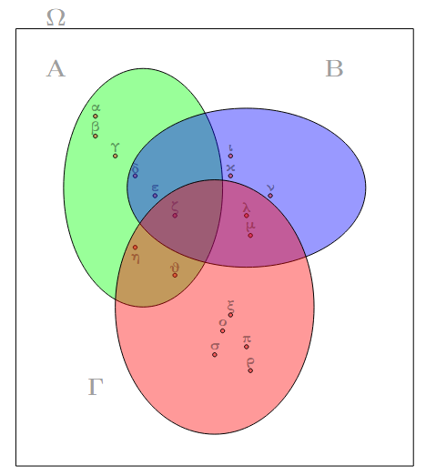

```{=html}
<!-- Φόρτωση βιβλιοθήκης GeoGebra -->
<script src="https://www.geogebra.org/apps/deployggb.js"></script>

<!-- Συνάρτηση δημιουργίας applets -->
<script>
function createGeoGebra(containerId, materialId, width = 700, height = 500) {
  var params = {
    "id": "ggb-" + containerId,
    "material_id": materialId,
    "width": width,
    "height": height,
    "showToolBar": true,
    "showMenuBar": false,
    "showAlgebraInput": true
  };
  
  var applet = new GGBApplet(params, '5.2');
  applet.inject(containerId);
}
</script>
```

## Σύνολα.

### Θεωρία

::: {style="background-color: #d3deb8; border: 2px solid #2f3e50; color: #25188a; padding: 15px; border-radius: 5px;"}
Η θεωρία των συνόλων, η οποία θεμελιώθηκε από τον μαθηματικό **Γεώργιο Καντόρ (Georg Cantor)** στα τέλη του 19ου αιώνα, αποτελεί τη βάση των σύγχρονων μαθηματικών.
Σύμφωνα με τον αρχικό ορισμό, **σύνολο** ονομάζουμε κάθε συλλογή αντικειμένων, πραγματικών ή νοητών, που έχουν μια χαρακτηριστική ιδιότητα η οποία επιτρέπει τον σαφή προσδιορισμό τους ως μέρος αυτής της ολότητας.
Σήμερα, η έννοια του συνόλου θεωρείται **πρωταρχική** και δεν ορίζεται αυστηρά, καθώς κάθε απόπειρα ορισμού χρησιμοποιεί συνώνυμες λέξεις.

### 1. Στοιχεία και Συμβολισμός

Τα αντικείμενα που απαρτίζουν ένα σύνολο ονομάζονται **στοιχεία** και συμβολίζονται συνήθως με πεζά γράμματα ($\alpha, \beta, \chi, ...$), ενώ τα ίδια τα σύνολα με κεφαλαία ($A, B, \Omega, ...$).

\* **Ανήκει (**$\in$): Όταν ένα στοιχείο $\chi$ είναι μέρος του συνόλου $A$, γράφουμε $\chi \in A$.

\* **Δεν ανήκει (**$\notin$): Όταν το $\chi$ δεν είναι στοιχείο του $A$, γράφουμε $\chi \notin A$.

**Τρόποι Παράστασης Συνόλου:**

1.  **Με αναγραφή των στοιχείων:** Τα στοιχεία γράφονται μέσα σε άγκιστρα $\{ \}$, χωρισμένα με κόμμα.

    - *Παράδειγμα:* Το σύνολο των φωνηέντων $A = \{\alpha, \epsilon, \eta, \iota, o, \upsilon, \omega\}$.

2.  **Με περιγραφή χαρακτηριστικής ιδιότητας:** Ορίζεται η ιδιότητα που πρέπει να έχουν τα στοιχεία.

    - *Παράδειγμα:* $B = \{\chi \mid \chi \text{ είναι άρτιος μονοψήφιος φυσικός}\}$.

3.  **Με διαγράμματα Venn-Euler:** Χρησιμοποιούνται κλειστές καμπύλες γραμμές όπου τα στοιχεία παριστάνονται ως σημεία στο εσωτερικό τους.\



### 2. Ειδικές Κατηγορίες Συνόλων

- **Κενό Σύνολο (**$\emptyset$ ή $\{ \}$): Το σύνολο που δεν περιέχει κανένα στοιχείο.

- **Μονοσύνολο (Μονομελές):** Σύνολο με ένα μόνο στοιχείο, π.χ., το σύνολο των δορυφόρων της Γης $B = \{Σελήνη\}$.

- **Σύνολο Αναφοράς (Καθολικό Σύνολο):** Το σύνολο $U$ ή $\Omega$ που περιέχει όλα τα στοιχεία που εξετάζονται σε ένα συγκεκριμένο πρόβλημα.

- **Πεπερασμένα και Άπειρα Σύνολα:** Ένα σύνολο λέγεται πεπερασμένο αν τα στοιχεία του μπορούν να μετρηθούν, ενώ άπειρο αν η διαδικασία μέτρησης δεν τελειώνει ποτέ, όπως το σύνολο των φυσικών αριθμών $N$.

### 3. Σχέσεις Μεταξύ Συνόλων

- **Ίσα Σύνολα (**$A=B$): Δύο σύνολα είναι ίσα όταν έχουν ακριβώς τα ίδια στοιχεία.

- **Υποσύνολο (**$A \subseteq B$): Το $A$ είναι υποσύνολο του $B$ αν κάθε στοιχείο του $A$ είναι και στοιχείο του $B$.

  - Το κενό σύνολο είναι υποσύνολο κάθε συνόλου ($\emptyset \subseteq A$).

- **Γνήσιο Υποσύνολο (**$A \subset B$): Το $A$ είναι υποσύνολο του $B$, αλλά το $B$ περιέχει τουλάχιστον ένα στοιχείο που δεν ανήκει στο $A$.

- **Δυναμοσύνολο (**$\wp(A)$): Το σύνολο που έχει ως στοιχεία όλα τα υποσύνολα του $A$.
  Αν το $A$ έχει $\nu$ στοιχεία, το δυναμοσύνολό του έχει $2^\nu$ στοιχεία.

### 4. Πράξεις Συνόλων

- **Τομή (**$A \cap B$): Το σύνολο των **κοινών** στοιχείων των $A$ και $B$.

  - *Παράδειγμα:* Αν $A = \{1, 3, 4, 5, 7\}$ και $B = \{2, 4, 5, 9\}$, τότε $A \cap B = \{4, 5\}$.

- **Ένωση (**$A \cup B$): Το σύνολο που περιλαμβάνει όλα τα στοιχεία που ανήκουν **είτε στο** $A$ είτε στο $B$.

  - *Παράδειγμα:* Αν $A = \{1, 3, 5, 7\}$ και $B = \{1, 2, 3, 4, 5\}$, τότε $A \cup B = \{1, 2, 3, 4, 5, 7\}$.

- **Διαφορά (**$A - B$): Το σύνολο των στοιχείων του $A$ που **δεν ανήκουν** στο $B$.

  - *Παράδειγμα:* Αν $A = \{1, 2, 3, 4, 5, 6\}$ και $B = \{4, 5, 6, 7, 8\}$, τότε $A - B = \{1, 2, 3\}$.

- **Συμπλήρωμα (**$A^c$ ή $A'$): Το σύνολο των στοιχείων του συνόλου αναφοράς $U$ που δεν ανήκουν στο $A$.

- **Καρτεσιανό Γινόμενο (**$A \times B$): Το σύνολο όλων των **διατεταγμένων ζευγών** $(\chi, \psi)$ όπου $\chi \in A$ και $\psi \in B$.

### 5. Διαμερισμός Συνόλου

Διαμερισμός ενός συνόλου $A$ ονομάζεται μια συλλογή υποσυνόλων του (κλάσεων) τα οποία είναι **μη κενά**, **ξένα μεταξύ τους** ανά δύο και η **ένωσή τους** ισούται με το αρχικό σύνολο $A$.

\* *Παράδειγμα:* Το σύνολο των φυσικών αριθμών $N$ διαμερίζεται στις κλάσεις των άρτιων και των περιττών αριθμών.

### Για τα σύνολα των αριθμών που έχουμε μάθει μέχρι τώρα ισχύει:

$$\mathbb{N}\subseteq{\mathbb{Z}}\subseteq{\mathbb{Q}}\subseteq{\mathbb{R}} $$
:::

\

### Ασκήσεις

**Α. Παράσταση Συνόλων (Αναγραφή & Περιγραφή)**

1.  **Αναγραφή στοιχείων:** Να συμβολίσετε με αναγραφή των στοιχείων τους τα παρακάτω σύνολα:

    - $A = \{x \mid x \in \mathbb{N} \text{ και } 3 < x \leq 8\}$.
    - $B = \{x \mid x \text{ φυσικός διψήφιος διαιρετός διά του } 10\}$.

2.  **Περιγραφή ιδιότητας:** Να συμβολίσετε με περιγραφή της χαρακτηριστικής ιδιότητας των στοιχείων τους τα σύνολα:

    - $A = \{2, 3, 5, 7, 11, 13, 17, 19\}$.
    - $B = \{\text{Άνοιξη, Καλοκαίρι, Φθινόπωρο, Χειμώνας}\}$.

3.  **Απειροσύνολα:** Εξετάστε αν το σύνολο $A = \{x \mid x \text{ ακέραιος } < 10\}$ είναι πεπερασμένο ή άπειρο και γράψτε ενδεικτικά τα στοιχεία του.

4.  **Σύνολα και Γεωμετρία:** Ποιο είναι το σύνολο των τριγώνων που έχουν δύο γωνίες τους ορθές;

**Β. Σχέσεις Μεταξύ Συνόλων (Ισότητα & Εγκλεισμός)**

5.  **Έλεγχος Ισότητας:** Να εξετάσετε αν είναι ίσα τα σύνολα $A = \{5, 6, 7, ...\}$ και $B = \{x \mid x \text{ φυσικός μεγαλύτερος του } 4\}$.

6.  **Σωστό ή Λάθος:** Να βρείτε ποιος από τους παρακάτω συμβολισμούς είναι σωστός και γιατί:

α.
$\emptyset \in {0}$,

β.
$\emptyset = {0}$,

γ.
$\emptyset \in \emptyset$,

δ.
$x = {x}$.

**Γ. Πράξεις Συνόλων (Τομή, Ένωση, Διαφορά, Συμπλήρωμα)**

7.  **Βασικές Πράξεις:** Δίνονται τα σύνολα $A = \{1, 2, 3, 4, 5\}$, $B = \{3, 4, 5, 6, 7\}$ και $\Gamma = \{5, 6, 7, 8, 9\}$.

Να βρεθούν τα: $A \cup B$, $A \cap B$, $A - B$, και $A \cap B \cap \Gamma$.

8.  Για τα σύνολα Α,Β και Γ του σχήματος 1, να υπολογίσετε

α.
$Α\cup B$

β.
$Α\cup Γ$

γ.
$Β\cup Γ$

δ.
$Α\cup Β\cupΓ$

ε.
$Α\cap B$

στ.
$Α\capΓ$

ζ.
$Α\cap Β\capΓ$

η.
$Β\cap Γ$

9.  **Προβλήματα με Πλήθος:** Ένα σύνολο $A$ έχει 10 στοιχεία, το $B$ έχει 7 στοιχεία και η τομή τους $A \cap B$ έχει 4 στοιχεία.
    Πόσα στοιχεία του $A$ δεν ανήκουν στο $B$;

10. **Συμπλήρωμα:** Αν $A = \{1, 3, 5, 7, 9\}$ και σύνολο αναφοράς είναι το $E = \{x \in \mathbb{N} \mid x < 10\}$, να βρεθεί το συμπληρωματικό σύνολο $A^c$.

11. **Επιμεριστική Ιδιότητα:** Με τα σύνολα $A = \{1, 2, 3\}$, $B = \{3, 4, 5\}$ και $\Gamma = \{1, 3, 5\}$, επαληθεύστε την ιδιότητα: $A \cap (B \cup \Gamma) = (A \cap B) \cup (A \cap \Gamma)$.

**Δ. Διαμερισμός Συνόλου**

12. **Δημιουργία Διαμερισμού:** Να γίνει ένας διαμερισμός του συνόλου $A = \{1, 2, 3, 4, 5, 6, 7, 8, 9\}$ σε τρεις κλάσεις.

13. **Έλεγχος Διαμερισμού:** Εξετάστε αν τα σύνολα $\Sigma = \{1, 3, 5, ...\}$ και $K = \{2, 4, 6, ...\}$ αποτελούν διαμερισμό του συνόλου των φυσικών αριθμών $\mathbb{N}$.

**Ε. Καρτεσιανό Γινόμενο & Σχέσεις**

14. **Σχηματισμός Γινομένου:** Αν $A = \{1, 3, 9\}$ και $B = \{1, 3, 5, 7, 11, 13\}$, να βρεθεί το καρτεσιανό γινόμενο $A \times B$.

15. Να παραστήσετε με αναγραφή των στοιχείων τους τα παρακάτω σύνολα: 

α) $A = \{x \in \mathbb{R}, \text{όπου } x^2 = 49\}$

β) $A = \{x \in \mathbb{N}, \text{όπου } x^2 = 49\}$ 

γ) $\Gamma = \{x \in \mathbb{Z}, \text{όπου } -4 < x < 2\}$ 

δ) $\Delta = \{x \in \mathbb{N}, \text{όπου } x \text{ διαιρέτης του } 10\}$

16. Ποια από τα σύνολα $A = \{1, 3, 5\}, B = \{-1, 0, 1\}, \Gamma = \{2, 4, 6\}, \Delta = \{(1, 2), (3, 4)\}$ είναι:

α) Υποσύνολο του συνόλου $K = \{0, 1, 2, 3, 4, 5, 6\}$;

β) Ίσο με το σύνολο $\Lambda = \{\text{περιττοί φυσικοί αριθμοί μικρότεροι του } 6\}$;

γ) Ίσο με το σύνολο $M = \{x \in \mathbb{R}, \text{όπου } x^2 - 1 = 0\}$;

17. Να παραστήσετε με αναγραφή των στοιχείων του το σύνολο: $A = \{\text{ψηφία του αριθμού } 3445\}$ και να βρείτε όλα τα υποσύνολά του.

18. Να παραστήσετε με αναγραφή των στοιχείων του το σύνολο: $A = \{(x, y), \text{όπου } x, y \in \mathbb{N} \text{ και } x + y = 3\}$

19. Να παραστήσετε με περιγραφή των στοιχείων τους τα παρακάτω σύνολα:

α) $A = \{2, 4, 6, 8, 10, \dots\}$ 

β) $B = \{\alpha, \epsilon, \eta, \iota, o, \upsilon, \omega\}$ 

γ) $\Gamma = \{0, 3\}$

20. Με βασικό σύνολο $\Omega = \{1, 2, 3, 4, 5, 6, 7, 8\}$, θεωρούμε τα σύνολα $A = \{1, 3, 5, 7\}$ και $B = \{3, 6\}$.

Να τα παραστήσετε στο ίδιο διάγραμμα Venn και να προσδιορίσετε τα σύνολα: 

α) $A \cup B$ 

β) $A \cap B$ 

γ) $A'$ δ) $B'$

21. Δίνονται τα σύνολα: $A = \{\text{γράμματα της λέξης "μήλο"}\}$, $B = \{\text{γράμματα της λέξης "λάμα"}\}$ και $\Gamma = \{\text{γράμματα της λέξης "λήθη"}\}$.

α) Να γράψετε τα σύνολα $A, B, \Gamma$ με αναγραφή των στοιχείων τους και να τα παραστήσετε στο ίδιο διάγραμμα Venn.

β) Να προσδιορίσετε τα σύνολα $B \cup \Gamma, A \cap B, A \cap \Gamma$.

γ) Να επαληθεύσετε ότι $A \cap (B \cup \Gamma) = (A \cap B) \cup (A \cap \Gamma)$.

22. Θεωρούμε τα σύνολα: $A = \{\text{αναβάτες που συμμετείχαν στον αγώνα ποδηλασίας το 2023}\}$.
$B = \{\text{αναβάτες που τερμάτισαν στον αγώνα ποδηλασίας το 2023}\}$.
Σε ποιο σύνολο ανήκει εκείνος που:

α) Συμμετείχε και τερμάτισε.

β) Συμμετείχε σε τουλάχιστον έναν από τους δύο ρόλους.

γ) Συμμετείχε αλλά δεν τερμάτισε.

δ) Δεν συμμετείχε και δεν τερμάτισε.

23. Δίνονται τα σύνολα $A = \{\text{μουσικοί}\}$ και $B = \{\text{κάτοικοι της Αθήνας}\}$.
Τι συμπεραίνετε για εκείνον που ανήκει στο σύνολο: 

α) $A \cup B$ 

β) $A \cap B$ 

γ) $A'$ 

δ) $B'$ 


----

$$\bbox[yellow, 5px]{\color{blue}\Large\text{---}}$$

::: {.callout-tip style="color: brown;"}
## Ενέργεια
:::

::: {style="background-color: #d3deb8; border: 2px solid #2f3e50; color: #25188a; padding: 15px; border-radius: 5px;"}
:::

::: {.callout-tip style="color: brown;"}
ΚΑΛΗ ΜΕΛΕΤΗ!
:::

\
\
