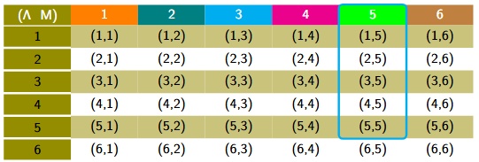
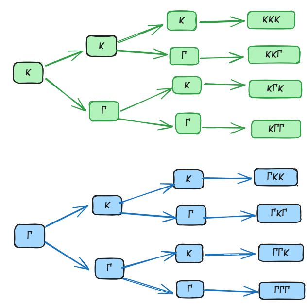
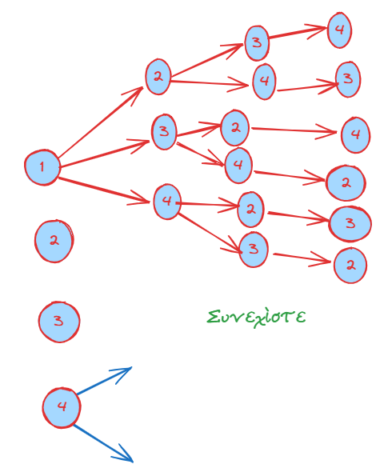

```{=html}
<!-- Φόρτωση βιβλιοθήκης GeoGebra -->
<script src="https://www.geogebra.org/apps/deployggb.js"></script>

<!-- Συνάρτηση δημιουργίας applets -->
<script>
function createGeoGebra(containerId, materialId, width = 700, height = 500) {
  var params = {
    "id": "ggb-" + containerId,
    "material_id": materialId,
    "width": width,
    "height": height,
    "showToolBar": true,
    "showMenuBar": false,
    "showAlgebraInput": true
  };
  
  var applet = new GGBApplet(params, '5.2');
  applet.inject(containerId);
}
</script>
```

## Δειγματικός χώρος - Ενδεχόμενα

### Θεωρία

Η θεωρία των πιθανοτήτων ασχολείται με τη μελέτη φαινομένων στα οποία η τελική έκβαση χαρακτηρίζεται από αβεβαιότητα.

Οι βασικές έννοιες του δειγματικού χώρου και των ενδεχομένων είναι:

::: {style="background-color: #d3deb8; border: 2px solid #2f3e50; color: #25188a; padding: 15px; border-radius: 5px;"}
### **1. Πείραμα Τύχης**

Ως **πείραμα τύχης** ορίζεται κάθε πείραμα το οποίο, αν και μπορεί να επαναληφθεί όσες φορές θέλουμε υπό τις ίδιες ακριβώς συνθήκες, το αποτέλεσμά του δεν μπορεί να προβλεφθεί με ακρίβεια.

- **Παραδείγματα:** Η ρίψη ενός νομίσματος, η ρίψη ενός ζαριού ή η επιλογή ενός χαρτιού από μια τράπουλα.

### **2. Δειγματικός Χώρος (Ω)**

**Δειγματικός χώρος** ενός πειράματος τύχης ονομάζεται το σύνολο που έχει ως στοιχεία όλα τα δυνατά αποτελέσματά του.
Συμβολίζεται συνήθως με το γράμμα **Ω**.
Τα στοιχεία του δειγματικού χώρου ονομάζονται **δυνατές περιπτώσεις** ή **στοιχειώδη γεγονότα** (ή δείγματα).

- **Παραδείγματα:**
  - **Ρίψη ενός νομίσματος:** $\Omega = \{Κ, Γ\}$, όπου Κ = κεφαλή και Γ = γράμματα.
  - **Ρίψη ενός ζαριού:** $\Omega = \{1, 2, 3, 4, 5, 6\}$.
  - **Ρίψη νομίσματος δύο φορές:** $\Omega = \{KK, K\Gamma, \Gamma K, \Gamma\Gamma\}$.
  - **Ρίψη δύο κύβων (λευκού και μαύρου):** Ο δειγματικός χώρος αποτελείται από 36 διατεταγμένα ζεύγη (α, β), όπου α η ένδειξη του λευκού και β του μαύρου κύβου.\
    \
    

### **3. Ενδεχόμενα (ή Γεγονότα)**

**Ενδεχόμενο** ή **γεγονός** ονομάζεται κάθε υποσύνολο του δειγματικού χώρου Ω.
Ένα ενδεχόμενο πραγματοποιείται όταν το αποτέλεσμα του πειράματος είναι ένα από τα στοιχεία που περιλαμβάνονται σε αυτό το υποσύνολο.

\* **Είδη Ενδεχομένων:**\

- **Στοιχειώδες (ή απλό) ενδεχόμενο:** Υποσύνολο που περιέχει μόνο ένα στοιχείο του Ω.

- **Σύνθετο ενδεχόμενο:** Υποσύνολο που αποτελείται από περισσότερα στοιχεία (ένωση στοιχειωδών γεγονότων).

- **Βέβαιο ενδεχόμενο:** Το ίδιο το σύνολο Ω (π.χ. στη ρίψη ζαριού, η ένδειξη να είναι $\le 6$).

- **Αδύνατο ενδεχόμενο:** Το κενό σύνολο $\emptyset$ (π.χ. στη ρίψη ζαριού, η ένδειξη να είναι $> 6$).

### **4. Σχέσεις μεταξύ Ενδεχομένων**

- **Αντίθετα ενδεχόμενα:** Δύο ενδεχόμενα Α και Α' (ή $\bar{A}$) ονομάζονται αντίθετα όταν το ένα είναι το **συμπλήρωμα** του άλλου ως προς τον δειγματικό χώρο Ω. Η ένωσή τους δίνει το βέβαιο γεγονός.

Στο πείραμα τύχης «ρίψη ενός ζαριού» με δειγματικό χώρο Ω={1,2,3,4,5,6}: Αν το ενδεχόμενο A είναι «η ένδειξη είναι μικρότερη του 4», δηλαδή A={1,2,3}.
Τότε το συμπλήρωμα (αντίθετο) ενδεχόμενο A′ είναι «η ένδειξη είναι μεγαλύτερη ή ίση του 4», δηλαδή A′ ={4,5,6}

- **Ασυμβίβαστα (ή ξένα) ενδεχόμενα:** Ενδεχόμενα που δεν έχουν κοινά στοιχεία ($A \cap B = \emptyset$). Η πραγματοποίηση του ενός αποκλείει την πραγματοποίηση του άλλου.

Στη γλώσσα των συνόλων, αυτό σημαίνει ότι τα ενδεχόμενα αυτά δεν έχουν κοινά στοιχεία (είναι ξένα σύνολα), δηλαδή η τομή τους είναι το κενό σύνολο (A∩B=∅) .
Δύο αντίθετα ενδεχόμενα είναι πάντοτε ασυμβίβαστα μεταξύ τους

- **Τομή ενδεχομένων (**$A \cap B$): Το ενδεχόμενο που πραγματοποιείται όταν συμβαίνουν ταυτόχρονα και τα δύο ενδεχόμενα Α και Β.

- **Ένωση ενδεχομένων (**$A \cup B$): Το ενδεχόμενο που πραγματοποιείται όταν συμβαίνει τουλάχιστον ένα από τα Α ή Β.

- **Άθροισμα ενδεχομένων (**$A + B$): Χρησιμοποιείται όταν τα ενδεχόμενα είναι ασυμβίβαστα και δηλώνει την ένωσή τους.

**Διαφορά μεταξύ ανεξάρτητων και ασυμβίβαστων ενδεχομένων**

- **Ανεξάρτητα Ενδεχόμενα**

***Ορισμός:*** Δύο ενδεχόμενα ονομάζονται ανεξάρτητα όταν η πραγματοποίηση του ενός δεν επηρεάζει την πιθανότητα πραγματοποίησης του άλλου.

Πιθανότητα: Δύο ενδεχόμενα είναι ανεξάρτητα αν και μόνο αν η πιθανότητα της τομής τους (να συμβούν και τα δύο) ισούται με το γινόμενο των πιθανοτήτων τους: P(A∩B)=P(A)⋅P(B)

$$\bbox[yellow, 5px]{\color{blue}\Large\text{Για την πιθανότητα θα μιλήσουμε στην συνέχεια}}$$

Παράδειγμα: Αν ρίξουμε ένα ζάρι δύο φορές, το αποτέλεσμα της πρώτης ρίψης δεν επηρεάζει την πιθανότητα εμφάνισης ενός αριθμού στη δεύτερη ρίψη

***Η Κύρια Διαφορά***

Η βασική διαφορά έγκειται στο εξής: Τα ασυμβίβαστα ενδεχόμενα δεν είναι ανεξάρτητα.

Ενώ τα ανεξάρτητα ενδεχόμενα «δεν ενδιαφέρονται» για το αν συνέβη το άλλο, στα ασυμβίβαστα ενδεχόμενα η πραγματοποίηση του ενός επηρεάζει άμεσα το άλλο, καθώς εκμηδενίζει την πιθανότητα να συμβεί.

Δηλαδή, αν γνωρίζουμε ότι πραγματοποιήθηκε το A, η πιθανότητα να συμβεί το B (που είναι ασυμβίβαστο με το A) γίνεται αυτόματα μηδέν.

Συνοπτικά:

Τα ασυμβίβαστα ενδεχόμενα σχετίζονται με την απουσία κοινών αποτελεσμάτων (A∩B=∅).

Τα ανεξάρτητα ενδεχόμενα σχετίζονται με τη μη επίδραση στην πιθανότητα εμφάνισης

### **5. Συμπληρωματικά Παραδείγματα**

1.  **Ρίψη ζαριού:** Έστω το ενδεχόμενο $A = \{1, 3, 5\}$ (περιττή ένδειξη). Οι ευνοϊκές περιπτώσεις είναι 3 (τα στοιχεία 1, 3, 5) και οι δυνατές περιπτώσεις είναι 6. Η πιθανότητα είναι $P(A) = 3/6 = 1/2$.
2.  **Οικογένεια με τρία παιδιά:** Ο δειγματικός χώρος περιλαμβάνει 8 στοιχεία: $\{AAA, AAΚ, AKA, AΚΚ, ΚΑΑ, ΚΑΚ, ΚΚΑ, ΚΚΚ\}$, όπου Α = αγόρι και Κ = κορίτσι.
3.  **Κληρωτίδα με 10 κλήρους (1-10):** Το ενδεχόμενο "αριθμός μικρότερος του 4" είναι το $\{1, 2, 3\}$. Η πιθανότητά του είναι $3/10 = 0,3$.
4.  **Ανεξάρτητα ενδεχόμενα:** Αν ρίξουμε ένα νόμισμα και ένα ζάρι, το αποτέλεσμα της ρίψης του νομίσματος δεν επηρεάζει το αποτέλεσμα του ζαριού. Πρόκειται για ανεξάρτητα πειράματα και γεγονότα.
:::

### Το **δενδροδιάγραμμα** 
είναι μια γραφική μέθοδος που μας επιτρέπει να βρίσκουμε συστηματικά όλα τα δυνατά αποτελέσματα (δηλαδή τον δειγματικό χώρο $\Omega$) ενός πειράματος τύχης, ιδιαίτερα όταν αυτό εκτελείται σε διαδοχικά στάδια.

**1. Διαδικασία Κατασκευής**

- **Πρώτο Στάδιο:** Ξεκινάμε από ένα αρχικό σημείο και χαράζουμε τόσες διακλαδώσεις (βέλη) όσα είναι τα δυνατά αποτελέσματα του πρώτου σταδίου του πειράματος.

- **Επόμενα Στάδια:** Από το τέλος κάθε διακλάδωσης του προηγούμενου σταδίου, χαράζουμε νέες διακλαδώσεις που αντιστοιχούν στα δυνατά αποτελέσματα του επόμενου σταδίου.

- **Τελικά Αποτελέσματα:** Κάθε πλήρης διαδρομή από την αρχή του «δένδρου» μέχρι το τελευταίο άκρο του αντιπροσωπεύει ένα στοιχείο (δείγμα) του δειγματικού χώρου.

**2. Παραδείγματα**

**Α. Ρίψη νομίσματος τρεις φορές** Όπως δείχνει το αντίστοιχο δενδροδιάγραμμα η ρίψη ενός νομίσματος (Κ=Κεφαλή, Γ=Γράμματα):

- **1η ρίψη:** Έχουμε δύο κλάδους, Κ και Γ.

- **2η ρίψη:** Από το Κ ξεκινούν δύο νέοι κλάδοι (Κ, Γ) και από το Γ άλλοι δύο (Κ, Γ).
  Τα αποτελέσματα είναι: **ΚΚ, ΚΓ, ΓΚ, ΓΓ**.

- **3η ρίψη:** Η διαδικασία επαναλαμβάνεται για κάθε αποτέλεσμα της 2ης ρίψης.

- **Δειγματικός Χώρος:** $\Omega = \{ΚΚΚ, ΚΚΓ, ΚΓΚ, ΚΓΓ, ΓΚΚ, ΓΚΓ, ΓΓΚ, ΓΓΓ\}$.
  Συνολικά 8 δυνατές περιπτώσεις.\

  \
  {width="439"}

**Β. Επιλογή σφαιρών από κιβώτιο** Έστω ένα κιβώτιο που περιέχει 4 σφαίρες αριθμημένες από το 1 έως το 4.
Αν παίρνουμε διαδοχικά σφαίρες χωρίς επανάθεση:

- **Πείραμα 1 (**$\Pi_1$): Επιλογή μίας σφαίρας.
  Το δενδροδιάγραμμα έχει 4 κλάδους: **1, 2, 3, 4**.

- **Πείραμα 2 (**$\Pi_2$): Διαδοχική επιλογή δύο σφαιρών.
  Από τον κλάδο «1» του πρώτου σταδίου, ξεκινούν οι κλάδοι **2, 3, 4** (αφού η σφαίρα 1 έχει ήδη βγει).

  - Τα αποτελέσματα αυτού του κλάδου θα είναι: **(1,2), (1,3), (1,4)**.

  - Ακολουθώντας την ίδια λογική για όλους τους αρχικούς κλάδους, προκύπτει ο δειγματικός χώρος.\

    \
    {width="401"}

**3. Χρησιμότητα** Το δενδροδιάγραμμα είναι ιδιαίτερα χρήσιμο γιατί:

- Εξασφαλίζει ότι **δεν θα ξεχάσουμε κάποιο αποτέλεσμα** κατά την απαρίθμηση.

- Βοηθά στον **υπολογισμό του πλήθους των δυνατών περιπτώσεων** ($\rho$), ο οποίος είναι απαραίτητος για την εύρεση της πιθανότητας $P(A) = \frac{\kappa}{\rho}$.

------------------------------------------------------------------------

\

### Ασκήσεις

1.  Ποιο από τα παρακάτω είναι πείραμα τύχης:

- α) Ρίχνω ένα κέρμα και καταγράφω την όψη που έρχεται.
- β) Μετράω τη θερμοκρασία του νερού που βράζει σε μια κατσαρόλα.
- γ) Επιλέγω έναν μαθητή από το τμήμα μου και καταγράφω αν έχει μπλε μάτια.
- δ) Αφήνω μια πέτρα να πέσει από το μπαλκόνι και προβλέπω ότι θα πέσει προς τα κάτω.

2.  Επιλέγουμε διαδοχικά δύο μαθητές από ένα τμήμα με 3 μαθητές (Α, Β, Γ) και καταγράφουμε το φύλο τους (Α: Αγόρι, Κ: Κορίτσι).
    Αν ο πρώτος μαθητής είναι Αγόρι και ο δεύτερος Κορίτσι, ποιος είναι ο σωστός τρόπος να συμβολιστεί το αποτέλεσμα σε έναν πίνακα διπλής εισόδου;

3.  Ένας μαθητής θέλει να σχηματίσει τριψήφιους αριθμούς χρησιμοποιώντας τα ψηφία 1, 4, 6 χωρίς επανάληψη.
    Μπορείτε να σχεδιάσετε το δενδροδιάγραμμα που απεικονίζει όλους τους δυνατούς συνδυασμούς;

4.  Αν ο δειγματικός χώρος ενός πειράματος τύχης είναι $\Omega = \{1, 3, 5, 7, 9\}$, ποιο από τα παρακάτω σύνολα είναι ενδεχόμενο του πειράματος:

- α) $A = \{1, 2, 3\}$
- β) $B = \{3, 7, 9\}$
- γ) $\Gamma = \{0, 5\}$
- δ) $\Delta = \{1, 3, 5, 7, 9, 11\}$

5.  Ρίχνουμε ένα ζάρι και φέρνουμε 4. Ποιο από τα παρακάτω ενδεχόμενα πραγματοποιείται:

- α) $A = \{1, 2, 4\}$
- β) $B = \{1, 3, 5\}$
- γ) $\Gamma = \{4, 5, 6\}$
- δ) $\Delta = \{2, 4, 6\}$

6.  Ένα κουτί περιέχει μπλε, κόκκινες και πράσινες μπάλες. Αν επιλέξω μία μπάλα, ποιο από τα παρακάτω ενδεχόμενα είναι αδύνατο:

- α) Η μπάλα είναι μπλε.
- β) Η μπάλα είναι κίτρινη.
- γ) Η μπάλα είναι κόκκινη.
- δ) Η μπάλα δεν είναι πράσινη.

7.  Επιλέγω στην τύχη μία ημέρα της εβδομάδας. Ποιο από τα παρακάτω ενδεχόμενα είναι βέβαιο:

- α) Η ημέρα είναι Σαββατοκύριακο.
- β) Η ημέρα έχει το γράμμα "α" στο όνομά της.
- γ) Η ημέρα είναι καθημερινή (Δευτέρα έως Παρασκευή).
- δ) Η ημέρα ανήκει στις 7 ημέρες της εβδομάδας.

8.  Να συμπληρώσετε τον παρακάτω πίνακα αντιστοιχίζοντας σε κάθε ενδεχόμενο της στήλης (Α) το σωστό συμπέρασμα από τη στήλη (Β).

| Στήλη Α | Στήλη Β |
|:-----------------------------------|:-----------------------------------|
| α. $A \cup B$ | 1\. Πραγματοποιούνται όλα τα στοιχεία που δεν ανήκουν στο Α. |
| β. $A \cap B$ | 2\. Πραγματοποιείται τουλάχιστον ένα από τα Α, Β. |
| γ. $A'$ | 3\. Πραγματοποιούνται ταυτόχρονα και το Α και το Β. |

9.  Σε μια καφετέρια προσφέρονται 3 είδη καφέ (Espresso, Cappuccino, Freddo) και 2 είδη συνοδευτικών (Κρουασάν, Μπάρα δημητριακών).
    Επιλέγουμε στην τύχη έναν πελάτη που αγόρασε ένα είδος καφέ και ένα είδος συνοδευτικού.
    Ποιος είναι ο δειγματικός χώρος του πειράματος;

10. Ρίχνουμε ένα ζάρι δύο φορές.
    Ποιος είναι ο δειγματικός χώρος του πειράματος;

11. Σε ένα τουρνουά σκάκι συμμετέχουν 3 παίκτες (Άρης, Βασίλης, Γιώργος).
    Κάθε παίκτης παίζει με κάθε άλλον μία παρτίδα.
    Χρησιμοποιήστε έναν πίνακα για να βρείτε όλα τα πιθανά ζευγάρια αντιπάλων.

12. Σε μια τσάντα υπάρχουν 4 στυλό: ένα μαύρο, ένα κόκκινο, ένα πράσινο και ένα μπλε.
    Επιλέγουμε τυχαία ένα στυλό.

- α) Με πόσες το πολύ κινήσεις είμαστε σίγουροι ότι θα πάρουμε το μπλε στυλό;
- β) Με πόσες κινήσεις μπορούμε να αναγνωρίσουμε το χρώμα όλων των στυλό της τσάντας;
- γ) Θεωρήστε την πρώτη κίνηση ως ξεχωριστό πείραμα.Ποιος είναι ο δειγματικός του χώρος;

13. Σε μια σχολική γιορτή συμμετέχουν 3 αγόρια (Νίκος, Φάνης, Αλέξανδρος) και 2 κορίτσια (Μαρία, Ελένη). Επιλέγουμε στην τύχη ένα αγόρι και ένα κορίτσι για να χορέψουν μαζί. Να προσδιορίσετε:

- α) Τον δειγματικό χώρο του πειράματος.
- β) Τα ενδεχόμενα: Α: Διαγωνίστηκε η Μαρία. Β: Δεν διαγωνίστηκε ο Νίκος.

14. Ο δειγματικός χώρος ενός πειράματος τύχης είναι $\Omega = \{1, 2, 3, 4, 5, 6, 7, 8\}$.

Να παραστήσετε με διάγραμμα Venn τα ενδεχόμενα $A = \{x \in \Omega, \text{όπου } x \text{ άρτιος}\}$ και $B = \{x \in \Omega, \text{όπου } x > 5\}$ και να βρείτε τα ενδεχόμενα:

- α) Πραγματοποιείται τουλάχιστον ένα από τα Α, Β.
- β) Πραγματοποιούνται ταυτόχρονα τα Α και Β.
- γ) Δεν πραγματοποιείται το Α.

15. Ένας κωδικός χρηματοκιβωτίου αποτελείται από 3 ψηφία. Το πρώτο ψηφίο είναι 5, το δεύτερο ψηφίο είναι 1 ή 2 και το τρίτο ψηφίο είναι 8, 9 ή 0.

- α) Ποιο είναι το σύνολο των πιθανών κωδικών;
- β) Να προσδιορίσετε τα ενδεχόμενα: Α: Το δεύτερο ψηφίο είναι 2. Β: Το τρίτο ψηφίο είναι 8.

------------------------------------------------------------------------

$$\bbox[yellow, 5px]{\color{blue}\Large\text{---}}$$

::: {.callout-tip style="color: brown;"}
## Ενέργεια
:::

::: {style="background-color: #d3deb8; border: 2px solid #2f3e50; color: #25188a; padding: 15px; border-radius: 5px;"}
:::

::: {.callout-tip style="color: brown;"}
ΚΑΛΗ ΜΕΛΕΤΗ!
:::

\
\
