```{=html}
<!-- Φόρτωση βιβλιοθήκης GeoGebra -->
<script src="https://www.geogebra.org/apps/deployggb.js"></script>

<!-- Συνάρτηση δημιουργίας applets -->
<script>
function createGeoGebra(containerId, materialId, width = 700, height = 500) {
  var params = {
    "id": "ggb-" + containerId,
    "material_id": materialId,
    "width": width,
    "height": height,
    "showToolBar": true,
    "showMenuBar": false,
    "showAlgebraInput": true
  };
  
  var applet = new GGBApplet(params, '5.2');
  applet.inject(containerId);
}
</script>
```

## Κύρια και δευτερεύοντα στοιχεία τριγώνου - Είδη τριγώνων

### Θεωρία

Το τρίγωνο ορίζεται ως το **απλούστερο από τα πολύγωνα**, το οποίο αποτελείται από τρεις πλευρές.
Τα στοιχεία του διακρίνονται σε κύρια και δευτερεύοντα:

:::::::: {style="background-color: #c98ba2; border: 2px solid #2f3e50; color: #25188a; padding: 15px; border-radius: 5px;"}
**1. Κύρια Στοιχεία Τριγώνου** Τα κύρια στοιχεία ενός τριγώνου είναι:

- **Τρεις πλευρές:** Συμβολίζονται συνήθως με τα μικρά γράμματα $\alpha, \beta, \gamma$. Συχνά, κάθε πλευρά παίρνει το ίδιο γράμμα με τη γωνία που βρίσκεται απέναντί της.
- **Τρεις γωνίες:** Συμβολίζονται με τα κεφαλαία γράμματα $Α, Β, \Gamma$.

**Βασικές Ιδιότητες:**

- **Άθροισμα γωνιών:** Το άθροισμα των γωνιών κάθε τριγώνου είναι $180^\circ$ ή $2$ ορθές. $$\hat A +\hat B +\hat Γ=180^0$$
- **Τριγωνική Ανισότητα:** Κάθε πλευρά ενός τριγώνου είναι **μικρότερη από το άθροισμα** των άλλων δύο και **μεγαλύτερη από τη διαφορά** τους ($|\beta-\gamma| < \alpha < \beta+\gamma$).

<iframe src="https://www.geogebra.org/calculator/w6ana28x?embed" width="730" height="600" allowfullscreen style="border: 1px solid #e4e4e4;border-radius: 4px;" frameborder="0">

</iframe>

::: {.callout-note style="color: green;"}
Σύρετε μια κορυφή του τριγώνου.
:::

**2. Δευτερεύοντα Στοιχεία Τριγώνου** Ως δευτερεύοντα ονομάζονται όλα τα υπόλοιπα γραμμικά στοιχεία του τριγώνου:

- **Ύψη (**$υ_\alpha, \upsilon_\beta, \upsilon_\gamma$): Οι αποστάσεις των κορυφών από τις απέναντι πλευρές. Τα τρία ύψη συγκλίνουν σε ένα σημείο που ονομάζεται **ορθόκεντρο (Η)**.\

<iframe src="https://www.geogebra.org/calculator/bfndbhpd?embed" width="730" height="600" allowfullscreen style="border: 1px solid #e4e4e4;border-radius: 4px;" frameborder="0">

</iframe>

::: {.callout-note style="color: green;"}
Σύρετε μια κορυφή του τριγώνου.
:::

- **Διάμεσοι (**$\mu_\alpha, \mu_\beta, \mu_\gamma$): Τα τμήματα που ενώνουν τις κορυφές με τα μέσα των απέναντι πλευρών. Συγκλίνουν στο **βαρύκεντρο ή κέντρο βάρους (**$\Sigma, G ή Κ$), το οποίο απέχει από κάθε κορυφή τα $2/3$ της αντίστοιχης διαμέσου.

<iframe src="https://www.geogebra.org/calculator/g92w8udg?embed" width="730" height="600" allowfullscreen style="border: 1px solid #e4e4e4;border-radius: 4px;" frameborder="0">

</iframe>

::: {.callout-note style="color: green;"}
Σύρετε μια κορυφή του τριγώνου.
:::

- **Διχοτόμοι (**$\delta_\alpha, \delta_\beta, \delta_\gamma$): Τα τμήματα των διχοτόμων των γωνιών που περιέχονται στο τρίγωνο. Συγκλίνουν στο **έκκεντρο (**$\Theta$), που είναι το κέντρο του εγγεγραμμένου κύκλου.

<iframe src="https://www.geogebra.org/calculator/uc9kc2hh?embed" width="730" height="600" allowfullscreen style="border: 1px solid #e4e4e4;border-radius: 4px;" frameborder="0">

</iframe>

::: {.callout-note style="color: green;"}
Σύρετε μια κορυφή του τριγώνου.
:::

- **Μεσοκάθετοι:** Οι κάθετες ευθείες στα μέσα των πλευρών. Συγκλίνουν στο **περίκεντρο (**$Ο$), το κέντρο του περιγεγραμμένου κύκλου.

<iframe src="https://www.geogebra.org/calculator/qcnywage?embed" width="730" height="600" allowfullscreen style="border: 1px solid #e4e4e4;border-radius: 4px;" frameborder="0">

</iframe>

::: {.callout-note style="color: green;"}
Σύρετε μια κορυφή του τριγώνου.
:::

**3. Είδη Τριγώνων**

**Με βάση τις πλευρές:**

1.  **Σκαληνό (ή ανισόπλευρο):** Όταν και οι τρεις πλευρές του είναι άνισες.
2.  **Ισοσκελές:** Όταν έχει **δύο πλευρές ίσες**. Η τρίτη πλευρά ονομάζεται **βάση** και οι γωνίες που πρόσκεινται σε αυτήν είναι ίσες.
3.  **Ισόπλευρο:** Όταν έχει και τις **τρεις πλευρές ίσες**. Σε αυτή την περίπτωση, όλες οι γωνίες του είναι ίσες με $60^\circ$.

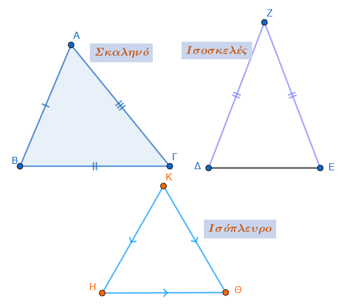

**Με βάση τις γωνίες:**

1.  **Οξυγώνιο:** Όταν όλες οι γωνίες του είναι οξείες ($<90^\circ$).
2.  **Ορθογώνιο:** Όταν έχει **μία γωνία ορθή (**$90^\circ$). Η πλευρά απέναντι από την ορθή γωνία λέγεται **υποτείνουσα** και οι άλλες δύο **κάθετες πλευρές**.
3.  **Αμβλυγώνιο:** Όταν μία από τις γωνίες του είναι αμβλεία ($>90^\circ$).

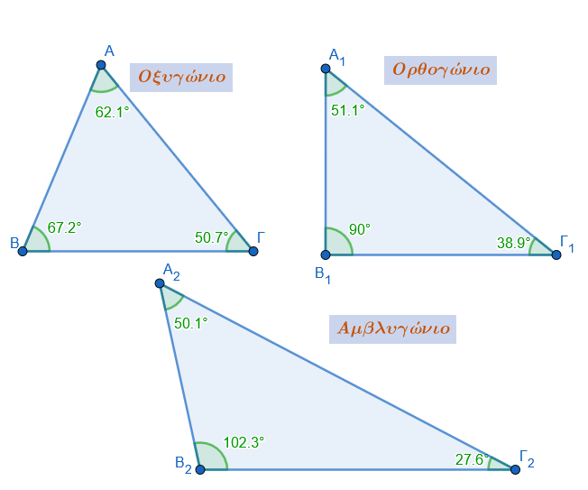
::::::::

### **4. Παραδείγματα και Εφαρμογές**

- **Παράδειγμα Ισοσκελούς:** Αν σε ένα ισοσκελές τρίγωνο η γωνία της κορυφής είναι $60^\circ$, τότε οι γωνίες της βάσης θα είναι επίσης $(180^\circ-60^\circ)/2 = 60^\circ$, άρα το τρίγωνο είναι **ισόπλευρο**.
- **Παράδειγμα Ορθογωνίου:** Αν σε ορθογώνιο τρίγωνο μία οξεία γωνία είναι $30^\circ$, τότε η απέναντι κάθετη πλευρά ισούται με το **μισό της υποτείνουσας**.
- **Εφαρμογή Διαμέσου:** Σε κάθε ορθογώνιο τρίγωνο, η διάμεσος που αντιστοιχεί στην υποτείνουσα είναι ίση με το **μισό της υποτείνουσας**.
- **Υπολογισμός Γωνιών:** Αν η γωνία Α ενός τριγώνου είναι $45^\circ$ και οι γωνίες Β, Γ είναι ανάλογες προς τους αριθμούς $11$ και $16$, τότε $Β+\Gamma = 135^\circ$ και μέσω αναλογιών προκύπτει $Β=55^\circ$ και $\Gamma=80^\circ$.

## Ισότητα τριγώνων

### Θεωρία

Η ισότητα (συνήθως αναφερόμενη ως «σύμπτωση» ή «εφαρμογή») δύο τριγώνων αποτελεί θεμελιώδη έννοια της Γεωμετρίας, σύμφωνα με την οποία δύο τρίγωνα θεωρούνται ίσα όταν μπορούν να ταυτιστούν πλήρως μέσω μετατόπισης ή αναστροφής.
Όταν δύο τρίγωνα είναι ίσα, όλα τα αντίστοιχα κύρια στοιχεία τους (πλευρές και γωνίες) είναι ίσα μεταξύ τους.

::: {style="background-color: #c98ba2; border: 2px solid #2f3e50; color: #25188a; padding: 15px; border-radius: 5px;"}
**Κριτήρια Ισότητας Τριγώνων** Για να διαπιστωθεί αν δύο τρίγωνα είναι ίσα, δεν απαιτείται η γνώση της ισότητας και των έξι κύριων στοιχείων τους.
Αρκούν ορισμένοι συνδυασμοί τριών στοιχείων, οι οποίοι ονομάζονται **κριτήρια ισότητας**:

1.  **Πλευρά - Γωνία - Πλευρά (Π-Γ-Π):** Αν δύο τρίγωνα έχουν δύο πλευρές ίσες μία προς μία και την περιεχόμενη γωνία τους ίση, τότε είναι ίσα.\

    \
    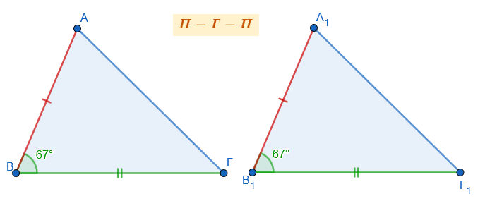

2.  **Γωνία - Πλευρά - Γωνία (Γ-Π-Γ):** Αν δύο τρίγωνα έχουν μια πλευρά ίση και τις προσκείμενες σε αυτήν γωνίες αντίστοιχα ίσες, τότε είναι ίσα.\

    \
    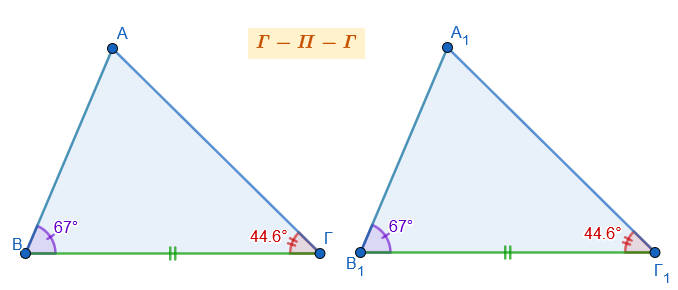

3.  **Πλευρά - Πλευρά - Πλευρά (Π-Π-Π):** Αν δύο τρίγωνα έχουν και τις τρεις πλευρές τους αντίστοιχα ίσες μία προς μία, τότε είναι ίσα.\

    \
    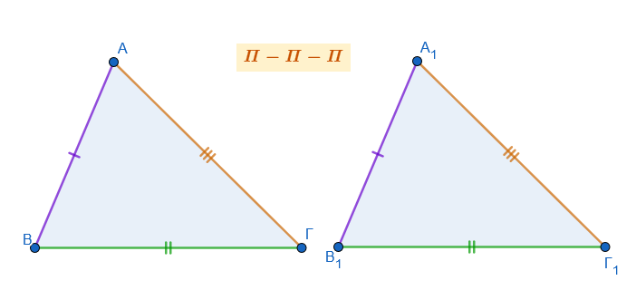

*Σημείωση:* Στην περίπτωση που δύο τρίγωνα έχουν μια πλευρά ίση και δύο οποιεσδήποτε γωνίες ίσες, θεωρούνται επίσης ίσα (Γ-Γ-Π), καθώς η ισότητα δύο γωνιών συνεπάγεται και την ισότητα της τρίτης.

**Ισότητα Ορθογωνίων Τριγώνων**

Στα ορθογώνια τρίγωνα, η ύπαρξη της ορθής γωνίας απλουστεύει τα κριτήρια, καθώς απαιτείται η ισότητα δύο μόνο επιπλέον στοιχείων (εκ των οποίων το ένα τουλάχιστον πρέπει να είναι πλευρά):

- **Δύο κάθετες πλευρές:** Αν οι δύο κάθετες πλευρές είναι ίσες μία προς μία.
- **Μια κάθετη πλευρά και η προσκείμενη οξεία γωνία**.
- **Μια κάθετη πλευρά και η απέναντι οξεία γωνία**.
- **Η υποτείνουσα και μια οξεία γωνία**.
- **Η υποτείνουσα και μια κάθετη πλευρά**.

**Βασικές Ιδιότητες και Πορίσματα**

- **Αντίστοιχα στοιχεία:** Σε δύο ίσα τρίγωνα, απέναντι από ίσες πλευρές βρίσκονται ίσες γωνίες και αντίστροφα.
- **Δευτερεύοντα στοιχεία:** Αν δύο τρίγωνα είναι ίσα, τότε και οι αντίστοιχες **διχοτόμοι**, **διάμεσοι** και τα **ύψη** τους είναι ίσα μεταξύ τους.
- **Ισοσκελές τρίγωνο:** Ένα τρίγωνο είναι ισοσκελές αν και μόνο αν έχει δύο γωνίες ίσες ή αν ένα ύψος του είναι ταυτόχρονα και διάμεσος.
:::

**Παραδείγματα Εφαρμογής**

1.  **Ιδιότητα Διχοτόμου:** Αν πάρουμε ένα τυχαίο σημείο Μ πάνω στη διχοτόμο μιας γωνίας xOy, τα ορθογώνια τρίγωνα που σχηματίζονται από τις αποστάσεις του Μ προς τις πλευρές της γωνίας είναι ίσα. Επομένως, κάθε σημείο της διχοτόμου **ισαπέχει** από τις πλευρές της γωνίας.\
    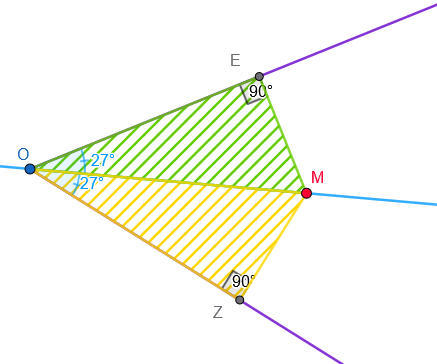
2.  **Διάμεσος και Προέκταση:** Σε ένα τρίγωνο ΑΒΓ, αν προεκτείνουμε τη διάμεσο ΑΜ κατά τμήμα ΜΔ = ΑΜ, τότε τα τρίγωνα ΑΜΓ και ΒΜΔ είναι ίσα (βάσει του κριτηρίου Π-Γ-Π: ΒΜ=ΜΓ, ΜΑ=ΜΔ και οι κατακορυφήν γωνίες). Ως αποτέλεσμα, προκύπτει ότι ΒΔ = ΑΓ.\
    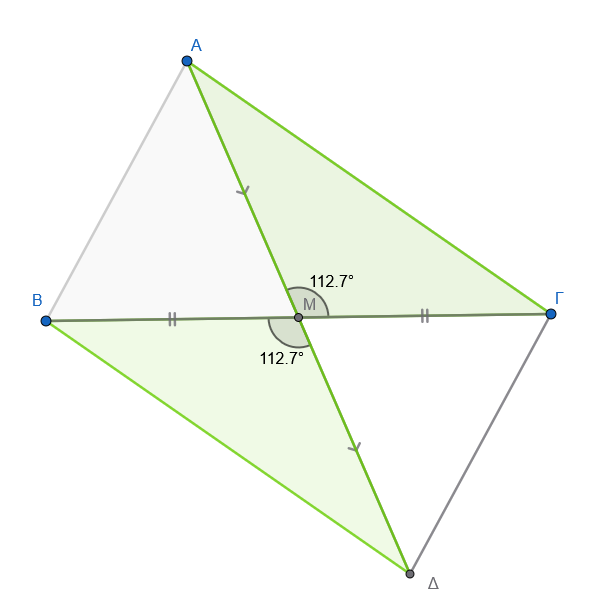{width="427"}
3.  **Ισότητα Διαμέσων:** Αν σε ένα ισοσκελές τρίγωνο (ΑΒ=ΑΓ) φέρουμε τις διαμέσους προς τις ίσες πλευρές, τα τρίγωνα που σχηματίζονται στη βάση (π.χ. ΒΕΓ και ΓΔΒ) έχουν την πλευρά ΒΓ κοινή, τις γωνίες της βάσης ίσες και τις πλευρές ΒΕ=ΓΔ (ως μισά ίσων πλευρών). Άρα τα τρίγωνα είναι ίσα και οι διάμεσοι ΒΔ και ΓΕ είναι ίσες.\
    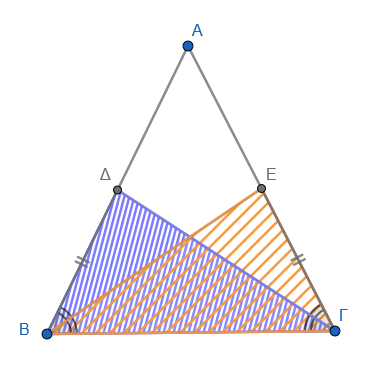
4.  **Ορθογώνιο Τρίγωνο και Διάμεσος:** Στο ορθογώνιο τρίγωνο, η διάμεσος που αντιστοιχεί στην υποτείνουσα είναι ίση με το μισό της. Αντιστρόφως, αν μια διάμεσος ισούται με το μισό της πλευράς στην οποία αντιστοιχεί, το τρίγωνο είναι ορθογώνιο.\
    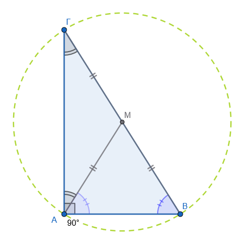{width="377"}

**5. Εφαρμογές σε Παραλληλόγραμμα**

- **Ισότητα απέναντι πλευρών:** Για να αποδειχθεί ότι οι απέναντι πλευρές ενός παραλληλογράμμου ΑΒΓΔ είναι ίσες, φέρνουμε τη διαγώνιο ΑΓ. Τα τρίγωνα ΑΒΓ και ΑΔΓ που σχηματίζονται είναι ίσα βάσει του κριτηρίου **Γ-Π-Γ** (έχουν την ΑΓ κοινή και τις εντός εναλλάξ γωνίες ίσες λόγω των παραλλήλων πλευρών). Ως αποτέλεσμα, προκύπτει ότι ΑΒ=ΔΓ και ΑΔ=ΒΓ.\
  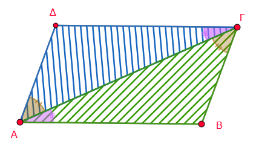
- **Διχοτόμηση διαγωνίων:** Στο παραλληλόγραμμο ΑΒΓΔ, οι διαγώνιοι ΑΓ και ΒΔ τέμνονται στο Μ. Τα τρίγωνα ΑΒΜ και ΔΓΜ είναι ίσα (βάσει του κριτηρίου **Γ-Π-Γ**), καθώς έχουν τις απέναντι πλευρές ΑΒ και ΔΓ ίσες και τις αντίστοιχες εντός εναλλάξ γωνίες ίσες. Από την ισότητα αυτή προκύπτει ότι ΑΜ=ΜΓ και ΒΜ=ΜΔ, δηλαδή οι διαγώνιοι αλληλοδιχοτομούνται.\
  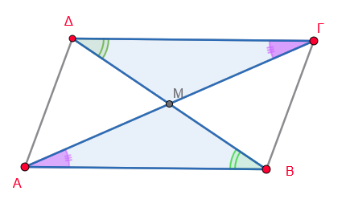
- **Κάθετες αποστάσεις από κορυφές:** Σε ένα παραλληλόγραμμο ΑΒΓΔ, αν φέρουμε τις κάθετες ΒΚ και ΔΗ στη διαγώνιο ΑΓ, το τετράπλευρο ΒΚΔΗ είναι επίσης παραλληλόγραμμο. Αυτό αποδεικνύεται συγκρίνοντας τα ορθογώνια τρίγωνα ΑΔΗ και ΒΓΚ, τα οποία είναι ίσα (έχουν ίσες υποτείνουσες και μία οξεία γωνία ίση), άρα ΒΚ=ΔΗ.\
  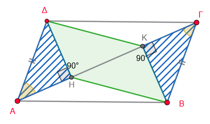

**6. Εφαρμογές σε Ισοσκελή και Ισόπλευρα Τρίγωνα**

- **Ισότητα υψών:** Αποδεικνύεται ότι τα ύψη που αντιστοιχούν στις ίσες πλευρές ισοσκελούς τριγώνου είναι ίσα, συγκρίνοντας τα ορθογώνια τρίγωνα που σχηματίζονται.\
  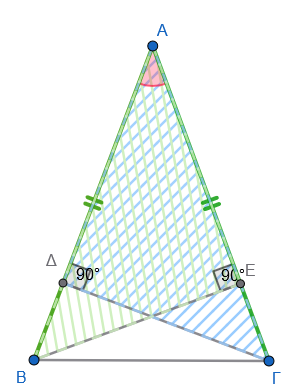
- **Εξωτερικά ισόπλευρα τρίγωνα:** Αν κατασκευάσουμε εξωτερικά των πλευρών ΑΒ και ΑΓ ενός τριγώνου ΑΒΓ δύο ισόπλευρα τρίγωνα ΑΒΓ' και ΑΓΒ', τότε τα τμήματα ΒΒ' και ΓΓ' είναι ίσα. Αυτό προκύπτει από την ισότητα των τριγώνων Γ'ΑΓ και ΒΑΒ' μέσω του κριτηρίου **Π-Γ-Π**.\
  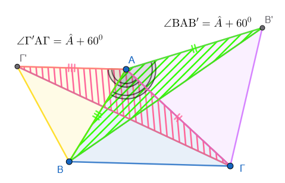

**7. Εφαρμογές σε Κύκλους**

- **Ισότητα τριγώνων από διαμέτρους:** Σε έναν κύκλο με κέντρο Κ, αν φέρουμε τρεις διαμέτρους ΑΚΑ', ΒΚΒ' και ΓΚΓ', τα τρίγωνα ΑΒΓ και Α'Β'Γ' είναι ίσα.
  Η απόδειξη βασίζεται στο ότι τα επιμέρους τρίγωνα (π.χ. ΑΚΒ και Α'ΚΒ' , ΑΚΓ και Α'ΚΓ' , ΒΓΚ και Β'ΚΓ') είναι ίσα βάσει του κριτηρίου **Π-Γ-Π** (έχουν ίσες πλευρές ως ακτίνες και ίσες περιεχόμενες κατακορυφήν γωνίες).
  Άρα ΑΓ=Α'Γ', ΑΒ=Α'Β' και ΒΓ=Β'Γ' δηλαδή $\triangle ΑΒΓ=\triangle Α'Β'Γ'$\
  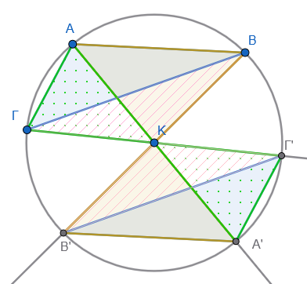

- **Χορδές και αποστάσεις:** Αν δύο χορδές ΑΒ και ΓΔ είναι ίσες, το ευθύγραμμο τμήμα που ενώνει το κέντρο του κύκλου με το σημείο τομής τους διχοτομεί τη γωνία των χορδών.
  Αυτό αποδεικνύεται από την ισότητα των ορθογωνίων τριγώνων που σχηματίζονται από το κέντρο και τις αποστάσεις προς τις χορδές.\
  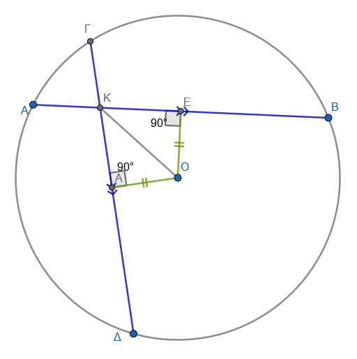{width="356"}

**8. Γενικές Γεωμετρικές Ιδιότητες**

- **Αποστάσεις κορυφών από τη διάμεσο:** Σε ένα τρίγωνο ΑΒΓ με διάμεσο ΑΜ, οι κορυφές Β και Γ ισαπέχουν από την ευθεία της διαμέσου.
  Αυτό αποδεικνύεται συγκρίνοντας τα ορθογώνια τρίγωνα ΒΜΚ και ΓΜΗ, τα οποία έχουν ίσες υποτείνουσες (ΒΜ=ΜΓ) και ίσες κατακορυφήν οξείες γωνίες.\
  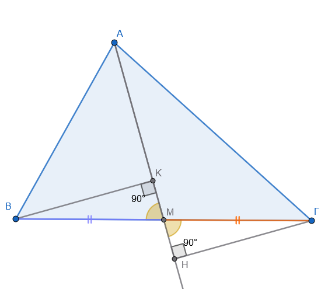{width="393"}

- **Ιδιότητα μεσοκαθέτου:** Κάθε σημείο Π της μεσοκαθέτου ενός τμήματος ΑΒ ισαπέχει από τα άκρα Α και Β.
  Τα ορθογώνια τρίγωνα ΠΜΑ και ΠΜΒ (όπου Μ το μέσο του ΑΒ) είναι ίσα, έχοντας δύο κάθετες πλευρές ίσες μία προς μία.\
  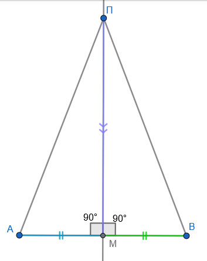

- **Ισότητα Διαγωνίων σε Ισοσκελές Τραπέζιο:** Αν ένα τραπέζιο έχει ίσες διαγώνιες, τότε είναι ισοσκελές.
  Για την απόδειξη, συγκρίνουμε τα ορθογώνια τρίγωνα $ΑΓΖ$ και $ΒΔΕ$ που σχηματίζονται από τα ύψη, τα οποία είναι ίσα έχοντας ίσες υποτείνουσες (τις διαγώνιες) και ίσα ύψη.\
  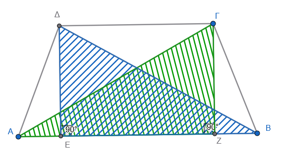

- **Ιδιότητα Ισοσκελούς Τριγώνου:** Σε ένα ισοσκελές τρίγωνο $ΑΒΓ$ ($ΑΒ=ΑΓ$), το άθροισμα των αποστάσεων οποιουδήποτε σημείου $Δ$ της βάσης από τις ίσες πλευρές ($ΔΚ + ΔΛ$) είναι σταθερό και ίσο με το ύψος που αντιστοιχεί σε μία από τις ίσες πλευρές.
  Η απόδειξη χρησιμοποιεί την ισότητα ορθογωνίων τριγώνων όπως τα $ΒΔΝ$ και $ΒΔΚ$.\
  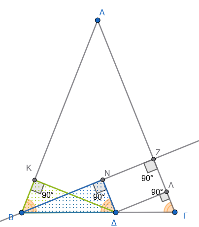

- **Προβολές σε Διχοτόμους:** Οι προβολές μιας κορυφής $Α$ τριγώνου $ΑΒΓ$ πάνω στις εσωτερικές και εξωτερικές διχοτόμους των γωνιών $Β$ και $Γ$ βρίσκονται στην ίδια ευθεία.

  *Υπόδειξη: Το ΑΔΒΖ είναι ορθογώνιο παραλληλόγραμμο και οι διαγώνιοι του διχοτομούνται στο Κ μέσον της ΑΒ. Ομοίως το ΑΕΓΗ είναι ορθογώνιο παραλληλόγραμμο και οι διαγώνιοι του διχοτομούνται στο Λ μέσον της ΑΓ.* *Επιπλέον η* $\angle ΚΔΒ = \angle ΒΓΝ$ που σημαίνει ΔΖ//ΒΓ .............\
  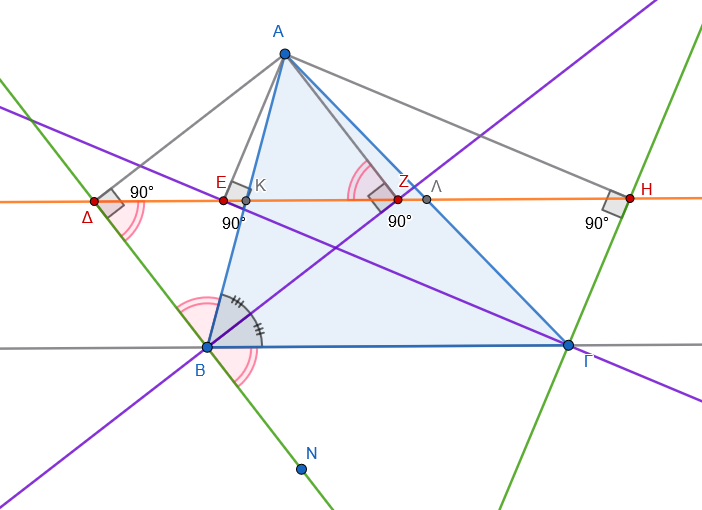{width="462"}

**9. Στερεομετρικές Εφαρμογές**\
\* **Απόσταση Σημείου από Επίπεδο:** Αν μια ευθεία είναι κάθετη στο κέντρο $Ο$ ενός κυκλικού δίσκου και πάρουμε τυχαίο σημείο $Μ$ πάνω στην ευθεία, τότε το $Μ$ ισαπέχει από όλα τα σημεία της περιφέρειας του κύκλου.
Τα ορθογώνια τρίγωνα που σχηματίζονται (π.χ. $ΜΟΑ$ και $ΜΟΒ$) είναι ίσα έχοντας δύο κάθετες πλευρές ίσες (την $ΜΟ$ κοινή και τις ακτίνες του κύκλου).\
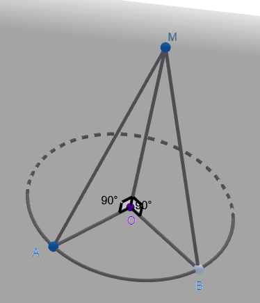

------------------------------------------------------------------------

### Ασκήσεις

1.  Στο διπλανό σχήμα, τα τρίγωνα $ABΓ$ και $AEΔ$ έχουν $AB=AE$, $AΓ=AΔ$ και οι γωνίες $\hat{A}_1, \hat{A}_2$ είναι κατακορυφήν.
    Να εξηγήσετε γιατί είναι ίσα και να συμπληρώσετε τις ισότητες: $\hat{B} = \dots, \hat{\Gamma} = \dots$ και $B\Gamma = \dots$\
    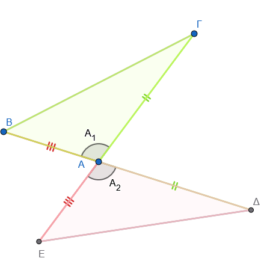

2.  Δύο τρίγωνα έχουν πλευρές $5\,cm$ και $8\,cm$ και μία γωνία $30^\circ$.
    Γιατί δεν είναι απαραίτητα ίσα;

3.  Δύο τρίγωνα έχουν γωνίες $65^ο, 73^ο$ και την πλευρά ανάμεσά τους $4,9\,cm$.
    Γιατί είναι ίσα; Συμπληρώστε: $AΓ = \dots$ και $ΒΓ = \dots$\
    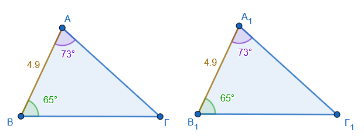

4.  Ένα τρίγωνο έχει πλευρές $5,9\,cm, 7,2\,cm$ και περιεχόμενη γωνία $63^\circ$ .
    Ένα άλλο τρίγωνο έχει πλευρές $5,9\,cm, 7,2\,cm$ και γωνία $63^\circ$ απέναντι από την πλευρά $7,2\,cm$.
    Είναι ίσα; Αιτιολογήστε την απάντησή σας.\
    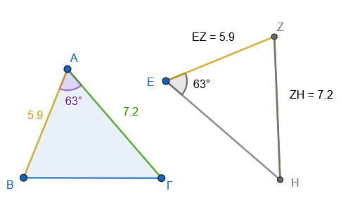

5.  Σε δύο τρίγωνα έχουμε γωνίες $50^\circ, 70^\circ$ και πλευρά $6\,cm$ απέναντι από τη γωνία $50^\circ$.
    Είναι ίσα; Αιτιολογήστε την απάντησή σας.\
    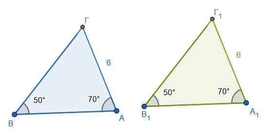

6.  Δύο τρίγωνα έχουν πλευρές $3\,cm, 4\,cm, 6\,cm$ και $3\,cm, 4\,cm, 6\,cm$ αντίστοιχα.
    Γιατί είναι ίσα; Συμπληρώστε: $\hat{A} = \dots, \hat{B} = \dots$ και $\hat{\Gamma} = \dots$\
    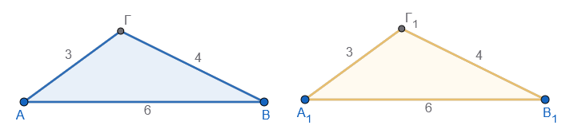

7.  Χαρακτηρίστε τις προτάσεις (Σ) ή (Λ):

    α) Αν δύο τρίγωνα έχουν δύο πλευρές ίσες και μία γωνία ίση, είναι ίσα.

    β) Αν δύο τρίγωνα έχουν τις γωνίες τους ίσες, είναι ίσα.

    γ) Αν δύο τρίγωνα είναι ίσα, τότε έχουν ίσες πλευρές.

8.  Δύο ορθογώνια τρίγωνα έχουν υποτείνουσα $10\,cm$ και μία οξεία γωνία $40^\circ$.
    Είναι ίσα; Αιτιολογήστε την απάντησή σας.\
    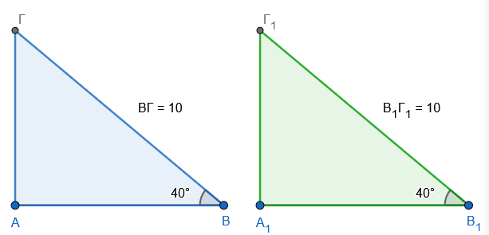{width="451"}

9.  Δύο ορθογώνια τρίγωνα έχουν κάθετες πλευρές $3\,cm$ και $4\,cm$.
    Είναι ίσα; Αιτιολογήστε την απάντησή σας.

    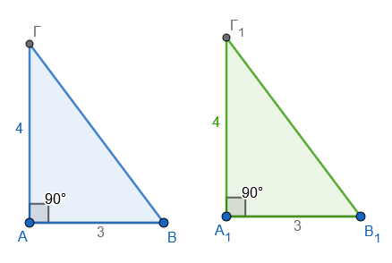

10. Δύο ορθογώνια τρίγωνα έχουν υποτείνουσα $5\,cm$ και μία κάθετη πλευρά $3\,cm$.
    Είναι ίσα; Αιτιολογήστε την απάντησή σας.\
    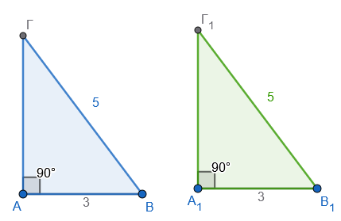

11. Δύο τρίγωνα $ABΓ$ και $AΔΓ$ έχουν κοινή πλευρά $AΓ$ και είναι ορθογώνια στο $B$ και $Δ$ αντίστοιχα, με $AB=AΔ$.
    Γιατί είναι ίσα;\
    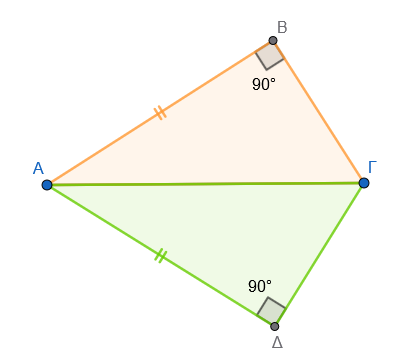

12. Στο παρακάτω σχήμα, τα τρίγωνα $ABΓ$ και $Α_1Β_1Γ_1$ έχουν $AB = Α_1Β_1 = 7\,cm$, $AΓ = Α_1Γ_1 = 5\,cm$ και την περιεχόμενη γωνία $\hat{A} = \hat{Α_1} = 60^\circ$.
    Να εξηγήσετε γιατί είναι ίσα και να συμπληρώσετε τις ισότητες: $\hat{B} = \dots \dots$, $\hat{\Gamma} = \dots \dots$ και $B\Gamma = \dots \dots$\
    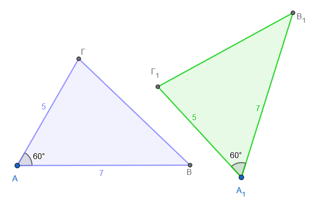{width="507"}

13. Στο τρίγωνο $AB\Gamma$ η γωνία $\hat{B} = 55^\circ$ και η γωνία $\hat{\Gamma} = 75^\circ$.
    Στο τρίγωνο $\Delta EZ$ η γωνία $\hat{E} = 55^\circ$ και η πλευρά $EZ = 10\,cm$.
    Ποια επιπλέον πληροφορία χρειάζεστε για να αποδείξετε ότι τα τρίγωνα είναι ίσα από το κριτήριο Γ-Π-Γ;\
    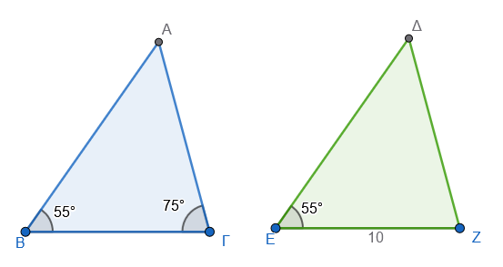

14. Έστω δύο ορθογώνια τρίγωνα $AB\Gamma$ ($\hat{A}=90^\circ$) και $\Delta EZ$ ($\hat{\Delta}=90^\circ$).
    Αν $AB = \Delta E = 4\,cm$ και η υποτείνουσα $B\Gamma = EZ = 6\,cm$, είναι τα τρίγωνα ίσα; Να αιτιολογήσετε την απάντησή σας.\
    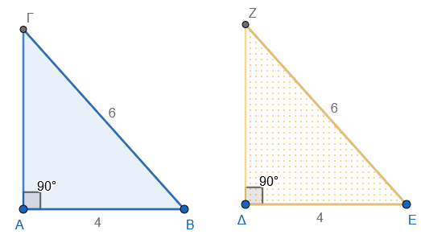

15. Σε ένα τρίγωνο $AB\Gamma$, η πλευρά $AB = 5\,cm$, η γωνία $\hat{B} = 60^\circ$ και η γωνία $\hat{A} = 70^\circ$.
    Σε ένα άλλο τρίγωνο $K\Lambda M$, η πλευρά $\Lambda M = 5\,cm$, η γωνία $\hat{\Lambda} = 60^\circ$ και η γωνία $\hat{M} = 50^\circ$.
    Είναι τα τρίγωνα ίσα; Αιτιολογήστε την απάντησή σας.\
    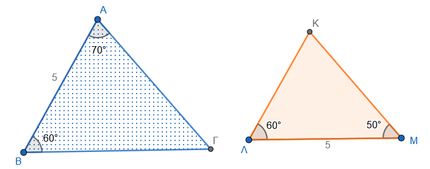

16. Δύο τρίγωνα $AB\Gamma$ και $\Delta EZ$ έχουν τις πλευρές τους $AB=3\,cm, B\Gamma=4\,cm, A\Gamma=5\,cm$ και $\Delta E=3\,cm, EZ=4\,cm, \Delta Z=5\,cm$ αντίστοιχα.
    Να εξηγήσετε γιατί είναι ίσα και να συμπληρώσετε τις ισότητες: $\hat{A} = \dots \dots$, $\hat{B} = \dots \dots$ και $\hat{\Gamma} = \dots \dots$

*Σχεδιάστε τα τρίγωνα*

17. **Στο παρακάτω σχήμα έχουμε** $AZ = AH$ και $AB = A\Delta$.
    Να αποδείξετε ότι $ZB = H\Delta$.\
    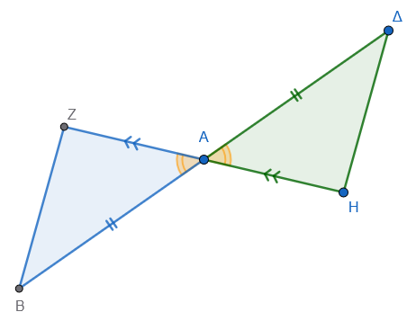

18. **Έστω** $O\Gamma$ η διχοτόμος της γωνίας $\hat{O}$.
    Αν πάνω στίς πλευρές της πάρουμε $OA = OB$ και σημείο $M$ στην $O\Gamma$, να αποδείξετε ότι $MA = MB$.\
    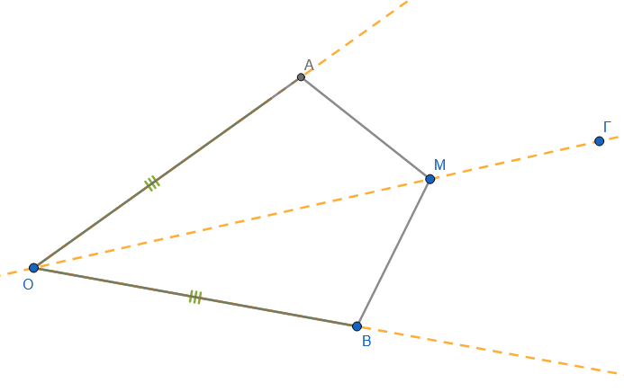{width="524"}

19. **Στη βάση** $B\Gamma$ ενός ισοσκελούς τριγώνου $AB\Gamma$ με $AB=A\Gamma$, παίρνουμε σημεία $Z, H$ τέτοια ώστε $BZ = \Gamma H$.
    Να αποδείξετε ότι $AZ = AH$.\
    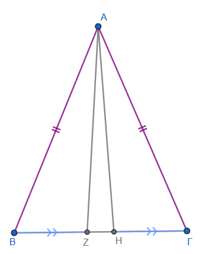{width="295"}

20. **Στο παρακάτω σχήμα είναι** $AB = A\Delta$ και $A\Gamma = AE$.
    Να αποδείξετε ότι $BΕ = ΔΓ$.\
    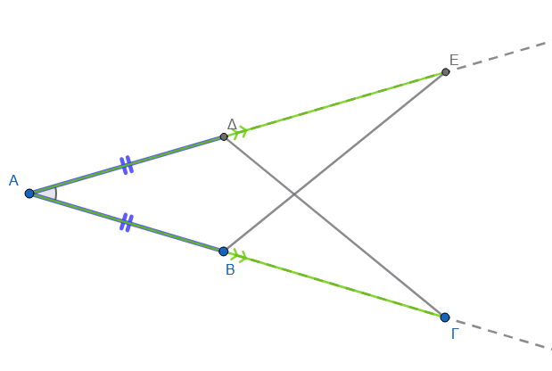{width="448"}

21. **Κάθε πλευρά του ισόπλευρου τριγώνου** $AB\Gamma$ είναι $6\,cm$.
    Αν $AZ = B\Delta = \Gamma E = 2\,cm$, να αποδείξετε ότι το τρίγωνο $Z\Delta E$ είναι ισόπλευρο.\
    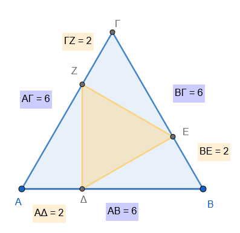

22. **Στις προεκτάσεις των ίσων πλευρών** $AB, A\Gamma$ ισοσκελούς τριγώνου, παίρνουμε τμήματα $B\Delta = \Gamma E$.
    Να αποδείξετε ότι $\hat{ΒΔΓ} = \hat{ΒΕΓ}$ .\
    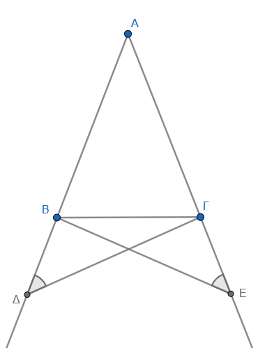{width="276"}

23. **Σε τετράπλευρο** $AB\Gamma\Delta$, η διαγώνιος $B\Delta$ διχοτομεί τις γωνίες $\hat{B}$ και $\hat{\Delta}$ και η διαγώνιος ΑΒ διχοτομεί τις γωνίες $\hat A$ και $\hat Γ$ Να αποδείξετε ότι το τετράπλευρο είναι ρόμβος.

24. **Να αποδείξετε ότι οι διαγώνιοι ενός ορθογωνίου παραλληλογράμμου είναι ίσες.**

25. **Τα τρίγωνα** $AB\Gamma$ και $A_1B_1Γ_1$ έχουν τις διαμέσους $AM = A_1M_1$ ίσες τις πλευρές $AB=A_1B_1$ ίσες και τις γωνίες $\hat ω = \hat ω_1$ ίσες.
    Να αποδείξετε ότι τα τρίγωνα είναι ίσα.\
    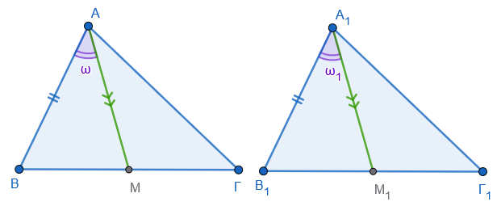

26. **Το σημείο** $M$ ισαπέχει από τα άκρα $A, B$ ενός ευθύγραμμου τμήματος.
    Να αποδείξετε ότι το $M$ ανήκει στη μεσοκάθετο του $AB$.

27. **Αν δύο κύκλοι τέμνονται στα σημεία** $A$ και $B$, να αποδείξετε ότι η ευθεία των κέντρων τους είναι μεσοκάθετος του $AB$.\
    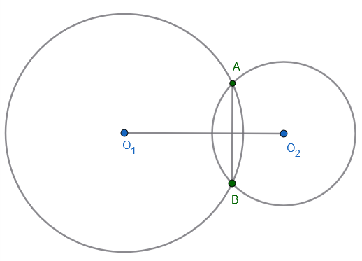{width="379"}

28. **Τα ισοσκελή τρίγωνα** $AB\Delta$ και $A\Gamma\Delta$ έχουν κοινή βάση $A\Delta$.
    Να αποδείξετε ότι η ευθεία $B\Gamma$ είναι μεσοκάθετος του $A\Delta$.\
    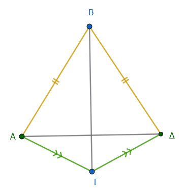

29. **Στα τρίγωνα** $AB\Gamma$ και $A_1B_1Γ_1$ τα ύψη $AH = A_1H_1$ είναι ίσα, $ΒΗ = Β_1Η_1$ και $HΓ = Η_1Γ_1$.
    Να αποδείξετε ότι τα τρίγωνα είναι ίσα.\
    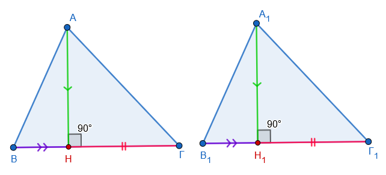

30. **Σε ισοσκελές τρίγωνο** $AB\Gamma$ με $AB=A\Gamma$, το $M$ είναι το μέσο της $B\Gamma$.
    Αν $MZ \perp AB$ και $MH \perp A\Gamma$, να αποδείξετε ότι $MZ = MH$.\
    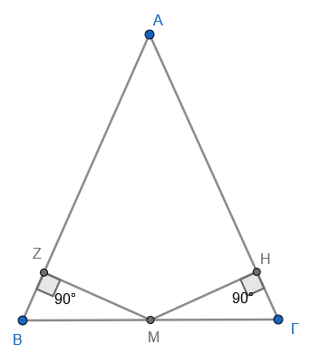{width="272"}

31. **Σε ισοσκελές τρίγωνο** $AB\Gamma$ ($AB=A\Gamma$), φέρουμε $B\Delta \perp A\Gamma$ και $\Gamma E \perp AB$.
    Να αποδείξετε ότι $B\Delta = \Gamma E$.\
    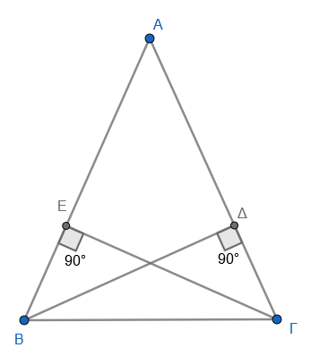{width="260"}

32. **Σε ορθογώνιο τρίγωνο** $AB\Gamma$ ($\hat{A}=90^\circ$), φέρουμε τη διχοτόμο $\Gamma Z$.
    Αν $ZE \perp B\Gamma$, να αποδείξετε ότι $AZ = ZE$.\
    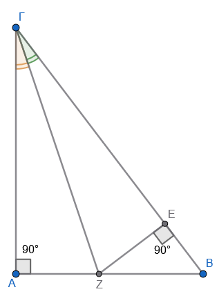{width="254"}

33. **Τα τρίγωνα** $AB\Gamma$ και $A'B'\Gamma'$ έχουν $\hat{B} = \hat{B}'$ και $AB = A'B'$, $B\Gamma = B'\Gamma'$.
    Να αποδείξετε ότι τα ύψη προς τις πλευρές $A\Gamma$ και $A'\Gamma'$ είναι ίσα.\
    *Σχεδιάστε το σχήμα*

34. **Αν οι χορδές** $AB, \Gamma\Delta$ ενός κύκλου ισαπέχουν από το κέντρο, να αποδείξετε ότι είναι ίσες.\
    *Σχεδιάστε το σχήμα*

35. **Στον κύκλο, η διάμετρος** $AB$ είναι κάθετη στη χορδή $\Gamma\Delta$ στο σημείο $M$.
    Να αποδείξετε ότι το $M$ είναι το μέσο της $\Gamma\Delta$.\
    *Σχεδιάστε το σχήμα*

------------------------------------------------------------------------

$$\bbox[yellow, 5px]{\color{blue}\Large\text{---}}$$

::: {.callout-tip style="color: brown;"}
:::

::: {style="background-color: #d3deb8; border: 2px solid #2f3e50; color: #25188a; padding: 15px; border-radius: 5px;"}
:::

::: {.callout-tip style="color: brown;"}
ΚΑΛΗ ΜΕΛΕΤΗ!
:::

\
\
