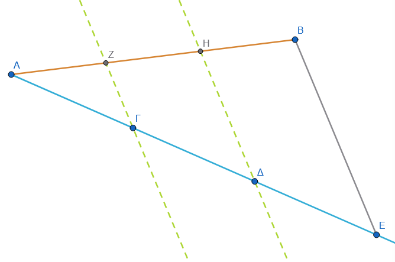
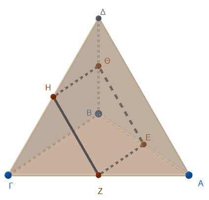
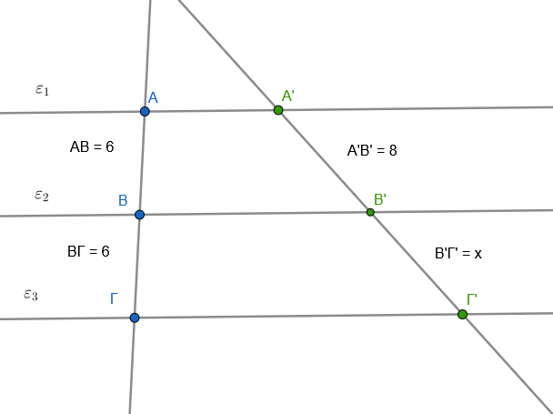
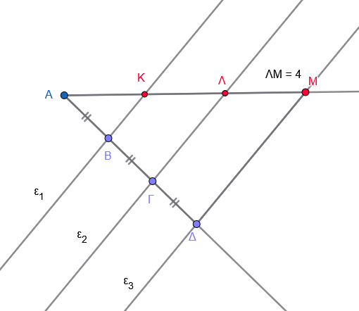
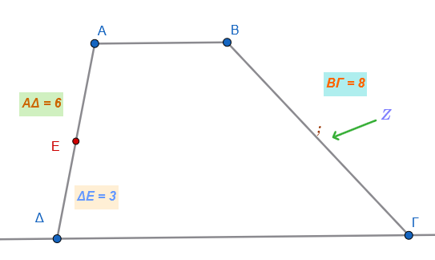
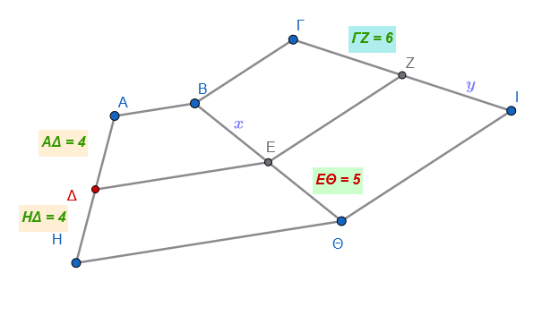

```{=html}
<!-- Φόρτωση βιβλιοθήκης GeoGebra -->
<script src="https://www.geogebra.org/apps/deployggb.js"></script>

<!-- Συνάρτηση δημιουργίας applets -->
<script>
function createGeoGebra(containerId, materialId, width = 700, height = 500) {
  var params = {
    "id": "ggb-" + containerId,
    "material_id": materialId,
    "width": width,
    "height": height,
    "showToolBar": true,
    "showMenuBar": false,
    "showAlgebraInput": true
  };
  
  var applet = new GGBApplet(params, '5.2');
  applet.inject(containerId);
}
</script>
```

## Λόγος ευθυγράμμων τμημάτων

Ο **λόγος δύο ευθυγράμμων τμημάτων** είναι μια θεμελιώδης έννοια της Γεωμετρίας που συνδέει τα γεωμετρικά μεγέθη με τους πραγματικούς αριθμούς.

### **Θεωρία: Ορισμός και Ιδιότητες**

:::: {style="background-color: #c98ba2; border: 2px solid #2f3e50; color: #25188a; padding: 15px; border-radius: 5px;"}
- **Ορισμός:** Αν έχουμε δύο ευθύγραμμα τμήματα $AB$ και $\Gamma\Delta$, όπου το $\Gamma\Delta$ είναι μη μηδενικό, ο λόγος του $AB$ προς το $\Gamma\Delta$ ορίζεται ως ένας **απόλυτος πραγματικός αριθμός**. Ο αριθμός αυτός εκφράζει το **μήκος** του τμήματος $AB$ όταν ως μονάδα μέτρησης χρησιμοποιηθεί το τμήμα $\Gamma\Delta$.
- **Αριθμητική τιμή:** Ο λόγος δύο τμημάτων ισούται με τον λόγο των **μέτρων** τους (των μηκών τους), υπό την προϋπόθεση ότι και τα δύο έχουν μετρηθεί με την **ίδια μονάδα μέτρησης**.

<iframe src="https://www.geogebra.org/calculator/ntnwsze5?embed" width="730" height="600" allowfullscreen style="border: 1px solid #e4e4e4;border-radius: 4px;" frameborder="0">

</iframe>

::: callout-tip
Επιλέξτε τα σημεία Β ή Δ και κρατώντας πατημένο το <button class="btn btn-primary btn-sm">Shift</button> + <a class="btn btn-primary btn-sm"> βέλος \< ή βέλος \> </a> αλάξτε το μήκος των τμημάτων ΑΒ και ΓΔ.
:::

- **Ανεξαρτησία από τη μονάδα:** Ο λόγος δύο ομοειδών μεγεθών (όπως τα ευθύγραμμα τμήματα) παραμένει **σταθερός και ανεξάρτητος** από τη μονάδα μέτρησης που χρησιμοποιείται (π.χ. είτε μετρήσουμε σε εκατοστά είτε σε χιλιοστά, ο λόγος των δύο τμημάτων θα είναι ο ίδιος).
- **Σύμμετρα και Ασύμμετρα τμήματα:**
  - **Σύμμετρα** ονομάζονται τα τμήματα που έχουν μια **κοινή μονάδα μέτρησης** (κοινό υποπολλαπλάσιο), οπότε ο λόγος τους είναι ρητός αριθμός.
  - **Ασύμμετρα** ονομάζονται τα τμήματα για τα οποία είναι αδύνατο να βρεθεί κοινό μέτρο, όσο μικρή μονάδα μέτρησης και αν επιλέξουμε. Σε αυτή την περίπτωση, ο λόγος τους είναι **άρρητος αριθμός** (π.χ. ο λόγος της διαγωνίου προς την πλευρά ενός τετραγώνου).
- **Λόγος προσανατολισμένων τμημάτων (Διανυσμάτων):** Στην περίπτωση συγγραμμικών διανυσμάτων, ο λόγος μπορεί να είναι και **αρνητικός**. Είναι θετικός αν τα διανύσματα έχουν την ίδια φορά και αρνητικός αν έχουν αντίθετη φορά.

#### **Παραδείγματα**

1.  **Απλή μέτρηση:** Αν ένα τμήμα $AB$ έχει μήκος 6 μονάδες $\mu$ και ένα τμήμα $\Gamma\Delta$ έχει μήκος 5 μονάδες $\mu$, τότε ο λόγος του $AB$ προς το $\Gamma\Delta$ είναι $\dfrac{6}{5}$ ή $1,2$.
2.  **Σύγκριση βαρών:** Αν ένας μαθητής Α ζυγίζει $40\,kg$ και ένας μαθητής Β ζυγίζει $45\,kg$, ο λόγος των βαρών τους είναι $\dfrac{40}{45} = \dfrac{8}{9}$.
3.  **Αλλαγή μονάδας:** Αν δύο τμήματα έχουν μήκη $8\,cm$ και $9\,cm$, ο λόγος τους είναι $\dfrac{8}{9}$. Αν τα μετρήσουμε σε χιλιοστά, τα μήκη θα είναι $80\,mm$ και $90\,mm$, αλλά ο λόγος παραμένει $\dfrac{80}{90} = \dfrac{8}{9}$.
4.  **Γεωμετρική κατασκευή:** Μπορούμε να κατασκευάσουμε ένα τμήμα $\Gamma\Delta$ που να έχει προς ένα δοσμένο τμήμα $AB$ λόγο ίσο με έναν ρητό αριθμό $\lambda$. Για παράδειγμα, αν $\lambda = \dfrac{3}{4}$, τότε $\Gamma\Delta = \dfrac{3}{4} AB$.
::::

------------------------------------------------------------------------

Οι αναλογίες στα ευθύγραμμα τμήματα αποτελούν τη βάση για τη μελέτη της ομοιότητας και των γεωμετρικών μετασχηματισμών.
Η **αναλογία** ορίζεται ως η ισότητα δύο λόγων ($\dfrac{α}{α_1} = \dfrac{β}{β_1}$), όπου οι όροι $α$ και $β_1$ ονομάζονται **άκροι**, ενώ οι $α_1$ και $β$ ονομάζονται **μέσοι**.

### **Θεωρία: Βασικές Ιδιότητες των Αναλογιών**

::: {style="background-color: #c98ba2; border: 2px solid #2f3e50; color: #25188a; padding: 15px; border-radius: 5px;"}
Οι σημαντικότερες ιδιότητες που διέπουν τις αναλογίες είναι οι εξής:

1.  **Ιδιότητα των Γινομένων:** Σε κάθε αναλογία, το γινόμενο των άκρων όρων ισούται με το γινόμενο των μέσων όρων $$\dfrac{α}{α_1}=\dfrac{β}{β_1} \Rightarrow α \cdot β_1 = α_1 \cdot β$$.
2.  **Εναλλαγή Όρων:** Μπορούμε να εναλλάξουμε τους δύο μέσους ή τους δύο άκρους όρους μεταξύ τους και να προκύψει πάλι μια έγκυρη αναλογία. $$\dfrac{α}{α_1}=\dfrac{β}{β_1} \Rightarrow \dfrac{α}{β}=\dfrac{α_1}{β_1}$$
3.  **Αντιστροφή Λόγων:** Αν δύο λόγοι είναι ίσοι, τότε και οι αντίστροφοί τους είναι ίσοι. $$\dfrac{α}{α_1}=\dfrac{β}{β_1} \Rightarrow \dfrac{α_1}{α}=\dfrac{β_1}{β}$$
4.  **Πρόσθεση/Αφαίρεση Όρων:** Αν στους ηγούμενους (αριθμητές) μιας αναλογίας προσθέσουμε ή αφαιρέσουμε τους επομένους (παρονομαστές), προκύπτουν νέες αναλογίες π.χ., $$\dfrac{α \pm α_1}{α_1} = \dfrac{β \pm β_1}{β_1}$$.
5.  **Πολλαπλή Αναλογία:** Σε μια σειρά ίσων λόγων $$\dfrac{α}{α_1} = \dfrac{β}{β_1} = \dfrac{γ}{γ_1}=\dfrac{α+β+γ}{α_1+β_1+γ_1}$$, ο λόγος του αθροίσματος των αριθμητών προς το άθροισμα των παρονομαστών ισούται με τον κοινό λόγο.
:::

### **Παραδείγματα**

1.  **Υπολογισμός Τμημάτων:** Αν σε ένα τρίγωνο $AB\Gamma$ πάρουμε σημείο $\Delta$ στην $AB$ και $E$ στην $A\Gamma$ έτσι ώστε $\Delta E \parallel B\Gamma$, και γνωρίζουμε ότι $AB=6\,cm$, $A\Gamma=9\,cm$ και $A\Delta=4\,cm$, τότε από την αναλογία $\dfrac{A\Delta}{AB} = \dfrac{AE}{A\Gamma}$ βρίσκουμε ότι $AE = \dfrac{4 \cdot 9}{6} = 6\,cm$.
2.  **Μερισμός σε Ανάλογα Μέρη:** Αν θέλουμε να μοιράσουμε έναν αριθμό (π.χ. $80$) σε μέρη $x, y, \omega$ ανάλογα προς τους αριθμούς $3, 7, 10$, χρησιμοποιούμε την ιδιότητα του αθροίσματος: $\dfrac{x}{3} = \dfrac{y}{7} = \dfrac{\omega}{10} = \dfrac{x+y+\omega}{3+7+10} = \dfrac{80}{20} = 4$. Επομένως $x=12, y=28, \omega=40$.
3.  **Κλίση Δρόμου:** Η κλίση ενός δρόμου ορίζεται ως η εφαπτομένη ($\epsilon\phi$) της γωνίας που σχηματίζει με το οριζόντιο επίπεδο, η οποία είναι ο λόγος της κατακόρυφης υψομετρικής διαφοράς προς την οριζόντια απόσταση.
4.  **Κέντρο Βάρους:** Σε κάθε τρίγωνο, το κέντρο βάρους (σημείο τομής των διαμέσων) $K$ χωρίζει τις διαμέσους σε λόγο $2:1$ ξεκινώντας από την κορυφή, δηλαδή το τμήμα από την κορυφή είναι διπλάσιο από το τμήμα προς τη βάση ($AK = 2KM$).

------------------------------------------------------------------------

### Ίσα τμήματα μεταξύ παραλλήλων ευθειών

Η θεωρία των ίσων τμημάτων μεταξύ παραλλήλων ευθειών και επιπέδων αποτελεί θεμελιώδη βάση της Γεωμετρίας, η οποία επεκτείνεται από τις απλές παράλληλες γραμμές έως τις ιδιότητες των τριγώνων και των τραπεζίων.

**Θεωρία: Βασικές Προτάσεις και Ιδιότητες**

::::::: {style="background-color: #c98ba2; border: 2px solid #2f3e50; color: #25188a; padding: 15px; border-radius: 5px;"}
- **Τμήματα μεταξύ παραλλήλων ευθειών:** Αν τρεις ή περισσότερες παράλληλες ευθείες τέμνουν δύο άλλες τυχαίες ευθείες και τα τμήματα που ορίζονται πάνω στη μία ευθεία είναι ίσα μεταξύ τους, τότε και τα αντίστοιχα τμήματα που ορίζονται πάνω στη δεύτερη ευθεία θα είναι επίσης ίσα.

<iframe src="https://www.geogebra.org/calculator/z8wshzgu?embed" width="730" height="600" allowfullscreen style="border: 1px solid #e4e4e4;border-radius: 4px;" frameborder="0">

</iframe>

::: callout-tip
Αλλάξτε την θέση του σημείου Κ για να αλλάξετε την θέση των παραλλήλων.

Αλλάξτε την θέση των σημείων Α και Γ ή των $Α_1$ και $Γ_1$ για να αλλάξετε την θέση των τεμνουσών.
:::

- **Παράλληλες ταινίες:** Δύο παράλληλες ταινίες (το μέρος του επιπέδου που περιορίζεται από δύο παράλληλες ευθείες) με **ίσα πλάτη** αποκόπτουν ίσα τμήματα από κάθε ευθεία που τις τέμνει.
- **Παράλληλα τμήματα μεταξύ παραλλήλων επιπέδων:** Τα παράλληλα ευθύγραμμα τμήματα που περιέχονται μεταξύ δύο παραλλήλων επιπέδων είναι πάντα **ίσα**. Επιπλέον, δύο παράλληλα επίπεδα αποκόπτουν ίσα τμήματα από ευθείες που είναι κάθετες σε αυτά, και το κοινό αυτό μήκος ονομάζεται **απόσταση** των παραλλήλων επιπέδων.

<iframe src="https://www.geogebra.org/calculator/veve8nvg?embed" width="730" height="600" allowfullscreen style="border: 1px solid #e4e4e4;border-radius: 4px;" frameborder="0">

</iframe>

::: callout-tip
Αλλάξτε την θέση του σημείου Κ για να αλλάξετε την θέση των επιπέδων.

Αλλάξτε την θέση των σημείων Α ή Γ για να αλλάξετε την θέση των παραλλήλων.
:::

**Εφαρμογές και Γεωμετρικά Συμπεράσματα**

1.  **Στο Τρίγωνο:**
    - Το ευθύγραμμο τμήμα που συνδέει τα **μέσα δύο πλευρών** ενός τριγώνου είναι **παράλληλο** προς την τρίτη πλευρά και ίσο με το **μισό** της.

<iframe src="https://www.geogebra.org/calculator/rcvs9djb?embed" width="730" height="600" allowfullscreen style="border: 1px solid #e4e4e4;border-radius: 4px;" frameborder="0">

</iframe>

::: callout-tip
Αλλάξτε την θέση των κορυφών του τριγώνου ΑΒΓ.
:::

```         
- Αν από το μέσο μιας πλευράς τριγώνου φέρουμε ευθεία παράλληλη προς μια άλλη πλευρά, τότε αυτή θα περάσει από το **μέσο της τρίτης πλευράς**.
```

<iframe src="https://www.geogebra.org/calculator/esdpzpez?embed" width="730" height="600" allowfullscreen style="border: 1px solid #e4e4e4;border-radius: 4px;" frameborder="0">

</iframe>

::: callout-tip
Αλλάξτε την θέση των κορυφών του τριγώνου ΑΒΓ.
:::

2.  **Στο Τραπέζιο:**
    - **Διάμεσος Τραπεζίου:** Το τμήμα που ενώνει τα μέσα των μη παραλλήλων πλευρών (διάμεσος) είναι παράλληλο προς τις βάσεις και ίσο με το **ημιάθροισμά** τους.

<iframe src="https://www.geogebra.org/calculator/u6w3egc5?embed" width="730" height="600" allowfullscreen style="border: 1px solid #e4e4e4;border-radius: 4px;" frameborder="0">

</iframe>

- **Τμήμα μέσων διαγωνίων:** Το τμήμα που ενώνει τα μέσα των διαγωνίων ενός τραπεζίου είναι παράλληλο προς τις βάσεις και ίσο με την **ημιδιαφορά** τους.

<iframe src="https://www.geogebra.org/calculator/cq3zzxb2?embed" width="730" height="600" allowfullscreen style="border: 1px solid #e4e4e4;border-radius: 4px;" frameborder="0">

</iframe>
:::::::

### **Παραδείγματα**

- **Ισομερισμός Τμήματος:** Για να χωρίσουμε ένα τμήμα $AB$ σε 3 ίσα μέρη, χαράσσουμε μια τυχαία ημιευθεία από το $A$ και παίρνουμε πάνω της τρία διαδοχικά ίσα τμήματα με το άνοιγμα του διαβήτη (αυθαίρετα) $A\Gamma=\Gamma\Delta=\Delta E$.
  Ενώνουμε το $E$ με το $B$ και φέρνουμε παραλλήλους από τα $\Delta$ και $\Gamma$ προς το $EB$, οι οποίες χωρίζουν το $AB$ σε τρία ίσα μέρη.\
  {width="429"}

- **Απόσταση Μέσου από Ευθεία:** Η απόσταση του μέσου ενός ευθυγράμμου τμήματος από μια ευθεία (που δεν το τέμνει) ισούται με το **ημιάθροισμα** των αποστάσεων των άκρων του τμήματος από την ίδια ευθεία.

- **Συμμετρία:** Το συμμετρικό ενός ευθυγράμμου τμήματος $AB$ ως προς ένα κέντρο $K$ είναι ένα άλλο ευθύγραμμο τμήμα $A'B'$ που είναι **ίσο και παράλληλο** με το $AB$.

- **Παραλληλόγραμμο:** Στα παραλληλόγραμμα, οι απέναντι πλευρές είναι ίσες επειδή είναι παράλληλα τμήματα που περιέχονται μεταξύ παραλλήλων ευθειών.

### Ασκήσεις

**1. Λόγος ευθυγράμμων τμημάτων**

1.  **Υπολογισμός τμήματος και λόγων:** Πάνω σε μια ευθεία παίρνουμε διαδοχικά τα σημεία Α, Β, Γ και Δ έτσι ώστε $Α\Gamma = 7\,cm$ και $Β\Delta = 11\,cm$.

- Να βρεθεί το μήκος του τμήματος $Β\Gamma$, αν είναι γνωστό ότι $Α\Delta = 15\,cm$.
- Να υπολογιστούν οι λόγοι $\dfrac{ΑΒ}{ΑΔ}$, $\dfrac{ΒΓ}{ΑΔ}$, $\dfrac{ΑΓ}{ΓΔ}$, $\dfrac{ΑΔ}{ΑΓ}$

2.  **Αποδεικτική (Μέσο τμήματος):** Πάνω σε μια ευθεία παίρνουμε τα διαδοχικά σημεία Α, Β και Γ. Αν $Μ$ είναι το μέσο του τμήματος $Β\Gamma$, να αποδείξετε ότι $Μ\Gamma = \dfrac{A\Gamma - AB}{2}$.
3.  **Σύνθετος Λόγος:** Πάνω σε μια ευθεία παίρνουμε διαδοχικά τα σημεία Ο, Α, Γ και Β έτσι ώστε το τμήμα $\GammaΒ$ να είναι διπλάσιο του $Α\Gamma$ ($\Gamma Β = 2Α\Gamma$). Να αποδείξετε ότι $Ο\Gamma = \dfrac{2ΟΑ + ΟΒ}{3}$.
4.  **Απόσταση Μέσων:** Δίνονται δύο ευθύγραμμα τμήματα $ΑΒ$ και $\Gamma\Delta$ πάνω στην ίδια ευθεία. Αν $Ο_1$ και $Ο_2$ είναι τα μέσα των $ΑΒ$ και $\Gamma\Delta$ αντίστοιχα, να υπολογίσετε την απόσταση $Ο_1Ο_2$ συναρτήσει των μηκών των $ΑΔ$, και $ΒΓ$.
5.  **Χρυσή Τομή (Μέση Ανάλογος):** Επί ευθυγράμμου τμήματος $ΑΒ = 10\,cm$ να βρεθεί σημείο $\Gamma$ τέτοιο ώστε το τμήμα $Α\Gamma = x$ να είναι ο μέσος ανάλογος των $ΑΒ$ και $Β\Gamma$ (δηλαδή $\dfrac{AB}{A\Gamma} = \dfrac{A\Gamma}{B\Gamma}$).

*Πρέπει* $x^2=10(10-x)$

**2. Αναλογίες τμημάτων**

1.  **Εφαρμογή σε Τρίγωνο:** Σε τρίγωνο $ΑΒ\Gamma$ είναι $ΑΒ = 5\,cm$ και $Α\Gamma = 7\,cm$. Παίρνουμε πάνω στην $ΑΒ$ τμήμα $Α\Delta = 2,5\,cm$ και κατασκευάζουμε τη $\DeltaΕ \parallel Β\Gamma$ (με το $Ε$ πάνω στην $Α\Gamma$). Να υπολογίσετε το μήκος του τμήματος $Ε\Gamma$.
2.  **Πολλαπλή Αναλογία:** Τρεις παράλληλες ευθείες $\epsilon_1, \epsilon_2, \epsilon_3$ τέμνουν δύο άλλες ευθείες στα σημεία $Α, Β, Γ$ και $Α', Β', Γ'$ αντίστοιχα. Αν $\dfrac{AB}{B\Gamma} = 1$ και $Α' Γ' = 15\,cm$, να υπολογίσετε τα τμήματα $Α'Β'$ και $Β'Γ'$.
3.  **Αντίστροφο:** Σε τρίγωνο $ΑΒ\Gamma$ είναι $ΑΒ = 6\,cm$ και $Α\Gamma = 9\,cm$. Αν πάρουμε σημείο $\Delta$ στην $ΑΒ$ με $Α\Delta = 3\,cm$ και σημείο $Ε$ στην $Α\Gamma$ με $ΑΕ = 6\,cm$, να εξετάσετε αν η $\DeltaΕ$ είναι παράλληλη προς τη $Β\Gamma$.

**3. Ίσα τμήματα μεταξύ παραλλήλων ευθειών**

1.  **Απόσταση Μέσου:** Να αποδείξετε ότι η απόσταση του μέσου $Μ$ ενός ευθυγράμμου τμήματος $ΑΒ$ από μια ευθεία που δεν το τέμνει, ισούται με το ημιάθροισμα των αποστάσεων των άκρων $Α$ και $Β$ από την ίδια ευθεία.

2.  **Τετράεδρο:** Σε ένα τετράεδρο $ΑΒ\Gamma\Delta$, να αποδείξετε ότι τα μέσα των ακμών $ΑΒ, Α\Gamma, \DeltaΒ, \Delta\Gamma$ είναι κορυφές παραλληλογράμμου.\
    

3.  **Μεσοπαράλληλος:** Δίνονται δύο παράλληλες ευθείες $\epsilon_1$ και $\epsilon_2$.
    Να αποδείξετε ότι η ευθεία που δημιουργείται από όλα τα σημεία των μέσων όλων των τμημάτων που έχουν τα άκρα τους στις $\epsilon_1, \epsilon_2$ είναι η μεσοπαράλληλός τους.

**4. Διαίρεση τμημάτων**

1.  **Γεωμετρικός Ισομερισμός:** Να περιγράψετε τη μέθοδο και να εκτελέσετε τη γεωμετρική κατασκευή για τη διαίρεση ενός τμήματος $ΑΒ$ σε 5 ίσα μέρη χρησιμοποιώντας μια βοηθητική ημιευθεία.

2.  **Διαίρεση Ταινίας:** Μια ταινία έχει πλάτος $11\,cm$.
    Να περιγράψετε πώς θα τη χωρίσετε σε 9 ισοπλατείς ταινίες χρησιμοποιώντας μόνο κανόνα και διαβήτη.

3.  **Κοινό Μέσο:** Αν τα σημεία $Α, Β, \Gamma, \Delta$ μιας ευθείας είναι τοποθετημένα έτσι ώστε τα τμήματα $ΑΒ$ και $\Gamma\Delta$ να έχουν κοινό μέσο, να αποδείξετε ότι $Α\Gamma = Β\Delta$.

### Μερικές ακόμη

1.  Στο παρακάτω σχήμα είναι $\epsilon_1 // \epsilon_2 // \epsilon_3$.
    Αν τα τμήματα στις δύο τέμνουσες είναι $6$ και $6$ στην πρώτη, και $8$ και $x$ στη δεύτερη, να υπολογίσετε το $x$.\
    

2.  Στο παρακάτω σχήμα είναι $ε_1//ε_2//ε_3$.
    Να υπολογίσετε το μήκος του ευθυγράμμου τμήματος $AΚ$.\
    {width="412"}

3.  Στο τραπέζιο $AB\Gamma\Delta$ είναι $AΔ=6$, $E\Delta=3$, $BΓ=8$.
    Για ένα σημείο $Z$ πάνω στην ΒΓ, πόσο πρέπει να είναι το ΒΖ ώστε η $EZ$ να είναι παράλληλη προς τις βάσεις; Να αιτιολογήσετε την απάντησή σας.\
    {width="454"}

4.  Δίνεται ευθύγραμμο τμήμα $A\Gamma$ πάνω στο οποίο βρίσκεται το σημείο $B$, τέτοιο ώστε $AB = 5\text{ cm}$ και $B\Gamma = 15\text{ cm}$.
    Να συμπληρώσετε τις ισότητες:

- α) $\dfrac{AB}{B\Gamma} = -$
- β) $\dfrac{B\Gamma}{AB} = -$
- γ) $\dfrac{AB}{A\Gamma} = -$
- δ) $\dfrac{B\Gamma}{A\Gamma} = -$

5.  Αν $AB = B\Gamma = \Gamma\Delta = \Delta E = ZE = 2\text{ cm}$, να συμπληρώσετε τις ισότητες:

- α) $\dfrac{AB}{A\Delta} = -$
- β) $\dfrac{B\Delta}{BE} = -$
- γ) $\dfrac{A\Gamma}{AE} = -$
- δ) $\dfrac{AE}{B\Gamma} = -$
- ε) $\dfrac{A\Gamma}{\Gamma E} = -$

6.  Να χαρακτηρίσετε τις παρακάτω προτάσεις με ($\Sigma$), αν είναι σωστές ή με ($\Lambda$), αν είναι λανθασμένες:

- α) Αν $AB = 5\text{ cm}$ και $\Gamma\Delta = 10\text{ cm}$, τότε $\dfrac{AB}{\Gamma\Delta} = \dfrac{1}{2}$.
- β) Αν $\dfrac{AB}{\Gamma\Delta} = \dfrac{3}{4}$, τότε $AB = 3$ και $\Gamma\Delta = 4$.
- γ) Ο λόγος της πλευράς ενός τετραγώνου προς την περίμετρό του είναι ίσος με $\dfrac{1}{4}$.
- δ) Αν $\dfrac{AB}{\Gamma\Delta} = \dfrac{4}{7}$, τότε το ευθύγραμμο τμήμα $AB$ είναι μεγαλύτερο από το $\Gamma\Delta$.
- ε) Ο λόγος της διαμέτρου ενός κύκλου προς την ακτίνα του είναι 2.
- στ) Αν $M$ είναι το μέσο του $AB$, τότε $\dfrac{AM}{AB} = 0,5$.
- ζ) Ο λόγος της πλευράς ενός ισόπλευρου τριγώνου προς την περίμετρό του είναι $\dfrac{1}{2}$.

7.  Βλέποντας την αναλογία $\dfrac{AB}{\Gamma\Delta} = \dfrac{2}{5}$, ο Γιώργος ισχυρίστηκε ότι $AB=2$ και $\Gamma\Delta=5$, ενώ η Άννα ισχυρίστηκε ότι το $\Gamma\Delta$ είναι $2,5$ φορές μεγαλύτερο από το $AB$. Ποια από τους δύο έχει δίκιο;

### .... και μερικές ακόμη

1.  Στο παρακάτω σχήμα είναι $AB // \Delta E // H\Theta$ και $B\Gamma // EZ // \Theta I$. Αν $A\Delta = 4$ και $\Delta H = 4$, ενώ το $EΘ = 5$ και το $ΓΖ=6$, να υπολογίσετε τα $x$ (μήκος $ΒΕ$) και $y$ (μήκος $ΖΙ$).\
    {width="480"}

2.  α) Με κανόνα και διαβήτη να διαιρέσετε ένα ευθύγραμμο τμήμα $AB = 10\text{ cm}$ σε τέσσερα ίσα ευθύγραμμα τμήματα.

Πάνω σε μια ευθεία $\epsilon$ να σχεδιάσετε τα διαδοχικά ευθύγραμμα τμήματα $\Gamma\Delta = \dfrac{1}{4}AB$, $\Delta Z = \dfrac{2}{4}AB$ και $ZH = \dfrac{3}{4}AB$.

β) Να υπολογίσετε τους λόγους:

i) $\dfrac{\Gamma\Delta}{AB}$, 

ii) $\dfrac{\Delta Z}{\Gamma\Delta}$, 

iii) $\dfrac{AB}{ZH}$, 

iv) $\dfrac{ZH}{\Delta Z}$, 

v) $\dfrac{\Gamma\Delta}{ZH}$.

3.  Στο ορθογώνιο τρίγωνο $AB\Gamma$ ($A=90^\circ$) με κάθετες πλευρές $A\Gamma = 3\text{ cm}$ και $AB = 4\text{ cm}$, να βρείτε τους λόγους: 

α) $\dfrac{AB}{A\Gamma}$ 

β) $\dfrac{B\Gamma}{AB}$ 

γ) $\dfrac{A\Gamma}{B\Gamma}$

4.  Σε ορθογώνιο τρίγωνο $AB\Gamma$ ($\hat{A} = 90^\circ$) είναι $A\Gamma = 8\text{ cm}$ και $B\Gamma = 17\text{ cm}$.
Να υπολογίσετε το μήκος της πλευράς $AB$ και τους λόγους: 

α) $\dfrac{AB}{B\Gamma}$ 

β) $\dfrac{A\Gamma}{B\Gamma}$ 

γ) $\dfrac{AB}{A\Gamma}$

5.  Να σχεδιάσετε ένα ισόπλευρο τρίγωνο με πλευρά $6\text{ cm}$.
Να υπολογίσετε το ύψος του και στη συνέχεια τον λόγο του ύψους προς την πλευρά του τριγώνου.

6.  Από το μέσο $M$ της πλευράς $AB$ ενός τριγώνου $AB\Gamma$, φέρνετε παράλληλη ευθεία προς τη βάση $B\Gamma$ η οποία τέμνει την $A\Gamma$ στο σημείο $\Delta$.

α) Να αποδείξετε ότι το $\Delta$ είναι το μέσο της $A\Gamma$.

β) Να αποδείξετε ότι τα τμήματα $A\Delta$ και $AB$ είναι ανάλογα προς τα τμήματα $A\Gamma$ και $AM$.


---

$$\bbox[yellow, 5px]{\color{blue}\Large\text{---}}$$

::: {.callout-tip style="color: brown;"}
:::

::: {style="background-color: #d3deb8; border: 2px solid #2f3e50; color: #25188a; padding: 15px; border-radius: 5px;"}
:::

::: {.callout-tip style="color: brown;"}
ΚΑΛΗ ΜΕΛΕΤΗ!
:::

\
\
