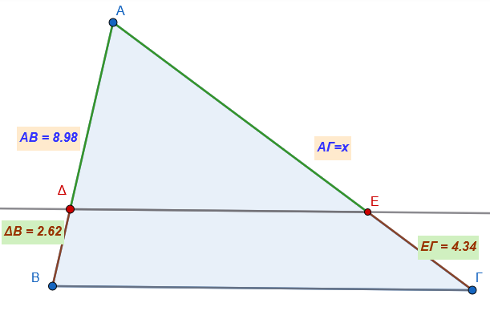
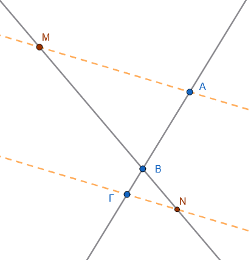
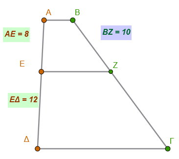
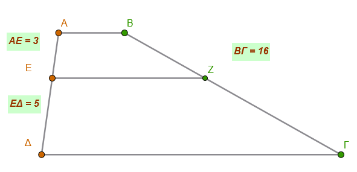
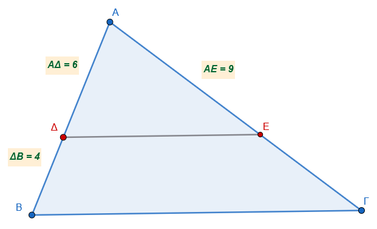
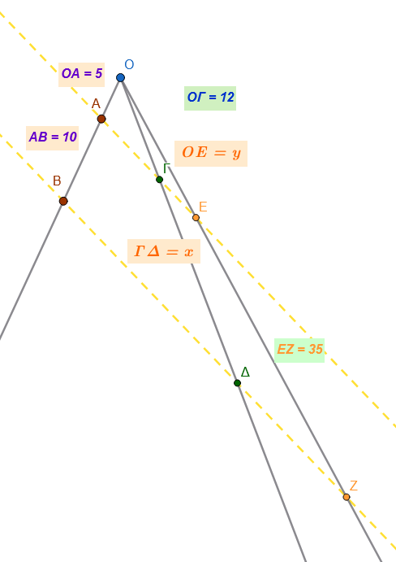
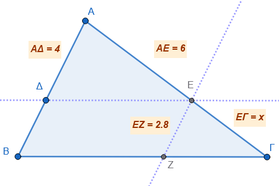

```{=html}
<!-- Φόρτωση βιβλιοθήκης GeoGebra -->
<script src="https://www.geogebra.org/apps/deployggb.js"></script>

<!-- Συνάρτηση δημιουργίας applets -->
<script>
function createGeoGebra(containerId, materialId, width = 700, height = 500) {
  var params = {
    "id": "ggb-" + containerId,
    "material_id": materialId,
    "width": width,
    "height": height,
    "showToolBar": true,
    "showMenuBar": false,
    "showAlgebraInput": true
  };
  
  var applet = new GGBApplet(params, '5.2');
  applet.inject(containerId);
}
</script>
```

## Θεώρημα του Θαλή

Το **Θεώρημα του Θαλή** αποτελεί θεμελιώδη πρόταση της Γεωμετρίας που αφορά την αναλογία τμημάτων τα οποία ορίζονται από παράλληλες ευθείες.

### **Θεωρία του Θεωρήματος**

:::: {style="background-color: #c98ba2; border: 2px solid #2f3e50; color: #25188a; padding: 15px; border-radius: 5px;"}
Σύμφωνα με το θεώρημα, **όταν τρεις ή περισσότερες παράλληλες ευθείες τέμνουν δύο άλλες τυχαίες ευθείες, τα τμήματα που ορίζονται πάνω στη μία ευθεία είναι ανάλογα προς τα αντίστοιχά τους πάνω στην άλλη**.

**Βασική Αναλογία:** Αν έχουμε παράλληλες ευθείες που τέμνουν δύο ευθείες $ε_1$ και $ε_2$ στα σημεία $A, B, Γ, Δ$ και $A', B', Γ', Δ'$ αντίστοιχα, τότε ισχύει η σχέση: $$\frac{AB}{A'B'} = \frac{\Gamma\Delta}{\Gamma'\Delta'} \quad \text{ή} \quad \frac{AB}{\Gamma\Delta} = \frac{A'B'}{\Gamma'\Delta'}$$

Επιπλέον, λόγω των ιδιοτήτων των αναλογιών, προκύπτει ότι οι λόγοι των τμημάτων είναι ίσοι: $$\frac{AB}{A'B'} = \frac{B\Gamma}{B'\Gamma'} = \frac{\Gamma\Delta}{\Gamma'\Delta'} = \frac{A\Gamma}{A'\Gamma'}=\frac{ΑΔ}{Α'Δ'}$$ {#eq-Θεώρημα του Θαλή}

<iframe src="https://www.geogebra.org/calculator/cmtvcegp?embed" width="730" height="600" allowfullscreen style="border: 1px solid #e4e4e4;border-radius: 4px;" frameborder="0">

</iframe>

::: {.callout-tip style="color:green;"}
Αλλάξτε την θέση των σημείων Α, Α', Β και Γ.
:::
::::

### **Εφαρμογές του Θεωρήματος**

- **Στο Τρίγωνο:** Εάν μια ευθεία τέμνει δύο πλευρές ενός τριγώνου (ή τις προεκτάσεις τους) και είναι **παράλληλη προς την τρίτη πλευρά**, τότε τις τέμνει σε μέρη ανάλογα.

$$\frac{AΔ}{ΑΕ}=\frac{ΔΒ}{ΕΓ}=\frac{ΑΒ}{ΑΓ}$$

από αυτή την ισότητα αν πάρουμε δύο οποιουσδήποτε ίσους λόγους και ενναλάξουμε μέσους άκρους ή αντιστρέψουμε τις αναλογίες κτλ.
μπορούμε να δημιουργήσουμε άλλους ίσους λόγους ή ισότητες .

$$\frac{AΔ}{ΑΕ}=\frac{ΔΒ}{ΕΓ}\Rightarrow\frac{AΔ}{ΔΒ}=\frac{ΑΕ}{ΕΓ}\Rightarrow\frac{ΕΓ}{ΔΒ}=\frac{ΑΕ}{ΑΔ} \Rightarrow AΔ\cdot EΓ=ΑΕ\cdotΔΒ$$

<iframe src="https://www.geogebra.org/calculator/j5mmg3qg?embed" width="730" height="600" allowfullscreen style="border: 1px solid #e4e4e4;border-radius: 4px;" frameborder="0">

</iframe>

::: {.callout-tip style="color:green;"}
Αλλάξτε την θέση των σημείων Α, Β Γ και Δ.
:::

### **Ειδικές Περιπτώσεις και Πορίσματα**

- **Τμήμα Μέσων Τριγώνου:** Το ευθύγραμμο τμήμα που ενώνει τα μέσα δύο πλευρών τριγώνου είναι **παράλληλο προς την τρίτη πλευρά και ίσο με το μισό της**.
- **Διαίρεση Τμήματος:** Το θεώρημα χρησιμοποιείται για τη διαίρεση ενός ευθύγραμμου τμήματος σε οποιοδήποτε πλήθος ίσων μερών.
- **Παράλληλες Ταινίες:** Εάν δύο ή περισσότερες παράλληλες ταινίες έχουν **ίσα πλάτη**, τότε περιέχουν ίσα τμήματα από κάθε τυχαία ευθεία που τις τέμνει.

### **Παραδείγματα**

**Υπολογισμός Τμημάτων σε Τρίγωνο:** Σε ένα τρίγωνο $AB\Gamma$, μία ευθεία $\epsilon$ παράλληλη στη βάση $B\Gamma$ τέμνει τις πλευρές $AB$ και $A\Gamma$ στα σημεία $\Delta$ και $E$.
Αν δίνονται τα μήκη ορισμένων τμημάτων, μπορούμε να υπολογίσουμε τα υπόλοιπα χρησιμοποιώντας την αναλογία $\dfrac{AΔ}{ΑΕ} = \dfrac{ΔΒ}{ΕΓ} = \dfrac{ΑΒ}{ΑΓ}$.

*Παράδειγμα στο παρακάτω τρίγωνο μπορούμε να υπολογίσουμε την πλευρά ΑΓ*

{width="364"}

Από την αναλογία $\dfrac{ΔΒ}{ΕΓ}=\dfrac{ΑΒ}{ΑΓ}$ έχουμε

$\dfrac{2,62}{4,34}=\dfrac{8,98}{x}\Rightarrow x\cdot2,62=4,34 \cdot 8,98 \Rightarrow x=\dfrac{38,973}{2,62}=14,875$

## Το **αντίστροφο του Θεωρήματος του Θαλή**

αποτελεί τη λογική αντιστροφή της βασικής πρότασης και χρησιμοποιείται κυρίως για να αποδειχθεί η παραλληλία ευθειών.

::: {style="background-color: #c98ba2; border: 2px solid #2f3e50; color: #25188a; padding: 15px; border-radius: 5px;"}
### **Διατύπωση του Αντιστρόφου**

- **Στο Τρίγωνο:** Εάν μια ευθεία τέμνει δύο πλευρές ενός τριγώνου (ή τις προεκτάσεις τους) και τις χωρίζει σε μέρη **ανάλογα**, τότε η ευθεία αυτή είναι **παράλληλη** προς την τρίτη πλευρά του τριγώνου.
  - *Συμβολικά:* Αν σε ένα τρίγωνο $ΑΒ\Gamma$, μια ευθεία τέμνει τις $ΑΒ$ και $Α\Gamma$ στα σημεία $Β'$ και $\Gamma'$ αντίστοιχα και ισχύει η αναλογία $\dfrac{ΑΒ'}{ΑΒ} = \dfrac{Α\Gamma'}{Α\Gamma}$, τότε η ευθεία $Β'\Gamma'$ είναι παράλληλη προς την $Β\Gamma$.
:::

### **Πώς Εφαρμόζεται**

Η εφαρμογή του αντιστρόφου είναι καθοριστική σε προβλήματα γεωμετρικής απόδειξης:

- **Απόδειξη Παραλληλίας:** Όταν θέλουμε να αποδείξουμε ότι μια ευθεία είναι παράλληλη προς τη βάση ενός τριγώνου, υπολογίζουμε τους λόγους των τμημάτων που ορίζει στις άλλες δύο πλευρές. Αν οι λόγοι αυτοί βρεθούν ίσοι, τότε οι ευθείες είναι παράλληλες.

### **Παράδειγμα Εφαρμογής**

Έστω τρίγωνο $ΑΒ\Gamma$ με πλευρές $ΑΒ=6$ και $Α\Gamma=12$.
Αν πάρουμε σημείο $Δ$ πάνω στην $ΑΒ$ τέτοιο ώστε $ΑΔ=2$ και σημείο $Ε$ πάνω στην $Α\Gamma$ τέτοιο ώστε $ΑΕ=4$, τότε: $$\frac{ΑΔ}{ΑΒ} = \frac{2}{6} = \frac{1}{3} \quad \text{και} \quad \frac{ΑΕ}{Α\Gamma} = \frac{4}{12} = \frac{1}{3}$$ Εφόσον οι λόγοι είναι ίσοι $\left(\dfrac{1}{3}\right)$, σύμφωνα με το αντίστροφο του θεωρήματος του Θαλή, η ευθεία $ΔΕ$ είναι παράλληλη προς την πλευρά $Β\Gamma$.

------------------------------------------------------------------------

## Ασκήσεις

1.  **Αναλογία σε παράλληλες ευθείες:** Τρεις παράλληλες ευθείες $\epsilon_1, \epsilon_2, \epsilon_3$ τέμνουν δύο τυχαίες ευθείες $x$ και $y$ στα σημεία $A, B, \Gamma$ και $A', B', \Gamma'$ αντίστοιχα. Αν τα τμήματα πάνω στην ευθεία $x$ είναι $AB = 4$ και $B\Gamma = 6$, και το αντίστοιχο τμήμα στην $y$ είναι $A'B' = 2$, υπολογίστε το μήκος του τμήματος $B'\Gamma'$.

> *Κάντε το σχήμα*

2.  **Διαίρεση τμήματος σε ίσα μέρη:** Χρησιμοποιώντας το θεώρημα του Θαλή, περιγράψτε τη γεωμετρική κατασκευή για να χωρίσετε ένα ευθύγραμμο τμήμα $AB$ μήκους $7$ cm σε **3 ίσα μέρη**.
3.  **Σχέσεις τμημάτων σε τέμνουσες:** Τέσσερις παράλληλες ευθείες $\alpha, \beta, \gamma, \delta$ τέμνουν δύο ευθείες $\epsilon$ και $\epsilon'$. Αν στην $\epsilon$ ισχύει ότι $AB/B\Gamma = 1/2$ και $B\Gamma/\Gamma\Delta = 2/3$, να βρεθούν οι λόγοι $A'B'/B'\Gamma'$ και $B'\Gamma'/\Gamma'\Delta'$ στην ευθεία $\epsilon'$.

> *Κάντε το σχήμα*

4.  **Εφαρμογή σε Τρίγωνο (εύρεση τμήματος):** Σε τρίγωνο $ΑΒΓ$, μια ευθεία παράλληλη προς την πλευρά $ΒΓ$ τέμνει τις πλευρές $ΑΒ$ και $ΑΓ$ στα σημεία $Δ$ και $Ε$. Αν $ΑΔ = 5$, $ΔΒ = 3$ και $ΑΕ = 10$, υπολογίστε το μήκος του $ΕΓ$.

> *Κάντε το σχήμα*

5.  **Υπολογισμός πλευράς τριγώνου:** Σε τρίγωνο $ΑΒΓ$ με $ΑΒ = 6$ και $ΑΓ = 12$, παίρνουμε σημείο $Δ$ πάνω στην $ΑΒ$ ώστε $ΑΔ = 2$. Από το $Δ$ φέρνουμε παράλληλη προς τη $ΒΓ$ που τέμνει την $ΑΓ$ στο $Ε$. Βρείτε το μήκος του $ΑΕ$.

> *Κάντε το σχήμα*

6.  **Λόγος τμημάτων σε τραπέζιο:** Σε τραπέζιο $ΑΒΓΔ$, μια ευθεία $ΕΖ$ παράλληλη προς τις βάσεις τέμνει τις πλευρές $ΑΔ$ και $ΒΓ$ στα $Ε$ και $Ζ$. Αν $ΑΕ/ΕΔ = 3/4$, βρείτε τον λόγο $ΒΖ/ΖΓ$.

> *Κάντε το σχήμα*

7.  **Υπολογισμός σε χιλιοστά:** Σε τρίγωνο $ΑΒΓ$, $ΑΒ = 5$ cm και $ΑΓ = 7$ cm. Παίρνουμε τμήμα $ΑΔ = 35$ mm πάνω στην $ΑΒ$ και φέρνουμε $ΔΕ // ΒΓ$. Υπολογίστε σε εκατοστά το τμήμα $ΕΓ$.

> *Κάντε το σχήμα*

8.  **Αντίστροφο Θεωρήματος Θαλή:** Σε τρίγωνο $ΑΒΓ$ με $ΑΒ = 6$ και $ΑΓ = 9$, παίρνουμε σημεία $Δ$ στην $ΑΒ$ και $Ε$ στην $ΑΓ$ τέτοια ώστε $ΑΔ = 4$ και $ΑΕ = 6$. Εξετάστε αν η ευθεία $ΔΕ$ είναι παράλληλη προς τη $ΒΓ$.

> *Κάντε το σχήμα*

9.  **Αναλογίες σε συγκλίνουσες ευθείες:** Σε μια ευθεία $x'x$ υπάρχουν τρία σημεία $Α, Β, Γ$ τέτοια ώστε $ΑΒ = 3 \cdot ΒΓ$.
    Από τα $Α$ και $Γ$ φέρνουμε παράλληλες ευθείες που τέμνουν μια άλλη ευθεία $y$ (που διέρχεται από το $Β$) στα $Μ$ και $Ν$.
    Βρείτε τους λόγους $ΜΒ/ΒΝ$ και $ΒΝ/ΜΝ$.\
    {width="288"}

10. **Λόγοι σε τέμνουσες:** Τρεις παράλληλες ευθείες τέμνουν δύο ευθείες στα σημεία $Α, Β, Γ$ και $A', B', \Gamma'$.
    Αν $ΑΒ = 2$ και $ΒΓ = 3$, υπολογίστε τον λόγο $A'B'/A'\Gamma'$.

11. **Κατασκευή τέταρτης αναλόγου:** Δίνονται τρία τμήματα $\alpha, \beta, \gamma$.
    Περιγράψτε πώς θα κατασκευάσετε ένα τέταρτο τμήμα $x$ ώστε να ισχύει η αναλογία $\alpha/\beta = \gamma/x$.

    **Λύση** Για την κατασκευή της **τέταρτης αναλόγου** ενός τμήματος $x$ που να ικανοποιεί την αναλογία $\dfrac{\alpha}{\beta} = \dfrac{\gamma}{x}$, η γεωμετρική λύση βασίζεται στο **Θεώρημα του Θαλή** και ακολουθεί τα εξής βήματα:

    1.  **Σχεδιασμός Γωνίας:** Κατασκευάζουμε μια τυχαία κυρτή γωνία $\angle(Ox, Oy)$.
    2.  **Τοποθέτηση Τμημάτων στην πρώτη πλευρά:** Πάνω στην πλευρά $Ox$ της γωνίας, παίρνουμε με τον διαβήτη δύο **διαδοχικά** ευθύγραμμα τμήματα, το $OA = \alpha$ και το $AB = \beta$.
    3.  **Τοποθέτηση Τμήματος στη δεύτερη πλευρά:** Πάνω στην άλλη πλευρά της γωνίας, την $Oy$, παίρνουμε ένα τμήμα $O\Gamma = \gamma$.
    4.  **Σύνδεση Σημείων:** Ενώνουμε το σημείο $A$ με το σημείο $\Gamma$, σχηματίζοντας το ευθύγραμμο τμήμα $A\Gamma$.
    5.  **Κατασκευή Παραλλήλου:** Από το σημείο $B$ (το τέλος του δεύτερου τμήματος στην πρώτη πλευρά), φέρνουμε μια **ευθεία παράλληλη** προς το τμήμα $A\Gamma$.
    6.  **Προσδιορισμός της Αναλόγου:** Η παράλληλη αυτή ευθεία θα τέμνει την πλευρά $Oy$ (ή την προέκτασή της) σε ένα σημείο $\Delta$.
    7.  **Αποτέλεσμα:** Σύμφωνα με το Θεώρημα του Θαλή, τα τμήματα που ορίζονται πάνω στις πλευρές της γωνίας είναι ανάλογα. Ισχύει δηλαδή η σχέση: $$\frac{OA}{AB} = \frac{O\Gamma}{\Gamma\Delta} \Rightarrow \frac{\alpha}{\beta} = \frac{\gamma}{\Gamma\Delta}$$ Συνεπώς, το ζητούμενο τμήμα $x$ είναι το τμήμα $\Gamma\Delta$.

**Ορισμός:** Ο αριθμός $x$ ονομάζεται **τέταρτος ανάλογος** των τμημάτων $\alpha, \beta, \gamma$ και είναι ο μοναδικός αριθμός που επαληθεύει την εξίσωση $\alpha \cdot x = \beta \cdot \gamma$.

> *Κάντε την κατασκευή σύμφωνα με τις οδηγίες*

12. **Σχέση τμημάτων πλευρών:** Σε τρίγωνο $ΑΒΓ$ με $ΑΒ = 10$, αν μια παράλληλη προς τη βάση $ΒΓ$ ορίζει τμήμα $ΑΔ = 4$ και η πλευρά $ΑΓ$ είναι $15$, βρείτε το μήκος του $ΑΕ$.

13. **Διαίρεση σε 7 μέρη:** Χωρίστε ένα ευθύγραμμο τμήμα $AB = 53$ mm σε **7 ίσα μέρη** με τη μέθοδο των παραλλήλων ευθειών.

14. **Παράλληλες ταινίες:** Αν δύο παράλληλες ταινίες έχουν **ίσα πλάτη**, αποδείξτε ότι περιέχουν ίσα τμήματα από κάθε τυχαία ευθεία που τις τέμνει.

Ορίστε παρόμοιες ασκήσεις για κάθε μία της εικόνας, με αλλαγμένα δεδομένα ώστε να εξασκηθείτε στις ίδιες μεθόδους.

15. Στο τραπέζιο ΑΒΓΔ το ΕΖ είναι παράλληλο στις βάσεις. Αν ΑΕ=8, ΕΔ=12 και ΒΖ=10, να υπολογίσετε το τμήμα ΖΓ.\
    {width="306"}

> *(Υπόδειξη:* $\frac{AE}{E\Delta} = \frac{BZ}{Z\Gamma}$)

16. Στο τραπέζιο ΑΒΓΔ το ΕΖ είναι παράλληλο στις βάσεις. Αν ΑΕ=3, ΕΔ=5 και το συνολικό τμήμα ΒΓ=16, να υπολογίσετε τα ΒΖ και ΖΓ.\

{width="446"}


> *(Υπόδειξη:* $\frac{BZ}{Z\Gamma} = \frac{3}{5}$ και $BZ+Z\Gamma=16$)

17. Στο τρίγωνο ΑΒΓ είναι ΔΕ // ΒΓ.
    Αν ΑΔ=6, ΔΒ=4 και ΑΕ=9, να υπολογίσετε το x = ΕΓ\
    {width="460"}\


> *(Υπόδειξη:* $\frac{A\Delta}{\Delta B} = \frac{AE}{E\Gamma}$)

18. Στο σχήμα με τις παράλληλες $\epsilon_1, \epsilon_2$ και τέμνουσες που διέρχονται από το Ο, δίνονται: ΟΑ=5, ΑΒ=10, ΟΓ=12 και ΕΖ=35.
    Να υπολογίσετε το τμήμα ΓΔ και το τμήμα ΟΕ.\

    {width="394"}
    

> *(Υπόδειξη:* $\frac{OA}{AB} = \frac{O\Gamma}{\Gamma\Delta}$)

19. Στο τρίγωνο ΑΒΓ είναι ΔΕ // ΒΓ και ΕΖ // ΑΒ.
    Αν ΑΕ=6, AΔ=4 και ΕΖ=2,8, να υπολογίσετε το μήκος της ΕΓ.

    
    
    
> *Υπόδειξη : Το ΔΕΖΒ είναι παραλληλόγραμμο*


------------------------------------------------------------------------

$$\bbox[yellow, 5px]{\color{blue}\Large\text{---}}$$

::: {.callout-tip style="color: brown;"}
:::

::: {style="background-color: #d3deb8; border: 2px solid #2f3e50; color: #25188a; padding: 15px; border-radius: 5px;"}
:::

::: {.callout-tip style="color: brown;"}
ΚΑΛΗ ΜΕΛΕΤΗ!
:::

\
\
