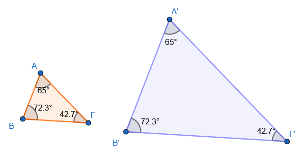
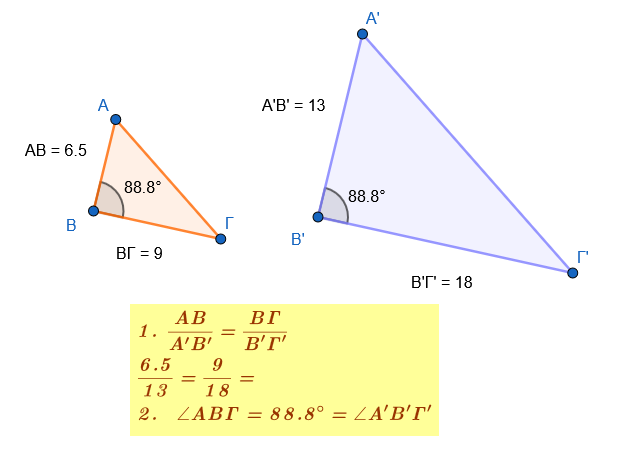
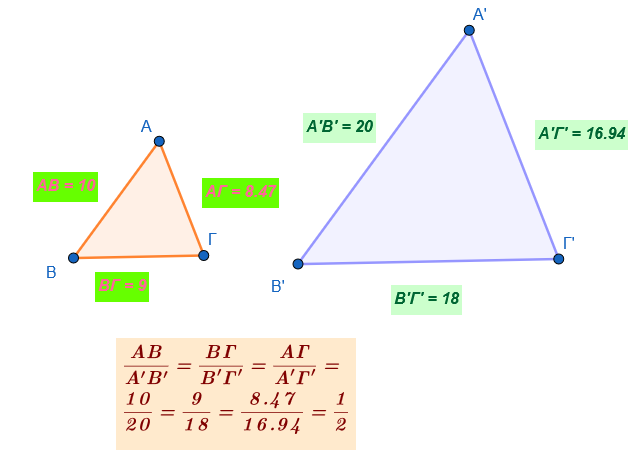
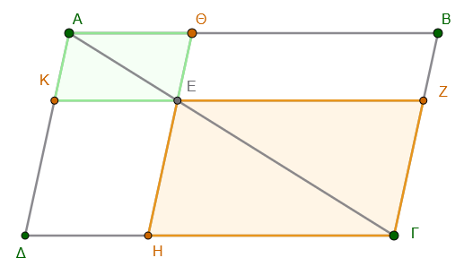
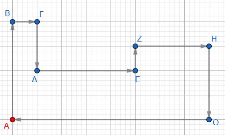
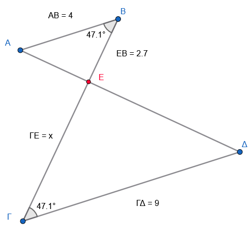
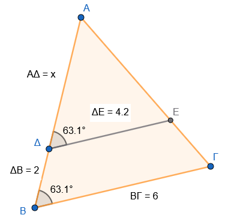
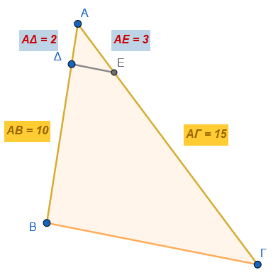
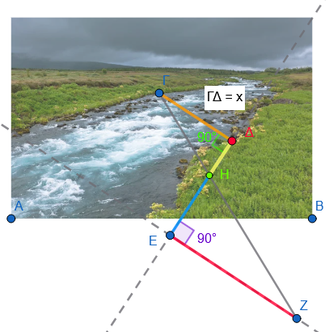
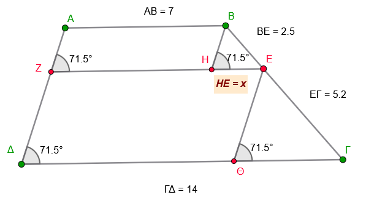

```{=html}
<!-- Φόρτωση βιβλιοθήκης GeoGebra -->
<script src="https://www.geogebra.org/apps/deployggb.js"></script>

<!-- Συνάρτηση δημιουργίας applets -->
<script>
function createGeoGebra(containerId, materialId, width = 700, height = 500) {
  var params = {
    "id": "ggb-" + containerId,
    "material_id": materialId,
    "width": width,
    "height": height,
    "showToolBar": true,
    "showMenuBar": false,
    "showAlgebraInput": true
  };
  
  var applet = new GGBApplet(params, '5.2');
  applet.inject(containerId);
}
</script>
```

## Ομοιότητα

Η **ομοιότητα** είναι μια θεμελιώδης έννοια της Γεωμετρίας που βασίζεται στον γεωμετρικό μετασχηματισμό της ομοιοθεσίας.

::: {style="background-color: #c98ba2; border: 2px solid #2f3e50; color: #25188a; padding: 15px; border-radius: 5px;"}
**Ορισμός Ομοιότητας**

Δύο σχήματα (επίπεδα ή στερεά) ονομάζονται **όμοια** όταν το ένα είναι ή μπορεί να γίνει, με κατάλληλη μετατόπιση, **ομοιόθετο** του άλλου.
Η ομοιότητα αποτελεί μια **σχέση ισοδυναμίας** στο σύνολο των γεωμετρικών σχημάτων, καθώς κατέχει την ανακλαστική, τη συμμετρική και τη μεταβατική ιδιότητα.

**Λόγος Ομοιότητας και Κλίμακα**

- **Λόγος ομοιότητας (**$\lambda$): Είναι ο σταθερός λόγος των αποστάσεων δύο οποιωνδήποτε σημείων του ενός σχήματος προς την απόσταση των αντίστοιχων (ομολόγων) σημείων του άλλου. Αν ο λόγος $\lambda$ είναι διάφορος της μονάδας ($\lambda \neq 1$), το ένα σχήμα αποτελεί **μεγέθυνση** ή **σμίκρυνση** του άλλου.
- **Κλίμακα:** Στη σχεδίαση (π.χ. χάρτες, αρχιτεκτονικά σχέδια), ο λόγος ομοιότητας ονομάζεται **αριθμητική κλίμακα**. Εκφράζει τη σχέση της απόστασης δύο σημείων πάνω στο σχέδιο προς την πραγματική τους απόσταση. Συνήθεις κλίμακες είναι οι $1:10, 1:100, 1:1000$ κ.λπ..

**Όμοια Πολύγωνα**

Δύο πολύγωνα (με τέσσερις ή περισσότερες πλευρές) είναι όμοια όταν συντρέχουν **ταυτόχρονα** δύο προϋποθέσεις:

1.  Οι αντίστοιχες (ομόλογες) **γωνίες** τους είναι **ίσες** μία προς μία.
2.  Οι αντίστοιχες (ομόλογες) **πλευρές** τους είναι **ανάλογες**.

<iframe src="https://www.geogebra.org/calculator/tkrjrpxx?embed" width="730" height="700" allowfullscreen style="border: 1px solid #e4e4e4;border-radius: 4px;" frameborder="0">

</iframe>

> Μετακινήστε τα σημεία Α, Β, Γ, Δ, Ε ή Ζ.
> Δείτε τι γίνεται με τις γωνίες ή τους λόγους.
> Αλλάξτε το λ.
> Τι συμβαίνει;

**Παράδειγμα:** Όλα τα **κανονικά πολύγωνα** (π.χ. τετράγωνα, ισόπλευρα τρίγωνα) που έχουν τον ίδιο αριθμό πλευρών είναι πάντα μεταξύ τους όμοια.
Αντιθέτως, ένα τετράγωνο και ένας ρόμβος δεν είναι όμοια, διότι παρόλο που έχουν ανάλογες πλευρές, δεν έχουν ίσες γωνίες.

**Όμοια Τρίγωνα**

Στα τρίγωνα, οι απαιτήσεις για την ομοιότητα είναι περιορισμένες σε σχέση με τα υπόλοιπα πολύγωνα.
Δύο τρίγωνα είναι όμοια αν ικανοποιούν ένα από τα εξής **κριτήρια ομοιότητας**:

1.  **Κριτήριο Γωνιών:** Έχουν τις γωνίες τους ίσες μία προς μία (ή απλώς δύο γωνίες ίσες, καθώς η τρίτη θα είναι αναγκαστικά ίση).\
    {width="422"}

> Τότε και οι ομόλογες πλευρές τους θα είναι ανάλογες.

2.  **Κριτήριο δύο πλευρών και περιεχόμενης γωνίας:** Έχουν δύο πλευρές ανάλογες και τις γωνίες που περιέχονται σε αυτές ίσες.\
    {width="410"}

> Τότε και η άλλες ομόλογες πλευρές θα είναι ανάλογες με τον ίδιο λόγο και οι άλλες ομόλογες γωνίες θα είναι ίσες.

3.  **Κριτήριο τριών πλευρών:** Έχουν και τις τρεις πλευρές τους ανάλογες.\

    \
    {width="417"}

> Τότε και οι ομόλογες γωνίες τους θα είναι ίσες.

**Ειδικές περιπτώσεις:**

- Δύο **ορθογώνια τρίγωνα** είναι όμοια αν έχουν μία οξεία γωνία ίση ή τις κάθετες πλευρές τους ανάλογες.
- Όλα τα **ισόπλευρα τρίγωνα** είναι όμοια μεταξύ τους.

**Ιδιότητες Ομοίων Σχημάτων**

$$\bbox[yellow, 5px]{\color{blue}\Large\text{Αναλυτικά σε επόμενη ενότητα}}$$

- **Περίμετρος:** Ο λόγος των περιμέτρων δύο όμοιων πολυγώνων είναι ίσος με το λόγο ομοιότητας $\lambda$.
- **Εμβαδόν:** Ο λόγος των εμβαδών δύο όμοιων σχημάτων είναι ίσος με το **τετράγωνο** του λόγου ομοιότητας ($\lambda^2$).
- **Όγκος:** Ο λόγος των όγκων δύο όμοιων στερεών είναι ίσος με τον **κύβο** του λόγου ομοιότητας ($\lambda^3$).
- **Δευτερεύοντα στοιχεία:** Σε όμοια τρίγωνα, τα ομόλογα ύψη, οι διάμεσοι και οι διχοτόμοι έχουν τον ίδιο λόγο με το λόγο ομοιότητας $\lambda$.
:::

------------------------------------------------------------------------

## Ασκήσεις

1.  **Κριτήριο Γωνιών (Τρίγωνα):** Δύο τρίγωνα ΑΒΓ και Α'Β'Γ' έχουν τις γωνίες τους ίσες μία προς μία. Εξηγήστε με βάση τη θεωρία αν τα τρίγωνα αυτά είναι οπωσδήποτε όμοια.

> Τοποθετήστε την $\hat A$ πάνω στην $\hat A'$ έτσι ώστε τα στοιχεία τους να συμπέσουν.
> Κάντε το σχήμα.
> Τότε η ΒΓ θα είναι .............

2.  **Ομοιότητα Ορθογωνίων Τριγώνων:** Αν δύο ορθογώνια τρίγωνα έχουν μία οξεία γωνία τους ίση, είναι όμοια; Αιτιολογήστε την απάντησή σας.

> Τότε και η άλλη ογεία γωνία τους θα ...........................
> ως συμπληρωματική ............

3.  **Κριτήριο Πλευρών (Τρίγωνα):** Δύο τρίγωνα έχουν και τις τρεις πλευρές τους ανάλογες.
    Τι συμπεραίνετε για τη σχέση ομοιότητάς τους και για τις αντίστοιχες γωνίες τους;

4.  **Ισόπλευρα Τρίγωνα:** Γιατί όλα τα ισόπλευρα τρίγωνα θεωρούνται όμοια μεταξύ τους;.

5.  **Κανονικά Πολύγωνα:** Εξηγήστε γιατί δύο κανονικά εξάγωνα (ή οποιαδήποτε δύο κανονικά πολύγωνα με τον ίδιο αριθμό πλευρών) είναι πάντα όμοια μεταξύ τους.

> Τα κανονικά σχήματα έχουν όλες τις πλευρές τους και όλες τις γωνίες τους .........
> άρα οι λόγοι των όμόλογων πλευρών .............................

6.  **Ορισμός Λόγου Ομοιότητας:** Τι ονομάζουμε λόγο ομοιότητας λ δύο ομοίων σχημάτων και τι εκφράζει αυτός για τις αποστάσεις των ομολόγων σημείων τους;

7.  **Μεγέθυνση και Σμίκρυνση:** Αν ο λόγος ομοιότητας λ δύο σχημάτων είναι λ \> 1, τι είδους μετασχηματισμό έχουμε (μεγέθυνση ή σμίκρυνση); Τι συμβαίνει αν 0 \< λ \< 1;.

8.  **Ομόλογες Γωνίες:** Ποια είναι η σχέση μεταξύ των ομολόγων γωνιών δύο οποιωνδήποτε ομοίων σχημάτων;.

9.  **Έννοια Κλίμακας:** Ορίστε την έννοια της αριθμητικής κλίμακας σε ένα γεωγραφικό χάρτη ή αρχιτεκτονικό σχέδιο.

10. **Υπολογισμός Κλίμακας:** Σε έναν χάρτη, μια πραγματική απόσταση 7,2 km αναπαριστάται με τμήμα 48 mm. Ποια είναι η αριθμητική κλίμακα του χάρτη;.

11. **Διατήρηση Σχήματος:** Στην πρόσοψη ενός σπιτιού που σχεδιάζεται υπό κλίμακα 1:200, παραμένουν οι γωνίες ίσες με τις πραγματικές; Τι συμβαίνει με τα μήκη των πλευρών;.

12. **Ομοιότητα Παραλληλεπιπέδων:** Πότε δύο ορθογώνια παραλληλεπίπεδα θεωρούνται όμοια;

> Αναφερθείτε στη σχέση των διαστάσεών τους.

13. **Ομοιότητα Κυλίνδρων:** Δύο ορθοί κυκλικοί κύλινδροι με ύψη $h, h'$ και ακτίνες $R, R'$ είναι όμοιοι όταν ισχύει ποια αναλογία;.
14. **Ομοιότητα Σφαιρών:** Είναι όλες οι σφαίρες μεταξύ τους όμοιες; Ποιος είναι ο λόγος ομοιότητάς τους;.
15. **Δευτερεύοντα Στοιχεία Τριγώνων:** Αν δύο τρίγωνα είναι όμοια με λόγο λ, ποιος είναι ο λόγος των ομολόγων υψών, διαμέσων και διχοτόμων τους;.
16. **Έλεγχος Ομοιότητας Τριγώνων:** Ένα τρίγωνο ΑΒΓ έχει πλευρές 3cm, 5cm, 6cm και ένα τρίγωνο ΚΛΜ έχει πλευρές 4,5cm, 7,5cm, 9cm. Εξετάστε αν είναι όμοια και προσδιορίστε τον λόγο ομοιότητας.
17. **Ομοιότητα Ρόμβων:** Δύο ρόμβοι ΑΒΓΔ και Α'Β'Γ'Δ' έχουν γωνίες $\hat{A}=65^\circ$ και $\hat{B'}=115^\circ$. Αποδείξτε ότι είναι όμοιοι.

------------------------------------------------------------------------

### ... Και μερικές ακόμη

1.  Να χαρακτηρίσετε τις παρακάτω προτάσεις ως Σωστές $(\Sigma)$ ή Λανθασμένες $(\Lambda)$:

- α) Δύο οποιαδήποτε ισόπλευρα τρίγωνα είναι όμοια μεταξύ τους. $\square$
- β) Δύο ορθογώνια τρίγωνα είναι πάντα όμοια. $\square$
- γ) Αν δύο πολύγωνα έχουν όλες τις γωνίες τους ίσες μία προς μία, τότε είναι οπωσδήποτε όμοια. $\square$
- δ) Δύο κύκλοι είναι πάντα σχήματα όμοια. $\square$
- ε) Αν δύο σχήματα έχουν τον ίδιο αριθμό πλευρών, τότε είναι όμοια. $\square$
- στ) Δύο κανονικά εξάγωνα είναι πάντα όμοια. $\square$

2.  Παρακάτω δίνονται οι διαστάσεις τεσσάρων ορθογωνίων. Ποια από αυτά είναι όμοια μεταξύ τους;

- **Ορθογώνιο Α:** Μήκος $2$ μονάδες, Πλάτος $3$ μονάδες.
- **Ορθογώνιο Β:** Μήκος $4$ μονάδες, Πλάτος $5$ μονάδες.
- **Ορθογώνιο Γ:** Μήκος $6$ μονάδες, Πλάτος $9$ μονάδες.
- **Ορθογώνιο Δ:** Μήκος $1$ μονάδα, Πλάτος $1,5$ μονάδα.

> *(Συμβουλή: Έλεγξε αν ο λόγος των πλευρών τους είναι ο ίδιος).*

3.  Έχουμε τρία ορθογώνια $K_1, K_2, K_3$ με τις εξής διαστάσεις:

| Ορθογώνιο | Μήκος      | Πλάτος     |
|:----------|:-----------|:-----------|
| $K_1$     | $4$ cm     | $6$ cm     |
| $K_2$     | $8$ cm     | $.....$ cm |
| $K_3$     | $.....$ cm | $14$ cm    |

Συμπλήρωσε τον πίνακα ώστε τα ορθογώνια να είναι όμοια.

4.  Έστω δύο όμοια τετράπλευρα $PQRS$ και $P'Q'R'S'$. Γνωρίζουμε ότι:

- Η πλευρά $PQ = 5$ cm.
- Η αντίστοιχη πλευρά $P'Q' = 15$ cm.
- Η γωνία $\hat{Q} = 85^{\circ}$.
- Η πλευρά $R'S' = 21$ cm.

**Αφού κάνετε το σχήμα να συμπληρώσετε τα κενά:**

- α) Ο λόγος ομοιότητας του $PQRS$ προς το $P'Q'R'S'$ είναι $\lambda_1 = \dots\dots$
- β) Ο λόγος ομοιότητας του $P'Q'R'S'$ προς το $PQRS$ είναι $\lambda_2 = \dots\dots$
- γ) Η γωνία $\hat{Q}'$ του δεύτερου σχήματος είναι $\dots\dots$ μοίρες.
- δ) Ο λόγος των περιμέτρων των δύο σχημάτων $\dfrac{\Pi'}{\Pi}$ είναι ίσος με $\dots\dots$
- ε) Η πλευρά $RS$ του πρώτου σχήματος είναι ίση με $\dots\dots$ cm.

5.  Εξετάστε αν τα παρακάτω ζεύγη παραλληλογράμμων είναι όμοια:

- **α)** Ένα ορθογώνιο $AΒΓΔ$ με πλευρές $8 \text{ cm}$ και $4 \text{ cm}$, και ένα ορθογώνιο $EZHK$ με πλευρές $10 \text{ cm}$ και $5 \text{ cm}$.

- **β)** Ένα παραλληλόγραμμο $P_1$ με πλευρές $5 \text{ cm}$, $10 \text{ cm}$ και μια γωνία $60^{\circ}$, και ένα παραλληλόγραμμο $P_2$ με πλευρές $10 \text{ cm}$, $20 \text{ cm}$ και μια γωνία $120^{\circ}$.

> *(Συμβουλή: Κάντε το σχήμα. Θυμήσου ότι σε ένα παραλληλόγραμμο οι διαδοχικές γωνίες είναι παραπληρωματικές).*

6.  Αν τα παρακάτω ζεύγη τετραπλεύρων είναι όμοια, να βρείτε την τιμή του $x$:

- **α)** Ένα τραπέζιο με πλευρές $12 \text{ cm}$ και $15 \text{ cm}$ είναι όμοιο με ένα μικρότερο τραπέζιο που έχει την αντίστοιχη πλευρά της πρώτης ίση με $4 \text{ cm}$ και την άλλη πλευρά ίση με $x$.

- **β)** Δύο όμοια τετράπλευρα έχουν λόγο ομοιότητας $\lambda = \dfrac{2}{3}$.
  Αν μια πλευρά του μεγάλου σχήματος είναι $18 \text{ cm}$, πόσο είναι η αντίστοιχη πλευρά $x$ του μικρού σχήματος;

7.  Ένα ορθογώνιο έχει διαστάσεις $30 \text{ cm}$ και $20 \text{ cm}$.
    Ένας γραφίστας θέλει να το σμικρύνει έτσι ώστε η μεγάλη πλευρά να γίνει $15 \text{ cm}$.
    Σκέφτεται να αφαιρέσει $15 \text{ cm}$ και από τη μικρή πλευρά (δηλαδή να γίνει $5 \text{ cm}$).
    **Ερώτηση:** Θα είναι το νέο ορθογώνιο όμοιο με το αρχικό; Αιτιολογήστε την απάντησή σας με υπολογισμούς.

8.  Σε ένα τυχαίο τετράπλευρο $ABΓΔ$, παίρνουμε τα μέσα $M, N, P, Q$ των πλευρών $AB, BΓ, ΓΔ, ΔA$ αντίστοιχα.

    Να αποδείξετε ότι το τετράπλευρο $MNPQ$ (που ονομάζεται παραλληλόγραμμο του Varignon) έχει πλευρές ανάλογες προς τις διαγωνίους του αρχικού τετραπλεύρου $ABΓΔ$.

> Κάντε το σχήμα.
> Σκεφτείτε ότι τα Μ και Ν συνδέουν τα μέσα των πλευρών ΑΒ και ΑΔ Άρα το MQ θα είναι παράλληλο και ίσο με ................

9.  Στο παρακάτω παραλληλόγραμμο $ABΓΔ$, παίρνουμε ένα σημείο $E$ πάνω στη διαγώνιο $AΓ$ τέτοιο ώστε $AE = \dfrac{1}{3} AΓ$.
    Από το $E$ φέρνουμε παράλληλες ΚΖ και ΘΗ προς τις πλευρές $AB$ και $AΔ$.

    **Να αποδείξετε ότι:**

- **α)** Το παραλληλόγραμμο $AΚΕΘ$ είναι όμοιο με το αρχικό $ABΓΔ$.

- **β)** Το παραλληλόγραμμο $ΕΗΓΖ$ είναι όμοιο με το αρχικό $ΑΒΓΔ$.

- **γ)** Το $ΑΚΕΘ$ είναι όμοιο με το $ΕΗΓΖ$

- **δ)** Ποιος είναι ο λόγος ομοιότητάς $\dfrac{AKΕΘ}{ΑΒΓΔ}$

- **ε)** Ποιος είναι ο λόγος ομοιότητάς $\dfrac{ΕΗΓΖ}{ΑΒΓΔ}$

- **στ)** Ποιος είναι ο λόγος ομοιότητάς $\dfrac{AKΕΘ}{ΕΗΓΖ}$

  \
  {width="405"}

10. Ένα μυρμήγκι περπατάει πάνω στο περίγραμμα ενός σχήματος σε ένα τετραγωνισμένο χαρτί (όπως αυτό της παρακάτω εικόνας). Η διαδρομή του στο χαρτί αποτελείται από $26$ πλευρές τετραγώνων. Αν κάθε πλευρά τετραγώνου στο χαρτί είναι $0,5 \text{ cm}$ και η πραγματική απόσταση που διένυσε το μυρμήγκι στην αυλή είναι $52 \text{ μέτρα}$:
    - Ποιο είναι το συνολικό μήκος της διαδρομής πάνω στο χαρτί σε εκατοστά;
    - Ποια είναι η κλίμακα του σχεδίου; (Λόγος: $\dfrac{\text{μήκος σχεδίου}}{\text{πραγματικό μήκος}}$).

> Ξεκινάει από το Α και καταλήγει στο Α όπως δείχνουν τα βέλη\
> 

12. Ποια από τα παρακάτω ζεύγη τριγώνων είναι όμοια;

- **α)** Τρίγωνο $A$ με γωνίες $40^{\circ}$ και $70^{\circ}$, και τρίγωνο $B$ με γωνίες $70^{\circ}$ και $70^{\circ}$.
- **β)** Τρίγωνο $\Gamma$ με γωνίες $35^{\circ}$ και $100^{\circ}$, και τρίγωνο $\Delta$ με γωνίες $35^{\circ}$ και $45^{\circ}$.
- **γ)** Δύο ορθογώνια τρίγωνα που το ένα έχει μια οξεία γωνία $25^{\circ}$ και το άλλο έχει μια οξεία γωνία $65^{\circ}$.

*(Συμβουλή: Υπολόγισε την τρίτη γωνία κάθε τριγώνου χρησιμοποιώντας το άθροισμα* $180^{\circ}$).

13. Δίνονται δύο ισοσκελή τρίγωνα $ABΓ$ (με $AB=AΓ$) και $\Delta EZ$ (με $\Delta E = \Delta Z$).

- Στο τρίγωνο $ABΓ$, η γωνία της κορυφής $\hat{A}$ είναι $40^{\circ}$.
- Στο τρίγωνο $\Delta EZ$, μια γωνία της βάσης $\hat{E}$ είναι $70^{\circ}$.

**Ερώτηση:** Να εξηγήσετε γιατί τα δύο αυτά τρίγωνα είναι όμοια.

> Κάντε το σχήμα.

14. Έστω δύο όμοια τρίγωνα $KLM$ και $XYZ$ με τις εξής αντιστοιχίες γωνιών: $\hat{K} = \hat{X}$, $\hat{L} = \hat{Y}$ και $\hat{M} = \hat{Z}$. **Να συμπληρώσετε τους ίσους λόγους των πλευρών:**

$$\frac{KL}{\dots} = \frac{\dots}{YZ} = \frac{KM}{\dots}$$

15. Να χαρακτηρίσετε τις παρακάτω προτάσεις ως Σωστές $(\Sigma)$ ή Λανθασμένες $(\Lambda)$:

- α) Δύο ορθογώνια και ισοσκελή τρίγωνα είναι πάντα όμοια. $\square$
- β) Αν δύο τρίγωνα έχουν δύο γωνίες ίσες μία προς μία, τότε είναι όμοια. $\square$
- γ) Δύο ισόπλευρα τρίγωνα με διαφορετικές πλευρές δεν είναι όμοια. $\square$
- δ) Αν δύο τρίγωνα είναι όμοια, τότε είναι οπωσδήποτε και ίσα. $\square$
- ε) Ο λόγος των υψών δύο ομοίων τριγώνων είναι ίσος με τον λόγο ομοιότητάς τους. $\square$

16. Δίνεται ένα ορθογώνιο $ABΓΔ$. Φέρνουμε τη διαγώνιο $AΓ$ και από την κορυφή $B$ φέρνουμε κάθετη $BE$ πάνω στη διαγώνιο.

- α) Να εξηγήσετε γιατί το τρίγωνο $ABΓ$ είναι όμοιο με το τρίγωνο $B E Γ$.
- β) Να εξηγήσετε γιατί το τρίγωνο $ABΓ$ είναι όμοιο με το τρίγωνο $ΑΒΕ$.
- γ) Να εξηγήσετε γιατί το τρίγωνο $ΑΒΕ$ είναι όμοιο με το τρίγωνο $B E Γ$

17. Να υπολογίσετε το $x$ στις παρακάτω περιπτώσεις:

- **α)** {width="303"}.
- **β)** {width="327"}.

18. Στις πλευρές $AB=10 \text{ cm}$ και $AΓ=15 \text{ cm}$ ενός τριγώνου, παίρνουμε σημεία $Δ$ και $E$ αντίστοιχα, ώστε $AΔ=2 \text{ cm}$ και $AE=3 \text{ cm}$.

- **α)** Αποδείξτε ότι $ΔE \parallel BΓ$.
- **β)** Εξηγήστε γιατί τα τρίγωνα $AΔE$ και $ABΓ$ είναι όμοια.\
  {width="334"}

19. Για να μετρήσουμε το πλάτος $ΓΔ$ ενός ποταμού, τοποθετούμε σημάδια όπως στο παρακάτω σχήμα.
    Αν οι μετρήσεις μας είναι $ΔΗ = 10 \text{ m}$, $ΗΕ = 20 \text{ m}$ και $ΕΖ = 40 \text{ m}$, υπολογίστε το πλάτος $ΓΔ$ (δεδομένου ότι οι γωνίες στα $Ε$ και $Δ$ είναι ορθές).\
    

20. Δύο χορδές $AB$ και $\Gamma \Delta$ ενός κύκλου τέμνονται στο σημείο $E$.
    Αν $AE = 4$, $EB = 9$, $E\Gamma = 3$ και $E\Delta = x$, αποδείξτε ότι τα τρίγωνα $AE\Gamma$ και $DEB$ είναι όμοια και υπολογίστε το $x$.
    
  > Κάντε το σχήμα.
    *(Υπόδειξη: Οι εγγεγραμμένες γωνίες που βαίνουν στο ίδιο τόξο είναι ίσες).*

21. Κρατάμε μια ράβδο μήκους $1 \text{ m}$ σε απόσταση $0,5 \text{ m}$ από το μάτι μας.
    Αν μετακινηθούμε έτσι ώστε η ράβδος να "καλύπτει" ακριβώς το ύψος ενός κτιρίου που απέχει $20 \text{ m}$ από εμάς, ποιο είναι το πραγματικό ύψος του κτιρίου;

> Κάντε ένα σχέδιο

22. Σε ένα τραπέζιο $ABΓΔ$ με βάσεις $AB=7 \text{ cm}$ και $ΓΔ=14 \text{ cm}$, φέρνουμε παράλληλη $EΖ$ προς τις βάσεις.
    Αν η πλευρά $BΓ$ χωρίζεται από το $E$ σε τμήματα $BE=2,5 \text{ cm}$ και $EΓ=5,2 \text{ cm}$, υπολογίστε το μήκος του τμήματος $ΗΕ=x$.
    \
    {width="442"}
    
    **Λύση**
    
    1. Ομοιότητα Τριγώνων
    
Τα τρίγωνα $BHE$ και $E\Theta\Gamma$ είναι όμοια διότι:
*   Οι πλευρές $BH$ και $E\Theta$ είναι παράλληλες (αφού και οι δύο σχηματίζουν γωνία $71,5^{\circ}$ με τις βάσεις).
*   Οι πλευρές $HE$ και $\Theta\Gamma$ βρίσκονται πάνω στις παράλληλες $EZ$ και $\Delta\Gamma$.
*   Άρα, οι αντίστοιχες γωνίες τους είναι ίσες.

    2. Λόγος Ομοιότητας
    
Εφόσον τα τρίγωνα $\overset{\triangle}{BHE}$ και $\overset{\triangle}{E\Theta\Gamma}$ είναι όμοια, οι αντίστοιχες πλευρές τους είναι ανάλογες:

$$\frac{HE}{\Theta\Gamma} = \frac{BE}{E\Gamma}$$

    3. Αντικατάσταση των τιμών
    
Γνωρίζουμε από τα δεδομένα ότι:

*   $HE = x$
*   $\Theta\Gamma = 7 - x$ (αφού $\Delta\Theta = 7 + x$ και όλη η βάση είναι $14$)
*   $BE = 2,5$
*   $E\Gamma = 5,2$

Αντικαθιστούμε στην εξίσωση:
$$\frac{x}{7 - x} = \frac{2,5}{5,2}$$

    4. Επίλυση της εξίσωσης
    
Κάνουμε χιαστί πολλαπλασιασμό:
$$5,2 \cdot x = 2,5 \cdot (7 - x)$$
$$5,2x = 17,5 - 2,5x$$

Μεταφέρουμε το $-2,5x$ στο αριστερό μέλος:
$$5,2x + 2,5x = 17,5$$
$$7,7x = 17,5$$

    5. Τελικός Υπολογισμός
    
Λύνουμε ως προς $x$:
$$x = \frac{17,5}{7,7}$$


$$x = \frac{175}{77} = \frac{25}{11} \approx 2,27 \text{ cm}$$


23. Ένας μαθητής έχει ύψος $1,50 \text{ m}$ και η σκιά του στο έδαφος είναι $2 \text{ m}$.
    Την ίδια στιγμή, η σκιά μιας μπασκέτας είναι $4 \text{ m}$.
    
    **Ερώτηση:** Ποιο είναι το ύψος της μπασκέτας; 
    
  > Κάνε ένα σχέδιο.
  *(Υπόδειξη: Οι ακτίνες του ήλιου είναι παράλληλες, οπότε σχηματίζονται όμοια ορθογώνια τρίγωνα).*

------------------------------------------------------------------------

$$\bbox[yellow, 5px]{\color{blue}\Large\text{---}}$$

::: {.callout-tip style="color: brown;"}
:::

::: {style="background-color: #d3deb8; border: 2px solid #2f3e50; color: #25188a; padding: 15px; border-radius: 5px;"}
:::

::: {.callout-tip style="color: brown;"}
ΚΑΛΗ ΜΕΛΕΤΗ!
:::

\
\
