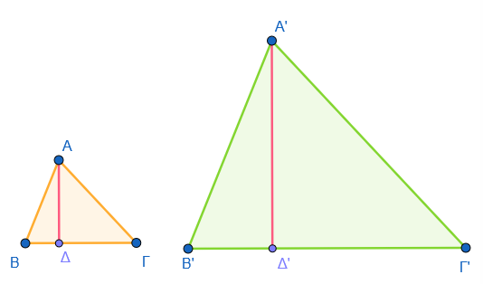
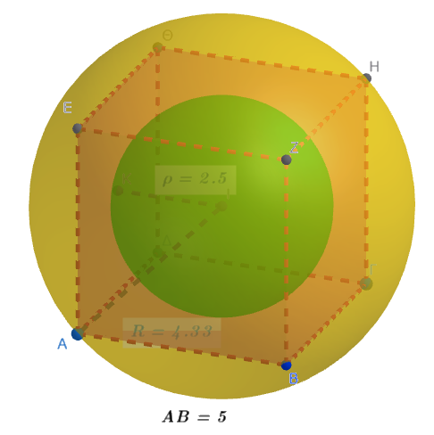
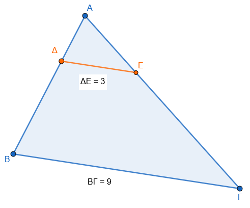
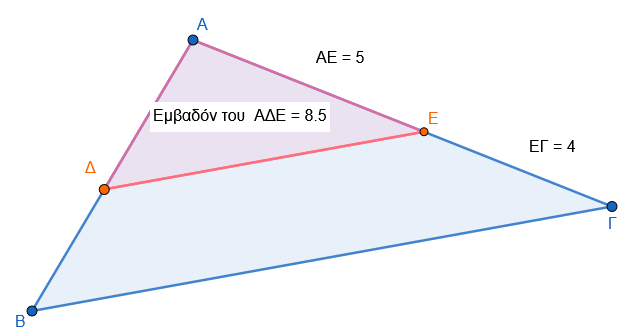
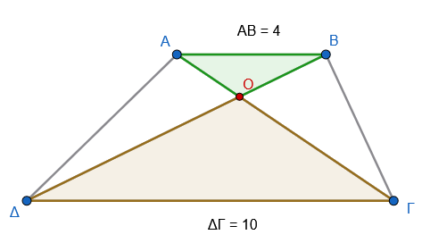
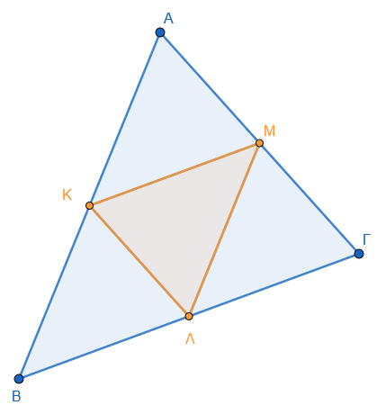
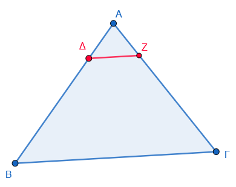
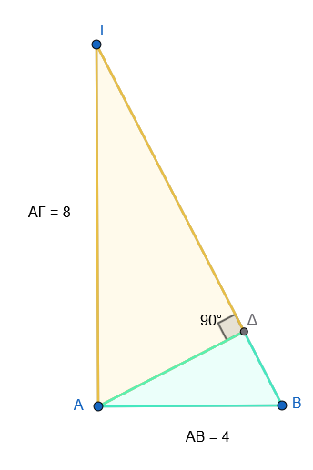
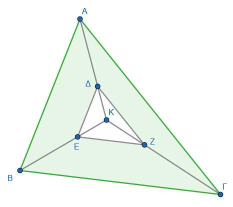

```{=html}
<!-- Φόρτωση βιβλιοθήκης GeoGebra -->
<script src="https://www.geogebra.org/apps/deployggb.js"></script>

<!-- Συνάρτηση δημιουργίας applets -->
<script>
function createGeoGebra(containerId, materialId, width = 700, height = 500) {
  var params = {
    "id": "ggb-" + containerId,
    "material_id": materialId,
    "width": width,
    "height": height,
    "showToolBar": true,
    "showMenuBar": false,
    "showAlgebraInput": true
  };
  
  var applet = new GGBApplet(params, '5.2');
  applet.inject(containerId);
}
</script>
```

## Λόγος εμβαδών ομοίων σχημάτων

Ο λόγος των εμβαδών δύο ομοίων σχημάτων (ή των επιφανειών ομοίων στερεών) συνδέεται άμεσα με τον λόγο ομοιότητάς τους μέσω μιας θεμελιώδους γεωμετρικής σχέσης.

### **Θεωρία: Ο Λόγος των Εμβαδών**

::: {style="background-color: #c98ba2; border: 2px solid #2f3e50; color: #25188a; padding: 15px; border-radius: 5px;"}
**1. Ορισμός Ομοιότητας και Λόγου Ομοιότητας:** Γνωρίζουμε ότι δύο σχήματα (επίπεδα ή στερεά) ονομάζονται **όμοια** όταν το ένα είναι ή μπορεί να γίνει, με κατάλληλη μετατόπιση, **ομοιόθετο** του άλλου.
Ο λόγος $\lambda$ της ομοιοθεσίας αυτής ονομάζεται **λόγος ομοιότητας** των δύο σχημάτων.
Σε δύο όμοια σχήματα, ο λόγος των αποστάσεων δύο οποιωνδήποτε σημείων του ενός προς την απόσταση των αντίστοιχων σημείων του άλλου παραμένει σταθερός και ίσος με τον λόγο ομοιότητας $\lambda$.

**2. Η Σχέση των Εμβαδών:** Ο βασικός κανόνας που προκύπτει είναι ότι **ο λόγος των εμβαδών δύο ομοίων σχημάτων είναι ίσος με το τετράγωνο του λόγου ομοιότητάς τους**.
Συμβολικά, αν $E_1$ και $E_2$ είναι τα εμβαδά δύο ομοίων σχημάτων και $\lambda$ ο λόγος ομοιότητάς τους, τότε: $$\frac{E_1}{E_2} = \lambda^2$$

**3. Εφαρμογή σε Τρίγωνα και Πολύγωνα:**

- **Τρίγωνα:** Ο λόγος των εμβαδών δύο ομοίων τριγώνων ισούται με το τετράγωνο του λόγου ομοιότητας. Αυτό αποδεικνύεται από το γεγονός ότι οι αντίστοιχες βάσεις και τα αντίστοιχα ύψη τους έχουν λόγο $\lambda$, οπότε ο τύπος του εμβαδού ($\dfrac{1}{2} \cdot \text{βάση} \cdot \text{ύψος}$) οδηγεί στον λόγο $\lambda \cdot \lambda = \lambda^2$.\
  {width="403"}

**Απόδειξη**

1.  **Ορισμός Μεγεθών:** Θεωρούμε δύο **όμοια τρίγωνα** ΑΒΓ και Α'Β'Γ' με λόγο ομοιότητας $\lambda$. Έστω $E_1$ το εμβαδό του πρώτου και $E_2$ το εμβαδό του δεύτερου.
2.  **Χρήση Βάσεων και Υψών:** Επιλέγουμε δύο ομόλογες βάσεις, π.χ. τις ΒΓ και Β'Γ', και τα αντίστοιχα ύψη τους ΑΔ και Α'Δ'.
3.  **Τύπος Εμβαδού:** Το εμβαδό κάθε τριγώνου δίνεται από το ήμισυ του γινομένου της βάσης επί το αντίστοιχο ύψος:
    - $E_1 = \dfrac{1}{2} \cdot (ΒΓ) \cdot (ΑΔ)$
    - $E_2 = \dfrac{1}{2} \cdot (Β'Γ') \cdot (Α'Δ')$
4.  **Σχηματισμός Λόγου:** Διαιρώντας κατά μέλη τις δύο ισότητες, ο λόγος των εμβαδών γίνεται: $$\frac{E_1}{E_2} = \frac{\frac{1}{2} \cdot (ΒΓ) \cdot (ΑΔ)}{\frac{1}{2} \cdot (Β'Γ') \cdot (Α'Δ')} = \frac{ΒΓ}{Β'Γ'} \cdot \frac{ΑΔ}{Α'Δ'}$$
5.  **Εφαρμογή Λόγου Ομοιότητας:** Από τον ορισμό της ομοιότητας, ο λόγος των ομολόγων πλευρών είναι ίσος με τον λόγο ομοιότητας $\lambda$, δηλαδή $\dfrac{ΒΓ}{Β'Γ'} = \lambda$. Επιπλέον, **ο λόγος ομοιότητας επεκτείνεται και στα αντίστοιχα δευτερεύοντα στοιχεία**, όπως τα ύψη, οι διάμεσοι και οι διχοτόμοι, συνεπώς και $\dfrac{ΑΔ}{Α'Δ'} = \lambda$.
6.  **Τελικό Συμπέρασμα:** Αντικαθιστώντας τους λόγους με το $\lambda$, προκύπτει: $$\frac{E_1}{E_2} = \lambda \cdot \lambda = \lambda^2$$

**Εναλλακτική Τριγωνομετρική Απόδειξη**

Η σχέση μπορεί επίσης να αποδειχθεί χρησιμοποιώντας τον τριγωνομετρικό τύπο του εμβαδού: $E = \dfrac{1}{2} \beta \gamma \eta\mu A$.

\* Εφόσον τα τρίγωνα είναι όμοια, οι ομόλογες γωνίες τους είναι ίσες ($A = A'$) και οι πλευρές τους ανάλογες ($\beta' = \lambda \beta$ και $\gamma' = \lambda \gamma$).

\* Ο λόγος των εμβαδών γίνεται: $\require{cancel}\dfrac{E'}{E} = \dfrac{\dfrac{1}{2} (\lambda \beta) (\lambda \gamma) \eta\mu A}{\dfrac{1}{2} \beta \gamma \eta\mu A} =\dfrac{\cancel{\dfrac{1}{2}} (λ\cancel{β}) (λ \cancel{γ}) \cancel{ημ A}}{\cancel{\dfrac{1}{2}}  \cancel{β} \cancel{γ} \cancel{ημΑ}}= \lambda^2$.

- **Πολύγωνα:** Η ιδιότητα αυτή επεκτείνεται σε όλα τα όμοια πολύγωνα, καθώς αυτά μπορούν να αναλυθούν σε αντίστοιχα όμοια τρίγωνα.

**4. Επιφάνειες Στερεών Σωμάτων:** Η ίδια αρχή ισχύει και για το εμβαδό της επιφάνειας (παράπλευρης ή ολικής) ομοίων στερεών, όπως **κύβοι, κύλινδροι, κώνοι και σφαίρες**.
:::

------------------------------------------------------------------------

### **Παραδείγματα**

- **Παράδειγμα με Σπίτια:** Αν έχουμε δύο εντελώς όμοια σπίτια Α και Β, και το ύψος του σπιτιού Α είναι διπλάσιο από το ύψος του σπιτιού Β ($\lambda=2$), τότε η έκταση (εμβαδό) που καταλαμβάνει το σπίτι Α θα είναι **τετραπλάσια** ($\lambda^2 = 2^2 = 4$) από την έκταση του σπιτιού Β.

- **Παράδειγμα με Κύβους:** Έστω δύο κύβοι με ακμές $\alpha$ και $\alpha'$.
  Ο λόγος ομοιότητάς τους είναι $\lambda = \dfrac{\alpha}{\alpha'}$.
  Ο λόγος των ολικών επιφανειών τους ($E=6\alpha^2$ και $E'=6\alpha'^2$) είναι ίσος με το τετράγωνο του λόγου ομοιότητας: $\dfrac{6\alpha^2}{6\alpha'^2} = (\dfrac{\alpha}{\alpha'})^2 = \lambda^2$.

- **Υπολογισμός Εμβαδού Ομοιοθέτου Σχήματος:** Αν έχουμε ένα τετράγωνο με πλευρά 8 cm και το μετασχηματίσουμε με λόγο ομοιότητας $\lambda=3$, το νέο τετράγωνο θα έχει εμβαδό $E' = E \cdot \lambda^2$.
  Δηλαδή: $(8 \cdot 8) \cdot 3^2 = 64 \cdot 9 = 576$ cm$^2$.

- **Μεταβολή Διαστάσεων Πρίσματος:** Αν η επιφάνεια ενός πρίσματος είναι 22 m$^2$ και κατασκευάσουμε ένα δεύτερο όμοιο πρίσμα του οποίου οι διαστάσεις είναι το $\dfrac{1}{2}$ των διαστάσεων του πρώτου ($\lambda = \dfrac{1}{2}$), τότε η επιφάνεια του νέου πρίσματος θα είναι $22 \cdot \left(\dfrac{1}{2}\right)^2 = 22 \cdot \dfrac{1}{4} = 5,5$ m$^2$.

- **Ομόλογες Ακμές Στερεών:** Αν δύο ομόλογες ακμές δύο ομοίων στερεών έχουν μήκη 3 cm και 6 cm, ο λόγος ομοιότητας είναι $\lambda = \dfrac{6}{3} = 2$.
  Συνεπώς, ο λόγος των εμβαδών των επιφανειών τους θα είναι $\lambda^2 = 2^2 = 4$.

- **Παράδειγμα με Κύκλους**

Γνωρίζουμε ότι όλοι οι **κύκλοι είναι μεταξύ τους σχήματα όμοια**.
Ο λόγος ομοιότητας $\lambda$ δύο κύκλων ισούται με τον **λόγο των ακτίνων τους**.
Όπως ισχύει για όλα τα όμοια σχήματα, ο λόγος των εμβαδών τους είναι ίσος με το **τετράγωνο του λόγου ομοιότητάς τους**.

Έστω ότι έχουμε δύο κύκλους, τον κύκλο $K_1$ με ακτίνα $R_1$ και τον κύκλο $K_2$ με ακτίνα $R_2$.

1.  **Υπόθεση:** Ας υποθέσουμε ότι η ακτίνα του δεύτερου κύκλου είναι **τριπλάσια** από την ακτίνα του πρώτου ($R_2 = 3 \cdot R_1$).
2.  **Λόγος Ομοιότητας:** Ο λόγος ομοιότητας των δύο κύκλων θα είναι $\lambda = \dfrac{R_2}{R_1} = 3$.
3.  **Λόγος Εμβαδών:** Ο λόγος των εμβαδών τους ($E_1, E_2$) θα είναι ίσος με το τετράγωνο του λόγου ομοιότητας: $$\frac{E_2}{E_1} = \lambda^2 = 3^2 = 9$$
4.  **Συμπέρασμα:** Το εμβαδό του δεύτερου κύκλου θα είναι **9 φορές μεγαλύτερο** από το εμβαδό του πρώτου.

**Επαλήθευση με τον τύπο του εμβαδού:**

Το εμβαδό του κύκλου δίνεται από τον τύπο $E = \pi R^2$.

\* Για τον πρώτο κύκλο: $E_1 = \pi R_1^2$.

\* Για τον δεύτερο κύκλο: $E_2 = \pi (3R_1)^2 = \pi \cdot 9R_1^2 = 9 \cdot (\pi R_1^2) = 9E_1$.

Αντίστοιχα, αν η ακτίνα ενός κύκλου **διπλασιαστεί** ($\lambda=2$), το εμβαδό του **τετραπλασιάζεται** ($\lambda^2=4$), ενώ αν η ακτίνα υποδιπλασιαστεί ($\lambda=1/2$), το εμβαδό γίνεται το **ένα τέταρτο** του αρχικού ($\lambda^2=1/4$).

- **Παράδειγμα: Υπολογισμός Εμβαδού Ομοίου Τριγώνου**

**Δεδομένα:**

1.  Έχουμε ένα τρίγωνο $ΑΒΓ$ με εμβαδό $E = 27$ m².
2.  Κατασκευάζουμε ένα νέο τρίγωνο $Α'Β'Γ'$ το οποίο είναι **όμοιο** με το $ΑΒΓ$.
3.  Ο λόγος ομοιότητας του νέου τριγώνου ως προς το αρχικό είναι $\lambda = \dfrac{1}{3}$. (Αυτό σημαίνει ότι κάθε πλευρά του νέου τριγώνου είναι το $1/3$ της αντίστοιχης πλευράς του αρχικού).

**Ζητούμενο:** Να βρεθεί το εμβαδό $E'$ του τριγώνου $Α'Β'Γ'$.

**Λύση:**

- **Βήμα 1: Εφαρμογή της θεωρίας.** Γνωρίζουμε από τη γεωμετρία ότι: $$\frac{E'}{E} = \lambda^2$$

- **Βήμα 2: Υπολογισμός του τετραγώνου του λόγου ομοιότητας.** Εφόσον $\lambda = \dfrac{1}{3}$, τότε: $$\lambda^2 = \left(\frac{1}{3}\right)^2 = \frac{1}{9}$$

- **Βήμα 3: Υπολογισμός του νέου εμβαδού.** Αντικαθιστούμε τις τιμές στον τύπο: $$E' = E \cdot \lambda^2$$ $$E' = 27 \cdot \frac{1}{9}$$ $E' = 3$ m²

**Συμπέρασμα** Αν μικρύνουμε τις διαστάσεις ενός πολυγώνου κατά **3 φορές** (λόγος $1/3$), το εμβαδό του δεν θα μειωθεί κατά 3, αλλά κατά **9 φορές** ($3^2$), καταλαμβάνοντας έτσι το $1/9$ της αρχικής έκτασης.
Το ίδιο ισχύει για όλα τα όμοια πολύγωνα, καθώς κάθε πολύγωνο μπορεί να αναλυθεί σε αντίστοιχα όμοια τρίγωνα.

------------------------------------------------------------------------

**Ο λόγος των εμβαδών των επιφανειών δύο σφαιρών είναι ίσος με το τετράγωνο του λόγου ομοιότητάς τους**, ο οποίος ισούται με τον λόγο των ακτίνων τους.

**Θεωρητική Βάση** Επειδή δύο οποιεσδήποτε σφαίρες είναι πάντα σχήματα όμοια, αν έχουν ακτίνες $R$ και $R'$, ο λόγος των εμβαδών τους ($E$ και $E'$) προκύπτει από τον τύπο $E = 4\pi R^2$ ως εξής: $$\frac{E}{E'} = \frac{4\pi R^2}{4\pi R'^2} = \frac{R^2}{R'^2} = \left(\frac{R}{R'}\right)^2 = \lambda^2$$

- **Παράδειγμα: Εγγεγραμμένη και Περιγεγραμμένη Σφαίρα Κύβου**

Ένα χαρακτηριστικό παράδειγμα υπολογισμού που προκύπτει αφορά τη σύγκριση δύο σφαιρών σε σχέση με έναν κύβο πλευράς $\alpha = 5$ m:

{width="341"}

1.  **Εγγεγραμμένη Σφαίρα:**

    - Η διάμετρος της σφαίρας ισούται με την πλευρά του κύβου ($\alpha = 5$ m), άρα η ακτίνα της είναι $\rho = 2,5$ m.
    - Το εμβαδό της επιφάνειάς της είναι: $E_1 = 4\pi \cdot (2,5)^2 = 25\pi$ m².

2.  **Περιγεγραμμένη Σφαίρα:**

    - Η διάμετρος της σφαίρας ισούται με τη διαγώνιο του κύβου ($\alpha\sqrt{3} = 5\sqrt{3}$ m), άρα η ακτίνα της είναι $R = \dfrac{5\sqrt{3}}{2}$ m.

    - Το εμβαδό της επιφάνειάς της είναι: $E_2 = 4\pi \cdot \left(\dfrac{5\sqrt{3}}{2}\right)^2 = 4\pi \cdot \dfrac{25 \cdot 3}{4} = 75\pi$ m².

3.  **Υπολογισμός Λόγου:**

    - Ο **λόγος ομοιότητας** των δύο σφαιρών είναι $\lambda = \dfrac{R}{\rho} = \dfrac{\dfrac{5\sqrt{3}}{2}}{2,5} = \sqrt{3}$.

    - Ο **λόγος των εμβαδών** τους είναι: $$\frac{E_2}{E_1} = \frac{75\pi}{25\pi} = 3$$

    - **Επαλήθευση:** Παρατηρούμε ότι $\lambda^2 = (\sqrt{3})^2 = 3$, γεγονός που επιβεβαιώνει τη θεωρία ότι ο λόγος των εμβαδών ισούται με το τετράγωνο του λόγου ομοιότητας.

**Άλλα Σύντομα Παραδείγματα**

- Αν **διπλασιάσουμε** την ακτίνα μιας σφαίρας ($\lambda=2$), το εμβαδό της επιφάνειάς της **τετραπλασιάζεται** ($\lambda^2=4$).

- Αν ο λόγος των ακτίνων δύο σφαιρών είναι $1/3$, τότε η μία σφαίρα έχει επιφάνεια **9 φορές μικρότερη** από την άλλη.

------------------------------------------------------------------------

**Ο λόγος των εμβαδών δύο ομοίων κώνων είναι ίσος με το τετράγωνο του λόγου ομοιότητάς τους**.

**Θεωρητική Θεμελίωση**

Δύο ορθοί κυκλικοί κώνοι είναι όμοιοι όταν παράγονται από όμοια ορθογώνια τρίγωνα.
Αν $R_1, R_2$ είναι οι ακτίνες των βάσεών τους και $\lambda_1, \lambda_2$ οι γενέτειρές τους, τότε ο λόγος ομοιότητας είναι $\mu = \dfrac{R_1}{R_2} = \dfrac{\lambda_1}{\lambda_2}$.

- **Λόγος Κυρτών Επιφανειών:** $\dfrac{E_{\pi 1}}{E_{\pi 2}} = \dfrac{\pi R_1 \lambda_1}{\pi R_2 \lambda_2} = \mu \cdot \mu = \mu^2$.

- **Λόγος Ολικών Επιφανειών:** $\dfrac{E_{o\lambda 1}}{E_{o\lambda 2}} = \mu^2$.

**1. Τομή Κώνου στο Μέσον του Ύψους**

Όταν ένας κώνος κόβεται από επίπεδο παράλληλο προς τη βάση του στο **μέσο του ύψους** του, ο νέος μικρός κώνος που σχηματίζεται στην κορυφή είναι όμοιος με τον αρχικό.

- Εφόσον το επίπεδο τέμνει το ύψος στη μέση, ο λόγος ομοιότητας είναι $\lambda = 1/2$.

- Συνεπώς, το εμβαδό της ολικής επιφάνειας του μικρού κώνου θα είναι το $1/4$ ($\lambda^2 = (1/2)^2 = 1/4$) της επιφάνειας του αρχικού κώνου.
  Αν, για παράδειγμα, ο αρχικός κώνος έχει ολική επιφάνεια $282,60 \text{ cm}^2$, ο μικρός θα έχει $70,65 \text{ cm}^2$.

**2. Υπολογισμός Διαστάσεων μέσω Λόγου Εμβαδών**

Έστω ένας κώνος με ακτίνα $R=3 \text{ m}$ και ύψος $h=4 \text{ m}$ (άρα γενέτειρα $L=5 \text{ m}$).
Ζητείται η γενέτειρα ενός **όμοιου** κώνου, του οποίου η **παράπλευρη επιφάνεια** ($E_{\pi2}$) είναι ίση με την **ολική επιφάνεια** του πρώτου ($E_{o\lambda1}$).

- Η ολική επιφάνεια του πρώτου κώνου είναι $E_{o\lambda1} = \pi \cdot 3 \cdot (5+3) = 24\pi$.

- Για τον δεύτερο (όμοιο) κώνο, αν $\kappa$ είναι ο λόγος ομοιότητας, η παράπλευρη επιφάνειά του θα είναι $E_{\pi2} = \kappa^2 \cdot (\pi R L) = \kappa^2 \cdot \pi \cdot 3 \cdot 5 = 15\pi \kappa^2$.

- Εξισώνοντας τις επιφάνειες: $15\pi \kappa^2 = 24\pi \Rightarrow \kappa^2 = 24/15 = 1,6$.

- Ο λόγος των εμβαδών είναι $1,6$, άρα ο λόγος ομοιότητας είναι $\kappa = \sqrt{1,6}$.

- Η νέα γενέτειρα θα είναι $y = 5 \cdot \sqrt{1,6} \approx 6,324 \text{ m}$.

**3. Λόγος Επιφανειών και Ακτίνων**

Αν ο λόγος των ακτίνων δύο ομοίων κώνων είναι $\mu$, τότε ο λόγος των κυρτών επιφανειών τους είναι $\mu^2$.
Για παράδειγμα, αν διπλασιάσουμε όλες τις διαστάσεις ενός κώνου ($\mu=2$), η επιφάνειά του θα **τετραπλασιαστεί** ($\mu^2=4$).

------------------------------------------------------------------------

## Ασκήσεις

1.  Αν έχουμε δύο όμοια σχήματα και η πλευρά του δεύτερου είναι διπλάσια ($2$ φορές μεγαλύτερη) από την πλευρά του πρώτου, πόσες φορές μεγαλύτερο θα είναι το εμβαδόν του;

2.  Αν ο λόγος ομοιότητας δύο σχημάτων είναι $k = 3$, ποιος είναι ο λόγος των εμβαδών τους;

3.  Αν το εμβαδόν ενός μεγάλου τετραγώνου είναι $16$ φορές μεγαλύτερο από το εμβαδόν ενός μικρότερου, πόσες φορές μεγαλύτερη είναι η πλευρά του;

4.  Έχουμε δύο όμοια τρίγωνα.
    Αν το πρώτο έχει πλευρά $2 \text{ cm}$ και το δεύτερο $6 \text{ cm}$, ποιος είναι ο λόγος των εμβαδών τους;

5.  Ισχύει ο ίδιος κανόνας για τους κύκλους; Αν η ακτίνα ενός κύκλου τριπλασιαστεί, τι θα συμβεί στο εμβαδόν του;

6.  Αν ο λόγος των εμβαδών δύο ομοίων σχημάτων είναι $\dfrac{4}{25}$, ποιος είναι ο λόγος των αντίστοιχων πλευρών τους;

7.  Αν ένα σχήμα έχει εμβαδόν $10 \text{ cm}^2$ και το μεγεθύνουμε με λόγο $k = 5$, ποιο θα είναι το νέο εμβαδόν;

8.  Δύο όμοια ορθογώνια έχουν λόγο περιμέτρων $\dfrac{1}{2}$.
    Ποιος είναι ο λόγος των εμβαδών τους;

9.  Αν μειώσουμε όλες τις πλευρές ενός σχήματος στο μισό ($\dfrac{1}{2}$), πόσο θα γίνει το εμβαδόν του;

10. Γιατί ο λόγος των εμβαδών είναι το τετράγωνο του λόγου των πλευρών;

11. **Λόγος ομοιότητας και εμβαδά:** Αν ο λόγος ομοιότητας δύο σχημάτων είναι $\lambda = 0,75$, ποιος είναι ο λόγος των εμβαδών τους;

12. **Αντίστροφος υπολογισμός:** Αν ο λόγος των εμβαδών δύο ομοίων τριγώνων είναι $1/9$, ποιος είναι ο λόγος ομοιότητας $\lambda$;

13. **Ομόλογες ακμές στερεών:** Δύο όμοια στερεά έχουν ομόλογες ακμές $3\text{ cm}$ και $6\text{ cm}$.
    Βρείτε το λόγο των εμβαδών των επιφανειών τους.

14. **Κύβος και εμβαδό έδρας:** Ένας κύβος (Κ) είναι όμοιος με κύβο (Κ') πλευράς $6\text{ cm}$.
    Αν το εμβαδό μιας έδρας του (Κ) είναι $9\text{ cm}^2$, βρείτε το λόγο ομοιότητας $\lambda$.

15. **Τρίγωνο και βαρύκεντρο:** Τρίγωνο έχει εμβαδό $27\text{ m}^2$.
    Αν από το βαρύκεντρο φέρουμε παράλληλη στη βάση, υπολογίστε το εμβαδό του μικρού τριγώνου που σχηματίζεται στην κορυφή.

16. **Τομή πυραμίδας στο μέσο:** Επίπεδο παράλληλο στη βάση τέμνει το ύψος πυραμίδας στο μέσο του.
    Ποιος είναι ο λόγος της ολικής επιφάνειας της μικρής πυραμίδας προς την αρχική;

17. **Παράδειγμα ομοίων σπιτιών:** Αν το ύψος του σπιτιού Α είναι διπλάσιο από το ύψος του πανομοιότυπου σπιτιού Β, πόσες φορές μεγαλύτερη είναι η έκταση που καταλαμβάνει το σπίτι Α;

18. **Επιφάνειες κυλίνδρων:** Δύο όμοιοι κύλινδροι έχουν λόγο ακτινών $\lambda$.
    Δείξτε ότι ο λόγος των ολικών τους επιφανειών είναι επίσης $\lambda^2$.

19. **Σφαίρες και ακτίνες:** Αν η ακτίνα μιας σφαίρας τριπλασιαστεί, πόσες φορές αυξάνεται το εμβαδό της επιφάνειάς της;

20. **Όμοια πρίσματα:** Δύο όμοια τριγωνικά πρίσματα έχουν λόγο ομολόγων ακμών $4:7$.
    Βρείτε το λόγο των επιφανειών τους.

21. **Κύβος και λόγος πλευρών:** Αν ο λόγος των πλευρών δύο κύβων είναι $2/3$, βρείτε το λόγο των εμβαδών των εδρών τους.

22. **Τομή κώνου στο μέσο:** Ένας κώνος έχει ολική επιφάνεια $282,60\text{ cm}^2$.
    Ποιο είναι το εμβαδό της ολικής επιφάνειας του μικρού κώνου που προκύπτει αν τον κόψουμε παράλληλα στη βάση στο μέσο του ύψους του;

23. **Κανονικά πολύγωνα:** Δύο κανονικά πεντάγωνα έχουν λόγο πλευρών $5$.
    Ποιος είναι ο λόγος των εμβαδών τους;

24. **Υπολογισμός λόγου ομοιότητας:** Αν ο λόγος των εμβαδών δύο ομοίων κώνων είναι $1,6$, ποιος είναι ο λόγος των γενετειρών τους;

25. **Σφαίρα εγγεγραμμένη σε κύβο:** Βρείτε το λόγο της επιφάνειας μιας σφαίρας προς την επιφάνεια του περιγεγραμμένου σε αυτή κύβου (όπου η ακμή του κύβου ισούται με τη διάμετρο της σφαίρας).

26. **Τριπλασιασμός ακμής κύβου:** Πώς μεταβάλλεται το εμβαδό της ολικής επιφάνειας ενός κύβου αν τριπλασιάσουμε την πλευρά του;

27. **Εύρεση ομόλογης ακμής:** Μια πυραμίδα έχει πλευρά $10\text{ cm}$.
    Ποια είναι η ομόλογη ακμή μιας όμοιας πυραμίδας αν η δεύτερη έχει διπλάσια επιφάνεια;

28. **Κύλινδροι και ακτίνες:** Αν ο λόγος των ολικών επιφανειών δύο ομοίων κυλίνδρων είναι $16$, ποιος είναι ο λόγος των ακτινών τους;

29. **Προσδιορισμός θέσης τομής κώνου:** Σε ποιο σημείο του ύψους πρέπει να τμηθεί ένας κώνος παράλληλα προς τη βάση του, ώστε η κυρτή επιφάνεια του μικρού κώνου να είναι το $1/4$ της αρχικής;

30. **Σχέση όγκου και επιφάνειας:** Αν ο λόγος των όγκων δύο ομοίων στερεών είναι $8$, ποιος είναι ο λόγος των επιφανειών τους;

31. Στο παρακάτω σχήμα είναι $\Delta \text{E} // \text{B}\Gamma$.
    Αν $ΔΕ = 3 \text{ cm}$ και $ΒΓ = 9 \text{ cm}$, να υπολογίσετε το λόγο των εμβαδών $\frac{(\text{A}\Delta\text{E})}{(\text{AB}\Gamma)}$.\
    {width="353"}

32. Στο παρακάτω σχήμα είναι $\Delta \text{E} // \text{B}\Gamma$.
    Αν η πλευρά $ΑΕ = 5 \text{ cm}$ και η $ΕΓ = 4 \text{ cm}$, και το εμβαδόν του μικρού τριγώνου $(\text{A}\Delta\text{E})$ είναι $8,5 \text{ cm}^2$, να βρείτε το εμβαδόν του τριγώνου $(\text{AB}\Gamma)$.\
    

33. Σε τραπέζιο $ΑΒΓΔ$ με βάσεις $ΑΒ = 4 \text{ cm}$ και $ΓΔ = 10 \text{ cm}$, οι διαγώνιες $ΑΓ$ και $ΒΔ$ τέμνονται στο $Ο$.
    Πόσες φορές το εμβαδόν του τριγώνου $ΟΓΔ$ είναι μεγαλύτερο από το εμβαδόν του τριγώνου $ΟΑΒ$;\
    

34. Αν $\text{K}, \Lambda, \text{M}$ είναι τα μέσα των πλευρών $\text{AB}, \text{B}\Gamma, \Gamma\text{A}$ ενός τριγώνου $\text{AB}\Gamma$ αντιστοίχως, να υπολογίσετε τους λόγους:

α) $\dfrac{(\text{AKM})}{(\text{AB}\Gamma)}$

β) $\dfrac{(\text{K}\Lambda\text{M})}{(\text{AB}\Gamma)}$\

{width="329"}

35. Έστω τρίγωνο $ΑΒΓ$ με εμβαδόν $\text{E}$.
    Αν πάρουμε σημείο $Δ$ στην ${AB}$ τέτοιο ώστε $AΔ = \dfrac{1}{4} {AB}$ και φέρουμε $ΔΖ // ΒΓ$, να αποδείξετε ότι το εμβαδόν $\text{E}_1$ του τριγώνου $ΑΔΖ$ είναι $\text{E}_1 = \dfrac{1}{16} \text{E}$.\
    

36. Σε ορθογώνιο τρίγωνο $ΑΒΓ$ ($\hat{\text{A}} = 90^{\circ}$) με κάθετες πλευρές ${AB} = 4 \text{ cm}$ και $ΑΓ = 8 \text{ cm}$, φέρνουμε το ύψος $ΑΔ$ προς την υποτείνουσα.
    Να βρείτε τον λόγο των εμβαδών $\dfrac{(\text{AB}\Delta)}{(\text{A}\Gamma\Delta)}$.\
    

37. Στο εσωτερικό τριγώνου $ΑΒΓ$ παίρνουμε σημείο ${Κ}$.
    Αν $Δ,\ Ε, \ Z$ είναι τα σημεία πάνω στα τμήματα ${ΚA}, \ {ΚB}, \ {ΚΓ}$ τέτοια ώστε $ΚΔ = \dfrac{1}{3} {ΚA}, \ {ΚE} = \dfrac{1}{3} {ΚB}$ και ${ΚZ} = \dfrac{1}{3} {ΚΓ}$, να βρείτε:
    
    α)  το λόγο των εμβαδών $\dfrac{(ΔΕΖ)}{(ΑΒΓ)}$.
    
    β)  Αν το εμβαδόν του ΑΒΓ είναι $54 \ cm^2$ , να βρείτε το εμβαδόν του πράσινου χωρίου.\

    {width="384"}\

38. Ένα τετράγωνο έχει εμβαδόν $100 \text{ cm}^2$.
Να βρείτε το νέο εμβαδόν αν γίνει: 

α) Μεγέθυνση κατά $150\%$ 

> (δηλαδή ο λόγος ομοιότητας γίνεται $1,5$).

β) Σμίκρυνση κατά $80\%$ 

> (δηλαδή ο λόγος ομοιότητας γίνεται $0,8$).


39. Αν η πλευρά ενός ισόπλευρου τριγώνου αυξηθεί κατά $20\%$, να βρείτε πόσο τοις εκατό ($\%$) θα αυξηθεί το εμβαδόν του.

**Λύση**

  - **Βήμα 1: Βρίσκουμε τον λόγο ομοιότητας ($k$)**

Όταν λέμε ότι η πλευρά αυξάνεται κατά $20\%$, σημαίνει ότι αν η παλιά πλευρά ήταν $100\%$, η νέα πλευρά θα είναι $100\% + 20\% = 120\%$.

Σε δεκαδική μορφή, το $120\%$ το γράφουμε ως $1,2$. 
Άρα ο λόγος ομοιότητας των πλευρών είναι:
$$k = 1,2$$

  - **Βήμα 2: Βρίσκουμε τον λόγο των εμβαδών ($k^2$)**

Όπως μάθαμε, ο λόγος των εμβαδών είναι το τετράγωνο του λόγου των πλευρών. Δηλαδή, πρέπει να πολλαπλασιάσουμε το $k$ με τον εαυτό του:
$$k^2 = 1,2 \cdot 1,2$$

Ας κάνουμε την πράξη:
$$k^2 = 1,44$$

Αυτό σημαίνει ότι το νέο εμβαδόν είναι $1,44$ φορές μεγαλύτερο από το παλιό.

  - **Βήμα 3: Μετατρέπουμε τον λόγο σε ποσοστό ($\%$)**
Το $1,44$ ως ποσοστό είναι το $144\%$.

Για να βρούμε πόσο **αυξήθηκε** το εμβαδόν, αφαιρούμε το αρχικό εμβαδόν ($100\%$):
$$144\% - 100\% = 44\%$$

  - **Τελική Απάντηση:**
Το εμβαδόν του τριγώνου θα αυξηθεί κατά **$44\%$**.

40. Οι διαστάσεις ενός ορθογωνίου μειώθηκαν κατά $10\%$.
Να υπολογίσετε το ποσοστό $(\%)$ μείωσης του εμβαδόν του ορθογωνίου.

------------------------------------------------------------------------

$$\bbox[yellow, 5px]{\color{blue}\Large\text{---}}$$

::: {.callout-tip style="color: brown;"}
:::

::: {style="background-color: #d3deb8; border: 2px solid #2f3e50; color: #25188a; padding: 15px; border-radius: 5px;"}
:::

::: {.callout-tip style="color: brown;"}
ΚΑΛΗ ΜΕΛΕΤΗ!
:::

\
\
