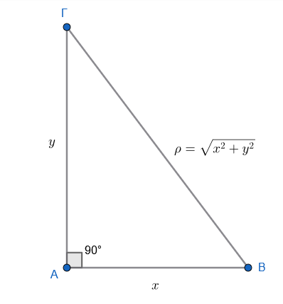
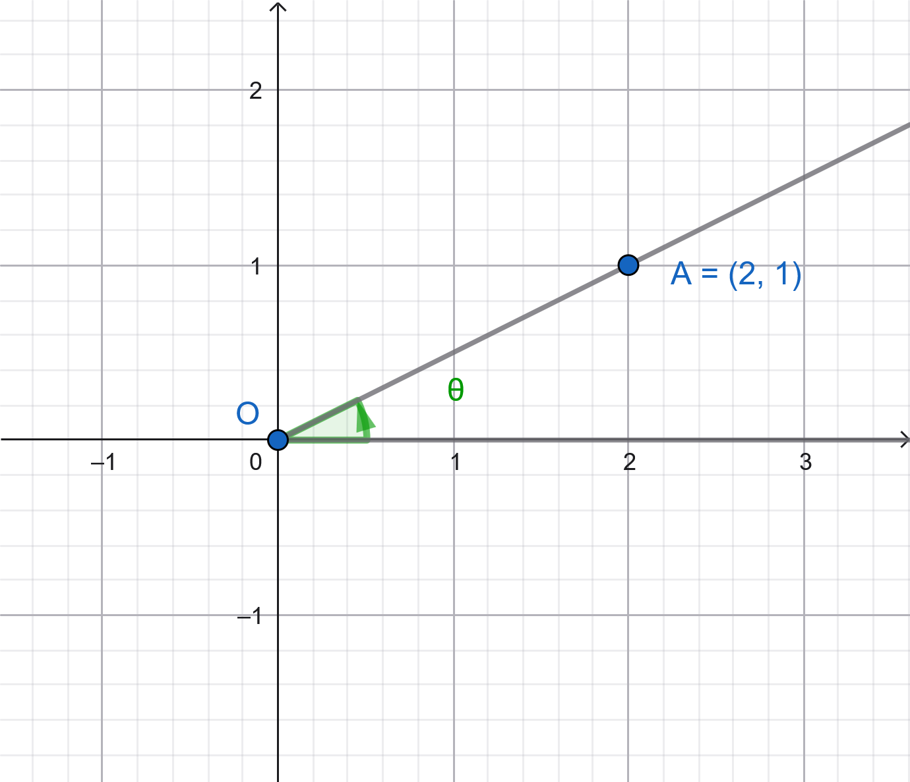
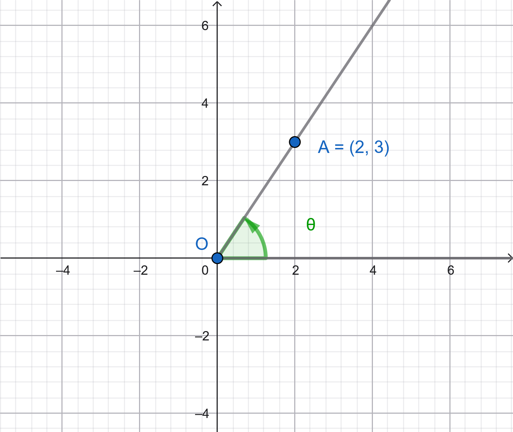
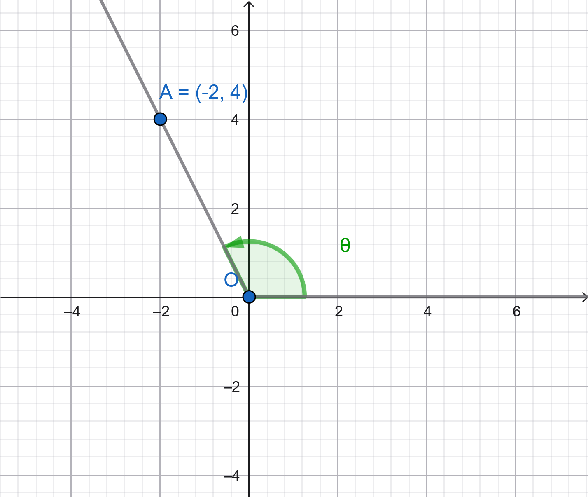
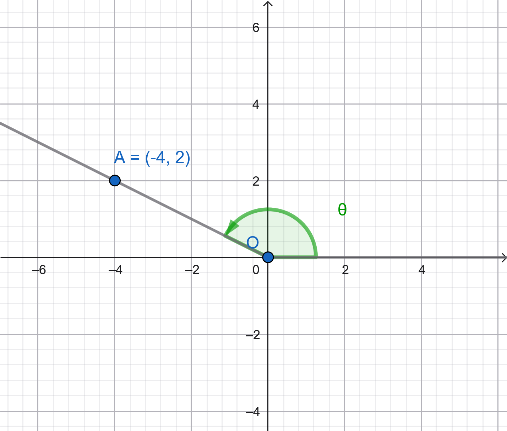
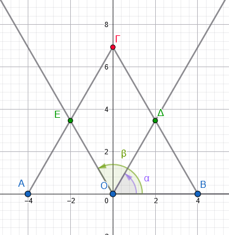
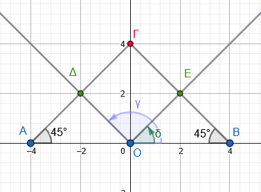

```{=html}
<!-- Φόρτωση βιβλιοθήκης GeoGebra -->
<script src="https://www.geogebra.org/apps/deployggb.js"></script>

<!-- Συνάρτηση δημιουργίας applets -->
<script>
function createGeoGebra(containerId, materialId, width = 700, height = 500) {
  var params = {
    "id": "ggb-" + containerId,
    "material_id": materialId,
    "width": width,
    "height": height,
    "showToolBar": true,
    "showMenuBar": false,
    "showAlgebraInput": true
  };
  
  var applet = new GGBApplet(params, '5.2');
  applet.inject(containerId);
}
</script>
```

## Τριγωνομετρικοί αριθμοί γωνίας με 0º ≤ω ≤ 180º

Οι τριγωνομετρικοί αριθμοί (ημίτονο, συνημίτονο, εφαπτομένη) για γωνίες από 0º έως 180º ορίζονται τόσο γεωμετρικά μέσω του ορθογωνίου τριγώνου (για οξείες γωνίες) όσο και αναλυτικά μέσω του συστήματος συντεταγμένων (για γωνίες έως 180º).

:::: {style="background-color: #c98ba2; border: 2px solid #2f3e50; color: #25188a; padding: 15px; border-radius: 5px;"}
**Ορισμοί για Οξείες Γωνίες (0º \< ω \< 90º)**

Γνωρίζουμε ότι:

Σε ένα ορθογώνιο τρίγωνο ΑΒΓ (με ορθή γωνία στο Α), οι τριγωνομετρικοί αριθμοί μιας οξείας γωνίας ω ορίζονται ως εξής:\
{width="272"}

- **Ημίτονο (ημω):** Ο λόγος της απέναντι κάθετης πλευράς προς την υποτείνουσα ($ημω = \dfrac{y}{\rho}$).

- **Συνημίτονο (συνω):** Ο λόγος της προσκείμενης κάθετης πλευράς προς την υποτείνουσα ($συνω = \dfrac{x}{\rho}$).

- **Εφαπτομένη (εφω):** Ο λόγος της απέναντι κάθετης πλευράς προς την προσκείμενη κάθετη πλευρά ($εφω = \dfrac{y}{x}$).

**Τριγωνομετρικοί Αριθμοί στον Τριγωνομετρικό Κύκλο**

Για γωνίες $\omega$ που κυμαίνονται από 0º έως 180º, χρησιμοποιούμε ένα ορθοκανονικό σύστημα αξόνων και έναν κύκλο με κέντρο την αρχή των αξόνων $O(0,0)$ και ακτίνα $\rho$.
Αν $P(x, y)$ είναι ένα σημείο στην τελική πλευρά της γωνίας, τότε:\

<iframe src="https://www.geogebra.org/calculator/spzkzdnn?embed" width="730" height="600" allowfullscreen style="border: 1px solid #e4e4e4;border-radius: 4px;" frameborder="0">

</iframe>

::: callout-tip
Μετακινήστε το σημείο P σε διάφορες θέσεις ώστε να σχηματίζεται γωνία μεταξύ $0^ο$ και $180^ο$

Τι τιμές παίρνουν οι τριγωνομετρικοί αριθμοί όταν η γωνία είναι στο $1^ο$ τεταρτμόριο;

Τι τιμές παίρνουν οι τριγωνομετρικοί αριθμοί όταν η γωνία είναι $90^ο$ ;

Τι τιμές παίρνουν οι τριγωνομετρικοί αριθμοί όταν η γωνία είναι $2^ο$ τεταρτημόριο;

Τι τιμές παίρνουν οι τριγωνομετρικοί αριθμοί όταν η γωνία είναι $180^ο$ ;
:::

- $ημ\omega = \dfrac{y}{\rho}$\

- $συν\omega = \dfrac{x}{\rho}$\

- $εφ\omega = \dfrac{y}{x}$ (για $\omega \neq 90^\circ$)
::::

**Βασικός πίνακας τριγωνομετρικών αριθμών:**\

```{=html}

<style type="text/css">
.tg  {border-collapse:collapse;border-spacing:0;}
.tg td{border-color:black;border-style:solid;border-width:1px;font-family:Arial, sans-serif;font-size:14px;
  overflow:hidden;padding:10px 5px;word-break:normal;}
.tg th{border-color:black;border-style:solid;border-width:1px;font-family:Arial, sans-serif;font-size:14px;
  font-weight:normal;overflow:hidden;padding:10px 5px;word-break:normal;}
.tg .tg-baqh{text-align:center;vertical-align:top}
.tg .tg-6ss3{background-color:#a7ebe4;font-weight:bold;text-align:center;vertical-align:top}
.tg .tg-o2xy{background-color:#9de9c3;font-weight:bold;text-align:center;vertical-align:top}
.tg .tg-xbrx{background-color:#d7b8b8;color:#3166ff;font-style:italic;font-weight:bold;text-align:center;vertical-align:top}
</style>
<table class="tg"><thead>
  <tr>
    <th class="tg-baqh"></th>
    <th class="tg-o2xy">\(0^o\)</th>
    <th class="tg-o2xy">\(30^o\)</th>
    <th class="tg-o2xy">\(45^o\)</th>
    <th class="tg-o2xy">\(60^o\)</th>
    <th class="tg-o2xy">\(90^o\)</th>
    <th class="tg-o2xy">\(180^o\)</th>
  </tr></thead>
<tbody>
  <tr>
    <td class="tg-6ss3">ημω</td>
    <td class="tg-xbrx">0</td>
    <td class="tg-xbrx">\(\frac{1}{2}\)</td>
    <td class="tg-xbrx">\(\frac{\sqrt{2}}{2}\)</td>
    <td class="tg-xbrx">\(\frac{\sqrt{3}}{2}\)</td>
    <td class="tg-xbrx">1</td>
    <td class="tg-xbrx">0</td>
  </tr>
  <tr>
    <td class="tg-6ss3">συνω</td>
    <td class="tg-xbrx">1</td>
    <td class="tg-xbrx">\(\frac{\sqrt{3}}{2}\)</td>
    <td class="tg-xbrx">\(\frac{\sqrt{2}}{2}\)</td>
    <td class="tg-xbrx">\(\frac{1}{2}\)</td>
    <td class="tg-xbrx">0</td>
    <td class="tg-xbrx">-1</td>
  </tr>
  <tr>
    <td class="tg-6ss3">εφω</td>
    <td class="tg-xbrx">0</td>
    <td class="tg-xbrx">\(\frac{\sqrt{3}}{3}\)</td>
    <td class="tg-xbrx">1</td>
    <td class="tg-xbrx">\(\sqrt{3}\)</td>
    <td class="tg-xbrx">δεν ορίζεται</td>
    <td class="tg-xbrx">0</td>
  </tr>
</tbody></table>
```

------------------------------------------------------------------------

### Παραδείγματα

**Παράδειγμα 1: Υπολογισμός με βάση σημείο** Αν το σημείο $P(-4, 3)$ βρίσκεται στην τελική πλευρά μιας γωνίας $\omega$, να βρεθούν οι τριγωνομετρικοί της αριθμοί.\
\* **Λύση:**

1.  Υπολογίζουμε την απόσταση $\rho$: $\rho = \sqrt{(-4)^2 + 3^2} = \sqrt{16+9} = 5$.

2.  $ημ\omega = \dfrac{y}{\rho} = \dfrac{3}{5} = 0,6$.

3.  $συν\omega = \dfrac{x}{\rho} = \dfrac{-4}{5} = -0,8$.

4.  $εφ\omega = \dfrac{y}{x} = \dfrac{3}{-4} = -0,75$.

------------------------------------------------------------------------

## Ασκήσεις

1.  Να υπολογίσετε το $ημθ$, $συνθ$ και $εφθ$ στις παρακάτως περιπτώσεις:

Α.
{width="319"}

Β.
{width="326"}

Γ.
{width="337"}

Δ.
{width="334"}

2.  Να χαρακτηρίσετε τις παρακάτω προτάσεις με (Σ), αν είναι σωστές ή με (Λ), αν είναι λανθασμένες.

```{=html}

<style type="text/css">
.tg  {border-collapse:collapse;border-spacing:0;}
.tg td{border-color:black;border-style:solid;border-width:1px;font-family:Arial, sans-serif;font-size:14px;
  overflow:hidden;padding:10px 5px;word-break:normal;}
.tg th{border-color:black;border-style:solid;border-width:1px;font-family:Arial, sans-serif;font-size:14px;
  font-weight:normal;overflow:hidden;padding:10px 5px;word-break:normal;}
.tg .tg-jhwg{background-color:#ecf4ff;border-color:#fffe65;color:#680100;font-style:italic;font-weight:bold;text-align:left;
  vertical-align:top}
.tg .tg-d3rx{background-color:#ffccc9;border-color:#fffe65;font-style:italic;font-weight:bold;text-align:left;vertical-align:top}
</style>
<table class="tg"><thead>
  <tr>
    <th class="tg-jhwg">Για κάθε γωνία ω ισχύει -1 ≤ συνω ≤1.</th>
    <th class="tg-d3rx">............................                </th>
  </tr></thead>
<tbody>
  <tr>
    <td class="tg-jhwg">Το \(ημ90^ο\)=1</td>
    <td class="tg-d3rx"></td>
  </tr>
  <tr>
    <td class="tg-jhwg">Αν η γωνία ω είναι αμβλεία, τότε εφω &lt; 0.</td>
    <td class="tg-d3rx"></td>
  </tr>
  <tr>
    <td class="tg-jhwg">Το \(συν0^ο\)=0</td>
    <td class="tg-d3rx"></td>
  </tr>
  <tr>
    <td class="tg-jhwg">Αν η γωνία ω είναι αμβλεία, τότε ημω&lt; 0.</td>
    <td class="tg-d3rx"></td>
  </tr>
  <tr>
    <td class="tg-jhwg">Η \(εφ0^ο=1\)</td>
    <td class="tg-d3rx"></td>
  </tr>
  <tr>
    <td class="tg-jhwg">Αν για τη γωνία ω ισχύει ημω &gt; 0, τότε η ω είναι οξεία.</td>
    <td class="tg-d3rx"></td>
  </tr>
  <tr>
    <td class="tg-jhwg">Το συνημίτονο οποιασδήποτε γωνίας τριγώνου είναι θετικός αριθμός</td>
    <td class="tg-d3rx"></td>
  </tr>
  <tr>
    <td class="tg-jhwg">Το \(ημ180^ο=1\)</td>
    <td class="tg-d3rx"></td>
  </tr>
  <tr>
    <td class="tg-jhwg">Το \(συν180^ο=1\)</td>
    <td class="tg-d3rx"></td>
  </tr>
  <tr>
    <td class="tg-jhwg">Η \(εφ45^ο\) δεν ορίζεται</td>
    <td class="tg-d3rx"></td>
  </tr>
  <tr>
    <td class="tg-jhwg">Η \(εφ90^ο=0\)</td>
    <td class="tg-d3rx"></td>
  </tr>
</tbody></table>
```

3.  Να υπολογίσετε τους τριγωνομετρικούς αριθμούς της γωνίας $\hatφ$ που σχηματίζει η εξίσωση της ευθείας $y=-1,4x$ με τον ημιάξονα Οx.

> Σχεδιάστε την ευθεία.
> Βρείτε τις συντεταγμένες ενός σημείου της ευθείας.
> ..............

4.  Στο παρακάτω σχήμα το τρίγωνο ΑΒΓ είναι ισόπλευρο και τα σημεία Δ και Ε μέσα των πλευρών ΓΒ και ΓΑ. Να υπολογίσετε:

  - α) τις γωνίες $\hat α$ και $\hat β$.

  - β) τις συντεταγμένες των σημείων Δ και Ε.

  - β) τους τριγωνομετρικούς αριθμούς των γωνιών $\hat α$ και $\hat β$.\

\


> Τα τρίγωνα ΑΕΟ και ΟΔΒ είναι επίσης ισόπλευρα (απόδειξη) 
Υπολογίστε το ύψος ΟΓ (αυτή είναι και η τεταγμένη του Γ).
Το ύψος του τριγώνου ΟΔΒ από το Δ είναι =// $\dfrac{ΓΟ}{2}$ ...........

5.  Στο παρακάτω σχήμα το τρίγωνο ΑΒΓ είναι ορθογώνιο ισοσκελές και τα σημεία Δ και Ε μέσα των πλευρών ΓΒ και ΓΑ.
Να υπολογίσετε:

  - α) τις γωνίες $\hat γ$ και $\hat δ$.

  - β) τις συντεταγμένες των σημείων Δ και Ε.

  - β) τους τριγωνομετρικούς αριθμούς των γωνιών $\hat γ$ και $\hat δ$.





6.  Σε ένα ορθοκανονικό σύστημα συντεταγμένων, θεωρούμε το σημείο $M(3, 4)$. Αν $\omega$ είναι η γωνία που σχηματίζει η ημιευθεία $OM$ με τον θετικό ημιάξονα $Ox$, να υπολογίσετε τους τριγωνομετρικούς αριθμούς $ημω, συνω$ και $εφω$.

7.  Δίνεται το σημείο $A(-5, 12)$ σε ένα σύστημα συντεταγμένων. Αν $\omega$ είναι η γωνία $\widehat{xOA}$, να βρείτε την απόσταση $\rho = (OA)$ και στη συνέχεια να υπολογίσετε το $ημω$ και το $συνω$.

8.  Μια γωνία $\omega$ έχει την τελική της πλευρά στο 2ο τεταρτημόριο και διέρχεται από το σημείο $P(-8, 6)$. Να υπολογίσετε την τιμή της παράστασης:
$$\Pi = 5 \cdot ημω + 4 \cdot συνω$$

9.  Σε ένα ορθογώνιο παραλληλόγραμμο $ABΓΔ$, η πλευρά $AB = 8 \text{ cm}$ και η διαγώνιος $AΓ = 10 \text{ cm}$. Να βρείτε το ημίτονο και το συνημίτονο της γωνίας $\widehat{BAΓ}$.

10. Σε ένα ισοσκελές τρίγωνο $ABΓ$ ($AB=AΓ$), η βάση $BΓ$ είναι $12 \text{ cm}$ και το ύψος $AΔ$ είναι $8 \text{ cm}$. Να υπολογίσετε την $εφ B$ και το $ημ B$.

11. Θεωρούμε το ημικύκλιο με κέντρο την αρχή των αξόνων $O(0,0)$ και ακτίνα $\rho=1$. Αν ένα σημείο $M$ του ημικυκλίου έχει τετμημένη $x = -0,6$, να βρείτε την τεταγμένη $y$ του σημείου και να υπολογίσετε το $συνω$, όπου $ω = \widehat{xOM}$.

> Κάντε το σχήμα.
.
Πυθαγόρειο θεώρημα στο ΟΜΑ , όπου Α η τετμημένη του Μ (ΟΑ=x).

12. Σε ένα ορθογώνιο τραπέζιο $ABΓΔ$ ($\hat{A}=\hat{\Delta}=90^{\circ}$), η μικρή βάση $AB = 5 \text{ cm}$, η μεγάλη βάση $\Delta\Gamma = 11 \text{ cm}$ και η πλάγια πλευρά $B\Gamma = 10 \text{ cm}$. Να υπολογίσετε την $εφΓ$.

> Κάντε το σχήμα.
.
Π.Θ στο τρίγωνο ΒΕΓ, όπου ΒΕ ύψος του τραπεζίου.

13. Δίνεται η ευθεία που διέρχεται από την αρχή των αξόνων $O(0,0)$ και από το σημείο $B(1, \sqrt{3})$. 

  - α) Ποια είναι η $εφω$ της γωνίας που σχηματίζει η ευθεία με τον άξονα $Ox$;
  - β) Με βάση τον πίνακα τριγωνομετρικών αριθμών, πόσες μοίρες είναι η γωνία $\omega$;

14. Σε ένα ορθογώνιο τρίγωνο $ABΓ$ ($\hat{A}=90^{\circ}$), η πλευρά $AΓ=3$ και $AB=4$. Προεκτείνουμε την πλευρά $BA$ κατά τμήμα $AΔ=2$. Να υπολογίσετε το ημίτονο της γωνίας $\widehat{AΓΔ}$ στο νέο τρίγωνο που σχηματίστηκε.

15.  Αν η τελική πλευρά μιας γωνίας $\omega$ διέρχεται από το σημείο $K(-3, 3)$, να δείξετε ότι $εφω = -1$ και να υπολογίσετε την τιμή της παράστασης:
$$A = \frac{ημω + συνω}{εφω}$$
------------------------------------------------------------------------

$$\bbox[yellow, 5px]{\color{blue}\Large\text{---}}$$

::: {.callout-tip style="color: brown;"}
:::

::: {style="background-color: #d3deb8; border: 2px solid #2f3e50; color: #25188a; padding: 15px; border-radius: 5px;"}
:::

::: {.callout-tip style="color: brown;"}
ΚΑΛΗ ΜΕΛΕΤΗ!
:::

\
\
