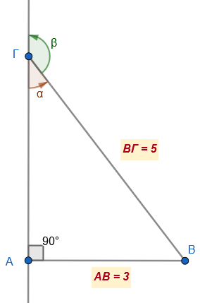

```{=html}
<!-- Φόρτωση βιβλιοθήκης GeoGebra -->
<script src="https://www.geogebra.org/apps/deployggb.js"></script>

<!-- Συνάρτηση δημιουργίας applets -->
<script>
function createGeoGebra(containerId, materialId, width = 700, height = 500) {
  var params = {
    "id": "ggb-" + containerId,
    "material_id": materialId,
    "width": width,
    "height": height,
    "showToolBar": true,
    "showMenuBar": false,
    "showAlgebraInput": true
  };
  
  var applet = new GGBApplet(params, '5.2');
  applet.inject(containerId);
}
</script>
```

## Τριγωνομετρικοί αριθμοί παραπληρωματικών γωνιών

Οι παραπληρωματικές γωνίες και οι τριγωνομετρικοί τους αριθμοί αποτελούν σημαντικό κεφάλαιο της γεωμετρίας και της τριγωνομετρίας, με ιδιαίτερη εφαρμογή στην επίλυση τριγώνων και στη μελέτη γεωμετρικών σχημάτων.

### **1. Θεωρία Παραπληρωματικών Γωνιών**

::: {style="background-color: #c98ba2; border: 2px solid #2f3e50; color: #25188a; padding: 15px; border-radius: 5px;"}
- **Ορισμός:** Δύο γωνίες ονομάζονται **παραπληρωματικές** όταν το άθροισμά τους είναι ίσο με **180°** (ή δύο ορθές γωνίες). Αν $\omega$ είναι μια γωνία, τότε η παραπληρωματική της είναι η γωνία $180° - \omega$.
- **Γεωμετρική Ιδιότητα:** Όταν δύο γωνίες είναι εφεξής και παραπληρωματικές, τότε οι μη κοινές πλευρές τους αποτελούν μια ευθεία γραμμή. Επίσης, οι διχοτόμοι δύο εφεξής παραπληρωματικών γωνιών είναι κάθετες μεταξύ τους.

**2. Τριγωνομετρικοί Αριθμοί Παραπληρωματικών Γωνιών**

- **Ημίτονο:** Το ημίτονο μιας αμβλείας γωνίας είναι **ίσο** με το ημίτονο της παραπληρωματικής της.

  - Σχέση: $ημ(180° - ω) = ημω$.

- **Συνημίτονο:** Το συνημίτινο μιας αμβλείας γωνίας είναι **ίσο** με το - συνημίτονο της παραπληρωματικής της.

  $$συν(180^\circ - ω) = -συνω$$

- **Σχέση με την Εφαπτομένη:** Λόγω της σχέσης $εφω = \dfrac{ημω}{συνω}$, η αλλαγή του προσήμου στο συνημίτονο επηρεάζει και την εφαπτομένη των παραπληρωματικών γωνιών, οι οποίες είναι επίσης αντίθετες: $$εφ(180^\circ - ω) = -εφω$$

<iframe src="https://www.geogebra.org/calculator/bea3e2eh?embed" width="730" height="600" allowfullscreen style="border: 1px solid #e4e4e4;border-radius: 4px;" frameborder="0">

</iframe>

> Μετακινήστε το σημείο P. Παρατηρήστε τι συμβαίνει με τους τριγωνομετρικούς αριθμούς των παραπληρωματικών γωνιών.

**Παράδειγμα:**

Αν έχουμε τη γωνία $ω = 60^\circ$, η παραπληρωματική της είναι η $120^\circ$.

- Γνωρίζουμε ότι $συν60^\circ = \dfrac{1}{2}$.

- Τότε, $συν120^\circ = -συν60^\circ = -\dfrac{1}{2}$.

Αυτή η ιδιότητα είναι ιδιαίτερα χρήσιμη στη γεωμετρία, για παράδειγμα στον υπολογισμό στοιχείων σε **αμβλυγώνια τρίγωνα** ή στη μελέτη **παραλληλογράμμων**, όπου οι διαδοχικές γωνίες είναι παραπληρωματικές.

- **Εμβαδόν Τριγώνου:** Η ιδιότητα αυτή επιτρέπει τον υπολογισμό του εμβαδού τριγώνου ακόμη και όταν η περιεχόμενη γωνία είναι αμβλεία. Το εμβαδό $E$ ενός τριγώνου με πλευρές $\beta, \gamma$ και περιεχόμενη γωνία $A$ δίνεται από τον τύπο $E = \frac{1}{2} \beta\gamma \eta\mu A$, ο οποίος ισχύει ανεξάρτητα από το αν η γωνία $A$ είναι οξεία, ορθή ή αμβλεία.
:::

### Ασκήσεις

Θυμήσου τους βασικούς κανόνες για γωνίες που έχουν άθροισμα $180^{\circ}$ (παραπληρωματικές):

1.  $\eta\mu(180^{\circ} - \omega) = \eta\mu\omega$ (Το ημίτονο παραμένει ίδιο)

2.  $\sigma\upsilon\nu(180^{\circ} - \omega) = -\sigma\upsilon\nu\omega$ (Το συνημίτονο αλλάζει πρόσημο)

3.  $\epsilon\phi(180^{\circ} - \omega) = -\epsilon\phi\omega$ (Η εφαπτομένη αλλάζει πρόσημο)

------------------------------------------------------------------------

1.  Να χαρακτηρίσετε τις παρακάτω ισότητες με $(\Sigma)$, αν είναι σωστές ή με $(\Lambda)$, αν είναι λανθασμένες:

$\alpha) \ \ \ \ \eta\mu 120^{\circ} = \eta\mu 60^{\circ}$ $\ \ \ [\quad]$

$\beta) \ \ \ \ \sigma\upsilon\nu 150^{\circ} = \sigma\upsilon\nu 30^{\circ}$ $\ \ \ [\quad]$

$\gamma) \ \ \ \  \epsilon\phi 110^{\circ} = -\epsilon\phi 70^{\circ}$ $\ \ \ [\quad]$

$\delta) \ \ \ \  \eta\mu 100^{\circ} = -\eta\mu 80^{\circ}$ $\ \ \ [\quad]$

$\epsilon) \ \ \ \  \sigma\upsilon\nu 140^{\circ} = -\sigma\upsilon\nu 40^{\circ}$ $\ \ \ [\quad]$

$\sigma\tau) \ \ \ \ \ \epsilon\phi 135^{\circ} = \epsilon\phi 45^{\circ}$ $\ \ \ [\quad]$

2.  Αν για τη γωνία $x$ ισχύει $0^{\circ} \leq x \leq 180^{\circ}$, να συμπληρώσετε τις παρακάτω προτάσεις:

$\alpha)$ Αν $\eta\mu x = \eta\mu 50^{\circ}$, τότε $x = 50^{\circ}$ ή $x = \dots\dots\dots$

$\beta)$ Αν $\sigma\upsilon\nu x = -\sigma\upsilon\nu 10^{\circ}$, τότε $x = \dots\dots\dots$

$\gamma)$ Αν $\epsilon\phi x = -\epsilon\phi 25^{\circ}$, τότε $x = \dots\dots\dots$

3.  Να συμπληρώσετε τον παρακάτω πίνακα αντιστοιχίζοντας σε κάθε τριγωνομετρικό αριθμό της στήλης Α τον ίσο του τριγωνομετρικό αριθμό από τη στήλη Β.

| Στήλη Α | Στήλη Β |
|:-----------------------------------|:-----------------------------------|
| $\alpha.$ $\eta\mu 160^{\circ}$ | $1.$ $\epsilon\phi 20^{\circ}$ |
| $\beta.$ $\sigma\upsilon\nu 160^{\circ}$ | $2.$ $\eta\mu 20^{\circ}$ |
| $\gamma.$ $\epsilon\phi 160^{\circ}$ | $3.$ $\sigma\upsilon\nu 20^{\circ}$ |
|  | $4.$ $-\eta\mu 20^{\circ}$ |
|  | $5.$ $-\sigma\upsilon\nu 20^{\circ}$ |
|  | $6.$ $-\epsilon\phi 20^{\circ}$ |

**Πίνακας Απαντήσεων:**

| $\alpha$ | $\beta$ | $\gamma$ |
|:---------|:--------|:---------|
|________  |________ |_________ |


4.  Να υπολογίσετε τους τριγωνομετρικούς αριθμούς ($\eta\mu, \sigma\upsilon\nu, \epsilon\phi$) των γωνιών:

$\alpha) \ \ \ \ 120^{\circ}$

$\beta) \ \ \ \  135^{\circ}$

$\gamma) \ \ \  150^{\circ}$

*(Υπόδειξη: Χρησιμοποίησε τις σχέσεις* $\eta\mu(180^{\circ}-\omega)=\eta\mu\omega$, $\sigma\upsilon\nu(180^{\circ}-\omega)=-\sigma\upsilon\nu\omega$ και τις τιμές των $30^{\circ}, 45^{\circ}, 60^{\circ}$)

5.  Να αποδείξετε ότι:

$\alpha)\ \ \ \  \eta\mu 140^{\circ} + \sigma\upsilon\nu 80^{\circ} - \eta\mu 40^{\circ} + \sigma\upsilon\nu 100^{\circ} = 0$

$\beta) \ \ \ \ \ \epsilon\phi 115^{\circ} + \epsilon\phi 65^{\circ} - \epsilon\phi 150^{\circ} \cdot \epsilon\phi 30^{\circ} = 1$

6.  Να αποδείξετε ότι:

$\alpha) \ \ \ \sigma\upsilon\nu^2 30^{\circ} + \sigma\upsilon\nu^2 150^{\circ} = 1,5$

$\beta)\ \ \ \  \eta\mu^2 45^{\circ} + \eta\mu^2 60^{\circ} + \eta\mu^2 120^{\circ} + \eta\mu^2 135^{\circ} = 2,5$

7.  Να αποδείξετε ότι:

$\eta\mu(110^{\circ} + x) = \eta\mu(70^{\circ} - x)$ και $\sigma\upsilon\nu(130^{\circ} - x) = -\sigma\upsilon\nu(50^{\circ} + x)$.

8.  Να βρείτε τη γωνία $x$ (όπου $0^{\circ} \leq x \leq 180^{\circ}$), όταν:

$\alpha) \ \ \ \eta\mu x = \dfrac{1}{2}$

$\beta) \ \ \ \ 2\eta\mu x = \sqrt{3}$

$\gamma) \ \ \ \  \sigma\upsilon\nu x = \dfrac{\sqrt{2}}{2}$

$\delta) \ \ \ \ \sigma\upsilon\nu x = -\dfrac{\sqrt{3}}{2}$

$\epsilon) \ \ \ \  \epsilon\phi x = -1$

$\sigma\tau) \ \ \ \ 3\epsilon\phi x = \sqrt{3}$

9.  Να αποδείξετε ότι οι απέναντι γωνίες ενός ρόμβου έχουν το ίδιο ημίτονο και το ίδιο συνημίτονο, ενώ οι διαδοχικές γωνίες έχουν το ίδιο ημίτονο αλλά αντίθετα συνημίτονα.

10. Δίνεται τετράπλευρο $ΑΒ\Gamma\Delta$ στο οποίο οι γωνίες $\widehat{A}$ και $\widehat{\Gamma}$ είναι παραπληρωματικές ($\widehat{A} + \widehat{\Gamma} = 180^{\circ}$).
    Να αποδείξετε ότι:

$\alpha) \ \ \ \ \eta\mu A - \eta\mu \Gamma = 0$ 

$\beta) \ \ \ \  \sigma\upsilon\nu A + \sigma\upsilon\nu \Gamma = 0$

11. Στο παρακάτω σχήμα να υπολογίσετε τους τριγωνομετρικούς αριθμούς της γωνίας $\hat α$ και της γωνίας $\hatβ$.\
    \
    

12. Δίνεται ισόπλευρο τρίγωνο $ΑΒ\Gamma$ πλευράς $8\text{ cm}$.
Στην πλευρά $Β\Gamma$ παίρνουμε σημείο $\Delta$ τέτοιο ώστε $Β\Delta = 3\text{ cm}$.

$\alpha)$ Να βρείτε το ύψος $ΑΗ$ του τριγώνου.

$\beta)$ Να υπολογίσετε το ημίτονο και το συνημίτονο της γωνίας $\omega = \widehat{A\Delta B}$ (εσωτερική) και της παραπληρωματικής της $\phi = \widehat{A\Delta \Gamma}$.

> Κάντε το σχήμα. 
Αφού υπολογίσετε το ύψος , υπολογίστε τους τριγωνομετρικούς αριθμούς της οξείας γωνίας από το ορθογώνιο τρίγωνο ΑΗΔ.

------------------------------------------------------------------------

$$\bbox[yellow, 5px]{\color{blue}\Large\text{---}}$$

::: {.callout-tip style="color: brown;"}
:::

::: {style="background-color: #d3deb8; border: 2px solid #2f3e50; color: #25188a; padding: 15px; border-radius: 5px;"}
:::

::: {.callout-tip style="color: brown;"}
ΚΑΛΗ ΜΕΛΕΤΗ!
:::

\
\
