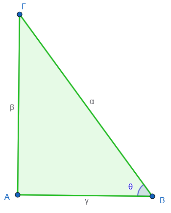

```{=html}
<!-- Φόρτωση βιβλιοθήκης GeoGebra -->
<script src="https://www.geogebra.org/apps/deployggb.js"></script>

<!-- Συνάρτηση δημιουργίας applets -->
<script>
function createGeoGebra(containerId, materialId, width = 700, height = 500) {
  var params = {
    "id": "ggb-" + containerId,
    "material_id": materialId,
    "width": width,
    "height": height,
    "showToolBar": true,
    "showMenuBar": false,
    "showAlgebraInput": true
  };
  
  var applet = new GGBApplet(params, '5.2');
  applet.inject(containerId);
}
</script>
```

## Σχέσεις μεταξύ τριγωνομετρικών αριθμών μιας γωνίας

Οι τριγωνομετρικοί αριθμοί μιας οξείας γωνίας $\theta$ (ημίτονο, συνημίτονο, εφαπτομένη) συνδέονται μεταξύ τους με θεμελιώδεις σχέσεις που προκύπτουν από τους ορισμούς τους σε ένα ορθογώνιο τρίγωνο.

### **Θεμελιώδεις Σχέσεις**

::: {style="background-color: #c98ba2; border: 2px solid #2f3e50; color: #25188a; padding: 15px; border-radius: 5px;"}
Οι κυριότερες σχέσεις μεταξύ των τριγωνομετρικών αριθμών μιας γωνίας $\theta$ (όπου $0^\circ < \theta < 90^\circ$) είναι οι εξής:

1.  $ημ^2θ + συν^2θ = 1$: Το άθροισμα των τετραγώνων του ημιτόνου και του συνημιτόνου μιας γωνίας ισούται πάντοτε με τη μονάδα.
    Η σχέση αυτή αποδεικνύεται με τη χρήση του Πυθαγορείου θεωρήματος σε ορθογώνιο τρίγωνο.\
    {width="245"}
    
    $ημθ=\dfrac{β}{α}\Rightarrow ημ^2θ=\dfrac{β^2}{α^2}$
    
    $συνθ=\dfrac{γ}{α}\Rightarrow ημ^2θ=\dfrac{γ^2}{α^2}$
    
    άρα  $ημ^2θ+συν^2θ=\dfrac{β^2}{α^2}+\dfrac{γ^2}{α^2}=\dfrac{β^2+γ^2}{α^2}=\dfrac{α^2}{α^2}=1$
    
    και $\dfrac{ημθ}{συνθ}=\dfrac{\dfrac{β}{α}}{\dfrac{γ}{α}}=\dfrac{β}{γ}=εφθ$

2.  $εφθ = \dfrac{ημθ}{συνθ}$: Η εφαπτομένη μιας γωνίας ισούται με το λόγο του ημιτόνου της προς το συνημίτονό της.

3.  **Σχέση Συμπληρωματικών Γωνιών**: Αν δύο οξείες γωνίες $\hat{B}$ και $\hat{\Gamma}$ είναι συμπληρωματικές (δηλαδή $B + \Gamma = 90^\circ$), τότε **το ημίτονο της μίας ισούται με το συνημίτονο της άλλης** ($ημ B = συνΓ$ και $συν B = ημΓ$).
:::

### **Τριγωνομετρικοί Αριθμοί Χαρακτηριστικών Γωνιών**

Οι τιμές για τις γωνίες $30^\circ$, $45^\circ$ και $60^\circ$ υπολογίζονται γεωμετρικά και συνοψίζονται στον ακόλουθο πίνακα:

| Γωνία $\theta$ | $\eta\mu\theta$ | $\sigma\upsilon\nu\theta$ | $\epsilon\phi\theta$ |
|:-----------------|:-----------------|:-----------------|:-----------------|
| $30^\circ$ | $1/2$ | $\sqrt{3}/2$ | $\sqrt{3}/3$ |
| $45^\circ$ | $\sqrt{2}/2$ | $\sqrt{2}/2$ | $1$ |
| $60^\circ$ | $\sqrt{3}/2$ | $1/2$ | $\sqrt{3}$ |

```{=html}
<a href="../../../Πίνακας%20Τριγωνομετρικών%20Αριθμών.html" target="_blank">
Εδώ θα βρείτε τους τριγωνομετρικούς πίνακες
</a>
  
```

### **Παραδείγματα και Εφαρμογές**

- **Υπολογισμός με βάση τη σχέση ημιτόνου-συνημιτόνου**: Αν γνωρίζουμε ότι $ημθ = 0,6$, μπορούμε να βρούμε το συνημίτονο χρησιμοποιώντας τη σχέση $ημ^2θ + συν^2θ = 1$.
  Έτσι, $0,6^2 + συν^2θ = 1 \Rightarrow 0,36 + συν^2θ = 1 \Rightarrow συν^2θ = 0,64 \Rightarrow συνθ = 0,8$.

- **Η γωνία** $30^\circ$ στο ορθογώνιο τρίγωνο: Σε κάθε ορθογώνιο τρίγωνο με γωνία $30^\circ$, η **απέναντι κάθετη πλευρά ισούται με το μισό της υποτείνουσας**.
  Αυτό εξηγεί γιατί $ημ 30^\circ = \dfrac{1}{2}$.

- **Εύρεση εφαπτομένης**: Αν σε ένα ορθογώνιο τρίγωνο οι κάθετες πλευρές είναι $3$ και $4$, τότε η εφαπτομένη της γωνίας $θ$ που είναι απέναντι από την πλευρά $3$ είναι $εφθ = \dfrac{3}{4} = 0,75$.

- **Ταυτότητες**: Μπορεί να αποδειχθεί ότι η παράσταση $συν^2θ(1 + εφ^2θ)$ ισούται με $1$, αφού $1 + εφ^2θ = 1 + \dfrac{ημ^2θ}{συν^2θ} = \dfrac{συν^2θ + ημ^2θ}{συν^2θ} = \dfrac{1}{συν^2}$.

Για οξείες γωνίες, οι τιμές του ημιτόνου και του συνημιτόνου βρίσκονται πάντα μεταξύ $0$ και $1$ ($0 < ημθ < 1$ και $0 < συνθ < 1$), ενώ η εφαπτομένη μπορεί να πάρει οποιαδήποτε θετική τιμή.

### Ασκήσεις

1.  Αν για την αμβλεία γωνία ω ισχύει $συνω=-\dfrac{3}{5}$ , τότε να υπολογιστούν οι άλλοι τριγωνομετρικοί αριθμοί της γωνίας ω.

> *Από την ταυτότητα* $ημ^2θ + συν^2θ = 1 \Rightarrow ........$

2.  Αν για την οξεία γωνία ω ισχύει $εφω = 10$, τότε να υπολογιστούν οι άλλοι τριγωνομετρικοί αριθμοί της γωνίας ω.

> *Από την ταυτότητα* $εφθ = \dfrac{ημθ}{συνθ} \Rightarrow ........$ και μετά από την $ημ^2θ + συν^2θ = 1 \Rightarrow ........$

3.  Να αποδειχθούν οι ταυτότητες:

- α) $(ημx + συνx)^2 - 2ημxσυνx = 1$
- β) $(ημ x + συν x)^2 + (ημ x - συν x)^2 + εφ^2x = \dfrac{1}{συν^2x} + 1$

> Βοήθεια

> 1.  **Αριστερό Μέλος:** Ξεκίνα αναπτύσσοντας τις δύο ταυτότητες $(α+β)^2$ και $(α-β)^2$ στην αρχή.
> 2.  **Απλοποίηση:** Θα δεις ότι κάποιοι όροι διαγράφονται και εμφανίζεται το $ημ^2x + συν^2x$, το οποίο ισούται με $1$.
> 3.  **Εφαπτομένη:** Θυμήσου ότι $εφ^2x = \dfrac{ημ^2x}{συν^2x}$.
> 4.  **Σύγκριση:** Στο τέλος, προσπάθησε να φέρεις την παράσταση στη μορφή που έχει το δεξί μέλος.

4.  Αν για μια οξεία γωνία $x$ γνωρίζουμε ότι $ημ x = 0,4$, να υπολογίσετε το $συν x$ χρησιμοποιώντας τη σχέση $ημ^2 x + συν^2 x = 1$ καθώς και την $εφx$.

5.  Αν σε μια οξεία γωνία $\theta$ ισχύει $συν θ = \dfrac{5}{13}$ να βρείτε την $εφθ$.

6.  Να δείξετε ότι σε κάθε ορθογώνιο τρίγωνο $ABΓ$ ($\hat{A}=90^\circ$) ισχύει: $\dfrac{ημ B + συνΓ}{ημΓ + συν B} = εφ B$.

7.  Να απλοποιήσετε την παράσταση $A = ημ^2 α (1 + \dfrac{1}{εφ^2α}) + συν^2 α (1 + εφ^2 α)$ και να δείξετε ότι ισούται με $2$.

8.  Αν $ημ 65^\circ = συν x$, να υπολογίσετε την τιμή της οξείας γωνίας $x$.

9.  Να συμπληρώσετε τις παρακάτω σχέσεις:

- (α) $συν 50^\circ = ημ \dots$ και
- (β) $ημ 10^\circ = συν \dots$.

10. Να αποδείξετε ότι αν $α + β = 90^\circ$, τότε $ημ^2 α + ημ^2 β = 1$.

11. Να βρείτε την αριθμητική τιμή της παράστασης: $S = ημ 30^\circ \cdot συν 60^\circ + συν 30^\circ \cdot ημ 60^\circ$.

12. Να δείξετε ότι $(ημ 30^\circ)^2 + (ημ 45^\circ)^2 + (ημ 60^\circ)^2 = \dfrac{3}{2}$.

13. Να υπολογίσετε την τιμή της παράστασης $(εφ 30^\circ)^2 + (εφ 45^\circ)^2 + (εφ 60^\circ)^2$.

14. Να υπολογίσετε την οξεία γωνία $\omega$ αν γνωρίζετε ότι $4εφ ω = 4$.

15. Να βρείτε την οξεία γωνία $x$ που επαληθεύει την εξίσωση $2συν x - 1 = 0$.

16. Να αποδείξετε ότι σε κάθε ορθογώνιο τρίγωνο με γωνία $30^\circ$, η απέναντι κάθετη πλευρά είναι ίση με το μισό της υποτείνουσας.

17. Να χαρακτηρίσετε τις παρακάτω ισότητες με $(\Sigma)$, αν είναι σωστές ή με $(\Lambda)$, αν είναι λανθασμένες:

- **α)** Αν $ημ^2ω = \dfrac{7}{10}$, τότε $συν^2 ω = \dfrac{3}{10}$ $\quad \ \ \ [\quad \quad  \quad ]$.

- **β)** Αν $ημω = 0$, τότε $εφω$ ισούται πάντα με $1$ $\quad \ \ \ [\quad \quad  \quad ]$.

- **γ)** Για κάθε γωνία $ω$ ισχύει $ημ^2ω + συν^2ω = 1$ $\quad \ \ \ [\quad \quad  \quad ]$.

- **δ)** Αν $ημω = \dfrac{3}{5}$ και $συνω = \dfrac{4}{5}$, τότε $εφω = \dfrac{4}{3}$ $\quad \ \ \ [\quad \quad  \quad ]$.

18. Η Μαρία ισχυρίζεται ότι μπορεί να βρει μια γωνία $ω$ τέτοια ώστε $ημω = 1$ και $συνω = 1$.
    Έχει δίκιο; Να αιτιολογήσετε την απάντησή σας χρησιμοποιώντας τη βασική τριγωνομετρική ταυτότητα $ημ^2ω + συν^2ω = 1$.

19. Να συμπληρώσετε τα κενά στις παρακάτω προτάσεις:

- **α)** Αν $συνω = 1$, τότε $ημω =$ ...........

- **β)** Αν $συνω = 0$, τότε $ημω =$ ...........
  ή ...........

20. Να επιλέξετε τη σωστή απάντηση. Αν $ημω = \dfrac{12}{13}$, τότε το $συνω$ είναι ίσο με:

- **α)** $\dfrac{1}{13}$

- **β)** $\dfrac{5}{13}$

- **γ)** $\dfrac{5}{13}$ ή $-\dfrac{5}{13}$

- **δ)** $\dfrac{12}{5}$ ή $-\dfrac{12}{5}$

21. Αν για την οξεία γωνία $\omega$ ισχύει $ημω = \dfrac{3}{5}$, τότε να υπολογίσετε τους άλλους τριγωνομετρικούς αριθμούς της γωνίας $\omega$.

22. Αν για την αμβλεία γωνία $\omega$ ισχύει $συνω = -\dfrac{4}{5}$, τότε να υπολογίσετε τους άλλους τριγωνομετρικούς αριθμούς της γωνίας $\omega$.

23. Αν για την οξεία γωνία $\omega$ ισχύει $εφω= \dfrac{5}{12}$, τότε να υπολογίσετε τους άλλους τριγωνομετρικούς αριθμούς της γωνίας $\omega$.

24. Αν για την αμβλεία γωνία $\omega$ ισχύει $ημω = \dfrac{12}{13}$, τότε να υπολογίσετε την τιμή της παράστασης: $$B = 2ημω - 5συνω + 12εφω$$

25. Να αποδείξετε ότι:

- **α)** $συν^3ω + συνω \cdot ημ^2ω = συνω$
- **β)** $ημ^2ω - ημ^4ω = ημ^2ω \cdot συν^2ω$

26. Αν είναι $x = 4συνω$ και $y = 4ημω$, τότε να αποδείξετε ότι:

$x^2 + y^2 = 16$

27. Να αποδείξετε ότι:

- **α)** $1 - 2ημ^2α = συν^2α - ημ^2α$
- **β)** $(ημα \cdot ημβ)^2 + (ημα \cdot συνβ)^2 + συν^2α = 1$

28. Να αποδείξετε ότι:

- **α)** $(ημω + συνω)^2 - 2ημω \cdot συνω = 1$
- **β)** $(α \cdot ημω - β \cdot συνω)^2 + (α \cdot συνω + β \cdot ημω)^2 = α^2 + β^2$

29. Να αποδείξετε ότι:

- **α)** $\dfrac{1}{συν^2x} - εφ^2x = 1$
- **β)** $\dfrac{ημ x}{1 + συν x} + \dfrac{1 + συν x}{ημ x} = \dfrac{2}{ημ x}$

30. Να αποδείξετε ότι:

- **α)** $\dfrac{συν^2x}{1 - ημ x} = 1 + ημ x$
- **β)** $\dfrac{ημ x \cdot συν x}{1 - ημ^2x} = εφ x$

31. Να υπολογίσετε τις παραστάσεις:

- **α)** $ημ^2 40^\circ + ημ^2 50^\circ$

> (Υπόδειξη: $50^\circ = 90^\circ - 40^\circ$)

- **β)** $συν 20^\circ + συν 160^\circ$

32. Να αποδείξετε ότι:

- **α)** $εφ 30^\circ \cdot συν 30^\circ - ημ 30^\circ = 0$
- **β)** $ημ^2 150^\circ + συν^2 30^\circ = 1$

33. Αν είναι $α = 45^\circ$ και $β = 45^\circ$, τότε να αποδείξετε ότι: $$ημα \cdot συνβ + συνα \cdot ημβ = 1$$

34. Μια γωνία $\omega$ είναι αμβλεία.
    Αν το ημίτονό της είναι $ημω = \dfrac{\kappa}{\kappa+1}$ και το συνημίτονό της είναι $συνω = -1$, ποια είναι η γωνία $\omega$ και ποια η τιμή του $\kappa$;

> (Υπόδειξη: Σκεφτείτε τις γωνίες $90^\circ, 180^\circ$).

------------------------------------------------------------------------

$$\bbox[yellow, 5px]{\color{blue}\Large\text{---}}$$

::: {.callout-tip style="color: brown;"}
:::

::: {style="background-color: #d3deb8; border: 2px solid #2f3e50; color: #25188a; padding: 15px; border-radius: 5px;"}
:::

::: {.callout-tip style="color: brown;"}
ΚΑΛΗ ΜΕΛΕΤΗ!
:::

\
\
