```{=html}
<!-- Φόρτωση βιβλιοθήκης GeoGebra -->
<script src="https://www.geogebra.org/apps/deployggb.js"></script>

<!-- Συνάρτηση δημιουργίας applets -->
<script>
function createGeoGebra(containerId, materialId, width = 700, height = 500) {
  var params = {
    "id": "ggb-" + containerId,
    "material_id": materialId,
    "width": width,
    "height": height,
    "showToolBar": true,
    "showMenuBar": false,
    "showAlgebraInput": true
  };
  
  var applet = new GGBApplet(params, '5.2');
  applet.inject(containerId);
}
</script>
```

## Νόμος των ημιτόνων - Νόμος των συνημιτόνων

### Νόμος των Ημιτόνων

::: {style="background-color: #c98ba2; border: 2px solid #2f3e50; color: #25188a; padding: 15px; border-radius: 5px;"}
**Θεωρία:** Σε κάθε τρίγωνο $ABΓ$ με πλευρές $α, β, γ$ και αντίστοιχες γωνίες $A, B, Γ$, ισχύει η σχέση: $$\frac{α}{ημ A} = \frac{β}{ημΒ} = \frac{γ}{ημΓ} = 2R$$ όπου $R$ είναι η ακτίνα του περιγεγραμμένου κύκλου του τριγώνου.

**Απόδειξη:**

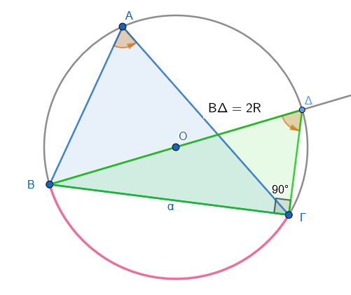{width="344"}

1.  Θεωρούμε τον περιγεγραμμένο κύκλο του τριγώνου $ABΓ$ με κέντρο $O$ και ακτίνα $R$.
2.  Φέρουμε τη διάμετρο $BΔ = 2R$. Τότε το τρίγωνο $BΔΓ$ είναι ορθογώνιο στη γωνία $Γ$ (εγγεγραμμένη σε ημικύκλιο).
3.  Στο ορθογώνιο τρίγωνο $BΔΓ$, η γωνία $Δ$ είναι ίση με τη γωνία $A$ (βαίνουν στο ίδιο τόξο $BΓ$).
4.  Έχουμε $ημΔ = ημΑ = \dfrac{α}{2R}$, άρα $\dfrac{α}{ημ A} = 2R$.
5.  Με όμοιο τρόπο αποδεικνύονται οι σχέσεις για τις άλλες πλευρές.

**Παράδειγμα:**

> [Μπορούμε να χρησιμοποιήσουμε την σχέση αναλογίας των ημιτόνων για υπολογισμούς στοιχείων σε τρίγωνο]{style="color:green;"}.

Σε τρίγωνο $ABΓ$ δίνονται $A = 30^\circ, \ \ \ α = 5$ και $B = 45^\circ$.
Να βρεθεί η πλευρά $β$.

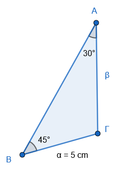

*Λύση:*

$\dfrac{5}{ημ 30^\circ} = \dfrac{β}{ημ 45^\circ} \Rightarrow \dfrac{5}{1/2} = \dfrac{β}{\sqrt{2}/2} \Rightarrow 10 = \dfrac{2\beta}{\sqrt{2}} \Rightarrow \beta = 5\sqrt{2}$.
:::

------------------------------------------------------------------------

### Νόμος των Συνημιτόνων

::: {style="background-color: #c98ba2; border: 2px solid #2f3e50; color: #25188a; padding: 15px; border-radius: 5px;"}
**Θεωρία:** Σε κάθε τρίγωνο $AB\Gamma$ ισχύουν οι σχέσεις:

1.  $α^2 = β^2 + γ^2 - 2βγ συν A$
2.  $β^2 = α^2 + γ^2 - 2αγ συν B$
3.  $γ^2 = α^2 + β^2 - 2αβ συνΓ$

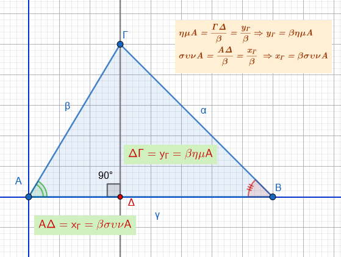{width="425"}

**Απόδειξη:**

1.  Τοποθετούμε το τρίγωνο σε καρτεσιανό σύστημα συντεταγμένων με την κορυφή $A$ στο $(0,0)$ και την πλευρά $γ$ πάνω στον άξονα $x$.

2.  Οι συντεταγμένες των κορυφών είναι: $A(0,0)$, $B(γ, 0)$, $Γ(β συν A, β ημ A)$.

3.  Χρησιμοποιούμε τον τύπο της απόστασης για την πλευρά $α$ (απόσταση $BΓ$):

$α^2 = (γ-β συν A )^2 + (β ημ A - 0)^2$

4.  $α^2 = γ^2+β^2 συν^2 A - 2βγ συν A + β^2 ημ^2 A  \Rightarrow$

$α^2 = γ^2+β^2 (συν^2 A+ημ^2Α) - 2βγ συν A$

5.  Επειδή $ημ^2 A + συν^2 A = 1$, προκύπτει: $α^2 = β^2 + γ^2 - 2βγ συν A$.

**Παράδειγμα:**

> [Μπορούμε να χρησιμοποιήσουμε τον νόμο των συνημιτόνων για υπολογισμούς στοιχείων σε τρίγωνο]{style="color:green;"}.

Σε τρίγωνο $ABΓ$ είναι $β = 3, γ = 5$ και $A = 60^\circ$.

Να βρεθεί η πλευρά $\alpha$.

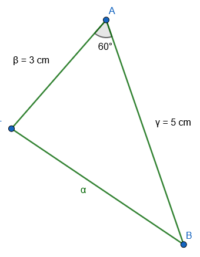{width="223"}

*Λύση:*

$α^2 = 3^2 + 5^2 - 2(3)(5) συν 60^\circ  \Rightarrow$

$α^2 = 9 + 25 - 30(0.5)   \Rightarrow$

$α^2 = 34 - 15 = 19 \Rightarrow α = \sqrt{19}$.
:::

### Ασκήσεις

1.  Στο παρακάτω τρίγωνο, όπου οι γωνίες είναι $64^\circ$ και $70^\circ$ και οι απέναντι πλευρές είναι $α$ και $β$ αντίστοιχα, να γράψετε τον νόμο των ημιτόνων.\

    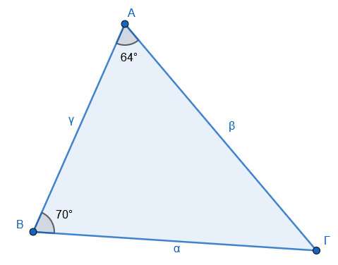{width="322"}

2.  Σε ένα τρίγωνο $ABΓ$ με σημείο $Δ$ επί της πλευράς $BΓ$:

- α) Να γράψετε τον νόμο των ημιτόνων στο τρίγωνο $ABΔ$, αν η γωνία $\widehat{ΒΑΔ} = 30^\circ$ .

- β) Να γράψετε τον νόμο των ημιτόνων στο τρίγωνο $AΔΓ$, αν η γωνία $\widehat{ΓΑΔ} = 45^\circ$ και η γωνία $\widehat{ΓΔΑ} = 88^\circ$.\

  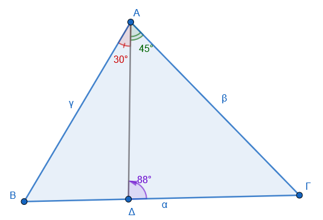{width="385"}

3.  Να χαρακτηρίσετε τις παρακάτω ισότητες με ($\Sigma$), αν είναι σωστές ή με ($\Lambda$), αν είναι λανθασμένες:

> [κάντε τα σχήματα σύμφωνα με τα δεδομένα]{style="color:green;"}.

- α) Σε κάθε τρίγωνο $ABΓ$ ισχύει $α \cdot ημΓ = γ \cdot ημΑ$..............................................................$[\ \quad \quad \quad ]$.

- β) Αν σε τρίγωνο $ABΓ$ είναι $\hat{B} = 40^\circ, \hat{Γ} = 80^\circ$, τότε $\dfrac{β}{ημ 40^\circ} = \dfrac{α}{ημ 60^\circ}$ ..........................$[\ \quad \quad \quad ]$.

- γ) Σε κάθε τρίγωνο $ABΓ$ ισχύει $2βγ συν A = β^2 + γ^2 - α^2$ ................................................$[\ \quad \quad \quad ]$.

- δ) Αν σε τρίγωνο $ABΓ$ είναι $\hat{A} = 50^\circ$, τότε ισχύει $α^2 = β^2 + γ^2 - 2 \ β \ γ \ συν 50^\circ$ ........$[\ \quad \quad \quad ]$.

- ε) Αν σε τρίγωνο $ABΓ$ είναι $\hat{A} = 120^\circ$, τότε ισχύει $α^2 = β^2 + γ^2 + βγ$ .........................$[\ \quad \quad \quad ]$.

4.  Να συμπληρώσετε τις παρακάτω ισότητες σύμφωνα με το νόμο των συνημιτόνων για ένα τρίγωνο με πλευρές $a, β, γ$ και γωνίες $\hat{A} = 50^\circ$ απέναντι από την πλευρά $α$ και $\hat Γ=70^ο$ απέναντι από την πλευρά $γ$:

> [κάντε τα σχήματα σύμφωνα με τα δεδομένα]{style="color:green;"}.

- $α^2 = \dots$

- $β^2 = \dots$

- $γ^2 = \dots$

5.  Να συμπληρώσετε τις παρακάτω προτάσεις:

> [κάντε τα σχήματα σύμφωνα με τα δεδομένα]{style="color:green;"}.

- α) Η γωνία $\hat B$ σε τρίγωνο $ΑΒΓ$ με πλευρές $AB=7, BΓ=8 \text{  και  } ΑΓ=9$ υπολογίζεται με τον νόμο των ..................
  από την ισότητα ..............................

- β) Η πλευρά $ΑΓ$ σε τρίγωνο $ΑΒΓ$ με πλευρές $ΑΒ=6, ΒΓ=9$ και περιεχόμενη γωνία $45^\circ$ υπολογίζεται με τον νόμο των ...............
  από την ισότητα ..................

- γ) Η γωνία $\hat Γ$ σε τρίγωνο $ΑΒΓ$ με πλευρές $ΑΒ=5, ΑΓ=5, ΒΓ=8$ υπολογίζεται με τον νόμο των ................
  από την ισότητα ....
  ............

- δ) Η πλευρά $AB$ σε τρίγωνο ΑΒΓ με γωνίες $\hat A=50^\circ, \hat Γ=80^\circ$ και πλευρά ΑΓ=10 cm υπολογίζεται με τον νόμο των ......................
  από την ισότητα .................

6.  Να υπολογίσετε το $x$ στα παρακάτω τρίγωνα:

> [κάντε τα σχήματα σύμφωνα με τα δεδομένα]{style="color:green;"}.

- α) Τρίγωνο με πλευρές $5$ και $x$ και απέναντι γωνίες $60^\circ$ και $45^\circ$ αντίστοιχα.

- β) Τρίγωνο με πλευρά $20$ απέναντι από γωνία $120^\circ$, και πλευρά $x$ απέναντι από γωνία $30^\circ$.

- γ) Τρίγωνο με πλευρές $10$ και $x$ και απέναντι γωνίες $75^\circ$ και $30^\circ$ αντίστοιχα.

7.  Να υπολογίσετε το $x$ στα παρακάτω τρίγωνα (εφαρμόζοντας τον νόμο των συνημιτόνων):

> [κάντε τα σχήματα σύμφωνα με τα δεδομένα]{style="color:green;"}

- α) Τρίγωνο με πλευρές $6$ και $9$ και περιεχόμενη γωνία $60^\circ$.

- β) Τρίγωνο με πλευρές $4\sqrt{2}$ και $5$ και περιεχόμενη γωνία $135^\circ$.

- γ) Τρίγωνο με πλευρές $7$ και $8$ και περιεχόμενη γωνία $45^\circ$.

8.  Να υπολογίσετε τις υπόλοιπες γωνίες του τριγώνου $ABΓ$, όταν:

- α) $α = 3$, $β = 3\sqrt{3}$ και $\hat{A} = 30^\circ$.

- β) $β = \sqrt{2}$, $γ = 2$ και $\hat{Γ} = 45^\circ$.

9.  Αν σε τρίγωνο $ABΓ$ είναι $\hat{A} = 45^\circ$, $α = 2\sqrt{2}$ και $β = 2$, τότε να αποδείξετε ότι το τρίγωνο είναι ορθογώνιο.

10. Να υπολογίσετε το μήκος της διαδρομής $x=ΔΓ$ ενός τελεφερίκ που ξεκινά από την ***ΑΡΧΗ ΤΕΛΕΦΕΡΙΚ*** , σε σημείο που απέχει $ΔΕ=400$ m από τη βάση του βουνού, αν η γωνία της κορυφής είναι $ΔΓΕ=10^\circ$ και η γωνία της κλίσης της διαδρομής ως προς το οριζόντιο έδαφος είναι $ΕΔΓ=30^\circ$.\

    \
    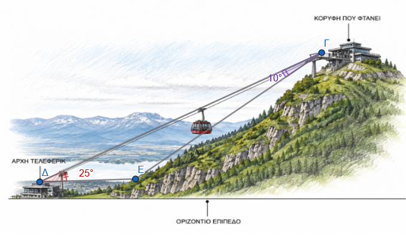

11. Ένας μαθητής λέει ότι βρήκε ένα τρίγωνο $ABΓ$ με $α = 5$, $β = 15$ και $\hat{A} = 120^\circ$.
    Γιατί ο καθηγητής του είπε ότι είναι αδύνατο να υπάρχει τέτοιο τρίγωνο;

12. Δύο δυνάμεις $F_1, F_2$ έχουν συνισταμένη $F = 20$ N.
    Η δύναμη $F_1$ σχηματίζει με τη συνισταμένη $F$ γωνία $30^\circ$, ενώ η δύναμη $F_2$ σχηματίζει με τη συνισταμένη $F$ γωνία $45^\circ$.

Να υπολογίσετε τα μέτρα των δυνάμεων $F_1$ και $F_2$.\
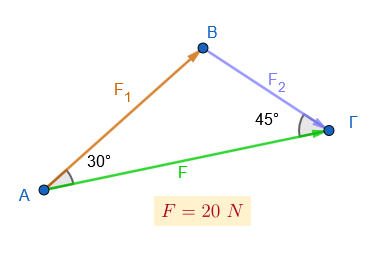

13. Ένας τοπογράφος θέλει να μετρήσει το ύψος ενός πύργου.
    Από το σημείο $A$ μετράει τη γωνία ανύψωσης $40^\circ$.
    Μετακινείται κατά $20$ m πλησιέστερα προς τον πύργο (σημείο $B$) και μετράει γωνία $55^\circ$.
    Αν το γωνιόμετρο βρίσκεται σε ύψος $1.5$ m από το έδαφος, ποιο είναι το ύψος του πύργου;\
    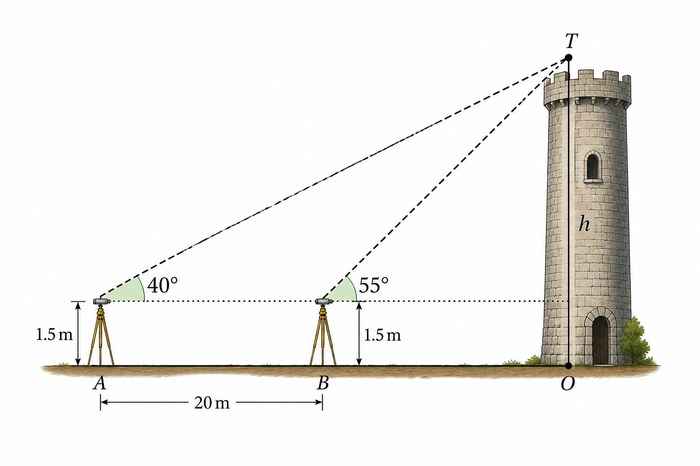{width="452"}\

14. Να υπολογίσετε τά $λ$ και $θ$ στις παρακάτω περιπτώσεις :

- α) Τρίγωνο με πλευρές $2\sqrt{3}, 4$ και γωνία $30^\circ$ μεταξύ τους.\
  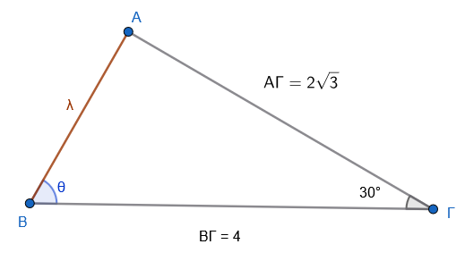{width="386"}

- β) Τρίγωνο με πλευρές $5, 6$ και $8$.\
  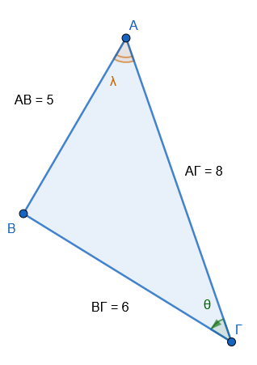{width="260"}

- γ) Τρίγωνο με πλευρές $4, 7$ και γωνία $120^\circ$ μεταξύ τους.\
  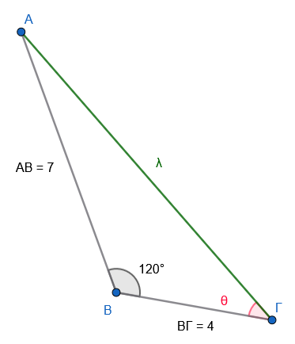{width="306"}

- δ) Τρίγωνο με πλευρές $10, 11$ και $15$.\
  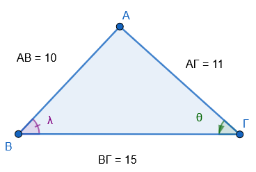

15. Να υπολογίσετε τις ίσες πλευρές $\beta, \gamma$ ισοσκελούς τριγώνου $AB\Gamma$, αν η γωνία $\hat{A} = 90^\circ$ και η βάση $\alpha = 6\sqrt{2}$.

> [κάντε το σχήμα σύμφωνα με τα δεδομένα]{style="color:green;"}

16. Σε κύκλο με ακτίνα $R = 8$ cm, η χορδή $AB$ αντιστοιχεί σε επίκεντρη γωνία $60^\circ$. Να υπολογίσετε το μήκος της χορδής $AB$.

> [κάντε το σχήμα σύμφωνα με τα δεδομένα]{style="color:green;"}

17. Να υπολογίσετε τις διαγωνίους παραλληλογράμμου $ABΓΔ$ με πλευρές $AB = 5$, $BΓ = 4$ και γωνία $\hat{A} = 60^\circ$.

> [κάντε το σχήμα σύμφωνα με τα δεδομένα]{style="color:green;"}

18. Μια εταιρεία θέλει να κατασκευάσει σήραγγα μεταξύ των σημείων $A$ και $B$. Ένας μηχανικός μετράει από το σημείο $M$ την απόσταση $MA = 200$ m, $MB = 150$ m και τη γωνία $\widehat{AMB} = 60^\circ$. Να υπολογίσετε το μήκος της σήραγγας $AB$.\
    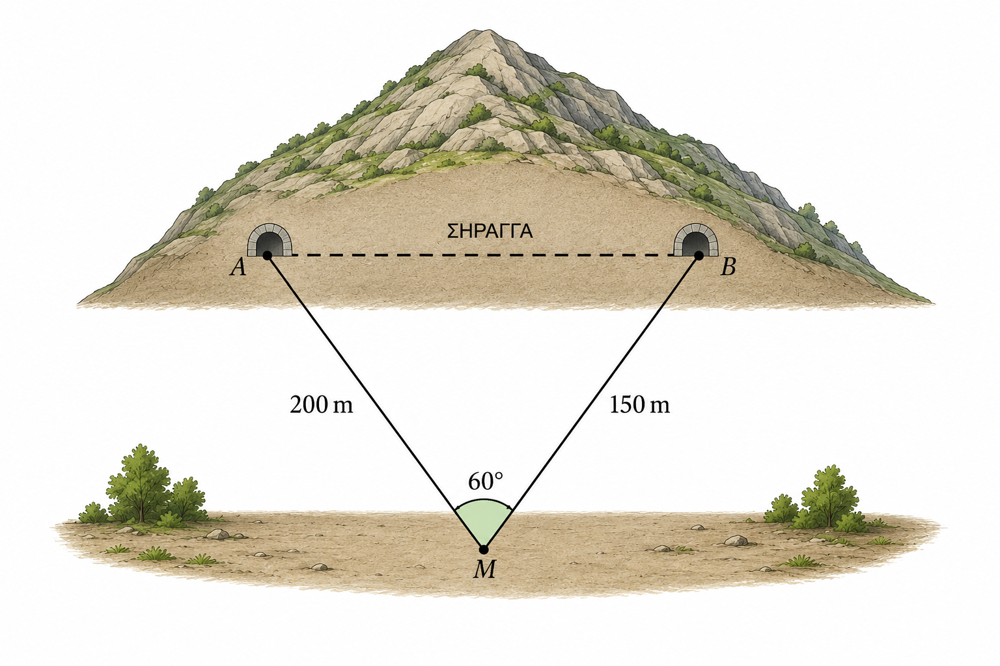

19. Ένας τεχνικός στηρίζει μια μεταλλική κατασκευή με δύο βέργες $AB = 0.50$ m και $BΓ = 1.20$ m.
Αν η γωνία μεταξύ τους είναι $120^\circ$, να υπολογίσετε το μήκος της τρίτης πλευράς $AΓ$ που απαιτείται για να κλείσει το τρίγωνο.

> [κάντε το σχήμα σύμφωνα με τα δεδομένα]{style="color:green;"}


20.  Σε ένα τρίγωνο $ΑΒΓ$, αν μια πλευρά είναι $6$ και η απέναντι γωνία της $50^\circ$, υπολογίστε την πλευρά $x$ που βρίσκεται απέναντι από γωνία $45^\circ$.

> [κάντε το σχήμα σύμφωνα με τα δεδομένα]{style="color:green;"}

21. Σε τρίγωνο με πλευρές $10$ και $5$, αν η γωνία απέναντι από την πλευρά $5$ είναι $30^\circ$, βρείτε τη γωνία $x$ που βρίσκεται απέναντι από την πλευρά $10$.

> [κάντε το σχήμα σύμφωνα με τα δεδομένα]{style="color:green;"}

22. Δίνονται οι πλευρές $α = 5$, $β= \sqrt{3}$ και η γωνία $\hat{B} = 50^\circ$. Υπολογίστε τις υπόλοιπες γωνίες του τριγώνου.

> [κάντε το σχήμα σύμφωνα με τα δεδομένα]{style="color:green;"}

23. Σε τρίγωνο $ΑΒΓ$ δίνονται $β = 7$ cm, $γ = 5$ cm και η περιεχόμενη γωνία $\hat{A} = 60^\circ$. Βρείτε την πλευρά $α$.

> [κάντε το σχήμα σύμφωνα με τα δεδομένα]{style="color:green;"}

24. Σε τρίγωνο $ΑΒΓ$ οι πλευρές είναι $α = \sqrt{13}$, $β = 4$ και $γ = 3$. Υπολογίστε τη γωνία $\hat{A}$.

> [κάντε το σχήμα σύμφωνα με τα δεδομένα]{style="color:green;"}

25. Αν σε ένα τρίγωνο ισχύει η σχέση $α^2 = β^2 + γ^2 - βγ\sqrt{3}$, βρείτε το μέτρο της γωνίας $\hat{A}$.

26. Σε τρίγωνο $ΑΒΓ$ δίνονται $α = 3$, $β = 5$ και η γωνία $\hat{Γ} = 135^\circ$. Υπολογίστε την πλευρά $γ$.

> [κάντε το σχήμα σύμφωνα με τα δεδομένα]{style="color:green;"}

27. Σε τρίγωνο $ΑΒΓ$ είναι $α = 2γ$ και $β = γ\sqrt{7}$. Υπολογίστε τη γωνία $\hat{B}$.


28. Βρείτε την πλευρά $x$ ενός τριγώνου όταν οι άλλες δύο πλευρές είναι $3$ και $4$ και η περιεχόμενη γωνία τους είναι $60^\circ$.

---

$$\bbox[yellow, 5px]{\color{blue}\Large\text{---}}$$

::: {.callout-tip style="color: brown;"}
:::

::: {style="background-color: #d3deb8; border: 2px solid #2f3e50; color: #25188a; padding: 15px; border-radius: 5px;"}
:::

::: {.callout-tip style="color: brown;"}
ΚΑΛΗ ΜΕΛΕΤΗ!
:::

\
\
