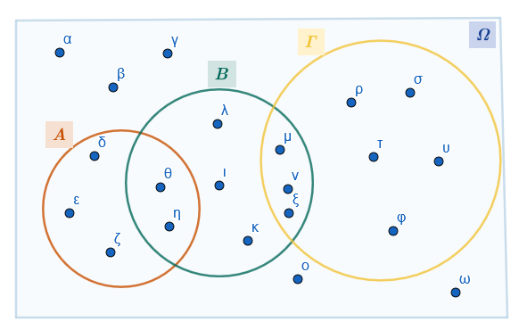

```{=html}
<!-- Φόρτωση βιβλιοθήκης GeoGebra -->
<script src="https://www.geogebra.org/apps/deployggb.js"></script>

<!-- Συνάρτηση δημιουργίας applets -->
<script>
function createGeoGebra(containerId, materialId, width = 700, height = 500) {
  var params = {
    "id": "ggb-" + containerId,
    "material_id": materialId,
    "width": width,
    "height": height,
    "showToolBar": true,
    "showMenuBar": false,
    "showAlgebraInput": true
  };
  
  var applet = new GGBApplet(params, '5.2');
  applet.inject(containerId);
}
</script>
```

## Σύνολα

Η θεωρία των συνόλων αποτελεί θεμελιώδη και πρωταρχική έννοια στα Μαθηματικά, καθώς πάνω σε αυτήν βασίζονται σχεδόν όλοι οι υπόλοιποι κλάδοι.
Ακολουθεί η ανάλυση των βασικών εννοιών, ορισμών και πράξεων.

### **1. Η έννοια του συνόλου**

::: {style="background-color: #d5f4e6; border: 2px solid #2f3e50; color: #25188a; padding: 15px; border-radius: 5px;"}
Σύμφωνα με τον μαθηματικό Georg Cantor, ο οποίος θεωρείται ο θεμελιωτής της θεωρίας συνόλων, **σύνολο** είναι κάθε συλλογή αντικειμένων που προέρχεται από την εμπειρία ή τη διανόησή μας, είναι καλά ορισμένη και τα αντικείμενά της διακρίνονται το ένα από το άλλο.

- Τα αντικείμενα που αποτελούν ένα σύνολο ονομάζονται **στοιχεία** του.

- Για να είναι ένα σύνολο «καλά ορισμένο», πρέπει να υπάρχει ένα κριτήριο με το οποίο να μπορούμε να αποφασίσουμε με βεβαιότητα αν ένα αντικείμενο ανήκει ή όχι σε αυτό.

- Συνήθως συμβολίζουμε τα σύνολα με κεφαλαία γράμματα ($A, B, \Omega$) και τα στοιχεία τους με πεζά ($a, b, x$).

Παράδειγμα:

$Α=\{α, β, γ, δ\}$, $Μ=\{5,10,15,20, ....\}$
:::

### **2. Τα σύμβολα** $\in$ και $\notin$

::: {style="background-color: #d5f4e6; border: 2px solid #2f3e50; color: #25188a; padding: 15px; border-radius: 5px;"}
Τα σύμβολα αυτά δηλώνουν τη σχέση ενός στοιχείου με ένα σύνολο:\

- Αν ένα αντικείμενο $x$ είναι στοιχείο ενός συνόλου $A$, γράφουμε $x \in A$ και διαβάζουμε «το $x$ **ανήκει** στο $A$».\
- Αν το $x$ δεν είναι στοιχείο του συνόλου $A$, γράφουμε $x \notin A$ και διαβάζουμε «το $x$ **δεν ανήκει** στο $A$».

Παράδειγμα: Αν $Β=\{1,3,5,7,9, .....\}$ και $Τ=\{ \dfrac{1}{2},\dfrac{1}{3},\dfrac{1}{4},\dfrac{1}{5}, .....\}$

Τότε $5\in B$,$\quad$ $4 \notin T$,$\quad$ $5 \in \mathbb Q$,$\quad$ $-3 \notin \mathbb N$,$\quad$ $\sqrt{3} \notin \mathbb Q$,$\quad$ $\sqrt{3} \in \mathbb R$
:::

### **3. Παράσταση συνόλου**

::: {style="background-color: #d5f4e6; border: 2px solid #2f3e50; color: #25188a; padding: 15px; border-radius: 5px;"}
Υπάρχουν τρεις βασικοί τρόποι για να παραστήσουμε ένα σύνολο:

1.  **Με αναγραφή των στοιχείων του**: Γράφουμε όλα τα στοιχεία του ανάμεσα σε άγκιστρα, χωρίζοντάς τα με κόμματα.
    Π.χ.
    $A = \{1, 2, 3\}$.

2.  **Με περιγραφή της ιδιότητας των στοιχείων του**: Γράφουμε ανάμεσα σε άγκιστρα μια ιδιότητα που χαρακτηρίζει αποκλειστικά τα στοιχεία του συνόλου.
    Π.χ.
    $B = \{x \in \mathbb{N} \mid x < 5\}$.

    Το σύνολο $A = \{x \in \mathbb{R} \mid x^2 - 7x + 6 = 0\}$ με αναγραφή είναι το $A = \{1, 6\}$.

3.  **Με διάγραμμα Venn**: Χρησιμοποιούμε μια κλειστή καμπύλη γραμμή, στο εσωτερικό της οποίας σημειώνουμε τα στοιχεία του συνόλου.
:::

### **4. Ίσα σύνολα και Υποσύνολα**

::: {style="background-color: #d5f4e6; border: 2px solid #2f3e50; color: #25188a; padding: 15px; border-radius: 5px;"}
- **Ίσα σύνολα**: Δύο σύνολα $A$ και $B$ ονομάζονται **ίσα** ($A=B$) αν έχουν ακριβώς τα ίδια στοιχεία.

- **Υποσύνολο**: Ένα σύνολο $A$ λέγεται **υποσύνολο** ενός συνόλου $B$ ($A \subseteq B$) αν κάθε στοιχείο του $A$ είναι και στοιχείο του $B$.

- **Γνήσιο υποσύνολο**: Το $A$ είναι **γνήσιο υποσύνολο** του $B$ ($A \subset B$) αν $A \subseteq B$ αλλά υπάρχει τουλάχιστον ένα στοιχείο του $B$ που δεν ανήκει στο $A$.

Παραδείγματα:

1.  **Βασικά Σύνολα Αριθμών**: Οι Φυσικοί ($\mathbb{N}$), οι Ακέραιοι ($\mathbb{Z}$), οι Ρητοί ($\mathbb{Q}$) και οι Πραγματικοί ($\mathbb{R}$) αριθμοί συνδέονται με τη σχέση εγκλεισμού: $\mathbb{N} \subseteq \mathbb{Z} \subseteq \mathbb{Q} \subseteq \mathbb{R}$.

2.  Αν $Α=\{2, 4, 6, ... , 20\}$ και $Β=\{1, 2, 3, ... , 50\}$ τότε $Α \subset B$

3.  **Ίσα σύνολα**: $Σ=\{3,5\}$ και $Τ=\{x \in \mathbb R \mid (x-3)(x-5)=0$

***Από τον ορισμό προκύπτει ότι:***

- 

  i)  $Α \subseteq Α$, για κάθε σύνολο Α.

- 

  ii) Αν $Α \subseteq Β$ και $Β \subseteq Γ$, τότε $Α \subseteq Γ$ .

- 

  iii) Αν $Α \subseteq Β$ και $Β \subseteq Α$, τότε $Α = Β$ .
:::

### **5. Το κενό σύνολο (**$\emptyset$ ή $\{ \}$)

::: {style="background-color: #d5f4e6; border: 2px solid #2f3e50; color: #25188a; padding: 15px; border-radius: 5px;"}
Είναι το μοναδικό σύνολο που **δεν περιέχει κανένα στοιχείο**.

- Το κενό σύνολο θεωρείται **υποσύνολο κάθε συνόλου** ($\emptyset\subseteq A$).
:::

### **6. Διαγράμματα Venn**

::: {style="background-color: #d5f4e6; border: 2px solid #2f3e50; color: #25188a; padding: 15px; border-radius: 5px;"}
Είναι μια εποπτική παρουσίαση των συνόλων.

- Το **βασικό σύνολο** $\Omega$ (ή σύνολο αναφοράς $U$), που περιέχει όλα τα στοιχεία που εξετάζουμε σε μια περίπτωση, παριστάνεται συνήθως με το εσωτερικό ενός ορθογωνίου.

- Τα υποσύνολα του $\Omega$ παριστάνονται με κύκλους ή άλλες κλειστές καμπύλες στο εσωτερικό του ορθογωνίου.

Παράδειγμα:


:::

### **7. Πράξεις με σύνολα**

::: {style="background-color: #d5f4e6; border: 2px solid #2f3e50; color: #25188a; padding: 15px; border-radius: 5px;"}
Έστω $A$ και $B$ δύο υποσύνολα ενός βασικού συνόλου $\Omega$:

- **Ένωση (**$A \cup B$): Το σύνολο των στοιχείων που ανήκουν στο $A$ **ή** στο $B$ (τουλάχιστον σε ένα από τα δύο).

- **Τομή (**$A \cap B$): Το σύνολο των στοιχείων που ανήκουν **και** στο $A$ **και** στο $B$ (κοινά στοιχεία).
  Αν $A \cap B = \emptyset$, τα σύνολα λέγονται **ξένα** ή ασυμβίβαστα.

- **Συμπλήρωμα (**$A'$): Το σύνολο των στοιχείων του $\Omega$ που **δεν ανήκουν** στο $A$.

- **Διαφορά (**$A - B$): Το σύνολο των στοιχείων που ανήκουν στο $A$ αλλά **όχι** στο $B$.

- **Συμμετρική Διαφορά (**$A \Delta B$ ή $A \oplus B$): Το σύνολο των στοιχείων που ανήκουν στην ένωση $A \cup B$ αλλά όχι στην τομή $A \cap B$.

Παραδείγματα:

Αν $A = \{1, 2, 4, 6\}$ και $B = \{2, 4, 8, 10\}$ με βασικό σύνολο $\Omega = \{1, 2, \dots, 10\}$, τότε:

- $A \cup B = \{1, 2, 4, 6, 8, 10\}$.
- $A \cap B = \{2, 4\}$.
- $A - B = \{1, 6\}$.
- $A' = \{3, 5, 7, 8, 9, 10\}$.
- $A\oplus B=\{1,6,8,10\}$
:::

### Ασκήσεις

1.  Συμπληρώστε τον πίνακα με το σύμβολο "$\checkmark$" για τους παρακάτω αριθμούς: $$-7, \quad 0,5, \quad \sqrt{5}, \quad \frac{18}{3}, \quad -\sqrt{49}, \quad 1,2\bar{5}, \quad e (\text{σταθερά}), \quad 12$$

|   | $-7$ | $0,5$ | $\sqrt{5}$ | $\frac{18}{3}$ | $-\sqrt{49}$ | $1,2\bar{5}$ | $e$ | $12$ |
|:-------|:------:|:------:|:------:|:------:|:------:|:------:|:------:|:------:|
| $\in \mathbb{N}$ |  |  |  |  |  |  |  |  |
| $\in \mathbb{Z}$ |  |  |  |  |  |  |  |  |
| $\in \mathbb{Q}$ |  |  |  |  |  |  |  |  |
| $\in \mathbb{R}$ |  |  |  |  |  |  |  |  |

*Σημείωση:* $\dfrac{18}{3}=6$ και $-\sqrt{49}=-7$.

2.  Έστω $A = \{x \in \mathbb{N} \mid x \text{ είναι πολλαπλάσιο του } 3 \text{ και } x \leq 15\}$ και $B = \{x \in \mathbb{N} \mid x \text{ είναι πολλαπλάσιο του } 5 \text{ και } x \leq 15\}$. Να βρείτε τα:

- α) $A \cup B = \dots$
- β) $A \cap B = \dots$

3.  Έστω βασικό σύνολο $\Omega = \{1, 2, 3, 4, 5, 6, 7, 8, 9, 10\}$ και τα υποσύνολά του: $A = \{x \in \Omega \mid x \text{ είναι περιττός}\}$ και $B = \{x \in \Omega \mid x \text{ είναι άρτιος}\}$. Τότε:

- α) $A \cup B = \dots$
- β) $A \cap B = \dots$
- γ) $A' = \dots$

4.  Σε καθεμιά από τις παρακάτω ερωτήσεις να κυκλώσετε τη σωστή απάντηση:

**1.** Αν ένα στοιχείο $x$ ανήκει στην τομή των συνόλων $A$ και $B$ ($x \in A \cap B$), τότε: 

  - α) $x \in A$ μόνο 
  - β) $x \in B$ μόνο 
  - γ) $x \in A$ και $x \in B$ 
  - δ) $x \notin A$

**2.** Για οποιαδήποτε σύνολα $A$ και $B$, ισχύει πάντα: 

  - α) $(A \cup B) \subseteq A$ 
  - β) $B \subseteq (A \cup B)$ 
  - γ) $(A \cap B) = (A \cup B)$ 
  - δ) $A \subseteq (A \cap B)$

5.  Συμπληρώστε τις παρακάτω ισότητες:

**1.** Έστω $\Omega$ ένα βασικό σύνολο και $A$ ένα υποσύνολό του.

  - α) $A \cup A' = \dots$ 
  - β) $A \cap A' = \dots$ 
  - γ) $A \cup \emptyset = \dots$

**2.** Αν γνωρίζουμε ότι $A \subset B$: 

  - α) Τι ισούται η διαφορά $A - B$; (Απάντηση: $\emptyset$) 
  - β) Είναι το $B' \subseteq A'$; (Απάντηση: Ναι)
  
6.  Θεωρούμε βασικό σύνολο $\Omega = \{1, 2, 3, ..., 21\}$. Να παραστήσετε με αναγραφή των στοιχείων τους τα σύνολα: 

  - $A = \{x \in \Omega \mid x \text{ άρτιος}\}$ και 
  - $B = \{x \in \Omega \mid x \text{ πολλαπλάσιο του 5}\}$.

7.  Να γραφεί με αναγραφή των στοιχείων του το σύνολο $A = \{x \in \mathbb{R} \mid x^2 - 7x + 6 = 0\}$.

8.  Να γραφεί με αναγραφή των στοιχείων του το σύνολο $B = \{x \in \mathbb{N} \mid (x^2 - 5x + 6) (x - 1) = 0\}$.

9.  Αν το βασικό σύνολο είναι $\Omega = \{1, 2, ..., 10\}$, να προσδιορίσετε τα στοιχεία του συνόλου $A = \{x \in \Omega \mid |x - 4| \le 2\}$.

10.  Να περιγράψετε τις διαδοχικές σχέσεις εγκλεισμού των συνόλων $\mathbb{N, Z, Q, R}$ χρησιμοποιώντας τα κατάλληλα σύμβολα υποσυνόλου.

11.  Έστω $A = \{1, 6\}$ και $B = \{1/2, 1, 2, 6\}$. Να εξετάσετε αν το σύνολο $A$ είναι υποσύνολο του $B$.

12.  Δίνεται το σύνολο $A = \{1, 2, 4, 6\}$. Να γράψετε όλα τα δυνατά υποσύνολα του $A$ (περιλαμβανομένου του κενού συνόλου και του ίδιου του $A$).

13.  Να αποφανθείτε αν οι παρακάτω σχέσεις είναι σωστές ή λάθος και να αιτιολογήσετε: 

  - α) $A \subseteq A \cap B$, 
  - β) $B \subseteq A \cap B$.

14. Να εξηγήσετε γιατί οι σχέσεις $A \cap B \subseteq A$ και $A \cap B \subseteq B$ είναι πάντα αληθείς.

15. Έστω βασικό σύνολο $\Omega = \{1, 2, ..., 10\}$ και τα υποσύνολά του $A = \{1, 2, 4, 6\}$ και $B = \{2, 4, 8, 10\}$. Να παραστήσετε τα σύνολα αυτά με ένα διάγραμμα Venn.

16. Θεωρούμε ως βασικό σύνολο $\Omega$ τα γράμματα του ελληνικού αλφαβήτου και τα υποσύνολά του $A = \{x \in \Omega \mid x \text{ φωνήεν}\}$ και $B = \{x \in \Omega \mid x \text{ σύμφωνο}\}$. Ποιο είναι το αποτέλεσμα της τομής $A \cap B$ και πώς ονομάζονται τα σύνολα αυτά;

17. Έστω $\Omega$ ένα βασικό σύνολο και $\emptyset$ το κενό σύνολο. Να συμπληρώσετε τις ισότητες: 

  - α) $\emptyset' = \dots$ και 
  - β) $\Omega' = \dots$.
  
18. Να χρησιμοποιήσετε τα διαγράμματα Venn για να τοποθετήσετε τους αριθμούς $0, 20/5, \pi, -3,5$ και $100$ στα κατάλληλα πεδία των συνόλων $\mathbb{N, Z, Q, R}$.

19. Αν $A = \{x \in \mathbb{R} \mid x \text{ διαιρέτης του 16}\}$ και $B = \{x \in \mathbb{R} \mid x \text{ διαιρέτης του 24}\}$, να βρείτε τα σύνολα $A \cup B$ και $A \cap B$.

20. Αν $\Omega = \{1, 2, ..., 21\}$, $A$ οι άρτιοι και $B$ τα πολλαπλάσια του 5, να υπολογίσετε τα σύνολα $A \cup B, \ \  A \cap B, \ \  A', \ \  B', \ \  (A \cup B)'$ και $A' \cap B$.

21. Έστω $A = \{1, 2, 4, 6\}$ και $B = \{2, 4, 8, 10\}$. Να περιγράψετε με αναγραφή των στοιχείων του το σύνολο της διαφοράς $A - B$.

22. Έστω $A \subseteq \Omega$. Να εξηγήσετε βάσει του ορισμού του συμπληρωματικού συνόλου γιατί ισχύει η ισότητα $(A')' = A$.

23. Έστω $A \subseteq B$. Να συμπληρώσετε τις ισότητες $A \cap B = \dots$ και $A \cup B = \dots$ αιτιολογώντας την απάντησή σας.

24. Έστω $\Omega$ το ελληνικό αλφάβητο, $A$ τα φωνήεντα και $B$ τα σύμφωνα. Να δείξετε ότι $A \cup B = \Omega, A' = B$ και $B' = A$.

***Σύντομες οδηγίες για την επίλυση:***  *θυμήσου ότι οι ρητοί ($\mathbb{Q}$) είναι όλοι οι αριθμοί που γράφονται ως κλάσμα (και οι δεκαδικοί με τέλος ή περιοδικότητα).*

*η ένωση ($\cup$) "ενώνει" όλα τα στοιχεία, ενώ η τομή ($\cap$) κρατάει μόνο τα κοινά.*

*το $A \cup A'$ μας δίνει πάντα όλο το βασικό σύνολο $\Omega$, ενώ το $A \cap A'$ είναι πάντα το κενό σύνολο $\emptyset$, γιατί ένα στοιχείο δεν μπορεί να ανήκει ταυτόχρονα σε ένα σύνολο και στο συμπλήρωμά του.*

------------------------------------------------------------------------

::: {style="background-color: #E7CEF0; border: 2px solid #2f3e50; color: #25188a; padding: 15px; border-radius: 5px;"}
:::

::: {.callout-tip style="color: brown;"}
ΚΑΛΗ ΜΕΛΕΤΗ!
:::

\
\
