```{=html}
<!-- Φόρτωση βιβλιοθήκης GeoGebra -->
<script src="https://www.geogebra.org/apps/deployggb.js"></script>

<!-- Συνάρτηση δημιουργίας applets -->
<script>
function createGeoGebra(containerId, materialId, width = 700, height = 500) {
  var params = {
    "id": "ggb-" + containerId,
    "material_id": materialId,
    "width": width,
    "height": height,
    "showToolBar": true,
    "showMenuBar": false,
    "showAlgebraInput": true
  };
  
  var applet = new GGBApplet(params, '5.2');
  applet.inject(containerId);
}
</script>
```

## Δειγματικός χώρος - Ενδεχόμενα

### Πείραμα τύχης

::: {style="background-color: #d5f4e6; border: 2px solid #2f3e50; color: #25188a; padding: 15px; border-radius: 5px;"}
Ως **πείραμα τύχης** (ή στοχαστικό πείραμα) ορίζεται κάθε διαδικασία της οποίας το αποτέλεσμα δεν μπορεί να προβλεφθεί με βεβαιότητα, παρά το γεγονός ότι επαναλαμβάνεται (τουλάχιστον φαινομενικά) κάτω από τις ίδιες συνθήκες.
Στα πειράματα αυτά, το αποτέλεσμα κάθε επανάληψης είναι ανεξάρτητο από τα προηγούμενα ή τα επόμενα αποτελέσματα.

**Διάκριση από Αιτιοκρατικά Πειράματα**

Το πείραμα τύχης αντιδιαστέλλεται από το **αιτιοκρατικό** (deterministic) πείραμα, στο οποίο οι συνθήκες εκτέλεσης καθορίζουν πλήρως και μονοσήμαντα το αποτέλεσμα.
Για παράδειγμα, η πτώση ενός σώματος λόγω της βαρύτητας είναι αιτιοκρατικό φαινόμενο, ενώ η ρίψη ενός νομίσματος είναι πείραμα τύχης.

**Βασικά Χαρακτηριστικά και Προϋποθέσεις**

Για να χαρακτηριστεί μια διαδικασία ως πείραμα τύχης, πρέπει να πληρούνται οι εξής προϋποθέσεις:

- **Επαναληψιμότητα**: Το πείραμα μπορεί να επαναληφθεί οποσδήποτε φορές κάτω από τις ίδιες συνθήκες.

- **Προκαθορισμένο Σύνολο Αποτελεσμάτων**: Πριν την εκτέλεση, είναι γνωστά όλα τα δυνατά αποτελέσματα που μπορούν να προκύψουν, αλλά όχι ποιο συγκεκριμένα θα πραγματοποιηθεί.

- **Αβεβαιότητα Έκβασης**: Καμία μεμονωμένη εκτέλεση δεν επιτρέπει την ασφαλή πρόβλεψη του αποτελέσματος.

**Παραδείγματα Πειραμάτων Τύχης**

Ορισμένα κλασικά παραδείγματα που αναφέρονται στις πηγές περιλαμβάνουν:

- Η **ρίψη ενός ζαριού** ή ενός νομίσματος.

- Η **κλήρωση** λαχνών ή παιχνιδιών όπως το ΤΖΟΚΕΡ και το ΛΟΤΤΟ.

- Η παρατήρηση του **φύλου** ενός νεογέννητου.

- Η επιλογή ενός φύλλου από μια **τράπουλα**.

- Η καταγραφή του αριθμού των **τροχαίων ατυχημάτων** σε μια δεδομένη περίοδο.

- Η μέτρηση του **χρόνου λειτουργίας** ενός λαμπτήρα.
:::

------------------------------------------------------------------------

### Δειγματικός χώρος

::: {style="background-color: #d5f4e6; border: 2px solid #2f3e50; color: #25188a; padding: 15px; border-radius: 5px;"}
Ο **δειγματικός χώρος** ενός πειράματος τύχης ορίζεται ως το **σύνολο όλων των δυνατών αποτελεσμάτων** (ή παρατηρήσεων/εξαγόμενων) που μπορούν να προκύψουν κατά την εκτέλεσή του.

**Βασικά Χαρακτηριστικά**

- **Συμβολισμός**: Συμβολίζεται συνήθως με το ελληνικό κεφαλαίο γράμμα **Ω** (ή διεθνώς με το $S$).

- **Δειγματικά Σημεία**: Κάθε μεμονωμένο δυνατό αποτέλεσμα του πειράματος ονομάζεται **δειγματικό σημείο** ή απλό αποτέλεσμα και συμβολίζεται συνήθως με το γράμμα **ω**.

- **Σχέση με Ενδεχόμενα**: Οποιοδήποτε υποσύνολο του δειγματικού χώρου Ω ονομάζεται **ενδεχόμενο** (event).

- **Βέβαιο Ενδεχόμενο**: Ο ίδιος ο δειγματικός χώρος Ω θεωρείται το **βέβαιο ενδεχόμενο**, καθώς περιέχει όλα τα δυνατά αποτελέσματα και η πραγματοποίησή του είναι εγγυημένη σε κάθε εκτέλεση του πειράματος.

**Ταξινόμηση Δειγματικών Χώρων**

Η φύση του συνόλου των δυνατών αποτελεσμάτων καθορίζει την κατηγορία στην οποία ανήκει ο δειγματικός χώρος:

1.  **Πεπερασμένος**: Περιέχει συγκεκριμένο, πεπερασμένο πλήθος στοιχείων (π.χ. η ρίψη ενός ζαριού: $\Omega = \{1, 2, 3, 4, 5, 6\}$).

2.  **Διακριτός (ή Αριθμήσιμος) Άπειρος**: Περιέχει άπειρα στοιχεία τα οποία όμως μπορούν να απαριθμηθούν (π.χ. ο αριθμός των ρίψεων ενός νομίσματος μέχρι να εμφανιστεί η πρώτη κεφαλή).

3.  **Συνεχής**: Περιέχει άπειρα στοιχεία που αντιστοιχούν σε όλα τα σημεία ενός διαστήματος ή της ευθείας των πραγματικών αριθμών (π.χ. ο χρόνος λειτουργίας ενός λαμπτήρα ή το ύψος της βροχόπτωσης).

**Τρόποι Προσδιορισμού και Αναπαράστασης**

Για την εύρεση και την εποπτική παρουσίαση του δειγματικού χώρου χρησιμοποιούνται διάφορες μέθοδοι:

- **Αναγραφή**: Καταγραφή των στοιχείων μέσα σε άγκιστρα $\Omega = \{\omega_1, \omega_2, \dots, \omega_n\}$.

- **Δεντροδιάγραμμα**: Χρήσιμο για πειράματα που εξελίσσονται σε διαδοχικές φάσεις.\
  Παράδειγμα: Ρίψη νομίσματος 3 φορές\
  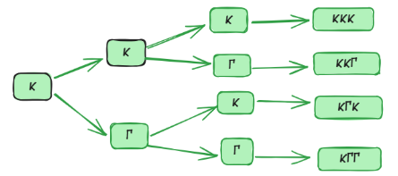

- **Πίνακας Διπλής Εισόδου**: Χρησιμοποιείται συχνά για την ταυτόχρονη ρίψη δύο ζαριών ή νομισμάτων.\
  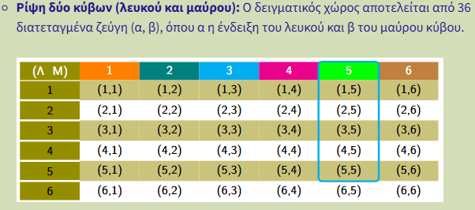{width="543"}

- **Διάγραμμα Venn**: Το βασικό σύνολο Ω παριστάνεται συνήθως με το εσωτερικό ενός ορθογωνίου.\
  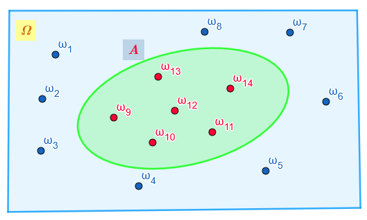{width="408"}

**Χαρακτηριστικά Παραδείγματα**

- **Ρίψη ενός νομίσματος**: $\Omega = \{\kappa, \gamma\}$, όπου $\kappa = \text{κεφαλή}$ και $\gamma = \text{γράμματα}$.

- **Ρίψη ενός ζαριού**: $\Omega = \{1, 2, 3, 4, 5, 6\}$.

- **Φύλο δύο παιδιών**: $\Omega = \{AA, AK, KA, KK\}$.

- **Ρίψη δύο ζαριών**: Περιλαμβάνει 36 ισοπίθανα δειγματικά σημεία της μορφής $(i, j)$ με $i, j \in \{1, \dots, 6\}$.

- **Χρόνος ζωής εξαρτήματος**: $\Omega = [0, +\infty)$.
:::

------------------------------------------------------------------------

### Ενδεχόμενα

::: {style="background-color: #d5f4e6; border: 2px solid #2f3e50; color: #25188a; padding: 15px; border-radius: 5px;"}
Στη μαθηματική γλώσσα των πιθανοτήτων, ένα **ενδεχόμενο** (event) ορίζεται ως οποιοδήποτε **υποσύνολο του δειγματικού χώρου Ω** ενός πειράματος τύχης.
Με άλλα λόγια, είναι ένα σύνολο που περιέχει ένα ή περισσότερα από τα δυνατά αποτελέσματα του πειράματος.

**Πραγματοποίηση Ενδεχομένου**

Ένα ενδεχόμενο $A$ λέμε ότι **πραγματοποιείται** (ή συμβαίνει) κατά την εκτέλεση ενός πειράματος τύχης, αν και μόνο αν το αποτέλεσμα της συγκεκριμένης δοκιμής είναι στοιχείο του συνόλου $A$.
Τα στοιχεία ενός ενδεχομένου ονομάζονται και **ευνοϊκές περιπτώσεις** για την πραγματοποίησή του.

**Κατηγοριοποίηση Ενδεχομένων**

Η κατηγοριοποίηση των ενδεχομένων (υποσύνολα του δειγματικού χώρου $\Omega$) βασίζεται στη δομή τους, στον τρόπο πραγματοποίησής τους και στη σχέση τους με άλλα ενδεχόμενα.

1.  Απλό ή Στοιχειώδες Ενδεχόμενο

Περιέχει **ακριβώς ένα** δειγματικό σημείο (ένα μόνο στοιχείο).

- **Ρίψη νομίσματος:** Το ενδεχόμενο να έρθει "Κεφαλή", $A = \{\kappa\}$.

- **Ρίψη ζαριού:** Το ενδεχόμενο η ένδειξη να είναι ο αριθμός 5, $A = \{5\}$.

- **Επιλογή φύλλου:** Το ενδεχόμενο να επιλεγεί η "Ντάμα Κούπα" από μια τράπουλα 52 φύλλων.

2.  Σύνθετο Ενδεχόμενο

Περιέχει **δύο ή περισσότερα** δειγματικά σημεία.

- **Ρίψη ζαριού:** Το ενδεχόμενο «άρτια ένδειξη», $A = \{2, 4, 6\}$.

- **Ρίψη ζαριού:** Το ενδεχόμενο η ένδειξη να είναι μεγαλύτερη του 3, $B = \{4, 5, 6\}$.

- **Οικογένεια με 3 παιδιά:** Το ενδεχόμενο να γεννηθούν τουλάχιστον δύο αγόρια, $B = \{(\alpha,\alpha,\kappa), (\alpha,\kappa,\alpha), (\kappa,\alpha,\alpha), (\alpha,\alpha,\alpha)\}$.

3.  Βέβαιο Ενδεχόμενο

Είναι ο ίδιος ο δειγματικός χώρος $\Omega$.
Περιέχει όλα τα δυνατά αποτελέσματα και **πραγματοποιείται πάντα**.

- **Ρίψη ζαριού:** Το ενδεχόμενο η ένδειξη να είναι ένας από τους αριθμούς $\{1, 2, 3, 4, 5, 6\}$.

- **Κουτί με σφαίρες:** Αν ένα κουτί περιέχει μόνο άσπρες σφαίρες, το ενδεχόμενο «η σφαίρα που επιλέγουμε είναι άσπρη» είναι βέβαιο.

4.  Αδύνατο Ενδεχόμενο

Είναι το κενό σύνολο $\emptyset$, δεν περιέχει κανένα στοιχείο και **δεν πραγματοποιείται ποτέ**.

- **Ρίψη ζαριού:** Το ενδεχόμενο η ένδειξη να είναι ο αριθμός 7.

- **Τράπουλα:** Το ενδεχόμενο το φύλλο που τραβάμε να είναι ταυτόχρονα "σπαθί" και "καρό".

5.  Ασυμβίβαστα (ή Ξένα) Ενδεχόμενα

Δύο ενδεχόμενα ονομάζονται ασυμβίβαστα όταν η πραγματοποίηση του ενός αποκλείει την πραγματοποίηση του άλλου ($A \cap B = \emptyset$).

- **Ρίψη ζαριού:** Τα ενδεχόμενα $A = \{1\}$ και $B = \{2\}$ είναι ασυμβίβαστα, αφού δεν μπορούν να συμβούν ταυτόχρονα.

- **Επιλογή φύλλου:** Το ενδεχόμενο $A$ «το φύλλο είναι σπαθί» και το $B$ «το φύλλο είναι καρό».

- **Παιχνίδι Τζόκερ:** Το ενδεχόμενο να κερδίσει κάποιος στο Τζόκερ και το ενδεχόμενο να μην κερδίσει.

6.  Συμπληρωματικά (ή Αντίθετα) Ενδεχόμενα

Το συμπλήρωμα $A'$ περιέχει όλα τα στοιχεία του $\Omega$ που **δεν ανήκουν** στο $A$.

- **Ρίψη νομίσματος:** Τα ενδεχόμενα "Κεφαλή" και "Γράμματα" είναι αντίθετα μεταξύ τους.

- **Ρίψη ζαριού:** Αν $A$ είναι το ενδεχόμενο «ένδειξη 1, 2 ή 3», τότε το αντίθετό του $A'$ είναι η ένδειξη «4, 5 ή 6».

- **Μαθητές Λυκείου:** Αν $A$ είναι το ενδεχόμενο «ο μαθητής συμμετέχει στη θεατρική ομάδα», τότε το $A'$ είναι το ενδεχόμενο «ο μαθητής δεν συμμετέχει στη θεατρική ομάδα».

**Σχέσεις Μεταξύ Ενδεχομένων**

- **Ασυμβίβαστα (ή ξένα/αμοιβαίως αποκλειόμενα)**: Δύο ενδεχόμενα ονομάζονται ασυμβίβαστα όταν η πραγματοποίηση του ενός αποκλείει την πραγματοποίηση του άλλου.
  Μαθηματικά, αυτό σημαίνει ότι η τομή τους είναι το κενό σύνολο ($A \cap B = \emptyset$).\
  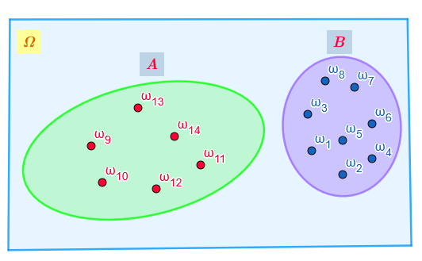{width="381"}

- **Στοχαστικά Ανεξάρτητα**: Δύο ενδεχόμενα είναι ανεξάρτητα όταν η γνώση πραγματοποίησης του ενός δεν επηρεάζει την πιθανότητα πραγματοποίησης του άλλου ($P(A \cap B) = P(A) \cdot P(B)$).
:::

------------------------------------------------------------------------

### Άλγεβρα των ενδεχομένων

::: {style="background-color: #d5f4e6; border: 2px solid #2f3e50; color: #25188a; padding: 15px; border-radius: 5px;"}
Η **άλγεβρα των ενδεχομένων** αποτελεί τη μαθηματική θεμελίωση της μελέτης της αβεβαιότητας, εφαρμόζοντας τις αρχές της **θεωρίας συνόλων** στα αποτελέσματα ενός πειράματος τύχης.
Στο πλαίσιο αυτό, κάθε ενδεχόμενο ορίζεται ως ένα **υποσύνολο του δειγματικού χώρου** $\Omega$, ο οποίος περιλαμβάνει όλα τα δυνατά αποτελέσματα.
Ένα ενδεχόμενο $A$ λέμε ότι **πραγματοποιείται** όταν το αποτέλεσμα της συγκεκριμένης δοκιμής του πειράματος ανήκει στο σύνολο $A$.

Η άλγεβρα των ενδεχομένων χρησιμοποιεί συγκεκριμένες πράξεις για τη δημιουργία νέων, σύνθετων ενδεχομένων:

- **Ένωση (**$A \cup B$): Πραγματοποιείται όταν συμβαίνει **τουλάχιστον ένα** από τα ενδεχόμενα $A$ και $B$.
  Αντιστοιχεί στον λογικό σύνδεσμο «ή» της φυσικής γλώσσας.\
  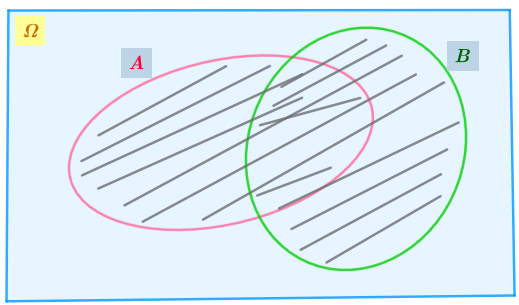{width="293"}

- **Τομή (**$A \cap B$): Πραγματοποιείται όταν συμβαίνουν **ταυτόχρονα** και τα δύο ενδεχόμενα $A$ και $B$.
  Αντιστοιχεί στον λογικό σύνδεσμο «και».\
  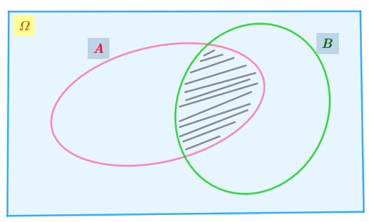{width="296"}

- **Συμπλήρωμα (**$A'$): Πραγματοποιείται όταν **δεν συμβαίνει** το ενδεχόμενο $A$.
  Ονομάζεται και αντίθετο ενδεχόμενο.\
  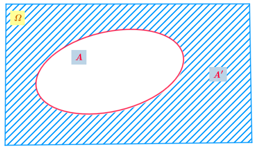{width="310"}

- **Διαφορά (**$A - B$): Πραγματοποιείται όταν συμβαίνει **μόνο το** $A$ (το $A$ και όχι το $B$).
  Ισχύει η ισότητα $A - B = A \cap B'$.\
  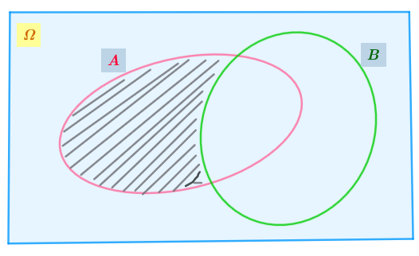{width="312"}

### 4. Ιδιότητες των Πράξεων

Οι πράξεις μεταξύ ενδεχομένων διέπονται από θεμελιώδεις αλγεβρικές ιδιότητες που διευκολύνουν τους υπολογισμούς πιθανοτήτων:\

- **Αντιμεταθετική**: $A \cup B = B \cup A$ και $A \cap B = B \cap A$.

- **Προσεταιριστική**: $(A \cup B) \cup \Gamma = A \cup (B \cup \Gamma)$.

- **Επιμεριστική**: $A \cap (B \cup \Gamma) = (A \cap B) \cup (A \cap \Gamma)$.

- **Ιδιότητες του** $\Omega$ και του $\emptyset$: $A \cup \emptyset = A$, $A \cap \Omega = A$, $A \cup \Omega = \Omega$ και $A \cap \emptyset = \emptyset$.

- **Συμπληρωματικότητα**: $A \cup A' = \Omega$ και $A \cap A' = \emptyset$.
:::

------------------------------------------------------------------------

### Ασκήσεις

1.  Δίνονται δύο ενδεχόμενα Α και Β ενός πειράματος με δειγματικό χώρο Ω. Να παρασταθούν με διαγράμματα Venn και να εκφραστούν με τη βοήθεια συνόλων τα ενδεχόμενα που ορίζονται με τις εκφράσεις:

<!-- -->

i)  Πραγματοποιείται μόνο ένα από τα Α και Β.
ii) Δεν πραγματοποιείται κανένα από τα Α και Β.

> ....
> λίγη βοήθεια $(Α-B) \cup (B-A)$\
> \
> 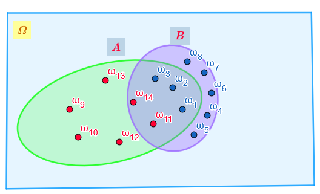{width="364"}
>
> $(A \cup B)'$\
> 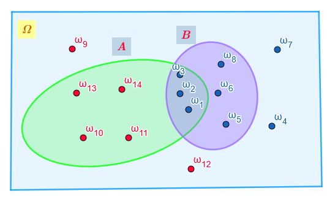{width="369"}

2.  Ποιο από τα παρακάτω πειράματα είναι τύχης και ποιο αιτιοκρατικό;

- α) Η μέτρηση της θερμοκρασίας βρασμού του νερού σε κανονικές συνθήκες,
- β) Η καταγραφή του αριθμού των τροχαίων ατυχημάτων μια συγκεκριμένη Κυριακή.

3.  Ρίχνουμε ένα νόμισμα 4 φορές.
    Να προσδιορίσετε τον δειγματικό χώρο $\Omega$ χρησιμοποιώντας δεντροδιάγραμμα.

4.  Ρίχνουμε δύο ζάρια ταυτόχρονα και καταγράφουμε το αποτέλεσμα ως διατεταγμένο ζεύγος.
    Πόσα στοιχεία έχει ο δειγματικός χώρος $\Omega$;.

5.  ∆ιαθέτουµε τρεις κάρτες αριθµηµένες από το 1 έως το 5.
    Τοποθετούµε τυχαία µια µια τις κάρτες, µέχρι να εµφανιστούν 2 µονές ή 2 ζυγές ενδείξεις.
    Να ϐρείτε

- 

  i.  Το δειγµατικό χώρο του πειράµατος τύχης.

- 

  ii. Το ενδεχόµενο Α να έχουµε τραβήξει µόνο 2 κάρτες.

- 

  iii. Το ενδεχόµενο Β να εµφανιστεί µόνο µια κάρτα µε ζυγή ένδειξη.

**Λύση** - i.
Ο δειγµατικός χώρος προσδιορίζεται από το παρακάτω δεντροδιάγραµµα και είναι το σύνολο Ω = {ZZ,ZMZ,ZMM,MZZ,MZM,MM}\
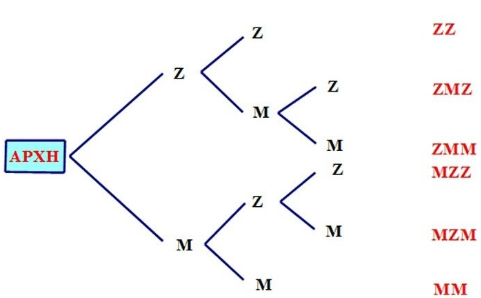\
\
....................................................\
.....................................................

6.  Ένα κουτί περιέχει 4 μπάλες αριθμημένες από το 1 έως το 4. Επιλέγουμε μια μπάλα, καταγράφουμε τον αριθμό της, την ξαναβάζουμε και επιλέγουμε δεύτερη. Βρείτε τον $\Omega$ με πίνακα διπλής εισόδου.\
    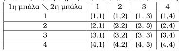

7.  Κατά τη ρίψη ενός ζαριού, θεωρούμε τα ενδεχόμενα $A$: «η ένδειξη είναι 6» και $B$: «η ένδειξη είναι μικρότερη του 4». Χαρακτηρίστε τα ως απλά ή σύνθετα.

8.  Σε μια κάλπη υπάρχουν μόνο κόκκινες σφαίρες. Επιλέγουμε τυχαία μία. Δώστε ένα παράδειγμα βέβαιου και ένα αδύνατου ενδεχομένου.

9.  Έστω $\Omega = \{1, 2, 3, \dots, 10\}$. Να γράψετε με αναγραφή των στοιχείων τους τα ενδεχόμενα $A$: «αριθμός πολλαπλάσιο του 3» και $B$: «αριθμός μεγαλύτερος του 7».

10.  Δίνεται $\Omega = \{1, 2, \dots, 10\}$. Προσδιορίστε το ενδεχόμενο $A = \{x \in \Omega \mid |x-4| \leq 2\}$.

11. Αν σε μια ρίψη ζαριού το αποτέλεσμα είναι 4, ποια από τα ενδεχόμενα $A = \{2, 4, 6\}$ και $B = \{1, 3, 5\}$ πραγματοποιούνται;


12. Έστω $\Omega = \{1, 2, \dots, 10\}$, $A = \{1, 3, 5, 7, 8\}$ και $B = \{2, 4, 6, 8\}$. Βρείτε τα $A \cup B$ και $A \cap B$.

13. Με τα δεδομένα της προηγούμενης άσκησης, βρείτε το $A'$ (αντίθετο του Α) και το $A-B$.

14. Αν $A$: «ο μαθητής παίζει μπάσκετ» και $B$: «ο μαθητής παίζει βόλεϊ», γράψτε συμβολικά τα ενδεχόμενα: 

  - α) παίζει τουλάχιστον ένα άθλημα, 
  - β) παίζει μόνο μπάσκετ, 
  - γ) δεν παίζει κανένα από τα δύο.

15. Σχεδιάστε ένα διάγραμμα Venn που να παριστάνει το ενδεχόμενο «να πραγματοποιηθεί μόνο το ένα από τα $A$ και $B$».

16. Αν $A = \{2, 3, 5\}$, $B = \{1, 3, 5, 6\}$ και $\Omega = \{1, 2, 3, 4, 5, 6\}$, δείξτε ότι $(A \cup B)' = A' \cap B'$.

17. Πότε δύο ενδεχόμενα $A$ και $B$ ονομάζονται ασυμβίβαστα; Ποια είναι η τομή τους σε αυτή την περίπτωση;.

18. Στη ρίψη ενός ζαριού, είναι τα ενδεχόμενα $A = \{1, 2\}$ και $B = \{3, 4\}$ ασυμβίβαστα; Γιατί;.

19. Ένα κουτί έχει τέσσερις μπάλες: μία μπλε, μία κίτρινη, μία πράσινη και μία μωβ. Κάνουμε το εξής πείραμα: παίρνουμε από το κουτί μία μπάλα, καταγράφουμε το χρώμα της και την επανατοποθετούμε στο κουτί. Στη συνέχεια παίρνουμε μια δεύτερη μπάλα και καταγράφουμε επίσης το χρώμα της.
i. Ποιος είναι ο δειγματικός χώρος του πειράματος;
ii. Ποιο είναι το ενδεχόμενο «η πρώτη μπάλα να είναι μπλε»;
iii. Ποιο είναι το ενδεχόμενο «να εξαχθεί και τις δύο φορές μπάλα με το ίδιο χρώμα»;

20. Να λυθεί το προηγούμενο πρόβλημα, χωρίς όμως τώρα να γίνει επανατοποθέτηση της πρώτης μπάλας πριν την εξαγωγή της δεύτερης.

21. Μια παρέα φίλων αποφασίζει να πάει διακοπές είτε στο Πήλιο είτε στη Χαλκιδική. Στο Πήλιο μπορεί να πάει με λεωφορείο ή με αυτοκίνητο. Στη Χαλκιδική μπορεί να πάει με αυτοκίνητο, με τρένο ή με πλοίο. Ως αποτέλεσμα του πειράματος θεωρούμε τον τόπο διακοπών και το μεταφορικό μέσο, τότε:

i. Να γράψετε το δειγματικό χώρο $\Omega$ του πειράματος.
ii. Να βρείτε το ενδεχόμενο $A$: «η παρέα θα πάει με αυτοκίνητο στον τόπο των διακοπών της».

22. Ένα εστιατόριο προσφέρει ένα μενού που αποτελείται από δύο πιάτα: ένα κυρίως και ένα γλυκό. Οι διαθέσιμες επιλογές δίνονται στον παρακάτω πίνακα:

| Πιάτο | Επιλογές |
| :--- | :--- |
| Κυρίως πιάτο | Ψάρι ή Κρέας |
| Γλυκό | Μήλο ή Αχλάδι ή Σταφύλι |

Ένα άτομο πρόκειται να διαλέξει ένα είδος από κάθε πιάτο.

i. Να βρείτε το δειγματικό χώρο του πειράματος.
ii. Να βρείτε το ενδεχόμενο $A$: «το άτομο επιλέγει μήλο».
iii. Να βρείτε το ενδεχόμενο $B$: «το άτομο επιλέγει ψάρι».
iv. Να βρείτε το ενδεχόμενο $A \cap B$.
v. Αν $\Gamma$ το ενδεχόμενο: «το άτομο επιλέγει κρέας», να βρείτε το ενδεχόμενο $(A \cap B) \cup \Gamma$.

23. Η διεύθυνση μιας εταιρείας αξιολογεί τους υπαλλήλους της σύμφωνα με το αν έχουν συμπληρωματική ασφάλεια ή όχι και σύμφωνα με την απόδοσή τους, η οποία χαρακτηρίζεται ως: χαμηλή, μέτρια, υψηλή ή άριστη. Η διεύθυνση καταγράφει με $0$ τον υπάλληλο χωρίς συμπληρωματική ασφάλεια και με $1$ τον ασφαλισμένο, και στη συνέχεια δίπλα γράφει ένα από τα γράμματα $\alpha, \beta, \gamma$ ή $\delta$ ανάλογα με την απόδοσή του. Θεωρούμε το πείραμα της αξιολόγησης ενός νέου υπαλλήλου. Να βρείτε:

i. Το δειγματικό χώρο $\Omega$ του πειράματος.
ii. Το ενδεχόμενο $A$: «η απόδοση του υπαλλήλου είναι υψηλή ή άριστη και είναι ασφαλισμένος».
iii. Το ενδεχόμενο $B$: «η απόδοση του υπαλλήλου είναι χαμηλή ή μέτρια».
iv. Το ενδεχόμενο $\Gamma$: «ο υπάλληλος δεν έχει συμπληρωματική ασφάλεια».

24. Σε καθεμιά από τις παρακάτω περιπτώσεις να εξετάσετε αν τα ενδεχόμενα $A$ και $B$ είναι ασυμβίβαστα:

i. Ρίχνουμε ένα ζάρι. $A$ είναι το ενδεχόμενο να φέρουμε 5 και $B$ είναι το ενδεχόμενο να φέρουμε περιττό αριθμό.
ii. Επιλέγουμε ένα άτομο. $A$ είναι το ενδεχόμενο να έχει γεννηθεί στην Ασία και $B$ το ενδεχόμενο να είναι Ευρωπαίος.
iii. Επιλέγουμε ένα άτομο. $A$ είναι το ενδεχόμενο να είναι κάτω των 20 ετών και $B$ το ενδεχόμενο να είναι συνταξιούχος.
iv. Επιλέγουμε έναν οδηγό. $A$ είναι το ενδεχόμενο ο οδηγός να φοράει ζώνη και $B$ το ενδεχόμενο ο οδηγός να μην φοράει ζώνη.

25. Μεταξύ των οικογενειών με δύο παιδιά επιλέγουμε τυχαία μια οικογένεια και εξετάζουμε τα παιδιά ως προς το φύλο και ως προς τη σειρά γέννησής τους. Να γράψετε το δειγματικό χώρο του πειράματος.

26. Δύο ομάδες θα παίξουν ποδόσφαιρο και συμφωνούν νικητής να είναι εκείνος που πρώτος θα κερδίσει δύο αγώνες. Αν $\alpha$ είναι το αποτέλεσμα να κερδίσει η πρώτη ομάδα έναν αγώνα και $\beta$ είναι το αποτέλεσμα να κερδίσει η δεύτερη ομάδα έναν αγώνα, να γράψετε το δειγματικό χώρο του πειράματος.

27. Ρίχνουμε ένα ζάρι δύο φορές. Να βρείτε τα ενδεχόμενα:

$A$: «το αποτέλεσμα της 1ης ρίψης είναι μικρότερο από το αποτέλεσμα της 2ης ρίψης».

$B$: «το άθροισμα των ενδείξεων στις δύο ρίψεις είναι περιττός αριθμός».

$\Gamma$: «το γινόμενο των ενδείξεων στις δύο ρίψεις είναι μεγαλύτερο του 20».

Στη συνέχεια να βρείτε τα ενδεχόμενα $A \cap B$, $A \cap \Gamma$, $B \cap \Gamma$, $(A \cap B) \cup \Gamma$.


---

::: {style="background-color: #E7CEF0; border: 2px solid #2f3e50; color: #25188a; padding: 15px; border-radius: 5px;"}
:::

::: {.callout-tip style="color: brown;"}
ΚΑΛΗ ΜΕΛΕΤΗ!
:::

\
\
