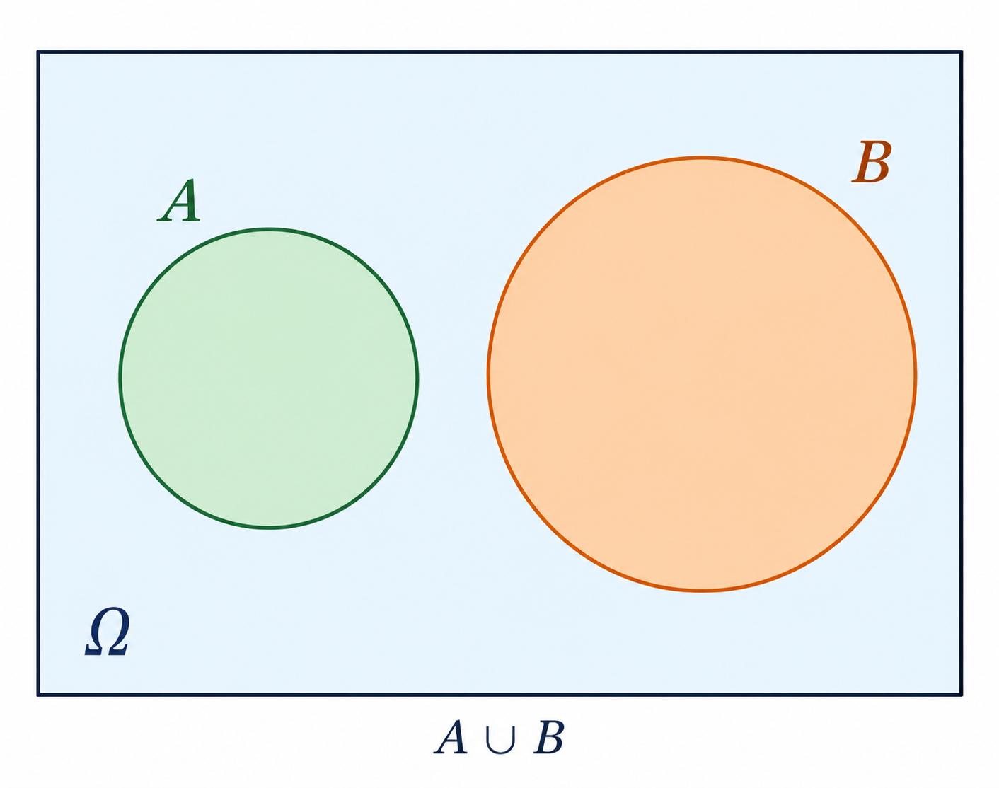
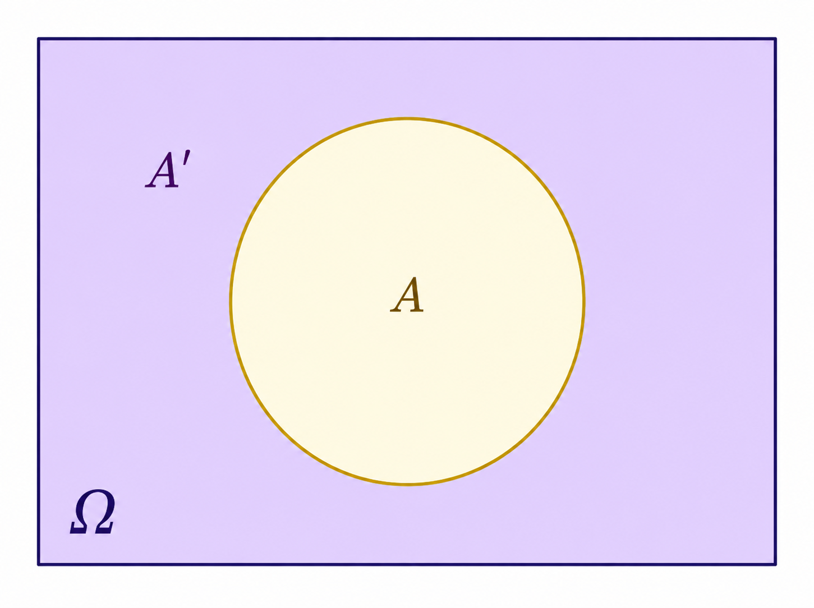
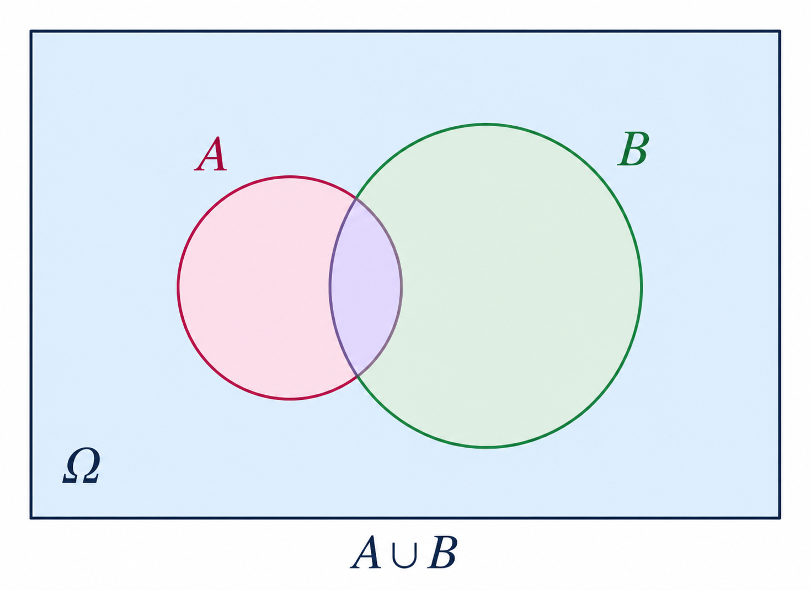
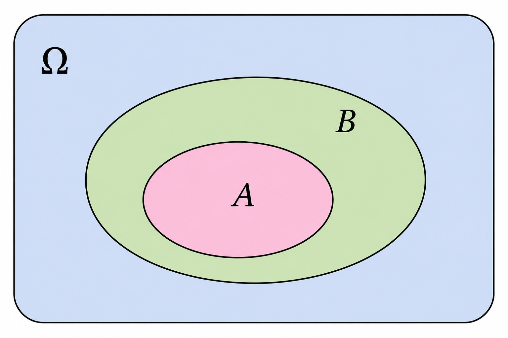
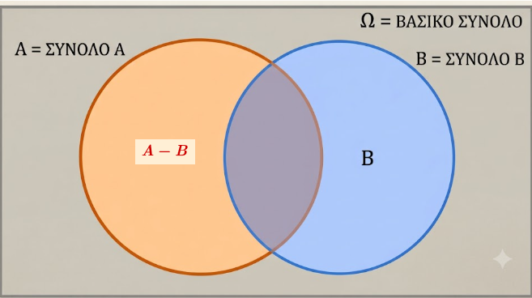
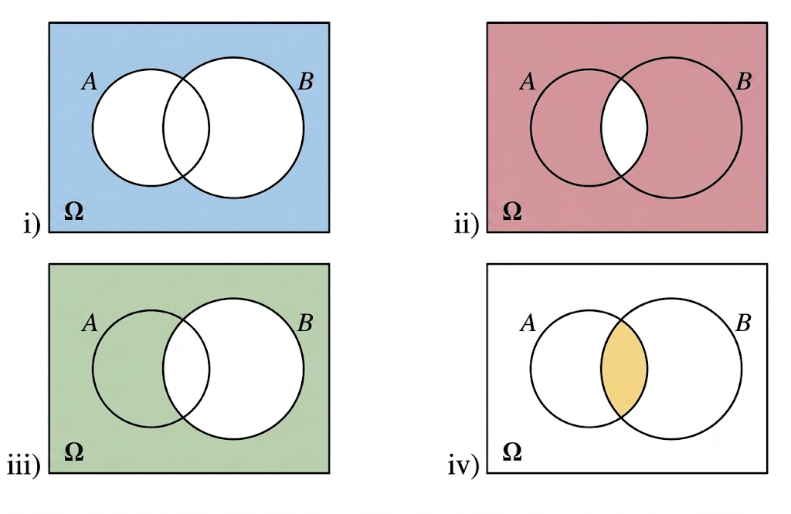

```{=html}
<!-- Φόρτωση βιβλιοθήκης GeoGebra -->
<script src="https://www.geogebra.org/apps/deployggb.js"></script>

<!-- Συνάρτηση δημιουργίας applets -->
<script>
function createGeoGebra(containerId, materialId, width = 700, height = 500) {
  var params = {
    "id": "ggb-" + containerId,
    "material_id": materialId,
    "width": width,
    "height": height,
    "showToolBar": true,
    "showMenuBar": false,
    "showAlgebraInput": true
  };
  
  var applet = new GGBApplet(params, '5.2');
  applet.inject(containerId);
}
</script>
```

## Η έννοια της πιθανότητας

### Έννοια και Ιδιότητες Σχετικής Συχνότητας

::: {style="background-color: #d5f4e6; border: 2px solid #2f3e50; color: #25188a; padding: 15px; border-radius: 5px;"}
Η **σχετική συχνότητα** (relative frequency) αποτελεί μια θεμελιώδη έννοια τόσο στη Στατιστική όσο και στη Θεωρία Πιθανοτήτων, καθώς συνδέει τα εμπειρικά δεδομένα με την έννοια της πιθανότητας.

**Ορισμός**

Η σχετική συχνότητα ορίζεται ως εξής:

- **Στο πλαίσιο των πιθανοτήτων:** Αν σε $\nu$ εκτελέσεις ενός πειράματος τύχης ένα ενδεχόμενο $A$ πραγματοποιείται $\kappa$ φορές, τότε ο λόγος $\dfrac{\kappa}{\nu}$ ονομάζεται σχετική συχνότητα του $A$ και συμβολίζεται με $f_A$.

- Αν ο δειγματικός χώρος ενός πειράματος είναι το πεπερασμένο σύνολο $$Ω=\{ω_1,ω_2,...,ω_μ\}$$ και σε ν εκτελέσεις του πειράματος αυτού τα απλά ενδεχόμενα $$\{ω_1,ω_2,...,ω_μ\}$$ πραγματοποιούνται

$$\{κ_1,{κ_2},...,κ_μ\}$$ φορές αντιστοίχως, τότε για τις σχετικές συχνότητες $$f_1=\dfrac{κ_1}{ν}, f_2=\dfrac{κ_2}{ν}, ........., f_μ=\dfrac{κ_μ}{ν}$$ των απλών ενδεχομένων θα έχουμε τις **Ιδιότητες**:

Οι σχετικές συχνότητες χαρακτηρίζονται από τις εξής ιδιότητες:

1.  **Περιορισμός τιμών:** $0≤ f_i=\dfrac{k_i}{ν}≤1$, i=1,2,...,μ (αφού $0≤ κ_i≤ ν$ )

2.  **Άθροισμα μονάδας:** $f_1+f_2+..... +f_μ=\dfrac{κ_1+κ_2+.....+κ_μ}{ν}=\dfrac{ν}{ν}=1$.

3.  **Έκφραση επί τοις %:** Συχνά οι σχετικές συχνότητες εκφράζονται ως ποσοστά επί τοις εκατό ($f_i\%$), πολλαπλασιάζοντας την τιμή του λόγου επί 100,

- **Στο πλαίσιο της στατιστικής:** Σχετική συχνότητα ($f_i$) μιας τιμής $x_i$ μιας μεταβλητής ονομάζεται ο λόγος της συχνότητας $\nu_i$ (δηλαδή του πλήθους των ατόμων που έχουν την τιμή αυτή) προς την ολική συχνότητα $n$ (το μέγεθος του δείγματος ή του πληθυσμού),. Ο τύπος υπολογισμού είναι: $$f_i = \frac{\nu_i}{n} \text{}$$

**Παραδείγματα**

- **Ρίψη Ζαριού:** Σε ένα πείραμα όπου ρίχτηκε ένα ζάρι 30 φορές, η ένδειξη «1» εμφανίστηκε 5 φορές. Η συχνότητα είναι $\nu_1 = 5$ και η σχετική συχνότητα είναι $f_1 = \dfrac{5}{30} \approx 0,16$ ή $16,6\%$.
- **Οικογένειες και Παιδιά:** Σε δείγμα 100 οικογενειών, βρέθηκε ότι 8 οικογένειες δεν έχουν παιδιά. Η σχετική συχνότητα της τιμής «0 παιδιά» είναι $f = \dfrac{8}{100} = 0,08$ ή $8\%$.
- **Συχνότητα Γκολ:** Καταγράφηκε ο αριθμός των τερμάτων που πέτυχαν 18 ομάδες μια Κυριακή. Αν 6 ομάδες πέτυχαν 1 τέρμα, η σχετική συχνότητα είναι $f = \dfrac{6}{18} \approx 0,333$ ή $33,3\%$.

### Γραφική Παράσταση (ΣΤΑΤΙΣΤΙΚΗ ΠΡΟΗΓΟΥΜΕΝΩΝ ΤΑΞΕΩΝ )

Οι σχετικές συχνότητες μπορούν να αναπαρασταθούν οπτικά με διάφορους τρόπους:

- **Ραβδόγραμμα ή Διάγραμμα Συχνοτήτων:** Χρησιμοποιούνται ράβδοι ή γραμμές με ύψος ανάλογο της σχετικής συχνότητας,.
- **Κυκλικό Διάγραμμα:** Ο κύκλος χωρίζεται σε τομείς των οποίων οι γωνίες είναι ανάλογες των σχετικών συχνοτήτων ($\alpha_i = f_i \cdot 360^\circ$),.
- **Ιστόγραμμα:** Χρησιμοποιείται για ομαδοποιημένα δεδομένα σε κλάσεις, όπου το εμβαδόν κάθε ορθογωνίου είναι ίσο με την αντίστοιχη σχετική συχνότητα,.
:::

------------------------------------------------------------------------

### Η έννοια της πιθανότητας

::: {style="background-color: #d5f4e6; border: 2px solid #2f3e50; color: #25188a; padding: 15px; border-radius: 5px;"}
Η έννοια της **πιθανότητας** αποτελεί ένα «μέτρο προσδοκίας» με το οποίο ποσοτικοποιούμε την αβεβαιότητα για την πραγματοποίηση ενός ενδεχομένου κατά την εκτέλεση ενός πειράματος τύχης.
Η θεωρία πιθανοτήτων παρέχει το αναλυτικό πλαίσιο για τη μελέτη φαινομένων που διέπονται από την τυχαιότητα, μεταβαίνοντας από την εμπειρική διαίσθηση στη μαθηματική ακρίβεια.

**Σχετική Συχνότητα και Νόμος των Μεγάλων Αριθμών**

- Πριν τον αυστηρό μαθηματικό ορισμό, η πιθανότητα προσεγγίζεται μέσω της **σχετικής συχνότητας** ($f_A$).

- **Ορισμός**: Αν σε $v$ εκτελέσεις ενός πειράματος ένα ενδεχόμενο $A$ πραγματοποιείται $\kappa$ φορές, τότε ο λόγος $f_A = \dfrac{\kappa}{v}$ ονομάζεται σχετική συχνότητα.

- **Νόμος των Μεγάλων Αριθμών (Στατιστική Ομαλότητα)**: Όταν ο αριθμός των δοκιμών αυξάνεται απεριόριστα, οι σχετικές συχνότητες σταθεροποιούνται γύρω από ορισμένους αριθμούς, οι οποίοι αποτελούν τις πιθανότητες των ενδεχομένων.

**Κλασικός Ορισμός της Πιθανότητας (Laplace)**

Ο κλασικός ορισμός χρησιμοποιείται όταν ο δειγματικός χώρος $\Omega$ είναι πεπερασμένος και όλα τα αποτελέσματα είναι **ισοπίθανα** (π.χ. ρίψη αμερόληπτου ζαριού).

- **Τύπος**: Η πιθανότητα ενός ενδεχομένου $A$ ισούται με το πηλίκο του πλήθους των ευνοϊκών περιπτώσεων προς το πλήθος των δυνατών περιπτώσεων: $$P(A) = \frac{N(A)}{N(\Omega)}$$.

**Αξιωματικός Ορισμός της Πιθανότητας (Kolmogorov)**

Αποτελεί τη σύγχρονη μαθηματική θεμελίωση.
Σε κάθε απλό ενδεχόμενο $\{\omega_i\}$ αντιστοιχίζεται ένας πραγματικός αριθμός $P(\omega_i)$ ώστε να ισχύουν τα εξής **αξιώματα**:

1.  **Μη αρνητικότητα**: $0 \leq P(\omega_i) \leq 1$ για κάθε $i$.
2.  **Νορμαλισμός**: $P(\omega_1) + P(\omega_2) + \dots + P(\omega_n) = 1$ (ή $P(\Omega) = 1$).
3.  **Προσθετικότητα**: Για οποιαδήποτε ασυμβίβαστα ενδεχόμενα $A$ και $B$, ισχύει $P(A \cup B) = P(A) + P(B)$.

**Βασικές Ιδιότητες και Κανόνες Λογισμού**

- Για οποιαδήποτε **ασυμβίβαστα** μεταξύ τους ενδεχόμενα Α και Β ισχύει:

{width="319"}

$P(AUB)=P(A)+P(B)$

- **Βέβαιο ενδεχόμενο**: $P(\Omega) = 1$.
- **Αδύνατο ενδεχόμενο**: $P(\emptyset) = 0$.
- **Περιορισμός τιμών**: Για κάθε ενδεχόμενο $A$, ισχύει $0 \leq P(A) \leq 1$.
- **Συμπληρωματικό ενδεχόμενο**: $P(A') = 1 - P(A)$.\
  {width="307"}
- **Προσθετικός νόμος**: Για δύο τυχαία ενδεχόμενα $A$ και $B$, $P(A \cup B) = P(A) + P(B) - P(A \cap B)$.\
  {width="307"}
- **Σχέση υποσυνόλου**: Αν $A \subseteq B$, τότε $P(A) \leq P(B)$.\
  {width="312"}\
  \
- Για δύο ενδεχόμενα Α και Β ενός δειγματικού χώρου Ω ισχύει:

$P(A-B)=P(A)-P(A∩B)$\
{width="321"}

**Χαρακτηριστικά Παραδείγματα**

1.  **Ρίψη αμερόληπτου ζαριού**: Ο δειγματικός χώρος είναι $\Omega = \{1, 2, 3, 4, 5, 6\}$. Το ενδεχόμενο $A$ «άρτια ένδειξη» είναι το $\{2, 4, 6\}$. Η πιθανότητα είναι $P(A) = 3/6 = 0,5$.
2.  **Κουτί με χρωματιστές σφαίρες**: Αν ένα κουτί έχει 2 κόκκινες, 4 μπλε και 5 άσπρες μπάλες ($N(\Omega)=11$), η πιθανότητα να επιλέξουμε κόκκινη είναι $P(K) = 2/11$.
3.  **Τράπουλα**: Η πιθανότητα να τραβήξουμε τυχαία μια «Ντάμα» από μια τράπουλα 52 φύλλων είναι $4/52 = 1/13$, ενώ η πιθανότητα για «Ντάμα Κούπα» είναι $1/52$.
4.  **Οικογένεια με παιδιά**: Σε οικογένεια με 3 παιδιά, η πιθανότητα να γεννηθεί τουλάχιστον ένα αγόρι υπολογίζεται πιο εύκολα μέσω του συμπληρώματος (1 - πιθανότητα για 3 κορίτσια): $1 - 1/8 = 7/8$.
5.  **Σύνθετο πείραμα (δύο ζάρια)**: Η πιθανότητα να φέρουμε άθροισμα 7 στη ρίψη δύο ζαριών ($N(\Omega)=36$) είναι $6/36 = 1/6$, καθώς οι ευνοϊκές περιπτώσεις είναι οι $\{(1,6), (6,1), (2,5), (5,2), (3,4), (4,3)\}$.
:::

------------------------------------------------------------------------

### Ασκήσεις

1.  Ρίχνουμε δύο “αμερόληπτα” ζάρια. Να βρεθεί:

- Α. η πιθανότητα να φέρουμε ως αποτέλεσμα "Το άθροισμα των ενδείξεων των ζαριών να είναι 8"
- Β. η πιθανότητα να φέρουμε ως αποτέλεσμα "Το γινόμενο των ενδείξεων των ζαριών να είναι 12".
- Γ. η πιθανότητα να φέρουμε ως αποτέλεσμα "Η διαφορά των ενδείξεων των ζαριών να είναι 2"
- Δ. η πιθανότητα να φέρουμε ως αποτέλεσμα "Το πηλίκο των ενδείξεων των ζαριών να είναι 3"

> Κάντε έναν πίνακα διπλής εισόδου για να βρείτε τον δειγματικό χώρο

2.  Για δύο ενδεχόμενα Α και Β ενός δειγματικού χώρου Ω δίνονται P(A)=0,6 , P(B)=0,3 και P(A∩B)=0,1. Να βρεθεί η πιθανότητα των ενδεχομένων:

- 

  i.  Να μην πραγματοποιηθεί κανένα από τα Α και Β.

- 

  ii. Να πραγματοποιηθεί μόνο ένα από τα Α και Β.

- 

  iii. Να πραγματοποιηθεί είτε το Α είτε το Β.

3.  Για δύο ενδεχόμενα $A$ και $B$ ενός δειγματικού χώρου $\Omega$ ισχύουν $P(A) = 0,7$ και $P(B) = 0,4$.

**i)** Να εξεταστεί αν τα $A$ και $B$ είναι ασυμβίβαστα.

**ii)** Να αποδείξετε ότι $0,1 \leq P(A \cap B) \leq 0,4$.

**Λύση**

***i) Εξέταση αν είναι ασυμβίβαστα***

Αν δύο ενδεχόμενα $A$ και $B$ είναι ασυμβίβαστα, τότε δεν έχουν κοινά στοιχεία (η τομή τους είναι το κενό σύνολο, $A \cap B = \emptyset$) και η πιθανότητα της ένωσής τους δίνεται από τον απλό προσθετικό νόμο:

$$P(A \cup B) = P(A) + P(B)$$

Αν υποθέσουμε ότι τα $A$ και $B$ είναι ασυμβίβαστα, τότε:

$$P(A \cup B) = 0,7 + 0,4 = 1,1$$

> **Σφάλμα:** Αυτό είναι αδύνατο, καθώς η πιθανότητα οποιουδήποτε ενδεχομένου δεν μπορεί να ξεπερνάει το $1$ ($P(A \cup B) \leq 1$).

Επομένως, η υπόθεσή μας ήταν λανθασμένη.
Τα ενδεχόμενα $A$ και $B$ **δεν είναι ασυμβίβαστα**

***ii) Απόδειξη της ανισότητας*** $0,1 \leq P(A \cap B) \leq 0,4$

Για να αποδείξουμε μια διπλή ανισότητα, τη σπάμε σε δύο μέρη:

**1. Απόδειξη του άνω ορίου:** $P(A \cap B) \leq 0,4$

Η τομή $A \cap B$ είναι υποσύνολο τόσο του $A$ όσο και του $B$.
Επομένως, η πιθανότητα της τομής δεν μπορεί να είναι μεγαλύτερη από την πιθανότητα του μικρότερου συνόλου.

- Επειδή $A \cap B \subseteq B$, ισχύει:

$$P(A \cap B) \leq P(B) \Rightarrow P(A \cap B) \leq 0,4$$

**2. Απόδειξη του κάτω ορίου:** $0,1 \leq P(A \cap B)$ Γνωρίζουμε από τον γενικό προσθετικό νόμο ότι:

$$P(A \cup B) = P(A) + P(B) - P(A \cap B)$$

Λύνοντας ως προς την τομή, έχουμε:

$$P(A \cap B) = P(A) + P(B) - P(A \cup B)$$

Επειδή για οποιοδήποτε ενδεχόμενο ισχύει $P(A \cup B) \leq 1$, αν αντικαταστήσουμε το $P(A \cup B)$ με τη μέγιστη τιμή του ($1$), θα πάρουμε την ελάχιστη δυνατή τιμή για την τομή:

$$P(A \cap B) \geq P(A) + P(B) - 1$$

$$P(A \cap B) \geq 0,7 + 0,4 - 1$$

$$P(A \cap B) \geq 1,1 - 1 \Rightarrow P(A \cap B) \geq 0,1$$

Συνδυάζοντας τα δύο αποτελέσματα, αποδείχθηκε ότι:

$$0,1 \leq P(A \cap B) \leq 0,4$$

4.  Χρησιμοποιήστε τις πράξεις των συνόλων για να περιγράψετε τα χρωματισμένα μέρη στα παρακάτω σχήματα (Venn).




5.  Τα συμπληρωματικά δύο ενδεχόμενων είναι ξένα μεταξύ τους;

> κάντe το διάγραμμα Venn

6.  Αν ρίξουμε δύο δίκαια (συνήθη) ζάρια και προσθέσουμε τις ενδείξεις τους, το άθροισμα μπορεί να είναι ένας **άρτιος** αριθμός (δηλαδή 2, 4, 6, 8, 10, 12) ή ένας **περιττός (μονός)** αριθμός (δηλαδή 3, 5, 7, 9, 11).

Ένας μαθητής ισχυρίζεται το εξής:
*«Εφόσον έχουμε 6 δυνατά άρτια αθροίσματα και 5 δυνατά περιττά αθροίσματα, η πιθανότητα να φέρουμε άρτιο άθροισμα είναι $\dfrac{6}{11}$ και η πιθανότητα να φέρουμε περιττό είναι $\dfrac{5}{11}$».*

**Τι είναι λάθος στο επιχείρημα αυτό; Ποιο είναι το σωστό;**

***Λύση***

**Τι είναι λάθος:**

Το λάθος στο επιχείρημα του μαθητή είναι ότι αντιμετωπίζει τα δυνατά αθροίσματα (τις τιμές από το 2 έως το 12) ως **ισοπίθανα ενδεχόμενα**.

Στην πραγματικότητα, κάθε άθροισμα δεν έχει την ίδια πιθανότητα να εμφανιστεί. Για παράδειγμα, το άθροισμα $2$ μπορεί να προκύψει μόνο με έναν τρόπο (να φέρουμε 1 στο πρώτο ζάρι και 1 στο δεύτερο: $(1,1)$). Αντίθετα, το άθροισμα $3$ μπορεί να προκύψει με δύο τρόπους ($(1,2)$ ή $(2,1)$), ενώ το άθροισμα $7$ μπορεί να προκύψει με έξι διαφορετικούς τρόπους. Επομένως, δεν μπορούμε απλά να μετρήσουμε το πλήθος των αθροισμάτων για να βρούμε την πιθανότητα.

**Ποιο είναι το σωστό:**

Για να βρούμε τη σωστή πιθανότητα, πρέπει να εξετάσουμε τον πραγματικό δειγματικό χώρο $\Omega$ του πειράματος, ο οποίος αποτελείται από όλα τα δυνατά ζευγάρια ενδείξεων των δύο ζαριών.

Αφού κάθε ζάρι έχει 6 έδρες, το πλήθος των ισοπίθανων αποτελεσμάτων είναι:


$$N(\Omega) = 6 \times 6 = 36$$

Αν καταγράψουμε όλους τους 36 δυνατούς συνδυασμούς, θα διαπιστώσουμε ότι:

* Οι συνδυασμοί που δίνουν **άρτιο άθροισμα** είναι ακριβώς **18** (π.χ. $(1,1), (1,3), (1,5), (2,2), \dots$).

* Οι συνδυασμοί που δίνουν **περιττό άθροισμα** είναι επίσης ακριβώς **18** (π.χ. $(1,2), (1,4), (1,6), (2,1), \dots$).

Επομένως, οι σωστές πιθανότητες είναι:

* Πιθανότητα για άρτιο άθροισμα: $P(\text{Άρτιο}) = \dfrac{18}{36} = \dfrac{1}{2} = 50\%$

* Πιθανότητα για περιττό άθροισμα: $P(\text{Περιττό}) = \dfrac{18}{36} = \dfrac{1}{2} = 50\%$

7.  Αν δύο ενδεχόμενα $A$ και $B$ είναι ασυμβίβαστα (ξένα μεταξύ τους), είναι απαραίτητα και συμπληρωματικά;

**Απάντηση / Επεξήγηση:**

**Όχι, δεν είναι απαραίτητα συμπληρωματικά.**

* **Γιατί:** Για να είναι δύο ενδεχόμενα συμπληρωματικά, πρέπει να ικανοποιούν *δύο* συνθήκες ταυτόχρονα: να είναι ξένα μεταξύ τους ($A \cap B = \emptyset$) **και** η ένωσή τους να ισούται με ολόκληρο τον δειγματικό χώρο ($A \cup B = \Omega$).

* **Παράδειγμα:** Αν ρίξουμε ένα ζάρι, ο δειγματικός χώρος είναι $\Omega = \{1, 2, 3, 4, 5, 6\}$. Ας πάρουμε τα ενδεχόμενα $A = \{1\}$ (να φέρουμε 1) και $B = \{2\}$ (να φέρουμε 2). Τα ενδεχόμενα αυτά είναι ξένα μεταξύ τους ($A \cap B = \emptyset$), αλλά δεν είναι συμπληρωματικά, καθώς η ένωσή τους είναι $A \cup B = \{1, 2\} \neq \Omega$.

8.  Αν δύο ενδεχόμενα $A$ και $B$ είναι συμπληρωματικά, τότε τι μπορείτε να πείτε για την τομή των συμπληρωματικών τους ενδεχομένων $A'$ και $B'$;

**Απάντηση / Επεξήγηση:**

**Η τομή τους είναι το κενό σύνολο ($A' \cap B' = \emptyset$).**

* **Γιατί:** Εφόσον τα $A$ και $B$ είναι συμπληρωματικά, εξ ορισμού ισχύει ότι $B = A'$ και $A = B'$.

* Αντικαθιστώντας αυτά στη ζητούμενη τομή, έχουμε:

$$A' \cap B' = B \cap A = A \cap B$$


* Όμως, επειδή τα $A$ και $B$ είναι εξ αρχής συμπληρωματικά, γνωρίζουμε ότι είναι ξένα μεταξύ τους, δηλαδή $A \cap B = \emptyset$. Συνεπώς, και η τομή των συμπληρωματικών τους είναι το κενό σύνολο ($A' \cap B' = \emptyset$).


9.  Από μια τράπουλα με 52 φύλλα παίρνουμε ένα στην τύχη. Να βρείτε τις πιθανότητες των ενδεχομένων:

* **i)** το χαρτί να είναι Ρήγας (Κ).
* **ii)** το χαρτί να είναι Ρήγας χρώματος κόκκινου (Κ).
* **iii)**  Το χαρτί να φέρει αριθμό $\le$ του 5.

10. Να βρείτε την πιθανότητα στη ρίψη δύο νομισμάτων να εμφανιστεί μια «κεφαλή» και μια «γράμματα» (ανεξαρτήτως σειράς).


11. Ένα κουτί περιέχει μολύβια: 8 μπλε, 12 κόκκινα, 6 πράσινα και 4 κίτρινα. Παίρνουμε τυχαίως ένα μολύβι. Να βρείτε τις πιθανότητες των ενδεχομένων το μολύβι να είναι:

* **i)** κόκκινο.
* **ii)** μπλε ή κίτρινο.
* **iii)** ούτε πράσινο ούτε κίτρινο.

12. Σε μια ομάδα από 40 εργαζόμενους, ρωτήθηκαν πόσα αυτοκίνητα έχει η οικογένειά τους. Οι απαντήσεις τους φαίνονται στον επόμενο πίνακα:

| Αριθμός εργαζομένων | 5 | 18 | 12 | 4 | 1 |
| --- | --- | --- | --- | --- | --- |
| Αριθμός αυτοκινήτων | 0 | 1 | 2 | 3 | 4 |

Αν επιλέξουμε τυχαία έναν εργαζόμενο, να βρείτε την πιθανότητα η οικογένειά του να έχει συνολικά δύο αυτοκίνητα.

13. Έστω τα σύνολα $\Omega = \{ \omega \in \mathbb{N} \mid 1 \leq \omega \leq 15 \}$, $A = \{ \omega \in \Omega \mid \omega \text{ πολλαπλάσιο του 2} \}$ και $B = \{ \omega \in \Omega \mid \omega \text{ πολλαπλάσιο του 5} \}$. Αν επιλέξουμε τυχαίως ένα στοιχείο του $\Omega$, να βρείτε τις πιθανότητες:

* **i)** να ανήκει στο $A$.
* **ii)** να μην ανήκει στο $B$.

14. Σε ένα τουρνουά σκακιού η πιθανότητα να κερδίσει ο Γιάννης είναι $25\%$, η πιθανότητα να κερδίσει ο Κώστας είναι $35\%$ και η πιθανότητα να κερδίσει ο Δημήτρης είναι $15\%$. Να βρείτε την πιθανότητα:

* **i)** να κερδίσει ο Γιάννης ή ο Κώστας.
* **ii)** να μην κερδίσει ο Γιάννης ή ο Δημήτρης.


15. Για τα ενδεχόμενα $A$ και $B$ ενός δειγματικού χώρου $\Omega$ ισχύουν $P(A) = \dfrac{11}{20}$, $P(B) = \dfrac{2}{5}$ και $P(A \cup B) = \dfrac{3}{4}$. Να βρείτε την $P(A \cap B)$.


16. Για τα ενδεχόμενα $A$ και $B$ ενός δειγματικού χώρου $\Omega$ ισχύουν $P(B) = \dfrac{1}{3}$, $P(A \cup B) = \dfrac{7}{12}$ και $P(A \cap B) = \dfrac{1}{6}$. Να βρείτε την $P(A)$.

17. Για τα ενδεχόμενα $A$ και $B$ του ίδιου δειγματικού χώρου είναι γνωστό ότι $P(A) = P(B)$, $P(A \cup B) = 0,8$ και $P(A \cap B) = 0,3$. Να βρείτε την $P(B)$.

18. Για τα ενδεχόμενα $A$ και $B$ του ίδιου δειγματικού χώρου $\Omega$ δίνεται ότι $P(B) = \dfrac{1}{2}$, $P(A') = \dfrac{3}{5}$ και $P(A \cap B) = \dfrac{1}{10}$. Να βρείτε την $P(A \cup B)$.

19. Για δύο ενδεχόμενα $A$ και $B$ του ίδιου δειγματικού χώρου $\Omega$ να δείξετε ότι $P(A) \leq P(A \cup B)$.


20. Ένα γραφείο ενοικίασης αυτοκινήτων διαθέτει οχήματα με χειροκίνητο (M) ή αυτόματο (A) κιβώτιο ταχυτήτων. Το $40\%$ των πελατών επιλέγει χειροκίνητο, το $50\%$ επιλέγει αυτόματο και το $10\%$ νοικιάζει κατά καιρούς και τους δύο τύπους. Ποια είναι η πιθανότητα ένας πελάτης που επιλέγεται τυχαία να έχει νοικιάσει τουλάχιστον έναν από τους δύο τύπους κιβωτίου;

21. Το $15\%$ των φοιτητών ενός πανεπιστημίου μιλάει Ισπανικά, το $8\%$ μιλάει Ιταλικά και το $3\%$ μιλάει και τις δύο γλώσσες. Για έναν φοιτητή που επιλέγεται τυχαία ποια είναι η πιθανότητα να μιλάει:

* **α)** τουλάχιστον μία από τις δύο γλώσσες;
* **β)** μόνο μία από τις δύο γλώσσες;

22. Σε μια κατασκήνωση το $70\%$ των παιδιών συμμετέχει στο ποδόσφαιρο, το $40\%$ στο μπάσκετ και το $25\%$ και στα δύο αθλήματα. Επιλέγουμε τυχαίως ένα παιδί. Να βρείτε την πιθανότητα να μη συμμετέχει σε κανένα από τα δύο αθλήματα.

**Λύση**

**Δεδομένα της Άσκησης:**

* Ποσοστό παιδιών στο ποδόσφαιρο: $70\%$
* Ποσοστό παιδιών στο μπάσκετ: $40\%$
* Ποσοστό παιδιών και στα δύο αθλήματα: $25\%$

**Βήμα 1: Ορισμός ενδεχομένων και πιθανοτήτων**

Ορίζουμε τα ενδεχόμενα για ένα τυχαία επιλεγμένο παιδί:

* $A$: «Το παιδί συμμετέχει στο ποδόσφαιρο», με πιθανότητα $P(A) = 70\% = 0,70$

* $B$: «Το παιδί συμμετέχει στο μπάσκετ», με πιθανότητα $P(B) = 40\% = 0,40$

Η συμμετοχή και στα δύο αθλήματα εκφράζεται από την **τομή** των ενδεχομένων ($A \cap B$):

* $P(A \cap B) = 25\% = 0,25$

**Βήμα 2: Εύρεση της πιθανότητας να συμμετέχει σε τουλάχιστον ένα άθλημα**

Το ενδεχόμενο ένα παιδί να συμμετέχει στο ποδόσφαιρο **ή** στο μπάσκετ (δηλαδή σε τουλάχιστον ένα από τα δύο) εκφράζεται από την **ένωση** των ενδεχομένων ($A \cup B$).

Χρησιμοποιούμε τον προσθετικό νόμο των πιθανοτήτων:


$$P(A \cup B) = P(A) + P(B) - P(A \cap B)$$

Αντικαθιστούμε τις τιμές:


$$P(A \cup B) = 0,70 + 0,40 - 0,25$$

$$P(A \cup B) = 1,10 - 0,25 = 0,85 \quad (\text{ή } 85\%)$$

**Βήμα 3: Εύρεση της πιθανότητας να μη συμμετέχει σε κανένα άθλημα**

Το ενδεχόμενο να μη συμμετέχει σε κανένα από τα δύο αθλήματα είναι το **συμπληρωματικό** του να συμμετέχει σε τουλάχιστον ένα. Δηλαδή, αναζητούμε την πιθανότητα $P((A \cup B)')$.

Γνωρίζουμε ότι η πιθανότητα ενός συμπληρωματικού ενδεχομένου δίνεται από τη σχέση:


$$P((A \cup B)') = 1 - P(A \cup B)$$

Αντικαθιστούμε τη τιμή που βρήκαμε στο προηγούμενο βήμα:


$$P((A \cup B)') = 1 - 0,85 = 0,15 \quad (\text{ή } 15\%)$$

**Απάντηση:**

Η πιθανότητα ένα παιδί που επιλέγεται τυχαία να μη συμμετέχει σε κανένα από τα δύο αθλήματα είναι **$0,15$** ή **$15\%$**.

23. Αν για τα ενδεχόμενα $A$ και $B$ ενός δειγματικού χώρου $\Omega$ έχουμε $P(A)=x$, $P(B)=y$ και $P(A \cap B)=z$, να βρείτε εκφρασμένες με τη βοήθεια των $x, y, z$ τις πιθανότητες:

* **i)** να μην πραγματοποιηθεί κανένα από τα $A$ και $B$.
* **ii)** να πραγματοποιηθεί τουλάχιστον ένα από τα $A$ και $B$.
* **iii)** να πραγματοποιηθεί μόνο το $A$ ή μόνο το $B$.

24. Σε μια εταιρεία το $20\%$ των εργαζομένων δεν μιλάνε Αγγλικά, το $35\%$ δεν μιλάνε Γαλλικά και το $15\%$ δεν μιλάνε ούτε Αγγλικά ούτε Γαλλικά. Επιλέγουμε τυχαίως έναν εργαζόμενο. Να βρείτε την πιθανότητα να μιλάει και Αγγλικά και Γαλλικά.

25. Αν $\dfrac{P(A)}{P(A')} = \dfrac{2}{3}$, να βρείτε τις πιθανότητες $P(A)$ και $P(A')$.

26. Αν $0 < P(A) < 1$, να αποδείξετε ότι:


$$P(A) + \dfrac{1}{P(A)} \geq 2$$

*(Σημείωση: Μια εξαιρετική εναλλακτική με την ίδια ακριβώς αλγεβρική δομή είναι να δειχθεί ότι $P(A) \cdot P(A') \leq \dfrac{1}{4}$)*

27. Αν $A$ και $B$ είναι ενδεχόμενα του ίδιου δειγματικού χώρου $\Omega$ με $P(A)=0,5$ και $P(B)=0,8$, να δείξετε ότι:


$$0,3 \leq P(A \cap B) \leq 0,5$$

28. Για δύο ενδεχόμενα $A$ και $B$ του ίδιου δειγματικού χώρου $\Omega$ να δείξετε ότι:


$$P(A) - P(B') \leq P(A \cap B)$$

29.  Ένα κουτί περιέχει 10 κόκκινες, 15 πράσινες, 20 γκρι, 5 μαύρες και 30 άσπρες μπάλες. Επιλέγουμε μία τυχαία. Βρείτε την πιθανότητα να είναι:

  - α) κόκκινη, 
  - β) μαύρη, 
  - γ) άσπρη.

30.  Ρίχνουμε ένα αμερόληπτο ζάρι. Βρείτε την πιθανότητα των ενδεχομένων: 

  - Α: «ένδειξη μικρότερη του 5», 
  - Β: «άρτια ένδειξη μεγαλύτερη ή ίση του 4».

31.  Γράφουμε έναν φυσικό αριθμό από το 1 έως το 30. Ποια είναι η πιθανότητα να είναι:

  - α) πολλαπλάσιο του 3, 
  - β) πολλαπλάσιο του 4, 
  - γ) πολλαπλάσιο του 6;

32.  Ρίχνουμε ένα νόμισμα 3 φορές. Βρείτε την πιθανότητα: 

  - α) να έχουμε ακριβώς 2 κορώνες, 
  - β) τουλάχιστον 2 γράμματα.

33.  Ρίχνουμε δύο ζάρια ταυτόχρονα. Ποια είναι η πιθανότητα το άθροισμα των ενδείξεων να είναι 7;

34.  Από μια τράπουλα 52 φύλλων επιλέγουμε ένα στην τύχη. Βρείτε την πιθανότητα να είναι: 

  - α) Βαλές, 
  - β) Ντάμα Κούπα.
  
35.  Σε μια οικογένεια με 3 παιδιά, ποια είναι η πιθανότητα να υπάρχει τουλάχιστον ένα αγόρι;

> (Υπόδειξη: Χρησιμοποιήστε το συμπληρωματικό ενδεχόμενο).

36.  Για δύο ενδεχόμενα $A$ και $B$ ισχύει $P(A) = P(B)$, $P(A \cup B) = 0,6$ και $P(A \cap B) = 0,2$. Να βρείτε την $P(A)$.

37.  Αν $P(B') = 3/4$, $P(A \cup B) = 3/5$ και $P(A \cap B) = 3/10$, υπολογίστε τις $P(B)$ και $P(A)$.

38. Αν $P(A) = 0,4$, $P(B) = 0,3$ και $P(A \cap B) = 0,1$, βρείτε την πιθανότητα να πραγματοποιηθεί: 

  - α) μόνο το $A$, 
  - β) μόνο ένα από τα $A$ και $B$.
  
39. Με τα δεδομένα της προηγούμενης άσκησης ($P(A)=0,4, P(B)=0,3, P(A \cap B)=0,1$), βρείτε την πιθανότητα να μην πραγματοποιηθεί κανένα από τα $A$ και $B$.


40. Άν $P(A') \leq 11/25$ και $P(B') \leq 13/25$, δείξτε ότι η τομή τους $A \cap B$ δεν είναι το κενό σύνολο.

41. Αν $P(A) = 1/4$, $P(B) = 1/3$ και $P(A \cap B) = 1/6$, βρείτε την πιθανότητα της ένωσης $P(A \cup B)$.

42. Αν $P(A) = 0,7$ και $P(B) = 0,6$, δείξτε ότι τα $A$ και $B$ **δεν** είναι ασυμβίβαστα.

43. Αν $A, B$ είναι ασυμβίβαστα με $P(A \cup B) = 14/17$ και $P(A)/P(B) = 3/4$, να βρείτε τις $P(A)$ και $P(B)$.

44. Επιλέγουμε ένα φύλλο από τράπουλα. Έστω $A$ το ενδεχόμενο να είναι σπαθί και $B$ να είναι καρό. Είναι ασυμβίβαστα; Ποια είναι η $P(A \cup B)$;

45. Σε μια τάξη 28 μαθητών, τα μισά αγόρια και τα μισά κορίτσια έχουν υπολογιστή. Αν η πιθανότητα ένα αγόρι να μην έχει υπολογιστή είναι 3/14, βρείτε πόσα είναι τα κορίτσια.

46. Σε ένα σχολείο το 80% μαθαίνει Αγγλικά, το 30% Γαλλικά και το 20% και τις δύο γλώσσες. Επιλέγουμε τυχαία έναν μαθητή. Ποια η πιθανότητα να μη μαθαίνει καμία από τις δύο γλώσσες;

47. Το 10% ενός πληθυσμού έχει υπέρταση, το 6% καρδιακή νόσο και το 2% και τα δύο. Βρείτε την πιθανότητα ένα τυχαίο άτομο να έχει τουλάχιστον μία από τις δύο ασθένειες.

48. Οι πιθανότητες $P(A)$ και $P(B)$ είναι ρίζες της εξίσωσης $6x^2 - x - 1 = 0$. Αν $P(A) < P(B)$ και $P(A \cap B) = 1/6$, υπολογίστε την $P(A \cup B)$.

---


::: {style="background-color: #E7CEF0; border: 2px solid #2f3e50; color: #25188a; padding: 15px; border-radius: 5px;"}
:::

::: {.callout-tip style="color: brown;"}
ΚΑΛΗ ΜΕΛΕΤΗ!
:::

\
\
